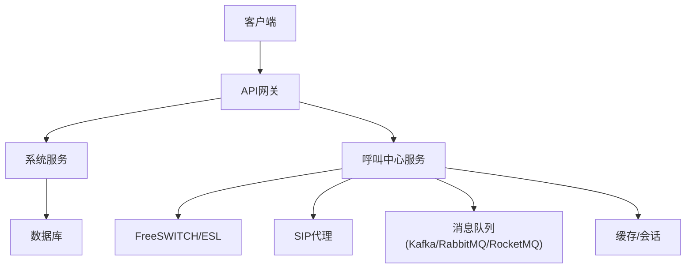
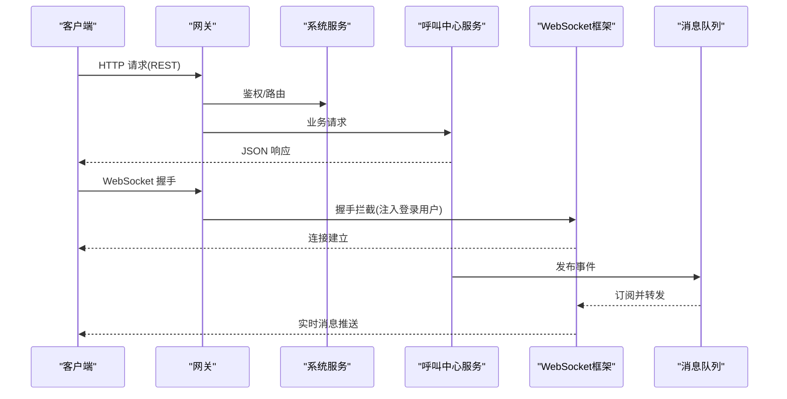
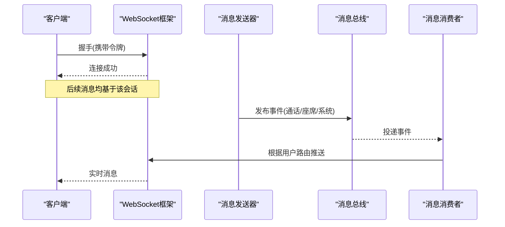
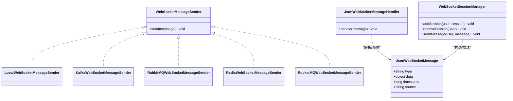
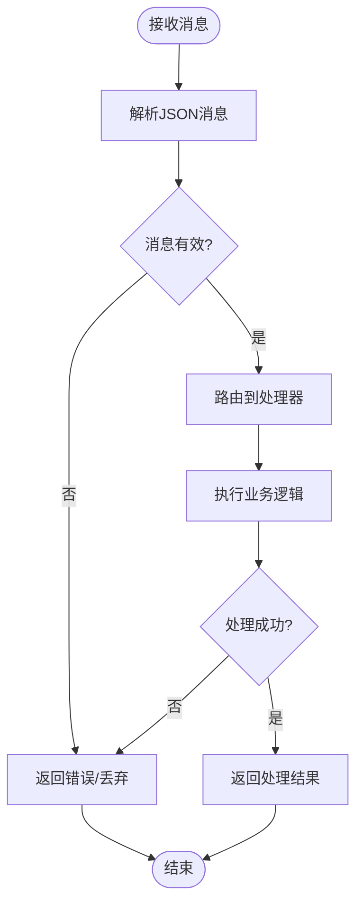
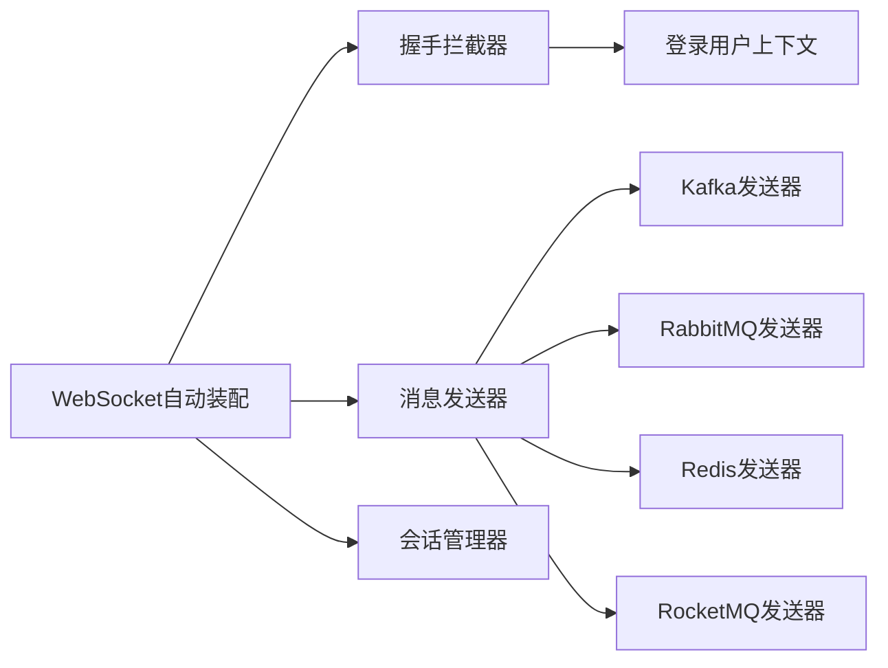

# API接口文档

<cite>
**本文引用的文件**
- [yudao-module-cc-api/ApiConstants.java](file://yudao-cloud/yudao-module-cc-api/src/main/java/cn/iocoder/yudao/module/cc/enums/ApiConstants.java)
- [yudao-module-cc-api/ErrorCodeConstants.java](file://yudao-cloud/yudao-module-cc-api/src/main/java/cn/iocoder/yudao/module/cc/enums/ErrorCodeConstants.java)
- [yudao-module-system-api/ApiConstants.java](file://yudao-cloud/yudao-module-system-api/src/main/java/cn/iocoder/yudao/module/system/enums/ApiConstants.java)
- [yudao-framework/yudao-spring-boot-starter-websocket/config/WebSocketProperties.java](file://yudao-cloud/yudao-framework/yudao-spring-boot-starter-websocket/src/main/java/cn/iocoder/yudao/framework/websocket/config/WebSocketProperties.java)
- [yudao-framework/yudao-spring-boot-starter-websocket/core/security/LoginUserHandshakeInterceptor.java](file://yudao-cloud/yudao-framework/yudao-spring-boot-starter-websocket/src/main/java/cn/iocoder/yudao/framework/websocket/core/security/LoginUserHandshakeInterceptor.java)
- [yudao-framework/yudao-spring-boot-starter-websocket/core/sender/WebSocketMessageSender.java](file://yudao-cloud/yudao-framework/yudao-spring-boot-starter-websocket/src/main/java/cn/iocoder/yudao/framework/websocket/core/sender/WebSocketMessageSender.java)
- [yudao-framework/yudao-spring-boot-starter-websocket/core/sender/local/LocalWebSocketMessageSender.java](file://yudao-cloud/yudao-framework/yudao-spring-boot-starter-websocket/src/main/java/cn/iocoder/yudao/framework/websocket/core/sender/local/LocalWebSocketMessageSender.java)
- [yudao-framework/yudao-spring-boot-starter-websocket/core/sender/kafka/KafkaWebSocketMessageSender.java](file://yudao-cloud/yudao-framework/yudao-spring-boot-starter-websocket/src/main/java/cn/iocoder/yudao/framework/websocket/core/sender/kafka/KafkaWebSocketMessageSender.java)
- [yudao-framework/yudao-spring-boot-starter-websocket/core/sender/rabbitmq/RabbitMQWebSocketMessageSender.java](file://yudao-cloud/yudao-framework/yudao-spring-boot-starter-websocket/src/main/java/cn/iocoder/yudao/framework/websocket/core/sender/rabbitmq/RabbitMQWebSocketMessageSender.java)
- [yudao-framework/yudao-spring-boot-starter-websocket/core/sender/redis/RedisWebSocketMessageSender.java](file://yudao-cloud/yudao-framework/yudao-spring-boot-starter-websocket/src/main/java/cn/iocoder/yudao/framework/websocket/core/sender/redis/RedisWebSocketMessageSender.java)
- [yudao-framework/yudao-spring-boot-starter-websocket/core/sender/rocketmq/RocketMQWebSocketMessageSender.java](file://yudao-cloud/yudao-framework/yudao-spring-boot-starter-websocket/src/main/java/cn/iocoder/yudao/framework/websocket/core/sender/rocketmq/RocketMQWebSocketMessageSender.java)
- [yudao-framework/yudao-spring-boot-starter-websocket/core/message/JsonWebSocketMessage.java](file://yudao-cloud/yudao-framework/yudao-spring-boot-starter-websocket/src/main/java/cn/iocoder/yudao/framework/websocket/core/message/JsonWebSocketMessage.java)
- [yudao-framework/yudao-spring-boot-starter-websocket/core/handler/JsonWebSocketMessageHandler.java](file://yudao-cloud/yudao-framework/yudao-spring-boot-starter-websocket/src/main/java/cn/iocoder/yudao/framework/websocket/core/handler/JsonWebSocketMessageHandler.java)
- [yudao-framework/yudao-spring-boot-starter-websocket/core/session/WebSocketSessionManager.java](file://yudao-cloud/yudao-framework/yudao-spring-boot-starter-websocket/src/main/java/cn/iocoder/yudao/framework/websocket/core/session/WebSocketSessionManager.java)
- [yudao-framework/yudao-spring-boot-starter-websocket/core/session/WebSocketSessionManagerImpl.java](file://yudao-cloud/yudao-framework/yudao-spring-boot-starter-websocket/src/main/java/cn/iocoder/yudao/framework/websocket/core/session/WebSocketSessionManagerImpl.java)
- [yudao-framework/yudao-spring-boot-starter-websocket/core/util/WebSocketFrameworkUtils.java](file://yudao-cloud/yudao-framework/yudao-spring-boot-starter-websocket/src/main/java/cn/iocoder/yudao/framework/websocket/core/util/WebSocketFrameworkUtils.java)
- [yudao-framework/yudao-spring-boot-starter-websocket/core/listener/WebSocketMessageListener.java](file://yudao-cloud/yudao-framework/yudao-spring-boot-starter-websocket/src/main/java/cn/iocoder/yudao/framework/websocket/core/listener/WebSocketMessageListener.java)
- [yudao-framework/yudao-spring-boot-starter-websocket/core/security/WebSocketAuthorizeRequestsCustomizer.java](file://yudao-cloud/yudao-framework/yudao-spring-boot-starter-websocket/src/main/java/cn/iocoder/yudao/framework/websocket/core/security/WebSocketAuthorizeRequestsCustomizer.java)
- [yudao-framework/yudao-spring-boot-starter-websocket/config/YudaoWebSocketAutoConfiguration.java](file://yudao-cloud/yudao-framework/yudao-spring-boot-starter-websocket/src/main/java/cn/iocoder/yudao/framework/websocket/config/YudaoWebSocketAutoConfiguration.java)
- [yudao-gateway/pom.xml](file://yudao-cloud/yudao-gateway/pom.xml)
- [yudao-module-cc-server/pom.xml](file://yudao-cloud/yudao-module-cc-server/pom.xml)
- [yudao-module-system-server/pom.xml](file://yudao-cloud/yudao-module-system-server/pom.xml)
</cite>

## 目录
1. [简介](#简介)
2. [项目结构](#项目结构)
3. [核心组件](#核心组件)
4. [架构总览](#架构总览)
5. [详细组件分析](#详细组件分析)
6. [依赖关系分析](#依赖关系分析)
7. [性能考虑](#性能考虑)
8. [故障排查指南](#故障排查指南)
9. [结论](#结论)
10. [附录](#附录)

## 简介
本文件为IPCC（智能呼叫中心）系统的API接口文档，覆盖RESTful与WebSocket两类接口。内容包括：HTTP方法、URL模式、请求响应模型、认证方式、错误处理策略、安全与速率限制、版本信息、常见用例、客户端实现指南、性能优化技巧、调试与监控方法，以及弃用功能迁移与向后兼容性说明。

## 项目结构
本项目采用微服务模块化架构，主要模块包括：
- 网关层：统一入口与路由转发
- 业务模块：系统管理、呼叫中心（CC）、即时通讯（IM）等
- 框架能力：Web、安全、消息队列、WebSocket、监控等通用能力

图表来源
- [yudao-gateway/pom.xml](file://yudao-cloud/yudao-gateway/pom.xml)
- [yudao-module-cc-server/pom.xml](file://yudao-cloud/yudao-module-cc-server/pom.xml)
- [yudao-module-system-server/pom.xml](file://yudao-cloud/yudao-module-system-server/pom.xml)

章节来源
- [yudao-gateway/pom.xml](file://yudao-cloud/yudao-gateway/pom.xml)
- [yudao-module-cc-server/pom.xml](file://yudao-cloud/yudao-module-cc-server/pom.xml)
- [yudao-module-system-server/pom.xml](file://yudao-cloud/yudao-module-system-server/pom.xml)

## 核心组件
- REST API基础约定
  - 统一前缀：各模块通过独立服务暴露接口，通常由网关聚合；具体路径以模块控制器为准
  - 统一响应体：包含状态码、消息、数据字段
  - 统一错误码：模块内定义错误码常量，便于前端统一处理
- WebSocket实时通信
  - 连接建立：基于Spring WebSocket，支持握手拦截器注入登录用户上下文
  - 消息格式：统一的JSON消息封装，包含类型、数据、时间戳等
  - 发送通道：本地或跨节点的消息总线（Kafka/RabbitMQ/RocketMQ/Redis）
  - 会话管理：按用户维度维护会话集合，支持广播与点对点推送

章节来源
- [yudao-module-cc-api/ApiConstants.java](file://yudao-cloud/yudao-module-cc-api/src/main/java/cn/iocoder/yudao/module/cc/enums/ApiConstants.java)
- [yudao-module-system-api/ApiConstants.java](file://yudao-cloud/yudao-module-system-api/src/main/java/cn/iocoder/yudao/module/system/enums/ApiConstants.java)
- [yudao-framework/yudao-spring-boot-starter-websocket/core/message/JsonWebSocketMessage.java](file://yudao-cloud/yudao-framework/yudao-spring-boot-starter-websocket/src/main/java/cn/iocoder/yudao/framework/websocket/core/message/JsonWebSocketMessage.java)
- [yudao-framework/yudao-spring-boot-starter-websocket/core/sender/WebSocketMessageSender.java](file://yudao-cloud/yudao-framework/yudao-spring-boot-starter-websocket/src/main/java/cn/iocoder/yudao/framework/websocket/core/sender/WebSocketMessageSender.java)

## 架构总览
整体调用链：客户端通过网关访问各业务服务；呼叫中心服务对接媒体控制面（FreeSWITCH/ESL、SIP代理），并通过消息总线进行跨节点消息分发；WebSocket用于实时事件推送与交互。

图表来源
- [yudao-framework/yudao-spring-boot-starter-websocket/core/security/LoginUserHandshakeInterceptor.java](file://yudao-cloud/yudao-framework/yudao-spring-boot-starter-websocket/src/main/java/cn/iocoder/yudao/framework/websocket/core/security/LoginUserHandshakeInterceptor.java)
- [yudao-framework/yudao-spring-boot-starter-websocket/core/sender/kafka/KafkaWebSocketMessageSender.java](file://yudao-cloud/yudao-framework/yudao-spring-boot-starter-websocket/src/main/java/cn/iocoder/yudao/framework/websocket/core/sender/kafka/KafkaWebSocketMessageSender.java)
- [yudao-framework/yudao-spring-boot-starter-websocket/core/sender/rabbitmq/RabbitMQWebSocketMessageSender.java](file://yudao-cloud/yudao-framework/yudao-spring-boot-starter-websocket/src/main/java/cn/iocoder/yudao/framework/websocket/core/sender/rabbitmq/RabbitMQWebSocketMessageSender.java)
- [yudao-framework/yudao-spring-boot-starter-websocket/core/sender/redis/RedisWebSocketMessageSender.java](file://yudao-cloud/yudao-framework/yudao-spring-boot-starter-websocket/src/main/java/cn/iocoder/yudao/framework/websocket/core/sender/redis/RedisWebSocketMessageSender.java)
- [yudao-framework/yudao-spring-boot-starter-websocket/core/sender/rocketmq/RocketMQWebSocketMessageSender.java](file://yudao-cloud/yudao-framework/yudao-spring-boot-starter-websocket/src/main/java/cn/iocoder/yudao/framework/websocket/core/sender/rocketmq/RocketMQWebSocketMessageSender.java)

## 详细组件分析

### REST API 规范
- 认证方式
  - 使用网关统一鉴权，请求头携带令牌（如Authorization: Bearer <token>）
  - 服务端校验令牌有效性及权限范围
- URL模式
  - 模块级前缀：/system/*、/cc/*（示例，实际以控制器定义为准）
  - 资源型路径：/users/{id}、/calls/{id}
- 请求/响应
  - 请求体：JSON，字段遵循模块DTO定义
  - 响应体：统一包装{code, message, data}
- 错误处理
  - 业务异常返回标准错误码与消息
  - 参数校验失败返回对应错误码
- 版本控制
  - 建议通过URL前缀或Header进行版本标识（例如 /v1/...）
- 速率限制
  - 在网关层配置限流策略（按IP/用户/接口维度）
- 典型接口族（示例）
  - 用户管理：GET/POST/PUT/DELETE /system/users
  - 呼叫控制：POST/PUT/DELETE /cc/calls
  - 通话记录：GET /cc/call-records?phone=&timeRange=

章节来源
- [yudao-module-system-api/ApiConstants.java](file://yudao-cloud/yudao-module-system-api/src/main/java/cn/iocoder/yudao/module/system/enums/ApiConstants.java)
- [yudao-module-cc-api/ApiConstants.java](file://yudao-cloud/yudao-module-cc-api/src/main/java/cn/iocoder/yudao/module/cc/enums/ApiConstants.java)
- [yudao-module-cc-api/ErrorCodeConstants.java](file://yudao-cloud/yudao-module-cc-api/src/main/java/cn/iocoder/yudao/module/cc/enums/ErrorCodeConstants.java)

### WebSocket API 规范
- 连接处理
  - 端点：/ws（示例，实际以配置为准）
  - 握手阶段通过拦截器注入登录用户上下文，确保后续消息可关联到用户
- 消息格式
  - 统一JSON消息体，包含类型、数据、时间戳、来源等字段
- 事件类型
  - 通话事件：来电、去电、通话中、挂断、转接、会议等
  - 座席事件：上线、下线、忙碌、空闲、技能组变更
  - 系统事件：告警、任务完成、批量操作结果
- 实时交互模式
  - 服务端主动推送：事件驱动，经消息总线广播至目标用户会话
  - 客户端订阅：按用户维度订阅相关频道
- 发送通道
  - 本地进程内发送：适用于单实例
  - 跨节点发送：Kafka/RabbitMQ/RocketMQ/Redis，保证多实例一致性
- 会话管理
  - 按用户维护会话集合，支持点对点与广播
- 典型流程
  - 客户端建立WebSocket连接
  - 服务端验证用户身份并绑定会话
  - 业务侧发布事件至消息总线
  - WebSocket框架消费事件并推送给在线用户

图表来源
- [yudao-framework/yudao-spring-boot-starter-websocket/core/security/LoginUserHandshakeInterceptor.java](file://yudao-cloud/yudao-framework/yudao-spring-boot-starter-websocket/src/main/java/cn/iocoder/yudao/framework/websocket/core/security/LoginUserHandshakeInterceptor.java)
- [yudao-framework/yudao-spring-boot-starter-websocket/core/sender/WebSocketMessageSender.java](file://yudao-cloud/yudao-framework/yudao-spring-boot-starter-websocket/src/main/java/cn/iocoder/yudao/framework/websocket/core/sender/WebSocketMessageSender.java)
- [yudao-framework/yudao-spring-boot-starter-websocket/core/sender/kafka/KafkaWebSocketMessageSender.java](file://yudao-cloud/yudao-framework/yudao-spring-boot-starter-websocket/src/main/java/cn/iocoder/yudao/framework/websocket/core/sender/kafka/KafkaWebSocketMessageSender.java)
- [yudao-framework/yudao-spring-boot-starter-websocket/core/sender/rabbitmq/RabbitMQWebSocketMessageSender.java](file://yudao-cloud/yudao-framework/yudao-spring-boot-starter-websocket/src/main/java/cn/iocoder/yudao/framework/websocket/core/sender/rabbitmq/RabbitMQWebSocketMessageSender.java)
- [yudao-framework/yudao-spring-boot-starter-websocket/core/sender/redis/RedisWebSocketMessageSender.java](file://yudao-cloud/yudao-framework/yudao-spring-boot-starter-websocket/src/main/java/cn/iocoder/yudao/framework/websocket/core/sender/redis/RedisWebSocketMessageSender.java)
- [yudao-framework/yudao-spring-boot-starter-websocket/core/sender/rocketmq/RocketMQWebSocketMessageSender.java](file://yudao-cloud/yudao-framework/yudao-spring-boot-starter-websocket/src/main/java/cn/iocoder/yudao/framework/websocket/core/sender/rocketmq/RocketMQWebSocketMessageSender.java)

章节来源
- [yudao-framework/yudao-spring-boot-starter-websocket/core/message/JsonWebSocketMessage.java](file://yudao-cloud/yudao-framework/yudao-spring-boot-starter-websocket/src/main/java/cn/iocoder/yudao/framework/websocket/core/message/JsonWebSocketMessage.java)
- [yudao-framework/yudao-spring-boot-starter-websocket/core/handler/JsonWebSocketMessageHandler.java](file://yudao-cloud/yudao-framework/yudao-spring-boot-starter-websocket/src/main/java/cn/iocoder/yudao/framework/websocket/core/handler/JsonWebSocketMessageHandler.java)
- [yudao-framework/yudao-spring-boot-starter-websocket/core/session/WebSocketSessionManager.java](file://yudao-cloud/yudao-framework/yudao-spring-boot-starter-websocket/src/main/java/cn/iocoder/yudao/framework/websocket/core/session/WebSocketSessionManager.java)
- [yudao-framework/yudao-spring-boot-starter-websocket/core/session/WebSocketSessionManagerImpl.java](file://yudao-cloud/yudao-framework/yudao-spring-boot-starter-websocket/src/main/java/cn/iocoder/yudao/framework/websocket/core/session/WebSocketSessionManagerImpl.java)

### 类图：WebSocket消息发送与处理

图表来源
- [yudao-framework/yudao-spring-boot-starter-websocket/core/message/JsonWebSocketMessage.java](file://yudao-cloud/yudao-framework/yudao-spring-boot-starter-websocket/src/main/java/cn/iocoder/yudao/framework/websocket/core/message/JsonWebSocketMessage.java)
- [yudao-framework/yudao-spring-boot-starter-websocket/core/sender/WebSocketMessageSender.java](file://yudao-cloud/yudao-framework/yudao-spring-boot-starter-websocket/src/main/java/cn/iocoder/yudao/framework/websocket/core/sender/WebSocketMessageSender.java)
- [yudao-framework/yudao-spring-boot-starter-websocket/core/sender/local/LocalWebSocketMessageSender.java](file://yudao-cloud/yudao-framework/yudao-spring-boot-starter-websocket/src/main/java/cn/iocoder/yudao/framework/websocket/core/sender/local/LocalWebSocketMessageSender.java)
- [yudao-framework/yudao-spring-boot-starter-websocket/core/sender/kafka/KafkaWebSocketMessageSender.java](file://yudao-cloud/yudao-framework/yudao-spring-boot-starter-websocket/src/main/java/cn/iocoder/yudao/framework/websocket/core/sender/kafka/KafkaWebSocketMessageSender.java)
- [yudao-framework/yudao-spring-boot-starter-websocket/core/sender/rabbitmq/RabbitMQWebSocketMessageSender.java](file://yudao-cloud/yudao-framework/yudao-spring-boot-starter-websocket/src/main/java/cn/iocoder/yudao/framework/websocket/core/sender/rabbitmq/RabbitMQWebSocketMessageSender.java)
- [yudao-framework/yudao-spring-boot-starter-websocket/core/sender/redis/RedisWebSocketMessageSender.java](file://yudao-cloud/yudao-framework/yudao-spring-boot-starter-websocket/src/main/java/cn/iocoder/yudao/framework/websocket/core/sender/redis/RedisWebSocketMessageSender.java)
- [yudao-framework/yudao-spring-boot-starter-websocket/core/sender/rocketmq/RocketMQWebSocketMessageSender.java](file://yudao-cloud/yudao-framework/yudao-spring-boot-starter-websocket/src/main/java/cn/iocoder/yudao/framework/websocket/core/sender/rocketmq/RocketMQWebSocketMessageSender.java)
- [yudao-framework/yudao-spring-boot-starter-websocket/core/handler/JsonWebSocketMessageHandler.java](file://yudao-cloud/yudao-framework/yudao-spring-boot-starter-websocket/src/main/java/cn/iocoder/yudao/framework/websocket/core/handler/JsonWebSocketMessageHandler.java)
- [yudao-framework/yudao-spring-boot-starter-websocket/core/session/WebSocketSessionManager.java](file://yudao-cloud/yudao-framework/yudao-spring-boot-starter-websocket/src/main/java/cn/iocoder/yudao/framework/websocket/core/session/WebSocketSessionManager.java)

### 流程图：WebSocket消息处理

图表来源
- [yudao-framework/yudao-spring-boot-starter-websocket/core/handler/JsonWebSocketMessageHandler.java](file://yudao-cloud/yudao-framework/yudao-spring-boot-starter-websocket/src/main/java/cn/iocoder/yudao/framework/websocket/core/handler/JsonWebSocketMessageHandler.java)
- [yudao-framework/yudao-spring-boot-starter-websocket/core/message/JsonWebSocketMessage.java](file://yudao-cloud/yudao-framework/yudao-spring-boot-starter-websocket/src/main/java/cn/iocoder/yudao/framework/websocket/core/message/JsonWebSocketMessage.java)

章节来源
- [yudao-framework/yudao-spring-boot-starter-websocket/core/handler/JsonWebSocketMessageHandler.java](file://yudao-cloud/yudao-framework/yudao-spring-boot-starter-websocket/src/main/java/cn/iocoder/yudao/framework/websocket/core/handler/JsonWebSocketMessageHandler.java)
- [yudao-framework/yudao-spring-boot-starter-websocket/core/message/JsonWebSocketMessage.java](file://yudao-cloud/yudao-framework/yudao-spring-boot-starter-websocket/src/main/java/cn/iocoder/yudao/framework/websocket/core/message/JsonWebSocketMessage.java)

## 依赖关系分析
- 模块间依赖
  - 网关依赖各业务服务，负责路由与鉴权
  - 呼叫中心服务依赖媒体控制面与消息总线
  - 系统服务提供基础能力（用户、权限、字典等）
- WebSocket框架依赖
  - 自动装配：启动时加载WebSocket配置
  - 安全：握手拦截器注入登录用户
  - 发送器：支持多种消息总线实现
  - 会话管理：按用户维度维护会话

图表来源
- [yudao-framework/yudao-spring-boot-starter-websocket/config/YudaoWebSocketAutoConfiguration.java](file://yudao-cloud/yudao-framework/yudao-spring-boot-starter-websocket/src/main/java/cn/iocoder/yudao/framework/websocket/config/YudaoWebSocketAutoConfiguration.java)
- [yudao-framework/yudao-spring-boot-starter-websocket/core/security/LoginUserHandshakeInterceptor.java](file://yudao-cloud/yudao-framework/yudao-spring-boot-starter-websocket/src/main/java/cn/iocoder/yudao/framework/websocket/core/security/LoginUserHandshakeInterceptor.java)
- [yudao-framework/yudao-spring-boot-starter-websocket/core/sender/kafka/KafkaWebSocketMessageSender.java](file://yudao-cloud/yudao-framework/yudao-spring-boot-starter-websocket/src/main/java/cn/iocoder/yudao/framework/websocket/core/sender/kafka/KafkaWebSocketMessageSender.java)
- [yudao-framework/yudao-spring-boot-starter-websocket/core/sender/rabbitmq/RabbitMQWebSocketMessageSender.java](file://yudao-cloud/yudao-framework/yudao-spring-boot-starter-websocket/src/main/java/cn/iocoder/yudao/framework/websocket/core/sender/rabbitmq/RabbitMQWebSocketMessageSender.java)
- [yudao-framework/yudao-spring-boot-starter-websocket/core/sender/redis/RedisWebSocketMessageSender.java](file://yudao-cloud/yudao-framework/yudao-spring-boot-starter-websocket/src/main/java/cn/iocoder/yudao/framework/websocket/core/sender/redis/RedisWebSocketMessageSender.java)
- [yudao-framework/yudao-spring-boot-starter-websocket/core/sender/rocketmq/RocketMQWebSocketMessageSender.java](file://yudao-cloud/yudao-framework/yudao-spring-boot-starter-websocket/src/main/java/cn/iocoder/yudao/framework/websocket/core/sender/rocketmq/RocketMQWebSocketMessageSender.java)

章节来源
- [yudao-framework/yudao-spring-boot-starter-websocket/config/YudaoWebSocketAutoConfiguration.java](file://yudao-cloud/yudao-framework/yudao-spring-boot-starter-websocket/src/main/java/cn/iocoder/yudao/framework/websocket/config/YudaoWebSocketAutoConfiguration.java)
- [yudao-framework/yudao-spring-boot-starter-websocket/core/security/WebSocketAuthorizeRequestsCustomizer.java](file://yudao-cloud/yudao-framework/yudao-spring-boot-starter-websocket/src/main/java/cn/iocoder/yudao/framework/websocket/core/security/WebSocketAuthorizeRequestsCustomizer.java)

## 性能考虑
- REST API
  - 使用分页与过滤减少数据传输量
  - 合理索引与查询优化，避免全表扫描
  - 网关层限流与熔断保护后端
- WebSocket
  - 使用消息总线进行跨节点广播，避免单点瓶颈
  - 会话管理按用户维度，避免大对象持有导致内存压力
  - 消息压缩与批处理提升吞吐
  - 心跳机制保持连接健康
- 监控与指标
  - 接入链路追踪与指标采集
  - 关注消息延迟、重传率、连接数、错误率

[本节为通用指导，不直接分析具体文件]

## 故障排查指南
- 常见问题
  - 握手失败：检查令牌与权限配置
  - 消息未送达：确认消息总线连通性与订阅关系
  - 会话丢失：检查会话管理器与心跳机制
- 定位步骤
  - 查看网关日志与服务日志
  - 检查消息队列消费情况
  - 使用调试工具抓包与跟踪链路
- 调试工具
  - WebSocket：浏览器开发者工具或专用客户端
  - 消息队列：控制台或CLI工具查看生产/消费
  - 链路追踪：启用分布式追踪组件

章节来源
- [yudao-framework/yudao-spring-boot-starter-websocket/core/util/WebSocketFrameworkUtils.java](file://yudao-cloud/yudao-framework/yudao-spring-boot-starter-websocket/src/main/java/cn/iocoder/yudao/framework/websocket/core/util/WebSocketFrameworkUtils.java)
- [yudao-framework/yudao-spring-boot-starter-websocket/core/listener/WebSocketMessageListener.java](file://yudao-cloud/yudao-framework/yudao-spring-boot-starter-websocket/src/main/java/cn/iocoder/yudao/framework/websocket/core/listener/WebSocketMessageListener.java)

## 结论
本API文档覆盖了REST与WebSocket的完整规范与实践要点。通过统一的消息格式、灵活的发送通道与会话管理，系统具备良好的扩展性与稳定性。建议在部署时结合网关限流、链路追踪与监控指标，保障高可用与可观测性。

[本节为总结，不直接分析具体文件]

## 附录
- 认证与安全
  - 使用网关统一鉴权，服务端校验令牌与权限
  - WebSocket握手阶段注入登录用户上下文
- 速率限制
  - 在网关层按IP/用户/接口维度配置限流
- 版本与兼容
  - 通过URL前缀或Header进行版本控制
  - 废弃接口保留过渡期并提供迁移指引
- 客户端实现指南
  - REST：遵循统一响应体与错误码
  - WebSocket：建立连接后按用户订阅频道，处理心跳与重连
- 协议特定调试
  - 使用浏览器开发者工具或专用客户端调试WebSocket
  - 通过消息队列控制台观察事件流转
- 已弃用功能迁移
  - 提供新旧版本对照与迁移脚本
  - 逐步淘汰旧接口，确保向后兼容

[本节为补充说明，不直接分析具体文件]