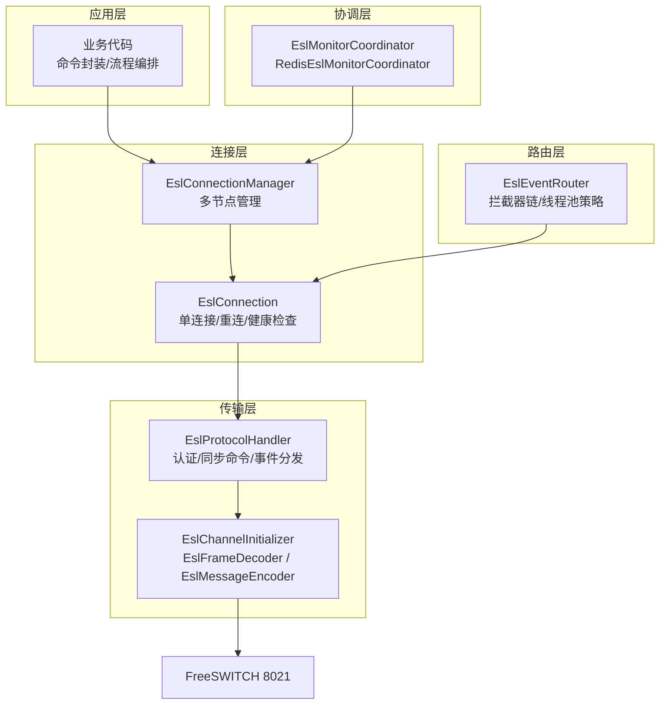
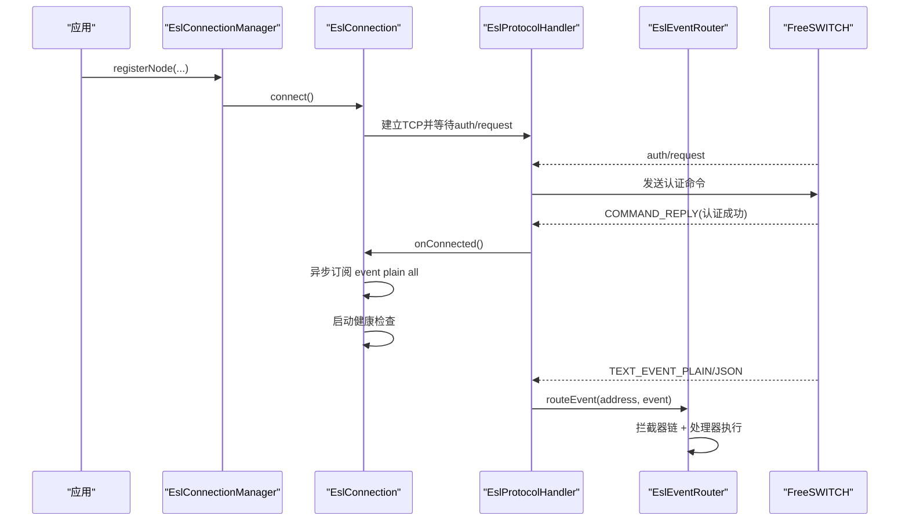
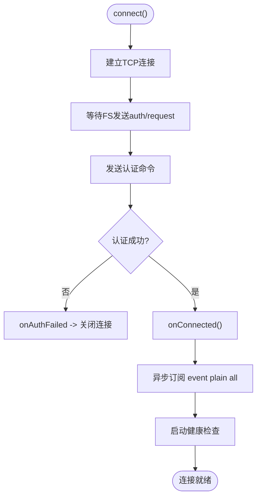
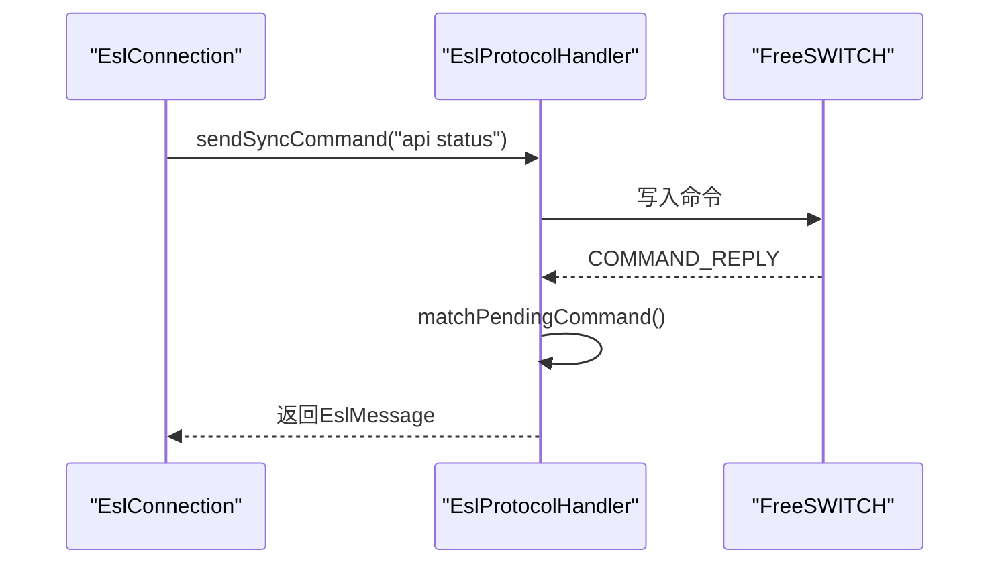
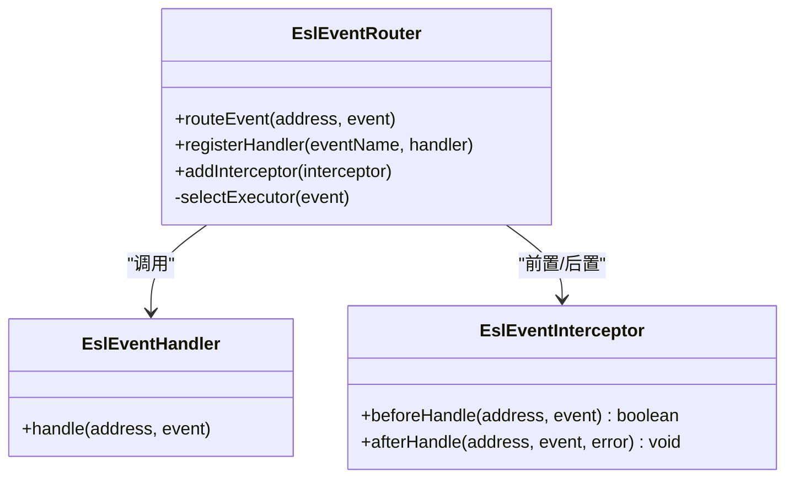
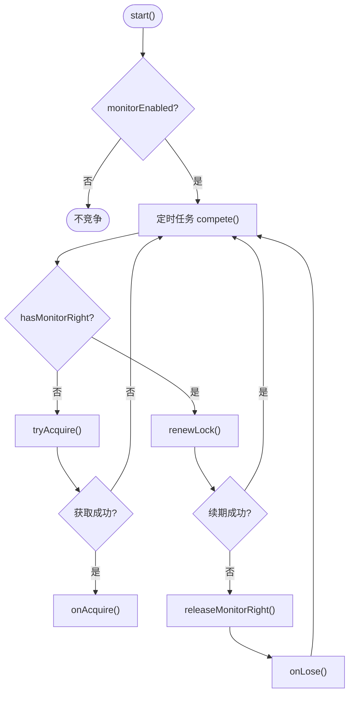
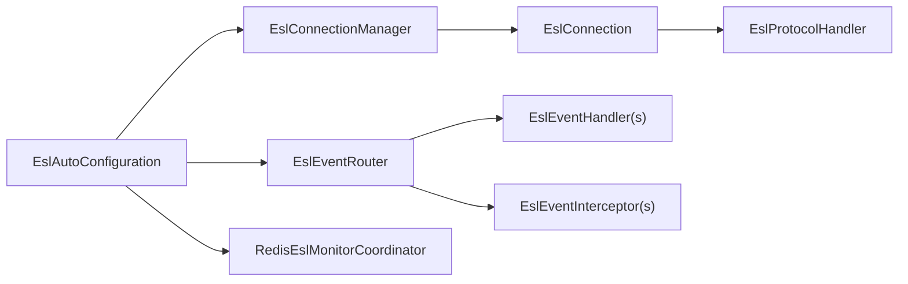

# FreeSWITCH ESL接口

<cite>
**本文引用的文件**
- [README.md](file://yudao-cloud/yudao-module-cc/ipcc-fs-esl/README.md)
- [fs-esl-client组件架构设计.md](file://yudao-cloud/yudao-module-cc/ipcc-fs-esl/fs-esl-client组件架构设计.md)
- [EslConnection.java](file://yudao-cloud/yudao-module-cc/ipcc-fs-esl/src/main/java/cn/ipcc/fs/esl/EslConnection.java)
- [EslConnectionManager.java](file://yudao-cloud/yudao-module-cc/ipcc-fs-esl/src/main/java/cn/ipcc/fs/esl/EslConnectionManager.java)
- [EslAutoConfiguration.java](file://yudao-cloud/yudao-module-cc/ipcc-fs-esl/src/main/java/cn/ipcc/fs/esl/spring/EslAutoConfiguration.java)
- [EslClientProperties.java](file://yudao-cloud/yudao-module-cc/ipcc-fs-esl/src/main/java/cn/ipcc/fs/esl/spring/EslClientProperties.java)
- [EslEventRouter.java](file://yudao-cloud/yudao-module-cc/ipcc-fs-esl/src/main/java/cn/ipcc/fs/esl/router/EslEventRouter.java)
- [EslProtocolHandler.java](file://yudao-cloud/yudao-module-cc/ipcc-fs-esl/src/main/java/cn/ipcc/fs/esl/netty/EslProtocolHandler.java)
- [RedisEslMonitorCoordinator.java](file://yudao-cloud/yudao-module-cc/ipcc-fs-esl/src/main/java/cn/ipcc/fs/esl/coordinator/redis/RedisEslMonitorCoordinator.java)
- [ExampleJavaApplication.java](file://yudao-cloud/yudao-module-cc/ipcc-fs-esl/example/example-java/src/main/java/cn/ipcc/fs/esl/example/ExampleJavaApplication.java)
</cite>

## 目录
1. [简介](#简介)
2. [项目结构](#项目结构)
3. [核心组件](#核心组件)
4. [架构总览](#架构总览)
5. [详细组件分析](#详细组件分析)
6. [依赖关系分析](#依赖关系分析)
7. [性能与内存优化](#性能与内存优化)
8. [故障转移与高可用](#故障转移与高可用)
9. [集成示例与最佳实践](#集成示例与最佳实践)
10. [调试与排障指南](#调试与排障指南)
11. [结论](#结论)

## 简介
本模块是一个基于 Netty 4.x 的 FreeSWITCH ESL（Event Socket Layer）客户端库，提供连接管理、命令发送、事件订阅与路由、分布式监听权协调等能力。它替代了旧版第三方库，解决兼容性与稳定性问题，并提供 Spring Boot 自动配置与可观测性扩展点。

## 项目结构
该模块采用分层架构：传输层（Netty Pipeline）、连接管理层（单连接与多节点管理）、事件路由层（注解驱动分发与拦截器链）、分布式协调层（基于 Redis 的监听权竞争），以及基础设施层（配置、指标、异常体系）。

图表来源
- [EslAutoConfiguration.java:98-127](file://yudao-cloud/yudao-module-cc/ipcc-fs-esl/src/main/java/cn/ipcc/fs/esl/spring/EslAutoConfiguration.java#L98-L127)
- [EslConnectionManager.java:19-29](file://yudao-cloud/yudao-module-cc/ipcc-fs-esl/src/main/java/cn/ipcc/fs/esl/EslConnectionManager.java#L19-L29)
- [EslConnection.java:32-42](file://yudao-cloud/yudao-module-cc/ipcc-fs-esl/src/main/java/cn/ipcc/fs/esl/EslConnection.java#L32-L42)
- [EslProtocolHandler.java:23-38](file://yudao-cloud/yudao-module-cc/ipcc-fs-esl/src/main/java/cn/ipcc/fs/esl/netty/EslProtocolHandler.java#L23-L38)
- [EslEventRouter.java:14-31](file://yudao-cloud/yudao-module-cc/ipcc-fs-esl/src/main/java/cn/ipcc/fs/esl/router/EslEventRouter.java#L14-L31)

章节来源
- [README.md:50-98](file://yudao-cloud/yudao-module-cc/ipcc-fs-esl/README.md#L50-L98)
- [fs-esl-client组件架构设计.md:114-191](file://yudao-cloud/yudao-module-cc/ipcc-fs-esl/fs-esl-client组件架构设计.md#L114-L191)

## 核心组件
- EslConnection：单连接客户端，负责连接生命周期、认证握手、自动重连、健康检查、命令发送（api/bgapi/sendmsg）与事件订阅。
- EslConnectionManager：多节点管理器，注册/移除节点、批量命令、随机选择可用节点、优雅关闭。
- EslEventRouter：注解驱动的事件路由器，支持三种执行模式（CHANNEL_HASH/SINGLE_THREAD/FULL_CONCURRENT），拦截器链与隔离异常。
- EslProtocolHandler：Netty 协议处理器，处理 auth/request、COMMAND_REPLY/API_RESPONSE、TEXT_EVENT_*、disconnect-notice，实现同步命令匹配与超时控制。
- RedisEslMonitorCoordinator：基于 Redis 的分布式监听权协调，支持获取锁、续期、释放与切换回调。
- Spring 自动配置：EslAutoConfiguration 装配 Bean、收集监听器/处理器/拦截器、启动协调器与默认事件桥接。

章节来源
- [EslConnection.java:32-42](file://yudao-cloud/yudao-module-cc/ipcc-fs-esl/src/main/java/cn/ipcc/fs/esl/EslConnection.java#L32-L42)
- [EslConnectionManager.java:19-29](file://yudao-cloud/yudao-module-cc/ipcc-fs-esl/src/main/java/cn/ipcc/fs/esl/EslConnectionManager.java#L19-L29)
- [EslEventRouter.java:14-31](file://yudao-cloud/yudao-module-cc/ipcc-fs-esl/src/main/java/cn/ipcc/fs/esl/router/EslEventRouter.java#L14-L31)
- [EslProtocolHandler.java:23-38](file://yudao-cloud/yudao-module-cc/ipcc-fs-esl/src/main/java/cn/ipcc/fs/esl/netty/EslProtocolHandler.java#L23-L38)
- [RedisEslMonitorCoordinator.java:16-35](file://yudao-cloud/yudao-module-cc/ipcc-fs-esl/src/main/java/cn/ipcc/fs/esl/coordinator/redis/RedisEslMonitorCoordinator.java#L16-L35)
- [EslAutoConfiguration.java:34-49](file://yudao-cloud/yudao-module-cc/ipcc-fs-esl/src/main/java/cn/ipcc/fs/esl/spring/EslAutoConfiguration.java#L34-L49)

## 架构总览
ESL 通信采用“传输层 + 连接层 + 路由层 + 协调层”的分层设计：
- 传输层：Netty Pipeline 完成帧解码、消息编码与协议处理。
- 连接层：单连接管理与多节点管理，包含认证、重连与健康检查。
- 路由层：事件按名称路由到处理器，支持拦截器链与线程池策略。
- 协调层：多实例通过 Redis 竞争监听权，避免重复处理事件。

图表来源
- [EslConnection.java:90-140](file://yudao-cloud/yudao-module-cc/ipcc-fs-esl/src/main/java/cn/ipcc/fs/esl/EslConnection.java#L90-L140)
- [EslProtocolHandler.java:146-213](file://yudao-cloud/yudao-module-cc/ipcc-fs-esl/src/main/java/cn/ipcc/fs/esl/netty/EslProtocolHandler.java#L146-L213)
- [EslEventRouter.java:90-153](file://yudao-cloud/yudao-module-cc/ipcc-fs-esl/src/main/java/cn/ipcc/fs/esl/router/EslEventRouter.java#L90-L153)

## 详细组件分析

### 连接建立与认证流程
- 连接建立：EslConnection.connect() 创建 Bootstrap，设置 SO_KEEPALIVE 与连接超时，初始化 EslChannelInitializer。
- 认证握手：EslProtocolHandler 收到 auth/request 后发送认证命令；认证成功后调用连接监听器的 onConnected，触发内部 listener 完成状态切换、事件订阅与健康检查。
- 事件订阅：认证成功后异步发送 "event plain all" 订阅所有事件，避免阻塞 IO 线程。

图表来源
- [EslConnection.java:90-140](file://yudao-cloud/yudao-module-cc/ipcc-fs-esl/src/main/java/cn/ipcc/fs/esl/EslConnection.java#L90-L140)
- [EslProtocolHandler.java:146-213](file://yudao-cloud/yudao-module-cc/ipcc-fs-esl/src/main/java/cn/ipcc/fs/esl/netty/EslProtocolHandler.java#L146-L213)

章节来源
- [EslConnection.java:90-140](file://yudao-cloud/yudao-module-cc/ipcc-fs-esl/src/main/java/cn/ipcc/fs/esl/EslConnection.java#L90-L140)
- [EslProtocolHandler.java:146-213](file://yudao-cloud/yudao-module-cc/ipcc-fs-esl/src/main/java/cn/ipcc/fs/esl/netty/EslProtocolHandler.java#L146-L213)

### 命令发送与响应匹配
- API 命令：sendApiCommand 自动添加 "api " 前缀，通过 sendSyncCommand 发送并等待响应，支持超时控制。
- bgapi 命令：sendBgapiCommand 独立命令类型，返回 Job-UUID，实际结果通过 BACKGROUND_JOB 事件异步返回。
- sendmsg：操作指定通道，走同步命令响应匹配机制。
- 响应匹配：EslProtocolHandler 使用 pendingCommands 队列与 CompletableFuture，跳过已超时/取消的 future，确保不错位。

图表来源
- [EslConnection.java:169-196](file://yudao-cloud/yudao-module-cc/ipcc-fs-esl/src/main/java/cn/ipcc/fs/esl/EslConnection.java#L169-L196)
- [EslProtocolHandler.java:92-107](file://yudao-cloud/yudao-module-cc/ipcc-fs-esl/src/main/java/cn/ipcc/fs/esl/netty/EslProtocolHandler.java#L92-L107)
- [EslProtocolHandler.java:168-182](file://yudao-cloud/yudao-module-cc/ipcc-fs-esl/src/main/java/cn/ipcc/fs/esl/netty/EslProtocolHandler.java#L168-L182)

章节来源
- [EslConnection.java:169-269](file://yudao-cloud/yudao-module-cc/ipcc-fs-esl/src/main/java/cn/ipcc/fs/esl/EslConnection.java#L169-L269)
- [EslProtocolHandler.java:92-107](file://yudao-cloud/yudao-module-cc/ipcc-fs-esl/src/main/java/cn/ipcc/fs/esl/netty/EslProtocolHandler.java#L92-L107)

### 事件订阅与路由
- 事件订阅：认证成功后异步发送 "event plain all"。
- 事件路由：EslEventRouter 根据事件名查找处理器列表，按 @Order 排序执行；支持 CHANNEL_HASH/SINGLE_THREAD/FULL_CONCURRENT 三种模式。
- 拦截器链：beforeHandle/afterHandle 在异步任务内执行，保证 ThreadLocal 透传与资源清理。
- BACKGROUND_JOB：独立线程池处理，避免与普通事件互相阻塞。

图表来源
- [EslEventRouter.java:14-31](file://yudao-cloud/yudao-module-cc/ipcc-fs-esl/src/main/java/cn/ipcc/fs/esl/router/EslEventRouter.java#L14-L31)
- [EslEventRouter.java:90-153](file://yudao-cloud/yudao-module-cc/ipcc-fs-esl/src/main/java/cn/ipcc/fs/esl/router/EslEventRouter.java#L90-L153)

章节来源
- [EslEventRouter.java:90-153](file://yudao-cloud/yudao-module-cc/ipcc-fs-esl/src/main/java/cn/ipcc/fs/esl/router/EslEventRouter.java#L90-L153)

### 分布式监听权协调
- 竞争机制：SET NX EX 获取分布式锁，持权后定时续期，维护状态键记录当前持权实例。
- 故障切换：持权实例宕机则锁过期自动释放，其他实例竞争获取；续期失败主动释放监听权。
- 回调：onAcquire/onRelease 用于动态连接/断开 FS 节点或执行业务逻辑。

图表来源
- [RedisEslMonitorCoordinator.java:61-115](file://yudao-cloud/yudao-module-cc/ipcc-fs-esl/src/main/java/cn/ipcc/fs/esl/coordinator/redis/RedisEslMonitorCoordinator.java#L61-L115)

章节来源
- [RedisEslMonitorCoordinator.java:61-115](file://yudao-cloud/yudao-module-cc/ipcc-fs-esl/src/main/java/cn/ipcc/fs/esl/coordinator/redis/RedisEslMonitorCoordinator.java#L61-L115)

### Spring 自动配置与Bean装配
- 启用 @ConfigurationProperties 绑定 ipcc.fs.esl.* 配置。
- 创建 EslConnectionManager（initMethod=start），自动注册静态节点。
- 条件性创建 RedisEslMonitorCoordinator（当存在 StringRedisTemplate 且 monitor-enabled=true）。
- 创建 EslEventRouter，自动收集 @EslEventName 处理器与拦截器并按 @Order 排序。
- 默认 EslMetrics 与拦截器，无自定义 EslEventListener 时注册默认桥接。

章节来源
- [EslAutoConfiguration.java:56-86](file://yudao-cloud/yudao-module-cc/ipcc-fs-esl/src/main/java/cn/ipcc/fs/esl/spring/EslAutoConfiguration.java#L56-L86)
- [EslAutoConfiguration.java:98-127](file://yudao-cloud/yudao-module-cc/ipcc-fs-esl/src/main/java/cn/ipcc/fs/esl/spring/EslAutoConfiguration.java#L98-L127)
- [EslAutoConfiguration.java:135-169](file://yudao-cloud/yudao-module-cc/ipcc-fs-esl/src/main/java/cn/ipcc/fs/esl/spring/EslAutoConfiguration.java#L135-L169)
- [EslAutoConfiguration.java:171-214](file://yudao-cloud/yudao-module-cc/ipcc-fs-esl/src/main/java/cn/ipcc/fs/esl/spring/EslAutoConfiguration.java#L171-L214)
- [EslAutoConfiguration.java:216-246](file://yudao-cloud/yudao-module-cc/ipcc-fs-esl/src/main/java/cn/ipcc/fs/esl/spring/EslAutoConfiguration.java#L216-L246)

## 依赖关系分析
- EslConnection 依赖 EslProtocolHandler 进行网络交互，并通过 InternalConnectionListener 感知连接生命周期。
- EslConnectionManager 聚合多个 EslConnection，提供节点选择与批量操作。
- EslEventRouter 依赖事件处理器与拦截器，由 Spring 容器扫描并注册。
- RedisEslMonitorCoordinator 依赖 StringRedisTemplate 实现分布式锁。
- EslAutoConfiguration 作为装配中心，将上述组件组合为完整运行时。

图表来源
- [EslAutoConfiguration.java:98-214](file://yudao-cloud/yudao-module-cc/ipcc-fs-esl/src/main/java/cn/ipcc/fs/esl/spring/EslAutoConfiguration.java#L98-L214)

章节来源
- [EslAutoConfiguration.java:98-214](file://yudao-cloud/yudao-module-cc/ipcc-fs-esl/src/main/java/cn/ipcc/fs/esl/spring/EslAutoConfiguration.java#L98-L214)

## 性能与内存优化
- 帧解码保护：EslFrameDecoder 校验最大帧大小与头部行数，防止 OOM 与 header 放大攻击。
- 事件执行策略：CHANNEL_HASH 按 Unique-ID 哈希分配到固定线程，保证同通道事件顺序；SINGLE_THREAD 适用于低并发；FULL_CONCURRENT 适用于无关联事件。
- 拒绝策略：CALLER_RUNS/ABORT/DISCARD 可配置，避免队列溢出导致系统不稳定。
- 超时控制：同步命令使用 CompletableFuture.orTimeout，避免永久阻塞。
- 线程模型：BACKGROUND_JOB 独立线程池，避免与普通事件互相阻塞。

章节来源
- [fs-esl-client组件架构设计.md:197-315](file://yudao-cloud/yudao-module-cc/ipcc-fs-esl/fs-esl-client组件架构设计.md#L197-L315)
- [EslEventRouter.java:43-74](file://yudao-cloud/yudao-module-cc/ipcc-fs-esl/src/main/java/cn/ipcc/fs/esl/router/EslEventRouter.java#L43-L74)
- [EslProtocolHandler.java:92-107](file://yudao-cloud/yudao-module-cc/ipcc-fs-esl/src/main/java/cn/ipcc/fs/esl/netty/EslProtocolHandler.java#L92-L107)

## 故障转移与高可用
- 自动重连：指数退避 + 随机抖动，达到最大重试次数后停止并重置状态。
- 健康检查：定时发送 api status，连续失败阈值触发重连。
- 分布式监听权：基于 Redis 的锁机制，支持续期失败时的主动释放与切换回调。
- 优雅关闭：EslConnectionManager.shutdown 等待资源释放，避免中断正在处理的任务。

章节来源
- [EslConnection.java:289-334](file://yudao-cloud/yudao-module-cc/ipcc-fs-esl/src/main/java/cn/ipcc/fs/esl/EslConnection.java#L289-L334)
- [EslConnection.java:336-374](file://yudao-cloud/yudao-module-cc/ipcc-fs-esl/src/main/java/cn/ipcc/fs/esl/EslConnection.java#L336-L374)
- [RedisEslMonitorCoordinator.java:77-115](file://yudao-cloud/yudao-module-cc/ipcc-fs-esl/src/main/java/cn/ipcc/fs/esl/coordinator/redis/RedisEslMonitorCoordinator.java#L77-L115)
- [EslConnectionManager.java:219-232](file://yudao-cloud/yudao-module-cc/ipcc-fs-esl/src/main/java/cn/ipcc/fs/esl/EslConnectionManager.java#L219-L232)

## 集成示例与最佳实践
- 最小配置：在 application.yml 中配置 ipcc.fs.esl.*，包括节点、协调开关与线程池参数。
- 事件处理器：实现 EslEventHandler 并标注 @EslEventName，支持 @Order 控制执行顺序。
- 事件拦截器：实现 EslEventInterceptor，实现 beforeHandle/afterHandle，用于监控与链路追踪。
- 连接生命周期：实现 EslConnectionListener，感知连接建立、断开、认证成功/失败等事件。
- 监听权变化：实现 EslMonitorListener，在获取/失去监听权时执行自定义逻辑。
- 示例工程：example/example-java 演示全部扩展接口的合理实现，并连接真实 FreeSWITCH 节点验证功能。

章节来源
- [README.md:133-179](file://yudao-cloud/yudao-module-cc/ipcc-fs-esl/README.md#L133-L179)
- [README.md:185-263](file://yudao-cloud/yudao-module-cc/ipcc-fs-esl/README.md#L185-L263)
- [ExampleJavaApplication.java:7-13](file://yudao-cloud/yudao-module-cc/ipcc-fs-esl/example/example-java/src/main/java/cn/ipcc/fs/esl/example/ExampleJavaApplication.java#L7-L13)

## 调试与排障指南
- 常见问题：
  - 认证失败：检查密码与 FS 配置，关注 onAuthFailed 日志与重连行为。
  - 命令超时：调整 command-timeout-seconds，确认 FS 是否响应；注意长时间运行命令应使用 bgapi。
  - 事件丢失：确认 event-executor-mode 与 event-thread-pool-size 是否匹配负载；检查拒绝策略。
  - 连接假死：启用健康检查并调优 health-check-interval-seconds 与 failure-threshold。
- 调试技巧：
  - 启用 EslMetricsInterceptor 统计事件接收/处理计数与延迟。
  - 使用 TraceLoggingInterceptor 记录事件上下文（如 traceId）。
  - 观察连接状态机：DISCONNECTED → CONNECTING → CONNECTED → AUTHENTICATED → RECONNECTING/FAILED。

章节来源
- [EslAutoConfiguration.java:216-246](file://yudao-cloud/yudao-module-cc/ipcc-fs-esl/src/main/java/cn/ipcc/fs/esl/spring/EslAutoConfiguration.java#L216-L246)
- [EslConnection.java:409-446](file://yudao-cloud/yudao-module-cc/ipcc-fs-esl/src/main/java/cn/ipcc/fs/esl/EslConnection.java#L409-L446)
- [EslProtocolHandler.java:244-259](file://yudao-cloud/yudao-module-cc/ipcc-fs-esl/src/main/java/cn/ipcc/fs/esl/netty/EslProtocolHandler.java#L244-L259)

## 结论
本模块以 Netty 4.x 为核心，提供了稳定可靠的 FreeSWITCH ESL 客户端能力，涵盖连接管理、命令发送、事件路由与分布式协调。通过 Spring Boot 自动配置与丰富的扩展点，开发者可以快速集成并定制事件处理与监控。建议在生产环境中启用健康检查与分布式协调，并根据负载调优事件线程池与拒绝策略，以获得最佳性能与可用性。