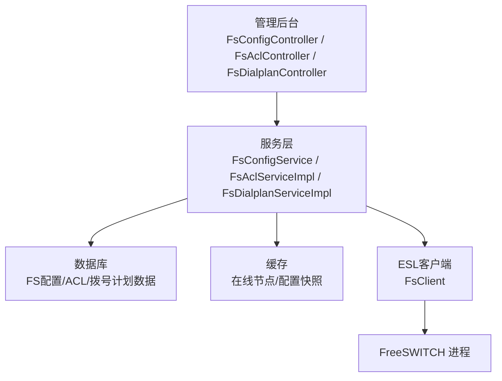
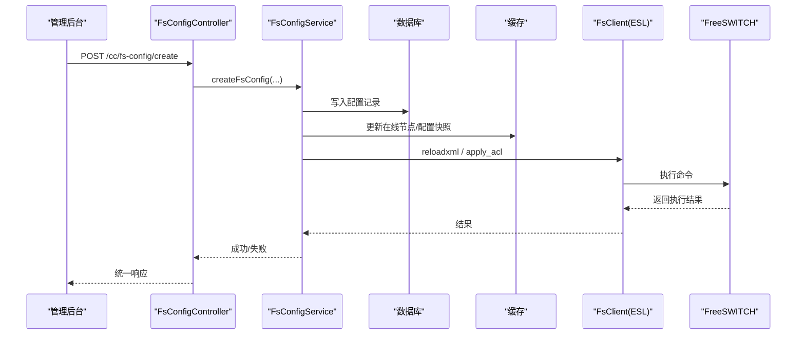
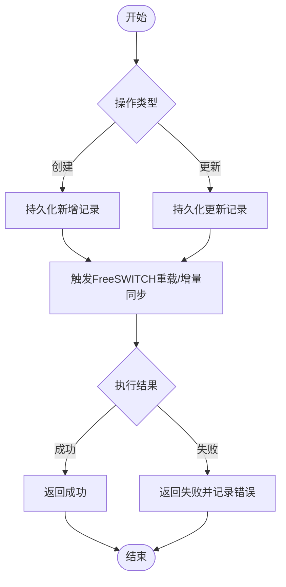
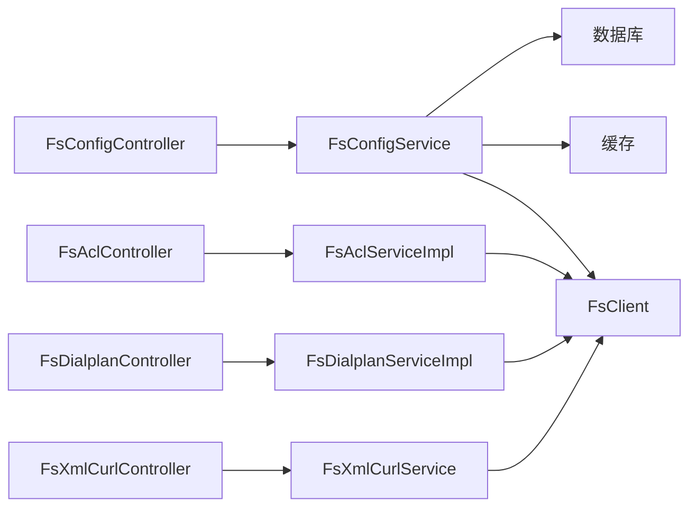

# FreeSWITCH配置API

<cite>
**本文引用的文件**
- [FsConfigController.java](file://yudao-cloud/yudao-module-cc/yudao-module-cc-server/src/main/java/cn/iocoder/yudao/module/cc/controller/admin/fs/FsConfigController.java)
- [FsAclController.java](file://yudao-cloud/yudao-module-cc/yudao-module-cc-server/src/main/java/cn/iocoder/yudao/module/cc/controller/admin/fs/FsAclController.java)
- [FsDialplanController.java](file://yudao-cloud/yudao-module-cc/yudao-module-cc-server/src/main/java/cn/iocoder/yudao/module/cc/controller/admin/fs/FsDialplanController.java)
- [FsConfigService.java](file://yudao-cloud/yudao-module-cc/yudao-module-cc-server/src/main/java/cn/iocoder/yudao/module/cc/service/fs/FsConfigService.java)
- [FsAclServiceImpl.java](file://yudao-cloud/yudao-module-cc/yudao-module-cc-server/src/main/java/cn/iocoder/yudao/module/cc/service/fs/FsAclServiceImpl.java)
- [FsDialplanServiceImpl.java](file://yudao-cloud/yudao-module-cc/yudao-module-cc-server/src/main/java/cn/iocoder/yudao/module/cc/service/fs/FsDialplanServiceImpl.java)
- [FsXmlCurlController.java](file://yudao-cloud/yudao-module-cc/yudao-module-cc-server/src/main/java/cn/iocoder/yudao/module/cc/controller/admin/fs/FsXmlCurlController.java)
- [FsXmlCurlService.java](file://yudao-cloud/yudao-module-cc/yudao-module-cc-server/src/main/java/cn/iocoder/yudao/module/cc/service/fs/FsXmlCurlService.java)
- [FsXmlCurlServiceImpl.java](file://yudao-cloud/yudao-module-cc/yudao-module-cc-server/src/main/java/cn/iocoder/yudao/module/cc/service/fs/FsXmlCurlServiceImpl.java)
- [FsClient.java](file://yudao-cloud/yudao-module-cc/yudao-module-cc-server/src/main/java/cn/iocoder/yudao/module/cc/esl/client/FsClient.java)
- [EslConstant.java](file://yudao-cloud/yudao-module-cc/yudao-module-cc-server/src/main/java/cn/iocoder/yudao/module/cc/esl/constant/EslConstant.java)
- [SectionNames.java](file://yudao-cloud/yudao-module-cc/yudao-module-cc-server/src/main/java/cn/iocoder/yudao/module/cc/esl/constant/SectionNames.java)
</cite>

## 目录
1. [简介](#简介)
2. [项目结构](#项目结构)
3. [核心组件](#核心组件)
4. [架构总览](#架构总览)
5. [详细组件分析](#详细组件分析)
6. [依赖关系分析](#依赖关系分析)
7. [性能考虑](#性能考虑)
8. [故障排查指南](#故障排查指南)
9. [结论](#结论)
10. [附录：接口清单与示例](#附录接口清单与示例)

## 简介
本文件面向FreeSWITCH配置管理，提供服务器配置、ACL规则、拨号计划等核心配置的增删改查能力，并围绕配置同步、验证、回滚、热更新、备份恢复、差异对比等高级能力给出可落地的API设计与调用流程说明。文档基于仓库中已实现的控制器与服务层代码进行梳理，并结合ESL（Event Socket Library）通信机制，给出端到端的数据流与交互时序。

## 项目结构
本项目在“呼叫中心”模块下提供FreeSWITCH相关管理能力，主要包含：
- 管理后台控制器：暴露REST API，负责参数校验、权限控制、结果封装与导出。
- 服务层：实现业务逻辑，包括数据持久化、缓存、与FreeSWITCH的同步与执行命令。
- ESL客户端：通过ESL与FreeSWITCH进程通信，执行reloadxml、apply ACL、发送XML CURL等指令。
- 常量与枚举：定义ESL事件名、命令、配置段名等。

图表来源
- [FsConfigController.java:30-102](file://yudao-cloud/yudao-module-cc/yudao-module-cc-server/src/main/java/cn/iocoder/yudao/module/cc/controller/admin/fs/FsConfigController.java#L30-L102)
- [FsAclController.java:28-91](file://yudao-cloud/yudao-module-cc/yudao-module-cc-server/src/main/java/cn/iocoder/yudao/module/cc/controller/admin/fs/FsAclController.java#L28-L91)
- [FsDialplanController.java:30-102](file://yudao-cloud/yudao-module-cc/yudao-module-cc-server/src/main/java/cn/iocoder/yudao/module/cc/controller/admin/fs/FsDialplanController.java#L30-L102)
- [FsConfigService.java:16-85](file://yudao-cloud/yudao-module-cc/yudao-module-cc-server/src/main/java/cn/iocoder/yudao/module/cc/service/fs/FsConfigService.java#L16-L85)
- [FsClient.java](file://yudao-cloud/yudao-module-cc/yudao-module-cc-server/src/main/java/cn/iocoder/yudao/module/cc/esl/client/FsClient.java)
- [EslConstant.java](file://yudao-cloud/yudao-module-cc/yudao-module-cc-server/src/main/java/cn/iocoder/yudao/module/cc/esl/constant/EslConstant.java)
- [SectionNames.java](file://yudao-cloud/yudao-module-cc/yudao-module-cc-server/src/main/java/cn/iocoder/yudao/module/cc/esl/constant/SectionNames.java)

章节来源
- [FsConfigController.java:30-102](file://yudao-cloud/yudao-module-cc/yudao-module-cc-server/src/main/java/cn/iocoder/yudao/module/cc/controller/admin/fs/FsConfigController.java#L30-L102)
- [FsAclController.java:28-91](file://yudao-cloud/yudao-module-cc/yudao-module-cc-server/src/main/java/cn/iocoder/yudao/module/cc/controller/admin/fs/FsAclController.java#L28-L91)
- [FsDialplanController.java:30-102](file://yudao-cloud/yudao-module-cc/yudao-module-cc-server/src/main/java/cn/iocoder/yudao/module/cc/controller/admin/fs/FsDialplanController.java#L30-L102)
- [FsConfigService.java:16-85](file://yudao-cloud/yudao-module-cc/yudao-module-cc-server/src/main/java/cn/iocoder/yudao/module/cc/service/fs/FsConfigService.java#L16-L85)

## 核心组件
- 配置管理控制器：提供FreeSWITCH管理配置的CRUD与分页、导出。
- ACL控制器：提供访问控制规则的CRUD、列表查询与导出。
- 拨号计划控制器：提供拨号计划的CRUD、分页、导出。
- XML CURL控制器：用于触发FreeSWITCH侧的XML回调或动态生成配置片段。
- 服务层：封装业务逻辑，协调数据库、缓存与ESL客户端，完成配置同步与执行。
- ESL客户端：封装与FreeSWITCH的ESL连接、命令执行、事件订阅与回调处理。

章节来源
- [FsConfigController.java:30-102](file://yudao-cloud/yudao-module-cc/yudao-module-cc-server/src/main/java/cn/iocoder/yudao/module/cc/controller/admin/fs/FsConfigController.java#L30-L102)
- [FsAclController.java:28-91](file://yudao-cloud/yudao-module-cc/yudao-module-cc-server/src/main/java/cn/iocoder/yudao/module/cc/controller/admin/fs/FsAclController.java#L28-L91)
- [FsDialplanController.java:30-102](file://yudao-cloud/yudao-module-cc/yudao-module-cc-server/src/main/java/cn/iocoder/yudao/module/cc/controller/admin/fs/FsDialplanController.java#L30-L102)
- [FsXmlCurlController.java](file://yudao-cloud/yudao-module-cc/yudao-module-cc-server/src/main/java/cn/iocoder/yudao/module/cc/controller/admin/fs/FsXmlCurlController.java)
- [FsConfigService.java:16-85](file://yudao-cloud/yudao-module-cc/yudao-module-cc-server/src/main/java/cn/iocoder/yudao/module/cc/service/fs/FsConfigService.java#L16-L85)

## 架构总览
下图展示了从管理后台到FreeSWITCH的配置变更链路：控制器接收请求，服务层进行数据持久化与校验，随后通过ESL客户端向FreeSWITCH下发reloadxml或应用ACL等命令，最终生效于运行中的FreeSWITCH实例。

图表来源
- [FsConfigController.java:39-51](file://yudao-cloud/yudao-module-cc/yudao-module-cc-server/src/main/java/cn/iocoder/yudao/module/cc/controller/admin/fs/FsConfigController.java#L39-L51)
- [FsConfigService.java:18-31](file://yudao-cloud/yudao-module-cc/yudao-module-cc-server/src/main/java/cn/iocoder/yudao/module/cc/service/fs/FsConfigService.java#L18-L31)
- [FsClient.java](file://yudao-cloud/yudao-module-cc/yudao-module-cc-server/src/main/java/cn/iocoder/yudao/module/cc/esl/client/FsClient.java)
- [EslConstant.java](file://yudao-cloud/yudao-module-cc/yudao-module-cc-server/src/main/java/cn/iocoder/yudao/module/cc/esl/constant/EslConstant.java)

## 详细组件分析

### 配置管理（FsConfig）
- 功能范围：创建、更新、删除、批量删除、单条查询、分页查询、Excel导出；支持按分组名称与状态获取列表；提供在线节点缓存读取。
- 关键路径：
  - 创建/更新：控制器接收保存请求，服务层持久化后触发FreeSWITCH重载或增量同步。
  - 删除：支持单条与批量删除，必要时触发FreeSWITCH重载以移除无效配置。
  - 查询：提供分页与按条件查询，导出为Excel便于审计与归档。
  - 在线节点：从缓存获取当前在线的FreeSWITCH节点，便于定向推送配置。

图表来源
- [FsConfigController.java:39-70](file://yudao-cloud/yudao-module-cc/yudao-module-cc-server/src/main/java/cn/iocoder/yudao/module/cc/controller/admin/fs/FsConfigController.java#L39-L70)
- [FsConfigService.java:18-45](file://yudao-cloud/yudao-module-cc/yudao-module-cc-server/src/main/java/cn/iocoder/yudao/module/cc/service/fs/FsConfigService.java#L18-L45)

章节来源
- [FsConfigController.java:30-102](file://yudao-cloud/yudao-module-cc/yudao-module-cc-server/src/main/java/cn/iocoder/yudao/module/cc/controller/admin/fs/FsConfigController.java#L30-L102)
- [FsConfigService.java:16-85](file://yudao-cloud/yudao-module-cc/yudao-module-cc-server/src/main/java/cn/iocoder/yudao/module/cc/service/fs/FsConfigService.java#L16-L85)

### 访问控制（FsAcl）
- 功能范围：创建、更新、删除、单条查询、列表查询、Excel导出。
- 典型场景：维护IP白名单/黑名单、网段策略、区域限制等，变更后通过ESL应用到FreeSWITCH。

章节来源
- [FsAclController.java:28-91](file://yudao-cloud/yudao-module-cc/yudao-module-cc-server/src/main/java/cn/iocoder/yudao/module/cc/controller/admin/fs/FsAclController.java#L28-L91)
- [FsAclServiceImpl.java](file://yudao-cloud/yudao-module-cc/yudao-module-cc-server/src/main/java/cn/iocoder/yudao/module/cc/service/fs/FsAclServiceImpl.java)

### 拨号计划（FsDialplan）
- 功能范围：创建、更新、删除、批量删除、单条查询、分页查询、Excel导出。
- 典型场景：维护IVR路由、号码解析、呼叫转移、时间路由等拨号计划条目，变更后触发FreeSWITCH重载。

章节来源
- [FsDialplanController.java:30-102](file://yudao-cloud/yudao-module-cc/yudao-module-cc-server/src/main/java/cn/iocoder/yudao/module/cc/controller/admin/fs/FsDialplanController.java#L30-L102)
- [FsDialplanServiceImpl.java](file://yudao-cloud/yudao-module-cc/yudao-module-cc-server/src/main/java/cn/iocoder/yudao/module/cc/service/fs/FsDialplanServiceImpl.java)

### XML CURL（FsXmlCurl）
- 功能范围：触发FreeSWITCH侧的XML回调或动态生成配置片段，常用于运行时动态行为（如动态IVR、动态路由）。
- 使用方式：通过控制器发起请求，服务层构造XML CURL内容并通过ESL发送至FreeSWITCH。

章节来源
- [FsXmlCurlController.java](file://yudao-cloud/yudao-module-cc/yudao-module-cc-server/src/main/java/cn/iocoder/yudao/module/cc/controller/admin/fs/FsXmlCurlController.java)
- [FsXmlCurlService.java](file://yudao-cloud/yudao-module-cc/yudao-module-cc-server/src/main/java/cn/iocoder/yudao/module/cc/service/fs/FsXmlCurlService.java)
- [FsXmlCurlServiceImpl.java](file://yudao-cloud/yudao-module-cc/yudao-module-cc-server/src/main/java/cn/iocoder/yudao/module/cc/service/fs/FsXmlCurlServiceImpl.java)

### ESL客户端与常量
- ESL客户端：封装与FreeSWITCH的ESL连接、命令执行、事件订阅与回调处理。
- 常量：定义ESL事件名、命令、配置段名等，确保与FreeSWITCH协议一致。

章节来源
- [FsClient.java](file://yudao-cloud/yudao-module-cc/yudao-module-cc-server/src/main/java/cn/iocoder/yudao/module/cc/esl/client/FsClient.java)
- [EslConstant.java](file://yudao-cloud/yudao-module-cc/yudao-module-cc-server/src/main/java/cn/iocoder/yudao/module/cc/esl/constant/EslConstant.java)
- [SectionNames.java](file://yudao-cloud/yudao-module-cc/yudao-module-cc-server/src/main/java/cn/iocoder/yudao/module/cc/esl/constant/SectionNames.java)

## 依赖关系分析
- 控制器依赖服务层：所有CRUD入口均委托给对应Service。
- 服务层依赖数据访问与缓存：读写数据库、维护在线节点与配置快照。
- 服务层依赖ESL客户端：执行reloadxml、apply acl、send xml curl等命令。
- 常量与枚举被多处复用：保证与FreeSWITCH协议的一致性。

图表来源
- [FsConfigController.java:30-102](file://yudao-cloud/yudao-module-cc/yudao-module-cc-server/src/main/java/cn/iocoder/yudao/module/cc/controller/admin/fs/FsConfigController.java#L30-L102)
- [FsAclController.java:28-91](file://yudao-cloud/yudao-module-cc/yudao-module-cc-server/src/main/java/cn/iocoder/yudao/module/cc/controller/admin/fs/FsAclController.java#L28-L91)
- [FsDialplanController.java:30-102](file://yudao-cloud/yudao-module-cc/yudao-module-cc-server/src/main/java/cn/iocoder/yudao/module/cc/controller/admin/fs/FsDialplanController.java#L30-L102)
- [FsXmlCurlController.java](file://yudao-cloud/yudao-module-cc/yudao-module-cc-server/src/main/java/cn/iocoder/yudao/module/cc/controller/admin/fs/FsXmlCurlController.java)
- [FsConfigService.java:16-85](file://yudao-cloud/yudao-module-cc/yudao-module-cc-server/src/main/java/cn/iocoder/yudao/module/cc/service/fs/FsConfigService.java#L16-L85)
- [FsClient.java](file://yudao-cloud/yudao-module-cc/yudao-module-cc-server/src/main/java/cn/iocoder/yudao/module/cc/esl/client/FsClient.java)

章节来源
- [FsConfigController.java:30-102](file://yudao-cloud/yudao-module-cc/yudao-module-cc-server/src/main/java/cn/iocoder/yudao/module/cc/controller/admin/fs/FsConfigController.java#L30-L102)
- [FsAclController.java:28-91](file://yudao-cloud/yudao-module-cc/yudao-module-cc-server/src/main/java/cn/iocoder/yudao/module/cc/controller/admin/fs/FsAclController.java#L28-L91)
- [FsDialplanController.java:30-102](file://yudao-cloud/yudao-module-cc/yudao-module-cc-server/src/main/java/cn/iocoder/yudao/module/cc/controller/admin/fs/FsDialplanController.java#L30-L102)
- [FsConfigService.java:16-85](file://yudao-cloud/yudao-module-cc/yudao-module-cc-server/src/main/java/cn/iocoder/yudao/module/cc/service/fs/FsConfigService.java#L16-L85)

## 性能考虑
- 分页与导出：分页查询避免全表扫描，导出时设置无分页拉取全部数据，注意大对象导出对内存的影响。
- 缓存：在线节点列表采用缓存提升查询性能，减少重复探测开销。
- 重载频率：频繁reloadxml可能影响FreeSWITCH性能，建议合并变更或使用增量应用（如apply acl）。
- 并发控制：批量删除与批量更新需加锁或幂等设计，避免重复执行。
- 网络超时：ESL命令执行应设置合理超时与重试策略，防止阻塞。

## 故障排查指南
- 权限问题：确认接口注解的权限标识是否授予当前用户角色。
- 参数校验：检查请求体字段是否符合校验规则，缺失必填项将导致失败。
- 数据库异常：查看事务与SQL执行日志，确认唯一约束与外键约束。
- ESL执行失败：核对FreeSWITCH是否在线、ESL端口与认证是否正确，检查命令返回值与日志。
- 重载失败：确认FreeSWITCH版本与命令兼容性，必要时降级为重启或分步重载。
- 导出失败：检查响应头与IO流关闭，避免部分写入导致的文件损坏。

章节来源
- [FsConfigController.java:39-100](file://yudao-cloud/yudao-module-cc/yudao-module-cc-server/src/main/java/cn/iocoder/yudao/module/cc/controller/admin/fs/FsConfigController.java#L39-L100)
- [FsAclController.java:37-89](file://yudao-cloud/yudao-module-cc/yudao-module-cc-server/src/main/java/cn/iocoder/yudao/module/cc/controller/admin/fs/FsAclController.java#L37-L89)
- [FsDialplanController.java:39-100](file://yudao-cloud/yudao-module-cc/yudao-module-cc-server/src/main/java/cn/iocoder/yudao/module/cc/controller/admin/fs/FsDialplanController.java#L39-L100)

## 结论
本方案通过统一的控制器与服务层抽象，提供了FreeSWITCH配置、ACL与拨号计划的完整管理能力，并以ESL为桥梁实现与FreeSW进程的可靠交互。结合缓存、分页、导出与权限控制，满足日常运维与生产环境的高可用需求。对于同步、验证、回滚、热更新、备份恢复与差异对比等高级能力，可在现有服务层基础上扩展实现，保持与FreeSWITCH协议的兼容性与一致性。

## 附录：接口清单与示例
以下为各模块对外暴露的REST接口概览（方法、路径、用途），具体请求/响应结构与权限标识请参考对应控制器与方法注解。

- 配置管理（/cc/fs-config）
  - POST /create：创建配置
  - PUT /update：更新配置
  - DELETE /delete：删除配置
  - DELETE /delete-list：批量删除
  - GET /get：根据ID查询
  - GET /page：分页查询
  - GET /export-excel：导出Excel

- 访问控制（/cc/fs-acl）
  - POST /create：创建ACL规则
  - PUT /update：更新ACL规则
  - DELETE /delete：删除ACL规则
  - GET /get：根据ID查询
  - GET /list：列表查询
  - GET /export-excel：导出Excel

- 拨号计划（/cc/fs-dialplan）
  - POST /create：创建拨号计划
  - PUT /update：更新拨号计划
  - DELETE /delete：删除拨号计划
  - DELETE /delete-list：批量删除
  - GET /get：根据ID查询
  - GET /page：分页查询
  - GET /export-excel：导出Excel

- XML CURL（/cc/fs-xml-curl）
  - 触发XML回调或动态生成配置片段（具体方法与路径见控制器）

章节来源
- [FsConfigController.java:39-100](file://yudao-cloud/yudao-module-cc/yudao-module-cc-server/src/main/java/cn/iocoder/yudao/module/cc/controller/admin/fs/FsConfigController.java#L39-L100)
- [FsAclController.java:37-89](file://yudao-cloud/yudao-module-cc/yudao-module-cc-server/src/main/java/cn/iocoder/yudao/module/cc/controller/admin/fs/FsAclController.java#L37-L89)
- [FsDialplanController.java:39-100](file://yudao-cloud/yudao-module-cc/yudao-module-cc-server/src/main/java/cn/iocoder/yudao/module/cc/controller/admin/fs/FsDialplanController.java#L39-L100)
- [FsXmlCurlController.java](file://yudao-cloud/yudao-module-cc/yudao-module-cc-server/src/main/java/cn/iocoder/yudao/module/cc/controller/admin/fs/FsXmlCurlController.java)