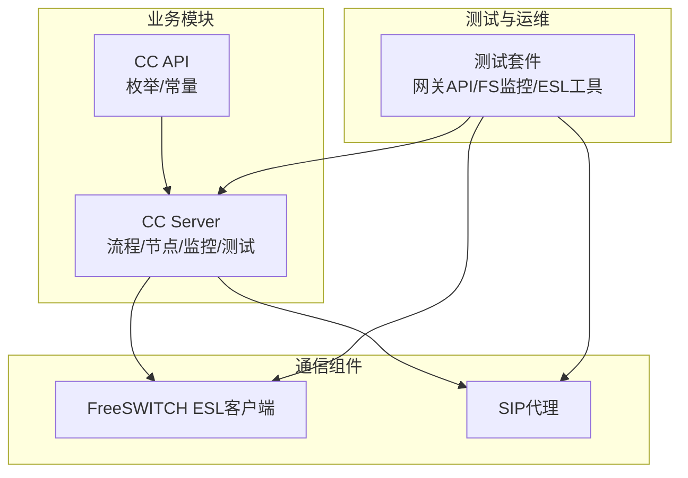
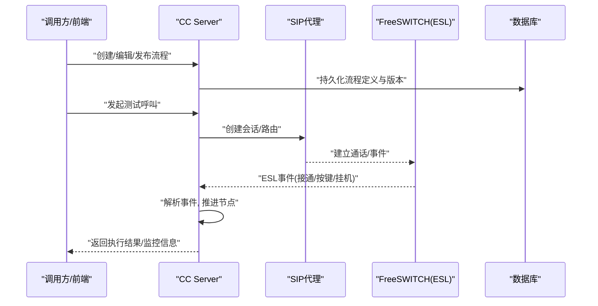
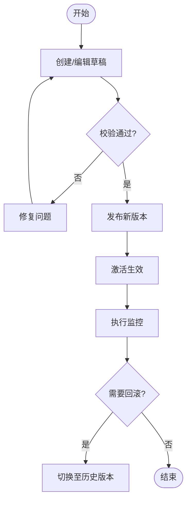
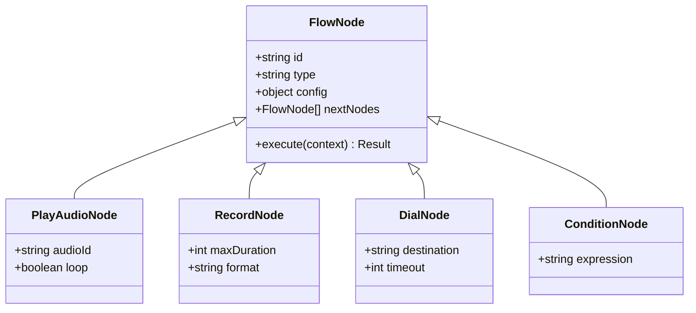
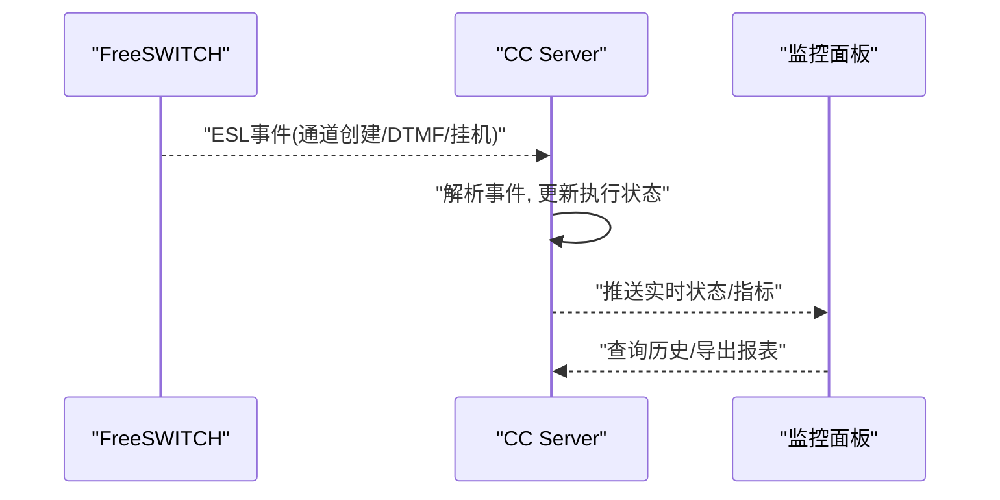
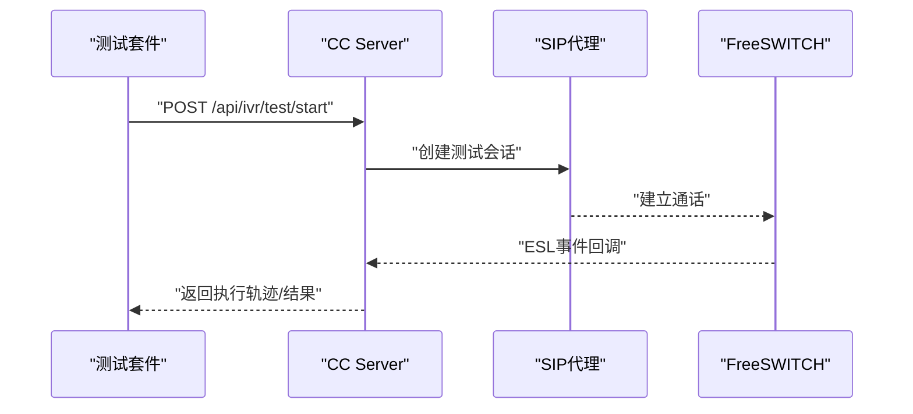
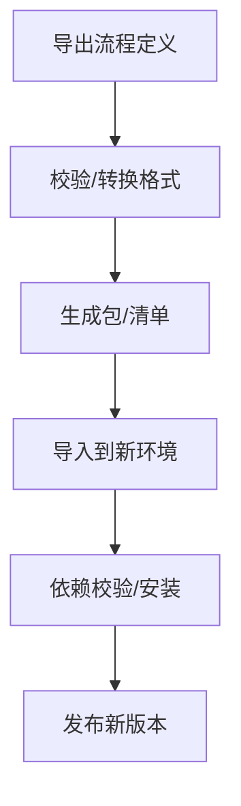
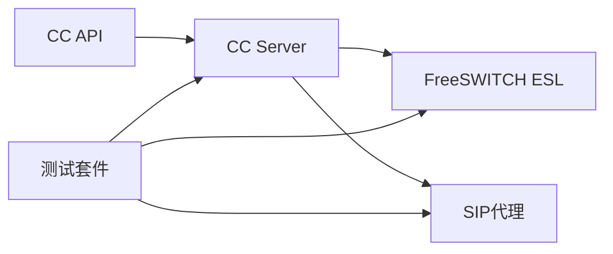

# IVR流程管理API

<cite>
**本文档引用的文件**
- [yudao-module-cc-server/pom.xml](file://yudao-cloud/yudao-module-cc/yudao-module-cc-server/pom.xml)
- [ApiConstants.java](file://yudao-cloud/yudao-module-cc/yudao-module-cc-api/src/main/java/cn/iocoder/yudao/module/cc/enums/ApiConstants.java)
- [ErrorCodeConstants.java](file://yudao-cloud/yudao-module-cc/yudao-module-cc-api/src/main/java/cn/iocoder/yudao/module/cc/enums/ErrorCodeConstants.java)
- [CallRouteStatusEnum.java](file://yudao-cloud/yudao-module-cc/yudao-module-cc-api/src/main/java/cn/iocoder/yudao/module/cc/enums/CallRouteStatusEnum.java)
- [SysVoiceTypeEnum.java](file://yudao-cloud/yudao-module-cc/yudao-module-cc-api/src/main/java/cn/iocoder/yudao/module/cc/enums/SysVoiceTypeEnum.java)
- [SysVoiceTtsTypeEnum.java](file://yudao-cloud/yudao-module-cc/yudao-module-cc-api/src/main/java/cn/iocoder/yudao/module/cc/enums/SysVoiceTtsTypeEnum.java)
- [freeswitch部署脚本1.py](file://yudao-cloud/yudao-module-cc/doc/freeswitch服务/freeswitch部署脚本1.py)
- [freeswitch部署脚本2-用于集群部署-修改了主要端口.py](file://yudao-cloud/yudao-module-cc/doc/freeswitch服务/freeswitch部署脚本2-用于集群部署-修改了主要端口.py)
- [AGENTS.md](file://yudao-cloud/yudao-module-cc/doc/test-all/全场景测试/AGENTS.md)
- [run_all_tests.py](file://yudao-cloud/yudao-module-cc/doc/test-all/全场景测试/run_all_tests.py)
- [test_gateway_api.py](file://yudao-cloud/yudao-module-cc/doc/test-all/全场景测试/test_gateway_api.py)
- [esl_helper.py](file://yudao-cloud/yudao-module-cc/doc/test-all/全场景测试/esl_helper.py)
- [monitor_fs.py](file://yudao-cloud/yudao-module-cc/doc/test-all/全场景测试/monitor_fs.py)
- [fs-esl-client组件架构设计.md](file://yudao-cloud/yudao-module-cc/ipcc-fs-esl/fs-esl-client组件架构设计.md)
- [sipproxy组件架构设计.md](file://yudao-cloud/yudao-module-cc/ipcc-sipproxy/sipproxy组件架构设计.md)
</cite>

## 目录
1. [简介](#简介)
2. [项目结构](#项目结构)
3. [核心组件](#核心组件)
4. [架构总览](#架构总览)
5. [详细组件分析](#详细组件分析)
6. [依赖关系分析](#依赖关系分析)
7. [性能考虑](#性能考虑)
8. [故障排查指南](#故障排查指南)
9. [结论](#结论)
10. [附录](#附录)

## 简介
本文件面向IVR（交互式语音应答）流程管理API，覆盖流程的创建、编辑、发布与版本管理；流程节点配置、执行监控、测试调试；以及导入导出、复制、依赖管理等高级能力。文档基于呼叫中心模块（CC）及其周边组件（FreeSWITCH ESL客户端、SIP代理）进行梳理，结合工程中的枚举常量、测试脚本与组件设计说明，给出可操作的接口约定、数据模型与调用时序建议，帮助开发者快速集成与排障。

## 项目结构
本项目采用多模块微服务架构，IVR相关能力集中在呼叫中心模块（CC），并通过FreeSWITCH事件订阅与SIP代理完成媒体与控制面交互。关键目录与职责如下：
- yudao-module-cc-api：对外暴露的枚举与常量定义（如API常量、错误码、路由状态、语音类型等）
- yudao-module-cc-server：服务端实现（流程编排、节点调度、执行监控、测试调试等）
- ipcc-fs-esl：FreeSWITCH ESL客户端组件，负责事件监听与命令下发
- ipcc-sipproxy：SIP代理组件，负责会话路由与信令转发
- doc/test-all：端到端测试套件，包含网关API测试、FS事件监控、ESL辅助工具等

图表来源
- [yudao-module-cc-server/pom.xml](file://yudao-cloud/yudao-module-cc/yudao-module-cc-server/pom.xml)
- [fs-esl-client组件架构设计.md](file://yudao-cloud/yudao-module-cc/ipcc-fs-esl/fs-esl-client组件架构设计.md)
- [sipproxy组件架构设计.md](file://yudao-cloud/yudao-module-cc/ipcc-sipproxy/sipproxy组件架构设计.md)

章节来源
- [yudao-module-cc-server/pom.xml](file://yudao-cloud/yudao-module-cc/yudao-module-cc-server/pom.xml)

## 核心组件
- 流程与节点
  - 流程：由多个节点组成的有向图，支持条件分支、循环、并行、超时、重试等控制流
  - 节点：包括播放音频、录音、DIALED号码、转人工、查询外部系统、变量设置、挂断等
- 版本管理
  - 流程版本：每次发布生成新版本，支持回滚、对比、灰度
- 执行监控
  - 实时跟踪当前通话在流程中的位置、节点耗时、上下文变量
- 测试调试
  - 提供沙箱环境模拟来电，回放流程并输出日志与指标
- 导入导出与复制
  - 以结构化格式导出/导入流程定义；支持一键复制为新流程或新版本
- 依赖管理
  - 流程对上游服务（如CRM、知识库）的依赖声明与校验

章节来源
- [ApiConstants.java](file://yudao-cloud/yudao-module-cc/yudao-module-cc-api/src/main/java/cn/iocoder/yudao/module/cc/enums/ApiConstants.java)
- [ErrorCodeConstants.java](file://yudao-cloud/yudao-module-cc/yudao-module-cc-api/src/main/java/cn/iocoder/yudao/module/cc/enums/ErrorCodeConstants.java)
- [CallRouteStatusEnum.java](file://yudao-cloud/yudao-module-cc/yudao-module-cc-api/src/main/java/cn/iocoder/yudao/module/cc/enums/CallRouteStatusEnum.java)
- [SysVoiceTypeEnum.java](file://yudao-cloud/yudao-module-cc/yudao-module-cc-api/src/main/java/cn/iocoder/yudao/module/cc/enums/SysVoiceTypeEnum.java)
- [SysVoiceTtsTypeEnum.java](file://yudao-cloud/yudao-module-cc/yudao-module-cc-api/src/main/java/cn/iocoder/yudao/module/cc/enums/SysVoiceTtsTypeEnum.java)

## 架构总览
IVR流程引擎位于CC Server，通过FreeSWITCH ESL订阅通话事件，驱动节点执行；SIP代理处理呼叫接入与会话路由。测试套件通过网关API触发真实或模拟呼叫，验证流程行为。

图表来源
- [fs-esl-client组件架构设计.md](file://yudao-cloud/yudao-module-cc/ipcc-fs-esl/fs-esl-client组件架构设计.md)
- [sipproxy组件架构设计.md](file://yudao-cloud/yudao-module-cc/ipcc-sipproxy/sipproxy组件架构设计.md)

## 详细组件分析

### 流程生命周期与版本管理
- 创建流程：定义节点、连线、默认入口、全局变量
- 编辑流程：在线可视化编辑，保存草稿
- 发布流程：校验依赖、生成版本、上线生效
- 版本管理：查看历史版本、对比差异、回滚到指定版本
- 下线流程：停止新呼叫进入旧流程，保留历史执行记录

章节来源
- [ApiConstants.java](file://yudao-cloud/yudao-module-cc/yudao-module-cc-api/src/main/java/cn/iocoder/yudao/module/cc/enums/ApiConstants.java)
- [ErrorCodeConstants.java](file://yudao-cloud/yudao-module-cc/yudao-module-cc-api/src/main/java/cn/iocoder/yudao/module/cc/enums/ErrorCodeConstants.java)

### 流程节点配置
- 节点类型
  - 播放音频：选择系统语音或TTS文本
  - 录音：录制用户语音并存储
  - 拨号：外呼或转移至分机/号码
  - 条件分支：根据DTMF按键或变量判断
  - 查询外部系统：调用CRM/知识库等
  - 变量设置：设置/更新上下文变量
  - 挂断：结束通话
- 节点属性
  - 超时、重试、错误分支、并行度、并发限制
- 节点间关系
  - 顺序、条件、并行汇聚、循环

图表来源
- [SysVoiceTypeEnum.java](file://yudao-cloud/yudao-module-cc/yudao-module-cc-api/src/main/java/cn/iocoder/yudao/module/cc/enums/SysVoiceTypeEnum.java)
- [SysVoiceTtsTypeEnum.java](file://yudao-cloud/yudao-module-cc/yudao-module-cc-api/src/main/java/cn/iocoder/yudao/module/cc/enums/SysVoiceTtsTypeEnum.java)

章节来源
- [SysVoiceTypeEnum.java](file://yudao-cloud/yudao-module-cc/yudao-module-cc-api/src/main/java/cn/iocoder/yudao/module/cc/enums/SysVoiceTypeEnum.java)
- [SysVoiceTtsTypeEnum.java](file://yudao-cloud/yudao-module-cc/yudao-module-cc-api/src/main/java/cn/iocoder/yudao/module/cc/enums/SysVoiceTtsTypeEnum.java)

### 流程执行监控
- 实时监控：展示当前通话所处节点、停留时长、下一步动作
- 指标采集：成功率、平均耗时、失败原因分布
- 事件溯源：基于FreeSWITCH事件回溯执行路径
- 告警规则：超时、异常、资源不足时触发通知

图表来源
- [monitor_fs.py](file://yudao-cloud/yudao-module-cc/doc/test-all/全场景测试/monitor_fs.py)
- [esl_helper.py](file://yudao-cloud/yudao-module-cc/doc/test-all/全场景测试/esl_helper.py)

章节来源
- [monitor_fs.py](file://yudao-cloud/yudao-module-cc/doc/test-all/全场景测试/monitor_fs.py)
- [esl_helper.py](file://yudao-cloud/yudao-module-cc/doc/test-all/全场景测试/esl_helper.py)

### 流程测试与调试
- 测试入口：通过网关API发起测试呼叫，指定流程ID与入参
- 调试模式：开启详细日志、单步执行、注入DTMF/变量
- 结果验证：检查节点执行顺序、返回值、外部调用结果
- 自动化：批量用例执行、回归测试、覆盖率统计

图表来源
- [test_gateway_api.py](file://yudao-cloud/yudao-module-cc/doc/test-all/全场景测试/test_gateway_api.py)
- [run_all_tests.py](file://yudao-cloud/yudao-module-cc/doc/test-all/全场景测试/run_all_tests.py)

章节来源
- [test_gateway_api.py](file://yudao-cloud/yudao-module-cc/doc/test-all/全场景测试/test_gateway_api.py)
- [run_all_tests.py](file://yudao-cloud/yudao-module-cc/doc/test-all/全场景测试/run_all_tests.py)

### 导入导出、复制与依赖管理
- 导入导出：以JSON/YAML描述流程拓扑与节点配置，便于迁移与备份
- 复制：基于现有流程快速克隆为新流程或新版本
- 依赖管理：声明对外部服务的依赖（URL、鉴权、超时），发布前校验可用性

章节来源
- [ApiConstants.java](file://yudao-cloud/yudao-module-cc/yudao-module-cc-api/src/main/java/cn/iocoder/yudao/module/cc/enums/ApiConstants.java)
- [ErrorCodeConstants.java](file://yudao-cloud/yudao-module-cc/yudao-module-cc-api/src/main/java/cn/iocoder/yudao/module/cc/enums/ErrorCodeConstants.java)

## 依赖关系分析
- 内部依赖
  - CC Server依赖CC API的枚举与常量，统一错误码与状态语义
- 外部依赖
  - FreeSWITCH ESL：事件订阅与命令下发
  - SIP代理：会话路由与信令转发
- 测试依赖
  - 测试套件依赖网关API、FS事件监控、ESL辅助工具

图表来源
- [yudao-module-cc-server/pom.xml](file://yudao-cloud/yudao-module-cc/yudao-module-cc-server/pom.xml)
- [fs-esl-client组件架构设计.md](file://yudao-cloud/yudao-module-cc/ipcc-fs-esl/fs-esl-client组件架构设计.md)
- [sipproxy组件架构设计.md](file://yudao-cloud/yudao-module-cc/ipcc-sipproxy/sipproxy组件架构设计.md)

章节来源
- [yudao-module-cc-server/pom.xml](file://yudao-cloud/yudao-module-cc/yudao-module-cc-server/pom.xml)

## 性能考虑
- 并发与吞吐
  - 合理设置节点并发度与队列长度，避免阻塞
  - 使用连接池与异步I/O提升事件处理效率
- 超时与重试
  - 为外部调用与媒体操作设置合理超时与重试策略
- 资源隔离
  - 不同租户/环境隔离资源，避免相互影响
- 监控与限流
  - 关键指标上报与阈值告警，必要时限流保护

[本节为通用指导，不直接分析具体文件]

## 故障排查指南
- 常见问题定位
  - 流程无法启动：检查流程版本是否激活、依赖是否满足
  - 节点执行失败：查看节点日志、外部调用响应、错误码
  - 通话无事件：确认SIP注册、FreeSWITCH连通性、ESL订阅
- 常用工具
  - 使用测试套件发起测试呼叫，观察执行轨迹
  - 通过FS事件监控脚本抓取原始事件，辅助定位
  - 使用ESL辅助工具发送命令或订阅事件
- 环境与部署
  - 参考FreeSWITCH部署脚本，确保端口与网络配置正确
  - 检查SIP代理与FreeSWITCH之间的信令互通

章节来源
- [AGENTS.md](file://yudao-cloud/yudao-module-cc/doc/test-all/全场景测试/AGENTS.md)
- [run_all_tests.py](file://yudao-cloud/yudao-module-cc/doc/test-all/全场景测试/run_all_tests.py)
- [test_gateway_api.py](file://yudao-cloud/yudao-module-cc/doc/test-all/全场景测试/test_gateway_api.py)
- [monitor_fs.py](file://yudao-cloud/yudao-module-cc/doc/test-all/全场景测试/monitor_fs.py)
- [esl_helper.py](file://yudao-cloud/yudao-module-cc/doc/test-all/全场景测试/esl_helper.py)
- [freeswitch部署脚本1.py](file://yudao-cloud/yudao-module-cc/doc/freeswitch服务/freeswitch部署脚本1.py)
- [freeswitch部署脚本2-用于集群部署-修改了主要端口.py](file://yudao-cloud/yudao-module-cc/doc/freeswitch服务/freeswitch部署脚本2-用于集群部署-修改了主要端口.py)

## 结论
本方案以CC Server为核心，结合FreeSWITCH ESL与SIP代理，构建了完整的IVR流程管理能力，涵盖流程建模、版本管理、执行监控、测试调试及导入导出、复制与依赖管理。通过统一的枚举与错误码规范，保障前后端一致性与可维护性；借助完善的测试套件与监控手段，提升交付质量与运维效率。

## 附录
- 接口约定建议
  - 流程CRUD：/api/ivr/flows
  - 版本管理：/api/ivr/versions
  - 执行监控：/api/ivr/executions
  - 测试调试：/api/ivr/test
  - 导入导出：/api/ivr/import, /api/ivr/export
  - 复制：/api/ivr/copy
  - 依赖管理：/api/ivr/dependencies
- 数据模型要点
  - 流程：id、名称、描述、版本、状态、节点集合、全局变量
  - 节点：id、类型、配置、超时、重试、错误分支
  - 执行：sessionId、流程版本、节点序列、上下文变量、时间戳
- 示例与结果说明
  - 创建流程后，发布新版本并激活；发起测试呼叫，观察节点执行顺序与返回结果；若失败，依据错误码与日志定位问题

[本节为补充说明，不直接分析具体文件]