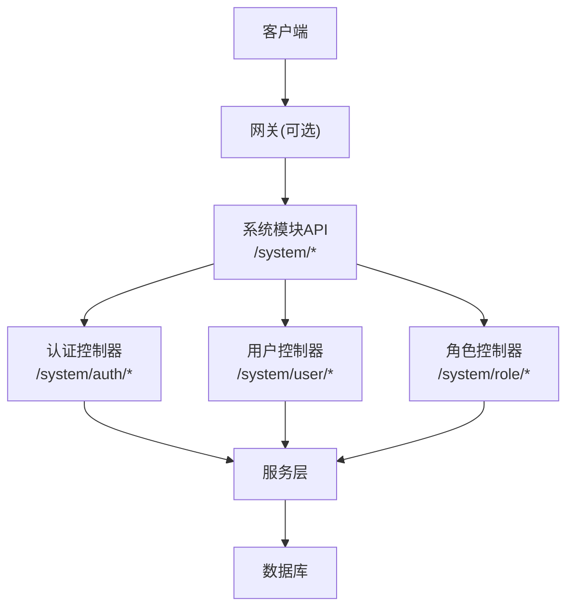
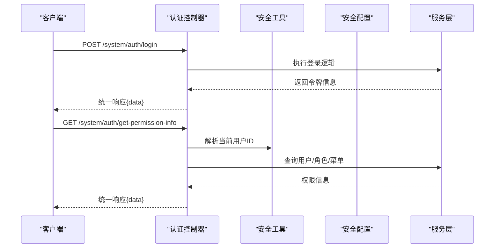
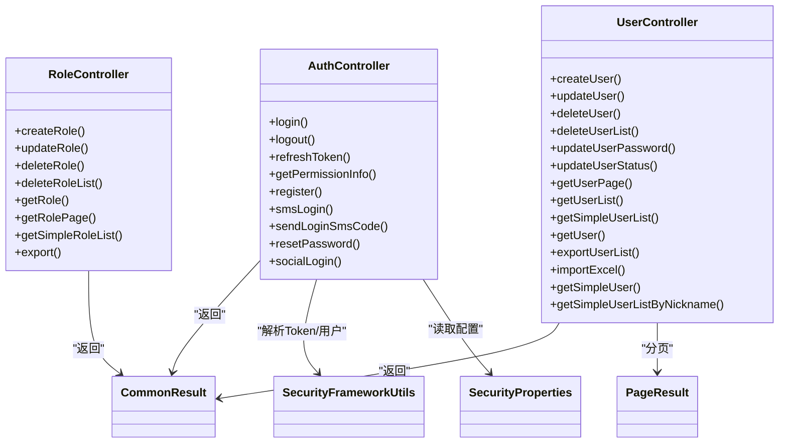

# RESTful API接口

<cite>
**本文引用的文件**
- [AuthController.java](file://yudao-cloud/yudao-module-system/yudao-module-system-server/src/main/java/cn/iocoder/yudao/module/system/controller/admin/auth/AuthController.java)
- [UserController.java](file://yudao-cloud/yudao-module-system/yudao-module-system-server/src/main/java/cn/iocoder/yudao/module/system/controller/admin/user/UserController.java)
- [RoleController.java](file://yudao-cloud/yudao-module-system/yudao-module-system-server/src/main/java/cn/iocoder/yudao/module/system/controller/admin/permission/RoleController.java)
- [CommonResult.java](file://yudao-cloud/yudao-framework/yudao-common/src/main/java/cn/iocoder/yudao/framework/common/pojo/CommonResult.java)
- [PageParam.java](file://yudao-cloud/yudao-framework/yudao-common/src/main/java/cn/iocoder/yudao/framework/common/pojo/PageParam.java)
- [PageResult.java](file://yudao-cloud/yudao-framework/yudao-common/src/main/java/cn/iocoder/yudao/framework/common/pojo/PageResult.java)
- [SecurityProperties.java](file://yudao-cloud/yudao-framework/yudao-spring-boot-starter-security/src/main/java/cn/iocoder/yudao/framework/security/config/SecurityProperties.java)
- [SecurityFrameworkUtils.java](file://yudao-cloud/yudao-framework/yudao-spring-boot-starter-security/src/main/java/cn/iocoder/yudao/framework/security/core/util/SecurityFrameworkUtils.java)
</cite>

## 目录
1. [简介](#简介)
2. [项目结构](#项目结构)
3. [核心组件](#核心组件)
4. [架构总览](#架构总览)
5. [详细组件分析](#详细组件分析)
6. [依赖关系分析](#依赖关系分析)
7. [性能考虑](#性能考虑)
8. [故障排查指南](#故障排查指南)
9. [结论](#结论)
10. [附录](#附录)

## 简介
本文件为管理后台RESTful API的完整接口文档，覆盖认证、用户与角色等核心能力。内容包含：
- HTTP方法与URL模式
- 请求参数、响应格式与状态码约定
- 认证机制、权限控制、数据验证规则与错误处理
- 分页、排序、过滤等通用查询能力
- API版本管理、速率限制与安全建议
- 客户端集成指南与常见用例示例（以路径引用代替具体代码）

## 项目结构
系统采用模块化分层架构：
- 控制器层：按业务域划分（认证、用户、权限等），统一前缀 /system
- 服务层：封装业务逻辑
- 数据访问层：实体与DAO
- 框架层：安全、分页、统一响应、日志等通用能力

图表来源
- [AuthController.java:43-48](file://yudao-cloud/yudao-module-system/yudao-module-system-server/src/main/java/cn/iocoder/yudao/module/system/controller/admin/auth/AuthController.java#L43-L48)
- [UserController.java:42-46](file://yudao-cloud/yudao-module-system/yudao-module-system-server/src/main/java/cn/iocoder/yudao/module/system/controller/admin/user/UserController.java#L42-L46)
- [RoleController.java:33-37](file://yudao-cloud/yudao-module-system/yudao-module-system-server/src/main/java/cn/iocoder/yudao/module/system/controller/admin/permission/RoleController.java#L33-L37)

章节来源
- [AuthController.java:43-48](file://yudao-cloud/yudao-module-system/yudao-module-system-server/src/main/java/cn/iocoder/yudao/module/system/controller/admin/auth/AuthController.java#L43-L48)
- [UserController.java:42-46](file://yudao-cloud/yudao-module-system/yudao-module-system-server/src/main/java/cn/iocoder/yudao/module/system/controller/admin/user/UserController.java#L42-L46)
- [RoleController.java:33-37](file://yudao-cloud/yudao-module-system/yudao-module-system-server/src/main/java/cn/iocoder/yudao/module/system/controller/admin/permission/RoleController.java#L33-L37)

## 核心组件
- 统一响应体 CommonResult：所有接口返回统一包装，便于前端一致处理
- 分页 PageParam/PageResult：标准分页入参与出参结构
- 安全配置 SecurityProperties：Token头名、参数名等可配置项
- 安全工具 SecurityFrameworkUtils：从请求中解析Token、获取当前登录用户ID

章节来源
- [CommonResult.java](file://yudao-cloud/yudao-framework/yudao-common/src/main/java/cn/iocoder/yudao/framework/common/pojo/CommonResult.java)
- [PageParam.java](file://yudao-cloud/yudao-framework/yudao-common/src/main/java/cn/iocoder/yudao/framework/common/pojo/PageParam.java)
- [PageResult.java](file://yudao-cloud/yudao-framework/yudao-common/src/main/java/cn/iocoder/yudao/framework/common/pojo/PageResult.java)
- [SecurityProperties.java](file://yudao-cloud/yudao-framework/yudao-spring-boot-starter-security/src/main/java/cn/iocoder/yudao/framework/security/config/SecurityProperties.java)
- [SecurityFrameworkUtils.java](file://yudao-cloud/yudao-framework/yudao-spring-boot-starter-security/src/main/java/cn/iocoder/yudao/framework/security/core/util/SecurityFrameworkUtils.java)

## 架构总览
认证流程时序如下：

图表来源
- [AuthController.java:66-118](file://yudao-cloud/yudao-module-system/yudao-module-system-server/src/main/java/cn/iocoder/yudao/module/system/controller/admin/auth/AuthController.java#L66-L118)
- [SecurityFrameworkUtils.java](file://yudao-cloud/yudao-framework/yudao-spring-boot-starter-security/src/main/java/cn/iocoder/yudao/framework/security/core/util/SecurityFrameworkUtils.java)
- [SecurityProperties.java](file://yudao-cloud/yudao-framework/yudao-spring-boot-starter-security/src/main/java/cn/iocoder/yudao/framework/security/config/SecurityProperties.java)

## 详细组件分析

### 认证模块（/system/auth）
- 账号密码登录
  - 方法：POST
  - URL：/system/auth/login
  - 请求体：见[AuthLoginReqVO](file://yudao-cloud/yudao-module-system/yudao-module-system-server/src/main/java/cn/iocoder/yudao/module/system/controller/admin/auth/vo/AuthLoginReqVO.java)
  - 响应：CommonResult<AuthLoginRespVO>，见[AuthLoginRespVO](file://yudao-cloud/yudao-module-system/yudao-module-system-server/src/main/java/cn/iocoder/yudao/module/system/controller/admin/auth/vo/AuthLoginRespVO.java)
  - 状态码：成功200；失败由框架统一异常处理返回
  - 参考实现：[AuthController.java:66-71](file://yudao-cloud/yudao-module-system/yudao-module-system-server/src/main/java/cn/iocoder/yudao/module/system/controller/admin/auth/AuthController.java#L66-L71)

- 登出
  - 方法：POST
  - URL：/system/auth/logout
  - 鉴权：无需登录（PermitAll）
  - 说明：从请求中读取Token并注销
  - 参考实现：[AuthController.java:73-83](file://yudao-cloud/yudao-module-system/yudao-module-system-server/src/main/java/cn/iocoder/yudao/module/system/controller/admin/auth/AuthController.java#L73-L83)

- 刷新令牌
  - 方法：POST
  - URL：/system/auth/refresh-token
  - 参数：refreshToken（查询参数）
  - 响应：CommonResult<AuthLoginRespVO>
  - 参考实现：[AuthController.java:85-91](file://yudao-cloud/yudao-module-system/yudao-module-system-server/src/main/java/cn/iocoder/yudao/module/system/controller/admin/auth/AuthController.java#L85-L91)

- 获取权限信息
  - 方法：GET
  - URL：/system/auth/get-permission-info
  - 说明：返回当前用户的角色、菜单等权限信息
  - 参考实现：[AuthController.java:93-118](file://yudao-cloud/yudao-module-system/yudao-module-system-server/src/main/java/cn/iocoder/yudao/module/system/controller/admin/auth/AuthController.java#L93-L118)

- 注册
  - 方法：POST
  - URL：/system/auth/register
  - 请求体：见[AuthRegisterReqVO](file://yudao-cloud/yudao-module-system/yudao-module-system-server/src/main/java/cn/iocoder/yudao/module/system/controller/admin/auth/vo/AuthRegisterReqVO.java)
  - 参考实现：[AuthController.java:120-125](file://yudao-cloud/yudao-module-system/yudao-module-system-server/src/main/java/cn/iocoder/yudao/module/system/controller/admin/auth/AuthController.java#L120-L125)

- 短信验证码登录
  - 方法：POST
  - URL：/system/auth/sms-login
  - 请求体：见[AuthSmsLoginReqVO](file://yudao-cloud/yudao-module-system/yudao-module-system-server/src/main/java/cn/iocoder/yudao/module/system/controller/admin/auth/vo/AuthSmsLoginReqVO.java)
  - 参考实现：[AuthController.java:129-136](file://yudao-cloud/yudao-module-system/yudao-module-system-server/src/main/java/cn/iocoder/yudao/module/system/controller/admin/auth/AuthController.java#L129-L136)

- 发送登录验证码
  - 方法：POST
  - URL：/system/auth/send-sms-code
  - 请求体：见[AuthSmsSendReqVO](file://yudao-cloud/yudao-module-system/yudao-module-system-server/src/main/java/cn/iocoder/yudao/module/system/controller/admin/auth/vo/AuthSmsSendReqVO.java)
  - 参考实现：[AuthController.java:138-144](file://yudao-cloud/yudao-module-system/yudao-module-system-server/src/main/java/cn/iocoder/yudao/module/system/controller/admin/auth/AuthController.java#L138-L144)

- 重置密码
  - 方法：POST
  - URL：/system/auth/reset-password
  - 请求体：见[AuthResetPasswordReqVO](file://yudao-cloud/yudao-module-system/yudao-module-system-server/src/main/java/cn/iocoder/yudao/module/system/controller/admin/auth/vo/AuthResetPasswordReqVO.java)
  - 参考实现：[AuthController.java:146-152](file://yudao-cloud/yudao-module-system/yudao-module-system-server/src/main/java/cn/iocoder/yudao/module/system/controller/admin/auth/AuthController.java#L146-L152)

- 社交授权跳转
  - 方法：GET
  - URL：/system/auth/social-auth-redirect
  - 参数：type（社交类型）、redirectUri（回调地址）
  - 参考实现：[AuthController.java:156-167](file://yudao-cloud/yudao-module-system/yudao-module-system-server/src/main/java/cn/iocoder/yudao/module/system/controller/admin/auth/AuthController.java#L156-L167)

- 社交快捷登录
  - 方法：POST
  - URL：/system/auth/social-login
  - 请求体：见[AuthSocialLoginReqVO](file://yudao-cloud/yudao-module-system/yudao-module-system-server/src/main/java/cn/iocoder/yudao/module/system/controller/admin/auth/vo/AuthSocialLoginReqVO.java)
  - 参考实现：[AuthController.java:169-174](file://yudao-cloud/yudao-module-system/yudao-module-system-server/src/main/java/cn/iocoder/yudao/module/system/controller/admin/auth/AuthController.java#L169-L174)

章节来源
- [AuthController.java:66-174](file://yudao-cloud/yudao-module-system/yudao-module-system-server/src/main/java/cn/iocoder/yudao/module/system/controller/admin/auth/AuthController.java#L66-L174)

### 用户模块（/system/user）
- 新增用户
  - 方法：POST
  - URL：/system/user/create
  - 权限：system:user:create
  - 请求体：见[UserSaveReqVO](file://yudao-cloud/yudao-module-system/yudao-module-system-server/src/main/java/cn/iocoder/yudao/module/system/controller/admin/user/vo/user/UserSaveReqVO.java)
  - 参考实现：[UserController.java:53-59](file://yudao-cloud/yudao-module-system/yudao-module-system-server/src/main/java/cn/iocoder/yudao/module/system/controller/admin/user/UserController.java#L53-L59)

- 修改用户
  - 方法：PUT
  - URL：/system/user/update
  - 权限：system:user:update
  - 请求体：同新增
  - 参考实现：[UserController.java:61-67](file://yudao-cloud/yudao-module-system/yudao-module-system-server/src/main/java/cn/iocoder/yudao/module/system/controller/admin/user/UserController.java#L61-L67)

- 删除用户
  - 方法：DELETE
  - URL：/system/user/delete
  - 参数：id
  - 权限：system:user:delete
  - 参考实现：[UserController.java:69-76](file://yudao-cloud/yudao-module-system/yudao-module-system-server/src/main/java/cn/iocoder/yudao/module/system/controller/admin/user/UserController.java#L69-L76)

- 批量删除用户
  - 方法：DELETE
  - URL：/system/user/delete-list
  - 参数：ids（列表）
  - 权限：system:user:delete
  - 参考实现：[UserController.java:78-85](file://yudao-cloud/yudao-module-system/yudao-module-system-server/src/main/java/cn/iocoder/yudao/module/system/controller/admin/user/UserController.java#L78-L85)

- 重置用户密码
  - 方法：PUT
  - URL：/system/user/update-password
  - 权限：system:user:update-password
  - 请求体：见[UserUpdatePasswordReqVO](file://yudao-cloud/yudao-module-system/yudao-module-system-server/src/main/java/cn/iocoder/yudao/module/system/controller/admin/user/vo/user/UserUpdatePasswordReqVO.java)
  - 参考实现：[UserController.java:87-93](file://yudao-cloud/yudao-module-system/yudao-module-system-server/src/main/java/cn/iocoder/yudao/module/system/controller/admin/user/UserController.java#L87-L93)

- 修改用户状态
  - 方法：PUT
  - URL：/system/user/update-status
  - 权限：system:user:update
  - 请求体：见[UserUpdateStatusReqVO](file://yudao-cloud/yudao-module-system/yudao-module-system-server/src/main/java/cn/iocoder/yudao/module/system/controller/admin/user/vo/user/UserUpdateStatusReqVO.java)
  - 参考实现：[UserController.java:95-101](file://yudao-cloud/yudao-module-system/yudao-module-system-server/src/main/java/cn/iocoder/yudao/module/system/controller/admin/user/UserController.java#L95-L101)

- 分页查询用户
  - 方法：GET
  - URL：/system/user/page
  - 权限：system:user:query
  - 参数：分页与筛选见[UserPageReqVO](file://yudao-cloud/yudao-module-system/yudao-module-system-server/src/main/java/cn/iocoder/yudao/module/system/controller/admin/user/vo/user/UserPageReqVO.java)
  - 响应：PageResult<UserRespVO>
  - 参考实现：[UserController.java:103-117](file://yudao-cloud/yudao-module-system/yudao-module-system-server/src/main/java/cn/iocoder/yudao/module/system/controller/admin/user/UserController.java#L103-L117)

- 按ID列表获取用户详情
  - 方法：GET
  - URL：/system/user/list
  - 权限：system:user:query
  - 参数：ids（列表）
  - 参考实现：[UserController.java:119-131](file://yudao-cloud/yudao-module-system/yudao-module-system-server/src/main/java/cn/iocoder/yudao/module/system/controller/admin/user/UserController.java#L119-L131)

- 获取精简用户列表（下拉选项）
  - 方法：GET
  - URL：/system/user/list-all-simple 或 /system/user/simple-list
  - 参数：deptId（可选）
  - 参考实现：[UserController.java:133-144](file://yudao-cloud/yudao-module-system/yudao-module-system-server/src/main/java/cn/iocoder/yudao/module/system/controller/admin/user/UserController.java#L133-L144)

- 获取用户详情
  - 方法：GET
  - URL：/system/user/get
  - 权限：system:user:query
  - 参数：id
  - 参考实现：[UserController.java:146-158](file://yudao-cloud/yudao-module-system/yudao-module-system-server/src/main/java/cn/iocoder/yudao/module/system/controller/admin/user/UserController.java#L146-L158)

- 导出用户Excel
  - 方法：GET
  - URL：/system/user/export-excel
  - 权限：system:user:export
  - 参数：同分页查询（忽略分页大小）
  - 参考实现：[UserController.java:160-173](file://yudao-cloud/yudao-module-system/yudao-module-system-server/src/main/java/cn/iocoder/yudao/module/system/controller/admin/user/UserController.java#L160-L173)

- 导入用户Excel
  - 方法：POST
  - URL：/system/user/import
  - 权限：system:user:import
  - 参数：file（MultipartFile）、updateSupport（是否支持更新）
  - 参考实现：[UserController.java:189-200](file://yudao-cloud/yudao-module-system/yudao-module-system-server/src/main/java/cn/iocoder/yudao/module/system/controller/admin/user/UserController.java#L189-L200)

- 免鉴权：获取精简用户信息
  - 方法：GET
  - URL：/system/user/get-simple
  - 参数：id
  - 参考实现：[UserController.java:204-217](file://yudao-cloud/yudao-module-system/yudao-module-system-server/src/main/java/cn/iocoder/yudao/module/system/controller/admin/user/UserController.java#L204-L217)

- 免鉴权：按昵称模糊搜索用户
  - 方法：GET
  - URL：/system/user/list-by-nickname
  - 参数：nickname
  - 参考实现：[UserController.java:219-230](file://yudao-cloud/yudao-module-system/yudao-module-system-server/src/main/java/cn/iocoder/yudao/module/system/controller/admin/user/UserController.java#L219-L230)

章节来源
- [UserController.java:53-230](file://yudao-cloud/yudao-module-system/yudao-module-system-server/src/main/java/cn/iocoder/yudao/module/system/controller/admin/user/UserController.java#L53-L230)

### 角色模块（/system/role）
- 创建角色
  - 方法：POST
  - URL：/system/role/create
  - 权限：system:role:create
  - 请求体：见[RoleSaveReqVO](file://yudao-cloud/yudao-module-system/yudao-module-system-server/src/main/java/cn/iocoder/yudao/module/system/controller/admin/permission/vo/role/RoleSaveReqVO.java)
  - 参考实现：[RoleController.java:42-47](file://yudao-cloud/yudao-module-system/yudao-module-system-server/src/main/java/cn/iocoder/yudao/module/system/controller/admin/permission/RoleController.java#L42-L47)

- 修改角色
  - 方法：PUT
  - URL：/system/role/update
  - 权限：system:role:update
  - 请求体：同创建
  - 参考实现：[RoleController.java:49-55](file://yudao-cloud/yudao-module-system/yudao-module-system-server/src/main/java/cn/iocoder/yudao/module/system/controller/admin/permission/RoleController.java#L49-L55)

- 删除角色
  - 方法：DELETE
  - URL：/system/role/delete
  - 权限：system:role:delete
  - 参数：id
  - 参考实现：[RoleController.java:57-64](file://yudao-cloud/yudao-module-system/yudao-module-system-server/src/main/java/cn/iocoder/yudao/module/system/controller/admin/permission/RoleController.java#L57-L64)

- 批量删除角色
  - 方法：DELETE
  - URL：/system/role/delete-list
  - 权限：system:role:delete
  - 参数：ids（列表）
  - 参考实现：[RoleController.java:66-73](file://yudao-cloud/yudao-module-system/yudao-module-system-server/src/main/java/cn/iocoder/yudao/module/system/controller/admin/permission/RoleController.java#L66-L73)

- 获取角色详情
  - 方法：GET
  - URL：/system/role/get
  - 权限：system:role:query
  - 参数：id
  - 参考实现：[RoleController.java:75-81](file://yudao-cloud/yudao-module-system/yudao-module-system-server/src/main/java/cn/iocoder/yudao/module/system/controller/admin/permission/RoleController.java#L75-L81)

- 分页查询角色
  - 方法：GET
  - URL：/system/role/page
  - 权限：system:role:query
  - 参数：分页与筛选见[RolePageReqVO](file://yudao-cloud/yudao-module-system/yudao-module-system-server/src/main/java/cn/iocoder/yudao/module/system/controller/admin/permission/vo/role/RolePageReqVO.java)
  - 响应：PageResult<RoleRespVO>
  - 参考实现：[RoleController.java:83-89](file://yudao-cloud/yudao-module-system/yudao-module-system-server/src/main/java/cn/iocoder/yudao/module/system/controller/admin/permission/RoleController.java#L83-L89)

- 获取精简角色列表（下拉选项）
  - 方法：GET
  - URL：/system/role/list-all-simple 或 /system/role/simple-list
  - 说明：仅返回启用角色并按sort排序
  - 参考实现：[RoleController.java:91-97](file://yudao-cloud/yudao-module-system/yudao-module-system-server/src/main/java/cn/iocoder/yudao/module/system/controller/admin/permission/RoleController.java#L91-L97)

- 导出角色Excel
  - 方法：GET
  - URL：/system/role/export-excel
  - 权限：system:role:export
  - 参数：同分页查询（忽略分页大小）
  - 参考实现：[RoleController.java:99-109](file://yudao-cloud/yudao-module-system/yudao-module-system-server/src/main/java/cn/iocoder/yudao/module/system/controller/admin/permission/RoleController.java#L99-L109)

章节来源
- [RoleController.java:42-109](file://yudao-cloud/yudao-module-system/yudao-module-system-server/src/main/java/cn/iocoder/yudao/module/system/controller/admin/permission/RoleController.java#L42-L109)

## 依赖关系分析
- 控制器依赖服务层进行业务处理
- 安全框架通过注解与工具类完成鉴权与上下文获取
- 统一响应体与分页对象贯穿各接口

图表来源
- [AuthController.java:43-174](file://yudao-cloud/yudao-module-system/yudao-module-system-server/src/main/java/cn/iocoder/yudao/module/system/controller/admin/auth/AuthController.java#L43-L174)
- [UserController.java:42-230](file://yudao-cloud/yudao-module-system/yudao-module-system-server/src/main/java/cn/iocoder/yudao/module/system/controller/admin/user/UserController.java#L42-L230)
- [RoleController.java:33-109](file://yudao-cloud/yudao-module-system/yudao-module-system-server/src/main/java/cn/iocoder/yudao/module/system/controller/admin/permission/RoleController.java#L33-L109)
- [CommonResult.java](file://yudao-cloud/yudao-framework/yudao-common/src/main/java/cn/iocoder/yudao/framework/common/pojo/CommonResult.java)
- [PageResult.java](file://yudao-cloud/yudao-framework/yudao-common/src/main/java/cn/iocoder/yudao/framework/common/pojo/PageResult.java)
- [SecurityFrameworkUtils.java](file://yudao-cloud/yudao-framework/yudao-spring-boot-starter-security/src/main/java/cn/iocoder/yudao/framework/security/core/util/SecurityFrameworkUtils.java)
- [SecurityProperties.java](file://yudao-cloud/yudao-framework/yudao-spring-boot-starter-security/src/main/java/cn/iocoder/yudao/framework/security/config/SecurityProperties.java)

## 性能考虑
- 分页查询：使用 PageParam/PageResult，避免全量拉取
- 导出接口：显式设置不限制分页大小，注意大数据量时的内存与IO压力
- 缓存与索引：建议在高频查询字段上建立索引（如用户名、手机号、部门ID等）
- 限流：登录与短信相关接口可按需开启限流（代码中有注释示例）

## 故障排查指南
- 认证失败
  - 检查Token是否正确传递（Header/Parameter，参考[SecurityProperties](file://yudao-cloud/yudao-framework/yudao-spring-boot-starter-security/src/main/java/cn/iocoder/yudao/framework/security/config/SecurityProperties.java)）
  - 确认服务端已正确解析Token（参考[SecurityFrameworkUtils](file://yudao-cloud/yudao-framework/yudao-spring-boot-starter-security/src/main/java/cn/iocoder/yudao/framework/security/core/util/SecurityFrameworkUtils.java)）
- 权限不足
  - 检查接口上的@PreAuthorize权限标识是否赋予当前角色
- 参数校验失败
  - 检查请求体是否符合对应VO定义（如UserSaveReqVO、RoleSaveReqVO等）
- 分页为空
  - 检查查询条件与数据库数据一致性

章节来源
- [SecurityProperties.java](file://yudao-cloud/yudao-framework/yudao-spring-boot-starter-security/src/main/java/cn/iocoder/yudao/framework/security/config/SecurityProperties.java)
- [SecurityFrameworkUtils.java](file://yudao-cloud/yudao-framework/yudao-spring-boot-starter-security/src/main/java/cn/iocoder/yudao/framework/security/core/util/SecurityFrameworkUtils.java)

## 结论
本API基于Spring MVC与统一框架组件构建，提供标准化的认证、用户与角色管理能力。通过统一的响应体与分页模型，简化了前后端协作。结合注解式权限控制与可配置的安全策略，满足企业级应用的安全与扩展需求。

## 附录

### 通用约定
- 统一响应体
  - 结构：CommonResult<T>，包含code、message、data等字段
  - 参考：[CommonResult.java](file://yudao-cloud/yudao-framework/yudao-common/src/main/java/cn/iocoder/yudao/framework/common/pojo/CommonResult.java)

- 分页模型
  - 入参：PageParam（页码、每页条数、排序等）
  - 出参：PageResult<T>（list、total等）
  - 参考：[PageParam.java](file://yudao-cloud/yudao-framework/yudao-common/src/main/java/cn/iocoder/yudao/framework/common/pojo/PageParam.java)、[PageResult.java](file://yudao-cloud/yudao-framework/yudao-common/src/main/java/cn/iocoder/yudao/framework/common/pojo/PageResult.java)

- 认证与鉴权
  - Token位置：由SecurityProperties配置（Header/Parameter）
  - 鉴权方式：@PreAuthorize("@ss.hasPermission('...')")
  - 参考：[SecurityProperties.java](file://yudao-cloud/yudao-framework/yudao-spring-boot-starter-security/src/main/java/cn/iocoder/yudao/framework/security/config/SecurityProperties.java)

- 错误处理
  - 参数校验失败：由框架统一抛出，返回标准错误响应
  - 业务异常：在服务层抛出，统一捕获后返回

- 版本管理
  - 当前未在前缀体现版本号，可通过网关或路由策略进行版本隔离

- 速率限制
  - 登录与短信接口可按需开启限流（代码注释中提供了示例思路）

- 安全建议
  - 强制HTTPS
  - 最小权限原则分配角色与菜单
  - 对敏感操作记录审计日志（部分接口已标注访问日志）

### 客户端集成指南
- 登录流程
  - 调用POST /system/auth/login获取令牌
  - 后续请求携带令牌（按SecurityProperties配置）
  - 参考：[AuthController.java:66-71](file://yudao-cloud/yudao-module-system/yudao-module-system-server/src/main/java/cn/iocoder/yudao/module/system/controller/admin/auth/AuthController.java#L66-L71)

- 获取权限信息
  - 调用GET /system/auth/get-permission-info
  - 用于渲染菜单与按钮权限
  - 参考：[AuthController.java:93-118](file://yudao-cloud/yudao-module-system/yudao-module-system-server/src/main/java/cn/iocoder/yudao/module/system/controller/admin/auth/AuthController.java#L93-L118)

- 分页查询示例
  - 调用GET /system/user/page，传入pageNo、pageSize及筛选条件
  - 参考：[UserController.java:103-117](file://yudao-cloud/yudao-module-system/yudao-module-system-server/src/main/java/cn/iocoder/yudao/module/system/controller/admin/user/UserController.java#L103-L117)

- 导出Excel示例
  - 调用GET /system/user/export-excel，传入筛选条件
  - 参考：[UserController.java:160-173](file://yudao-cloud/yudao-module-system/yudao-module-system-server/src/main/java/cn/iocoder/yudao/module/system/controller/admin/user/UserController.java#L160-L173)