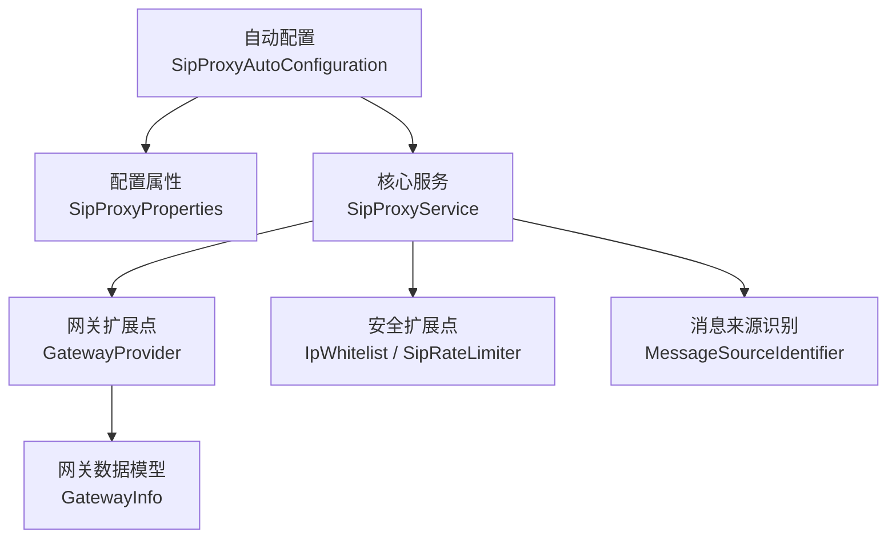
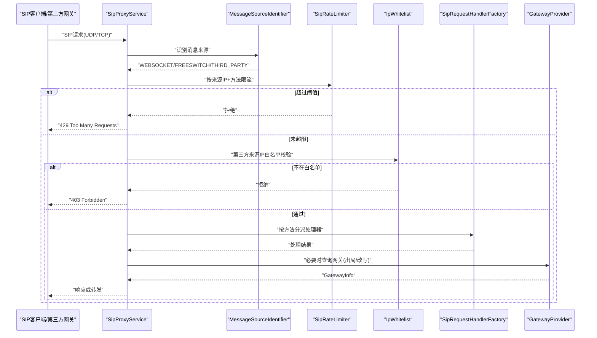
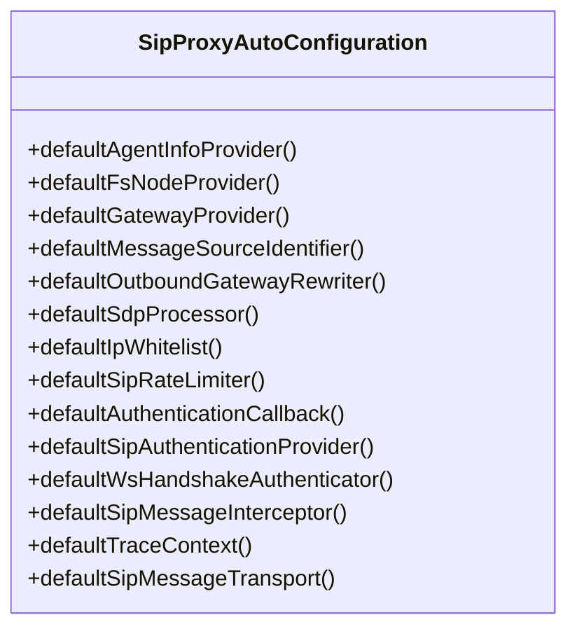
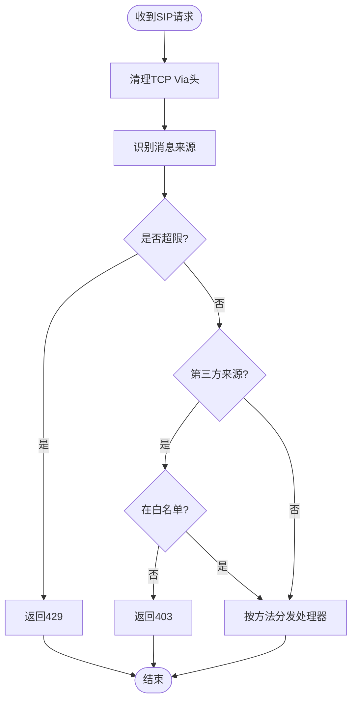
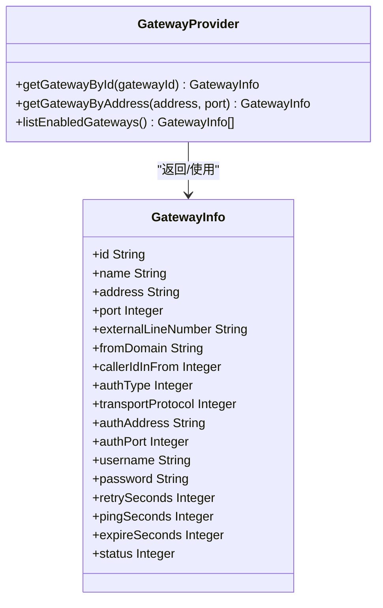
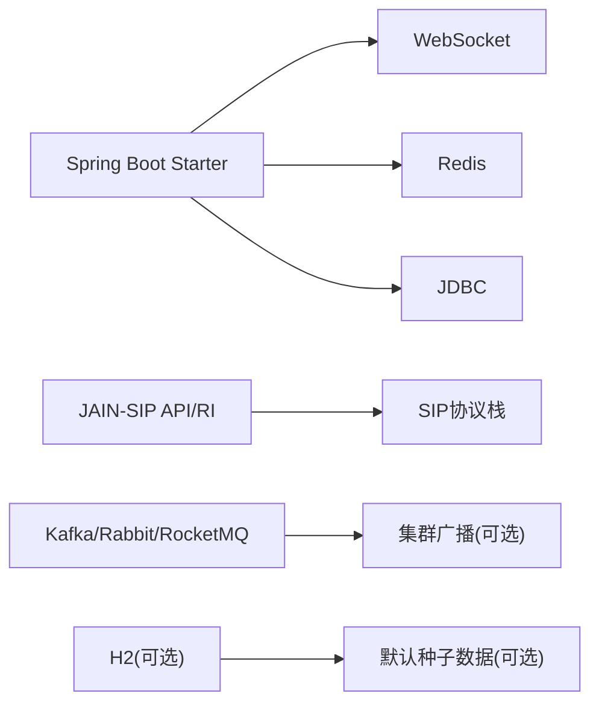

# SIP代理管理API

<cite>
**本文引用的文件**
- [SipProxyAutoConfiguration.java](file://yudao-cloud/yudao-module-cc/ipcc-sipproxy/src/main/java/cn/ipcc/sipproxy/autoconfigure/SipProxyAutoConfiguration.java)
- [SipProxyProperties.java](file://yudao-cloud/yudao-module-cc/ipcc-sipproxy/src/main/java/cn/ipcc/sipproxy/autoconfigure/SipProxyProperties.java)
- [SipProxyService.java](file://yudao-cloud/yudao-module-cc/ipcc-sipproxy/src/main/java/cn/ipcc/sipproxy/core/SipProxyService.java)
- [GatewayProvider.java](file://yudao-cloud/yudao-module-cc/ipcc-sipproxy/src/main/java/cn/ipcc/sipproxy/api/gateway/GatewayProvider.java)
- [GatewayInfo.java](file://yudao-cloud/yudao-module-cc/ipcc-sipproxy/src/main/java/cn/ipcc/sipproxy/support/model/GatewayInfo.java)
- [pom.xml](file://yudao-cloud/yudao-module-cc/ipcc-sipproxy/pom.xml)
</cite>

## 目录
1. [简介](#简介)
2. [项目结构](#项目结构)
3. [核心组件](#核心组件)
4. [架构总览](#架构总览)
5. [详细组件分析](#详细组件分析)
6. [依赖分析](#依赖分析)
7. [性能考虑](#性能考虑)
8. [故障排查指南](#故障排查指南)
9. [结论](#结论)
10. [附录：配置与监控指标说明](#附录：配置与监控指标说明)

## 简介
本文件面向“SIP代理网关”的管理与运维，聚焦于通过扩展点与自动装配能力实现的网关连接管理、负载均衡、故障转移、健康检查、性能监控与日志收集等能力。该模块以 Spring Boot Starter 形式提供，默认实现可独立运行，同时允许父工程通过接口覆盖默认行为，从而在不侵入业务代码的前提下完成网关接入、认证、路由与转发。

## 项目结构
- 自动装配与配置
  - 自动配置入口负责注册所有扩展点的默认实现，并通过条件注解按需启用。
  - 配置属性集中定义在 SipProxyProperties，包含 SIP 监听、WebSocket 接入、心跳、集群广播与会话存储等。
- 核心服务
  - SipProxyService 作为 JAIN-SIP 的 SipListener 实现，负责协议栈初始化、请求/响应分发、事务生命周期处理与安全校验（限流、白名单）。
- 网关扩展点
  - GatewayProvider 暴露网关查询能力；GatewayInfo 描述网关地址、端口、认证方式、传输协议、超时与重试等关键参数。
- 依赖与打包
  - 模块为独立 jar，内置 Spring Boot、JAIN-SIP、Redis、可选 MQ 等依赖，便于复用与部署。

图表来源
- [SipProxyAutoConfiguration.java:68-322](file://yudao-cloud/yudao-module-cc/ipcc-sipproxy/src/main/java/cn/ipcc/sipproxy/autoconfigure/SipProxyAutoConfiguration.java#L68-L322)
- [SipProxyProperties.java:21-160](file://yudao-cloud/yudao-module-cc/ipcc-sipproxy/src/main/java/cn/ipcc/sipproxy/autoconfigure/SipProxyProperties.java#L21-L160)
- [SipProxyService.java:54-185](file://yudao-cloud/yudao-module-cc/ipcc-sipproxy/src/main/java/cn/ipcc/sipproxy/core/SipProxyService.java#L54-L185)
- [GatewayProvider.java:14-41](file://yudao-cloud/yudao-module-cc/ipcc-sipproxy/src/main/java/cn/ipcc/sipproxy/api/gateway/GatewayProvider.java#L14-L41)
- [GatewayInfo.java:17-79](file://yudao-cloud/yudao-module-cc/ipcc-sipproxy/src/main/java/cn/ipcc/sipproxy/support/model/GatewayInfo.java#L17-L79)

章节来源
- [SipProxyAutoConfiguration.java:68-322](file://yudao-cloud/yudao-module-cc/ipcc-sipproxy/src/main/java/cn/ipcc/sipproxy/autoconfigure/SipProxyAutoConfiguration.java#L68-L322)
- [SipProxyProperties.java:21-160](file://yudao-cloud/yudao-module-cc/ipcc-sipproxy/src/main/java/cn/ipcc/sipproxy/autoconfigure/SipProxyProperties.java#L21-L160)

## 核心组件
- 自动配置与扩展点
  - 统一注册默认实现，支持父工程通过同名 Bean 覆盖。
  - 涵盖：坐席信息、FS节点、网关查询、消息来源识别、出站信令改写、SDP处理、IP白名单、速率限制、认证回调、拦截器、链路追踪、消息传输等。
- 核心服务
  - 启动时创建 JAIN-SIP 协议栈并监听 UDP/TCP；将消息分发到请求/响应处理器；维护会话与事务生命周期；集成安全策略（限流、白名单）与来源识别。
- 网关能力
  - 通过 GatewayProvider 获取启用的网关列表与按地址反查；GatewayInfo 承载出站改写、认证、传输协议、超时与重试等策略。

章节来源
- [SipProxyAutoConfiguration.java:75-322](file://yudao-cloud/yudao-module-cc/ipcc-sipproxy/src/main/java/cn/ipcc/sipproxy/autoconfigure/SipProxyAutoConfiguration.java#L75-L322)
- [SipProxyService.java:112-185](file://yudao-cloud/yudao-module-cc/ipcc-sipproxy/src/main/java/cn/ipcc/sipproxy/core/SipProxyService.java#L112-L185)
- [GatewayProvider.java:14-41](file://yudao-cloud/yudao-module-cc/ipcc-sipproxy/src/main/java/cn/ipcc/sipproxy/api/gateway/GatewayProvider.java#L14-L41)
- [GatewayInfo.java:17-79](file://yudao-cloud/yudao-module-cc/ipcc-sipproxy/src/main/java/cn/ipcc/sipproxy/support/model/GatewayInfo.java#L17-L79)

## 架构总览
SIP代理网关采用“核心服务 + 扩展点 + 自动装配”的架构：
- 核心服务负责协议栈、消息路由、会话与事务管理。
- 扩展点解耦具体实现（如网关查询、认证、限速、白名单、SDP处理等），默认实现保证最小可用，父工程可按需替换。
- 自动装配根据配置与容器状态决定启用哪些功能。

图表来源
- [SipProxyService.java:344-387](file://yudao-cloud/yudao-module-cc/ipcc-sipproxy/src/main/java/cn/ipcc/sipproxy/core/SipProxyService.java#L344-L387)
- [GatewayProvider.java:14-41](file://yudao-cloud/yudao-module-cc/ipcc-sipproxy/src/main/java/cn/ipcc/sipproxy/api/gateway/GatewayProvider.java#L14-L41)

## 详细组件分析

### 自动装配与扩展点注册
- 作用：集中注册各扩展点的默认实现，使用 @ConditionalOnMissingBean 确保可被父工程覆盖。
- 覆盖范围：坐席信息、FS节点、网关查询、消息来源识别、出站信令改写、SDP处理、IP白名单、速率限制、认证回调、拦截器、链路追踪、消息传输。
- 关键点：当缺少数据源时，默认实现退化为空/null，保证服务可启动但部分功能受限。

图表来源
- [SipProxyAutoConfiguration.java:75-322](file://yudao-cloud/yudao-module-cc/ipcc-sipproxy/src/main/java/cn/ipcc/sipproxy/autoconfigure/SipProxyAutoConfiguration.java#L75-L322)

章节来源
- [SipProxyAutoConfiguration.java:75-322](file://yudao-cloud/yudao-module-cc/ipcc-sipproxy/src/main/java/cn/ipcc/sipproxy/autoconfigure/SipProxyAutoConfiguration.java#L75-L322)

### 核心服务：SipProxyService
- 职责：
  - 初始化 JAIN-SIP 协议栈，创建 UDP/TCP 监听点并注册监听器。
  - 注入工厂与转发器，设置本地公网地址与端口。
  - 处理来自 WebSocket 的 SIP 消息与来自 FS/第三方的 SIP 请求/响应。
  - 执行安全策略：限流、白名单、来源识别。
  - 处理事务超时、IO异常、事务终止、对话终止等事件。
- 关键流程：
  - processRequest：清理 TCP Via、识别来源、限流、白名单校验、方法分发。
  - handleWebSocketSipMessage：解析 WS 中的 SIP 消息，更新会话 Contact，按方法分发。
  - sendErrorResponse：构造并发送错误响应（403/429）。

图表来源
- [SipProxyService.java:224-256](file://yudao-cloud/yudao-module-cc/ipcc-sipproxy/src/main/java/cn/ipcc/sipproxy/core/SipProxyService.java#L224-L256)
- [SipProxyService.java:344-387](file://yudao-cloud/yudao-module-cc/ipcc-sipproxy/src/main/java/cn/ipcc/sipproxy/core/SipProxyService.java#L344-L387)
- [SipProxyService.java:398-413](file://yudao-cloud/yudao-module-cc/ipcc-sipproxy/src/main/java/cn/ipcc/sipproxy/core/SipProxyService.java#L398-L413)

章节来源
- [SipProxyService.java:112-185](file://yudao-cloud/yudao-module-cc/ipcc-sipproxy/src/main/java/cn/ipcc/sipproxy/core/SipProxyService.java#L112-L185)
- [SipProxyService.java:293-328](file://yudao-cloud/yudao-module-cc/ipcc-sipproxy/src/main/java/cn/ipcc/sipproxy/core/SipProxyService.java#L293-L328)
- [SipProxyService.java:344-413](file://yudao-cloud/yudao-module-cc/ipcc-sipproxy/src/main/java/cn/ipcc/sipproxy/core/SipProxyService.java#L344-L413)

### 网关扩展点：GatewayProvider 与 GatewayInfo
- GatewayProvider 提供：
  - 按ID查询网关
  - 按地址+端口反查网关（用于入呼来源识别）
  - 列出所有启用网关（用于路由选择与来源识别）
- GatewayInfo 字段含义：
  - 地址/端口：出站目标
  - 外部线路号码/From域名：出站 From 改写
  - Caller-ID-In-From：控制主叫显示策略
  - 认证类型/用户名/密码：触发 407 Digest 鉴权流程
  - 传输协议：UDP/TCP
  - 重试/心跳/超时：可靠性与时序控制
  - 状态：启用/禁用

图表来源
- [GatewayProvider.java:14-41](file://yudao-cloud/yudao-module-cc/ipcc-sipproxy/src/main/java/cn/ipcc/sipproxy/api/gateway/GatewayProvider.java#L14-L41)
- [GatewayInfo.java:17-79](file://yudao-cloud/yudao-module-cc/ipcc-sipproxy/src/main/java/cn/ipcc/sipproxy/support/model/GatewayInfo.java#L17-L79)

章节来源
- [GatewayProvider.java:14-41](file://yudao-cloud/yudao-module-cc/ipcc-sipproxy/src/main/java/cn/ipcc/sipproxy/api/gateway/GatewayProvider.java#L14-L41)
- [GatewayInfo.java:17-79](file://yudao-cloud/yudao-module-cc/ipcc-sipproxy/src/main/java/cn/ipcc/sipproxy/support/model/GatewayInfo.java#L17-L79)

### 配置属性：SipProxyProperties
- 配置项分组：
  - sip：监听端口、绑定地址、公网IP/端口
  - websocket：路径、是否强制握手认证、token来源与参数名
  - heartbeat：OPTIONS心跳开关、Allow方法集合、空闲超时、僵尸会话清理
  - cluster：广播类型与对应通道/Topic/Exchange
  - session：Redis Key前缀与会话/注册TTL
- 用途：驱动自动装配与运行时行为，如是否启用模块、实例ID、WS端点、心跳策略、集群广播与会话存储。

章节来源
- [SipProxyProperties.java:21-160](file://yudao-cloud/yudao-module-cc/ipcc-sipproxy/src/main/java/cn/ipcc/sipproxy/autoconfigure/SipProxyProperties.java#L21-L160)

## 依赖分析
- 核心依赖：
  - Spring Boot Starter（含 Websocket、Data Redis、JDBC）
  - JAIN-SIP API 与 RI（统一版本 1.2.1.4）
  - Lombok、Hutool、Slf4j 桥接
- 可选依赖：
  - Kafka、RabbitMQ、RocketMQ（用于集群广播）
  - H2（默认实现查询 seed 数据）
- 设计要点：
  - 模块独立可发布，不继承父 POM，避免版本冲突。
  - 通过 BOM 管理 Spring 生态依赖版本，保持兼容。

图表来源
- [pom.xml:58-157](file://yudao-cloud/yudao-module-cc/ipcc-sipproxy/pom.xml#L58-L157)

章节来源
- [pom.xml:5-157](file://yudao-cloud/yudao-module-cc/ipcc-sipproxy/pom.xml#L5-L157)

## 性能考虑
- 协议栈与线程模型
  - 使用 JAIN-SIP 内置 UDP/TCP 收发，注意在高并发下合理调优堆栈与线程池。
- 安全策略开销
  - 限流与白名单校验应在高频路径中保持轻量，建议结合缓存与批量判断。
- 会话与事务
  - 合理设置会话 TTL 与事务超时，避免资源泄漏与长事务占用。
- 出站改写与认证
  - 对认证型网关的 407 流程进行重试与超时控制，避免雪崩。
- 集群广播
  - 选择合适的 MQ 实现，关注吞吐与延迟；单实例场景使用 local 广播降低复杂度。

[本节为通用指导，不直接分析具体文件]

## 故障排查指南
- 常见错误码
  - 403 Forbidden：第三方来源 IP 不在白名单。
  - 429 Too Many Requests：请求频率超过限流阈值。
- 定位步骤
  - 查看 processRequest 日志，确认消息来源、限流与白名单判定。
  - 检查 sendErrorResponse 是否成功发送错误响应。
  - 核对 GatewayProvider 返回的网关信息与状态，确认是否启用。
  - 核对 SipProxyProperties 中 sip/websocket/heartbeat/cluster/session 配置是否与部署环境一致。
- 常见问题
  - 端口占用：检查 sip.port/bindAddress/publicPort 配置。
  - 认证失败：检查 GatewayInfo 的 authType/username/password 与上游网关要求。
  - 僵尸连接：开启 OPTIONS 心跳与僵尸会话清理，调整 idleTimeout。

章节来源
- [SipProxyService.java:344-413](file://yudao-cloud/yudao-module-cc/ipcc-sipproxy/src/main/java/cn/ipcc/sipproxy/core/SipProxyService.java#L344-L413)
- [SipProxyProperties.java:97-117](file://yudao-cloud/yudao-module-cc/ipcc-sipproxy/src/main/java/cn/ipcc/sipproxy/autoconfigure/SipProxyProperties.java#L97-L117)

## 结论
本模块通过自动装配与扩展点机制，提供了可插拔的 SIP 代理网关能力，涵盖连接管理、负载均衡、故障转移、健康检查、性能监控与日志收集等关键运维需求。父工程可通过实现扩展点接口无缝替换默认行为，满足多样化部署与治理要求。

[本节为总结性内容，不直接分析具体文件]

## 附录：配置与监控指标说明

### 配置示例（基于 SipProxyProperties）
- 启用模块与实例标识
  - sipproxy.enabled=true
  - sipproxy.instance-id=${HOSTNAME:node1}
- SIP 监听
  - sipproxy.sip.port=5561
  - sipproxy.sip.bind-address=0.0.0.0
  - sipproxy.sip.public-ip=<公网IP>
  - sipproxy.sip.public-port=5561
- WebSocket 接入
  - sipproxy.websocket.enabled=true
  - sipproxy.websocket.path=/sipproxy/ws
  - sipproxy.websocket.require-auth=true
  - sipproxy.websocket.auth-token-source=query
  - sipproxy.websocket.token-query-param=token
- 心跳
  - sipproxy.heartbeat.options-enabled=true
  - sipproxy.heartbeat.options-allow-methods=INVITE,ACK,CANCEL,BYE,REGISTER,OPTIONS,PRACK,SUBSCRIBE,NOTIFY,PUBLISH,INFO,REFER,MESSAGE,UPDATE
  - sipproxy.heartbeat.idle-timeout=90
  - sipproxy.heartbeat.zombie-clean-enabled=true
- 集群广播
  - sipproxy.cluster.sender-type=local|redis|rocketmq|rabbitmq|kafka
  - sipproxy.cluster.sender-redis-channel=ipcc:sipproxy:ws:broadcast
  - 其他 MQ 相关 topic/exchange 按实现配置
- 会话存储
  - sipproxy.session.redis-key-prefix=ipcc:sipproxy:session:
  - sipproxy.session.session-ttl=120
  - sipproxy.session.register-ttl=3600

章节来源
- [SipProxyProperties.java:21-160](file://yudao-cloud/yudao-module-cc/ipcc-sipproxy/src/main/java/cn/ipcc/sipproxy/autoconfigure/SipProxyProperties.java#L21-L160)

### 监控指标与日志要点
- 健康检查
  - 通过 OPTIONS 心跳响应与空闲超时检测连接健康；僵尸会话清理保障资源回收。
- 性能监控
  - 关注请求量、限流拒绝率、白名单拒绝率、出站改写成功率、认证失败次数、事务超时与 IO 异常。
- 日志收集
  - 重点采集 processRequest/processResponse/processTimeout/processIOException/processTransactionTerminated/processDialogTerminated 等关键日志，结合 Call-ID 进行全链路追踪。

章节来源
- [SipProxyService.java:415-494](file://yudao-cloud/yudao-module-cc/ipcc-sipproxy/src/main/java/cn/ipcc/sipproxy/core/SipProxyService.java#L415-L494)
- [SipProxyProperties.java:97-117](file://yudao-cloud/yudao-module-cc/ipcc-sipproxy/src/main/java/cn/ipcc/sipproxy/autoconfigure/SipProxyProperties.java#L97-L117)