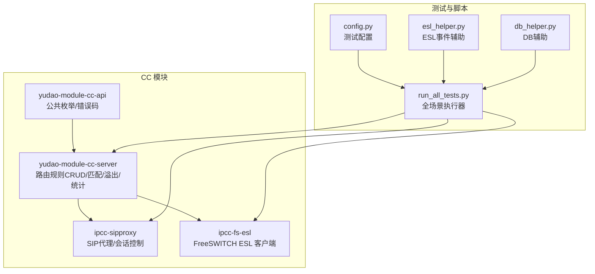
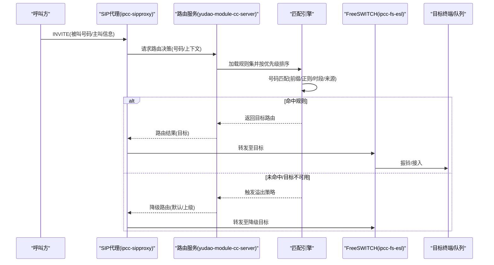
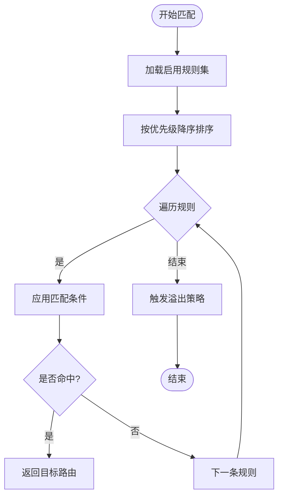
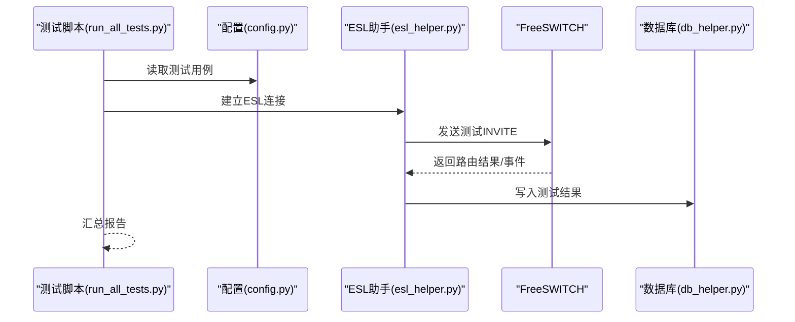
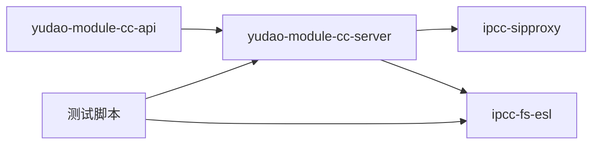

# 呼叫路由API

<cite>
**本文引用的文件**
- [yudao-module-cc-api/src/main/java/cn/iocoder/yudao/module/cc/enums/CallRouteStatusEnum.java](file://yudao-cloud/yudao-module-cc/yudao-module-cc-api/src/main/java/cn/iocoder/yudao/module/cc/enums/CallRouteStatusEnum.java)
- [yudao-module-cc-api/src/main/java/cn/iocoder/yudao/module/cc/enums/ErrorCodeConstants.java](file://yudao-cloud/yudao-module-cc/yudao-module-cc-api/src/main/java/cn/iocoder/yudao/module/cc/enums/ErrorCodeConstants.java)
- [yudao-module-cc-server/pom.xml](file://yudao-cloud/yudao-module-cc/yudao-module-cc-server/pom.xml)
- [yudao-module-cc-api/pom.xml](file://yudao-cloud/yudao-module-cc/yudao-module-cc-api/pom.xml)
- [yudao-module-cc/doc/sql/系统数据初始化.sql](file://yudao-cloud/yudao-module-cc/doc/sql/系统数据初始化.sql)
- [yudao-module-cc/doc/test-all/full-scenario-test/run_all_tests.py](file://yudao-cloud/yudao-module-cc/doc/test-all/full-scenario-test/run_all_tests.py)
- [yudao-module-cc/doc/test-all/full-scenario-test/config.py](file://yudao-cloud/yudao-module-cc/doc/test-all/full-scenario-test/config.py)
- [yudao-module-cc/doc/test-all/full-scenario-test/esl_helper.py](file://yudao-cloud/yudao-module-cc/doc/test-all/full-scenario-test/esl_helper.py)
- [yudao-module-cc/doc/test-all/full-scenario-test/db_helper.py](file://yudao-cloud/yudao-module-cc/doc/test-all/full-scenario-test/db_helper.py)
</cite>

## 目录
1. [简介](#简介)
2. [项目结构](#项目结构)
3. [核心组件](#核心组件)
4. [架构总览](#架构总览)
5. [详细组件分析](#详细组件分析)
6. [依赖关系分析](#依赖关系分析)
7. [性能考虑](#性能考虑)
8. [故障排查指南](#故障排查指南)
9. [结论](#结论)
10. [附录：接口与配置示例](#附录接口与配置示例)

## 简介
本文件为“呼叫路由API”的权威技术文档，覆盖呼叫路由规则的创建、修改、删除、查询等基础能力，以及优先级配置、溢出策略、号码匹配规则、路由测试与模拟、性能统计等高级能力。文档面向开发者与实施工程师，提供清晰的调用流程、数据结构说明、错误码约定与排错建议，帮助快速集成与稳定运行。

## 项目结构
呼叫路由相关能力集中在呼叫中心模块（CC）中，采用前后端分离与多模块工程组织：
- API 层：定义枚举常量、错误码等跨服务共享契约
- 服务端：实现路由规则管理、匹配引擎、溢出策略、测试与统计等
- 测试与脚本：提供端到端场景验证、ESL事件监控、数据库辅助工具

图表来源
- [yudao-module-cc-server/pom.xml](file://yudao-cloud/yudao-module-cc/yudao-module-cc-server/pom.xml)
- [yudao-module-cc-api/pom.xml](file://yudao-cloud/yudao-module-cc/yudao-module-cc-api/pom.xml)
- [yudao-module-cc/doc/test-all/full-scenario-test/run_all_tests.py](file://yudao-cloud/yudao-module-cc/doc/test-all/full-scenario-test/run_all_tests.py)
- [yudao-module-cc/doc/test-all/full-scenario-test/config.py](file://yudao-cloud/yudao-module-cc/doc/test-all/full-scenario-test/config.py)
- [yudao-module-cc/doc/test-all/full-scenario-test/esl_helper.py](file://yudao-cloud/yudao-module-cc/doc/test-all/full-scenario-test/esl_helper.py)
- [yudao-module-cc/doc/test-all/full-scenario-test/db_helper.py](file://yudao-cloud/yudao-module-cc/doc/test-all/full-scenario-test/db_helper.py)

章节来源
- [yudao-module-cc-server/pom.xml](file://yudao-cloud/yudao-module-cc/yudao-module-cc-server/pom.xml)
- [yudao-module-cc-api/pom.xml](file://yudao-cloud/yudao-module-cc/yudao-module-cc-api/pom.xml)

## 核心组件
- 路由规则模型：包含主键、租户/业务域、名称、描述、状态、优先级、号码匹配规则、溢出策略、目标路由（如分机、队列、IVR、外部号码）、生效时间窗口、审计字段等
- 路由匹配引擎：按优先级从高到低匹配号码，支持前缀、正则、时段、来源/去向条件；命中后返回目标路由或继续溢出
- 溢出策略：当无匹配或目标不可用时，按策略降级到默认路由或上级路由
- 路由测试与模拟：通过ESL向媒体服务器发起测试呼叫，回放匹配过程并输出命中规则与耗时
- 性能统计：记录匹配次数、命中率、平均耗时、溢出率、失败原因分布等指标

章节来源
- [yudao-module-cc-api/src/main/java/cn/iocoder/yudao/module/cc/enums/CallRouteStatusEnum.java](file://yudao-cloud/yudao-module-cc/yudao-module-cc-api/src/main/java/cn/iocoder/yudao/module/cc/enums/CallRouteStatusEnum.java)
- [yudao-module-cc-api/src/main/java/cn/iocoder/yudao/module/cc/enums/ErrorCodeConstants.java](file://yudao-cloud/yudao-module-cc/yudao-module-cc-api/src/main/java/cn/iocoder/yudao/module/cc/enums/ErrorCodeConstants.java)

## 架构总览
呼叫路由在SIP会话建立阶段介入，依据配置的规则进行决策，最终将呼叫导向目标终端或下一跳。

图表来源
- [yudao-module-cc-server/pom.xml](file://yudao-cloud/yudao-module-cc/yudao-module-cc-server/pom.xml)
- [yudao-module-cc/doc/test-all/full-scenario-test/esl_helper.py](file://yudao-cloud/yudao-module-cc/doc/test-all/full-scenario-test/esl_helper.py)

## 详细组件分析

### 路由规则管理（CRUD）
- 创建路由规则：提交规则定义（名称、优先级、匹配条件、目标、溢出策略、状态等），校验通过后持久化
- 修改路由规则：增量更新字段，重新计算优先级顺序，必要时触发规则热更新
- 删除路由规则：逻辑删除或物理删除，确保无活跃会话引用
- 查询路由规则：分页、过滤（状态、优先级区间、匹配模式等）、导出

关键要点
- 优先级：数值越小优先级越高；相同优先级需保证确定性（如按ID升序）
- 状态：启用/禁用，仅启用规则参与匹配
- 幂等性：重复创建同名同条件的规则应提示或合并
- 事务性：批量导入时保证一致性

章节来源
- [yudao-module-cc-api/src/main/java/cn/iocoder/yudao/module/cc/enums/CallRouteStatusEnum.java](file://yudao-cloud/yudao-module-cc/yudao-module-cc-api/src/main/java/cn/iocoder/yudao/module/cc/enums/CallRouteStatusEnum.java)
- [yudao-module-cc-api/src/main/java/cn/iocoder/yudao/module/cc/enums/ErrorCodeConstants.java](file://yudao-cloud/yudao-module-cc/yudao-module-cc-api/src/main/java/cn/iocoder/yudao/module/cc/enums/ErrorCodeConstants.java)

### 号码匹配规则
- 匹配类型：精确匹配、前缀匹配、正则表达式、时间段匹配、来源/去向条件组合
- 匹配算法：按优先级从高到低遍历，首个命中即返回；支持短路优化
- 性能优化：前缀索引、缓存热点规则、正则预编译、批量匹配

图表来源
- [yudao-module-cc-server/pom.xml](file://yudao-cloud/yudao-module-cc/yudao-module-cc-server/pom.xml)

### 溢出策略
- 策略类型：默认路由、上级路由、转语音提示、转人工、丢弃
- 触发条件：无匹配、目标不可达、超时、资源不足
- 可配置项：重试次数、退避间隔、告警阈值

章节来源
- [yudao-module-cc-api/src/main/java/cn/iocoder/yudao/module/cc/enums/ErrorCodeConstants.java](file://yudao-cloud/yudao-module-cc/yudao-module-cc-api/src/main/java/cn/iocoder/yudao/module/cc/enums/ErrorCodeConstants.java)

### 路由测试与模拟
- 测试入口：通过测试脚本或管理界面发起测试呼叫
- 执行方式：使用ESL连接FreeSWITCH，构造测试INVITE，观察路由命中与结果
- 结果输出：命中规则、匹配耗时、溢出路径、错误码

图表来源
- [yudao-module-cc/doc/test-all/full-scenario-test/run_all_tests.py](file://yudao-cloud/yudao-module-cc/doc/test-all/full-scenario-test/run_all_tests.py)
- [yudao-module-cc/doc/test-all/full-scenario-test/config.py](file://yudao-cloud/yudao-module-cc/doc/test-all/full-scenario-test/config.py)
- [yudao-module-cc/doc/test-all/full-scenario-test/esl_helper.py](file://yudao-cloud/yudao-module-cc/doc/test-all/full-scenario-test/esl_helper.py)
- [yudao-module-cc/doc/test-all/full-scenario-test/db_helper.py](file://yudao-cloud/yudao-module-cc/doc/test-all/full-scenario-test/db_helper.py)

### 性能统计
- 指标维度：匹配次数、命中率、平均/分位耗时、溢出率、失败原因分布、规则热度
- 采集点：规则加载、匹配循环、溢出处理、目标可达性检查
- 存储与展示：时序指标入库，前端可视化看板

章节来源
- [yudao-module-cc-server/pom.xml](file://yudao-cloud/yudao-module-cc/yudao-module-cc-server/pom.xml)

## 依赖关系分析
- 模块内依赖：API 层提供枚举与错误码，服务端消费这些契约
- 运行时依赖：SIP代理负责会话接入，FreeSWITCH作为媒体服务器承载实际通话
- 测试依赖：Python脚本通过ESL与FS交互，并通过DB辅助写入结果

图表来源
- [yudao-module-cc-api/pom.xml](file://yudao-cloud/yudao-module-cc/yudao-module-cc-api/pom.xml)
- [yudao-module-cc-server/pom.xml](file://yudao-cloud/yudao-module-cc/yudao-module-cc-server/pom.xml)

章节来源
- [yudao-module-cc-api/pom.xml](file://yudao-cloud/yudao-module-cc/yudao-module-cc-api/pom.xml)
- [yudao-module-cc-server/pom.xml](file://yudao-cloud/yudao-module-cc/yudao-module-cc-server/pom.xml)

## 性能考虑
- 规则集规模：建议单租户规则数控制在合理范围，避免全量扫描；对热点规则做缓存
- 匹配复杂度：优先使用前缀匹配，减少正则使用；正则需预编译并限制长度
- 溢出路径：设置合理的重试与退避，避免雪崩
- 并发与吞吐：匹配引擎无锁设计，结合异步IO提升吞吐；大流量下考虑水平扩展
- 观测性：完善埋点与日志，定位慢规则与异常路径

[本节为通用指导，不直接分析具体文件]

## 故障排查指南
- 常见错误码：参考错误码常量，定位参数校验失败、权限不足、规则不存在、目标不可达等
- 状态异常：检查路由规则状态是否为启用；确认优先级冲突与覆盖关系
- 匹配问题：核对号码格式、前缀/正则是否正确；检查时段与来源条件
- 溢出问题：查看溢出策略配置与目标可用性；关注重试与超时
- 测试定位：通过测试脚本复现问题，收集ESL事件与DB结果，对比预期路径

章节来源
- [yudao-module-cc-api/src/main/java/cn/iocoder/yudao/module/cc/enums/ErrorCodeConstants.java](file://yudao-cloud/yudao-module-cc/yudao-module-cc-api/src/main/java/cn/iocoder/yudao/module/cc/enums/ErrorCodeConstants.java)
- [yudao-module-cc/doc/test-all/full-scenario-test/esl_helper.py](file://yudao-cloud/yudao-module-cc/doc/test-all/full-scenario-test/esl_helper.py)
- [yudao-module-cc/doc/test-all/full-scenario-test/db_helper.py](file://yudao-cloud/yudao-module-cc/doc/test-all/full-scenario-test/db_helper.py)

## 结论
呼叫路由API围绕“规则驱动+优先级匹配+溢出兜底”的核心思想，提供完整的CRUD、匹配、测试与统计能力。通过合理的规则设计与性能优化，可在高并发场景下保持稳定与高效。建议在生产环境配合完善的监控与演练机制，持续优化规则质量与系统韧性。

[本节为总结性内容，不直接分析具体文件]

## 附录：接口与配置示例

### 路由规则字段说明（建议）
- 基本信息：名称、描述、状态（启用/禁用）
- 优先级：整数，越小优先级越高
- 匹配条件：被叫号码（前缀/正则）、主叫号码、时间段、来源/去向
- 目标路由：分机号、队列、IVR节点、外部号码、网关
- 溢出策略：默认路由、上级路由、语音提示、丢弃
- 审计字段：创建人、创建时间、修改人、修改时间

章节来源
- [yudao-module-cc-api/src/main/java/cn/iocoder/yudao/module/cc/enums/CallRouteStatusEnum.java](file://yudao-cloud/yudao-module-cc/yudao-module-cc-api/src/main/java/cn/iocoder/yudao/module/cc/enums/CallRouteStatusEnum.java)

### 典型调用流程（示例）
- 创建路由规则：POST /api/cc/route-rule/create
  - 请求体：名称、优先级、匹配条件、目标、溢出策略、状态
  - 响应：规则ID、状态码
- 修改路由规则：PUT /api/cc/route-rule/update/{id}
  - 请求体：待更新字段
  - 响应：成功标志
- 删除路由规则：DELETE /api/cc/route-rule/delete/{id}
  - 响应：成功标志
- 查询路由规则：GET /api/cc/route-rule/list?page=1&size=20&status=enabled
  - 响应：分页列表

章节来源
- [yudao-module-cc-api/src/main/java/cn/iocoder/yudao/module/cc/enums/ErrorCodeConstants.java](file://yudao-cloud/yudao-module-cc/yudao-module-cc-api/src/main/java/cn/iocoder/yudao/module/cc/enums/ErrorCodeConstants.java)

### 路由测试与模拟（示例）
- 执行全场景测试：python run_all_tests.py
  - 读取配置：config.py
  - 通过ESL发起测试：esl_helper.py
  - 写入结果：db_helper.py
- 结果解读：命中规则、耗时、溢出路径、错误码

章节来源
- [yudao-module-cc/doc/test-all/full-scenario-test/run_all_tests.py](file://yudao-cloud/yudao-module-cc/doc/test-all/full-scenario-test/run_all_tests.py)
- [yudao-module-cc/doc/test-all/full-scenario-test/config.py](file://yudao-cloud/yudao-module-cc/doc/test-all/full-scenario-test/config.py)
- [yudao-module-cc/doc/test-all/full-scenario-test/esl_helper.py](file://yudao-cloud/yudao-module-cc/doc/test-all/full-scenario-test/esl_helper.py)
- [yudao-module-cc/doc/test-all/full-scenario-test/db_helper.py](file://yudao-cloud/yudao-module-cc/doc/test-all/full-scenario-test/db_helper.py)

### 数据库与初始化
- 系统数据初始化：包含字典、默认路由、初始租户等基础数据
- 建议：在部署后执行初始化脚本，确保系统可用

章节来源
- [yudao-module-cc/doc/sql/系统数据初始化.sql](file://yudao-cloud/yudao-module-cc/doc/sql/系统数据初始化.sql)