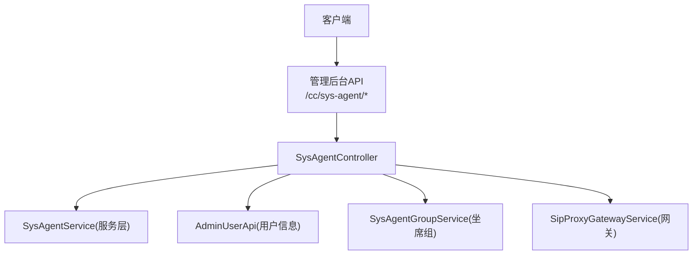
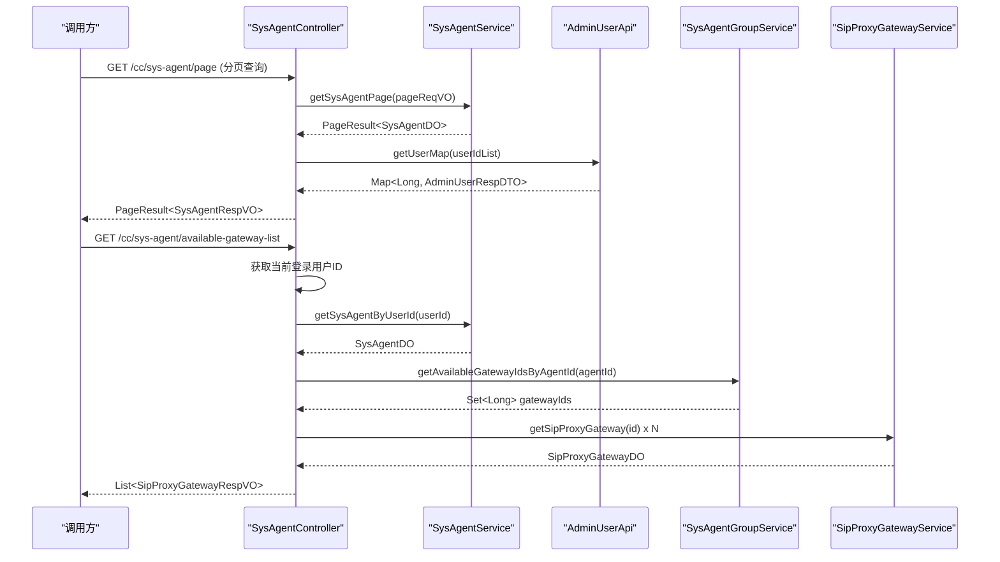
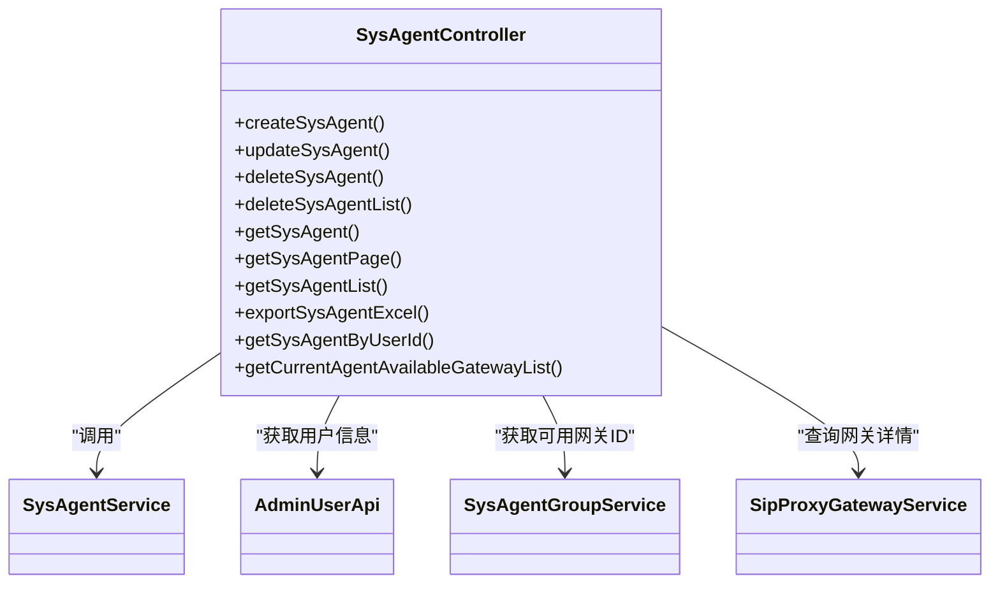

# 坐席管理API

<cite>
**本文引用的文件**
- [SysAgentController.java](file://yudao-cloud/yudao-module-cc/yudao-module-cc-server/src/main/java/cn/iocoder/yudao/module/cc/controller/admin/sys/SysAgentController.java)
- [SysAgentPageReqVO.java](file://yudao-cloud/yudao-module-cc/yudao-module-cc-server/src/main/java/cn/iocoder/yudao/module/cc/controller/admin/sys/vo/SysAgentPageReqVO.java)
- [SysAgentRespVO.java](file://yudao-cloud/yudao-module-cc/yudao-module-cc-server/src/main/java/cn/iocoder/yudao/module/cc/controller/admin/sys/vo/SysAgentRespVO.java)
- [SysAgentSaveReqVO.java](file://yudao-cloud/yudao-module-cc/yudao-module-cc-server/src/main/java/cn/iocoder/yudao/module/cc/controller/admin/sys/vo/SysAgentSaveReqVO.java)
</cite>

## 目录
1. [简介](#简介)
2. [项目结构](#项目结构)
3. [核心组件](#核心组件)
4. [架构总览](#架构总览)
5. [详细接口说明](#详细接口说明)
6. [依赖关系分析](#依赖关系分析)
7. [性能考虑](#性能考虑)
8. [故障排查指南](#故障排查指南)
9. [结论](#结论)
10. [附录](#附录)

## 简介
本文件为“坐席管理”模块的对外API文档，覆盖坐席的增删改查、分页查询、批量删除、导出Excel、按当前登录用户获取坐席信息、以及基于坐席组关联的可用网关列表等能力。所有接口均位于管理后台路径下，并通过权限注解进行访问控制。

## 项目结构
- 控制器：位于 cc 模块的管理后台控制器中，统一以 /cc/sys-agent 为前缀暴露REST接口。
- 请求/响应对象：通过 VO 定义分页查询参数、保存参数与响应字段。
- 权限控制：使用 @PreAuthorize 注解对每个接口进行细粒度权限校验。
- 数据源：分页与列表查询由服务层实现（不在本文件中），控制器负责组装与转换。

图表来源
- [SysAgentController.java:47-193](file://yudao-cloud/yudao-module-cc/yudao-module-cc-server/src/main/java/cn/iocoder/yudao/module/cc/controller/admin/sys/SysAgentController.java#L47-L193)

章节来源
- [SysAgentController.java:47-193](file://yudao-cloud/yudao-module-cc/yudao-module-cc-server/src/main/java/cn/iocoder/yudao/module/cc/controller/admin/sys/SysAgentController.java#L47-L193)

## 核心组件
- 控制器：提供坐席CRUD、分页、批量删除、导出、按用户查询、可用网关列表等能力。
- 请求VO：
  - SysAgentSaveReqVO：新增/修改入参，包含名称、用户ID、密码、开通状态等必填校验。
  - SysAgentPageReqVO：分页查询条件，支持创建时间范围、名称、用户ID、域名、开通状态、在线状态过滤。
- 响应VO：
  - SysAgentRespVO：返回坐席主键、创建时间、名称、用户ID、用户名、域名、开通状态、在线状态等。

章节来源
- [SysAgentSaveReqVO.java:1-32](file://yudao-cloud/yudao-module-cc/yudao-module-cc-server/src/main/java/cn/iocoder/yudao/module/cc/controller/admin/sys/vo/SysAgentSaveReqVO.java#L1-L32)
- [SysAgentPageReqVO.java:1-36](file://yudao-cloud/yudao-module-cc/yudao-module-cc-server/src/main/java/cn/iocoder/yudao/module/cc/controller/admin/sys/vo/SysAgentPageReqVO.java#L1-L36)
- [SysAgentRespVO.java:1-47](file://yudao-cloud/yudao-module-cc/yudao-module-cc-server/src/main/java/cn/iocoder/yudao/module/cc/controller/admin/sys/vo/SysAgentRespVO.java#L1-L47)

## 架构总览
- 入口：/cc/sys-agent/* 下的REST端点。
- 权限：每个接口通过 @PreAuthorize 指定资源权限码，如 create/update/delete/query/export。
- 数据流：
  - 查询类接口：控制器接收参数 -> 调用服务层分页/列表 -> 合并用户信息 -> 转换为VO返回。
  - 写操作：控制器接收保存VO -> 调用服务层持久化 -> 返回结果。
  - 业务扩展：根据当前登录用户获取其坐席，并进一步查询该坐席所属组的可用网关集合。

图表来源
- [SysAgentController.java:115-125](file://yudao-cloud/yudao-module-cc/yudao-module-cc-server/src/main/java/cn/iocoder/yudao/module/cc/controller/admin/sys/SysAgentController.java#L115-L125)
- [SysAgentController.java:166-190](file://yudao-cloud/yudao-module-cc/yudao-module-cc-server/src/main/java/cn/iocoder/yudao/module/cc/controller/admin/sys/SysAgentController.java#L166-L190)

## 详细接口说明

### 通用约定
- 基础路径：/cc/sys-agent
- 认证与权限：各接口通过 @PreAuthorize 控制，未授权将返回鉴权失败。
- 统一响应体：CommonResult<T>，成功时 data 为 T，错误时包含错误码与消息。
- 分页参数：继承自 PageParam，通常包含 pageNo、pageSize。

#### 1) 创建坐席
- 方法：POST
- 路径：/cc/sys-agent/create
- 权限：cc:sys-agent:create
- 请求体：SysAgentSaveReqVO
  - 必填字段：name、userId、password、status
  - 校验规则：名称、密码非空；用户ID、状态非空
- 响应：Long（新创建的主键ID）
- 示例
  - 请求体示例：{"name":"李四","userId":10025,"password":"sipPass","status":0}
  - 响应示例：{"code":0,"data":12345,"msg":"操作成功"}

章节来源
- [SysAgentController.java:65-70](file://yudao-cloud/yudao-module-cc/yudao-module-cc-server/src/main/java/cn/iocoder/yudao/module/cc/controller/admin/sys/SysAgentController.java#L65-L70)
- [SysAgentSaveReqVO.java:1-32](file://yudao-cloud/yudao-module-cc/yudao-module-cc-server/src/main/java/cn/iocoder/yudao/module/cc/controller/admin/sys/vo/SysAgentSaveReqVO.java#L1-L32)

#### 2) 更新坐席
- 方法：PUT
- 路径：/cc/sys-agent/update
- 权限：cc:sys-agent:update
- 请求体：SysAgentSaveReqVO（需携带id）
- 响应：Boolean（true表示成功）
- 示例
  - 请求体示例：{"id":12345,"name":"张三","userId":10025,"password":"newPass","status":0}
  - 响应示例：{"code":0,"data":true,"msg":"操作成功"}

章节来源
- [SysAgentController.java:72-78](file://yudao-cloud/yudao-module-cc/yudao-module-cc-server/src/main/java/cn/iocoder/yudao/module/cc/controller/admin/sys/SysAgentController.java#L72-L78)
- [SysAgentSaveReqVO.java:1-32](file://yudao-cloud/yudao-module-cc/yudao-module-cc-server/src/main/java/cn/iocoder/yudao/module/cc/controller/admin/sys/vo/SysAgentSaveReqVO.java#L1-L32)

#### 3) 删除坐席
- 方法：DELETE
- 路径：/cc/sys-agent/delete
- 权限：cc:sys-agent:delete
- 查询参数：id（必填）
- 响应：Boolean（true表示成功）
- 示例
  - 请求示例：DELETE /cc/sys-agent/delete?id=12345
  - 响应示例：{"code":0,"data":true,"msg":"操作成功"}

章节来源
- [SysAgentController.java:80-87](file://yudao-cloud/yudao-module-cc/yudao-module-cc-server/src/main/java/cn/iocoder/yudao/module/cc/controller/admin/sys/SysAgentController.java#L80-L87)

#### 4) 批量删除坐席
- 方法：DELETE
- 路径：/cc/sys-agent/delete-list
- 权限：cc:sys-agent:delete
- 查询参数：ids（数组，必填）
- 响应：Boolean（true表示成功）
- 示例
  - 请求示例：DELETE /cc/sys-agent/delete-list?ids=1,2,3
  - 响应示例：{"code":0,"data":true,"msg":"操作成功"}

章节来源
- [SysAgentController.java:89-96](file://yudao-cloud/yudao-module-cc/yudao-module-cc-server/src/main/java/cn/iocoder/yudao/module/cc/controller/admin/sys/SysAgentController.java#L89-L96)

#### 5) 获取单个坐席
- 方法：GET
- 路径：/cc/sys-agent/get
- 权限：cc:sys-agent:query
- 查询参数：id（必填）
- 响应：SysAgentRespVO 或 null
- 示例
  - 请求示例：GET /cc/sys-agent/get?id=12345
  - 响应示例：{"code":0,"data":{"id":12345,"name":"李四","userName":"lisi","domain":"sip.example.com","status":0,"onlineStatus":2},"msg":"操作成功"}

章节来源
- [SysAgentController.java:98-113](file://yudao-cloud/yudao-module-cc/yudao-module-cc-server/src/main/java/cn/iocoder/yudao/module/cc/controller/admin/sys/SysAgentController.java#L98-L113)
- [SysAgentRespVO.java:1-47](file://yudao-cloud/yudao-module-cc/yudao-module-cc-server/src/main/java/cn/iocoder/yudao/module/cc/controller/admin/sys/vo/SysAgentRespVO.java#L1-L47)

#### 6) 分页查询坐席
- 方法：GET
- 路径：/cc/sys-agent/page
- 权限：cc:sys-agent:query
- 查询参数：SysAgentPageReqVO
  - createTime：时间范围（可选）
  - name：名称模糊匹配（可选）
  - userId：用户ID（可选）
  - domain：SIP域名（可选）
  - status：开通状态（可选，0-开通，1-未开通）
  - onlineStatus：在线状态（可选）
- 响应：PageResult<SysAgentRespVO>
- 示例
  - 请求示例：GET /cc/sys-agent/page?pageNo=1&pageSize=10&name=李&status=0
  - 响应示例：{"code":0,"data":{"list":[...],"total":1},"msg":"操作成功"}

章节来源
- [SysAgentController.java:115-125](file://yudao-cloud/yudao-module-cc/yudao-module-cc-server/src/main/java/cn/iocoder/yudao/module/cc/controller/admin/sys/SysAgentController.java#L115-L125)
- [SysAgentPageReqVO.java:1-36](file://yudao-cloud/yudao-module-cc/yudao-module-cc-server/src/main/java/cn/iocoder/yudao/module/cc/controller/admin/sys/vo/SysAgentPageReqVO.java#L1-L36)
- [SysAgentRespVO.java:1-47](file://yudao-cloud/yudao-module-cc/yudao-module-cc-server/src/main/java/cn/iocoder/yudao/module/cc/controller/admin/sys/vo/SysAgentRespVO.java#L1-L47)

#### 7) 获取全部坐席列表
- 方法：GET
- 路径：/cc/sys-agent/list
- 权限：无（公开可访问）
- 响应：List<SysAgentRespVO>
- 示例
  - 请求示例：GET /cc/sys-agent/list
  - 响应示例：{"code":0,"data":[...],"msg":"操作成功"}

章节来源
- [SysAgentController.java:127-137](file://yudao-cloud/yudao-module-cc/yudao-module-cc-server/src/main/java/cn/iocoder/yudao/module/cc/controller/admin/sys/SysAgentController.java#L127-L137)

#### 8) 导出坐席Excel
- 方法：GET
- 路径：/cc/sys-agent/export-excel
- 权限：cc:sys-agent:export
- 查询参数：同分页查询参数（SysAgentPageReqVO）
- 响应：Excel文件流（文件名：cc坐席管理.xls）
- 示例
  - 请求示例：GET /cc/sys-agent/export-excel?name=李&status=0
  - 响应：二进制Excel文件下载

章节来源
- [SysAgentController.java:139-149](file://yudao-cloud/yudao-module-cc/yudao-module-cc-server/src/main/java/cn/iocoder/yudao/module/cc/controller/admin/sys/SysAgentController.java#L139-L149)

#### 9) 按当前登录用户获取坐席
- 方法：GET
- 路径：/cc/sys-agent/get-by-user-id
- 权限：无（公开可访问）
- 响应：SysAgentByUserIdRespVO 或 null
- 示例
  - 请求示例：GET /cc/sys-agent/get-by-user-id
  - 响应示例：{"code":0,"data":{"name":"李四","domain":"sip.example.com","password":"sipPass"},"msg":"操作成功"}

章节来源
- [SysAgentController.java:151-164](file://yudao-cloud/yudao-module-cc/yudao-module-cc-server/src/main/java/cn/iocoder/yudao/module/cc/controller/admin/sys/SysAgentController.java#L151-L164)

#### 10) 获取当前登录坐席的可用网关列表
- 方法：GET
- 路径：/cc/sys-agent/available-gateway-list
- 权限：无（公开可访问）
- 功能说明：
  - 根据当前登录用户查找其坐席
  - 查询该坐席所属组的 availableGatewayIds
  - 过滤出状态为可用的网关并返回列表
- 响应：List<SipProxyGatewayRespVO>
- 示例
  - 请求示例：GET /cc/sys-agent/available-gateway-list
  - 响应示例：{"code":0,"data":[{"id":1,"name":"网关A",...},...],"msg":"操作成功"}

章节来源
- [SysAgentController.java:166-190](file://yudao-cloud/yudao-module-cc/yudao-module-cc-server/src/main/java/cn/iocoder/yudao/module/cc/controller/admin/sys/SysAgentController.java#L166-L190)

## 依赖关系分析
- 控制器依赖：
  - SysAgentService：负责坐席数据的持久化与查询
  - AdminUserApi：用于填充用户名等用户维度信息
  - SysAgentGroupService：根据坐席ID查询其组的可用网关ID集合
  - SipProxyGatewayService：根据ID查询网关详情并过滤状态
- 权限模型：
  - 通过 @PreAuthorize 绑定资源级权限码，确保只有具备相应权限的用户才能执行对应操作

图表来源
- [SysAgentController.java:47-193](file://yudao-cloud/yudao-module-cc/yudao-module-cc-server/src/main/java/cn/iocoder/yudao/module/cc/controller/admin/sys/SysAgentController.java#L47-L193)

章节来源
- [SysAgentController.java:47-193](file://yudao-cloud/yudao-module-cc/yudao-module-cc-server/src/main/java/cn/iocoder/yudao/module/cc/controller/admin/sys/SysAgentController.java#L47-L193)

## 性能考虑
- 分页查询：建议合理设置 pageSize，避免一次性拉取过多数据。
- 列表导出：导出接口会加载全量数据进行转换，建议在大数据量场景下增加限流或异步导出机制。
- 用户信息合并：分页查询时会批量获取用户信息映射，减少多次远程调用开销。
- 网关列表：仅返回状态为可用的网关，降低前端处理成本。

[本节为通用指导，不直接分析具体文件]

## 故障排查指南
- 权限不足：检查当前用户是否具备对应权限码（如 cc:sys-agent:create/update/delete/query/export）。
- 参数校验失败：确认必填字段是否完整且格式正确（如名称、密码、状态等）。
- 数据为空：分页或单条查询可能返回空，需检查是否存在对应记录或筛选条件是否过严。
- 网关列表为空：若当前用户未绑定坐席或坐席组未配置可用网关，将返回空列表，属正常情况。

章节来源
- [SysAgentController.java:65-190](file://yudao-cloud/yudao-module-cc/yudao-module-cc-server/src/main/java/cn/iocoder/yudao/module/cc/controller/admin/sys/SysAgentController.java#L65-L190)

## 结论
本API提供了完整的坐席管理能力，涵盖基础的CRUD、分页与批量操作、导出、按用户查询以及基于坐席组的可用网关查询。通过统一的权限控制与标准化的请求/响应结构，便于前后端协作与后续扩展。

[本节为总结性内容，不直接分析具体文件]

## 附录

### 数据模型概览
- SysAgentSaveReqVO：新增/修改入参，包含名称、用户ID、密码、开通状态等必填项。
- SysAgentPageReqVO：分页查询条件，支持创建时间范围、名称、用户ID、域名、开通状态、在线状态。
- SysAgentRespVO：响应字段包括主键、创建时间、名称、用户ID、用户名、域名、开通状态、在线状态。

章节来源
- [SysAgentSaveReqVO.java:1-32](file://yudao-cloud/yudao-module-cc/yudao-module-cc-server/src/main/java/cn/iocoder/yudao/module/cc/controller/admin/sys/vo/SysAgentSaveReqVO.java#L1-L32)
- [SysAgentPageReqVO.java:1-36](file://yudao-cloud/yudao-module-cc/yudao-module-cc-server/src/main/java/cn/iocoder/yudao/module/cc/controller/admin/sys/vo/SysAgentPageReqVO.java#L1-L36)
- [SysAgentRespVO.java:1-47](file://yudao-cloud/yudao-module-cc/yudao-module-cc-server/src/main/java/cn/iocoder/yudao/module/cc/controller/admin/sys/vo/SysAgentRespVO.java#L1-L47)