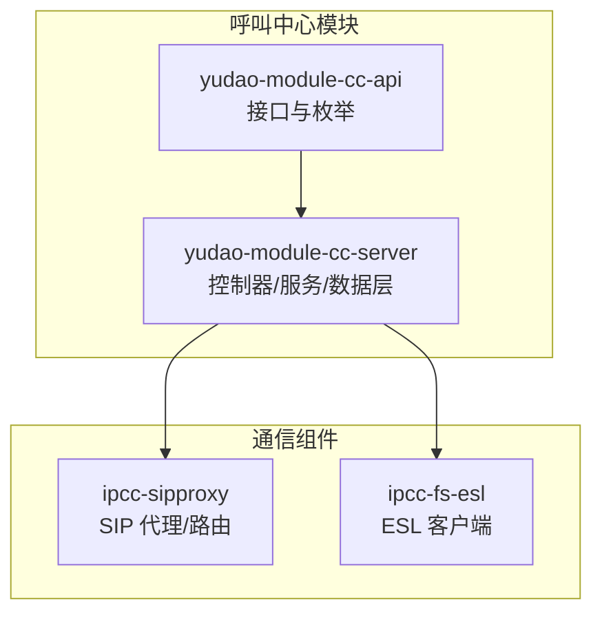
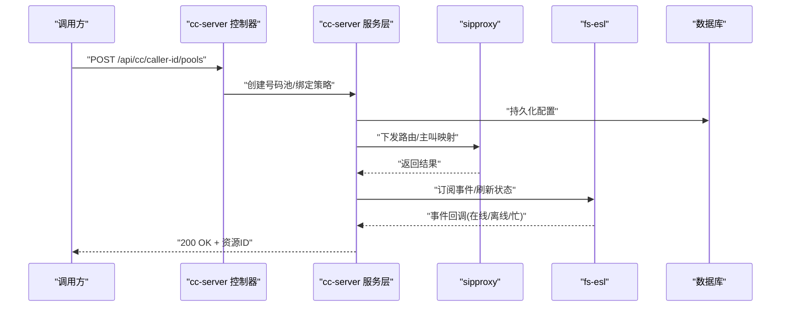
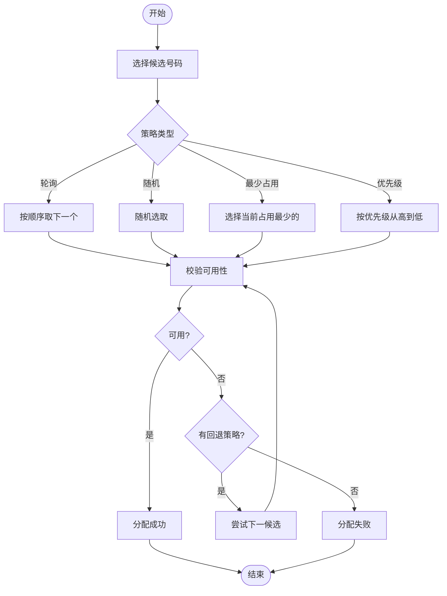
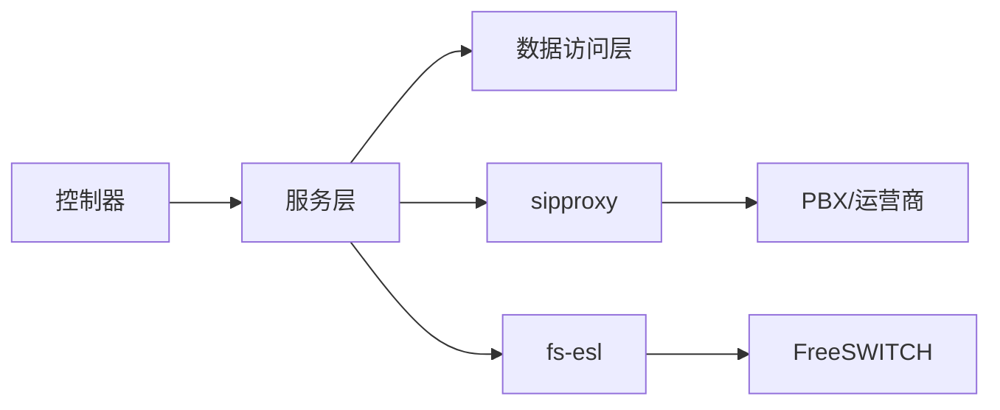

# 来电显示API

<cite>
**本文引用的文件**
- [CallDisplaySaveReqVO.java](file://yudao-cloud/yudao-module-cc/yudao-module-cc-server/src/main/java/cn/iocoder/yudao/module/cc/controller/admin/call/vo/CallDisplaySaveReqVO.java)
- [CallDisplayController.java](file://yudao-cloud/yudao-module-cc/yudao-module-cc-server/src/main/java/cn/iocoder/yudao/module/cc/controller/admin/call/CallDisplayController.java)
- [CallDisplayRespVO.java](file://yudao-cloud/yudao-module-cc/yudao-module-cc-server/src/main/java/cn/iocoder/yudao/module/cc/controller/admin/call/vo/CallDisplayRespVO.java)
- [CallDisplayPageReqVO.java](file://yudao-cloud/yudao-module-cc/yudao-module-cc-server/src/main/java/cn/iocoder/yudao/module/cc/controller/admin/call/vo/CallDisplayPageReqVO.java)
- [SysAgentGroupController.java](file://yudao-cloud/yudao-module-cc/yudao-module-cc-server/src/main/java/cn/iocoder/yudao/module/cc/controller/admin/call/SysAgentGroupController.java)
- [SysAgentGroupSaveReqVO.java](file://yudao-cloud/yudao-module-cc/yudao-module-cc-server/src/main/java/cn/iocoder/yudao/module/cc/controller/admin/call/vo/SysAgentGroupSaveReqVO.java)
- [CallRouteController.java](file://yudao-cloud/yudao-module-cc/yudao-module-cc-server/src/main/java/cn/iocoder/yudao/module/cc/controller/admin/call/CallRouteController.java)
- [CallDisplayForm.vue](file://yudao-ui-admin-vue3/src/views/cc/calldisplay/CallDisplayForm.vue)
</cite>

## 更新摘要
**变更内容**

- 更新了号码管理功能，取消位数限制并支持特殊字符（#、-、 (、)）
- 增强了前后端输入验证和过滤机制
- 完善了分组管理和路由规则配置说明
- 补充了完整的API接口文档和使用示例

## 目录
1. [简介](#简介)
2. [项目结构](#项目结构)
3. [核心组件](#核心组件)
4. [架构总览](#架构总览)
5. [详细组件分析](#详细组件分析)
6. [依赖关系分析](#依赖关系分析)
7. [性能考量](#性能考量)
8. [故障排查指南](#故障排查指南)
9. [结论](#结论)
10. [附录](#附录)

## 简介

本文件面向呼叫中心系统的"来电显示管理"能力，提供统一的 API
文档与实现指引。覆盖来电显示号码的增删改查、分组管理、绑定坐席组、号码池管理、分配策略、状态监控以及与路由规则的关联配置等。文档同时给出典型使用场景与配置示例，帮助快速落地生产环境。

**更新** 号码管理功能已升级，现在支持更灵活的电话号码格式，包括数字组合和特殊字符。

## 项目结构
本项目采用多模块微服务架构，来电显示相关能力主要位于呼叫中心模块：
- yudao-module-cc-api：对外暴露的常量、枚举、接口定义
- yudao-module-cc-server：业务实现（控制器、服务、数据访问、实体、配置）
- ipcc-sipproxy：SIP 代理与路由能力（与 PBX/运营商对接）
- ipcc-fs-esl：FreeSWITCH ESL 客户端，用于事件订阅与控制

**图表来源**
- [CallDisplayController.java:30-34](file://yudao-cloud/yudao-module-cc/yudao-module-cc-server/src/main/java/cn/iocoder/yudao/module/cc/controller/admin/call/CallDisplayController.java#L30-L34)
- [SysAgentGroupController.java:38-42](file://yudao-cloud/yudao-module-cc/yudao-module-cc-server/src/main/java/cn/iocoder/yudao/module/cc/controller/admin/call/SysAgentGroupController.java#L38-L42)
- [CallRouteController.java:30-34](file://yudao-cloud/yudao-module-cc/yudao-module-cc-server/src/main/java/cn/iocoder/yudao/module/cc/controller/admin/call/CallRouteController.java#L30-L34)

## 核心组件
- 来电显示号码管理：提供号码的添加、删除、查询、分页、批量导入导出等能力
- 分组管理：支持按业务线/区域/渠道对号码进行分组，便于策略化分配
- 坐席组绑定：将号码或号码组绑定到指定坐席组，控制呼出主叫显示
- 号码池管理：维护可用号码集合、容量、健康度与配额
- 分配策略：支持轮询、随机、最少占用、优先级等策略
- 状态监控：实时查看号码可用性、占用情况、错误率、呼叫成功率等指标
- 路由规则关联：将号码/号码组与路由规则（IVR、技能组、时间段、时段策略）绑定

**更新** 号码格式支持现已扩展，可接受包含数字、#、-、 (、)的组合，如 `9#`、`400-123-4567`、`(010)12345678`。

## 架构总览
来电显示管理的请求从前端或调用方进入 cc-server 控制器，经服务层编排后，通过 sipproxy 与 PBX/运营商交互，并通过 fs-esl 订阅 FreeSWITCH 事件以更新号码状态与统计。

**图表来源**
- [CallDisplayController.java:39-44](file://yudao-cloud/yudao-module-cc/yudao-module-cc-server/src/main/java/cn/iocoder/yudao/module/cc/controller/admin/call/CallDisplayController.java#L39-L44)
- [SysAgentGroupController.java:49-54](file://yudao-cloud/yudao-module-cc/yudao-module-cc-server/src/main/java/cn/iocoder/yudao/module/cc/controller/admin/call/SysAgentGroupController.java#L49-L54)
- [CallRouteController.java:39-44](file://yudao-cloud/yudao-module-cc/yudao-module-cc-server/src/main/java/cn/iocoder/yudao/module/cc/controller/admin/call/CallRouteController.java#L39-L44)

## 详细组件分析

### 来电显示号码管理 API
- 功能范围
  - 新增/编辑/删除/查询号码
  - 批量导入/导出
  - 设置默认主叫号码
  - 校验号码格式与归属地
- 关键参数
    - 号码（支持数字、#、-、 (、)字符）、国家码、是否默认、备注、标签
- 响应字段
  - 编号、号码、状态、是否默认、创建时间、更新时间
- 错误码
  - 参考统一错误码常量

**更新** 电话号码验证规则已更新，现在支持更灵活的格式：
- 后端验证：使用正则表达式 `^[0-9#\-()]+$` 进行格式校验
- 前端验证：实时过滤非法字符，仅允许数字、#、-、 (、)
- 支持的号码格式示例：`9#`、`400-123-4567`、`(010)12345678`

**章节来源**
- [CallDisplaySaveReqVO.java:15-18](file://yudao-cloud/yudao-module-cc/yudao-module-cc-server/src/main/java/cn/iocoder/yudao/module/cc/controller/admin/call/vo/CallDisplaySaveReqVO.java#L15-L18)
- [CallDisplayForm.vue:54-67](file://yudao-ui-admin-vue3/src/views/cc/calldisplay/CallDisplayForm.vue#L54-L67)
- [CallDisplayForm.vue:117-123](file://yudao-ui-admin-vue3/src/views/cc/calldisplay/CallDisplayForm.vue#L117-L123)

### 分组管理 API
- 功能范围
  - 创建/编辑/删除分组
  - 向分组添加/移除号码
  - 查询分组下的号码列表
- 关键参数
  - 分组名称、编码、描述、成员号码集合
- 使用场景
  - 按区域/渠道/产品线划分号码池，配合路由策略定向呼出

**章节来源**
- [SysAgentGroupController.java:49-80](file://yudao-cloud/yudao-module-cc/yudao-module-cc-server/src/main/java/cn/iocoder/yudao/module/cc/controller/admin/call/SysAgentGroupController.java#L49-L80)
- [SysAgentGroupSaveReqVO.java:13-50](file://yudao-cloud/yudao-module-cc/yudao-module-cc-server/src/main/java/cn/iocoder/yudao/module/cc/controller/admin/call/vo/SysAgentGroupSaveReqVO.java#L13-L50)

### 坐席组绑定 API
- 功能范围
  - 将号码或号码组绑定到坐席组
  - 设置绑定优先级与权重
  - 解绑与变更生效
- 关键参数
  - 坐席组ID、号码/分组ID、优先级、生效时间
- 使用场景
  - 不同团队使用不同的主叫号码，确保合规与品牌一致性

**章节来源**
- [SysAgentGroupController.java:82-105](file://yudao-cloud/yudao-module-cc/yudao-module-cc-server/src/main/java/cn/iocoder/yudao/module/cc/controller/admin/call/SysAgentGroupController.java#L82-L105)
- [SysAgentGroupSaveReqVO.java:45-50](file://yudao-cloud/yudao-module-cc/yudao-module-cc-server/src/main/java/cn/iocoder/yudao/module/cc/controller/admin/call/vo/SysAgentGroupSaveReqVO.java#L45-L50)

### 号码池管理 API
- 功能范围
  - 创建/编辑/删除号码池
  - 设置池容量、配额、健康阈值
  - 池内号码的上下架与回收
- 关键参数
  - 池名称、编码、容量、配额策略、健康阈值
- 使用场景
  - 为不同渠道或地区建立独立号码池，隔离风险与容量

**章节来源**
- [CallDisplayController.java:39-108](file://yudao-cloud/yudao-module-cc/yudao-module-cc-server/src/main/java/cn/iocoder/yudao/module/cc/controller/admin/call/CallDisplayController.java#L39-L108)
- [CallDisplayRespVO.java:15-34](file://yudao-cloud/yudao-module-cc/yudao-module-cc-server/src/main/java/cn/iocoder/yudao/module/cc/controller/admin/call/vo/CallDisplayRespVO.java#L15-L34)

### 分配策略 API
- 功能范围
  - 选择并配置分配策略：轮询、随机、最少占用、优先级
  - 设置策略权重、回退策略、超时重试
- 关键参数
  - 策略类型、权重、回退策略、重试次数、超时
- 使用场景
  - 高并发呼出时均衡负载，避免单点过载

**图表来源**
- [SysAgentGroupSaveReqVO.java:26-43](file://yudao-cloud/yudao-module-cc/yudao-module-cc-server/src/main/java/cn/iocoder/yudao/module/cc/controller/admin/call/vo/SysAgentGroupSaveReqVO.java#L26-L43)

**章节来源**
- [SysAgentGroupSaveReqVO.java:26-43](file://yudao-cloud/yudao-module-cc/yudao-module-cc-server/src/main/java/cn/iocoder/yudao/module/cc/controller/admin/call/vo/SysAgentGroupSaveReqVO.java#L26-L43)

### 状态监控 API
- 功能范围
  - 查询号码在线/离线/忙闲状态
  - 获取号码的健康度、错误率、呼叫成功率
  - 订阅事件流（WebSocket/SSE）
- 关键参数
  - 号码/分组/池ID、时间范围、指标维度
- 使用场景
  - 实时监控号码质量，及时切换或告警

**章节来源**
- [CallDisplayPageReqVO.java:16-28](file://yudao-cloud/yudao-module-cc/yudao-module-cc-server/src/main/java/cn/iocoder/yudao/module/cc/controller/admin/call/vo/CallDisplayPageReqVO.java#L16-L28)

### 与路由规则的关联配置
- 功能范围
  - 将号码/号码组与路由规则（IVR、技能组、时间段、节假日）绑定
  - 支持多规则优先级与条件匹配
- 关键参数
  - 规则ID、匹配条件、动作（转接、播放、挂断）、优先级
- 使用场景
  - 根据来电时间/号码段/渠道选择不同路由路径

**章节来源**
- [CallRouteController.java:39-110](file://yudao-cloud/yudao-module-cc/yudao-module-cc-server/src/main/java/cn/iocoder/yudao/module/cc/controller/admin/call/CallRouteController.java#L39-L110)

## 依赖关系分析
- 控制器依赖服务层，服务层依赖数据访问层与外部通信组件
- 通过 sipproxy 与 PBX/运营商交互，完成主叫映射与路由
- 通过 fs-esl 订阅 FreeSWITCH 事件，实时更新号码状态与统计

**图表来源**
- [CallDisplayController.java:30-34](file://yudao-cloud/yudao-module-cc/yudao-module-cc-server/src/main/java/cn/iocoder/yudao/module/cc/controller/admin/call/CallDisplayController.java#L30-L34)
- [SysAgentGroupController.java:38-42](file://yudao-cloud/yudao-module-cc/yudao-module-cc-server/src/main/java/cn/iocoder/yudao/module/cc/controller/admin/call/SysAgentGroupController.java#L38-L42)
- [CallRouteController.java:30-34](file://yudao-cloud/yudao-module-cc/yudao-module-cc-server/src/main/java/cn/iocoder/yudao/module/cc/controller/admin/call/CallRouteController.java#L30-L34)

## 性能考量
- 分配策略在高并发下应优先选择无锁或轻量级算法（如分段轮询、原子计数）
- 状态监控建议采用事件驱动与增量更新，减少全量轮询
- 数据库层面为常用查询字段建立索引（号码、分组ID、状态）
- 缓存热点数据（如策略、路由规则），降低延迟
- 对 PBX/运营商侧做限流与熔断，避免雪崩

## 故障排查指南
- 常见问题
  - 号码不可用：检查号码状态、健康阈值、配额耗尽
  - 路由不生效：核对规则优先级、匹配条件、生效时间
  - 状态不同步：确认 fs-esl 连接与事件订阅是否正常
- 排查步骤
  - 查看号码池健康度与错误率
  - 检查 sipproxy 下发的路由与主叫映射
  - 抓取 FreeSWITCH 事件日志，定位异常节点
- 恢复建议
  - 临时切换备用号码或策略
  - 扩容或调整配额
  - 修复网络或权限问题后重新下发配置

## 结论
来电显示管理通过清晰的 API 分层与可插拔的分配策略，实现了号码池的灵活管理与高效利用。结合 sipproxy 与 fs-esl 的事件驱动能力，系统具备高可用与可扩展性。建议在生产环境中完善监控告警与自动化运维，保障稳定运行。

**更新** 新的号码格式支持使得系统能够处理更多样化的电话号码格式，提升了系统的兼容性和用户体验。

## 附录
- 配置示例（说明性）
  - 号码池：名称、编码、容量、配额策略、健康阈值
  - 分配策略：类型、权重、回退策略、重试次数、超时
  - 路由规则：规则ID、匹配条件、动作、优先级
- 使用场景
  - 多渠道呼出：不同渠道绑定不同号码池与路由规则
  - 分时段策略：工作日/节假日使用不同主叫号码
  - 高并发场景：采用轮询+最少占用混合策略，提升吞吐
- **新增** 支持的电话号码格式示例
    - 简单数字：`1234567890`
    - 带区号：`(010)12345678`
    - 带分隔符：`400-123-4567`
    - 特殊字符：`9#`、`*123#`
    - 组合格式：`(021)-8765-4321`

**章节来源**
- [CallDisplaySaveReqVO.java:15-18](file://yudao-cloud/yudao-module-cc/yudao-module-cc-server/src/main/java/cn/iocoder/yudao/module/cc/controller/admin/call/vo/CallDisplaySaveReqVO.java#L15-L18)
- [CallDisplayForm.vue:13](file://yudao-ui-admin-vue3/src/views/cc/calldisplay/CallDisplayForm.vue#L13)