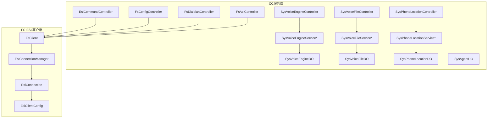
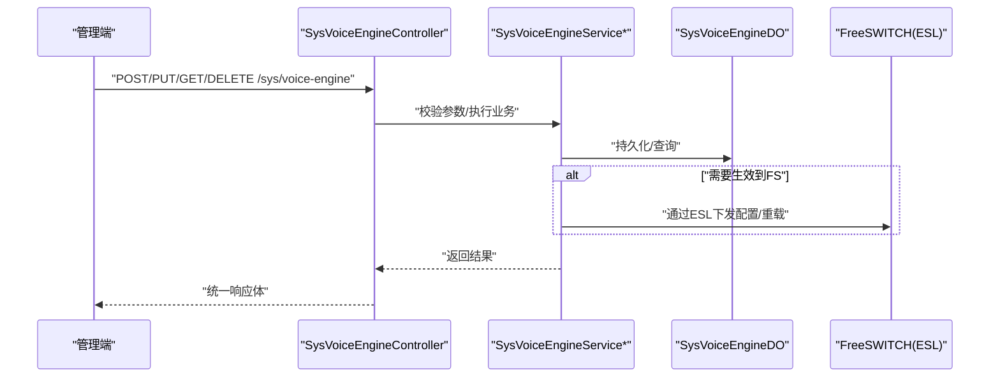
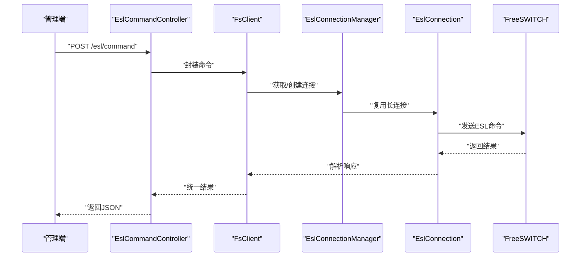
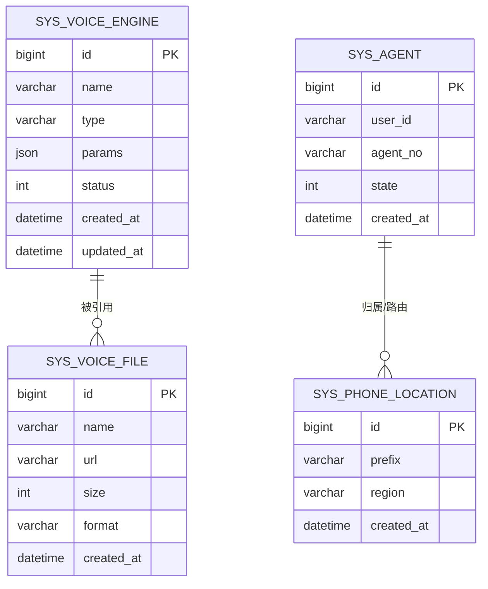
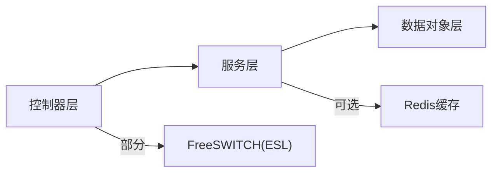

# 系统配置API

<cite>
**本文引用的文件**
- [SysVoiceEngineController.java](file://yudao-cloud/yudao-module-cc/yudao-module-cc-server/src/main/java/cn/iocoder/yudao/module/cc/controller/admin/sys/SysVoiceEngineController.java)
- [SysVoiceFileController.java](file://yudao-cloud/yudao-module-cc/yudao-module-cc-server/src/main/java/cn/iocoder/yudao/module/cc/controller/admin/sys/SysVoiceFileController.java)
- [SysPhoneLocationController.java](file://yudao-cloud/yudao-module-cc/yudao-module-cc-server/src/main/java/cn/iocoder/yudao/module/cc/controller/admin/sys/SysPhoneLocationController.java)
- [EslCommandController.java](file://yudao-cloud/yudao-module-cc/yudao-module-cc-server/src/main/java/cn/iocoder/yudao/module/cc/controller/admin/esl/EslCommandController.java)
- [FsConfigController.java](file://yudao-cloud/yudao-module-cc/yudao-module-cc-server/src/main/java/cn/iocoder/yudao/module/cc/controller/admin/fs/FsConfigController.java)
- [FsDialplanController.java](file://yudao-cloud/yudao-module-cc/yudao-module-cc-server/src/main/java/cn/iocoder/yudao/module/cc/controller/admin/fs/FsDialplanController.java)
- [FsAclController.java](file://yudao-cloud/yudao-module-cc/yudao-module-cc-server/src/main/java/cn/iocoder/yudao/module/cc/controller/admin/fs/FsAclController.java)
- [SysVoiceEngineService.java](file://yudao-cloud/yudao-module-cc/yudao-module-cc-server/src/main/java/cn/iocoder/yudao/module/cc/service/sys/SysVoiceEngineService.java)
- [SysVoiceEngineServiceImpl.java](file://yudao-cloud/yudao-module-cc/yudao-module-cc-server/src/main/java/cn/iocoder/yudao/module/cc/service/sys/SysVoiceEngineServiceImpl.java)
- [SysVoiceFileService.java](file://yudao-cloud/yudao-module-cc/yudao-module-cc-server/src/main/java/cn/iocoder/yudao/module/cc/service/sys/SysVoiceFileService.java)
- [SysVoiceFileServiceImpl.java](file://yudao-cloud/yudao-module-cc/yudao-module-cc-server/src/main/java/cn/iocoder/yudao/module/cc/service/sys/SysVoiceFileServiceImpl.java)
- [SysPhoneLocationService.java](file://yudao-cloud/yudao-module-cc/yudao-module-cc-server/src/main/java/cn/iocoder/yudao/module/cc/service/sys/SysPhoneLocationService.java)
- [SysPhoneLocationServiceImpl.java](file://yudao-cloud/yudao-module-cc/yudao-module-cc-server/src/main/java/cn/iocoder/yudao/module/cc/service/sys/SysPhoneLocationServiceImpl.java)
- [SysVoiceEngineDO.java](file://yudao-cloud/yudao-module-cc/yudao-module-cc-server/src/main/java/cn/iocoder/yudao/module/cc/dal/dataobject/sys/SysVoiceEngineDO.java)
- [SysVoiceFileDO.java](file://yudao-cloud/yudao-module-cc/yudao-module-cc-server/src/main/java/cn/iocoder/yudao/module/cc/dal/dataobject/sys/SysVoiceFileDO.java)
- [SysPhoneLocationDO.java](file://yudao-cloud/yudao-module-cc/yudao-module-cc-server/src/main/java/cn/iocoder/yudao/module/cc/dal/dataobject/sys/SysPhoneLocationDO.java)
- [SysAgentDO.java](file://yudao-cloud/yudao-module-cc/yudao-module-cc-server/src/main/java/cn/iocoder/yudao/module/cc/dal/dataobject/sys/SysAgentDO.java)
- [EslClientConfig.java](file://yudao-cloud/yudao-module-cc/ipcc-fs-esl/src/main/java/cn/ipcc/fs/esl/EslClientConfig.java)
- [EslConnectionManager.java](file://yudao-cloud/yudao-module-cc/ipcc-fs-esl/src/main/java/cn/ipcc/fs/esl/EslConnectionManager.java)
- [EslConnection.java](file://yudao-cloud/yudao-module-cc/ipcc-fs-esl/src/main/java/cn/ipcc/fs/esl/EslConnection.java)
- [FsClient.java](file://yudao-cloud/yudao-module-cc/yudao-module-cc-server/src/main/java/cn/iocoder/yudao/module/cc/esl/client/FsClient.java)
- [RedisConstants.java](file://yudao-cloud/yudao-module-cc/yudao-module-cc-server/src/main/java/cn/iocoder/yudao/module/cc/constant/RedisConstants.java)
- [RedisKeyConstants.java](file://yudao-cloud/yudao-module-cc/yudao-module-cc-server/src/main/java/cn/iocoder/yudao/module/cc/dal/redis/RedisKeyConstants.java)
</cite>

## 目录
1. [简介](#简介)
2. [项目结构](#项目结构)
3. [核心组件](#核心组件)
4. [架构总览](#架构总览)
5. [详细组件分析](#详细组件分析)
6. [依赖关系分析](#依赖关系分析)
7. [性能考虑](#性能考虑)
8. [故障排查指南](#故障排查指南)
9. [结论](#结论)
10. [附录：接口清单与示例](#附录接口清单与示例)

## 简介
本文件面向系统级配置管理，覆盖语音引擎、语音文件、电话号码位置等配置项的增删改查与同步；同时提供ESL命令执行、FreeSWITCH配置（ACL、拨号计划）的管理能力。文档包含接口说明、数据模型、调用流程、验证与同步机制、资源监控要点以及常见问题的定位方法。

## 项目结构
系统配置相关能力集中在呼叫中心模块中，采用“控制器-服务-数据对象”的分层组织方式，并通过ESL客户端与FreeSWITCH交互。

图表来源
- [SysVoiceEngineController.java](file://yudao-cloud/yudao-module-cc/yudao-module-cc-server/src/main/java/cn/iocoder/yudao/module/cc/controller/admin/sys/SysVoiceEngineController.java)
- [SysVoiceFileController.java](file://yudao-cloud/yudao-module-cc/yudao-module-cc-server/src/main/java/cn/iocoder/yudao/module/cc/controller/admin/sys/SysVoiceFileController.java)
- [SysPhoneLocationController.java](file://yudao-cloud/yudao-module-cc/yudao-module-cc-server/src/main/java/cn/iocoder/yudao/module/cc/controller/admin/sys/SysPhoneLocationController.java)
- [EslCommandController.java](file://yudao-cloud/yudao-module-cc/yudao-module-cc-server/src/main/java/cn/iocoder/yudao/module/cc/controller/admin/esl/EslCommandController.java)
- [FsConfigController.java](file://yudao-cloud/yudao-module-cc/yudao-module-cc-server/src/main/java/cn/iocoder/yudao/module/cc/controller/admin/fs/FsConfigController.java)
- [FsDialplanController.java](file://yudao-cloud/yudao-module-cc/yudao-module-cc-server/src/main/java/cn/iocoder/yudao/module/cc/controller/admin/fs/FsDialplanController.java)
- [FsAclController.java](file://yudao-cloud/yudao-module-cc/yudao-module-cc-server/src/main/java/cn/iocoder/yudao/module/cc/controller/admin/fs/FsAclController.java)
- [SysVoiceEngineService.java](file://yudao-cloud/yudao-module-cc/yudao-module-cc-server/src/main/java/cn/iocoder/yudao/module/cc/service/sys/SysVoiceEngineService.java)
- [SysVoiceFileService.java](file://yudao-cloud/yudao-module-cc/yudao-module-cc-server/src/main/java/cn/iocoder/yudao/module/cc/service/sys/SysVoiceFileService.java)
- [SysPhoneLocationService.java](file://yudao-cloud/yudao-module-cc/yudao-module-cc-server/src/main/java/cn/iocoder/yudao/module/cc/service/sys/SysPhoneLocationService.java)
- [SysVoiceEngineDO.java](file://yudao-cloud/yudao-module-cc/yudao-module-cc-server/src/main/java/cn/iocoder/yudao/module/cc/dal/dataobject/sys/SysVoiceEngineDO.java)
- [SysVoiceFileDO.java](file://yudao-cloud/yudao-module-cc/yudao-module-cc-server/src/main/java/cn/iocoder/yudao/module/cc/dal/dataobject/sys/SysVoiceFileDO.java)
- [SysPhoneLocationDO.java](file://yudao-cloud/yudao-module-cc/yudao-module-cc-server/src/main/java/cn/iocoder/yudao/module/cc/dal/dataobject/sys/SysPhoneLocationDO.java)
- [SysAgentDO.java](file://yudao-cloud/yudao-module-cc/yudao-module-cc-server/src/main/java/cn/iocoder/yudao/module/cc/dal/dataobject/sys/SysAgentDO.java)
- [EslClientConfig.java](file://yudao-cloud/yudao-module-cc/ipcc-fs-esl/src/main/java/cn/ipcc/fs/esl/EslClientConfig.java)
- [EslConnectionManager.java](file://yudao-cloud/yudao-module-cc/ipcc-fs-esl/src/main/java/cn/ipcc/fs/esl/EslConnectionManager.java)
- [EslConnection.java](file://yudao-cloud/yudao-module-cc/ipcc-fs-esl/src/main/java/cn/ipcc/fs/esl/EslConnection.java)
- [FsClient.java](file://yudao-cloud/yudao-module-cc/yudao-module-cc-server/src/main/java/cn/iocoder/yudao/module/cc/esl/client/FsClient.java)

章节来源
- [SysVoiceEngineController.java](file://yudao-cloud/yudao-module-cc/yudao-module-cc-server/src/main/java/cn/iocoder/yudao/module/cc/controller/admin/sys/SysVoiceEngineController.java)
- [SysVoiceFileController.java](file://yudao-cloud/yudao-module-cc/yudao-module-cc-server/src/main/java/cn/iocoder/yudao/module/cc/controller/admin/sys/SysVoiceFileController.java)
- [SysPhoneLocationController.java](file://yudao-cloud/yudao-module-cc/yudao-module-cc-server/src/main/java/cn/iocoder/yudao/module/cc/controller/admin/sys/SysPhoneLocationController.java)
- [EslCommandController.java](file://yudao-cloud/yudao-module-cc/yudao-module-cc-server/src/main/java/cn/iocoder/yudao/module/cc/controller/admin/esl/EslCommandController.java)
- [FsConfigController.java](file://yudao-cloud/yudao-module-cc/yudao-module-cc-server/src/main/java/cn/iocoder/yudao/module/cc/controller/admin/fs/FsConfigController.java)
- [FsDialplanController.java](file://yudao-cloud/yudao-module-cc/yudao-module-cc-server/src/main/java/cn/iocoder/yudao/module/cc/controller/admin/fs/FsDialplanController.java)
- [FsAclController.java](file://yudao-cloud/yudao-module-cc/yudao-module-cc-server/src/main/java/cn/iocoder/yudao/module/cc/controller/admin/fs/FsAclController.java)

## 核心组件
- 语音引擎配置：提供语音引擎实例的创建、更新、分页查询、删除等能力，用于TTS/ASR等语音服务的接入与切换。
- 语音文件管理：支持语音文件的上传、列表、详情、删除，供IVR或TTS播放使用。
- 电话号码位置：维护号码段与地区映射，用于来电显示、路由策略与计费。
- ESL命令执行：通过ESL通道向FreeSWITCH发送任意命令，便于调试与运维。
- FreeSWITCH配置管理：对ACL、拨号计划等进行读取与下发，保障通话路径与权限控制。

章节来源
- [SysVoiceEngineController.java](file://yudao-cloud/yudao-module-cc/yudao-module-cc-server/src/main/java/cn/iocoder/yudao/module/cc/controller/admin/sys/SysVoiceEngineController.java)
- [SysVoiceFileController.java](file://yudao-cloud/yudao-module-cc/yudao-module-cc-server/src/main/java/cn/iocoder/yudao/module/cc/controller/admin/sys/SysVoiceFileController.java)
- [SysPhoneLocationController.java](file://yudao-cloud/yudao-module-cc/yudao-module-cc-server/src/main/java/cn/iocoder/yudao/module/cc/controller/admin/sys/SysPhoneLocationController.java)
- [EslCommandController.java](file://yudao-cloud/yudao-module-cc/yudao-module-cc-server/src/main/java/cn/iocoder/yudao/module/cc/controller/admin/esl/EslCommandController.java)
- [FsConfigController.java](file://yudao-cloud/yudao-module-cc/yudao-module-cc-server/src/main/java/cn/iocoder/yudao/module/cc/controller/admin/fs/FsConfigController.java)
- [FsDialplanController.java](file://yudao-cloud/yudao-module-cc/yudao-module-cc-server/src/main/java/cn/iocoder/yudao/module/cc/controller/admin/fs/FsDialplanController.java)
- [FsAclController.java](file://yudao-cloud/yudao-module-cc/yudao-module-cc-server/src/main/java/cn/iocoder/yudao/module/cc/controller/admin/fs/FsAclController.java)

## 架构总览
系统配置API遵循分层架构：前端/管理端调用控制器，控制器委托服务完成业务逻辑，服务读写持久化数据并可选触发FreeSWITCH侧变更；ESL命令由专用控制器经FsClient与ESL客户端库下发至FreeSWITCH。

图表来源
- [SysVoiceEngineController.java](file://yudao-cloud/yudao-module-cc/yudao-module-cc-server/src/main/java/cn/iocoder/yudao/module/cc/controller/admin/sys/SysVoiceEngineController.java)
- [SysVoiceEngineService.java](file://yudao-cloud/yudao-module-cc/yudao-module-cc-server/src/main/java/cn/iocoder/yudao/module/cc/service/sys/SysVoiceEngineService.java)
- [SysVoiceEngineServiceImpl.java](file://yudao-cloud/yudao-module-cc/yudao-module-cc-server/src/main/java/cn/iocoder/yudao/module/cc/service/sys/SysVoiceEngineServiceImpl.java)
- [SysVoiceEngineDO.java](file://yudao-cloud/yudao-module-cc/yudao-module-cc-server/src/main/java/cn/iocoder/yudao/module/cc/dal/dataobject/sys/SysVoiceEngineDO.java)
- [FsClient.java](file://yudao-cloud/yudao-module-cc/yudao-module-cc-server/src/main/java/cn/iocoder/yudao/module/cc/esl/client/FsClient.java)
- [EslConnectionManager.java](file://yudao-cloud/yudao-module-cc/ipcc-fs-esl/src/main/java/cn/ipcc/fs/esl/EslConnectionManager.java)

## 详细组件分析

### 语音引擎配置
- 职责：管理语音引擎实例（如TTS/ASR供应商、连接参数、密钥、默认引擎等），并提供分页查询、新增、修改、删除。
- 关键类：
  - 控制器：SysVoiceEngineController
  - 服务：SysVoiceEngineService / SysVoiceEngineServiceImpl
  - 数据对象：SysVoiceEngineDO
- 典型流程：
  - 新增/修改：参数校验 -> 写入数据库 -> 可选触发FS侧热加载或缓存刷新 -> 返回结果
  - 查询：分页/条件过滤 -> 组装VO -> 返回
- 注意事项：
  - 敏感字段（如密钥）应加密存储
  - 多租户场景需隔离引擎实例
  - 变更生效建议异步化，避免阻塞请求

章节来源
- [SysVoiceEngineController.java](file://yudao-cloud/yudao-module-cc/yudao-module-cc-server/src/main/java/cn/iocoder/yudao/module/cc/controller/admin/sys/SysVoiceEngineController.java)
- [SysVoiceEngineService.java](file://yudao-cloud/yudao-module-cc/yudao-module-cc-server/src/main/java/cn/iocoder/yudao/module/cc/service/sys/SysVoiceEngineService.java)
- [SysVoiceEngineServiceImpl.java](file://yudao-cloud/yudao-module-cc/yudao-module-cc-server/src/main/java/cn/iocoder/yudao/module/cc/service/sys/SysVoiceEngineServiceImpl.java)
- [SysVoiceEngineDO.java](file://yudao-cloud/yudao-module-cc/yudao-module-cc-server/src/main/java/cn/iocoder/yudao/module/cc/dal/dataobject/sys/SysVoiceEngineDO.java)

### 语音文件管理
- 职责：管理语音素材（录音/TTS输出），支持上传、列表、详情、删除，供IVR或播报使用。
- 关键类：
  - 控制器：SysVoiceFileController
  - 服务：SysVoiceFileService / SysVoiceFileServiceImpl
  - 数据对象：SysVoiceFileDO
- 典型流程：
  - 上传：接收文件 -> 校验格式/大小 -> 落盘/对象存储 -> 记录元数据 -> 返回URL
  - 列表/详情：按条件检索 -> 返回VO
  - 删除：软删除或物理删除 -> 清理冗余资源
- 注意事项：
  - 大文件上传需分片/断点续传
  - 文件访问建议走CDN或签名URL
  - 删除需考虑引用关系与审计

章节来源
- [SysVoiceFileController.java](file://yudao-cloud/yudao-module-cc/yudao-module-cc-server/src/main/java/cn/iocoder/yudao/module/cc/controller/admin/sys/SysVoiceFileController.java)
- [SysVoiceFileService.java](file://yudao-cloud/yudao-module-cc/yudao-module-cc-server/src/main/java/cn/iocoder/yudao/module/cc/service/sys/SysVoiceFileService.java)
- [SysVoiceFileServiceImpl.java](file://yudao-cloud/yudao-module-cc/yudao-module-cc-server/src/main/java/cn/iocoder/yudao/module/cc/service/sys/SysVoiceFileServiceImpl.java)
- [SysVoiceFileDO.java](file://yudao-cloud/yudao-module-cc/yudao-module-cc-server/src/main/java/cn/iocoder/yudao/module/cc/dal/dataobject/sys/SysVoiceFileDO.java)

### 电话号码位置
- 职责：维护号码段与地区映射，用于来电显示、路由策略与计费。
- 关键类：
  - 控制器：SysPhoneLocationController
  - 服务：SysPhoneLocationService / SysPhoneLocationServiceImpl
  - 数据对象：SysPhoneLocationDO
- 典型流程：
  - 新增/修改：区间校验 -> 去重 -> 持久化
  - 查询：前缀匹配/范围查询 -> 返回匹配结果
- 注意事项：
  - 区间重叠检测与冲突处理
  - 热点查询可缓存至Redis

章节来源
- [SysPhoneLocationController.java](file://yudao-cloud/yudao-module-cc/yudao-module-cc-server/src/main/java/cn/iocoder/yudao/module/cc/controller/admin/sys/SysPhoneLocationController.java)
- [SysPhoneLocationService.java](file://yudao-cloud/yudao-module-cc/yudao-module-cc-server/src/main/java/cn/iocoder/yudao/module/cc/service/sys/SysPhoneLocationService.java)
- [SysPhoneLocationServiceImpl.java](file://yudao-cloud/yudao-module-cc/yudao-module-cc-server/src/main/java/cn/iocoder/yudao/module/cc/service/sys/SysPhoneLocationServiceImpl.java)
- [SysPhoneLocationDO.java](file://yudao-cloud/yudao-module-cc/yudao-module-cc-server/src/main/java/cn/iocoder/yudao/module/cc/dal/dataobject/sys/SysPhoneLocationDO.java)

### ESL命令执行
- 职责：通过ESL向FreeSWITCH发送命令，用于调试、状态查询、动态控制。
- 关键类：
  - 控制器：EslCommandController
  - 客户端：FsClient
  - ESL库：EslClientConfig / EslConnectionManager / EslConnection
- 调用序列：

图表来源
- [EslCommandController.java](file://yudao-cloud/yudao-module-cc/yudao-module-cc-server/src/main/java/cn/iocoder/yudao/module/cc/controller/admin/esl/EslCommandController.java)
- [FsClient.java](file://yudao-cloud/yudao-module-cc/yudao-module-cc-server/src/main/java/cn/iocoder/yudao/module/cc/esl/client/FsClient.java)
- [EslConnectionManager.java](file://yudao-cloud/yudao-module-cc/ipcc-fs-esl/src/main/java/cn/ipcc/fs/esl/EslConnectionManager.java)
- [EslConnection.java](file://yudao-cloud/yudao-module-cc/ipcc-fs-esl/src/main/java/cn/ipcc/fs/esl/EslConnection.java)
- [EslClientConfig.java](file://yudao-cloud/yudao-module-cc/ipcc-fs-esl/src/main/java/cn/ipcc/fs/esl/EslClientConfig.java)

章节来源
- [EslCommandController.java](file://yudao-cloud/yudao-module-cc/yudao-module-cc-server/src/main/java/cn/iocoder/yudao/module/cc/controller/admin/esl/EslCommandController.java)
- [FsClient.java](file://yudao-cloud/yudao-module-cc/yudao-module-cc-server/src/main/java/cn/iocoder/yudao/module/cc/esl/client/FsClient.java)
- [EslConnectionManager.java](file://yudao-cloud/yudao-module-cc/ipcc-fs-esl/src/main/java/cn/ipcc/fs/esl/EslConnectionManager.java)
- [EslConnection.java](file://yudao-cloud/yudao-module-cc/ipcc-fs-esl/src/main/java/cn/ipcc/fs/esl/EslConnection.java)
- [EslClientConfig.java](file://yudao-cloud/yudao-module-cc/ipcc-fs-esl/src/main/java/cn/ipcc/fs/esl/EslClientConfig.java)

### FreeSWITCH配置管理（ACL/拨号计划）
- 职责：读取/下发ACL规则与拨号计划，保障呼叫路由与访问控制。
- 关键类：
  - 控制器：FsConfigController / FsDialplanController / FsAclController
- 典型流程：
  - 读取：从FS拉取当前配置快照 -> 展示
  - 下发：生成配置片段 -> 通过ESL下发 -> 触发reload或局部重载
- 注意事项：
  - 下发前进行语法校验与回滚预案
  - 批量下发需事务化与幂等设计

章节来源
- [FsConfigController.java](file://yudao-cloud/yudao-module-cc/yudao-module-cc-server/src/main/java/cn/iocoder/yudao/module/cc/controller/admin/fs/FsConfigController.java)
- [FsDialplanController.java](file://yudao-cloud/yudao-module-cc/yudao-module-cc-server/src/main/java/cn/iocoder/yudao/module/cc/controller/admin/fs/FsDialplanController.java)
- [FsAclController.java](file://yudao-cloud/yudao-module-cc/yudao-module-cc-server/src/main/java/cn/iocoder/yudao/module/cc/controller/admin/fs/FsAclController.java)

### 数据模型概览

图表来源
- [SysVoiceEngineDO.java](file://yudao-cloud/yudao-module-cc/yudao-module-cc-server/src/main/java/cn/iocoder/yudao/module/cc/dal/dataobject/sys/SysVoiceEngineDO.java)
- [SysVoiceFileDO.java](file://yudao-cloud/yudao-module-cc/yudao-module-cc-server/src/main/java/cn/iocoder/yudao/module/cc/dal/dataobject/sys/SysVoiceFileDO.java)
- [SysPhoneLocationDO.java](file://yudao-cloud/yudao-module-cc/yudao-module-cc-server/src/main/java/cn/iocoder/yudao/module/cc/dal/dataobject/sys/SysPhoneLocationDO.java)
- [SysAgentDO.java](file://yudao-cloud/yudao-module-cc/yudao-module-cc-server/src/main/java/cn/iocoder/yudao/module/cc/dal/dataobject/sys/SysAgentDO.java)

## 依赖关系分析
- 控制器与服务：松耦合，通过接口抽象，便于替换实现与单元测试。
- 服务与数据对象：通过MyBatis/ORM持久化，关注领域逻辑。
- ESL客户端：以连接池/管理器模式复用连接，降低握手开销。
- 缓存：电话号码位置等热点数据可通过Redis缓存加速查询。

图表来源
- [RedisConstants.java](file://yudao-cloud/yudao-module-cc/yudao-module-cc-server/src/main/java/cn/iocoder/yudao/module/cc/constant/RedisConstants.java)
- [RedisKeyConstants.java](file://yudao-cloud/yudao-module-cc/yudao-module-cc-server/src/main/java/cn/iocoder/yudao/module/cc/dal/redis/RedisKeyConstants.java)
- [EslConnectionManager.java](file://yudao-cloud/yudao-module-cc/ipcc-fs-esl/src/main/java/cn/ipcc/fs/esl/EslConnectionManager.java)

章节来源
- [RedisConstants.java](file://yudao-cloud/yudao-module-cc/yudao-module-cc-server/src/main/java/cn/iocoder/yudao/module/cc/constant/RedisConstants.java)
- [RedisKeyConstants.java](file://yudao-cloud/yudao-module-cc/yudao-module-cc-server/src/main/java/cn/iocoder/yudao/module/cc/dal/redis/RedisKeyConstants.java)
- [EslConnectionManager.java](file://yudao-cloud/yudao-module-cc/ipcc-fs-esl/src/main/java/cn/ipcc/fs/esl/EslConnectionManager.java)

## 性能考虑
- ESL连接复用：通过连接管理器维持长连接，减少握手与鉴权开销。
- 批量操作：对ACL/拨号计划的批量下发应合并为单次重载，避免频繁reload。
- 缓存策略：电话号码位置等读多写少数据建议缓存，设置合理过期与失效策略。
- 异步化：耗时操作（如文件转码、FS重载）采用异步任务，提升接口响应。
- 限流与熔断：对外部FS或第三方语音服务调用增加超时与重试上限，防止雪崩。

[本节为通用指导，不直接分析具体文件]

## 故障排查指南
- ESL连接失败：检查EslClientConfig地址、端口、密码；查看EslConnectionManager连接池状态；确认FS是否监听ESL。
- 命令执行超时：核对FS负载与队列；适当增大超时；对慢命令拆分执行。
- 配置未生效：确认是否触发了reload；检查FS日志；对比下发前后差异。
- 语音文件无法播放：检查URL可达性、格式兼容性、权限；确认FS媒体路径映射正确。
- 号码位置匹配异常：检查区间重叠、前缀顺序；验证缓存一致性。

章节来源
- [EslClientConfig.java](file://yudao-cloud/yudao-module-cc/ipcc-fs-esl/src/main/java/cn/ipcc/fs/esl/EslClientConfig.java)
- [EslConnectionManager.java](file://yudao-cloud/yudao-module-cc/ipcc-fs-esl/src/main/java/cn/ipcc/fs/esl/EslConnectionManager.java)
- [EslConnection.java](file://yudao-cloud/yudao-module-cc/ipcc-fs-esl/src/main/java/cn/ipcc/fs/esl/EslConnection.java)

## 结论
本系统配置API围绕语音引擎、语音文件、电话号码位置等核心资源，结合ESL命令与FreeSWITCH配置管理能力，形成完整的系统级配置闭环。通过分层架构、连接复用、缓存与异步化等手段，兼顾了易用性与性能。建议在上线前完善校验、回滚、审计与监控，确保变更可控、可观测、可恢复。

[本节为总结，不直接分析具体文件]

## 附录：接口清单与示例
以下为各模块常用接口与其职责说明（以实际代码为准，此处列出命名约定与用途）：

- 语音引擎
  - 新增/修改/删除/分页查询：/admin-api/cc/sys/voice-engine/*
  - 作用：管理TTS/ASR等语音服务实例与参数
  - 参考：[SysVoiceEngineController.java](file://yudao-cloud/yudao-module-cc/yudao-module-cc-server/src/main/java/cn/iocoder/yudao/module/cc/controller/admin/sys/SysVoiceEngineController.java)

- 语音文件
  - 上传/列表/详情/删除：/admin-api/cc/sys/voice-file/*
  - 作用：管理语音素材，供IVR/播报使用
  - 参考：[SysVoiceFileController.java](file://yudao-cloud/yudao-module-cc/yudao-module-cc-server/src/main/java/cn/iocoder/yudao/module/cc/controller/admin/sys/SysVoiceFileController.java)

- 电话号码位置
  - 新增/修改/删除/分页查询：/admin-api/cc/sys/phone-location/*
  - 作用：维护号码段与地区映射，支撑路由与计费
  - 参考：[SysPhoneLocationController.java](file://yudao-cloud/yudao-module-cc/yudao-module-cc-server/src/main/java/cn/iocoder/yudao/module/cc/controller/admin/sys/SysPhoneLocationController.java)

- ESL命令执行
  - 执行命令：/admin-api/cc/esl/command
  - 作用：通过ESL向FS发送命令，用于调试与控制
  - 参考：[EslCommandController.java](file://yudao-cloud/yudao-module-cc/yudao-module-cc-server/src/main/java/cn/iocoder/yudao/module/cc/controller/admin/esl/EslCommandController.java)

- FreeSWITCH配置
  - ACL：/admin-api/cc/fs/acl/*
  - 拨号计划：/admin-api/cc/fs/dialplan/*
  - 配置读取/下发：/admin-api/cc/fs/config/*
  - 作用：管理与下发FS访问控制与路由规则
  - 参考：[FsAclController.java](file://yudao-cloud/yudao-module-cc/yudao-module-cc-server/src/main/java/cn/iocoder/yudao/module/cc/controller/admin/fs/FsAclController.java)、[FsDialplanController.java](file://yudao-cloud/yudao-module-cc/yudao-module-cc-server/src/main/java/cn/iocoder/yudao/module/cc/controller/admin/fs/FsDialplanController.java)、[FsConfigController.java](file://yudao-cloud/yudao-module-cc/yudao-module-cc-server/src/main/java/cn/iocoder/yudao/module/cc/controller/admin/fs/FsConfigController.java)

- 数据模型参考
  - 语音引擎：[SysVoiceEngineDO.java](file://yudao-cloud/yudao-module-cc/yudao-module-cc-server/src/main/java/cn/iocoder/yudao/module/cc/dal/dataobject/sys/SysVoiceEngineDO.java)
  - 语音文件：[SysVoiceFileDO.java](file://yudao-cloud/yudao-module-cc/yudao-module-cc-server/src/main/java/cn/iocoder/yudao/module/cc/dal/dataobject/sys/SysVoiceFileDO.java)
  - 电话号码位置：[SysPhoneLocationDO.java](file://yudao-cloud/yudao-module-cc/yudao-module-cc-server/src/main/java/cn/iocoder/yudao/module/cc/dal/dataobject/sys/SysPhoneLocationDO.java)
  - 坐席信息：[SysAgentDO.java](file://yudao-cloud/yudao-module-cc/yudao-module-cc-server/src/main/java/cn/iocoder/yudao/module/cc/dal/dataobject/sys/SysAgentDO.java)

- 配置与同步示例（概念性）
  - 新增语音引擎后，触发FS侧TTS模块重载或缓存刷新
  - 修改ACL后，通过ESL下发并reload acl-list
  - 更新拨号计划后，reload dialplan以生效新路由

[本节为概念性示例，不直接分析具体文件]