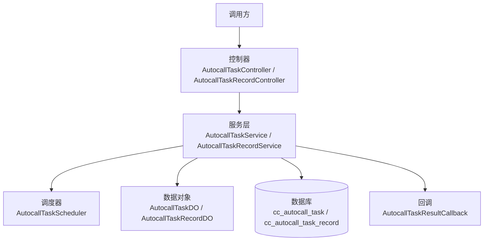
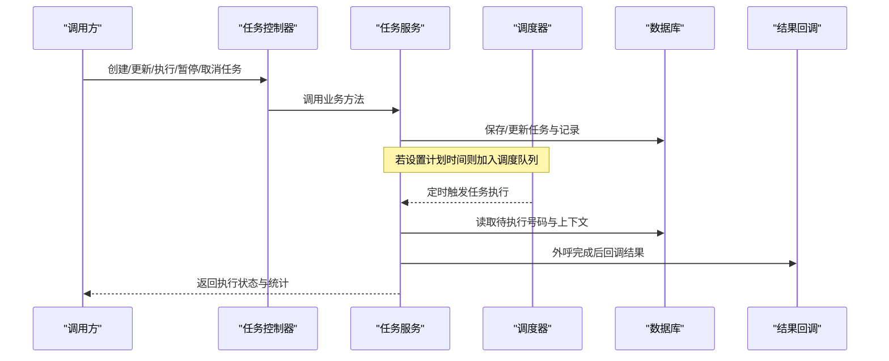
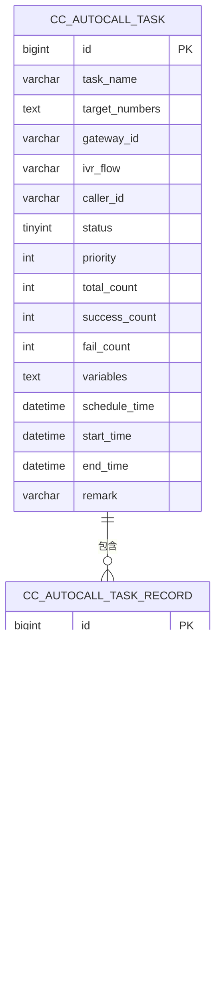
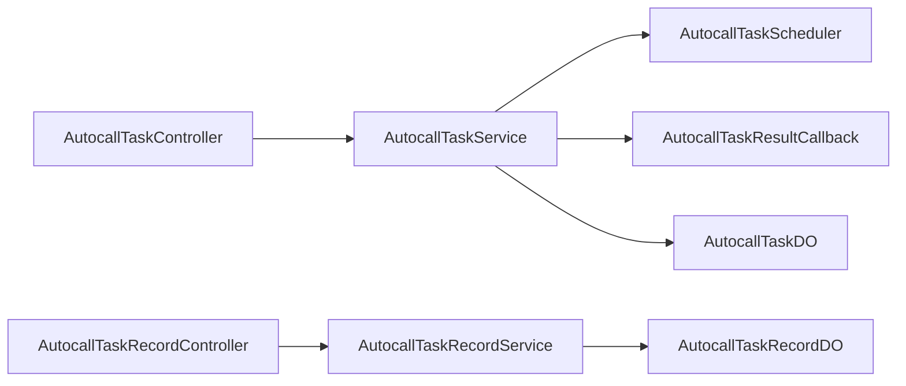

# 自动外呼API

<cite>
**本文引用的文件**
- [autocall_task.sql](file://yudao-cloud/yudao-module-cc/doc/sql/autocall_task.sql)
- [AutocallTaskController.java](file://yudao-cloud/yudao-module-cc/yudao-module-cc-server/src/main/java/cn/iocoder/yudao/module/cc/controller/admin/autocall/AutocallTaskController.java)
- [AutocallTaskRecordController.java](file://yudao-cloud/yudao-module-cc/yudao-module-cc-server/src/main/java/cn/iocoder/yudao/module/cc/controller/admin/autocall/AutocallTaskRecordController.java)
- [AutocallTaskService.java](file://yudao-cloud/yudao-module-cc/yudao-module-cc-server/src/main/java/cn/iocoder/yudao/module/cc/service/autocall/AutocallTaskService.java)
- [AutocallTaskServiceImpl.java](file://yudao-cloud/yudao-module-cc/yudao-module-cc-server/src/main/java/cn/iocoder/yudao/module/cc/service/autocall/AutocallTaskServiceImpl.java)
- [AutocallTaskScheduler.java](file://yudao-cloud/yudao-module-cc/yudao-module-cc-server/src/main/java/cn/iocoder/yudao/module/cc/service/autocall/AutocallTaskScheduler.java)
- [AutocallTaskRecordService.java](file://yudao-cloud/yudao-module-cc/yudao-module-cc-server/src/main/java/cn/iocoder/yudao/module/cc/service/autocall/AutocallTaskRecordService.java)
- [AutocallTaskRecordServiceImpl.java](file://yudao-cloud/yudao-module-cc/yudao-module-cc-server/src/main/java/cn/iocoder/yudao/module/cc/service/autocall/AutocallTaskRecordServiceImpl.java)
- [AutocallTaskResultCallback.java](file://yudao-cloud/yudao-module-cc/yudao-module-cc-server/src/main/java/cn/iocoder/yudao/module/cc/service/autocall/AutocallTaskResultCallback.java)
- [AutocallTaskDO.java](file://yudao-cloud/yudao-module-cc/yudao-module-cc-server/src/main/java/cn/iocoder/yudao/module/cc/dal/dataobject/autocall/AutocallTaskDO.java)
- [AutocallTaskRecordDO.java](file://yudao-cloud/yudao-module-cc/yudao-module-cc-server/src/main/java/cn/iocoder/yudao/module/cc/dal/dataobject/autocall/AutocallTaskRecordDO.java)
- [AutocallTaskPageReqVO.java](file://yudao-cloud/yudao-module-cc/yudao-module-cc-server/src/main/java/cn/iocoder/yudao/module/cc/controller/admin/autocall/vo/AutocallTaskPageReqVO.java)
- [AutocallTaskRecordPageReqVO.java](file://yudao-cloud/yudao-module-cc/yudao-module-cc-server/src/main/java/cn/iocoder/yudao/module/cc/controller/admin/autocall/vo/AutocallTaskRecordPageReqVO.java)
- [AutocallTaskRecordRespVO.java](file://yudao-cloud/yudao-module-cc/yudao-module-cc-server/src/main/java/cn/iocoder/yudao/module/cc/controller/admin/autocall/vo/AutocallTaskRecordRespVO.java)
- [AutocallTaskRespVO.java](file://yudao-cloud/yudao-module-cc/yudao-module-cc-server/src/main/java/cn/iocoder/yudao/module/cc/controller/admin/autocall/vo/AutocallTaskRespVO.java)
- [AutocallTaskSaveReqVO.java](file://yudao-cloud/yudao-module-cc/yudao-module-cc-server/src/main/java/cn/iocoder/yudao/module/cc/controller/admin/autocall/vo/AutocallTaskSaveReqVO.java)
</cite>

## 目录
1. [简介](#简介)
2. [项目结构](#项目结构)
3. [核心组件](#核心组件)
4. [架构总览](#架构总览)
5. [详细组件分析](#详细组件分析)
6. [依赖关系分析](#依赖关系分析)
7. [性能考虑](#性能考虑)
8. [故障排查指南](#故障排查指南)
9. [结论](#结论)
10. [附录：接口清单与示例](#附录接口清单与示例)

## 简介
本文件为“自动外呼系统”的API文档，覆盖外呼任务的创建、调度、监控与管理能力，包括拨号策略配置、任务队列管理、外呼结果统计等。同时提供批量号码导入、外呼模板管理（IVR流程）、失败重试机制等高级功能的说明，并给出完整的外呼任务配置示例与执行监控接口说明。

## 项目结构
自动外呼功能位于呼叫中心模块中，采用分层架构：
- 控制器层：对外暴露REST API，负责参数校验与响应封装
- 服务层：实现业务逻辑，协调任务调度、记录统计、回调通知等
- 数据访问层：通过DO对象映射数据库表，持久化任务与记录
- 调度器：按任务计划时间或优先级触发外呼
- 回调：外呼完成后将结果回传给上游系统

图表来源
- [AutocallTaskController.java](file://yudao-cloud/yudao-module-cc/yudao-module-cc-server/src/main/java/cn/iocoder/yudao/module/cc/controller/admin/autocall/AutocallTaskController.java)
- [AutocallTaskRecordController.java](file://yudao-cloud/yudao-module-cc/yudao-module-cc-server/src/main/java/cn/iocoder/yudao/module/cc/controller/admin/autocall/AutocallTaskRecordController.java)
- [AutocallTaskService.java](file://yudao-cloud/yudao-module-cc/yudao-module-cc-server/src/main/java/cn/iocoder/yudao/module/cc/service/autocall/AutocallTaskService.java)
- [AutocallTaskRecordService.java](file://yudao-cloud/yudao-module-cc/yudao-module-cc-server/src/main/java/cn/iocoder/yudao/module/cc/service/autocall/AutocallTaskRecordService.java)
- [AutocallTaskScheduler.java](file://yudao-cloud/yudao-module-cc/yudao-module-cc-server/src/main/java/cn/iocoder/yudao/module/cc/service/autocall/AutocallTaskScheduler.java)
- [AutocallTaskDO.java](file://yudao-cloud/yudao-module-cc/yudao-module-cc-server/src/main/java/cn/iocoder/yudao/module/cc/dal/dataobject/autocall/AutocallTaskDO.java)
- [AutocallTaskRecordDO.java](file://yudao-cloud/yudao-module-cc/yudao-module-cc-server/src/main/java/cn/iocoder/yudao/module/cc/dal/dataobject/autocall/AutocallTaskRecordDO.java)

章节来源
- [autocall_task.sql:1-101](file://yudao-cloud/yudao-module-cc/doc/sql/autocall_task.sql#L1-L101)

## 核心组件
- 控制器
  - 外呼任务控制器：提供任务CRUD、执行、暂停、取消、分页查询等接口
  - 外呼任务记录控制器：提供记录分页查询、详情、导出等接口
- 服务
  - 外呼任务服务：任务创建、更新、执行控制、统计汇总、变量注入
  - 外呼任务记录服务：记录写入、状态流转、时长计算、挂断原因聚合
  - 调度器：按任务计划时间与优先级拉取待执行任务，分片并发拨号
  - 结果回调：外呼结束后将结果推送至外部系统
- 数据对象
  - 任务DO：映射任务表，包含目标号码、IVR流程、网关、状态、优先级、统计字段等
  - 记录DO：映射记录表，包含每次呼叫的状态、起止时间、时长、DTMF收集等

章节来源
- [AutocallTaskController.java](file://yudao-cloud/yudao-module-cc/yudao-module-cc-server/src/main/java/cn/iocoder/yudao/module/cc/controller/admin/autocall/AutocallTaskController.java)
- [AutocallTaskRecordController.java](file://yudao-cloud/yudao-module-cc/yudao-module-cc-server/src/main/java/cn/iocoder/yudao/module/cc/controller/admin/autocall/AutocallTaskRecordController.java)
- [AutocallTaskService.java](file://yudao-cloud/yudao-module-cc/yudao-module-cc-server/src/main/java/cn/iocoder/yudao/module/cc/service/autocall/AutocallTaskService.java)
- [AutocallTaskRecordService.java](file://yudao-cloud/yudao-module-cc/yudao-module-cc-server/src/main/java/cn/iocoder/yudao/module/cc/service/autocall/AutocallTaskRecordService.java)
- [AutocallTaskScheduler.java](file://yudao-cloud/yudao-module-cc/yudao-module-cc-server/src/main/java/cn/iocoder/yudao/module/cc/service/autocall/AutocallTaskScheduler.java)
- [AutocallTaskDO.java](file://yudao-cloud/yudao-module-cc/yudao-module-cc-server/src/main/java/cn/iocoder/yudao/module/cc/dal/dataobject/autocall/AutocallTaskDO.java)
- [AutocallTaskRecordDO.java](file://yudao-cloud/yudao-module-cc/yudao-module-cc-server/src/main/java/cn/iocoder/yudao/module/cc/dal/dataobject/autocall/AutocallTaskRecordDO.java)

## 架构总览
外呼任务从创建到执行的端到端流程如下：

图表来源
- [AutocallTaskController.java](file://yudao-cloud/yudao-module-cc/yudao-module-cc-server/src/main/java/cn/iocoder/yudao/module/cc/controller/admin/autocall/AutocallTaskController.java)
- [AutocallTaskService.java](file://yudao-cloud/yudao-module-cc/yudao-module-cc-server/src/main/java/cn/iocoder/yudao/module/cc/service/autocall/AutocallTaskService.java)
- [AutocallTaskScheduler.java](file://yudao-cloud/yudao-module-cc/yudao-module-cc-server/src/main/java/cn/iocoder/yudao/module/cc/service/autocall/AutocallTaskScheduler.java)
- [AutocallTaskResultCallback.java](file://yudao-cloud/yudao-module-cc/yudao-module-cc-server/src/main/java/cn/iocoder/yudao/module/cc/service/autocall/AutocallTaskResultCallback.java)

## 详细组件分析

### 外呼任务控制器
- 职责
  - 接收任务创建、更新、删除、执行、暂停、取消请求
  - 提供任务分页查询与详情接口
  - 参数校验与权限控制
- 关键输入输出
  - 输入：任务名称、目标号码列表、IVR流程ID、出局网关ID、主叫号码、优先级、计划执行时间、业务变量JSON等
  - 输出：任务ID、状态、统计信息（总数、成功数、失败数）
- 典型流程
  - 创建任务：校验参数 -> 写入任务表 -> 返回任务ID
  - 立即执行：更新状态为执行中 -> 入队调度 -> 返回执行结果
  - 暂停/取消：更新任务状态 -> 停止后续拨号

章节来源
- [AutocallTaskController.java](file://yudao-cloud/yudao-module-cc/yudao-module-cc-server/src/main/java/cn/iocoder/yudao/module/cc/controller/admin/autocall/AutocallTaskController.java)
- [AutocallTaskSaveReqVO.java](file://yudao-cloud/yudao-module-cc/yudao-module-cc-server/src/main/java/cn/iocoder/yudao/module/cc/controller/admin/autocall/vo/AutocallTaskSaveReqVO.java)
- [AutocallTaskRespVO.java](file://yudao-cloud/yudao-module-cc/yudao-module-cc-server/src/main/java/cn/iocoder/yudao/module/cc/controller/admin/autocall/vo/AutocallTaskRespVO.java)
- [AutocallTaskPageReqVO.java](file://yudao-cloud/yudao-module-cc/yudao-module-cc-server/src/main/java/cn/iocoder/yudao/module/cc/controller/admin/autocall/vo/AutocallTaskPageReqVO.java)

### 外呼任务记录控制器
- 职责
  - 提供任务记录的分页查询、详情、导出
  - 支持按任务ID、状态、时间段筛选
- 关键输入输出
  - 输入：任务ID、状态、开始/结束时间、页码、每页大小
  - 输出：记录列表（被叫号码、状态、起止时间、时长、挂断原因、DTMF收集等）

章节来源
- [AutocallTaskRecordController.java](file://yudao-cloud/yudao-module-cc/yudao-module-cc-server/src/main/java/cn/iocoder/yudao/module/cc/controller/admin/autocall/AutocallTaskRecordController.java)
- [AutocallTaskRecordPageReqVO.java](file://yudao-cloud/yudao-module-cc/yudao-module-cc-server/src/main/java/cn/iocoder/yudao/module/cc/controller/admin/autocall/vo/AutocallTaskRecordPageReqVO.java)
- [AutocallTaskRecordRespVO.java](file://yudao-cloud/yudao-module-cc/yudao-module-cc-server/src/main/java/cn/iocoder/yudao/module/cc/controller/admin/autocall/vo/AutocallTaskRecordRespVO.java)

### 外呼任务服务
- 职责
  - 任务生命周期管理：创建、更新、删除、执行、暂停、取消
  - 拨号策略：基于优先级、计划时间、号码路由、网关选择进行拨号
  - 统计汇总：实时累计成功/失败数量，计算接通率、平均时长
  - 变量注入：将业务变量传入IVR流程（如TTS文本）
- 关键处理
  - 批量号码解析与去重
  - 任务状态机：待执行 -> 执行中 -> 已完成/已暂停/已取消
  - 失败重试：对失败号码按策略重试（次数、间隔、退避）

章节来源
- [AutocallTaskService.java](file://yudao-cloud/yudao-module-cc/yudao-module-cc-server/src/main/java/cn/iocoder/yudao/module/cc/service/autocall/AutocallTaskService.java)
- [AutocallTaskServiceImpl.java](file://yudao-cloud/yudao-module-cc/yudao-module-cc-server/src/main/java/cn/iocoder/yudao/module/cc/service/autocall/AutocallTaskServiceImpl.java)
- [AutocallTaskDO.java](file://yudao-cloud/yudao-module-cc/yudao-module-cc-server/src/main/java/cn/iocoder/yudao/module/cc/dal/dataobject/autocall/AutocallTaskDO.java)

### 外呼任务记录服务
- 职责
  - 记录写入：每次拨号生成一条记录，关联任务ID与通话ID
  - 状态流转：待呼叫 -> 呼叫中 -> 已接通/未接通/呼叫失败
  - 时长与原因：记录起止时间、通话时长、挂断原因、DTMF收集
- 关键处理
  - 并发安全：多通道拨号时保证记录不丢失
  - 数据一致性：任务统计与记录一致

章节来源
- [AutocallTaskRecordService.java](file://yudao-cloud/yudao-module-cc/yudao-module-cc-server/src/main/java/cn/iocoder/yudao/module/cc/service/autocall/AutocallTaskRecordService.java)
- [AutocallTaskRecordServiceImpl.java](file://yudao-cloud/yudao-module-cc/yudao-module-cc-server/src/main/java/cn/iocoder/yudao/module/cc/service/autocall/AutocallTaskRecordServiceImpl.java)
- [AutocallTaskRecordDO.java](file://yudao-cloud/yudao-module-cc/yudao-module-cc-server/src/main/java/cn/iocoder/yudao/module/cc/dal/dataobject/autocall/AutocallTaskRecordDO.java)

### 调度器
- 职责
  - 定时扫描待执行任务，按优先级与计划时间排序
  - 分片并发拨号，避免单点过载
  - 任务状态维护：执行中、已完成、已暂停、已取消
- 关键处理
  - 防重复执行：分布式锁或幂等键
  - 限流与背压：根据网关容量与系统负载动态调整并发度

章节来源
- [AutocallTaskScheduler.java](file://yudao-cloud/yudao-module-cc/yudao-module-cc-server/src/main/java/cn/iocoder/yudao/module/cc/service/autocall/AutocallTaskScheduler.java)

### 结果回调
- 职责
  - 外呼完成后将结果推送到外部系统（如CRM）
  - 支持重试与失败告警
- 关键处理
  - 异步回调：不影响主流程
  - 幂等性：防止重复回调导致数据不一致

章节来源
- [AutocallTaskResultCallback.java](file://yudao-cloud/yudao-module-cc/yudao-module-cc-server/src/main/java/cn/iocoder/yudao/module/cc/service/autocall/AutocallTaskResultCallback.java)

### 数据模型

图表来源
- [autocall_task.sql:11-66](file://yudao-cloud/yudao-module-cc/doc/sql/autocall_task.sql#L11-L66)

## 依赖关系分析
- 控制器依赖服务层，服务层依赖数据对象与调度器
- 调度器依赖服务层以获取任务与执行拨号
- 回调依赖服务层以获取最终结果
- 数据库表由SQL脚本初始化，包含菜单与按钮权限

图表来源
- [AutocallTaskController.java](file://yudao-cloud/yudao-module-cc/yudao-module-cc-server/src/main/java/cn/iocoder/yudao/module/cc/controller/admin/autocall/AutocallTaskController.java)
- [AutocallTaskRecordController.java](file://yudao-cloud/yudao-module-cc/yudao-module-cc-server/src/main/java/cn/iocoder/yudao/module/cc/controller/admin/autocall/AutocallTaskRecordController.java)
- [AutocallTaskService.java](file://yudao-cloud/yudao-module-cc/yudao-module-cc-server/src/main/java/cn/iocoder/yudao/module/cc/service/autocall/AutocallTaskService.java)
- [AutocallTaskRecordService.java](file://yudao-cloud/yudao-module-cc/yudao-module-cc-server/src/main/java/cn/iocoder/yudao/module/cc/service/autocall/AutocallTaskRecordService.java)
- [AutocallTaskScheduler.java](file://yudao-cloud/yudao-module-cc/yudao-module-cc-server/src/main/java/cn/iocoder/yudao/module/cc/service/autocall/AutocallTaskScheduler.java)
- [AutocallTaskResultCallback.java](file://yudao-cloud/yudao-module-cc/yudao-module-cc-server/src/main/java/cn/iocoder/yudao/module/cc/service/autocall/AutocallTaskResultCallback.java)
- [AutocallTaskDO.java](file://yudao-cloud/yudao-module-cc/yudao-module-cc-server/src/main/java/cn/iocoder/yudao/module/cc/dal/dataobject/autocall/AutocallTaskDO.java)
- [AutocallTaskRecordDO.java](file://yudao-cloud/yudao-module-cc/yudao-module-cc-server/src/main/java/cn/iocoder/yudao/module/cc/dal/dataobject/autocall/AutocallTaskRecordDO.java)

## 性能考虑
- 并发拨号：根据网关容量与系统资源调整并发度，避免拥塞
- 批处理：批量号码解析与去重，减少数据库压力
- 缓存：热点数据（如IVR流程、网关配置）可缓存提升读取性能
- 异步：回调与统计更新使用异步处理，降低主流程延迟
- 限流：对高频任务进行限流，保护下游系统

## 故障排查指南
- 任务未执行
  - 检查任务状态是否为“待执行”或“执行中”
  - 确认计划时间是否已到，调度器是否正常运行
- 拨号失败
  - 查看记录表的挂断原因与状态
  - 检查网关配置与号码路由是否正确
- 回调失败
  - 检查回调地址与认证配置
  - 查看回调重试日志与告警
- 统计不一致
  - 核对任务统计字段与记录汇总是否一致
  - 检查并发写入是否存在竞争条件

章节来源
- [autocall_task.sql:11-66](file://yudao-cloud/yudao-module-cc/doc/sql/autocall_task.sql#L11-L66)
- [AutocallTaskRecordServiceImpl.java](file://yudao-cloud/yudao-module-cc/yudao-module-cc-server/src/main/java/cn/iocoder/yudao/module/cc/service/autocall/AutocallTaskRecordServiceImpl.java)
- [AutocallTaskResultCallback.java](file://yudao-cloud/yudao-module-cc/yudao-module-cc-server/src/main/java/cn/iocoder/yudao/module/cc/service/autocall/AutocallTaskResultCallback.java)

## 结论
本自动外呼系统提供了完整的外呼任务管理能力，涵盖任务创建、调度、执行、监控与统计，支持拨号策略、批量号码导入、IVR流程模板、失败重试与结果回调。通过分层架构与清晰的职责划分，系统具备良好的可扩展性与可维护性。建议在生产环境结合网关容量与系统负载合理配置并发与限流策略，确保稳定高效运行。

## 附录：接口清单与示例

### 外呼任务接口
- 创建任务
  - 路径：POST /api/cc/autocall-task
  - 请求体关键字段：任务名称、目标号码列表、IVR流程ID、出局网关ID、主叫号码、优先级、计划执行时间、业务变量JSON
  - 响应：任务ID、状态、统计信息
- 更新任务
  - 路径：PUT /api/cc/autocall-task/{id}
  - 请求体：同创建任务的可变字段
  - 响应：更新后的任务信息
- 删除任务
  - 路径：DELETE /api/cc/autocall-task/{id}
  - 响应：操作结果
- 执行任务（立即）
  - 路径：POST /api/cc/autocall-task/{id}/execute
  - 响应：执行状态与统计
- 暂停任务
  - 路径：POST /api/cc/autocall-task/{id}/pause
  - 响应：操作结果
- 取消任务
  - 路径：POST /api/cc/autocall-task/{id}/cancel
  - 响应：操作结果
- 分页查询任务
  - 路径：GET /api/cc/autocall-task/page
  - 查询参数：任务名称、状态、租户ID、页码、每页大小
  - 响应：任务列表与总数

章节来源
- [AutocallTaskController.java](file://yudao-cloud/yudao-module-cc/yudao-module-cc-server/src/main/java/cn/iocoder/yudao/module/cc/controller/admin/autocall/AutocallTaskController.java)
- [AutocallTaskSaveReqVO.java](file://yudao-cloud/yudao-module-cc/yudao-module-cc-server/src/main/java/cn/iocoder/yudao/module/cc/controller/admin/autocall/vo/AutocallTaskSaveReqVO.java)
- [AutocallTaskRespVO.java](file://yudao-cloud/yudao-module-cc/yudao-module-cc-server/src/main/java/cn/iocoder/yudao/module/cc/controller/admin/autocall/vo/AutocallTaskRespVO.java)
- [AutocallTaskPageReqVO.java](file://yudao-cloud/yudao-module-cc/yudao-module-cc-server/src/main/java/cn/iocoder/yudao/module/cc/controller/admin/autocall/vo/AutocallTaskPageReqVO.java)

### 外呼任务记录接口
- 分页查询记录
  - 路径：GET /api/cc/autocall-task-record/page
  - 查询参数：任务ID、状态、开始/结束时间、页码、每页大小
  - 响应：记录列表与总数
- 查询记录详情
  - 路径：GET /api/cc/autocall-task-record/{id}
  - 响应：记录详情（被叫号码、状态、起止时间、时长、挂断原因、DTMF收集等）
- 导出记录
  - 路径：GET /api/cc/autocall-task-record/export
  - 查询参数：同分页查询
  - 响应：文件下载

章节来源
- [AutocallTaskRecordController.java](file://yudao-cloud/yudao-module-cc/yudao-module-cc-server/src/main/java/cn/iocoder/yudao/module/cc/controller/admin/autocall/AutocallTaskRecordController.java)
- [AutocallTaskRecordPageReqVO.java](file://yudao-cloud/yudao-module-cc/yudao-module-cc-server/src/main/java/cn/iocoder/yudao/module/cc/controller/admin/autocall/vo/AutocallTaskRecordPageReqVO.java)
- [AutocallTaskRecordRespVO.java](file://yudao-cloud/yudao-module-cc/yudao-module-cc-server/src/main/java/cn/iocoder/yudao/module/cc/controller/admin/autocall/vo/AutocallTaskRecordRespVO.java)

### 拨号策略配置
- 优先级：数字越大越优先
- 计划执行时间：为空则立即执行
- 出局网关：指定网关ID；为空则走号码路由
- 主叫号码：对外显示的主叫号码（DID）
- 业务变量：JSON格式，可传入TTS文本等

章节来源
- [autocall_task.sql:11-37](file://yudao-cloud/yudao-module-cc/doc/sql/autocall_task.sql#L11-L37)
- [AutocallTaskDO.java](file://yudao-cloud/yudao-module-cc/yudao-module-cc-server/src/main/java/cn/iocoder/yudao/module/cc/dal/dataobject/autocall/AutocallTaskDO.java)

### 任务队列管理
- 队列行为：按优先级与计划时间排序，分片并发拨号
- 状态流转：待执行 -> 执行中 -> 已完成/已暂停/已取消
- 防重复执行：分布式锁或幂等键
- 限流与背压：根据网关容量与系统负载动态调整并发度

章节来源
- [AutocallTaskScheduler.java](file://yudao-cloud/yudao-module-cc/yudao-module-cc-server/src/main/java/cn/iocoder/yudao/module/cc/service/autocall/AutocallTaskScheduler.java)
- [AutocallTaskServiceImpl.java](file://yudao-cloud/yudao-module-cc/yudao-module-cc-server/src/main/java/cn/iocoder/yudao/module/cc/service/autocall/AutocallTaskServiceImpl.java)

### 外呼结果统计
- 统计字段：总数、成功数、失败数、接通率、平均时长
- 实时更新：拨号过程中累计统计
- 一致性：任务统计与记录汇总保持一致

章节来源
- [autocall_task.sql:11-37](file://yudao-cloud/yudao-module-cc/doc/sql/autocall_task.sql#L11-L37)
- [AutocallTaskRecordServiceImpl.java](file://yudao-cloud/yudao-module-cc/yudao-module-cc-server/src/main/java/cn/iocoder/yudao/module/cc/service/autocall/AutocallTaskRecordServiceImpl.java)

### 批量号码导入
- 支持逗号分隔的号码列表
- 去重与校验：无效号码过滤
- 批量写入：一次性插入多条记录，提升效率

章节来源
- [autocall_task.sql:11-37](file://yudao-cloud/yudao-module-cc/doc/sql/autocall_task.sql#L11-L37)
- [AutocallTaskSaveReqVO.java](file://yudao-cloud/yudao-module-cc/yudao-module-cc-server/src/main/java/cn/iocoder/yudao/module/cc/controller/admin/autocall/vo/AutocallTaskSaveReqVO.java)

### 外呼模板管理（IVR流程）
- IVR流程ID：用于指定外呼时的语音流程
- 变量注入：通过业务变量传入TTS文本等
- 流程复用：同一流程可被多个任务复用

章节来源
- [autocall_task.sql:11-37](file://yudao-cloud/yudao-module-cc/doc/sql/autocall_task.sql#L11-L37)
- [AutocallTaskDO.java](file://yudao-cloud/yudao-module-cc/yudao-module-cc-server/src/main/java/cn/iocoder/yudao/module/cc/dal/dataobject/autocall/AutocallTaskDO.java)

### 失败重试机制
- 重试策略：次数、间隔、退避算法
- 记录追踪：每次重试生成新记录，便于审计
- 告警：重试失败后触发告警

章节来源
- [AutocallTaskRecordDO.java](file://yudao-cloud/yudao-module-cc/yudao-module-cc-server/src/main/java/cn/iocoder/yudao/module/cc/dal/dataobject/autocall/AutocallTaskRecordDO.java)
- [AutocallTaskResultCallback.java](file://yudao-cloud/yudao-module-cc/yudao-module-cc-server/src/main/java/cn/iocoder/yudao/module/cc/service/autocall/AutocallTaskResultCallback.java)

### 执行监控接口
- 任务状态监控：查询任务当前状态与统计
- 记录监控：按任务ID与时间段查询记录
- 实时指标：接通率、平均时长、失败率

章节来源
- [AutocallTaskController.java](file://yudao-cloud/yudao-module-cc/yudao-module-cc-server/src/main/java/cn/iocoder/yudao/module/cc/controller/admin/autocall/AutocallTaskController.java)
- [AutocallTaskRecordController.java](file://yudao-cloud/yudao-module-cc/yudao-module-cc-server/src/main/java/cn/iocoder/yudao/module/cc/controller/admin/autocall/AutocallTaskRecordController.java)