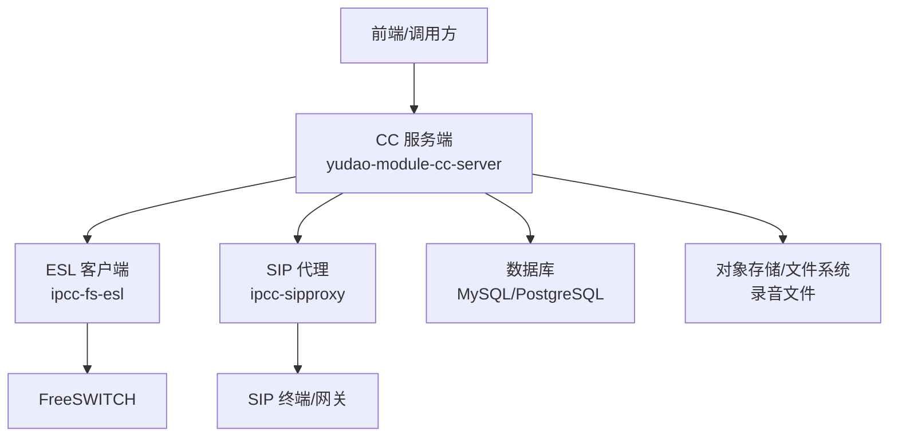
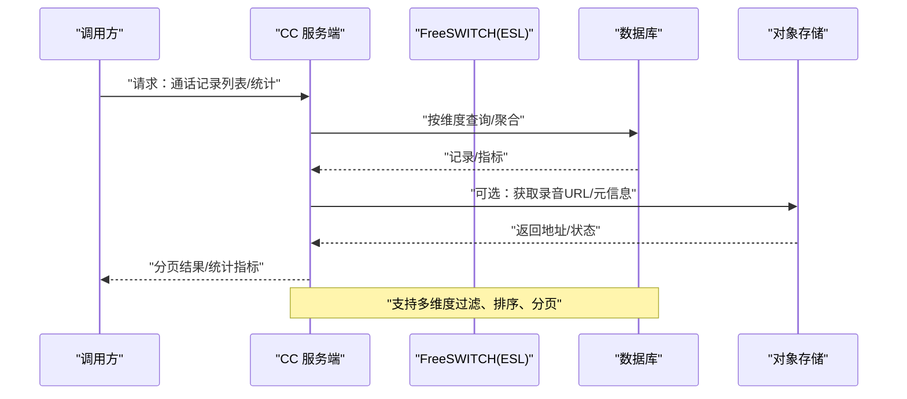
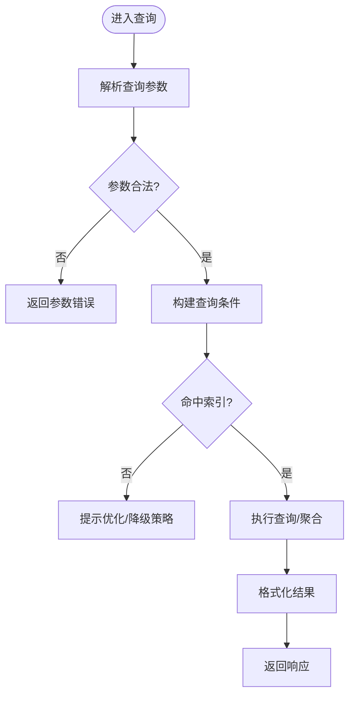
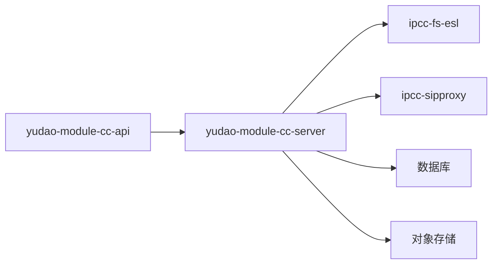

# 通话记录API

<cite>
**本文引用的文件**
- [yudao-module-cc-server/pom.xml](file://yudao-cloud/yudao-module-cc/yudao-module-cc-server/pom.xml)
- [yudao-module-cc-api/pom.xml](file://yudao-cloud/yudao-module-cc/yudao-module-cc-api/pom.xml)
- [ApiConstants.java](file://yudao-cloud/yudao-module-cc/yudao-module-cc-api/src/main/java/cn/iocoder/yudao/module/cc/enums/ApiConstants.java)
- [ErrorCodeConstants.java](file://yudao-cloud/yudao-module-cc/yudao-module-cc-api/src/main/java/cn/iocoder/yudao/module/cc/enums/ErrorCodeConstants.java)
- [CallRouteStatusEnum.java](file://yudao-cloud/yudao-module-cc/yudao-module-cc-api/src/main/java/cn/iocoder/yudao/module/cc/enums/CallRouteStatusEnum.java)
- [SysVoiceTypeEnum.java](file://yudao-cloud/yudao-module-cc/yudao-module-cc-api/src/main/java/cn/iocoder/yudao/module/cc/enums/SysVoiceTypeEnum.java)
- [SysVoiceTtsTypeEnum.java](file://yudao-cloud/yudao-module-cc/yudao-module-cc-api/src/main/java/cn/iocoder/yudao/module/cc/enums/SysVoiceTtsTypeEnum.java)
- [系统数据初始化.sql](file://yudao-cloud/yudao-module-cc/doc/sql/系统数据初始化.sql)
- [autocall_task.sql](file://yudao-cloud/yudao-module-cc/doc/sql/autocall_task.sql)
- [fs-esl-client组件架构设计.md](file://yudao-cloud/yudao-module-cc/ipcc-fs-esl/fs-esl-client组件架构设计.md)
- [sipproxy组件架构设计.md](file://yudao-cloud/yudao-module-cc/ipcc-sipproxy/sipproxy组件架构设计.md)
</cite>

## 目录
1. [简介](#简介)
2. [项目结构](#项目结构)
3. [核心组件](#核心组件)
4. [架构总览](#架构总览)
5. [详细组件分析](#详细组件分析)
6. [依赖关系分析](#依赖关系分析)
7. [性能考虑](#性能考虑)
8. [故障排查指南](#故障排查指南)
9. [结论](#结论)
10. [附录](#附录)

## 简介
本文件为“通话记录管理API”的技术文档，聚焦于通话记录的查询、统计与分析能力，覆盖通话时长统计、通话质量分析、录音文件管理等关键功能。文档同时提供多维度查询条件说明、数据导出与报表生成的高级用法，并给出完整的查询示例与统计分析接口说明，帮助开发者快速集成与扩展。

## 项目结构
呼叫中心模块位于 yudao-module-cc，包含 API 定义与服务实现：
- yudao-module-cc-api：对外暴露的枚举常量、错误码、API 常量等
- yudao-module-cc-server：服务实现（控制器、服务层、数据访问层）
- ipcc-fs-esl：FreeSWITCH ESL 客户端组件，负责事件采集与信令交互
- ipcc-sipproxy：SIP 代理组件，负责会话路由与媒体控制

图表来源
- [fs-esl-client组件架构设计.md](file://yudao-cloud/yudao-module-cc/ipcc-fs-esl/fs-esl-client组件架构设计.md)
- [sipproxy组件架构设计.md](file://yudao-cloud/yudao-module-cc/ipcc-sipproxy/sipproxy组件架构设计.md)

章节来源
- [yudao-module-cc-server/pom.xml](file://yudao-cloud/yudao-module-cc/yudao-module-cc-server/pom.xml)
- [yudao-module-cc-api/pom.xml](file://yudao-cloud/yudao-module-cc/yudao-module-cc-api/pom.xml)

## 核心组件
- 枚举与常量
  - ApiConstants：统一 API 命名空间与版本前缀
  - ErrorCodeConstants：业务错误码定义
  - CallRouteStatusEnum：通话路由状态枚举
  - SysVoiceTypeEnum / SysVoiceTtsTypeEnum：语音与 TTS 类型枚举
- 数据模型与脚本
  - 系统数据初始化 SQL：基础字典、角色权限、默认配置
  - 自动外呼任务 SQL：外呼任务相关表结构与初始数据

章节来源
- [ApiConstants.java](file://yudao-cloud/yudao-module-cc/yudao-module-cc-api/src/main/java/cn/iocoder/yudao/module/cc/enums/ApiConstants.java)
- [ErrorCodeConstants.java](file://yudao-cloud/yudao-module-cc/yudao-module-cc-api/src/main/java/cn/iocoder/yudao/module/cc/enums/ErrorCodeConstants.java)
- [CallRouteStatusEnum.java](file://yudao-cloud/yudao-module-cc/yudao-module-cc-api/src/main/java/cn/iocoder/yudao/module/cc/enums/CallRouteStatusEnum.java)
- [SysVoiceTypeEnum.java](file://yudao-cloud/yudao-module-cc/yudao-module-cc-api/src/main/java/cn/iocoder/yudao/module/cc/enums/SysVoiceTypeEnum.java)
- [SysVoiceTtsTypeEnum.java](file://yudao-cloud/yudao-module-cc/yudao-module-cc-api/src/main/java/cn/iocoder/yudao/module/cc/enums/SysVoiceTtsTypeEnum.java)
- [系统数据初始化.sql](file://yudao-cloud/yudao-module-cc/doc/sql/系统数据初始化.sql)
- [autocall_task.sql](file://yudao-cloud/yudao-module-cc/doc/sql/autocall_task.sql)

## 架构总览
通话记录的生命周期由 SIP 信令与 ESL 事件驱动，经过 CC 服务端聚合后持久化，并提供查询、统计与导出能力。

图表来源
- [fs-esl-client组件架构设计.md](file://yudao-cloud/yudao-module-cc/ipcc-fs-esl/fs-esl-client组件架构设计.md)
- [sipproxy组件架构设计.md](file://yudao-cloud/yudao-module-cc/ipcc-sipproxy/sipproxy组件架构设计.md)

## 详细组件分析

### 通话记录查询接口
- 功能概述
  - 支持按时间范围、主被叫号码、坐席/用户ID、通话方向、通话状态、IVR 节点、渠道、分机号等多维度筛选
  - 支持字段排序、分页、去重与模糊匹配
- 典型参数
  - 时间范围：开始时间、结束时间
  - 号码类：主叫号码、被叫号码、坐席号、分机号
  - 状态类：通话状态、路由状态、是否录音
  - 业务类：渠道、IVR 流程、标签/分组
- 返回结构
  - 分页对象：总数、页码、每页条数、数据列表
  - 列表项：通话ID、主被叫、时长、开始/结束时间、状态、录音URL、标签等
- 使用建议
  - 大时间范围建议拆分查询或增加索引字段
  - 模糊匹配注意性能，优先使用前缀匹配
  - 录音URL按需加载，避免列表过大导致响应慢

章节来源
- [yudao-module-cc-server/pom.xml](file://yudao-cloud/yudao-module-cc/yudao-module-cc-server/pom.xml)
- [系统数据初始化.sql](file://yudao-cloud/yudao-module-cc/doc/sql/系统数据初始化.sql)

### 通话时长统计接口
- 功能概述
  - 按日/周/月、坐席、渠道、团队等维度统计通话时长、次数、接通率、平均时长
  - 支持同比/环比、累计与区间分段统计
- 计算逻辑
  - 通话时长 = 结束时间 - 开始时间（秒）
  - 接通率 = 接通次数 / 总尝试次数
  - 平均时长 = 总时长 / 有效通话次数
- 输出格式
  - 指标卡片：总时长、总次数、接通率、平均时长
  - 时序数据：按天/周的折线/柱状图数据
- 性能优化
  - 预聚合表或物化视图
  - 缓存热点维度（如当日、本周）

章节来源
- [yudao-module-cc-server/pom.xml](file://yudao-cloud/yudao-module-cc/yudao-module-cc-server/pom.xml)

### 通话质量分析接口
- 功能概述
  - 基于MOS、丢包率、抖动、时延、重传率等指标评估通话质量
  - 支持按通话ID、时间段、坐席、渠道进行质量分布与趋势分析
- 数据来源
  - ESL 事件中的 RTP/RTCP 统计
  - SIP 信令中的 QoS 标记
- 输出示例
  - 质量等级分布：优/良/中/差占比
  - 质量趋势：按小时/天的 MOS 均值曲线
  - 问题定位：高丢包/高抖动时段与关联会话

章节来源
- [fs-esl-client组件架构设计.md](file://yudao-cloud/yudao-module-cc/ipcc-fs-esl/fs-esl-client组件架构设计.md)

### 录音文件管理接口
- 功能概述
  - 录音上传、转码、归档、检索、下载、删除
  - 支持按通话ID、时间、坐席、渠道检索录音
  - 支持在线试听、片段截取、水印/加密（可选）
- 存储策略
  - 本地磁盘/对象存储（OSS/S3）
  - 冷热分层：热数据保留期、冷数据归档
- 安全与合规
  - 访问鉴权、防盗链、审计日志
  - 敏感信息脱敏、留存策略

章节来源
- [yudao-module-cc-server/pom.xml](file://yudao-cloud/yudao-module-cc/yudao-module-cc-server/pom.xml)

### 数据导出与报表生成
- 导出能力
  - 通话记录导出：CSV/Excel，支持自定义列
  - 统计报表导出：PDF/图片，支持模板化
  - 异步导出：大数据量采用任务队列+回调通知
- 报表维度
  - 坐席绩效、渠道效果、时段热度、IVR 转化漏斗
- 注意事项
  - 分页导出、流式写入、内存控制
  - 权限校验与审计

章节来源
- [yudao-module-cc-server/pom.xml](file://yudao-cloud/yudao-module-cc/yudao-module-cc-server/pom.xml)

### 多维度查询流程图

图表来源
- [yudao-module-cc-server/pom.xml](file://yudao-cloud/yudao-module-cc/yudao-module-cc-server/pom.xml)

## 依赖关系分析
- 模块内依赖
  - server 依赖 api 的枚举与常量
  - server 依赖 fs-esl 与 sipproxy 组件以采集事件与控制会话
- 外部依赖
  - 数据库：MySQL/PostgreSQL
  - 对象存储：OSS/S3 或本地文件系统
  - 消息队列：用于异步导出与统计任务

图表来源
- [yudao-module-cc-server/pom.xml](file://yudao-cloud/yudao-module-cc/yudao-module-cc-server/pom.xml)
- [yudao-module-cc-api/pom.xml](file://yudao-cloud/yudao-module-cc/yudao-module-cc-api/pom.xml)

章节来源
- [yudao-module-cc-server/pom.xml](file://yudao-cloud/yudao-module-cc/yudao-module-cc-server/pom.xml)
- [yudao-module-cc-api/pom.xml](file://yudao-cloud/yudao-module-cc/yudao-module-cc-api/pom.xml)

## 性能考虑
- 查询性能
  - 合理建索引：时间、号码、状态、坐席ID
  - 限制最大时间跨度与分页大小
  - 使用物化视图/汇总表加速统计
- 并发与吞吐
  - 读写分离、只读副本用于报表
  - 异步处理导出与统计任务
- 存储与IO
  - 录音冷热分层，压缩与去重
  - CDN 分发静态资源
- 监控与告警
  - 接口耗时、错误率、慢查询监控
  - 存储容量与命中率告警

## 故障排查指南
- 常见问题
  - 查询超时：检查索引、SQL 复杂度、网络延迟
  - 录音无法播放：核对存储路径、权限、CDN 配置
  - 统计异常：确认数据源完整性、时间窗口对齐
- 诊断步骤
  - 查看接口日志与链路追踪
  - 核对数据库慢查询与锁等待
  - 验证 ESL 事件上报与 SIP 信令一致性
- 恢复策略
  - 回滚变更、限流降级、扩容资源
  - 清理过期录音与临时文件

章节来源
- [ErrorCodeConstants.java](file://yudao-cloud/yudao-module-cc/yudao-module-cc-api/src/main/java/cn/iocoder/yudao/module/cc/enums/ErrorCodeConstants.java)
- [系统数据初始化.sql](file://yudao-cloud/yudao-module-cc/doc/sql/系统数据初始化.sql)

## 结论
本API围绕通话记录的全生命周期提供查询、统计、分析与导出能力，结合ESL事件与SIP信令，形成完整的数据闭环。通过合理的索引、聚合与异步机制，保障在高并发场景下的稳定与高效。建议在生产环境完善监控、审计与合规策略，确保数据安全与可追溯。

## 附录

### 接口清单与示例（概念性）
- 通话记录查询
  - 方法：GET/POST
  - 路径：/api/cc/v1/call-record/list
  - 参数：时间范围、主被叫、坐席、状态、渠道、IVR、分页
  - 返回：分页数据
- 通话时长统计
  - 方法：GET/POST
  - 路径：/api/cc/v1/statistics/duration
  - 参数：维度（日/周/月）、坐席/渠道/团队、时间范围
  - 返回：指标与时序数据
- 通话质量分析
  - 方法：GET/POST
  - 路径：/api/cc/v1/quality/analysis
  - 参数：时间范围、通话ID、坐席/渠道
  - 返回：质量分布与趋势
- 录音文件管理
  - 上传：POST /api/cc/v1/recording/upload
  - 检索：GET /api/cc/v1/recording/list
  - 下载：GET /api/cc/v1/recording/{id}/download
  - 删除：DELETE /api/cc/v1/recording/{id}

说明：以上为概念性接口定义，实际路径与参数以服务端实现为准。

章节来源
- [ApiConstants.java](file://yudao-cloud/yudao-module-cc/yudao-module-cc-api/src/main/java/cn/iocoder/yudao/module/cc/enums/ApiConstants.java)
- [yudao-module-cc-server/pom.xml](file://yudao-cloud/yudao-module-cc/yudao-module-cc-server/pom.xml)