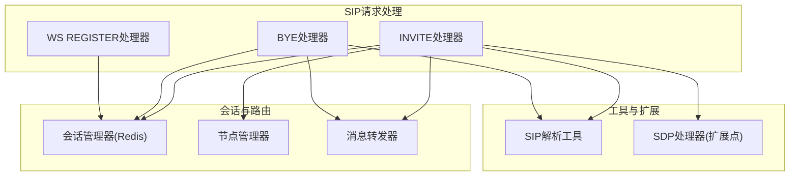
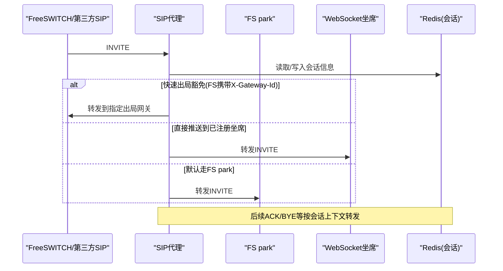
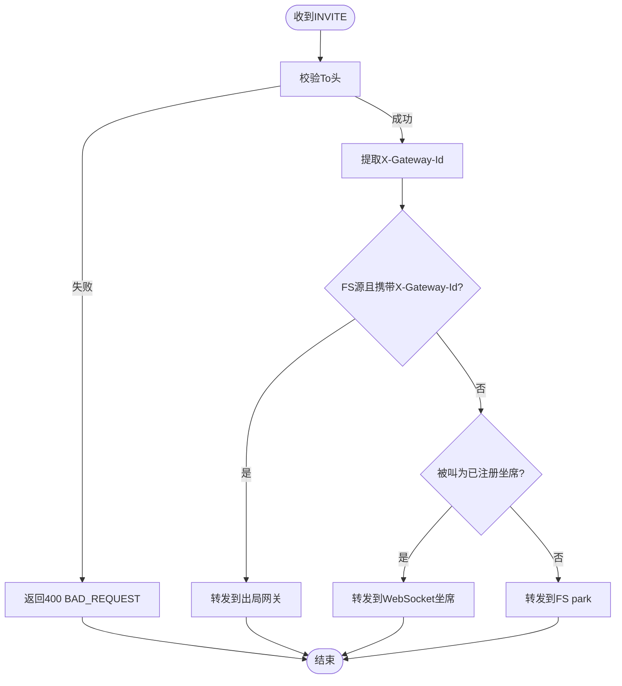
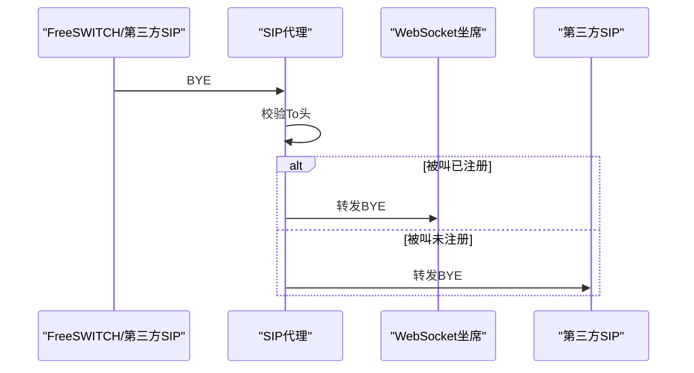
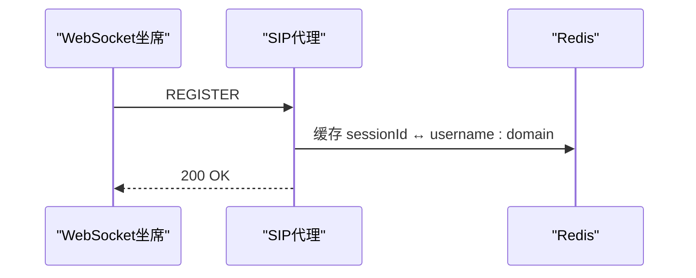
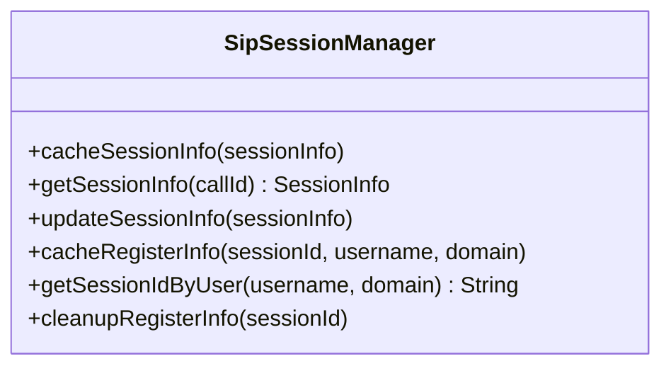
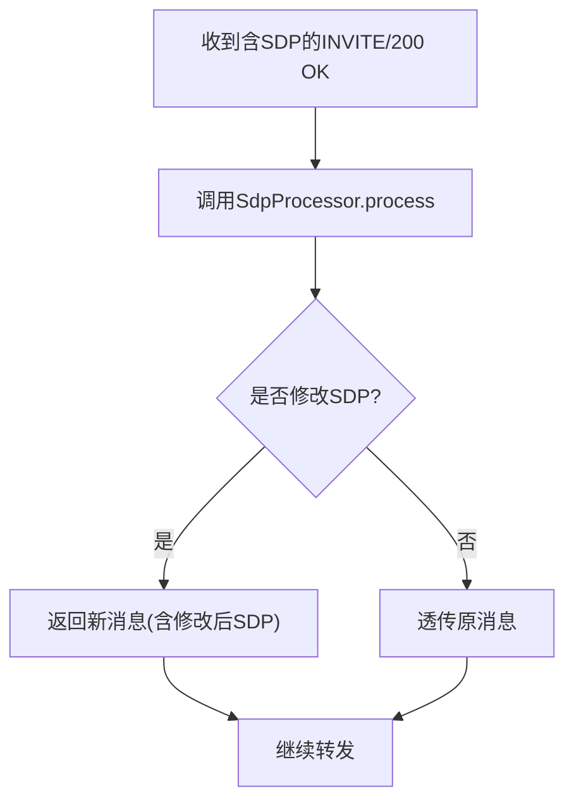
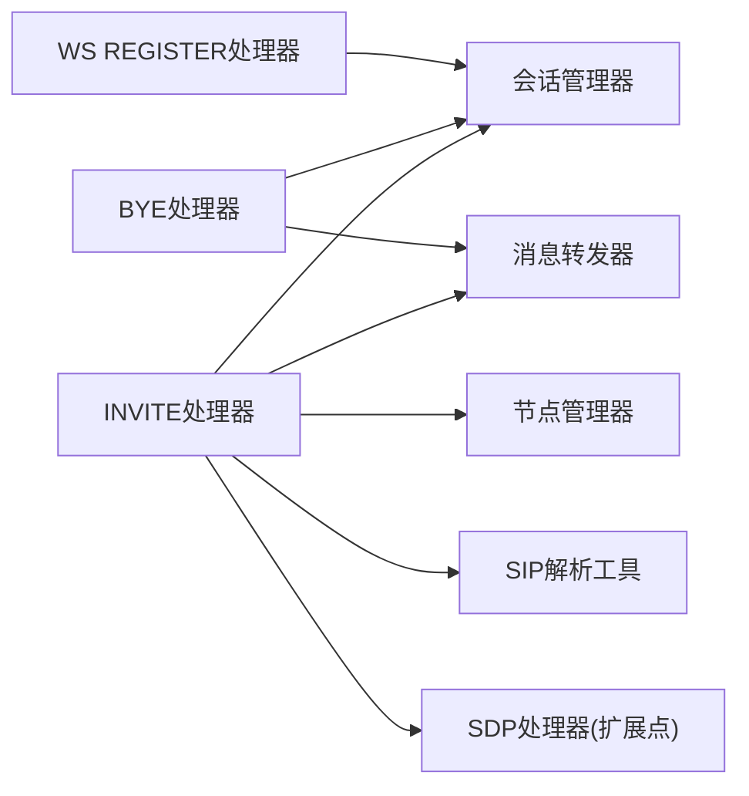

# SIP协议接口

<cite>
**本文引用的文件**
- [SipInviteRequestHandler.java](file://yudao-cloud/yudao-module-cc/ipcc-sipproxy/src/main/java/cn/ipcc/sipproxy/core/handler/request/sip/SipInviteRequestHandler.java)
- [SipByeRequestHandler.java](file://yudao-cloud/yudao-module-cc/ipcc-sipproxy/src/main/java/cn/ipcc/sipproxy/core/handler/request/sip/SipByeRequestHandler.java)
- [AbstractSipRequestHandler.java](file://yudao-cloud/yudao-module-cc/ipcc-sipproxy/src/main/java/cn/ipcc/sipproxy/core/handler/request/sip/AbstractSipRequestHandler.java)
- [SipSessionManager.java](file://yudao-cloud/yudao-module-cc/ipcc-sipproxy/src/main/java/cn/ipcc/sipproxy/core/session/SipSessionManager.java)
- [SdpProcessor.java](file://yudao-cloud/yudao-module-cc/ipcc-sipproxy/src/main/java/cn/ipcc/sipproxy/api/media/SdpProcessor.java)
- [SipAnalysisUtil.java](file://yudao-cloud/yudao-module-cc/ipcc-sipproxy/src/main/java/cn/ipcc/sipproxy/core/utils/SipAnalysisUtil.java)
- [WsRegisterRequestHandler.java](file://yudao-cloud/yudao-module-cc/ipcc-sipproxy/src/main/java/cn/ipcc/sipproxy/core/handler/request/ws/WsRegisterRequestHandler.java)
</cite>

## 目录
1. [简介](#简介)
2. [项目结构](#项目结构)
3. [核心组件](#核心组件)
4. [架构总览](#架构总览)
5. [详细组件分析](#详细组件分析)
6. [依赖关系分析](#依赖关系分析)
7. [性能考量](#性能考量)
8. [故障排查指南](#故障排查指南)
9. [结论](#结论)
10. [附录](#附录)

## 简介
本技术文档面向SIP协议接口，聚焦于SIP消息处理方法、会话状态管理、信令流程与协议扩展。重点覆盖INVITE、BYE、REGISTER等核心方法的处理逻辑，说明SIP头字段解析、SDP协商与媒体流控制要点，并提供调试工具使用指南（Wireshark抓包与协议栈日志查看）、代理配置、路由规则与网络拓扑设计建议。

## 项目结构
本项目在呼叫中心模块中提供SIP代理能力，核心位于sipproxy子模块：
- 请求处理层：按SIP方法拆分处理器（如INVITE、BYE），并支持WebSocket侧的SIP消息处理（如WS注册、WS BYE等）
- 会话管理层：基于Redis缓存会话信息与注册映射，支撑B2BUA场景下的双向转发
- 工具与扩展：SIP消息解析工具、SDP处理扩展点、节点选择与转发器
- 自动装配与默认实现：统一初始化与可插拔默认策略

图表来源
- [SipInviteRequestHandler.java:71-233](file://yudao-cloud/yudao-module-cc/ipcc-sipproxy/src/main/java/cn/ipcc/sipproxy/core/handler/request/sip/SipInviteRequestHandler.java#L71-L233)
- [SipByeRequestHandler.java:54-71](file://yudao-cloud/yudao-module-cc/ipcc-sipproxy/src/main/java/cn/ipcc/sipproxy/core/handler/request/sip/SipByeRequestHandler.java#L54-L71)
- [SipSessionManager.java:35-112](file://yudao-cloud/yudao-module-cc/ipcc-sipproxy/src/main/java/cn/ipcc/sipproxy/core/session/SipSessionManager.java#L35-L112)
- [SipAnalysisUtil.java:224-228](file://yudao-cloud/yudao-module-cc/ipcc-sipproxy/src/main/java/cn/ipcc/sipproxy/core/utils/SipAnalysisUtil.java#L224-L228)
- [SdpProcessor.java:13-22](file://yudao-cloud/yudao-module-cc/ipcc-sipproxy/src/main/java/cn/ipcc/sipproxy/api/media/SdpProcessor.java#L13-L22)

章节来源
- [SipInviteRequestHandler.java:71-233](file://yudao-cloud/yudao-module-cc/ipcc-sipproxy/src/main/java/cn/ipcc/sipproxy/core/handler/request/sip/SipInviteRequestHandler.java#L71-L233)
- [SipByeRequestHandler.java:54-71](file://yudao-cloud/yudao-module-cc/ipcc-sipproxy/src/main/java/cn/ipcc/sipproxy/core/handler/request/sip/SipByeRequestHandler.java#L54-L71)
- [SipSessionManager.java:35-112](file://yudao-cloud/yudao-module-cc/ipcc-sipproxy/src/main/java/cn/ipcc/sipproxy/core/session/SipSessionManager.java#L35-L112)
- [SipAnalysisUtil.java:224-228](file://yudao-cloud/yudao-module-cc/ipcc-sipproxy/src/main/java/cn/ipcc/sipproxy/core/utils/SipAnalysisUtil.java#L224-L228)
- [SdpProcessor.java:13-22](file://yudao-cloud/yudao-module-cc/ipcc-sipproxy/src/main/java/cn/ipcc/sipproxy/api/media/SdpProcessor.java#L13-L22)

## 核心组件
- INVITE请求处理器：负责入局INVITE的路由决策、会话信息创建、快速出局豁免、向FS park或坐席WebSocket转发
- BYE请求处理器：将挂断信令按被叫注册状态转发至WebSocket或第三方SIP
- 抽象SIP请求处理器：提供To头校验、错误响应构造、按注册状态转发的通用能力
- 会话管理器：基于Redis缓存会话信息与注册映射，支撑B2BUA双向转发与会话恢复
- SIP解析工具：封装SIP消息解析、头字段提取、传输协议识别、来源地址端口提取等
- SDP处理器扩展点：允许在转发含SDP的INVITE/200 OK前对媒体描述进行定制修改

章节来源
- [SipInviteRequestHandler.java:71-233](file://yudao-cloud/yudao-module-cc/ipcc-sipproxy/src/main/java/cn/ipcc/sipproxy/core/handler/request/sip/SipInviteRequestHandler.java#L71-L233)
- [SipByeRequestHandler.java:54-71](file://yudao-cloud/yudao-module-cc/ipcc-sipproxy/src/main/java/cn/ipcc/sipproxy/core/handler/request/sip/SipByeRequestHandler.java#L54-L71)
- [AbstractSipRequestHandler.java:48-110](file://yudao-cloud/yudao-module-cc/ipcc-sipproxy/src/main/java/cn/ipcc/sipproxy/core/handler/request/sip/AbstractSipRequestHandler.java#L48-L110)
- [SipSessionManager.java:35-112](file://yudao-cloud/yudao-module-cc/ipcc-sipproxy/src/main/java/cn/ipcc/sipproxy/core/session/SipSessionManager.java#L35-L112)
- [SipAnalysisUtil.java:224-228](file://yudao-cloud/yudao-module-cc/ipcc-sipproxy/src/main/java/cn/ipcc/sipproxy/core/utils/SipAnalysisUtil.java#L224-L228)
- [SdpProcessor.java:13-22](file://yudao-cloud/yudao-module-cc/ipcc-sipproxy/src/main/java/cn/ipcc/sipproxy/api/media/SdpProcessor.java#L13-L22)

## 架构总览
系统采用B2BUA模式，SIP代理作为中间节点协调两端媒体与控制面：
- 控制面：SIP信令经处理器路由到FreeSWITCH或第三方SIP；WebSocket用于Web端坐席接入
- 数据面：媒体流通过FreeSWITCH锚定，必要时可结合ICE/DTLS-SRTP等安全媒体协商
- 会话面：以Call-ID为键，在Redis中维护会话上下文（包括callType、目标节点、WebSocket会话ID等）

图表来源
- [SipInviteRequestHandler.java:142-233](file://yudao-cloud/yudao-module-cc/ipcc-sipproxy/src/main/java/cn/ipcc/sipproxy/core/handler/request/sip/SipInviteRequestHandler.java#L142-L233)
- [SipSessionManager.java:35-112](file://yudao-cloud/yudao-module-cc/ipcc-sipproxy/src/main/java/cn/ipcc/sipproxy/core/session/SipSessionManager.java#L35-L112)

## 详细组件分析

### INVITE处理流程
- 入口设置链路追踪ID（优先复用Call-ID）
- 校验To头（用户与域名）
- 提取X-Gateway-Id（用于快速出局豁免与IVR覆盖项）
- 根据来源(source)与是否携带X-Gateway-Id决定callType（OUTBOUND/INTERNAL/INBOUND）
- 选择内部FS节点或第三方网关节点，并缓存会话信息
- 豁免路径：FS源+携带X-Gateway-Id直接转发到出局网关
- 快速推送：FS源且被叫为已注册JsSIP坐席时，直接转发到WebSocket
- 默认路径：转发到FS park，由ESL处理器执行号码路由匹配与IVR流程

图表来源
- [SipInviteRequestHandler.java:71-233](file://yudao-cloud/yudao-module-cc/ipcc-sipproxy/src/main/java/cn/ipcc/sipproxy/core/handler/request/sip/SipInviteRequestHandler.java#L71-L233)

章节来源
- [SipInviteRequestHandler.java:71-233](file://yudao-cloud/yudao-module-cc/ipcc-sipproxy/src/main/java/cn/ipcc/sipproxy/core/handler/request/sip/SipInviteRequestHandler.java#L71-L233)

### BYE处理流程
- 校验To头完整性
- 按被叫注册状态转发：已注册→WebSocket；未注册→第三方SIP
- 两段BYE协调：本处理器负责“FS→坐席”段；“坐席→FS”段由WS侧处理器处理

图表来源
- [SipByeRequestHandler.java:54-71](file://yudao-cloud/yudao-module-cc/ipcc-sipproxy/src/main/java/cn/ipcc/sipproxy/core/handler/request/sip/SipByeRequestHandler.java#L54-L71)
- [AbstractSipRequestHandler.java:95-110](file://yudao-cloud/yudao-module-cc/ipcc-sipproxy/src/main/java/cn/ipcc/sipproxy/core/handler/request/sip/AbstractSipRequestHandler.java#L95-L110)

章节来源
- [SipByeRequestHandler.java:54-71](file://yudao-cloud/yudao-module-cc/ipcc-sipproxy/src/main/java/cn/ipcc/sipproxy/core/handler/request/sip/SipByeRequestHandler.java#L54-L71)
- [AbstractSipRequestHandler.java:95-110](file://yudao-cloud/yudao-module-cc/ipcc-sipproxy/src/main/java/cn/ipcc/sipproxy/core/handler/request/sip/AbstractSipRequestHandler.java#L95-L110)

### REGISTER处理流程（WebSocket侧）
- WebSocket侧接收REGISTER请求
- 成功后在Redis中缓存sessionId与username:domain的双向映射，供后续INVITE转发查找WebSocket会话
- TTL大于JSIP默认Expires，避免连接存活但缓存过期导致转发失败

图表来源
- [SipSessionManager.java:75-112](file://yudao-cloud/yudao-module-cc/ipcc-sipproxy/src/main/java/cn/ipcc/sipproxy/core/session/SipSessionManager.java#L75-L112)
- [WsRegisterRequestHandler.java](file://yudao-cloud/yudao-module-cc/ipcc-sipproxy/src/main/java/cn/ipcc/sipproxy/core/handler/request/ws/WsRegisterRequestHandler.java)

章节来源
- [SipSessionManager.java:75-112](file://yudao-cloud/yudao-module-cc/ipcc-sipproxy/src/main/java/cn/ipcc/sipproxy/core/session/SipSessionManager.java#L75-L112)
- [WsRegisterRequestHandler.java](file://yudao-cloud/yudao-module-cc/ipcc-sipproxy/src/main/java/cn/ipcc/sipproxy/core/handler/request/ws/WsRegisterRequestHandler.java)

### 会话状态管理
- 以Call-ID为键缓存会话信息（包含callType、目标FS节点、第三方网关节点、WebSocket会话ID等）
- 注册映射：sessionId↔username:domain，便于断开清理与按用户转发
- 更新与清理：会话更新、WebSocket断开时清理注册映射

图表来源
- [SipSessionManager.java:35-154](file://yudao-cloud/yudao-module-cc/ipcc-sipproxy/src/main/java/cn/ipcc/sipproxy/core/session/SipSessionManager.java#L35-L154)

章节来源
- [SipSessionManager.java:35-154](file://yudao-cloud/yudao-module-cc/ipcc-sipproxy/src/main/java/cn/ipcc/sipproxy/core/session/SipSessionManager.java#L35-L154)

### 信令流程与协议扩展
- 头字段解析：From/To/Via/Contact/Authorization等，支持提取用户名、域名、传输协议、来源IP/端口
- 传输协议识别：Via头transport参数，区分UDP/TCP
- SDP协商扩展：在转发含SDP的INVITE/200 OK前调用SdpProcessor.process，支持ICE候选替换、编解码过滤、媒体重定向等

图表来源
- [SdpProcessor.java:13-22](file://yudao-cloud/yudao-module-cc/ipcc-sipproxy/src/main/java/cn/ipcc/sipproxy/api/media/SdpProcessor.java#L13-L22)
- [SipAnalysisUtil.java:598-637](file://yudao-cloud/yudao-module-cc/ipcc-sipproxy/src/main/java/cn/ipcc/sipproxy/core/utils/SipAnalysisUtil.java#L598-L637)

章节来源
- [SdpProcessor.java:13-22](file://yudao-cloud/yudao-module-cc/ipcc-sipproxy/src/main/java/cn/ipcc/sipproxy/api/media/SdpProcessor.java#L13-L22)
- [SipAnalysisUtil.java:598-637](file://yudao-cloud/yudao-module-cc/ipcc-sipproxy/src/main/java/cn/ipcc/sipproxy/core/utils/SipAnalysisUtil.java#L598-L637)

## 依赖关系分析
- 处理器依赖：
  - 会话管理器：读写会话与注册映射
  - 节点管理器：选择FS节点或第三方网关节点
  - 消息转发器：转发到FS、第三方SIP或WebSocket
  - 解析工具：提取头字段、构建响应、识别传输协议
- 扩展点：
  - SdpProcessor：媒体描述自定义处理
  - TraceContext（可选注入）：链路追踪

图表来源
- [SipInviteRequestHandler.java:71-233](file://yudao-cloud/yudao-module-cc/ipcc-sipproxy/src/main/java/cn/ipcc/sipproxy/core/handler/request/sip/SipInviteRequestHandler.java#L71-L233)
- [SipByeRequestHandler.java:54-71](file://yudao-cloud/yudao-module-cc/ipcc-sipproxy/src/main/java/cn/ipcc/sipproxy/core/handler/request/sip/SipByeRequestHandler.java#L54-L71)
- [SipSessionManager.java:35-112](file://yudao-cloud/yudao-module-cc/ipcc-sipproxy/src/main/java/cn/ipcc/sipproxy/core/session/SipSessionManager.java#L35-L112)
- [SdpProcessor.java:13-22](file://yudao-cloud/yudao-module-cc/ipcc-sipproxy/src/main/java/cn/ipcc/sipproxy/api/media/SdpProcessor.java#L13-L22)

章节来源
- [SipInviteRequestHandler.java:71-233](file://yudao-cloud/yudao-module-cc/ipcc-sipproxy/src/main/java/cn/ipcc/sipproxy/core/handler/request/sip/SipInviteRequestHandler.java#L71-L233)
- [SipByeRequestHandler.java:54-71](file://yudao-cloud/yudao-module-cc/ipcc-sipproxy/src/main/java/cn/ipcc/sipproxy/core/handler/request/sip/SipByeRequestHandler.java#L54-L71)
- [SipSessionManager.java:35-112](file://yudao-cloud/yudao-module-cc/ipcc-sipproxy/src/main/java/cn/ipcc/sipproxy/core/session/SipSessionManager.java#L35-L112)
- [SdpProcessor.java:13-22](file://yudao-cloud/yudao-module-cc/ipcc-sipproxy/src/main/java/cn/ipcc/sipproxy/api/media/SdpProcessor.java#L13-L22)

## 性能考量
- 会话缓存：使用Redis存储会话与注册映射，减少内存压力并支持多实例共享
- 快速路径：快速出局豁免与直接推送坐席，降低延迟
- 传输协议：根据Via头识别UDP/TCP，避免不必要的协议转换
- 序列化开销：会话信息JSON序列化/反序列化需关注大对象场景

[本节为通用指导，不直接分析具体文件]

## 故障排查指南
- 常见错误响应：
  - To头不完整：返回400 BAD_REQUEST
  - 无可用FS节点：返回500 SERVER_INTERNAL_ERROR
- 日志定位：
  - 处理器入口与关键分支均有日志输出，便于定位Call-ID与来源
  - 会话缓存异常会记录序列化/反序列化错误
- 调试建议：
  - Wireshark抓包：过滤SIP流量，观察INVITE/200 OK/ACK/BYE序列与SDP内容
  - 协议栈日志：查看SIP解析工具与处理器日志，确认头字段提取与传输协议识别
  - 会话检查：核对Redis中的会话信息与注册映射是否正确

章节来源
- [AbstractSipRequestHandler.java:62-83](file://yudao-cloud/yudao-module-cc/ipcc-sipproxy/src/main/java/cn/ipcc/sipproxy/core/handler/request/sip/AbstractSipRequestHandler.java#L62-L83)
- [SipInviteRequestHandler.java:220-233](file://yudao-cloud/yudao-module-cc/ipcc-sipproxy/src/main/java/cn/ipcc/sipproxy/core/handler/request/sip/SipInviteRequestHandler.java#L220-L233)
- [SipSessionManager.java:35-62](file://yudao-cloud/yudao-module-cc/ipcc-sipproxy/src/main/java/cn/ipcc/sipproxy/core/session/SipSessionManager.java#L35-L62)

## 结论
该SIP代理实现了B2BUA模式下的核心信令处理与媒体协商扩展，具备快速出局、直接推送坐席、会话持久化与注册映射管理能力。通过可扩展的SDP处理器与完善的解析工具，能够灵活适配不同网络环境与媒体需求。建议在部署时结合Wireshark抓包与日志分析，确保信令与媒体流的正确性与稳定性。

[本节为总结性内容，不直接分析具体文件]

## 附录
- SIP头字段解析要点：
  - From/To：主被叫用户与域名提取
  - Via：传输协议、来源IP/端口识别
  - Contact：会话接触点URI
  - Authorization：鉴权头提取
- 媒体协商：
  - 通过SdpProcessor在转发前修改SDP，支持ICE候选替换、编解码过滤、媒体重定向
- 调试工具：
  - Wireshark：过滤SIP协议，观察信令序列与SDP
  - 日志：关注处理器入口、会话缓存、错误响应与异常堆栈

[本节为通用指导，不直接分析具体文件]