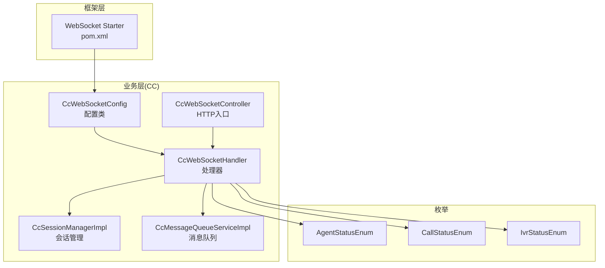
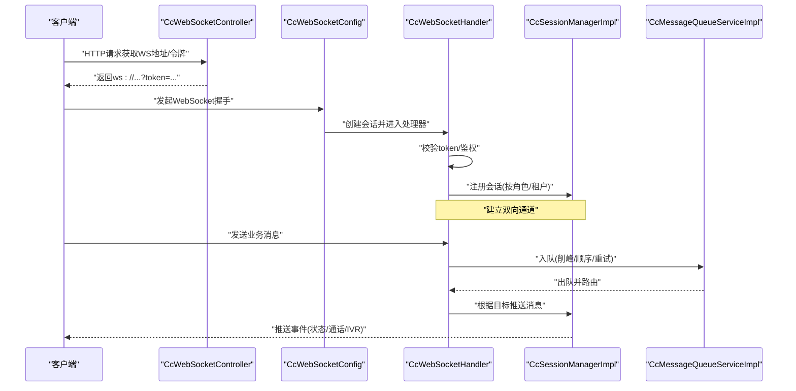
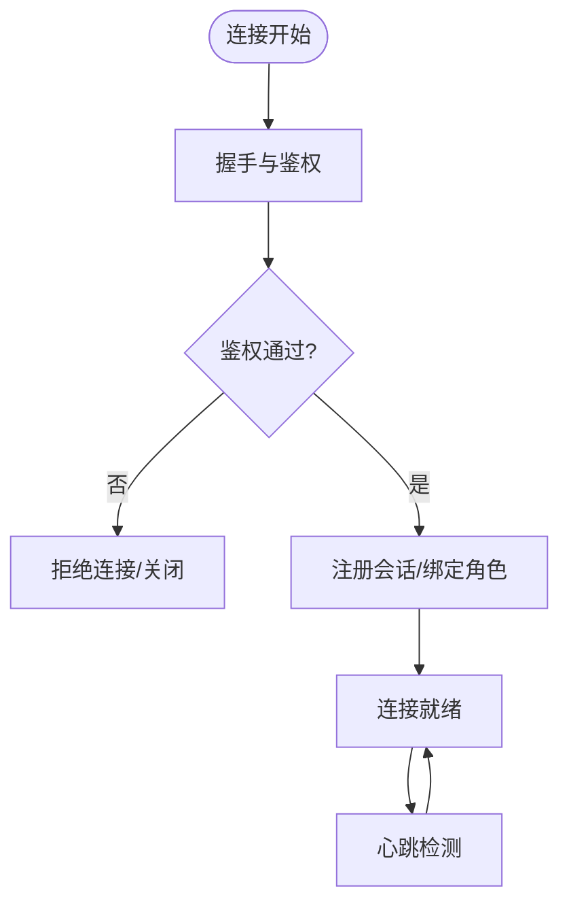
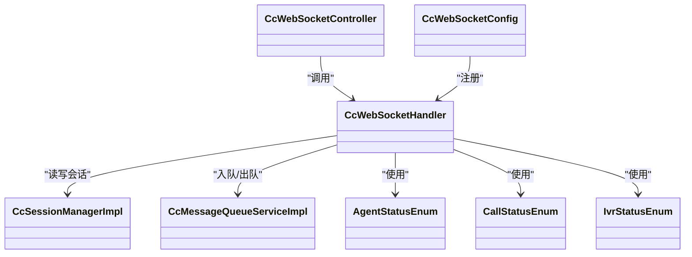

# WebSocket实时接口

<cite>
**本文引用的文件**
- [yudao-framework/yudao-spring-boot-starter-websocket/pom.xml](file://yudao-cloud/yudao-framework/yudao-spring-boot-starter-websocket/pom.xml)
- [yudao-module-cc/yudao-module-cc-server/src/main/java/cn/iocoder/yudao/module/cc/websocket/CcWebSocketHandler.java](file://yudao-cloud/yudao-module-cc/yudao-module-cc-server/src/main/java/cn/iocoder/yudao/module/cc/websocket/CcWebSocketHandler.java)
- [yudao-module-cc/yudao-module-cc-server/src/main/java/cn/iocoder/yudao/module/cc/websocket/CcWebSocketConfig.java](file://yudao-cloud/yudao-module-cc/yudao-module-cc-server/src/main/java/cn/iocoder/yudao/module/cc/websocket/CcWebSocketConfig.java)
- [yudao-module-cc/yudao-module-cc-api/src/main/java/cn/iocoder/yudao/module/cc/enums/AgentStatusEnum.java](file://yudao-cloud/yudao-module-cc/yudao-module-cc-api/src/main/java/cn/iocoder/yudao/module/cc/enums/AgentStatusEnum.java)
- [yudao-module-cc/yudao-module-cc-api/src/main/java/cn/iocoder/yudao/module/cc/enums/CallStatusEnum.java](file://yudao-cloud/yudao-module-cc/yudao-module-cc-api/src/main/java/cn/iocoder/yudao/module/cc/enums/CallStatusEnum.java)
- [yudao-module-cc/yudao-module-cc-api/src/main/java/cn/iocoder/yudao/module/cc/enums/IvrStatusEnum.java](file://yudao-cloud/yudao-module-cc/yudao-module-cc-api/src/main/java/cn/iocoder/yudao/module/cc/enums/IvrStatusEnum.java)
- [yudao-module-cc/yudao-module-cc-server/src/main/java/cn/iocoder/yudao/module/cc/service/impl/CcSessionManagerImpl.java](file://yudao-cloud/yudao-module-cc/yudao-module-cc-server/src/main/java/cn/iocoder/yudao/module/cc/service/impl/CcSessionManagerImpl.java)
- [yudao-module-cc/yudao-module-cc-server/src/main/java/cn/iocoder/yudao/module/cc/service/impl/CcMessageQueueServiceImpl.java](file://yudao-cloud/yudao-module-cc/yudao-module-cc-server/src/main/java/cn/iocoder/yudao/module/cc/service/impl/CcMessageQueueServiceImpl.java)
- [yudao-module-cc/yudao-module-cc-server/src/main/java/cn/iocoder/yudao/module/cc/controller/CcWebSocketController.java](file://yudao-cloud/yudao-module-cc/yudao-module-cc-server/src/main/java/cn/iocoder/yudao/module/cc/controller/CcWebSocketController.java)
</cite>

## 目录
1. [简介](#简介)
2. [项目结构](#项目结构)
3. [核心组件](#核心组件)
4. [架构总览](#架构总览)
5. [详细组件分析](#详细组件分析)
6. [依赖关系分析](#依赖关系分析)
7. [性能考虑](#性能考虑)
8. [故障排查指南](#故障排查指南)
9. [结论](#结论)
10. [附录](#附录)

## 简介
本文件为呼叫中心（CC）模块的WebSocket实时接口文档，覆盖连接建立、认证鉴权、心跳检测、断线重连、消息格式与事件类型、坐席状态同步、通话状态推送、IVR流程执行状态等实时能力。同时提供客户端实现建议（JavaScript与Java）、错误处理策略、消息队列与性能优化技巧，帮助前端或后端集成方快速接入并稳定运行。

## 项目结构
本项目采用模块化架构，WebSocket能力由框架层starter提供基础能力，业务侧在CC模块中实现具体处理器、配置与控制器。关键路径如下：
- 框架层：WebSocket Starter（依赖声明）
- 业务层：CC服务端的WebSocket处理器、配置、会话管理、消息队列、控制器
- 枚举层：坐席状态、通话状态、IVR状态等统一枚举

图表来源
- [yudao-framework/yudao-spring-boot-starter-websocket/pom.xml](file://yudao-cloud/yudao-framework/yudao-spring-boot-starter-websocket/pom.xml)
- [yudao-module-cc/yudao-module-cc-server/src/main/java/cn/iocoder/yudao/module/cc/websocket/CcWebSocketConfig.java](file://yudao-cloud/yudao-module-cc/yudao-module-cc-server/src/main/java/cn/iocoder/yudao/module/cc/websocket/CcWebSocketConfig.java)
- [yudao-module-cc/yudao-module-cc-server/src/main/java/cn/iocoder/yudao/module/cc/websocket/CcWebSocketHandler.java](file://yudao-cloud/yudao-module-cc/yudao-module-cc-server/src/main/java/cn/iocoder/yudao/module/cc/websocket/CcWebSocketHandler.java)
- [yudao-module-cc/yudao-module-cc-server/src/main/java/cn/iocoder/yudao/module/cc/controller/CcWebSocketController.java](file://yudao-cloud/yudao-module-cc/yudao-module-cc-server/src/main/java/cn/iocoder/yudao/module/cc/controller/CcWebSocketController.java)
- [yudao-module-cc/yudao-module-cc-server/src/main/java/cn/iocoder/yudao/module/cc/service/impl/CcSessionManagerImpl.java](file://yudao-cloud/yudao-module-cc/yudao-module-cc-server/src/main/java/cn/iocoder/yudao/module/cc/service/impl/CcSessionManagerImpl.java)
- [yudao-module-cc/yudao-module-cc-server/src/main/java/cn/iocoder/yudao/module/cc/service/impl/CcMessageQueueServiceImpl.java](file://yudao-cloud/yudao-module-cc/yudao-module-cc-server/src/main/java/cn/iocoder/yudao/module/cc/service/impl/CcMessageQueueServiceImpl.java)
- [yudao-module-cc/yudao-module-cc-api/src/main/java/cn/iocoder/yudao/module/cc/enums/AgentStatusEnum.java](file://yudao-cloud/yudao-module-cc/yudao-module-cc-api/src/main/java/cn/iocoder/yudao/module/cc/enums/AgentStatusEnum.java)
- [yudao-module-cc/yudao-module-cc-api/src/main/java/cn/iocoder/yudao/module/cc/enums/CallStatusEnum.java](file://yudao-cloud/yudao-module-cc/yudao-module-cc-api/src/main/java/cn/iocoder/yudao/module/cc/enums/CallStatusEnum.java)
- [yudao-module-cc/yudao-module-cc-api/src/main/java/cn/iocoder/yudao/module/cc/enums/IvrStatusEnum.java](file://yudao-cloud/yudao-module-cc/yudao-module-cc/enums/IvrStatusEnum.java)

章节来源
- [yudao-framework/yudao-spring-boot-starter-websocket/pom.xml](file://yudao-cloud/yudao-framework/yudao-spring-boot-starter-websocket/pom.xml)
- [yudao-module-cc/yudao-module-cc-server/src/main/java/cn/iocoder/yudao/module/cc/websocket/CcWebSocketConfig.java](file://yudao-cloud/yudao-module-cc/yudao-module-cc-server/src/main/java/cn/iocoder/yudao/module/cc/websocket/CcWebSocketConfig.java)
- [yudao-module-cc/yudao-module-cc-server/src/main/java/cn/iocoder/yudao/module/cc/websocket/CcWebSocketHandler.java](file://yudao-cloud/yudao-module-cc/yudao-module-cc-server/src/main/java/cn/iocoder/yudao/module/cc/websocket/CcWebSocketHandler.java)
- [yudao-module-cc/yudao-module-cc-server/src/main/java/cn/iocoder/yudao/module/cc/controller/CcWebSocketController.java](file://yudao-cloud/yudao-module-cc/yudao-module-cc-server/src/main/java/cn/iocoder/yudao/module/cc/controller/CcWebSocketController.java)
- [yudao-module-cc/yudao-module-cc-server/src/main/java/cn/iocoder/yudao/module/cc/service/impl/CcSessionManagerImpl.java](file://yudao-cloud/yudao-module-cc/yudao-module-cc-server/src/main/java/cn/iocoder/yudao/module/cc/service/impl/CcSessionManagerImpl.java)
- [yudao-module-cc/yudao-module-cc-server/src/main/java/cn/iocoder/yudao/module/cc/service/impl/CcMessageQueueServiceImpl.java](file://yudao-cloud/yudao-module-cc/yudao-module-cc-server/src/main/java/cn/iocoder/yudao/module/cc/service/impl/CcMessageQueueServiceImpl.java)
- [yudao-module-cc/yudao-module-cc-api/src/main/java/cn/iocoder/yudao/module/cc/enums/AgentStatusEnum.java](file://yudao-cloud/yudao-module-cc/yudao-module-cc-api/src/main/java/cn/iocoder/yudao/module/cc/enums/AgentStatusEnum.java)
- [yudao-module-cc/yudao-module-cc-api/src/main/java/cn/iocoder/yudao/module/cc/enums/CallStatusEnum.java](file://yudao-cloud/yudao-module-cc/yudao-module-cc-api/src/main/java/cn/iocoder/yudao/module/cc/enums/CallStatusEnum.java)
- [yudao-module-cc/yudao-module-cc-api/src/main/java/cn/iocoder/yudao/module/cc/enums/IvrStatusEnum.java](file://yudao-cloud/yudao-module-cc/yudao-module-cc-api/src/main/java/cn/iocoder/yudao/module/cc/enums/IvrStatusEnum.java)

## 核心组件
- WebSocket配置类：注册端点、拦截器、序列化策略、跨域与超时等。
- WebSocket处理器：负责握手、认证、消息路由、事件广播、心跳保活、异常处理。
- 会话管理器：维护用户/坐席到WebSocket会话的映射，支持按角色订阅与广播。
- 消息队列服务：对高频事件进行削峰填谷、顺序保证与重试。
- HTTP控制器：提供获取WebSocket连接地址、鉴权令牌等辅助接口。
- 枚举定义：坐席状态、通话状态、IVR状态等统一数据字典。

章节来源
- [yudao-module-cc/yudao-module-cc-server/src/main/java/cn/iocoder/yudao/module/cc/websocket/CcWebSocketConfig.java](file://yudao-cloud/yudao-module-cc/yudao-module-cc-server/src/main/java/cn/iocoder/yudao/module/cc/websocket/CcWebSocketConfig.java)
- [yudao-module-cc/yudao-module-cc-server/src/main/java/cn/iocoder/yudao/module/cc/websocket/CcWebSocketHandler.java](file://yudao-cloud/yudao-module-cc/yudao-module-cc-server/src/main/java/cn/iocoder/yudao/module/cc/websocket/CcWebSocketHandler.java)
- [yudao-module-cc/yudao-module-cc-server/src/main/java/cn/iocoder/yudao/module/cc/service/impl/CcSessionManagerImpl.java](file://yudao-cloud/yudao-module-cc/yudao-module-cc-server/src/main/java/cn/iocoder/yudao/module/cc/service/impl/CcSessionManagerImpl.java)
- [yudao-module-cc/yudao-module-cc-server/src/main/java/cn/iocoder/yudao/module/cc/service/impl/CcMessageQueueServiceImpl.java](file://yudao-cloud/yudao-module-cc/yudao-module-cc-server/src/main/java/cn/iocoder/yudao/module/cc/service/impl/CcMessageQueueServiceImpl.java)
- [yudao-module-cc/yudao-module-cc-server/src/main/java/cn/iocoder/yudao/module/cc/controller/CcWebSocketController.java](file://yudao-cloud/yudao-module-cc/yudao-module-cc-server/src/main/java/cn/iocoder/yudao/module/cc/controller/CcWebSocketController.java)
- [yudao-module-cc/yudao-module-cc-api/src/main/java/cn/iocoder/yudao/module/cc/enums/AgentStatusEnum.java](file://yudao-cloud/yudao-module-cc/yudao-module-cc-api/src/main/java/cn/iocoder/yudao/module/cc/enums/AgentStatusEnum.java)
- [yudao-module-cc/yudao-module-cc-api/src/main/java/cn/iocoder/yudao/module/cc/enums/CallStatusEnum.java](file://yudao-cloud/yudao-module-cc/yudao-module-cc-api/src/main/java/cn/iocoder/yudao/module/cc/enums/CallStatusEnum.java)
- [yudao-module-cc/yudao-module-cc-api/src/main/java/cn/iocoder/yudao/module/cc/enums/IvrStatusEnum.java](file://yudao-cloud/yudao-module-cc/yudao-module-cc-api/src/main/java/cn/iocoder/yudao/module/cc/enums/IvrStatusEnum.java)

## 架构总览
下图展示了从客户端连接到服务端处理、再到事件分发与队列落盘的整体流程。

图表来源
- [yudao-module-cc/yudao-module-cc-server/src/main/java/cn/iocoder/yudao/module/cc/controller/CcWebSocketController.java](file://yudao-cloud/yudao-module-cc/yudao-module-cc-server/src/main/java/cn/iocoder/yudao/module/cc/controller/CcWebSocketController.java)
- [yudao-module-cc/yudao-module-cc-server/src/main/java/cn/iocoder/yudao/module/cc/websocket/CcWebSocketConfig.java](file://yudao-cloud/yudao-module-cc/yudao-module-cc-server/src/main/java/cn/iocoder/yudao/module/cc/websocket/CcWebSocketConfig.java)
- [yudao-module-cc/yudao-module-cc-server/src/main/java/cn/iocoder/yudao/module/cc/websocket/CcWebSocketHandler.java](file://yudao-cloud/yudao-module-cc/yudao-module-cc-server/src/main/java/cn/iocoder/yudao/module/cc/websocket/CcWebSocketHandler.java)
- [yudao-module-cc/yudao-module-cc-server/src/main/java/cn/iocoder/yudao/module/cc/service/impl/CcSessionManagerImpl.java](file://yudao-cloud/yudao-module-cc/yudao-module-cc-server/src/main/java/cn/iocoder/yudao/module/cc/service/impl/CcSessionManagerImpl.java)
- [yudao-module-cc/yudao-module-cc-server/src/main/java/cn/iocoder/yudao/module/cc/service/impl/CcMessageQueueServiceImpl.java](file://yudao-cloud/yudao-module-cc/yudao-module-cc-server/src/main/java/cn/iocoder/yudao/module/cc/service/impl/CcMessageQueueServiceImpl.java)

## 详细组件分析

### 连接建立与认证
- 握手阶段：通过配置类注册WebSocket端点，并在处理器中进行鉴权（如校验token）。
- 会话注册：认证成功后将会话加入会话管理器，按角色/租户维度建立订阅关系。
- 首次消息：客户端可主动发送“订阅”或“绑定坐席”消息，服务器据此定向推送。

图表来源
- [yudao-module-cc/yudao-module-cc-server/src/main/java/cn/iocoder/yudao/module/cc/websocket/CcWebSocketConfig.java](file://yudao-cloud/yudao-module-cc/yudao-module-cc-server/src/main/java/cn/iocoder/yudao/module/cc/websocket/CcWebSocketConfig.java)
- [yudao-module-cc/yudao-module-cc-server/src/main/java/cn/iocoder/yudao/module/cc/websocket/CcWebSocketHandler.java](file://yudao-cloud/yudao-module-cc/yudao-module-cc/server/src/main/java/cn/iocoder/yudao/module/cc/websocket/CcWebSocketHandler.java)
- [yudao-module-cc/yudao-module-cc-server/src/main/java/cn/iocoder/yudao/module/cc/service/impl/CcSessionManagerImpl.java](file://yudao-cloud/yudao-module-cc/yudao-module-cc-server/src/main/java/cn/iocoder/yudao/module/cc/service/impl/CcSessionManagerImpl.java)

章节来源
- [yudao-module-cc/yudao-module-cc-server/src/main/java/cn/iocoder/yudao/module/cc/websocket/CcWebSocketConfig.java](file://yudao-cloud/yudao-module-cc/yudao-module-cc-server/src/main/java/cn/iocoder/yudao/module/cc/websocket/CcWebSocketConfig.java)
- [yudao-module-cc/yudao-module-cc-server/src/main/java/cn/iocoder/yudao/module/cc/websocket/CcWebSocketHandler.java](file://yudao-cloud/yudao-module-cc/yudao-module-cc-server/src/main/java/cn/iocoder/yudao/module/cc/websocket/CcWebSocketHandler.java)
- [yudao-module-cc/yudao-module-cc-server/src/main/java/cn/iocoder/yudao/module/cc/service/impl/CcSessionManagerImpl.java](file://yudao-cloud/yudao-module-cc/yudao-module-cc-server/src/main/java/cn/iocoder/yudao/module/cc/service/impl/CcSessionManagerImpl.java)

### 消息格式与事件类型
- 通用消息体包含：消息类型、时间戳、来源/目标标识、业务数据载荷。
- 事件类型（示例）：
  - 坐席状态变更：上线/离线、忙碌/空闲等，使用坐席状态枚举。
  - 通话状态推送：呼入/呼出、振铃、接通、挂断、转接等，使用通话状态枚举。
  - IVR流程状态：进入节点、按键输入、播放提示音、结束等，使用IVR状态枚举。
- 订阅机制：客户端可在连接后发送订阅消息，指定接收的事件类别或目标ID。

章节来源
- [yudao-module-cc/yudao-module-cc-api/src/main/java/cn/iocoder/yudao/module/cc/enums/AgentStatusEnum.java](file://yudao-cloud/yudao-module-cc/yudao-module-cc-api/src/main/java/cn/iocoder/yudao/module/cc/enums/AgentStatusEnum.java)
- [yudao-module-cc/yudao-module-cc-api/src/main/java/cn/iocoder/yudao/module/cc/enums/CallStatusEnum.java](file://yudao-cloud/yudao-module-cc/yudao-module-cc-api/src/main/java/cn/iocoder/yudao/module/cc/enums/CallStatusEnum.java)
- [yudao-module-cc/yudao-module-cc-api/src/main/java/cn/iocoder/yudao/module/cc/enums/IvrStatusEnum.java](file://yudao-cloud/yudao-module-cc/yudao-module-cc-api/src/main/java/cn/iocoder/yudao/module/cc/enums/IvrStatusEnum.java)
- [yudao-module-cc/yudao-module-cc-server/src/main/java/cn/iocoder/yudao/module/cc/websocket/CcWebSocketHandler.java](file://yudao-cloud/yudao-module-cc/yudao-module-cc-server/src/main/java/cn/iocoder/yudao/module/cc/websocket/CcWebSocketHandler.java)

### 实时交互模式
- 单向推送：服务器向客户端推送坐席状态、通话状态、IVR事件。
- 双向通信：客户端可发送控制指令（如接听、挂断、转接、IVR操作），经队列处理后下发至媒体或IVR系统。
- 分组广播：按团队/技能组广播公告或批量指令。

章节来源
- [yudao-module-cc/yudao-module-cc-server/src/main/java/cn/iocoder/yudao/module/cc/websocket/CcWebSocketHandler.java](file://yudao-cloud/yudao-module-cc/yudao-module-cc-server/src/main/java/cn/iocoder/yudao/module/cc/websocket/CcWebSocketHandler.java)
- [yudao-module-cc/yudao-module-cc-server/src/main/java/cn/iocoder/yudao/module/cc/service/impl/CcSessionManagerImpl.java](file://yudao-cloud/yudao-module-cc/yudao-module-cc-server/src/main/java/cn/iocoder/yudao/module/cc/service/impl/CcSessionManagerImpl.java)

### 心跳检测与断线重连
- 心跳：服务端周期性发送心跳帧；客户端需定时回复，超时则判定断开。
- 断线重连：客户端实现指数退避重连，避免雪崩；重连时重新鉴权并恢复订阅。
- 幂等性：重连后可能补发未确认的关键事件，确保一致性。

章节来源
- [yudao-module-cc/yudao-module-cc-server/src/main/java/cn/iocoder/yudao/module/cc/websocket/CcWebSocketHandler.java](file://yudao-cloud/yudao-module-cc/yudao-module-cc-server/src/main/java/cn/iocoder/yudao/module/cc/websocket/CcWebSocketHandler.java)
- [yudao-module-cc/yudao-module-cc-server/src/main/java/cn/iocoder/yudao/module/cc/websocket/CcWebSocketConfig.java](file://yudao-cloud/yudao-module-cc/yudao-module-cc-server/src/main/java/cn/iocoder/yudao/module/cc/websocket/CcWebSocketConfig.java)

### 会话管理与消息队列
- 会话管理：维护用户/坐席与会话的映射，支持按角色/租户隔离与定向推送。
- 消息队列：对高频事件进行缓冲、排序与重试，降低瞬时压力，保障可靠性。

章节来源
- [yudao-module-cc/yudao-module-cc-server/src/main/java/cn/iocoder/yudao/module/cc/service/impl/CcSessionManagerImpl.java](file://yudao-cloud/yudao-module-cc/yudao-module-cc-server/src/main/java/cn/iocoder/yudao/module/cc/service/impl/CcSessionManagerImpl.java)
- [yudao-module-cc/yudao-module-cc-server/src/main/java/cn/iocoder/yudao/module/cc/service/impl/CcMessageQueueServiceImpl.java](file://yudao-cloud/yudao-module-cc/yudao-module-cc-server/src/main/java/cn/iocoder/yudao/module/cc/service/impl/CcMessageQueueServiceImpl.java)

### HTTP辅助接口
- 提供获取WebSocket连接地址、生成临时令牌等接口，便于前端安全地建立连接。

章节来源
- [yudao-module-cc/yudao-module-cc-server/src/main/java/cn/iocoder/yudao/module/cc/controller/CcWebSocketController.java](file://yudao-cloud/yudao-module-cc/yudao-module-cc-server/src/main/java/cn/iocoder/yudao/module/cc/controller/CcWebSocketController.java)

## 依赖关系分析
- 组件耦合：处理器依赖配置、会话管理与消息队列；控制器仅暴露HTTP入口。
- 外部依赖：框架WebSocket Starter提供底层传输能力；枚举提供统一数据字典。

图表来源
- [yudao-module-cc/yudao-module-cc-server/src/main/java/cn/iocoder/yudao/module/cc/websocket/CcWebSocketConfig.java](file://yudao-cloud/yudao-module-cc/yudao-module-cc-server/src/main/java/cn/iocoder/yudao/module/cc/websocket/CcWebSocketConfig.java)
- [yudao-module-cc/yudao-module-cc-server/src/main/java/cn/iocoder/yudao/module/cc/websocket/CcWebSocketHandler.java](file://yudao-cloud/yudao-module-cc/yudao-module-cc-server/src/main/java/cn/iocoder/yudao/module/cc/websocket/CcWebSocketHandler.java)
- [yudao-module-cc/yudao-module-cc-server/src/main/java/cn/iocoder/yudao/module/cc/service/impl/CcSessionManagerImpl.java](file://yudao-cloud/yudao-module-cc/yudao-module-cc-server/src/main/java/cn/iocoder/yudao/module/cc/service/impl/CcSessionManagerImpl.java)
- [yudao-module-cc/yudao-module-cc-server/src/main/java/cn/iocoder/yudao/module/cc/service/impl/CcMessageQueueServiceImpl.java](file://yudao-cloud/yudao-module-cc/yudao-module-cc-server/src/main/java/cn/iocoder/yudao/module/cc/service/impl/CcMessageQueueServiceImpl.java)
- [yudao-module-cc/yudao-module-cc-server/src/main/java/cn/iocoder/yudao/module/cc/controller/CcWebSocketController.java](file://yudao-cloud/yudao-module-cc/yudao-module-cc-server/src/main/java/cn/iocoder/yudao/module/cc/controller/CcWebSocketController.java)
- [yudao-module-cc/yudao-module-cc-api/src/main/java/cn/iocoder/yudao/module/cc/enums/AgentStatusEnum.java](file://yudao-cloud/yudao-module-cc/yudao-module-cc-api/src/main/java/cn/iocoder/yudao/module/cc/enums/AgentStatusEnum.java)
- [yudao-module-cc/yudao-module-cc-api/src/main/java/cn/iocoder/yudao/module/cc/enums/CallStatusEnum.java](file://yudao-cloud/yudao-module-cc/yudao-module-cc-api/src/main/java/cn/iocoder/yudao/module/cc/enums/CallStatusEnum.java)
- [yudao-module-cc/yudao-module-cc-api/src/main/java/cn/iocoder/yudao/module/cc/enums/IvrStatusEnum.java](file://yudao-cloud/yudao-module-cc/yudao-module-cc-api/src/main/java/cn/iocoder/yudao/module/cc/enums/IvrStatusEnum.java)

章节来源
- [yudao-module-cc/yudao-module-cc-server/src/main/java/cn/iocoder/yudao/module/cc/websocket/CcWebSocketConfig.java](file://yudao-cloud/yudao-module-cc/yudao-module-cc-server/src/main/java/cn/iocoder/yudao/module/cc/websocket/CcWebSocketConfig.java)
- [yudao-module-cc/yudao-module-cc-server/src/main/java/cn/iocoder/yudao/module/cc/websocket/CcWebSocketHandler.java](file://yudao-cloud/yudao-module-cc/yudao-module-cc-server/src/main/java/cn/iocoder/yudao/module/cc/websocket/CcWebSocketHandler.java)
- [yudao-module-cc/yudao-module-cc-server/src/main/java/cn/iocoder/yudao/module/cc/service/impl/CcSessionManagerImpl.java](file://yudao-cloud/yudao-module-cc/yudao-module-cc-server/src/main/java/cn/iocoder/yudao/module/cc/service/impl/CcSessionManagerImpl.java)
- [yudao-module-cc/yudao-module-cc-server/src/main/java/cn/iocoder/yudao/module/cc/service/impl/CcMessageQueueServiceImpl.java](file://yudao-cloud/yudao-module-cc/yudao-module-cc-server/src/main/java/cn/iocoder/yudao/module/cc/service/impl/CcMessageQueueServiceImpl.java)
- [yudao-module-cc/yudao-module-cc-server/src/main/java/cn/iocoder/yudao/module/cc/controller/CcWebSocketController.java](file://yudao-cloud/yudao-module-cc/yudao-module-cc-server/src/main/java/cn/iocoder/yudao/module/cc/controller/CcWebSocketController.java)
- [yudao-module-cc/yudao-module-cc-api/src/main/java/cn/iocoder/yudao/module/cc/enums/AgentStatusEnum.java](file://yudao-cloud/yudao-module-cc/yudao-module-cc-api/src/main/java/cn/iocoder/yudao/module/cc/enums/AgentStatusEnum.java)
- [yudao-module-cc/yudao-module-cc-api/src/main/java/cn/iocoder/yudao/module/cc/enums/CallStatusEnum.java](file://yudao-cloud/yudao-module-cc/yudao-module-cc-api/src/main/java/cn/iocoder/yudao/module/cc/enums/CallStatusEnum.java)
- [yudao-module-cc/yudao-module-cc-api/src/main/java/cn/iocoder/yudao/module/cc/enums/IvrStatusEnum.java](file://yudao-cloud/yudao-module-cc/yudao-module-cc-api/src/main/java/cn/iocoder/yudao/module/cc/enums/IvrStatusEnum.java)

## 性能考虑
- 连接复用与长连接：避免频繁握手，减少CPU与网络开销。
- 心跳间隔调优：根据网络质量与服务端负载动态调整。
- 消息批量化：合并小消息，降低序列化与传输成本。
- 队列容量与背压：合理设置队列大小与丢弃策略，防止内存溢出。
- 广播范围控制：精准订阅与分片广播，避免全量推送造成拥塞。
- 序列化选择：优先使用轻量级二进制或紧凑JSON。

[本节为通用指导，不直接分析具体文件]

## 故障排查指南
- 连接失败：检查HTTP辅助接口是否可用、token是否有效、跨域与端口配置。
- 鉴权失败：核对token生成与校验逻辑、过期策略。
- 无消息推送：确认订阅是否正确、会话是否在管理器中、队列是否阻塞。
- 心跳超时：检查客户端心跳实现与服务端超时阈值。
- 断线重连风暴：启用指数退避与抖动，限制最大重试次数。
- 日志定位：结合处理器与队列日志，追踪消息入队/出队与投递结果。

章节来源
- [yudao-module-cc/yudao-module-cc-server/src/main/java/cn/iocoder/yudao/module/cc/websocket/CcWebSocketHandler.java](file://yudao-cloud/yudao-module-cc/yudao-module-cc-server/src/main/java/cn/iocoder/yudao/module/cc/websocket/CcWebSocketHandler.java)
- [yudao-module-cc/yudao-module-cc-server/src/main/java/cn/iocoder/yudao/module/cc/service/impl/CcMessageQueueServiceImpl.java](file://yudao-cloud/yudao-module-cc/yudao-module-cc-server/src/main/java/cn/iocoder/yudao/module/cc/service/impl/CcMessageQueueServiceImpl.java)
- [yudao-module-cc/yudao-module-cc-server/src/main/java/cn/iocoder/yudao/module/cc/controller/CcWebSocketController.java](file://yudao-cloud/yudao-module-cc/yudao-module-cc-server/src/main/java/cn/iocoder/yudao/module/cc/controller/CcWebSocketController.java)

## 结论
本WebSocket实时接口以框架starter为基础，在CC模块中实现了完整的连接管理、鉴权、会话与队列能力，并通过统一枚举规范了事件语义。配合合理的客户端实现与性能调优，可满足呼叫中心场景下的高并发、低延迟与高可靠要求。

[本节为总结性内容，不直接分析具体文件]

## 附录

### 客户端实现要点（JavaScript）
- 连接建立：通过HTTP接口获取ws地址与token，再建立WebSocket连接。
- 鉴权与订阅：连接成功后发送鉴权与订阅消息，指定事件类型或目标。
- 心跳：定时发送ping，服务端pong；超时则触发重连。
- 断线重连：指数退避+最大重试；重连后恢复订阅。
- 消息处理：按消息类型分发到对应回调，更新UI状态。

[本节为通用指导，不直接分析具体文件]

### 客户端实现要点（Java）
- 使用WebSocket客户端库建立连接，携带token参数。
- 实现监听器处理onOpen/onMessage/onClose/onError。
- 实现心跳线程与重连策略，保持连接健康。
- 将收到的事件转换为领域模型，驱动业务逻辑。

[本节为通用指导，不直接分析具体文件]

### 错误码与异常处理
- 鉴权错误：返回明确错误码与原因，客户端据此提示或重试。
- 业务错误：在消息体中包含错误码与详情，便于前端展示。
- 系统异常：记录堆栈与上下文，避免泄露敏感信息。

章节来源
- [yudao-module-cc/yudao-module-cc-server/src/main/java/cn/iocoder/yudao/module/cc/websocket/CcWebSocketHandler.java](file://yudao-cloud/yudao-module-cc/yudao-module-cc-server/src/main/java/cn/iocoder/yudao/module/cc/websocket/CcWebSocketHandler.java)