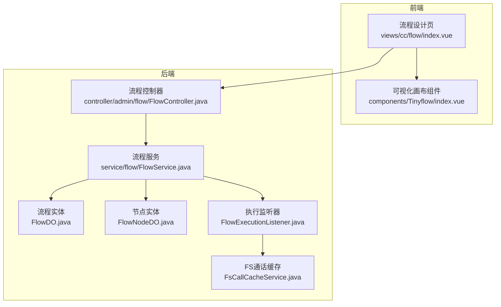
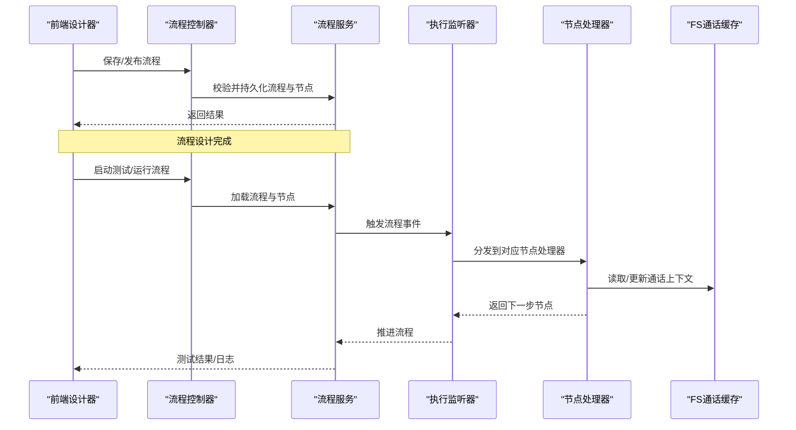
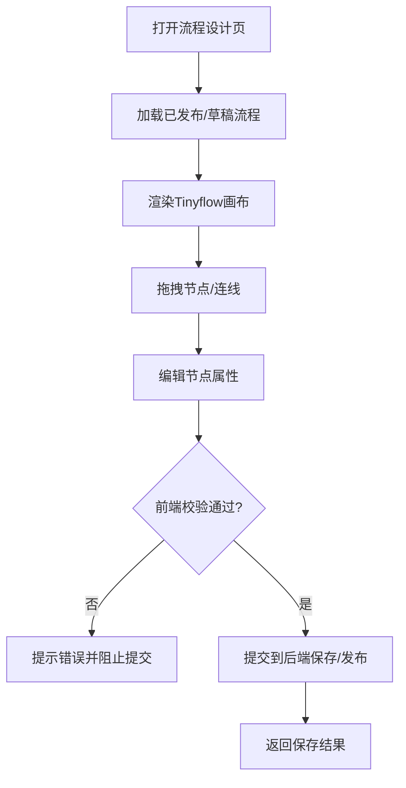
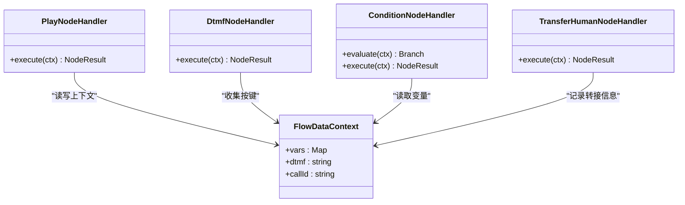
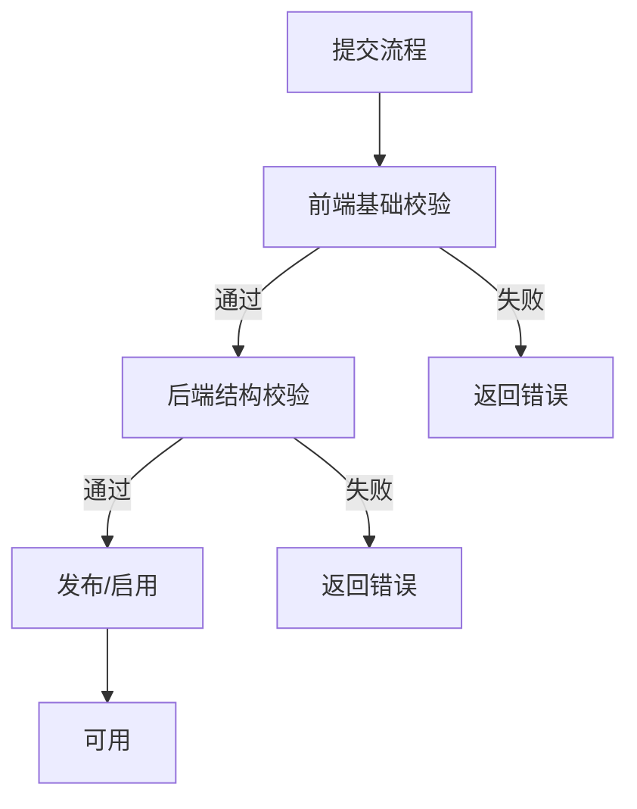
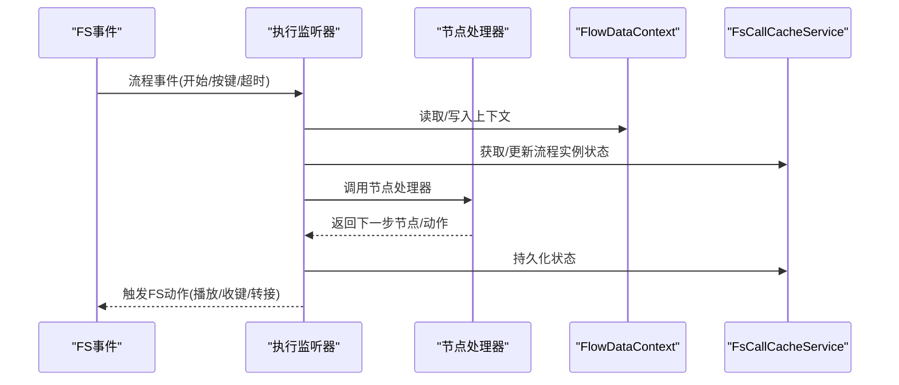
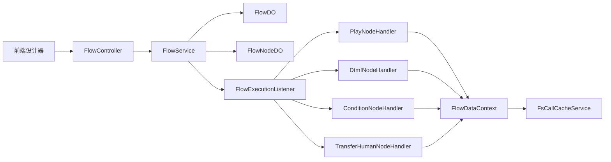

# IVR流程系统

<cite>
**本文引用的文件**
- [yudao-module-cc-server/.../controller/admin/flow/FlowController.java](file://yudao-cloud/yudao-module-cc/yudao-module-cc-server/src/main/java/cn/iocoder/yudao/module/cc/controller/admin/flow/FlowController.java)
- [yudao-module-cc-server/.../service/flow/FlowService.java](file://yudao-cloud/yudao-module-cc/yudao-module-cc-server/src/main/java/cn/iocoder/yudao/module/cc/service/flow/FlowService.java)
- [yudao-module-cc-server/.../dal/dataobject/flow/FlowNodeDO.java](file://yudao-cloud/yudao-module-cc/yudao-module-cc-server/src/main/java/cn/iocoder/yudao/module/cc/dal/dataobject/flow/FlowNodeDO.java)
- [yudao-module-cc-server/.../dal/dataobject/flow/FlowDO.java](file://yudao-cloud/yudao-module-cc/yudao-module-cc-server/src/main/java/cn/iocoder/yudao/module/cc/dal/dataobject/flow/FlowDO.java)
- [yudao-module-cc-server/.../ivr/handler/node/PlayNodeHandler.java](file://yudao-cloud/yudao-module-cc/yudao-module-cc-server/src/main/java/cn/iocoder/yudao/module/cc/ivr/handler/node/PlayNodeHandler.java)
- [yudao-module-cc-server/.../ivr/handler/node/DtmfNodeHandler.java](file://yudao-cloud/yudao-module-cc/yudao-module-cc-server/src/main/java/cn/iocoder/yudao/module/cc/ivr/handler/node/DtmfNodeHandler.java)
- [yudao-module-cc-server/.../ivr/handler/node/ConditionNodeHandler.java](file://yudao-cloud/yudao-module-cc/yudao-module-cc-server/src/main/java/cn/iocoder/yudao/module/cc/ivr/handler/node/ConditionNodeHandler.java)
- [yudao-module-cc-server/.../ivr/handler/node/TransferHumanNodeHandler.java](file://yudao-cloud/yudao-module-cc/yudao-module-cc-server/src/main/java/cn/iocoder/yudao/module/cc/ivr/handler/node/TransferHumanNodeHandler.java)
- [yudao-module-cc-server/.../ivr/listener/FlowExecutionListener.java](file://yudao-cloud/yudao-module-cc/yudao-module-cc-server/src/main/java/cn/iocoder/yudao/module/cc/ivr/listener/FlowExecutionListener.java)
- [yudao-module-cc-server/.../esl/dto/FlowDataContext.java](file://yudao-cloud/yudao-module-cc/yudao-module-cc-server/src/main/java/cn/iocoder/yudao/module/cc/esl/dto/FlowDataContext.java)
- [yudao-module-cc-server/.../esl/enums/FlowEventTypeEnum.java](file://yudao-cloud/yudao-module-cc/yudao-module-cc-server/src/main/java/cn/iocoder/yudao/module/cc/esl/enums/FlowEventTypeEnum.java)
- [yudao-module-cc-server/.../service/fs/FsCallCacheService.java](file://yudao-cloud/yudao-module-cc/yudao-module-cc-server/src/main/java/cn/iocoder/yudao/module/cc/service/fs/FsCallCacheService.java)
- [yudao-ui-admin-vue3/src/views/cc/flow/index.vue](file://yudao-ui-admin-vue3/src/views/cc/flow/index.vue)
- [yudao-ui-admin-vue3/src/components/Tinyflow/index.vue](file://yudao-ui-admin-vue3/src/components/Tinyflow/index.vue)
</cite>

## 目录
1. [简介](#简介)
2. [项目结构](#项目结构)
3. [核心组件](#核心组件)
4. [架构总览](#架构总览)
5. [详细组件分析](#详细组件分析)
6. [依赖关系分析](#依赖关系分析)
7. [性能考虑](#性能考虑)
8. [故障排查指南](#故障排查指南)
9. [结论](#结论)
10. [附录](#附录)

## 简介
本文件面向IVR（交互式语音应答）流程系统的实现与使用，覆盖可视化拖拽编辑器的原理、节点类型定义、流程验证机制、执行引擎与状态管理、前后端设计器与测试能力，以及自定义节点开发指导。文档以代码级事实为依据，结合流程图与时序图帮助读者快速理解并扩展系统。

## 项目结构
IVR相关能力主要分布在后端模块 yudao-module-cc-server 的 ivr、esl、service/flow、controller/admin/flow 等包中；前端设计器位于 yudao-ui-admin-vue3 的 cc/flow 页面与 Tinyflow 组件。

图表来源
- [yudao-ui-admin-vue3/src/views/cc/flow/index.vue](file://yudao-ui-admin-vue3/src/views/cc/flow/index.vue)
- [yudao-ui-admin-vue3/src/components/Tinyflow/index.vue](file://yudao-ui-admin-vue3/src/components/Tinyflow/index.vue)
- [yudao-module-cc-server/.../controller/admin/flow/FlowController.java](file://yudao-cloud/yudao-module-cc/yudao-module-cc-server/src/main/java/cn/iocoder/yudao/module/cc/controller/admin/flow/FlowController.java)
- [yudao-module-cc-server/.../service/flow/FlowService.java](file://yudao-cloud/yudao-module-cc/yudao-module-cc-server/src/main/java/cn/iocoder/yudao/module/cc/service/flow/FlowService.java)
- [yudao-module-cc-server/.../dal/dataobject/flow/FlowDO.java](file://yudao-cloud/yudao-module-cc/yudao-module-cc-server/src/main/java/cn/iocoder/yudao/module/cc/dal/dataobject/flow/FlowDO.java)
- [yudao-module-cc-server/.../dal/dataobject/flow/FlowNodeDO.java](file://yudao-cloud/yudao-module-cc/yudao-module-cc-server/src/main/java/cn/iocoder/yudao/module/cc/dal/dataobject/flow/FlowNodeDO.java)
- [yudao-module-cc-server/.../ivr/listener/FlowExecutionListener.java](file://yudao-cloud/yudao-module-cc/yudao-module-cc-server/src/main/java/cn/iocoder/yudao/module/cc/ivr/listener/FlowExecutionListener.java)
- [yudao-module-cc-server/.../service/fs/FsCallCacheService.java](file://yudao-cloud/yudao-module-cc/yudao-module-cc-server/src/main/java/cn/iocoder/yudao/module/cc/service/fs/FsCallCacheService.java)

章节来源
- [yudao-module-cc-server/.../controller/admin/flow/FlowController.java](file://yudao-cloud/yudao-module-cc/yudao-module-cc-server/src/main/java/cn/iocoder/yudao/module/cc/controller/admin/flow/FlowController.java)
- [yudao-module-cc-server/.../service/flow/FlowService.java](file://yudao-cloud/yudao-module-cc/yudao-module-cc-server/src/main/java/cn/iocoder/yudao/module/cc/service/flow/FlowService.java)
- [yudao-module-cc-server/.../dal/dataobject/flow/FlowDO.java](file://yudao-cloud/yudao-module-cc/yudao-module-cc-server/src/main/java/cn/iocoder/yudao/module/cc/dal/dataobject/flow/FlowDO.java)
- [yudao-module-cc-server/.../dal/dataobject/flow/FlowNodeDO.java](file://yudao-cloud/yudao-module-cc/yudao-module-cc-server/src/main/java/cn/iocoder/yudao/module/cc/dal/dataobject/flow/FlowNodeDO.java)
- [yudao-ui-admin-vue3/src/views/cc/flow/index.vue](file://yudao-ui-admin-vue3/src/views/cc/flow/index.vue)
- [yudao-ui-admin-vue3/src/components/Tinyflow/index.vue](file://yudao-ui-admin-vue3/src/components/Tinyflow/index.vue)

## 核心组件
- 流程数据模型：流程 FlowDO 与节点 FlowNodeDO，用于持久化流程拓扑与节点配置。
- 流程服务：FlowService 提供流程的创建、更新、校验、发布与查询能力。
- 流程控制器：FlowController 暴露管理端API，供前端设计器调用。
- 执行监听器：FlowExecutionListener 在流程事件生命周期中触发节点处理逻辑。
- 通话上下文：FlowDataContext 承载一次通话过程中的变量、按键、Dialplan参数等。
- FS缓存：FsCallCacheService 维护通话与流程实例的映射及运行时状态。

章节来源
- [yudao-module-cc-server/.../dal/dataobject/flow/FlowDO.java](file://yudao-cloud/yudao-module-cc/yudao-module-cc-server/src/main/java/cn/iocoder/yudao/module/cc/dal/dataobject/flow/FlowDO.java)
- [yudao-module-cc-server/.../dal/dataobject/flow/FlowNodeDO.java](file://yudao-cloud/yudao-module-cc/yudao-module-cc-server/src/main/java/cn/iocoder/yudao/module/cc/dal/dataobject/flow/FlowNodeDO.java)
- [yudao-module-cc-server/.../service/flow/FlowService.java](file://yudao-cloud/yudao-module-cc/yudao-module-cc-server/src/main/java/cn/iocoder/yudao/module/cc/service/flow/FlowService.java)
- [yudao-module-cc-server/.../controller/admin/flow/FlowController.java](file://yudao-cloud/yudao-module-cc/yudao-module-cc-server/src/main/java/cn/iocoder/yudao/module/cc/controller/admin/flow/FlowController.java)
- [yudao-module-cc-server/.../ivr/listener/FlowExecutionListener.java](file://yudao-cloud/yudao-module-cc/yudao-module-cc-server/src/main/java/cn/iocoder/yudao/module/cc/ivr/listener/FlowExecutionListener.java)
- [yudao-module-cc-server/.../esl/dto/FlowDataContext.java](file://yudao-cloud/yudao-module-cc/yudao-module-cc-server/src/main/java/cn/iocoder/yudao/module/cc/esl/dto/FlowDataContext.java)
- [yudao-module-cc-server/.../service/fs/FsCallCacheService.java](file://yudao-cloud/yudao-module-cc/yudao-module-cc-server/src/main/java/cn/iocoder/yudao/module/cc/service/fs/FsCallCacheService.java)

## 架构总览
IVR流程的执行由“前端设计器 + 后端流程服务 + 执行监听器 + 节点处理器”构成闭环。设计器负责可视化编排与校验，服务层负责流程元数据的持久化与版本管理，执行阶段通过监听器将事件路由到具体节点处理器，最终驱动FreeSWITCH动作（播放、收键、转人工等）。

图表来源
- [yudao-module-cc-server/.../controller/admin/flow/FlowController.java](file://yudao-cloud/yudao-module-cc/yudao-module-cc-server/src/main/java/cn/iocoder/yudao/module/cc/controller/admin/flow/FlowController.java)
- [yudao-module-cc-server/.../service/flow/FlowService.java](file://yudao-cloud/yudao-module-cc/yudao-module-cc-server/src/main/java/cn/iocoder/yudao/module/cc/service/flow/FlowService.java)
- [yudao-module-cc-server/.../ivr/listener/FlowExecutionListener.java](file://yudao-cloud/yudao-module-cc/yudao-module-cc-server/src/main/java/cn/iocoder/yudao/module/cc/ivr/listener/FlowExecutionListener.java)
- [yudao-module-cc-server/.../service/fs/FsCallCacheService.java](file://yudao-cloud/yudao-module-cc/yudao-module-cc-server/src/main/java/cn/iocoder/yudao/module/cc/service/fs/FsCallCacheService.java)

## 详细组件分析

### 可视化拖拽编辑器（Tinyflow）
- 画布与节点：基于 Tinyflow 组件渲染流程拓扑，支持拖拽添加节点、连线、属性面板编辑。
- 数据绑定：页面将画布JSON与后端流程/节点实体进行双向同步，提交时携带节点类型、连接关系与属性。
- 实时校验：前端对必填项、循环引用、孤立节点等进行基础校验，减少无效流程提交。

图表来源
- [yudao-ui-admin-vue3/src/components/Tinyflow/index.vue](file://yudao-ui-admin-vue3/src/components/Tinyflow/index.vue)
- [yudao-ui-admin-vue3/src/views/cc/flow/index.vue](file://yudao-ui-admin-vue3/src/views/cc/flow/index.vue)

章节来源
- [yudao-ui-admin-vue3/src/components/Tinyflow/index.vue](file://yudao-ui-admin-vue3/src/components/Tinyflow/index.vue)
- [yudao-ui-admin-vue3/src/views/cc/flow/index.vue](file://yudao-ui-admin-vue3/src/views/cc/flow/index.vue)

### 节点类型定义与处理逻辑
- 播放节点（PlayNodeHandler）：根据配置播放音频或TTS，完成后跳转到下一节点。
- 按键接收节点（DtmfNodeHandler）：等待用户按键，按规则匹配后进入分支。
- 条件判断节点（ConditionNodeHandler）：基于上下文变量或外部接口结果进行分支跳转。
- 转人工节点（TransferHumanNodeHandler）：将当前通话转接至坐席或指定号码。

图表来源
- [yudao-module-cc-server/.../ivr/handler/node/PlayNodeHandler.java](file://yudao-cloud/yudao-module-cc/yudao-module-cc-server/src/main/java/cn/iocoder/yudao/module/cc/ivr/handler/node/PlayNodeHandler.java)
- [yudao-module-cc-server/.../ivr/handler/node/DtmfNodeHandler.java](file://yudao-cloud/yudao-module-cc/yudao-module-cc-server/src/main/java/cn/iocoder/yudao/module/cc/ivr/handler/node/DtmfNodeHandler.java)
- [yudao-module-cc-server/.../ivr/handler/node/ConditionNodeHandler.java](file://yudao-cloud/yudao-module-cc/yudao-module-cc-server/src/main/java/cn/iocoder/yudao/module/cc/ivr/handler/node/ConditionNodeHandler.java)
- [yudao-module-cc-server/.../ivr/handler/node/TransferHumanNodeHandler.java](file://yudao-cloud/yudao-module-cc/yudao-module-cc-server/src/main/java/cn/iocoder/yudao/module/cc/ivr/handler/node/TransferHumanNodeHandler.java)
- [yudao-module-cc-server/.../esl/dto/FlowDataContext.java](file://yudao-cloud/yudao-module-cc/yudao-module-cc-server/src/main/java/cn/iocoder/yudao/module/cc/esl/dto/FlowDataContext.java)

章节来源
- [yudao-module-cc-server/.../ivr/handler/node/PlayNodeHandler.java](file://yudao-cloud/yudao-module-cc/yudao-module-cc-server/src/main/java/cn/iocoder/yudao/module/cc/ivr/handler/node/PlayNodeHandler.java)
- [yudao-module-cc-server/.../ivr/handler/node/DtmfNodeHandler.java](file://yudao-cloud/yudao-module-cc/yudao-module-cc-server/src/main/java/cn/iocoder/yudao/module/cc/ivr/handler/node/DtmfNodeHandler.java)
- [yudao-module-cc-server/.../ivr/handler/node/ConditionNodeHandler.java](file://yudao-cloud/yudao-module-cc/yudao-module-cc-server/src/main/java/cn/iocoder/yudao/module/cc/ivr/handler/node/ConditionNodeHandler.java)
- [yudao-module-cc-server/.../ivr/handler/node/TransferHumanNodeHandler.java](file://yudao-cloud/yudao-module-cc/yudao-module-cc-server/src/main/java/cn/iocoder/yudao/module/cc/ivr/handler/node/TransferHumanNodeHandler.java)
- [yudao-module-cc-server/.../esl/dto/FlowDataContext.java](file://yudao-cloud/yudao-module-cc/yudao-module-cc/server/src/main/java/cn/iocoder/yudao/module/cc/esl/dto/FlowDataContext.java)

### 流程验证机制
- 前端校验：节点必填字段、连线合法性、循环检测。
- 后端校验：流程完整性（存在起始/结束节点）、节点可达性、重复ID、非法属性值。
- 发布前检查：对关键节点（如转人工）进行依赖资源可用性检查（如坐席组、号码池）。

图表来源
- [yudao-ui-admin-vue3/src/views/cc/flow/index.vue](file://yudao-ui-admin-vue3/src/views/cc/flow/index.vue)
- [yudao-module-cc-server/.../service/flow/FlowService.java](file://yudao-cloud/yudao-module-cc/yudao-module-cc-server/src/main/java/cn/iocoder/yudao/module/cc/service/flow/FlowService.java)

章节来源
- [yudao-module-cc-server/.../service/flow/FlowService.java](file://yudao-cloud/yudao-module-cc/yudao-module-cc-server/src/main/java/cn/iocoder/yudao/module/cc/service/flow/FlowService.java)
- [yudao-ui-admin-vue3/src/views/cc/flow/index.vue](file://yudao-ui-admin-vue3/src/views/cc/flow/index.vue)

### 流程执行引擎与状态管理
- 事件驱动：通过 FlowExecutionListener 订阅流程事件，按节点类型分发给对应处理器。
- 上下文传递：FlowDataContext 在一次通话内共享变量、按键、路由信息等。
- 状态存储：FsCallCacheService 维护通话维度的流程实例、当前节点、超时与重试策略。
- 事件枚举：FlowEventTypeEnum 定义流程生命周期事件（开始、节点进入/离开、结束、异常等）。

图表来源
- [yudao-module-cc-server/.../ivr/listener/FlowExecutionListener.java](file://yudao-cloud/yudao-module-cc/yudao-module-cc-server/src/main/java/cn/iocoder/yudao/module/cc/ivr/listener/FlowExecutionListener.java)
- [yudao-module-cc-server/.../esl/dto/FlowDataContext.java](file://yudao-cloud/yudao-module-cc/yudao-module-cc/server/src/main/java/cn/iocoder/yudao/module/cc/esl/dto/FlowDataContext.java)
- [yudao-module-cc-server/.../service/fs/FsCallCacheService.java](file://yudao-cloud/yudao-module-cc/yudao-module-cc/server/src/main/java/cn/iocoder/yudao/module/cc/service/fs/FsCallCacheService.java)
- [yudao-module-cc-server/.../esl/enums/FlowEventTypeEnum.java](file://yudao-cloud/yudao-module-cc/yudao-module-cc/server/src/main/java/cn/iocoder/yudao/module/cc/esl/enums/FlowEventTypeEnum.java)

章节来源
- [yudao-module-cc-server/.../ivr/listener/FlowExecutionListener.java](file://yudao-cloud/yudao-module-cc/yudao-module-cc/server/src/main/java/cn/iocoder/yudao/module/cc/ivr/listener/FlowExecutionListener.java)
- [yudao-module-cc-server/.../esl/enums/FlowEventTypeEnum.java](file://yudao-cloud/yudao-module-cc/yudao-module-cc/server/src/main/java/cn/iocoder/yudao/module/cc/esl/enums/FlowEventTypeEnum.java)
- [yudao-module-cc-server/.../service/fs/FsCallCacheService.java](file://yudao-cloud/yudao-module-cc/yudao-module-cc/server/src/main/java/cn/iocoder/yudao/module/cc/service/fs/FsCallCacheService.java)

### 流程设计器的前后端实现
- 前端：
  - 页面：流程列表、新建/编辑、预览与测试入口。
  - 画布：Tinyflow 组件承载节点拖拽、连线与属性面板。
  - API：调用后端流程CRUD、发布、测试接口。
- 后端：
  - 控制器：FlowController 暴露管理端接口。
  - 服务：FlowService 负责流程与节点的校验、版本控制与发布。
  - 数据对象：FlowDO/FlowNodeDO 描述流程拓扑与节点配置。

章节来源
- [yudao-ui-admin-vue3/src/views/cc/flow/index.vue](file://yudao-ui-admin-vue3/src/views/cc/flow/index.vue)
- [yudao-ui-admin-vue3/src/components/Tinyflow/index.vue](file://yudao-ui-admin-vue3/src/components/Tinyflow/index.vue)
- [yudao-module-cc-server/.../controller/admin/flow/FlowController.java](file://yudao-cloud/yudao-module-cc/yudao-module-cc/server/src/main/java/cn/iocoder/yudao/module/cc/controller/admin/flow/FlowController.java)
- [yudao-module-cc-server/.../service/flow/FlowService.java](file://yudao-cloud/yudao-module-cc/yudao-module-cc/server/src/main/java/cn/iocoder/yudao/module/cc/service/flow/FlowService.java)
- [yudao-module-cc-server/.../dal/dataobject/flow/FlowDO.java](file://yudao-cloud/yudao-module-cc/yudao-module-cc/server/src/main/java/cn/iocoder/yudao/module/cc/dal/dataobject/flow/FlowDO.java)
- [yudao-module-cc-server/.../dal/dataobject/flow/FlowNodeDO.java](file://yudao-cloud/yudao-module-cc/yudao-module-cc/server/src/main/java/cn/iocoder/yudao/module/cc/dal/dataobject/flow/FlowNodeDO.java)

### 节点属性配置与示例
- 播放节点：音频文件路径或TTS文本、音量、语言、是否打断。
- 按键接收节点：允许按键集合、超时时间、按键映射表。
- 条件判断节点：表达式或规则集、分支出口标签。
- 转人工节点：目标坐席组/号码、振铃时长、回退策略。

说明：以上为通用配置项说明，实际字段以 FlowNodeDO 的属性定义为准。

章节来源
- [yudao-module-cc-server/.../dal/dataobject/flow/FlowNodeDO.java](file://yudao-cloud/yudao-module-cc/yudao-module-cc/server/src/main/java/cn/iocoder/yudao/module/cc/dal/dataobject/flow/FlowNodeDO.java)

### 流程测试功能
- 设计器内置测试：选择流程版本，模拟来电，逐步观察节点执行与上下文变化。
- 断点与回放：可在关键节点设置断点，查看上下文快照，重放按键输入。
- 结果输出：展示节点耗时、错误堆栈、FS动作日志。

章节来源
- [yudao-ui-admin-vue3/src/views/cc/flow/index.vue](file://yudao-ui-admin-vue3/src/views/cc/flow/index.vue)
- [yudao-module-cc-server/.../service/flow/FlowService.java](file://yudao-cloud/yudao-module-cc/yudao-module-cc/server/src/main/java/cn/iocoder/yudao/module/cc/service/flow/FlowService.java)

### 业务流程设计模式
- 菜单导航：播放主菜单 -> 收键 -> 条件分支 -> 子流程或转人工。
- 排队等候：播放等待音 -> 条件判断（是否有空闲坐席）-> 转人工或继续等待。
- 业务分流：根据来电号码/时间段/会员等级等条件，路由到不同业务线。

[本节为概念性说明，不直接分析具体文件]

## 依赖关系分析
- 控制器依赖服务，服务依赖数据对象与执行监听器。
- 执行监听器依赖节点处理器与FS缓存。
- 节点处理器依赖上下文与FS缓存。
- 前端依赖Tinyflow组件与后端流程API。

图表来源
- [yudao-module-cc-server/.../controller/admin/flow/FlowController.java](file://yudao-cloud/yudao-module-cc/yudao-module-cc/server/src/main/java/cn/iocoder/yudao/module/cc/controller/admin/flow/FlowController.java)
- [yudao-module-cc-server/.../service/flow/FlowService.java](file://yudao-cloud/yudao-module-cc/yudao-module-cc/server/src/main/java/cn/iocoder/yudao/module/cc/service/flow/FlowService.java)
- [yudao-module-cc-server/.../ivr/listener/FlowExecutionListener.java](file://yudao-cloud/yudao-module-cc/yudao-module-cc/server/src/main/java/cn/iocoder/yudao/module/cc/ivr/listener/FlowExecutionListener.java)
- [yudao-module-cc-server/.../esl/dto/FlowDataContext.java](file://yudao-cloud/yudao-module-cc/yudao-module-cc/server/src/main/java/cn/iocoder/yudao/module/cc/esl/dto/FlowDataContext.java)
- [yudao-module-cc-server/.../service/fs/FsCallCacheService.java](file://yudao-cloud/yudao-module-cc/yudao-module-cc/server/src/main/java/cn/iocoder/yudao/module/cc/service/fs/FsCallCacheService.java)

章节来源
- [yudao-module-cc-server/.../controller/admin/flow/FlowController.java](file://yudao-cloud/yudao-module-cc/yudao-module-cc/server/src/main/java/cn/iocoder/yudao/module/cc/controller/admin/flow/FlowController.java)
- [yudao-module-cc-server/.../service/flow/FlowService.java](file://yudao-cloud/yudao-module-cc/yudao-module-cc/server/src/main/java/cn/iocoder/yudao/module/cc/service/flow/FlowService.java)
- [yudao-module-cc-server/.../ivr/listener/FlowExecutionListener.java](file://yudao-cloud/yudao-module-cc/yudao-module-cc/server/src/main/java/cn/iocoder/yudao/module/cc/ivr/listener/FlowExecutionListener.java)
- [yudao-module-cc-server/.../esl/dto/FlowDataContext.java](file://yudao-cloud/yudao-module-cc/yudao-module-cc/server/src/main/java/cn/iocoder/yudao/module/cc/esl/dto/FlowDataContext.java)
- [yudao-module-cc-server/.../service/fs/FsCallCacheService.java](file://yudao-cloud/yudao-module-cc/yudao-module-cc/server/src/main/java/cn/iocoder/yudao/module/cc/service/fs/FsCallCacheService.java)

## 性能考虑
- 节点执行尽量无阻塞，避免长耗时操作影响通话时延。
- 条件判断可引入缓存或预计算，减少外部调用延迟。
- 大流量场景下，合理设置FS收键超时与重试次数，避免雪崩。
- 上下文与状态存储采用轻量结构，避免频繁序列化。

[本节提供通用建议，不直接分析具体文件]

## 故障排查指南
- 流程无法启动：检查流程是否已发布、是否存在起始节点、节点ID是否唯一。
- 按键无响应：确认Dtmf节点收键超时与允许按键集合配置是否正确。
- 转人工失败：检查坐席组/号码配置与FS通道状态。
- 上下文变量未生效：确认前置节点是否写入、监听器是否按顺序执行。

章节来源
- [yudao-module-cc-server/.../service/flow/FlowService.java](file://yudao-cloud/yudao-module-cc/yudao-module-cc/server/src/main/java/cn/iocoder/yudao/module/cc/service/flow/FlowService.java)
- [yudao-module-cc-server/.../ivr/listener/FlowExecutionListener.java](file://yudao-cloud/yudao-module-cc/yudao-module-cc/server/src/main/java/cn/iocoder/yudao/module/cc/ivr/listener/FlowExecutionListener.java)
- [yudao-module-cc-server/.../service/fs/FsCallCacheService.java](file://yudao-cloud/yudao-module-cc/yudao-module-cc/server/src/main/java/cn/iocoder/yudao/module/cc/service/fs/FsCallCacheService.java)

## 结论
本系统通过“可视化设计器 + 事件驱动执行引擎 + 可扩展节点处理器”实现了灵活的IVR流程编排与执行。借助统一的上下文与状态管理，开发者可以快速构建复杂的多分支、多通道交互流程，并通过测试工具高效验证。

[本节为总结性内容，不直接分析具体文件]

## 附录

### 自定义节点开发指导
- 新增节点类型：
  - 在 FlowNodeDO 中扩展节点类型标识与属性字段。
  - 实现对应的节点处理器（参考现有 PlayNodeHandler、DtmfNodeHandler 等），实现 execute(ctx) 方法，返回下一步节点或动作。
  - 在 FlowExecutionListener 中注册新节点类型的路由。
- 上下文使用：
  - 通过 FlowDataContext 读写变量、按键、通话ID等。
  - 必要时通过 FsCallCacheService 持久化中间状态。
- 前端适配：
  - 在 Tinyflow 中为新节点添加图标、属性面板与校验规则。
  - 在流程设计页中补充新节点的说明与示例。
- 测试与回归：
  - 使用设计器测试功能对新节点进行端到端验证。
  - 增加单元测试覆盖边界条件与异常路径。

章节来源
- [yudao-module-cc-server/.../ivr/handler/node/PlayNodeHandler.java](file://yudao-cloud/yudao-module-cc/yudao-module-cc/server/src/main/java/cn/iocoder/yudao/module/cc/ivr/handler/node/PlayNodeHandler.java)
- [yudao-module-cc-server/.../ivr/handler/node/DtmfNodeHandler.java](file://yudao-cloud/yudao-module-cc/yudao-module-cc/server/src/main/java/cn/iocoder/yudao/module/cc/ivr/handler/node/DtmfNodeHandler.java)
- [yudao-module-cc-server/.../ivr/listener/FlowExecutionListener.java](file://yudao-cloud/yudao-module-cc/yudao-module-cc/server/src/main/java/cn/iocoder/yudao/module/cc/ivr/listener/FlowExecutionListener.java)
- [yudao-module-cc-server/.../esl/dto/FlowDataContext.java](file://yudao-cloud/yudao-module-cc/yudao-module-cc/server/src/main/java/cn/iocoder/yudao/module/cc/esl/dto/FlowDataContext.java)
- [yudao-module-cc-server/.../service/fs/FsCallCacheService.java](file://yudao-cloud/yudao-module-cc/yudao-module-cc/server/src/main/java/cn/iocoder/yudao/module/cc/service/fs/FsCallCacheService.java)
- [yudao-ui-admin-vue3/src/components/Tinyflow/index.vue](file://yudao-ui-admin-vue3/src/components/Tinyflow/index.vue)
- [yudao-ui-admin-vue3/src/views/cc/flow/index.vue](file://yudao-ui-admin-vue3/src/views/cc/flow/index.vue)