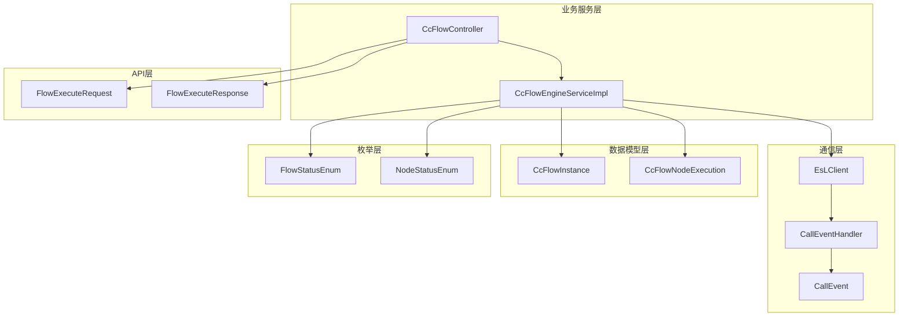
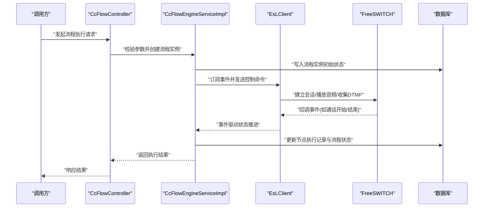
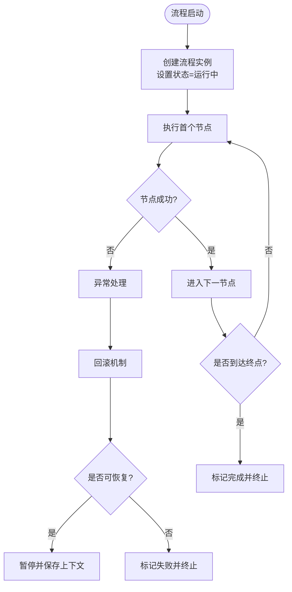
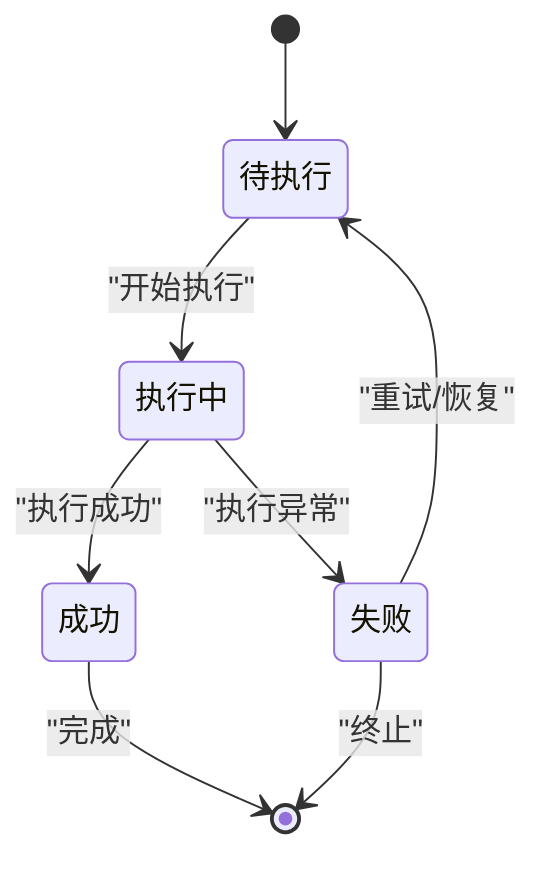
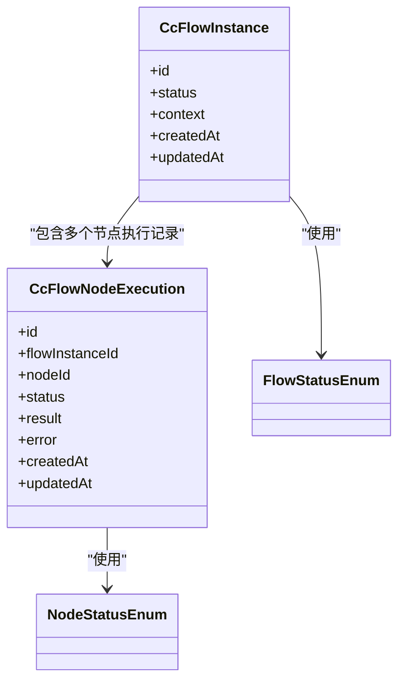
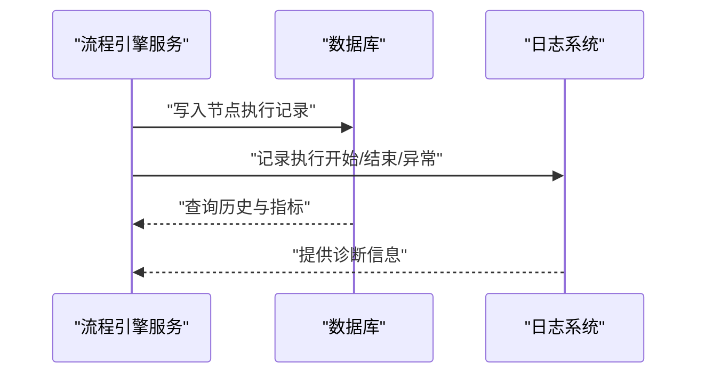
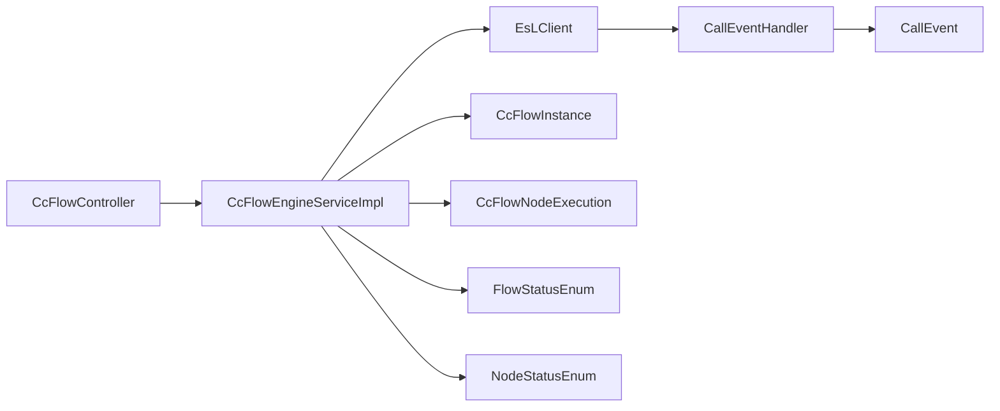

# 流程执行引擎

<cite>
**本文引用的文件**
- [yudao-module-cc/ipcc-fs-esl/src/main/java/com/fs/esl/EsLClient.java](file://yudao-module-cc/ipcc-fs-esl/src/main/java/com/fs/esl/EsLClient.java)
- [yudao-module-cc/ipcc-fs-esl/src/main/java/com/fs/esl/handler/CallEventHandler.java](file://yudao-module-cc/ipcc-fs-esl/src/main/java/com/fs/esl/handler/CallEventHandler.java)
- [yudao-module-cc/ipcc-fs-esl/src/main/java/com/fs/esl/event/CallEvent.java](file://yudao-module-cc/ipcc-fs-esl/src/main/java/com/fs/esl/event/CallEvent.java)
- [yudao-module-cc/yudao-module-cc-server/src/main/java/cn/iocoder/yudao/module/cc/service/impl/CcFlowEngineServiceImpl.java](file://yudao-module-cc/yudao-module-cc-server/src/main/java/cn/iocoder/yudao/module/cc/service/impl/CcFlowEngineServiceImpl.java)
- [yudao-module-cc/yudao-module-cc-server/src/main/java/cn/iocoder/yudao/module/cc/controller/CcFlowController.java](file://yudao-module-cc/yudao-module-cc-server/src/main/java/cn/iocoder/yudao/module/cc/controller/CcFlowController.java)
- [yudao-module-cc/yudao-module-cc-api/src/main/java/cn/iocoder/yudao/module/cc/dto/FlowExecuteRequest.java](file://yudao-module-cc/yudao-module-cc-api/src/main/java/cn/iocoder/yudao/module/cc/dto/FlowExecuteRequest.java)
- [yudao-module-cc/yudao-module-cc-api/src/main/java/cn/iocoder/yudao/module/cc/dto/FlowExecuteResponse.java](file://yudao-module-cc/yudao-module-cc-api/src/main/java/cn/iocoder/yudao/module/cc/dto/FlowExecuteResponse.java)
- [yudao-module-cc/yudao-module-cc-server/src/main/java/cn/iocoder/yudao/module/cc/entity/CcFlowInstance.java](file://yudao-module-cc/yudao-module-cc-server/src/main/java/cn/iocoder/yudao/module/cc/entity/CcFlowInstance.java)
- [yudao-module-cc/yudao-module-cc-server/src/main/java/cn/iocoder/yudao/module/cc/entity/CcFlowNodeExecution.java](file://yudao-module-cc/yudao-module-cc-server/src/main/java/cn/iocoder/yudao/module/cc/entity/CcFlowNodeExecution.java)
- [yudao-module-cc/yudao-module-cc-server/src/main/java/cn/iocoder/yudao/module/cc/enums/FlowStatusEnum.java](file://yudao-module-cc/yudao-module-cc-server/src/main/java/cn/iocoder/yudao/module/cc/enums/FlowStatusEnum.java)
- [yudao-module-cc/yudao-module-cc-server/src/main/java/cn/iocoder/yudao/module/cc/enums/NodeStatusEnum.java](file://yudao-module-cc/yudao-module-cc-server/src/main/java/cn/iocoder/yudao/module/cc/enums/NodeStatusEnum.java)
</cite>

## 目录
1. [简介](#简介)
2. [项目结构](#项目结构)
3. [核心组件](#核心组件)
4. [架构总览](#架构总览)
5. [详细组件分析](#详细组件分析)
6. [依赖关系分析](#依赖关系分析)
7. [性能与并发](#性能与并发)
8. [故障排查指南](#故障排查指南)
9. [结论](#结论)
10. [附录](#附录)

## 简介
本文件为IVR（交互式语音应答）流程执行引擎的技术文档，聚焦于流程实例的生命周期管理、状态机设计、执行上下文管理、监控调试以及并发与资源管理。该引擎以FreeSWITCH ESL为通信通道，结合后端服务完成流程编排、节点调度、状态持久化与可观测性保障，支撑呼叫中心场景下的语音交互流程稳定运行。

## 项目结构
本项目采用多模块分层组织：
- 通信层：基于FreeSWITCH ESL的客户端与事件处理器，负责呼叫事件收发与媒体控制。
- 业务服务层：流程控制器与服务实现，负责流程启动、执行、暂停、恢复、终止等生命周期管理。
- API层：定义请求与响应DTO，用于前后端或服务间调用。
- 数据模型层：流程实例与节点执行记录实体，承载状态与历史。
- 枚举层：统一的状态与类型定义，确保跨模块一致性。

图表来源
- [yudao-module-cc/ipcc-fs-esl/src/main/java/com/fs/esl/EsLClient.java](file://yudao-module-cc/ipcc-fs-esl/src/main/java/com/fs/esl/EsLClient.java)
- [yudao-module-cc/ipcc-fs-esl/src/main/java/com/fs/esl/handler/CallEventHandler.java](file://yudao-module-cc/ipcc-fs-esl/src/main/java/com/fs/esl/handler/CallEventHandler.java)
- [yudao-module-cc/ipcc-fs-esl/src/main/java/com/fs/esl/event/CallEvent.java](file://yudao-module-cc/ipcc-fs-esl/src/main/java/com/fs/esl/event/CallEvent.java)
- [yudao-module-cc/yudao-module-cc-server/src/main/java/cn/iocoder/yudao/module/cc/controller/CcFlowController.java](file://yudao-module-cc/yudao-module-cc-server/src/main/java/cn/iocoder/yudao/module/cc/controller/CcFlowController.java)
- [yudao-module-cc/yudao-module-cc-server/src/main/java/cn/iocoder/yudao/module/cc/service/impl/CcFlowEngineServiceImpl.java](file://yudao-module-cc/yudao-module-cc-server/src/main/java/cn/iocoder/yudao/module/cc/service/impl/CcFlowEngineServiceImpl.java)
- [yudao-module-cc/yudao-module-cc-api/src/main/java/cn/iocoder/yudao/module/cc/dto/FlowExecuteRequest.java](file://yudao-module-cc/yudao-module-cc-api/src/main/java/cn/iocoder/yudao/module/cc/dto/FlowExecuteRequest.java)
- [yudao-module-cc/yudao-module-cc-api/src/main/java/cn/iocoder/yudao/module/cc/dto/FlowExecuteResponse.java](file://yudao-module-cc/yudao-module-cc-api/src/main/java/cn/iocoder/yudao/module/cc/dto/FlowExecuteResponse.java)
- [yudao-module-cc/yudao-module-cc-server/src/main/java/cn/iocoder/yudao/module/cc/entity/CcFlowInstance.java](file://yudao-module-cc/yudao-module-cc-server/src/main/java/cn/iocoder/yudao/module/cc/entity/CcFlowInstance.java)
- [yudao-module-cc/yudao-module-cc-server/src/main/java/cn/iocoder/yudao/module/cc/entity/CcFlowNodeExecution.java](file://yudao-module-cc/yudao-module-cc-server/src/main/java/cn/iocoder/yudao/module/cc/entity/CcFlowNodeExecution.java)
- [yudao-module-cc/yudao-module-cc-server/src/main/java/cn/iocoder/yudao/module/cc/enums/FlowStatusEnum.java](file://yudao-module-cc/yudao-module-cc-server/src/main/java/cn/iocoder/yudao/module/cc/enums/FlowStatusEnum.java)
- [yudao-module-cc/yudao-module-cc-server/src/main/java/cn/iocoder/yudao/module/cc/enums/NodeStatusEnum.java](file://yudao-module-cc/yudao-module-cc/enums/NodeStatusEnum.java)

章节来源
- [yudao-module-cc/yudao-module-cc-server/src/main/java/cn/iocoder/yudao/module/cc/controller/CcFlowController.java](file://yudao-module-cc/yudao-module-cc-server/src/main/java/cn/iocoder/yudao/module/cc/controller/CcFlowController.java)
- [yudao-module-cc/yudao-module-cc-server/src/main/java/cn/iocoder/yudao/module/cc/service/impl/CcFlowEngineServiceImpl.java](file://yudao-module-cc/yudao-module-cc-server/src/main/java/cn/iocoder/yudao/module/cc/service/impl/CcFlowEngineServiceImpl.java)
- [yudao-module-cc/ipcc-fs-esl/src/main/java/com/fs/esl/EsLClient.java](file://yudao-module-cc/ipcc-fs-esl/src/main/java/com/fs/esl/EsLClient.java)
- [yudao-module-cc/ipcc-fs-esl/src/main/java/com/fs/esl/handler/CallEventHandler.java](file://yudao-module-cc/ipcc-fs-esl/src/main/java/com/fs/esl/handler/CallEventHandler.java)
- [yudao-module-cc/ipcc-fs-esl/src/main/java/com/fs/esl/event/CallEvent.java](file://yudao-module-cc/ipcc-fs-esl/src/main/java/com/fs/esl/event/CallEvent.java)

## 核心组件
- 流程控制器：暴露REST接口，接收流程执行请求并返回结果。
- 流程引擎服务：实现流程生命周期管理，协调通信层与数据层。
- ESL客户端：封装FreeSWITCH事件订阅与命令发送。
- 事件处理器：解析ESL事件，驱动流程状态推进。
- 数据模型：流程实例与节点执行记录，承载状态与历史。
- 枚举：统一流程与节点状态定义。

章节来源
- [yudao-module-cc/yudao-module-cc-server/src/main/java/cn/iocoder/yudao/module/cc/controller/CcFlowController.java](file://yudao-module-cc/yudao-module-cc-server/src/main/java/cn/iocoder/yudao/module/cc/controller/CcFlowController.java)
- [yudao-module-cc/yudao-module-cc-server/src/main/java/cn/iocoder/yudao/module/cc/service/impl/CcFlowEngineServiceImpl.java](file://yudao-module-cc/yudao-module-cc-server/src/main/java/cn/iocoder/yudao/module/cc/service/impl/CcFlowEngineServiceImpl.java)
- [yudao-module-cc/ipcc-fs-esl/src/main/java/com/fs/esl/EsLClient.java](file://yudao-module-cc/ipcc-fs-esl/src/main/java/com/fs/esl/EsLClient.java)
- [yudao-module-cc/ipcc-fs-esl/src/main/java/com/fs/esl/handler/CallEventHandler.java](file://yudao-module-cc/ipcc-fs-esl/src/main/java/com/fs/esl/handler/CallEventHandler.java)
- [yudao-module-cc/yudao-module-cc-server/src/main/java/cn/iocoder/yudao/module/cc/entity/CcFlowInstance.java](file://yudao-module-cc/yudao-module-cc-server/src/main/java/cn/iocoder/yudao/module/cc/entity/CcFlowInstance.java)
- [yudao-module-cc/yudao-module-cc-server/src/main/java/cn/iocoder/yudao/module/cc/entity/CcFlowNodeExecution.java](file://yudao-module-cc/yudao-module-cc-server/src/main/java/cn/iocoder/yudao/module/cc/entity/CcFlowNodeExecution.java)
- [yudao-module-cc/yudao-module-cc-server/src/main/java/cn/iocoder/yudao/module/cc/enums/FlowStatusEnum.java](file://yudao-module-cc/yudao-module-cc-server/src/main/java/cn/iocoder/yudao/module/cc/enums/FlowStatusEnum.java)
- [yudao-module-cc/yudao-module-cc-server/src/main/java/cn/iocoder/yudao/module/cc/enums/NodeStatusEnum.java](file://yudao-module-cc/yudao-module-cc-server/src/main/java/cn/iocoder/yudao/module/cc/enums/NodeStatusEnum.java)

## 架构总览
整体架构分为四层：
- 接入层：通过REST接口接收流程执行请求。
- 服务层：流程引擎服务负责编排、调度与状态管理。
- 通信层：ESL客户端与事件处理器对接FreeSWITCH，处理呼叫事件与媒体控制。
- 数据层：持久化流程实例与节点执行历史，提供查询与分析能力。

图表来源
- [yudao-module-cc/yudao-module-cc-server/src/main/java/cn/iocoder/yudao/module/cc/controller/CcFlowController.java](file://yudao-module-cc/yudao-module-cc-server/src/main/java/cn/iocoder/yudao/module/cc/controller/CcFlowController.java)
- [yudao-module-cc/yudao-module-cc-server/src/main/java/cn/iocoder/yudao/module/cc/service/impl/CcFlowEngineServiceImpl.java](file://yudao-module-cc/yudao-module-cc-server/src/main/java/cn/iocoder/yudao/module/cc/service/impl/CcFlowEngineServiceImpl.java)
- [yudao-module-cc/ipcc-fs-esl/src/main/java/com/fs/esl/EsLClient.java](file://yudao-module-cc/ipcc-fs-esl/src/main/java/com/fs/esl/EsLClient.java)
- [yudao-module-cc/ipcc-fs-esl/src/main/java/com/fs/esl/handler/CallEventHandler.java](file://yudao-module-cc/ipcc-fs-esl/src/main/java/com/fs/esl/handler/CallEventHandler.java)

## 详细组件分析

### 流程实例生命周期管理
- 启动：控制器接收请求后创建流程实例，设置初始状态为“运行中”，并写入数据库。
- 执行：服务层根据流程定义调度节点，通过ESL向FreeSWITCH下发控制指令（如播放音频、收集按键）。
- 暂停：当遇到外部等待或异步任务时，将流程实例状态置为“已暂停”，并保存上下文快照。
- 恢复：从快照恢复上下文，继续执行后续节点。
- 终止：流程正常结束或异常结束时，更新状态为“已完成”或“已失败”，并记录最终结果。

图表来源
- [yudao-module-cc/yudao-module-cc-server/src/main/java/cn/iocoder/yudao/module/cc/service/impl/CcFlowEngineServiceImpl.java](file://yudao-module-cc/yudao-module-cc-server/src/main/java/cn/iocoder/yudao/module/cc/service/impl/CcFlowEngineServiceImpl.java)
- [yudao-module-cc/yudao-module-cc-server/src/main/java/cn/iocoder/yudao/module/cc/entity/CcFlowInstance.java](file://yudao-module-cc/yudao-module-cc-server/src/main/java/cn/iocoder/yudao/module/cc/entity/CcFlowInstance.java)
- [yudao-module-cc/yudao-module-cc-server/src/main/java/cn/iocoder/yudao/module/cc/enums/FlowStatusEnum.java](file://yudao-module-cc/yudao-module-cc-server/src/main/java/cn/iocoder/yudao/module/cc/enums/FlowStatusEnum.java)

章节来源
- [yudao-module-cc/yudao-module-cc-server/src/main/java/cn/iocoder/yudao/module/cc/controller/CcFlowController.java](file://yudao-module-cc/yudao-module-cc-server/src/main/java/cn/iocoder/yudao/module/cc/controller/CcFlowController.java)
- [yudao-module-cc/yudao-module-cc-server/src/main/java/cn/iocoder/yudao/module/cc/service/impl/CcFlowEngineServiceImpl.java](file://yudao-module-cc/yudao-module-cc-server/src/main/java/cn/iocoder/yudao/module/cc/service/impl/CcFlowEngineServiceImpl.java)
- [yudao-module-cc/yudao-module-cc-server/src/main/java/cn/iocoder/yudao/module/cc/entity/CcFlowInstance.java](file://yudao-module-cc/yudao-module-cc/entity/CcFlowInstance.java)
- [yudao-module-cc/yudao-module-cc-server/src/main/java/cn/iocoder/yudao/module/cc/enums/FlowStatusEnum.java](file://yudao-module-cc/yudao-module-cc-server/src/main/java/cn/iocoder/yudao/module/cc/enums/FlowStatusEnum.java)

### 流程状态机设计
- 节点状态转换：每个节点具备独立状态（如“待执行”、“执行中”、“成功”、“失败”），由事件驱动推进。
- 异常处理：节点执行异常时，记录错误信息并触发重试或补偿逻辑。
- 回滚机制：在关键步骤前保存快照，失败时回滚到最近一致点，保证数据一致性。

图表来源
- [yudao-module-cc/yudao-module-cc-server/src/main/java/cn/iocoder/yudao/module/cc/entity/CcFlowNodeExecution.java](file://yudao-module-cc/yudao-module-cc-server/src/main/java/cn/iocoder/yudao/module/cc/entity/CcFlowNodeExecution.java)
- [yudao-module-cc/yudao-module-cc-server/src/main/java/cn/iocoder/yudao/module/cc/enums/NodeStatusEnum.java](file://yudao-module-cc/yudao-module-cc-server/src/main/java/cn/iocoder/yudao/module/cc/enums/NodeStatusEnum.java)

章节来源
- [yudao-module-cc/yudao-module-cc-server/src/main/java/cn/iocoder/yudao/module/cc/entity/CcFlowNodeExecution.java](file://yudao-module-cc/yudao-module-cc-server/src/main/java/cn/iocoder/yudao/module/cc/entity/CcFlowNodeExecution.java)
- [yudao-module-cc/yudao-module-cc-server/src/main/java/cn/iocoder/yudao/module/cc/enums/NodeStatusEnum.java](file://yudao-module-cc/yudao-module-cc-server/src/main/java/cn/iocoder/yudao/module/cc/enums/NodeStatusEnum.java)

### 执行上下文管理
- 变量作用域：支持流程级与节点级变量，避免命名冲突与作用域污染。
- 数据传递：通过上下文对象在各节点间传递数据，确保数据流转透明。
- 会话保持：结合ESL会话标识，维持通话过程中的上下文一致性。

图表来源
- [yudao-module-cc/yudao-module-cc-server/src/main/java/cn/iocoder/yudao/module/cc/entity/CcFlowInstance.java](file://yudao-module-cc/yudao-module-cc-server/src/main/java/cn/iocoder/yudao/module/cc/entity/CcFlowInstance.java)
- [yudao-module-cc/yudao-module-cc-server/src/main/java/cn/iocoder/yudao/module/cc/entity/CcFlowNodeExecution.java](file://yudao-module-cc/yudao-module-cc-server/src/main/java/cn/iocoder/yudao/module/cc/entity/CcFlowNodeExecution.java)
- [yudao-module-cc/yudao-module-cc-server/src/main/java/cn/iocoder/yudao/module/cc/enums/FlowStatusEnum.java](file://yudao-module-cc/yudao-module-cc-server/src/main/java/cn/iocoder/yudao/module/cc/enums/FlowStatusEnum.java)
- [yudao-module-cc/yudao-module-cc-server/src/main/java/cn/iocoder/yudao/module/cc/enums/NodeStatusEnum.java](file://yudao-module-cc/yudao-module-cc-server/src/main/java/cn/iocoder/yudao/module/cc/enums/NodeStatusEnum.java)

章节来源
- [yudao-module-cc/yudao-module-cc-server/src/main/java/cn/iocoder/yudao/module/cc/entity/CcFlowInstance.java](file://yudao-module-cc/yudao-module-cc-server/src/main/java/cn/iocoder/yudao/module/cc/entity/CcFlowInstance.java)
- [yudao-module-cc/yudao-module-cc-server/src/main/java/cn/iocoder/yudao/module/cc/entity/CcFlowNodeExecution.java](file://yudao-module-cc/yudao-module-cc-server/src/main/java/cn/iocoder/yudao/module/cc/entity/CcFlowNodeExecution.java)

### 监控与调试
- 执行历史追踪：通过节点执行记录表记录每一步的执行状态、结果与错误信息。
- 性能分析：统计节点执行耗时与流程总耗时，识别瓶颈节点。
- 日志记录：在关键路径输出结构化日志，便于问题定位与审计。

图表来源
- [yudao-module-cc/yudao-module-cc-server/src/main/java/cn/iocoder/yudao/module/cc/entity/CcFlowNodeExecution.java](file://yudao-module-cc/yudao-module-cc-server/src/main/java/cn/iocoder/yudao/module/cc/entity/CcFlowNodeExecution.java)
- [yudao-module-cc/yudao-module-cc-server/src/main/java/cn/iocoder/yudao/module/cc/service/impl/CcFlowEngineServiceImpl.java](file://yudao-module-cc/yudao-module-cc-server/src/main/java/cn/iocoder/yudao/module/cc/service/impl/CcFlowEngineServiceImpl.java)

章节来源
- [yudao-module-cc/yudao-module-cc-server/src/main/java/cn/iocoder/yudao/module/cc/service/impl/CcFlowEngineServiceImpl.java](file://yudao-module-cc/yudao-module-cc-server/src/main/java/cn/iocoder/yudao/module/cc/service/impl/CcFlowEngineServiceImpl.java)
- [yudao-module-cc/yudao-module-cc-server/src/main/java/cn/iocoder/yudao/module/cc/entity/CcFlowNodeExecution.java](file://yudao-module-cc/yudao-module-cc-server/src/main/java/cn/iocoder/yudao/module/cc/entity/CcFlowNodeExecution.java)

### 并发控制与资源管理
- 并发控制：对同一流程实例的操作加锁，避免竞态条件；对高频节点执行进行限流。
- 资源管理：合理管理ESL连接池与线程池，防止资源泄漏；超时与重试策略保障稳定性。
- 最佳实践：使用幂等操作、事务边界清晰、异常快速失败与降级。

章节来源
- [yudao-module-cc/ipcc-fs-esl/src/main/java/com/fs/esl/EsLClient.java](file://yudao-module-cc/ipcc-fs-esl/src/main/java/com/fs/esl/EsLClient.java)
- [yudao-module-cc/ipcc-fs-esl/src/main/java/com/fs/esl/handler/CallEventHandler.java](file://yudao-module-cc/ipcc-fs-esl/src/main/java/com/fs/esl/handler/CallEventHandler.java)
- [yudao-module-cc/yudao-module-cc-server/src/main/java/cn/iocoder/yudao/module/cc/service/impl/CcFlowEngineServiceImpl.java](file://yudao-module-cc/yudao-module-cc-server/src/main/java/cn/iocoder/yudao/module/cc/service/impl/CcFlowEngineServiceImpl.java)

## 依赖关系分析
- 控制器依赖服务层，服务层依赖ESL客户端与数据模型。
- 事件处理器依赖ESL客户端，驱动服务层状态推进。
- 数据模型依赖枚举，确保状态一致性。

图表来源
- [yudao-module-cc/yudao-module-cc-server/src/main/java/cn/iocoder/yudao/module/cc/controller/CcFlowController.java](file://yudao-module-cc/yudao-module-cc-server/src/main/java/cn/iocoder/yudao/module/cc/controller/CcFlowController.java)
- [yudao-module-cc/yudao-module-cc-server/src/main/java/cn/iocoder/yudao/module/cc/service/impl/CcFlowEngineServiceImpl.java](file://yudao-module-cc/yudao-module-cc-server/src/main/java/cn/iocoder/yudao/module/cc/service/impl/CcFlowEngineServiceImpl.java)
- [yudao-module-cc/ipcc-fs-esl/src/main/java/com/fs/esl/EsLClient.java](file://yudao-module-cc/ipcc-fs-esl/src/main/java/com/fs/esl/EsLClient.java)
- [yudao-module-cc/ipcc-fs-esl/src/main/java/com/fs/esl/handler/CallEventHandler.java](file://yudao-module-cc/ipcc-fs-esl/src/main/java/com/fs/esl/handler/CallEventHandler.java)
- [yudao-module-cc/ipcc-fs-esl/src/main/java/com/fs/esl/event/CallEvent.java](file://yudao-module-cc/ipcc-fs-esl/src/main/java/com/fs/esl/event/CallEvent.java)
- [yudao-module-cc/yudao-module-cc-server/src/main/java/cn/iocoder/yudao/module/cc/entity/CcFlowInstance.java](file://yudao-module-cc/yudao-module-cc-server/src/main/java/cn/iocoder/yudao/module/cc/entity/CcFlowInstance.java)
- [yudao-module-cc/yudao-module-cc-server/src/main/java/cn/iocoder/yudao/module/cc/entity/CcFlowNodeExecution.java](file://yudao-module-cc/yudao-module-cc-server/src/main/java/cn/iocoder/yudao/module/cc/entity/CcFlowNodeExecution.java)
- [yudao-module-cc/yudao-module-cc-server/src/main/java/cn/iocoder/yudao/module/cc/enums/FlowStatusEnum.java](file://yudao-module-cc/yudao-module-cc-server/src/main/java/cn/iocoder/yudao/module/cc/enums/FlowStatusEnum.java)
- [yudao-module-cc/yudao-module-cc-server/src/main/java/cn/iocoder/yudao/module/cc/enums/NodeStatusEnum.java](file://yudao-module-cc/yudao-module-cc-server/src/main/java/cn/iocoder/yudao/module/cc/enums/NodeStatusEnum.java)

章节来源
- [yudao-module-cc/yudao-module-cc-server/src/main/java/cn/iocoder/yudao/module/cc/controller/CcFlowController.java](file://yudao-module-cc/yudao-module-cc-server/src/main/java/cn/iocoder/yudao/module/cc/controller/CcFlowController.java)
- [yudao-module-cc/yudao-module-cc-server/src/main/java/cn/iocoder/yudao/module/cc/service/impl/CcFlowEngineServiceImpl.java](file://yudao-module-cc/yudao-module-cc-server/src/main/java/cn/iocoder/yudao/module/cc/service/impl/CcFlowEngineServiceImpl.java)
- [yudao-module-cc/ipcc-fs-esl/src/main/java/com/fs/esl/EsLClient.java](file://yudao-module-cc/ipcc-fs-esl/src/main/java/com/fs/esl/EsLClient.java)
- [yudao-module-cc/ipcc-fs-esl/src/main/java/com/fs/esl/handler/CallEventHandler.java](file://yudao-module-cc/ipcc-fs-esl/src/main/java/com/fs/esl/handler/CallEventHandler.java)
- [yudao-module-cc/ipcc-fs-esl/src/main/java/com/fs/esl/event/CallEvent.java](file://yudao-module-cc/ipcc-fs-esl/src/main/java/com/fs/esl/event/CallEvent.java)
- [yudao-module-cc/yudao-module-cc-server/src/main/java/cn/iocoder/yudao/module/cc/entity/CcFlowInstance.java](file://yudao-module-cc/yudao-module-cc-server/src/main/java/cn/iocoder/yudao/module/cc/entity/CcFlowInstance.java)
- [yudao-module-cc/yudao-module-cc-server/src/main/java/cn/iocoder/yudao/module/cc/entity/CcFlowNodeExecution.java](file://yudao-module-cc/yudao-module-cc-server/src/main/java/cn/iocoder/yudao/module/cc/entity/CcFlowNodeExecution.java)
- [yudao-module-cc/yudao-module-cc-server/src/main/java/cn/iocoder/yudao/module/cc/enums/FlowStatusEnum.java](file://yudao-module-cc/yudao-module-cc-server/src/main/java/cn/iocoder/yudao/module/cc/enums/FlowStatusEnum.java)
- [yudao-module-cc/yudao-module-cc-server/src/main/java/cn/iocoder/yudao/module/cc/enums/NodeStatusEnum.java](file://yudao-module-cc/yudao-module-cc-server/src/main/java/cn/iocoder/yudao/module/cc/enums/NodeStatusEnum.java)

## 性能与并发
- 建议对高频节点执行引入缓存与批处理，减少数据库压力。
- 对ESL命令进行批量合并与去重，降低网络开销。
- 使用连接池与线程池限制并发度，避免资源耗尽。
- 对长耗时操作采用异步执行与回调机制，提升吞吐。

[本节为通用指导，不直接分析具体文件]

## 故障排查指南
- 常见问题：
  - 流程卡死：检查节点执行记录与日志，确认是否存在阻塞或超时。
  - 状态不一致：核对数据库中的流程实例与节点执行状态，必要时手动修复。
  - 通信异常：查看ESL客户端连接状态与事件订阅情况。
- 排查步骤：
  - 通过流程实例ID查询执行历史，定位失败节点。
  - 检查对应节点的错误信息与重试次数。
  - 验证FreeSWITCH侧的事件与命令是否正确下发。

章节来源
- [yudao-module-cc/yudao-module-cc-server/src/main/java/cn/iocoder/yudao/module/cc/service/impl/CcFlowEngineServiceImpl.java](file://yudao-module-cc/yudao-module-cc-server/src/main/java/cn/iocoder/yudao/module/cc/service/impl/CcFlowEngineServiceImpl.java)
- [yudao-module-cc/yudao-module-cc-server/src/main/java/cn/iocoder/yudao/module/cc/entity/CcFlowNodeExecution.java](file://yudao-module-cc/yudao-module-cc-server/src/main/java/cn/iocoder/yudao/module/cc/entity/CcFlowNodeExecution.java)
- [yudao-module-cc/ipcc-fs-esl/src/main/java/com/fs/esl/EsLClient.java](file://yudao-module-cc/ipcc-fs-esl/src/main/java/com/fs/esl/EsLClient.java)

## 结论
本引擎通过清晰的层次划分与状态机设计，实现了IVR流程的稳定执行与可观测性。借助ESL与数据库的协同，完成了流程实例的全生命周期管理与节点执行的精细化控制。建议在后续迭代中持续优化并发与性能，完善监控与告警能力，以提升系统的可靠性与可维护性。

[本节为总结性内容，不直接分析具体文件]

## 附录
- API参考：
  - 流程执行请求：[FlowExecuteRequest](file://yudao-module-cc/yudao-module-cc-api/src/main/java/cn/iocoder/yudao/module/cc/dto/FlowExecuteRequest.java)
  - 流程执行响应：[FlowExecuteResponse](file://yudao-module-cc/yudao-module-cc-api/src/main/java/cn/iocoder/yudao/module/cc/dto/FlowExecuteResponse.java)
- 数据模型：
  - 流程实例：[CcFlowInstance](file://yudao-module-cc/yudao-module-cc-server/src/main/java/cn/iocoder/yudao/module/cc/entity/CcFlowInstance.java)
  - 节点执行记录：[CcFlowNodeExecution](file://yudao-module-cc/yudao-module-cc-server/src/main/java/cn/iocoder/yudao/module/cc/entity/CcFlowNodeExecution.java)
- 状态枚举：
  - 流程状态：[FlowStatusEnum](file://yudao-module-cc/yudao-module-cc-server/src/main/java/cn/iocoder/yudao/module/cc/enums/FlowStatusEnum.java)
  - 节点状态：[NodeStatusEnum](file://yudao-module-cc/yudao-module-cc-server/src/main/java/cn/iocoder/yudao/module/cc/enums/NodeStatusEnum.java)