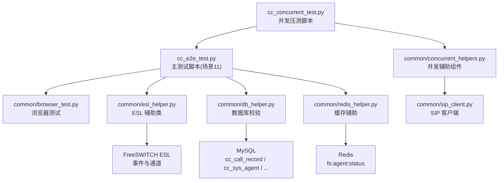
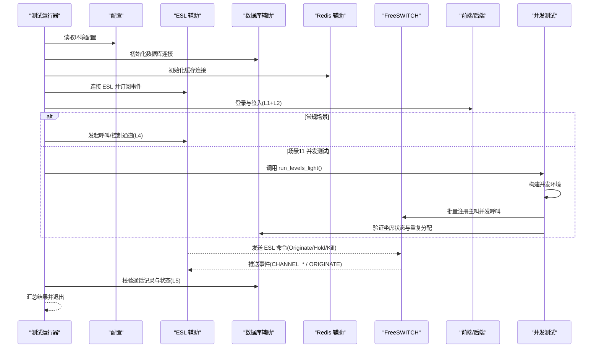
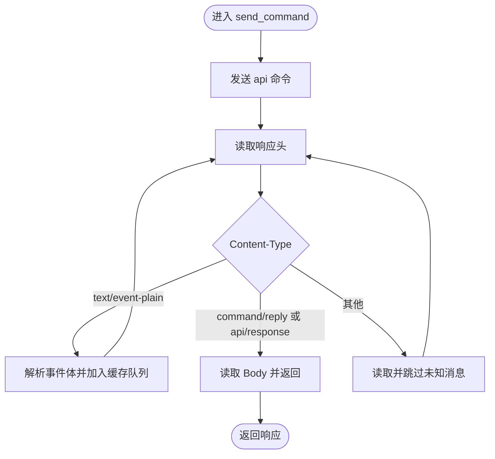
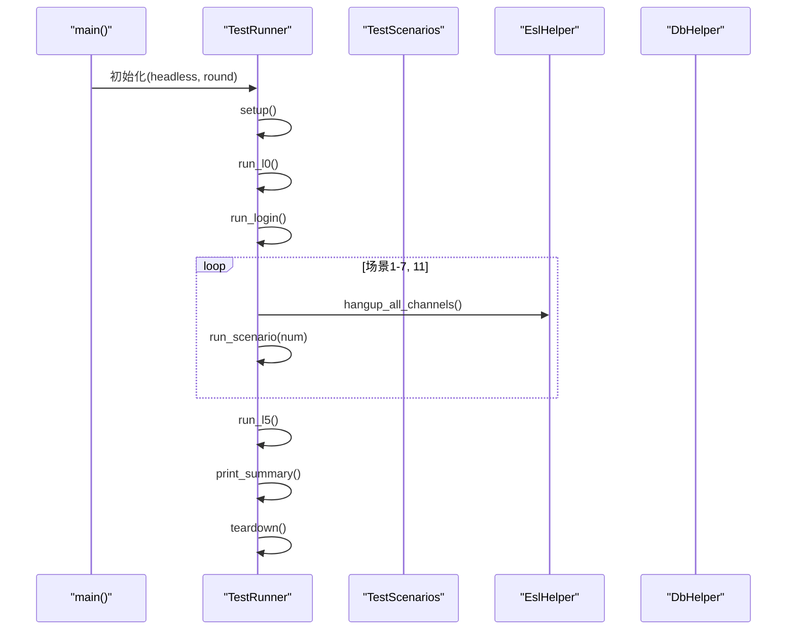
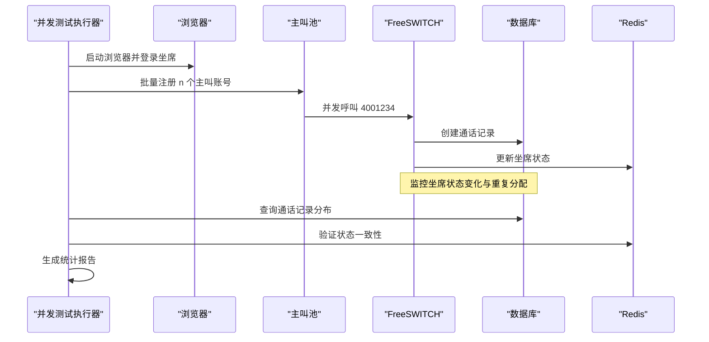
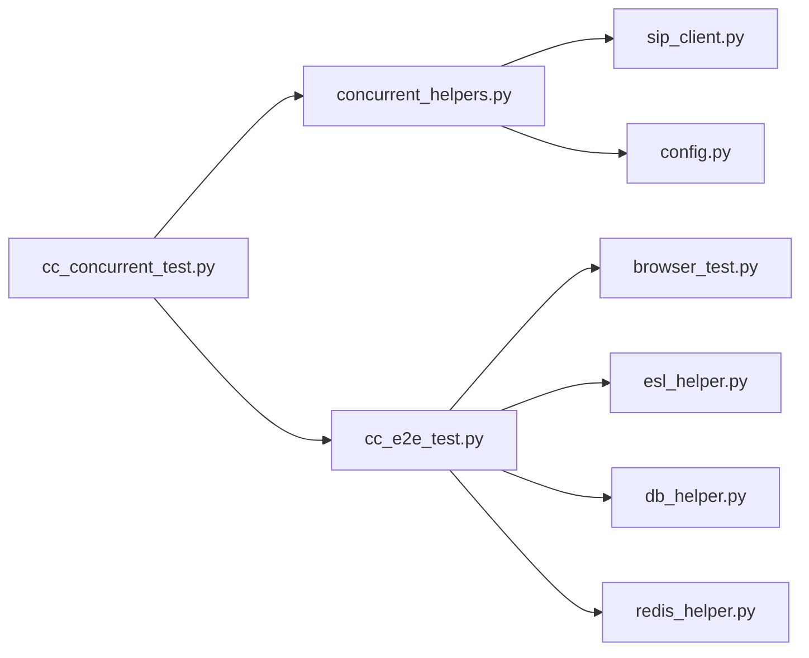

# 流程测试工具

<cite>
**本文引用的文件**
- [cc_concurrent_test.py](file://yudao-cloud/yudao-module-cc/doc/test-all/cc_concurrent_test.py)
- [cc_e2e_test.py](file://yudao-cloud/yudao-module-cc/doc/test-all/cc_e2e_test.py)
- [concurrent_helpers.py](file://yudao-cloud/yudao-module-cc/doc/test-all/common/concurrent_helpers.py)
- [browser_test.py](file://yudao-cloud/yudao-module-cc/doc/test-all/common/browser_test.py)
- [db_helper.py](file://yudao-cloud/yudao-module-cc/doc/test-all/common/db_helper.py)
- [esl_helper.py](file://yudao-cloud/yudao-module-cc/doc/test-all/common/esl_helper.py)
- [redis_helper.py](file://yudao-cloud/yudao-module-cc/doc/test-all/common/redis_helper.py)
- [sip_client.py](file://yudao-cloud/yudao-module-cc/doc/test-all/common/sip_client.py)
</cite>

## 更新摘要

**变更内容**

- 新增并发呼入压测场景（场景11），支持分级并发测试（10/20/30/50/80/100）
- 集成独立压测脚本 cc_concurrent_test.py，提供完整的并发验证能力
- 在主测试脚本中注册可选场景11，支持轻量级执行模式
- 新增坐席状态采样、重复分配检测、排队/溢出逻辑验证等核心功能
- 增强第三方FS账户管理和事件采集能力

## 目录
1. [简介](#简介)
2. [项目结构](#项目结构)
3. [核心组件](#核心组件)
4. [架构总览](#架构总览)
5. [详细组件分析](#详细组件分析)
6. [并发测试场景](#并发测试场景)
7. [依赖关系分析](#依赖关系分析)
8. [性能与稳定性](#性能与稳定性)
9. [故障排查指南](#故障排查指南)
10. [结论](#结论)
11. [附录](#附录)

## 简介
本文件为 IVR 流程测试工具的全面技术文档，面向呼叫中心系统的端到端测试。内容覆盖：
- 单元测试框架使用（Mock 对象配置、测试用例编写、断言方法）
- 集成测试实现（FreeSWITCH 环境模拟、SIP 消息测试、端到端流程验证）
- **新增** 并发呼入压测场景（场景11），支持分级并发测试与缺陷统计
- 自动化测试脚本使用方法（批量执行、结果分析、报告生成）
- 测试数据准备与环境搭建指导
- 常见测试场景示例与故障排查方法

该工具以 Python 脚本为核心，通过 ESL 协议与 FreeSWITCH 交互，结合数据库与缓存校验，完成从登录签入到通话场景再到数据校验的完整闭环。
**新增的并发测试场景可验证高负载下的系统稳定性与正确性**。

## 项目结构

测试套件位于 yudao-module-cc/doc/test-all，主要文件职责如下：

- cc_concurrent_test.py： **新增** 并发呼入压测主脚本，支持分级并发测试
- cc_e2e_test.py：端到端测试主运行器，编排 L0→L1+L2→L4→L5 的执行顺序， **集成场景11**
- common/concurrent_helpers.py： **新增** 并发测试公共组件，提供批量软电话管理、状态采样、报告输出
- common/browser_test.py：浏览器自动化测试封装
- common/esl_helper.py：ESL 连接与命令封装，提供通道查询、呼叫控制、会议管理与事件订阅等待
- common/db_helper.py：MySQL 访问封装，提供通话记录、坐席状态、网关与路由等查询与清理能力
- common/redis_helper.py：Redis 访问封装，用于自动外呼任务上下文写入与清理
- common/sip_client.py：SIP 客户端封装，支持 pjsua 子进程管理

**图表来源**

- [cc_concurrent_test.py:1-986](file://yudao-cloud/yudao-module-cc/doc/test-all/cc_concurrent_test.py#L1-L986)
- [cc_e2e_test.py:2090-2112](file://yudao-cloud/yudao-module-cc/doc/test-all/cc_e2e_test.py#L2090-L2112)
- [concurrent_helpers.py:1-364](file://yudao-cloud/yudao-module-cc/doc/test-all/common/concurrent_helpers.py#L1-L364)

**章节来源**

- [cc_concurrent_test.py:1-986](file://yudao-cloud/yudao-module-cc/doc/test-all/cc_concurrent_test.py#L1-L986)
- [cc_e2e_test.py:1-2944](file://yudao-cloud/yudao-module-cc/doc/test-all/cc_e2e_test.py#L1-L2944)

## 核心组件

- **并发压测执行器（ConcurrentRunner）**
    - 负责并发测试环境的初始化、L0环境核对、坐席登录、分级并发执行与结果汇总
    - 支持 --levels、--headless、--queue-test、--skip-l0 等参数配置
    - 集成独立脚本模式与主脚本场景11两种执行方式
- **并发辅助组件（concurrent_helpers.py）**
    - InboundCallerPool：批量 pjsua 主叫软电话池，支持并发启动、发令枪齐呼、状态统计
    - AgentStatusSampler：Redis 坐席状态定时采样线程，记录状态轨迹供并发断言
    - ConcurrentReporter：并发分级结果汇聚与报告输出（Markdown/JSON）
- **测试运行器（TestRunner）**
  - 负责按阶段执行环境检查、登录签入、通话场景与数据校验
  - **新增场景11集成**：通过 scenario_11_concurrent_inbound 函数调用并发测试
  - 统一捕获异常、统计耗时、输出汇总，支持单场景重跑与轮次编号
- ESL 辅助类（EslHelper）
  - 基于原生 socket 实现 ESL 协议，避免第三方库安装问题
  - 提供 connect/disconnect、send_command、originate、uuid_kill、conference 管理、subscribe/wait_for_event 等能力
  - 关键设计：在 send_command 期间将事件缓存至队列，避免阻塞命令导致事件丢失
- 数据库辅助类（DbHelper）
  - 封装 MySQL 连接与常用查询，包括通话记录、坐席在线状态、网关与路由查询
  - 提供测试数据清理与状态重置能力
- Redis 辅助类（RedisHelper）
  - 封装 Redis 连接与自动外呼任务上下文操作，确保 key 前缀与 TTL 与业务一致
  - 支持幂等写入与清理，保障测试可重复执行

**章节来源**

- [cc_concurrent_test.py:762-844](file://yudao-cloud/yudao-module-cc/doc/test-all/cc_concurrent_test.py#L762-L844)
- [concurrent_helpers.py:60-126](file://yudao-cloud/yudao-module-cc/doc/test-all/common/concurrent_helpers.py#L60-L126)
- [concurrent_helpers.py:128-270](file://yudao-cloud/yudao-module-cc/doc/test-all/common/concurrent_helpers.py#L128-L270)
- [concurrent_helpers.py:272-364](file://yudao-cloud/yudao-module-cc/doc/test-all/common/concurrent_helpers.py#L272-L364)
- [cc_e2e_test.py:2090-2112](file://yudao-cloud/yudao-module-cc/doc/test-all/cc_e2e_test.py#L2090-L2112)

## 架构总览

端到端测试流程分为 L0→L1+L2→L4→L5， **新增场景11作为可选的并发压测入口**：
- L0：环境检查（FS 连通性、数据库/缓存可达性等）
- L1+L2：登录与签入（前端页面操作与 SIP 注册）
- L4：通话场景（内部呼叫、出局呼叫、IVR 入局、第三方网关呼入、保持恢复、咨询转接、自动外呼、 **并发呼入**）
- L5：数据校验（通话记录生成、坐席状态一致性）

**图表来源**

- [cc_e2e_test.py:2090-2112](file://yudao-cloud/yudao-module-cc/doc/test-all/cc_e2e_test.py#L2090-L2112)
- [cc_concurrent_test.py:853-925](file://yudao-cloud/yudao-module-cc/doc/test-all/cc_concurrent_test.py#L853-L925)
- [cc_concurrent_test.py:471-732](file://yudao-cloud/yudao-module-cc/doc/test-all/cc_concurrent_test.py#L471-L732)

## 详细组件分析

### ESL 辅助类（EslHelper）
- 连接与认证
  - 建立 TCP 连接，等待 auth/request，发送密码进行认证
- 命令与事件处理
  - send_command 发送 api 命令，循环读取响应；遇到事件则解析并缓存到 _event_queue
  - wait_for_event 优先从缓存队列查找匹配事件，再回退到 socket 读取新事件
- 通道与会话控制
  - originate 构造通道变量，支持自动外呼、出局与内部呼叫，末尾 &park() 保持通道
  - uuid_hold/uuid_kill 控制通道保持与挂断；hangup_all_channels 批量清理
- 事件订阅
  - subscribe_events 先取消旧订阅，再订阅新事件；支持 ALL 或指定事件列表

**图表来源**

- [esl_helper.py:184-258](file://yudao-cloud/yudao-module-cc/doc/test-all/common/esl_helper.py#L184-L258)

**章节来源**

- [esl_helper.py:64-122](file://yudao-cloud/yudao-module-cc/doc/test-all/common/esl_helper.py#L64-L122)
- [esl_helper.py:184-258](file://yudao-cloud/yudao-module-cc/doc/test-all/common/esl_helper.py#L184-L258)
- [esl_helper.py:361-438](file://yudao-cloud/yudao-module-cc/doc/test-all/common/esl_helper.py#L361-L438)
- [esl_helper.py:547-580](file://yudao-cloud/yudao-module-cc/doc/test-all/common/esl_helper.py#L547-L580)
- [esl_helper.py:586-756](file://yudao-cloud/yudao-module-cc/doc/test-all/common/esl_helper.py#L586-L756)

### 测试运行器（TestRunner）
- 参数解析与执行顺序
  - 支持 --headless、--scenarios、--skip-l0、--round 等参数
  - 执行顺序：setup → L0 → L1+L2 → L4（场景1-7, 11）→ L5 → teardown
- 结果收集与汇总
  - 记录每个用例的状态（PASS/FAIL/SKIP/ERROR）、耗时与详情
  - 打印汇总统计，根据是否有失败决定退出码
- 场景间清理
  - 每场景开始前挂断所有残留通道（两个 FS 实例），等待短暂时间

**图表来源**

- [cc_e2e_test.py:2529-2584](file://yudao-cloud/yudao-module-cc/doc/test-all/cc_e2e_test.py#L2529-L2584)
- [cc_e2e_test.py:2385-2393](file://yudao-cloud/yudao-module-cc/doc/test-all/cc_e2e_test.py#L2385-L2393)

**章节来源**

- [cc_e2e_test.py:2529-2584](file://yudao-cloud/yudao-module-cc/doc/test-all/cc_e2e_test.py#L2529-L2584)
- [cc_e2e_test.py:2385-2393](file://yudao-cloud/yudao-module-cc/doc/test-all/cc_e2e_test.py#L2385-L2393)

### 数据库辅助（DbHelper）
- 通话记录校验
  - 支持按 call_id、时间范围查询，统计自某时间后的记录数
  - 验证记录是否存在并匹配 caller/callee/direction/call_type
- 坐席状态管理
  - 查询/更新在线状态，支持重置离线
- 网关与路由查询
  - 查询外部网关、按名称/ID 获取网关、查询启用路由
- FS 配置查询
  - 查询 FS 实例配置，便于多实例切换与故障转移测试

**章节来源**

- [db_helper.py:127-239](file://yudao-cloud/yudao-module-cc/doc/test-all/common/db_helper.py#L127-L239)
- [db_helper.py:241-297](file://yudao-cloud/yudao-module-cc/doc/test-all/common/db_helper.py#L241-L297)
- [db_helper.py:298-427](file://yudao-cloud/yudao-module-cc/doc/test-all/common/db_helper.py#L298-L427)
- [db_helper.py:428-454](file://yudao-cloud/yudao-module-cc/doc/test-all/common/db_helper.py#L428-L454)

### Redis 辅助（RedisHelper）
- 自动外呼任务上下文
  - 写入 key 格式：autocall:task:{taskId}，TTL 24小时
  - JSON 结构包含 taskId、ivrFlow、variables、status、startTime、tenantId
- 通用操作
  - get/setex/delete 等基础能力，供扩展使用

**章节来源**

- [redis_helper.py:28-85](file://yudao-cloud/yudao-module-cc/doc/test-all/common/redis_helper.py#L28-L85)
- [redis_helper.py:105-150](file://yudao-cloud/yudao-module-cc/doc/test-all/common/redis_helper.py#L105-L150)
- [redis_helper.py:152-192](file://yudao-cloud/yudao-module-cc/doc/test-all/common/redis_helper.py#L152-L192)
- [redis_helper.py:198-246](file://yudao-cloud/yudao-module-cc/doc/test-all/common/redis_helper.py#L198-L246)

## 并发测试场景

### 场景11概述

**新增的并发呼入压测场景**，通过 pjsua 批量登录第三方网关账户并发呼叫 4001234，验证系统在高压负载下的行为正确性。

### 核心功能特性

- **分级并发测试**：支持 10/20/30/50/80/100 级别，默认全部执行，可通过 --levels 参数自定义
- **多维度验证**：
    - 坐席组成员状态更新正确性（Redis fs:agent:status 轨迹 + DB online_status 一致性）
    - 空闲坐席获取并发正确性（同一坐席被重复分配检测）
    - 排队逻辑验证（--queue-test 临时切换为排队策略）
    - 溢出分支行为（全忙时转IVR逻辑验证）
    - 每级成功/失败统计 + 失败原因分类报告
- **双模式执行**：
    - 独立脚本模式：python3 cc_concurrent_test.py（完整功能）
    - 主脚本集成模式：python3 cc_e2e_test.py --scenarios 11（轻量版，默认10/20两级）

### 并发测试执行流程

**图表来源**

- [cc_concurrent_test.py:471-732](file://yudao-cloud/yudao-module-cc/doc/test-all/cc_concurrent_test.py#L471-L732)
- [cc_concurrent_test.py:853-925](file://yudao-cloud/yudao-module-cc/doc/test-all/cc_concurrent_test.py#L853-L925)

### 坐席状态采样机制

- **AgentStatusSampler**：定时采样 Redis 中 fs:agent:status 哈希表，记录坐席状态变化轨迹
- **状态映射**：1=READY (空闲)、2=NOT_READY (忙碌)、3=NOT_READY_NOT_TALKING、4=OFF_ON (离线)、5=TALKING_IN (通话中)、6=RINGING
  (振铃中)、7=TALKING_OUT (话后)
- **轨迹分析**：检测状态跳变、非法状态码、采样缺失等异常情况

### 重复分配检测

- **核心断言**：DB 中同一坐席在并发窗口内被分配 >=2 路即判疑似重复分配
- **竞态窗口**：选座（读 fs:agent:status 中 READY 列表）→ 坐席端振铃上报 RINGING 之间存在秒级竞态窗口
- **证据收集**：结合 ESL CHANNEL_CREATE 事件与 DB 通话记录进行交叉验证

### 排队与溢出逻辑验证

- **排队模式**：--queue-test 参数临时修改坐席组1配置为排队策略，验证排队分配逻辑
- **溢出分支**：全忙时触发溢出转IVR，验证 overflow_value 配置有效性
- **异常处理**：fsAcd 扫描异常（ClassCastException）会导致排队分配完全失效

**章节来源**

- [cc_concurrent_test.py:1-986](file://yudao-cloud/yudao-module-cc/doc/test-all/cc_concurrent_test.py#L1-L986)
- [concurrent_helpers.py:60-126](file://yudao-cloud/yudao-module-cc/doc/test-all/common/concurrent_helpers.py#L60-L126)
- [concurrent_helpers.py:128-270](file://yudao-cloud/yudao-module-cc/doc/test-all/common/concurrent_helpers.py#L128-L270)
- [cc_e2e_test.py:2090-2112](file://yudao-cloud/yudao-module-cc/doc/test-all/cc_e2e_test.py#L2090-L2112)

## 依赖关系分析

- **模块耦合**
    - cc_concurrent_test.py 依赖 config.py、cc_e2e_test.py、common 包中的各个辅助类
    - concurrent_helpers.py 提供独立的并发测试能力，可被主脚本复用
    - cc_e2e_test.py 通过 scenario_11_concurrent_inbound 集成场景11
- **外部依赖**
  - FreeSWITCH（ESL 端口与密码）
  - MySQL（数据库名与表结构）
  - Redis（键前缀与 TTL）
  - 前端/后端服务（登录与签入）
  - 第三方FS（62.234.191.165:9988，100个账户）

**图表来源**

- [cc_concurrent_test.py:35-49](file://yudao-cloud/yudao-module-cc/doc/test-all/cc_concurrent_test.py#L35-L49)
- [cc_e2e_test.py:38-50](file://yudao-cloud/yudao-module-cc/doc/test-all/cc_e2e_test.py#L38-L50)
- [concurrent_helpers.py:25-27](file://yudao-cloud/yudao-module-cc/doc/test-all/common/concurrent_helpers.py#L25-L27)

**章节来源**

- [cc_concurrent_test.py:35-49](file://yudao-cloud/yudao-module-cc/doc/test-all/cc_concurrent_test.py#L35-L49)
- [cc_e2e_test.py:38-50](file://yudao-cloud/yudao-module-cc/doc/test-all/cc_e2e_test.py#L38-L50)
- [concurrent_helpers.py:25-27](file://yudao-cloud/yudao-module-cc/doc/test-all/common/concurrent_helpers.py#L25-L27)

## 性能与稳定性

- **事件缓存机制**
  - send_command 期间的事件被缓存到队列，避免阻塞命令导致事件丢失，提升可靠性
- **批量清理优化**
  - 优先使用 hupall 批量挂断，若失败则 fallback 到逐个 uuid_kill，兼顾效率与兼容
- **超时与重试**
  - 调用方设置合理超时（如 CALL_TIMEOUT=60s），减少长尾等待
  - 数据库查询失败时尝试一次重连，提高鲁棒性
- **资源隔离**
  - 场景间挂断残留通道并等待短暂时间，避免状态污染
- **并发优化**
    - **新增** 多线程并发注册主叫（ThreadPoolExecutor），避免进程启动压力过大
    - **新增** 事件队列扩容（30000上限），防止高并发下事件丢失
    - **新增** DTMF 多时点重发机制，提高按键命中率

[本节为通用性能建议，不直接分析具体文件]

## 故障排查指南

- **ESL 连接与认证失败**
  - 检查 ESL_HOST/PORT/PASSWORD 配置是否正确
  - 确认 FreeSWITCH ESL 服务已启动且网络可达
  - 参考事件监控脚本输出，观察是否收到 auth/request 与认证成功
- **事件丢失或超时**
  - 确认已正确订阅事件（event plain off 后再订阅）
  - 检查 send_command 期间的事件是否被缓存（_event_queue）
  - 使用 monitor_esl_events.py 捕获原始事件流，定位缺失环节
- **通道无法挂断或残留**
  - 使用 hangup_all_channels 批量清理，必要时逐个 uuid_kill
  - 忽略 "No such channel" 错误，视为通道已自行挂断
- **数据库校验失败**
  - 核对表结构与字段映射（如 cc_call_record.call_type、cc_sys_agent.name）
  - 使用 DbHelper 提供的查询接口定位记录是否存在与字段是否匹配
- **Redis 任务上下文问题**
  - 确认 key 前缀与 TTL 与业务一致（autocall:task:*，24小时）
  - 检查 tenantId 是否正确透传，避免挂断时 NPE 导致 CDR 保存失败
- **并发测试特定问题**
    - **主叫注册失败**：检查第三方FS账户数量是否充足（需>=最大并发级）
    - **DTMF按键丢失**：高并发下RFC2833可能不可靠，建议使用SIP INFO方式
    - **audioFork瓶颈**：高并发下TTS流式放音可能失败，影响流程推进
    - **重复分配检测**：关注DB中同一坐席的多路分配记录，可能存在竞态条件

**章节来源**

- [esl_helper.py:64-122](file://yudao-cloud/yudao-module-cc/doc/test-all/common/esl_helper.py#L64-L122)
- [esl_helper.py:586-756](file://yudao-cloud/yudao-module-cc/doc/test-all/common/esl_helper.py#L586-L756)
- [cc_concurrent_test.py:147-269](file://yudao-cloud/yudao-module-cc/doc/test-all/cc_concurrent_test.py#L147-L269)
- [cc_concurrent_test.py:574-594](file://yudao-cloud/yudao-module-cc/doc/test-all/cc_concurrent_test.py#L574-L594)

## 结论

该测试工具以清晰的阶段划分与模块化设计，实现了 IVR 流程的端到端验证。
**新增的并发测试场景显著增强了系统在高负载下的验证能力**
，通过分级并发测试、坐席状态采样、重复分配检测等功能，能够发现传统单场景测试难以暴露的并发缺陷。建议在CI中采用无头模式与只执行指定场景的方式，结合事件监控与日志分析，快速定位问题并持续回归。

[本节为总结性内容，不直接分析具体文件]

## 附录

- **使用方式**
  - 全量执行：python run_all_tests.py
  - 无头模式：python run_all_tests.py --headless
  - 指定场景：python run_all_tests.py --scenarios 1,3,5
  - 跳过环境检查：python run_all_tests.py --skip-l0
  - 第二轮验证：python run_all_tests.py --round 2
  - **并发测试（独立脚本）**：python3 cc_concurrent_test.py
  - **并发测试（主脚本集成）**：python3 cc_e2e_test.py --scenarios 11
  - **并发测试（指定级别）**：python3 cc_concurrent_test.py --levels 10,20,50
  - **排队逻辑测试**：python3 cc_concurrent_test.py --queue-test
- **环境配置**
  - 修改 config.py 中的本地/远程服务地址、认证信息与超时
  - 确保 FreeSWITCH、MySQL、Redis 与前端/后端服务可用
  - **新增**：第三方FS需配置至少100个账户（18600000000~18600000099）
- **常见场景**
  - 内部呼叫、出局呼叫、IVR 入局、第三方网关呼入、保持恢复、咨询转接、自动外呼
  - **新增**：并发呼入压测（支持10-100级并发验证）
- **报告与截图**
  - 截图目录：screenshots
  - 报告目录：reports
  - 日志目录：logs
  - **新增**：并发测试报告（reports/concurrent_report_*.md/.json）

**章节来源**

- [cc_concurrent_test.py:928-986](file://yudao-cloud/yudao-module-cc/doc/test-all/cc_concurrent_test.py#L928-L986)
- [cc_e2e_test.py:12-24](file://yudao-cloud/yudao-module-cc/doc/test-all/cc_e2e_test.py#L12-L24)
- [concurrent_helpers.py:320-364](file://yudao-cloud/yudao-module-cc/doc/test-all/common/concurrent_helpers.py#L320-L364)