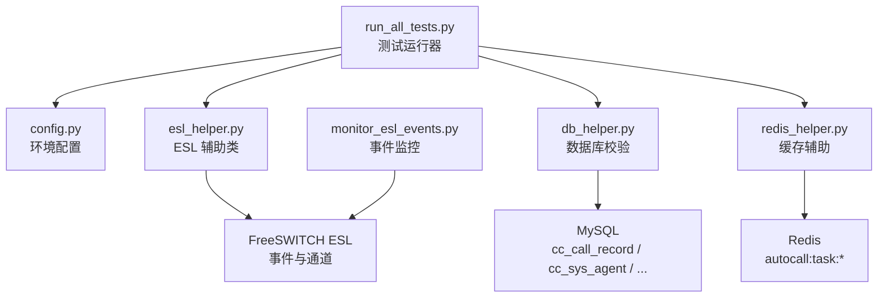
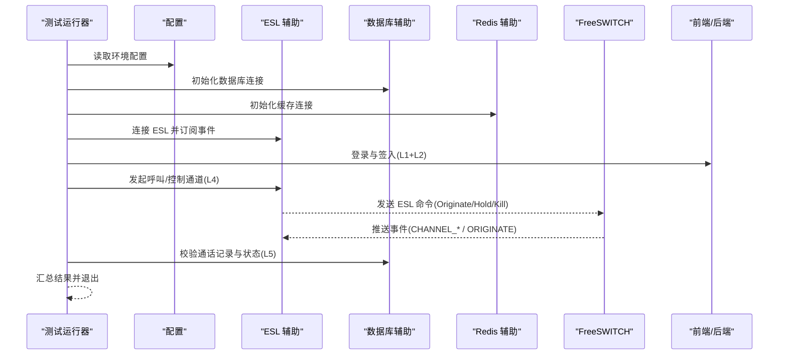
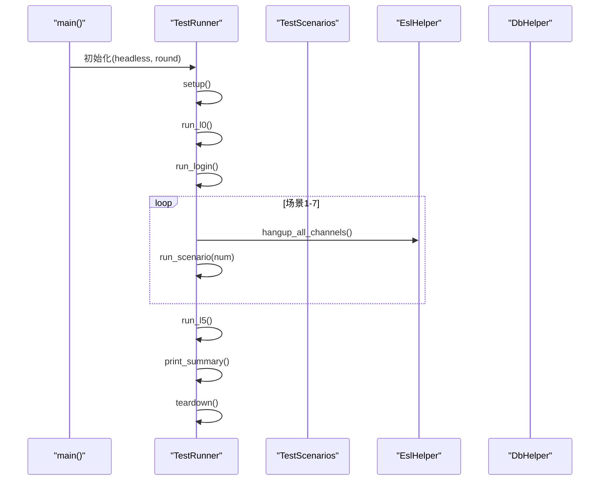
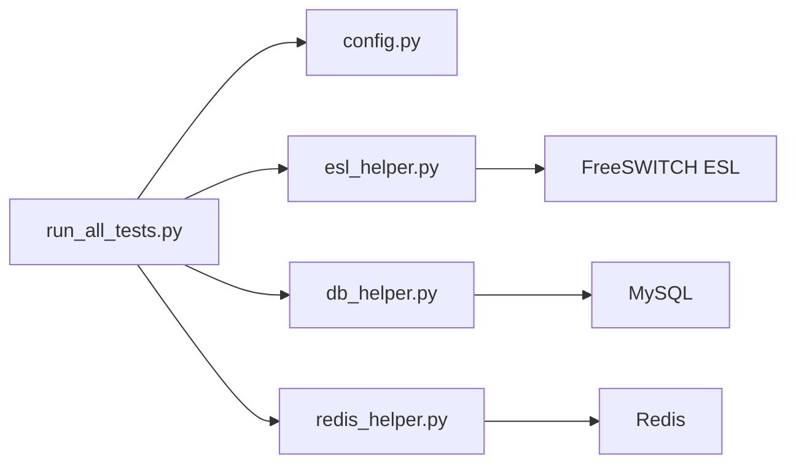

# 流程测试工具

<cite>
**本文引用的文件**
- [run_all_tests.py](file://yudao-cloud/yudao-module-cc/doc/test-all/全场景测试/run_all_tests.py)
- [config.py](file://yudao-cloud/yudao-module-cc/doc/test-all/全场景测试/config.py)
- [esl_helper.py](file://yudao-cloud/yudao-module-cc/doc/test-all/全场景测试/esl_helper.py)
- [monitor_esl_events.py](file://yudao-cloud/yudao-module-cc/doc/test-all/全场景测试/monitor_esl_events.py)
- [db_helper.py](file://yudao-cloud/yudao-module-cc/doc/test-all/全场景测试/db_helper.py)
- [redis_helper.py](file://yudao-cloud/yudao-module-cc/doc/test-all/全场景测试/redis_helper.py)
</cite>

## 目录
1. [简介](#简介)
2. [项目结构](#项目结构)
3. [核心组件](#核心组件)
4. [架构总览](#架构总览)
5. [详细组件分析](#详细组件分析)
6. [依赖关系分析](#依赖关系分析)
7. [性能与稳定性](#性能与稳定性)
8. [故障排查指南](#故障排查指南)
9. [结论](#结论)
10. [附录](#附录)

## 简介
本文件为 IVR 流程测试工具的全面技术文档，面向呼叫中心系统的端到端测试。内容覆盖：
- 单元测试框架使用（Mock 对象配置、测试用例编写、断言方法）
- 集成测试实现（FreeSWITCH 环境模拟、SIP 消息测试、端到端流程验证）
- 自动化测试脚本使用方法（批量执行、结果分析、报告生成）
- 测试数据准备与环境搭建指导
- 常见测试场景示例与故障排查方法

该工具以 Python 脚本为核心，通过 ESL 协议与 FreeSWITCH 交互，结合数据库与缓存校验，完成从登录签入到通话场景再到数据校验的完整闭环。

## 项目结构
测试套件位于 yudao-module-cc/doc/test-all/全场景测试，主要文件职责如下：
- run_all_tests.py：端到端测试主运行器，编排 L0→L1+L2→L4→L5 的执行顺序，收集并汇总结果
- config.py：集中管理本地/远程服务地址、认证信息、超时与浏览器等配置
- esl_helper.py：ESL 连接与命令封装，提供通道查询、呼叫控制、会议管理与事件订阅等待
- monitor_esl_events.py：独立的事件监控脚本，用于诊断信令与通道事件
- db_helper.py：MySQL 访问封装，提供通话记录、坐席状态、网关与路由等查询与清理能力
- redis_helper.py：Redis 访问封装，用于自动外呼任务上下文写入与清理

**图表来源**
- [run_all_tests.py:1-317](file://yudao-cloud/yudao-module-cc/doc/test-all/全场景测试/run_all_tests.py#L1-L317)
- [config.py:1-143](file://yudao-cloud/yudao-module-cc/doc/test-all/全场景测试/config.py#L1-L143)
- [esl_helper.py:1-791](file://yudao-cloud/yudao-module-cc/doc/test-all/全场景测试/esl_helper.py#L1-L791)
- [monitor_esl_events.py:1-153](file://yudao-cloud/yudao-module-cc/doc/test-all/全场景测试/monitor_esl_events.py#L1-L153)
- [db_helper.py:1-454](file://yudao-cloud/yudao-module-cc/doc/test-all/全场景测试/db_helper.py#L1-L454)
- [redis_helper.py:1-246](file://yudao-cloud/yudao-module-cc/doc/test-all/全场景测试/redis_helper.py#L1-L246)

**章节来源**
- [run_all_tests.py:1-317](file://yudao-cloud/yudao-module-cc/doc/test-all/全场景测试/run_all_tests.py#L1-L317)
- [config.py:1-143](file://yudao-cloud/yudao-module-cc/doc/test-all/全场景测试/config.py#L1-L143)

## 核心组件
- 测试运行器（TestRunner）
  - 负责按阶段执行环境检查、登录签入、通话场景与数据校验
  - 统一捕获异常、统计耗时、输出汇总，支持单场景重跑与轮次编号
- ESL 辅助类（EslHelper）
  - 基于原生 socket 实现 ESL 协议，避免第三方库安装问题
  - 提供 connect/disconnect、send_command、originate、uuid_kill、conference 管理、subscribe/wait_for_event 等能力
  - 关键设计：在 send_command 期间将事件缓存至队列，避免阻塞命令导致事件丢失
- 数据库辅助类（DbHelper）
  - 封装 MySQL 连接与常用查询，包括通话记录、坐席在线状态、网关与路由查询
  - 提供测试数据清理与状态重置能力
- Redis 辅助类（RedisHelper）
  - 封装 Redis 连接与自动外呼任务上下文操作，确保 key 前缀与 TTL 与业务一致
  - 支持幂等写入与清理，保障测试可重复执行
- 事件监控脚本（monitor_esl_events.py）
  - 独立于测试套件，用于捕获 FS 事件并输出日志，辅助定位 SIP/通道问题

**章节来源**
- [run_all_tests.py:81-257](file://yudao-cloud/yudao-module-cc/doc/test-all/全场景测试/run_all_tests.py#L81-L257)
- [esl_helper.py:35-756](file://yudao-cloud/yudao-module-cc/doc/test-all/全场景测试/esl_helper.py#L35-L756)
- [db_helper.py:28-454](file://yudao-cloud/yudao-module-cc/doc/test-all/全场景测试/db_helper.py#L28-L454)
- [redis_helper.py:28-246](file://yudao-cloud/yudao-module-cc/doc/test-all/全场景测试/redis_helper.py#L28-L246)
- [monitor_esl_events.py:34-153](file://yudao-cloud/yudao-module-cc/doc/test-all/全场景测试/monitor_esl_events.py#L34-L153)

## 架构总览
端到端测试流程分为 L0→L1+L2→L4→L5：
- L0：环境检查（FS 连通性、数据库/缓存可达性等）
- L1+L2：登录与签入（前端页面操作与 SIP 注册）
- L4：通话场景（内部呼叫、出局呼叫、IVR 入局、第三方网关呼入、保持恢复、咨询转接、自动外呼）
- L5：数据校验（通话记录生成、坐席状态一致性）

**图表来源**
- [run_all_tests.py:259-312](file://yudao-cloud/yudao-module-cc/doc/test-all/全场景测试/run_all_tests.py#L259-L312)
- [esl_helper.py:184-258](file://yudao-cloud/yudao-module-cc/doc/test-all/全场景测试/esl_helper.py#L184-L258)
- [db_helper.py:127-239](file://yudao-cloud/yudao-module-cc/doc/test-all/全场景测试/db_helper.py#L127-L239)
- [redis_helper.py:105-150](file://yudao-cloud/yudao-module-cc/doc/test-all/全场景测试/redis_helper.py#L105-L150)

## 详细组件分析

### ESL 辅助类（EslHelper）
- 连接与认证
  - 建立 TCP 连接，等待 auth/request，发送密码进行认证
- 命令与事件处理
  - send_command 发送 api 命令，循环读取响应；遇到事件则解析并缓存到 _event_queue
  - wait_for_event 优先从缓存队列查找匹配事件，再回退到 socket 读取新事件
- 通道与会话控制
  - originate 构造通道变量，支持自动外呼、出局与内部呼叫，末尾 &park() 保持通道
  - uuid_hold/uuid_kill 控制通道保持与挂断；hangup_all_channels 批量清理
- 事件订阅
  - subscribe_events 先取消旧订阅，再订阅新事件；支持 ALL 或指定事件列表

**图表来源**
- [esl_helper.py:184-258](file://yudao-cloud/yudao-module-cc/doc/test-all/全场景测试/esl_helper.py#L184-L258)

**章节来源**
- [esl_helper.py:64-122](file://yudao-cloud/yudao-module-cc/doc/test-all/全场景测试/esl_helper.py#L64-L122)
- [esl_helper.py:184-258](file://yudao-cloud/yudao-module-cc/doc/test-all/全场景测试/esl_helper.py#L184-L258)
- [esl_helper.py:361-438](file://yudao-cloud/yudao-module-cc/doc/test-all/全场景测试/esl_helper.py#L361-L438)
- [esl_helper.py:547-580](file://yudao-cloud/yudao-module-cc/doc/test-all/全场景测试/esl_helper.py#L547-L580)
- [esl_helper.py:586-756](file://yudao-cloud/yudao-module-cc/doc/test-all/全场景测试/esl_helper.py#L586-L756)

### 测试运行器（TestRunner）
- 参数解析与执行顺序
  - 支持 --headless、--scenarios、--skip-l0、--round 等参数
  - 执行顺序：setup → L0 → L1+L2 → L4（场景1-7）→ L5 → teardown
- 结果收集与汇总
  - 记录每个用例的状态（PASS/FAIL/SKIP/ERROR）、耗时与详情
  - 打印汇总统计，根据是否有失败决定退出码
- 场景间清理
  - 每场景开始前挂断所有残留通道（两个 FS 实例），等待短暂时间

**图表来源**
- [run_all_tests.py:259-312](file://yudao-cloud/yudao-module-cc/doc/test-all/全场景测试/run_all_tests.py#L259-L312)
- [run_all_tests.py:131-218](file://yudao-cloud/yudao-module-cc/doc/test-all/全场景测试/run_all_tests.py#L131-L218)

**章节来源**
- [run_all_tests.py:47-78](file://yudao-cloud/yudao-module-cc/doc/test-all/全场景测试/run_all_tests.py#L47-L78)
- [run_all_tests.py:81-257](file://yudao-cloud/yudao-module-cc/doc/test-all/全场景测试/run_all_tests.py#L81-L257)
- [run_all_tests.py:259-312](file://yudao-cloud/yudao-module-cc/doc/test-all/全场景测试/run_all_tests.py#L259-L312)

### 数据库辅助（DbHelper）
- 通话记录校验
  - 支持按 call_id、时间范围查询，统计自某时间后的记录数
  - 验证记录是否存在并匹配 caller/callee/direction/call_type
- 坐席状态管理
  - 查询/更新在线状态，支持重置离线
- 网关与路由查询
  - 查询外部网关、按名称/ID 获取网关、查询启用路由
- FS 配置查询
  - 查询 FS 实例配置，便于多实例切换与故障转移测试

**章节来源**
- [db_helper.py:127-239](file://yudao-cloud/yudao-module-cc/doc/test-all/全场景测试/db_helper.py#L127-L239)
- [db_helper.py:241-297](file://yudao-cloud/yudao-module-cc/doc/test-all/全场景测试/db_helper.py#L241-L297)
- [db_helper.py:298-427](file://yudao-cloud/yudao-module-cc/doc/test-all/全场景测试/db_helper.py#L298-L427)
- [db_helper.py:428-454](file://yudao-cloud/yudao-module-cc/doc/test-all/全场景测试/db_helper.py#L428-L454)

### Redis 辅助（RedisHelper）
- 自动外呼任务上下文
  - 写入 key 格式：autocall:task:{taskId}，TTL 24小时
  - JSON 结构包含 taskId、ivrFlow、variables、status、startTime、tenantId
- 通用操作
  - get/setex/delete 等基础能力，供扩展使用

**章节来源**
- [redis_helper.py:28-85](file://yudao-cloud/yudao-module-cc/doc/test-all/全场景测试/redis_helper.py#L28-L85)
- [redis_helper.py:105-150](file://yudao-cloud/yudao-module-cc/doc/test-all/全场景测试/redis_helper.py#L105-L150)
- [redis_helper.py:152-192](file://yudao-cloud/yudao-module-cc/doc/test-all/全场景测试/redis_helper.py#L152-L192)
- [redis_helper.py:198-246](file://yudao-cloud/yudao-module-cc/doc/test-all/全场景测试/redis_helper.py#L198-L246)

### 事件监控脚本（monitor_esl_events.py）
- 功能
  - 连接 FS ESL，订阅所有事件，过滤 CHANNEL/ORIGINATE/REINVITE 等关键字事件
  - 输出到控制台与日志文件，便于诊断
- 适用场景
  - 内部呼叫未接通、第三方网关呼入异常、自动外呼无事件等问题的定位

**章节来源**
- [monitor_esl_events.py:34-153](file://yudao-cloud/yudao-module-cc/doc/test-all/全场景测试/monitor_esl_events.py#L34-L153)

## 依赖关系分析
- 模块耦合
  - run_all_tests.py 依赖 config.py、esl_helper.py、db_helper.py、redis_helper.py
  - esl_helper.py 直接操作 FreeSWITCH ESL，不依赖第三方库
  - db_helper.py 依赖 pymysql，redis_helper.py 依赖 redis-py
- 外部依赖
  - FreeSWITCH（ESL 端口与密码）
  - MySQL（数据库名与表结构）
  - Redis（键前缀与 TTL）
  - 前端/后端服务（登录与签入）

**图表来源**
- [run_all_tests.py:1-317](file://yudao-cloud/yudao-module-cc/doc/test-all/全场景测试/run_all_tests.py#L1-L317)
- [config.py:1-143](file://yudao-cloud/yudao-module-cc/doc/test-all/全场景测试/config.py#L1-L143)
- [esl_helper.py:1-791](file://yudao-cloud/yudao-module-cc/doc/test-all/全场景测试/esl_helper.py#L1-L791)
- [db_helper.py:1-454](file://yudao-cloud/yudao-module-cc/doc/test-all/全场景测试/db_helper.py#L1-L454)
- [redis_helper.py:1-246](file://yudao-cloud/yudao-module-cc/doc/test-all/全场景测试/redis_helper.py#L1-L246)

**章节来源**
- [run_all_tests.py:1-317](file://yudao-cloud/yudao-module-cc/doc/test-all/全场景测试/run_all_tests.py#L1-L317)
- [config.py:1-143](file://yudao-cloud/yudao-module-cc/doc/test-all/全场景测试/config.py#L1-L143)

## 性能与稳定性
- 事件缓存机制
  - send_command 期间的事件被缓存到队列，避免阻塞命令导致事件丢失，提升可靠性
- 批量清理优化
  - 优先使用 hupall 批量挂断，若失败则 fallback 到逐个 uuid_kill，兼顾效率与兼容
- 超时与重试
  - 调用方设置合理超时（如 CALL_TIMEOUT=60s），减少长尾等待
  - 数据库查询失败时尝试一次重连，提高鲁棒性
- 资源隔离
  - 场景间挂断残留通道并等待短暂时间，避免状态污染

[本节为通用性能建议，不直接分析具体文件]

## 故障排查指南
- ESL 连接与认证失败
  - 检查 ESL_HOST/PORT/PASSWORD 配置是否正确
  - 确认 FreeSWITCH ESL 服务已启动且网络可达
  - 参考事件监控脚本输出，观察是否收到 auth/request 与认证成功
- 事件丢失或超时
  - 确认已正确订阅事件（event plain off 后再订阅）
  - 检查 send_command 期间的事件是否被缓存（_event_queue）
  - 使用 monitor_esl_events.py 捕获原始事件流，定位缺失环节
- 通道无法挂断或残留
  - 使用 hangup_all_channels 批量清理，必要时逐个 uuid_kill
  - 忽略 “No such channel” 错误，视为通道已自行挂断
- 数据库校验失败
  - 核对表结构与字段映射（如 cc_call_record.call_type、cc_sys_agent.name）
  - 使用 DbHelper 提供的查询接口定位记录是否存在与字段是否匹配
- Redis 任务上下文问题
  - 确认 key 前缀与 TTL 与业务一致（autocall:task:*，24小时）
  - 检查 tenantId 是否正确透传，避免挂断时 NPE 导致 CDR 保存失败

**章节来源**
- [esl_helper.py:64-122](file://yudao-cloud/yudao-module-cc/doc/test-all/全场景测试/esl_helper.py#L64-L122)
- [esl_helper.py:586-756](file://yudao-cloud/yudao-module-cc/doc/test-all/全场景测试/esl_helper.py#L586-L756)
- [monitor_esl_events.py:34-153](file://yudao-cloud/yudao-module-cc/doc/test-all/全场景测试/monitor_esl_events.py#L34-L153)
- [db_helper.py:127-239](file://yudao-cloud/yudao-module-cc/doc/test-all/全场景测试/db_helper.py#L127-L239)
- [redis_helper.py:105-150](file://yudao-cloud/yudao-module-cc/doc/test-all/全场景测试/redis_helper.py#L105-L150)

## 结论
该测试工具以清晰的阶段划分与模块化设计，实现了 IVR 流程的端到端验证。通过 ESL 事件缓存、批量清理与数据库/缓存校验，保障了测试的可靠性与可重复性。建议在 CI 中采用无头模式与只执行指定场景的方式，结合事件监控与日志分析，快速定位问题并持续回归。

[本节为总结性内容，不直接分析具体文件]

## 附录
- 使用方式
  - 全量执行：python run_all_tests.py
  - 无头模式：python run_all_tests.py --headless
  - 指定场景：python run_all_tests.py --scenarios 1,3,5
  - 跳过环境检查：python run_all_tests.py --skip-l0
  - 第二轮验证：python run_all_tests.py --round 2
- 环境配置
  - 修改 config.py 中的本地/远程服务地址、认证信息与超时
  - 确保 FreeSWITCH、MySQL、Redis 与前端/后端服务可用
- 常见场景
  - 内部呼叫、出局呼叫、IVR 入局、第三方网关呼入、保持恢复、咨询转接、自动外呼
- 报告与截图
  - 截图目录：screenshots
  - 报告目录：reports
  - 日志目录：logs

**章节来源**
- [run_all_tests.py:15-30](file://yudao-cloud/yudao-module-cc/doc/test-all/全场景测试/run_all_tests.py#L15-L30)
- [config.py:128-143](file://yudao-cloud/yudao-module-cc/doc/test-all/全场景测试/config.py#L128-L143)