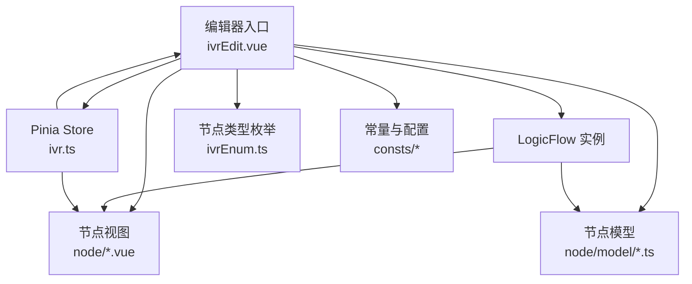
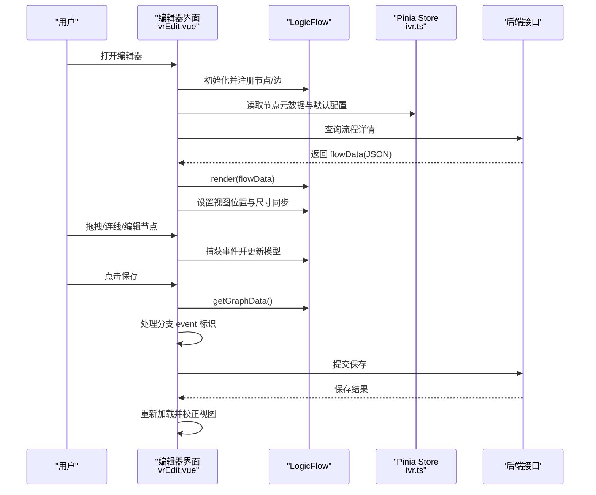
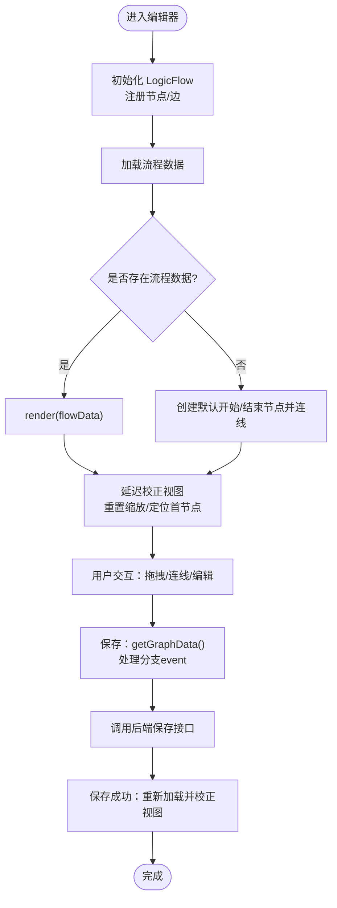
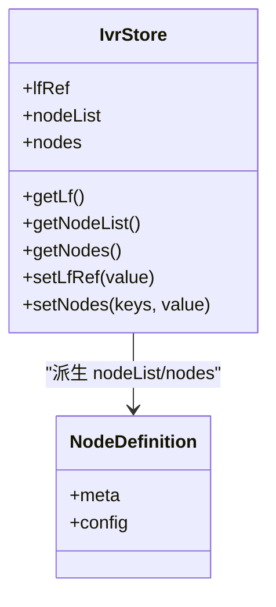
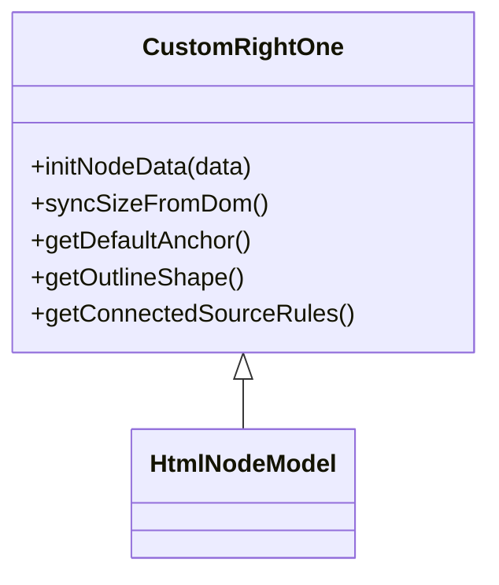
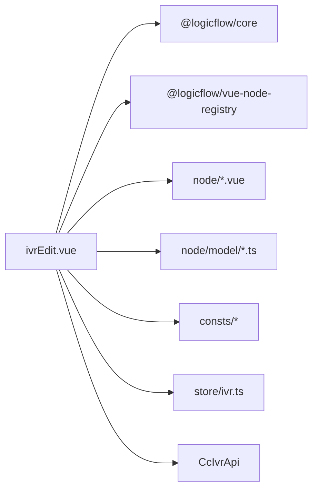

# 流程编辑器

<cite>
**本文引用的文件**
- [ivrEdit.vue](file://yudao-ui-admin-vue3/src/views/cc/ivr/ivrEdit.vue)
- [ivr.ts](file://yudao-ui-admin-vue3/src/views/cc/ivr/store/ivr.ts)
- [ivrEnum.ts](file://yudao-ui-admin-vue3/src/views/cc/ivr/consts/ivrEnum.ts)
- [start.vue](file://yudao-ui-admin-vue3/src/views/cc/ivr/node/start.vue)
- [customRightOne.ts](file://yudao-ui-admin-vue3/src/views/cc/ivr/node/model/customRightOne.ts)
- [conditionOperator.ts](file://yudao-ui-admin-vue3/src/views/cc/ivr/consts/conditionOperator.ts)
- [nodeOutputs.ts](file://yudao-ui-admin-vue3/src/views/cc/ivr/consts/nodeOutputs.ts)
</cite>

## 目录
1. [简介](#简介)
2. [项目结构](#项目结构)
3. [核心组件](#核心组件)
4. [架构总览](#架构总览)
5. [详细组件分析](#详细组件分析)
6. [依赖关系分析](#依赖关系分析)
7. [性能与稳定性](#性能与稳定性)
8. [故障排查指南](#故障排查指南)
9. [结论](#结论)
10. [附录：数据模型与前后端协议](#附录数据模型与前后端协议)

## 简介
本文件为 IVR 流程编辑器的技术文档，聚焦可视化拖拽编辑器的实现原理、节点渲染机制、画布操作、流程 CRUD 接口调用、节点类型定义系统（属性配置、连接关系管理、流程验证规则）、使用示例与自定义节点开发指南，并给出流程图数据结构设计与前后端交互协议。

## 项目结构
IVR 编辑器位于前端 Vue3 工程中的 cc 模块下，核心文件包括：
- 编辑器主容器与 LogicFlow 初始化：ivrEdit.vue
- 状态与节点元数据集中管理：store/ivr.ts
- 节点类型枚举：consts/ivrEnum.ts
- 具体节点视图与模型：node/*.vue 与 node/model/*.ts
- 条件算子与输出常量：consts/conditionOperator.ts、consts/nodeOutputs.ts

图表来源
- [ivrEdit.vue:176-409](file://yudao-ui-admin-vue3/src/views/cc/ivr/ivrEdit.vue#L176-L409)
- [ivr.ts:283-352](file://yudao-ui-admin-vue3/src/views/cc/ivr/store/ivr.ts#L283-L352)
- [ivrEnum.ts:1-11](file://yudao-ui-admin-vue3/src/views/cc/ivr/consts/ivrEnum.ts#L1-L11)

章节来源
- [ivrEdit.vue:1-793](file://yudao-ui-admin-vue3/src/views/cc/ivr/ivrEdit.vue#L1-L793)
- [ivr.ts:1-362](file://yudao-ui-admin-vue3/src/views/cc/ivr/store/ivr.ts#L1-L362)
- [ivrEnum.ts:1-11](file://yudao-ui-admin-vue3/src/views/cc/ivr/consts/ivrEnum.ts#L1-L11)

## 核心组件
- 编辑器主容器 ivrEdit.vue
  - 基于 LogicFlow 构建可视化画布，注册多种 IVR 节点（开始、结束、放音、转接、收号、判断器、方法）。
  - 提供“添加组件”弹窗，支持点击添加与拖拽添加两种模式。
  - 监听画布事件完成连线文本填充、边样式切换、尺寸同步等。
  - 负责保存时导出图数据、处理分支事件标识、调用后端保存接口。
- 状态 store ivr.ts
  - 集中维护节点元数据、默认配置、节点列表与画布引用。
  - 通过 getters/actions 暴露节点配置与画布实例访问。
- 节点类型 ivrEnum.ts
  - 统一定义所有节点类型字符串常量，保证前后端一致。
- 节点视图 start.vue
  - 展示节点表单（如 ASR/TTS 引擎选择），更新节点属性。
  - 提供复制、删除等操作。
- 节点模型 customRightOne.ts
  - 继承 HtmlNodeModel，强制从真实 DOM 同步尺寸，限制单右锚点出边，修正轮廓形状。

章节来源
- [ivrEdit.vue:176-409](file://yudao-ui-admin-vue3/src/views/cc/ivr/ivrEdit.vue#L176-L409)
- [ivr.ts:75-264](file://yudao-ui-admin-vue3/src/views/cc/ivr/store/ivr.ts#L75-L264)
- [ivrEnum.ts:1-11](file://yudao-ui-admin-vue3/src/views/cc/ivr/consts/ivrEnum.ts#L1-L11)
- [start.vue:67-160](file://yudao-ui-admin-vue3/src/views/cc/ivr/node/start.vue#L67-L160)
- [customRightOne.ts:1-81](file://yudao-ui-admin-vue3/src/views/cc/ivr/node/model/customRightOne.ts#L1-L81)

## 架构总览
编辑器采用“Vue + LogicFlow + Pinia”的架构：
- 视图层：Vue 组件负责 UI 与用户交互。
- 图形引擎：LogicFlow 负责节点/边的渲染、拖拽、缩放、平移、锚点与连线。
- 状态层：Pinia 统一管理节点元数据、默认配置与画布实例。
- 数据层：通过 API 调用获取/保存流程图 JSON 数据。

图表来源
- [ivrEdit.vue:176-409](file://yudao-ui-admin-vue3/src/views/cc/ivr/ivrEdit.vue#L176-L409)
- [ivrEdit.vue:416-574](file://yudao-ui-admin-vue3/src/views/cc/ivr/ivrEdit.vue#L416-L574)
- [ivr.ts:283-352](file://yudao-ui-admin-vue3/src/views/cc/ivr/store/ivr.ts#L283-L352)

## 详细组件分析

### 编辑器主容器 ivrEdit.vue
- 初始化 LogicFlow
  - 配置网格、背景、锚点样式、边类型、键盘行为、轮廓等。
  - 注册自定义边与多个节点（开始、结束、放音、转接、收号、判断器、方法）。
- 拖拽与添加节点
  - 支持“点击添加”和“拖拽添加”，通过移动距离阈值区分。
  - 对开始/结束节点进行全局唯一性校验。
- 画布事件处理
  - 锚点拖拽自动填充连线文本（菜单按钮值）。
  - 鼠标悬停边显示删除按钮（切换边类型）。
  - 缩放/平移后防抖同步节点尺寸，避免锚点与连线错位。
- 数据回显与视图校正
  - 加载流程数据后，延迟执行 fitView 策略：重置缩放至 100%，定位首个节点到视口合适位置，再触发重渲染以对齐 SVG 与 HTML 层。
- 保存逻辑
  - 导出图数据，处理判断器分支事件标识（IF/ELSE_IF_n/ELSE）与其他边的 next 事件。
  - 调用后端接口保存，成功后重新加载并校正视图。

图表来源
- [ivrEdit.vue:176-409](file://yudao-ui-admin-vue3/src/views/cc/ivr/ivrEdit.vue#L176-L409)
- [ivrEdit.vue:416-574](file://yudao-ui-admin-vue3/src/views/cc/ivr/ivrEdit.vue#L416-L574)

章节来源
- [ivrEdit.vue:1-793](file://yudao-ui-admin-vue3/src/views/cc/ivr/ivrEdit.vue#L1-L793)

### 状态与节点元数据 store/ivr.ts
- 统一节点定义
  - 集中定义所有节点的 meta（名称、描述、图标、业务类型）与 config（默认坐标、properties）。
  - 派生 nodeList（用于侧边栏展示）与 nodes（用于画布添加时的默认配置）。
- 状态管理
  - 维护 lfRef（画布实例）、nodeList、nodes。
  - 提供 getters 访问节点列表与配置，actions 设置画布引用与节点配置。

图表来源
- [ivr.ts:75-264](file://yudao-ui-admin-vue3/src/views/cc/ivr/store/ivr.ts#L75-L264)
- [ivr.ts:283-352](file://yudao-ui-admin-vue3/src/views/cc/ivr/store/ivr.ts#L283-L352)

章节来源
- [ivr.ts:1-362](file://yudao-ui-admin-vue3/src/views/cc/ivr/store/ivr.ts#L1-L362)

### 节点类型与枚举 consts/ivrEnum.ts
- 定义节点类型常量：开始、结束、放音、转接、收号、判断器、方法。
- 作为前后端约定键值，确保一致性。

章节来源
- [ivrEnum.ts:1-11](file://yudao-ui-admin-vue3/src/views/cc/ivr/consts/ivrEnum.ts#L1-L11)

### 节点视图与模型
- 节点视图 start.vue
  - 表单字段：ASR 引擎、TTS 引擎、输出值列表。
  - 操作：复制、删除；更新节点属性。
  - 事件防护：阻止表单事件冒泡，避免与 LogicFlow 拖拽冲突。
- 节点模型 customRightOne.ts
  - 继承 HtmlNodeModel，禁用文本编辑与拖动。
  - 强制从真实 DOM 同步尺寸，修正缩放导致的偏差。
  - 定义右侧单锚点，限制仅允许一条出边。
  - 修正轮廓形状，提升选中视觉效果。

图表来源
- [customRightOne.ts:1-81](file://yudao-ui-admin-vue3/src/views/cc/ivr/node/model/customRightOne.ts#L1-L81)

章节来源
- [start.vue:67-160](file://yudao-ui-admin-vue3/src/views/cc/ivr/node/start.vue#L67-L160)
- [customRightOne.ts:1-81](file://yudao-ui-admin-vue3/src/views/cc/ivr/node/model/customRightOne.ts#L1-L81)

### 条件与输出常量
- conditionOperator.ts：条件算子定义（如等于、包含、大于等），供判断器节点使用。
- nodeOutputs.ts：各节点输出变量定义，便于在后续节点中引用。

章节来源
- [conditionOperator.ts](file://yudao-ui-admin-vue3/src/views/cc/ivr/consts/conditionOperator.ts)
- [nodeOutputs.ts](file://yudao-ui-admin-vue3/src/views/cc/ivr/consts/nodeOutputs.ts)

## 依赖关系分析
- ivrEdit.vue 依赖：
  - LogicFlow 核心库与 Vue 节点注册扩展。
  - 节点视图与模型（开始、结束、放音、转接、收号、判断器、方法）。
  - 常量（节点类型、条件算子、输出变量）。
  - Pinia Store（节点元数据与画布实例）。
  - 后端 API（流程详情查询与保存）。
- 耦合与内聚：
  - 节点视图与模型解耦于编辑器主容器，通过 LogicFlow 注册机制集成。
  - 节点元数据集中在 store，降低重复定义与不一致风险。
  - 常量集中管理，便于扩展与维护。

图表来源
- [ivrEdit.vue:53-79](file://yudao-ui-admin-vue3/src/views/cc/ivr/ivrEdit.vue#L53-L79)
- [ivr.ts:283-352](file://yudao-ui-admin-vue3/src/views/cc/ivr/store/ivr.ts#L283-L352)

章节来源
- [ivrEdit.vue:1-793](file://yudao-ui-admin-vue3/src/views/cc/ivr/ivrEdit.vue#L1-L793)
- [ivr.ts:1-362](file://yudao-ui-admin-vue3/src/views/cc/ivr/store/ivr.ts#L1-L362)

## 性能与稳定性
- 缩放与尺寸同步
  - 使用防抖函数在 graph:transform 后延迟同步节点尺寸，减少高频触发带来的抖动与性能开销。
  - 新增节点后立即同步一次尺寸，避免首次渲染尺寸偏差导致锚点与连线错位。
- 视图校正时序
  - 延迟执行视图校正，等待 Vue 组件挂载后再计算 bounds，避免初始 0 尺寸导致的错误布局。
  - 固定缩放至 100% 并定位首节点，提升可读性与用户体验。
- 事件冲突防护
  - 安装全局表单交互守护者，拦截表单交互期间的 pointermove/mousemove，防止 LogicFlow 误判拖拽。
- 健壮性
  - 尺寸同步异常静默降级，不影响其他节点与画布交互。

章节来源
- [ivrEdit.vue:80-136](file://yudao-ui-admin-vue3/src/views/cc/ivr/ivrEdit.vue#L80-L136)
- [ivrEdit.vue:342-400](file://yudao-ui-admin-vue3/src/views/cc/ivr/ivrEdit.vue#L342-L400)
- [ivrEdit.vue:416-476](file://yudao-ui-admin-vue3/src/views/cc/ivr/ivrEdit.vue#L416-L476)

## 故障排查指南
- 节点尺寸错位或锚点偏移
  - 检查是否触发了 graph:transform 后的尺寸同步逻辑。
  - 确认 syncSizeFromDom 是否正确从真实 DOM 读取宽高。
- 连线文本未正确填充
  - 检查 anchor:drop 事件处理逻辑，确认 sourceNodeId 与 properties.menuButtons 索引解析。
- 保存后视图错乱
  - 确认保存前已同步节点尺寸，保存成功后重新加载并执行视图校正。
- 表单控件无法激活或双击才生效
  - 确认全局表单交互守护者已安装，且在表单交互期间正确拦截 move 事件。

章节来源
- [ivrEdit.vue:320-332](file://yudao-ui-admin-vue3/src/views/cc/ivr/ivrEdit.vue#L320-L332)
- [ivrEdit.vue:342-400](file://yudao-ui-admin-vue3/src/views/cc/ivr/ivrEdit.vue#L342-L400)
- [ivrEdit.vue:416-574](file://yudao-ui-admin-vue3/src/views/cc/ivr/ivrEdit.vue#L416-L574)

## 结论
该 IVR 流程编辑器基于 LogicFlow 实现了可视化拖拽编辑、节点渲染与画布操作，并通过 Pinia 集中管理节点元数据与默认配置。编辑器在处理缩放、尺寸同步、视图校正等方面具备完善的性能与稳定性保障。节点类型定义系统与连接关系管理清晰，便于扩展新节点与复杂分支逻辑。结合前后端协议，可实现流程的完整 CRUD 与版本管理。

## 附录：数据模型与前后端协议

### 流程图数据结构设计
- 节点
  - id：唯一标识
  - type：节点类型（参考 ivrEnum.ts）
  - x/y：画布坐标
  - width/height：节点尺寸（由 HTML 内容决定）
  - properties：节点属性（因节点类型而异）
- 边
  - id：唯一标识
  - sourceNodeId/targetNodeId：源/目标节点 ID
  - sourceAnchorId/targetAnchorId：锚点 ID（如 right/left 或带索引的锚点）
  - text：边文本（如菜单按钮值或分支标签）
  - event：事件标识（如 next、next_IF、next_ELSE_IF_n、next_ELSE）

章节来源
- [ivrEdit.vue:516-574](file://yudao-ui-admin-vue3/src/views/cc/ivr/ivrEdit.vue#L516-L574)
- [ivrEnum.ts:1-11](file://yudao-ui-admin-vue3/src/views/cc/ivr/consts/ivrEnum.ts#L1-L11)

### 前后端交互协议
- 查询流程详情
  - 接口：CcIvrApi.getDetail(id)
  - 返回：{ flowData: string(JSON), updateTime: string }
- 保存流程
  - 接口：CcIvrApi.editIvr(formState)
  - 请求体：formState = { id, flowData: string(JSON), updateTime }
  - 返回：布尔或业务对象（根据实际实现）

章节来源
- [ivrEdit.vue:416-419](file://yudao-ui-admin-vue3/src/views/cc/ivr/ivrEdit.vue#L416-L419)
- [ivrEdit.vue:516-574](file://yudao-ui-admin-vue3/src/views/cc/ivr/ivrEdit.vue#L516-L574)

### 节点属性配置与连接关系管理
- 节点属性
  - 开始节点：asrEngine、ttEngine、name、businessType
  - 结束节点：playbackType、fileId、content、num、name、businessType
  - 放音节点：playbackType、fileId、content、num、name、businessType
  - 转接节点：routeType、routeValue、routeNumber、pre/fail/conn 播放配置、name、businessType
  - 收号节点：playbackType、fileId、content、num、interruptible、firstDigitTimeout、interDigitTimeout、debounceInterval、endKey、name、businessType
  - 判断器节点：branches（含 IF/ELSE_IF/ELSE 及条件数组）、name、businessType
  - 方法节点：method、playbackType、fileId、content、num、name、businessType
- 连接关系
  - 开始节点：仅允许一个右出锚点
  - 判断器节点：动态锚点，按分支数量生成
  - 其他节点：双边锚点但限制右出边数量（如单右出）

章节来源
- [ivr.ts:75-264](file://yudao-ui-admin-vue3/src/views/cc/ivr/store/ivr.ts#L75-L264)
- [customRightOne.ts:38-77](file://yudao-ui-admin-vue3/src/views/cc/ivr/node/model/customRightOne.ts#L38-L77)

### 编辑器使用示例
- 新建流程
  - 打开编辑器，默认创建开始与结束节点并连线。
  - 从“添加组件”弹窗拖拽所需节点到画布，连接形成流程。
- 编辑节点
  - 点击节点弹出操作菜单，可复制或删除。
  - 在节点表单中修改属性（如选择 ASR/TTS 引擎、配置播放内容等）。
- 保存与回显
  - 点击保存，系统将导出图数据并调用后端接口。
  - 保存成功后重新加载流程，校正视图以便查看。

章节来源
- [ivrEdit.vue:477-509](file://yudao-ui-admin-vue3/src/views/cc/ivr/ivrEdit.vue#L477-L509)
- [ivrEdit.vue:516-574](file://yudao-ui-admin-vue3/src/views/cc/ivr/ivrEdit.vue#L516-L574)

### 自定义节点开发指南
- 步骤
  - 定义节点类型：在 ivrEnum.ts 中添加新类型。
  - 编写节点视图：创建 Vue 组件，实现表单与交互逻辑。
  - 编写节点模型：继承 HtmlNodeModel，实现尺寸同步、锚点定义、连接规则与轮廓形状。
  - 注册节点：在 ivrEdit.vue 中使用 register 将类型、组件、视图与模型关联。
  - 配置默认属性：在 store/ivr.ts 的 allNodeDefinitions 中添加新节点的 meta 与 config。
- 注意事项
  - 确保尺寸同步逻辑正确，避免缩放后锚点与连线错位。
  - 合理设置连接规则，防止非法连线。
  - 使用常量与枚举，保持前后端一致性。

章节来源
- [ivrEdit.vue:236-299](file://yudao-ui-admin-vue3/src/views/cc/ivr/ivrEdit.vue#L236-L299)
- [ivr.ts:75-264](file://yudao-ui-admin-vue3/src/views/cc/ivr/store/ivr.ts#L75-L264)
- [customRightOne.ts:1-81](file://yudao-ui-admin-vue3/src/views/cc/ivr/node/model/customRightOne.ts#L1-L81)