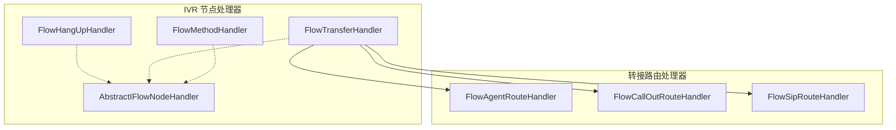
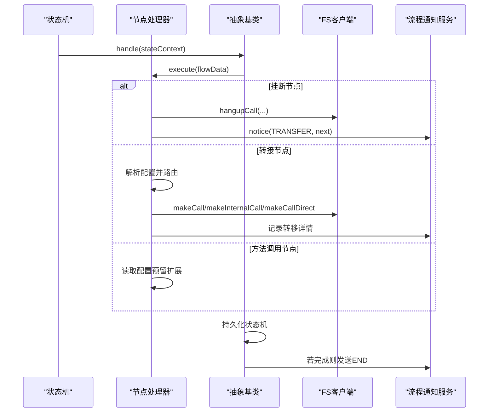
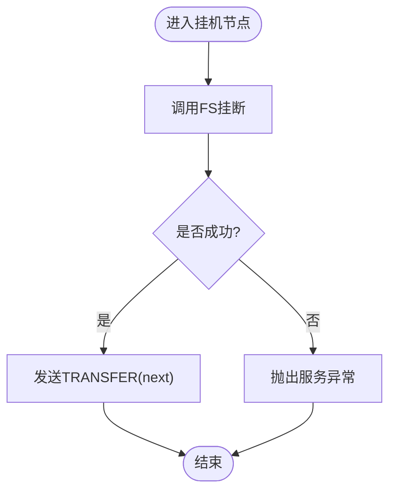
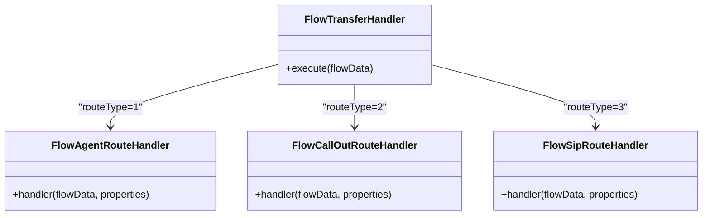
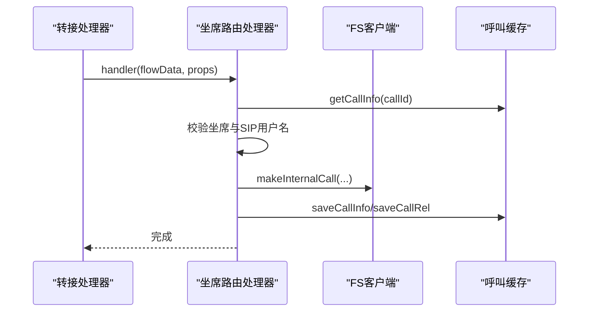
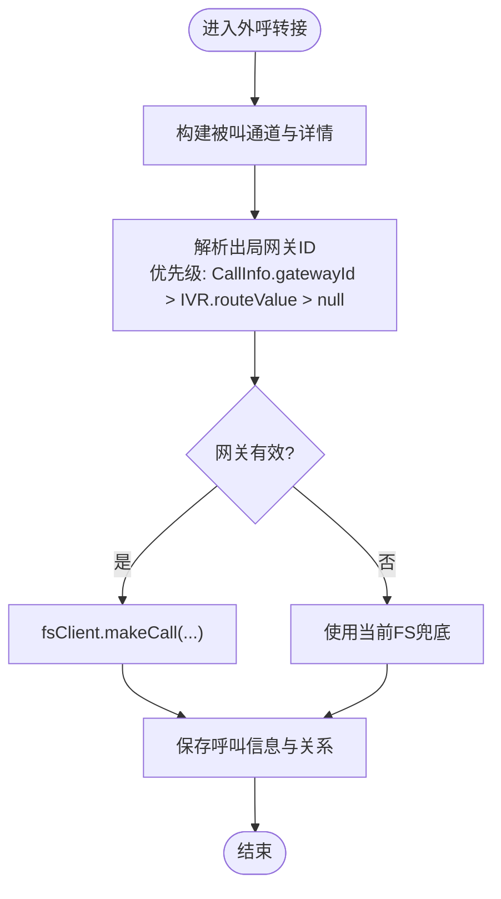
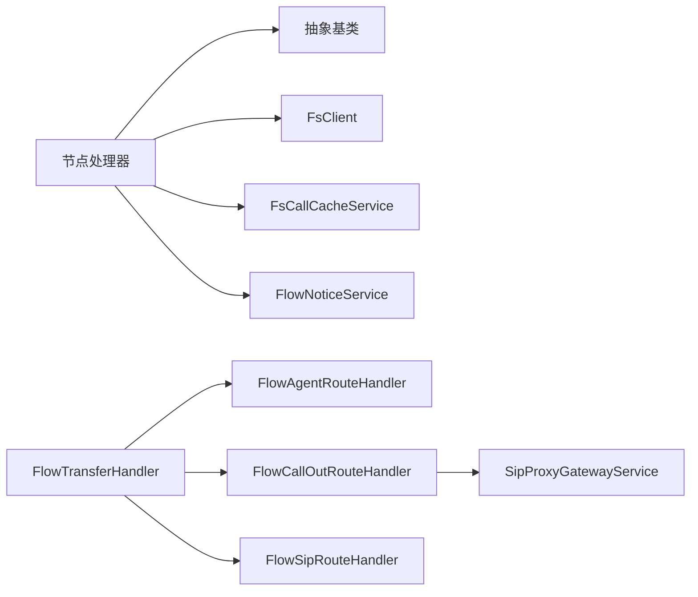

# 呼叫控制处理器

<cite>
**本文引用的文件**
- [FlowHangUpHandler.java](file://yudao-cloud/yudao-module-cc/yudao-module-cc-server/src/main/java/cn/iocoder/yudao/module/cc/ivr/handler/node/FlowHangUpHandler.java)
- [FlowTransferHandler.java](file://yudao-cloud/yudao-module-cc/yudao-module-cc-server/src/main/java/cn/iocoder/yudao/module/cc/ivr/handler/node/FlowTransferHandler.java)
- [FlowMethodHandler.java](file://yudao-cloud/yudao-module-cc/yudao-module-cc-server/src/main/java/cn/iocoder/yudao/module/cc/ivr/handler/node/FlowMethodHandler.java)
- [AbstractIFlowNodeHandler.java](file://yudao-cloud/yudao-module-cc/yudao-module-cc-server/src/main/java/cn/iocoder/yudao/module/cc/ivr/handler/node/AbstractIFlowNodeHandler.java)
- [FlowAgentRouteHandler.java](file://yudao-cloud/yudao-module-cc/yudao-module-cc-server/src/main/java/cn/iocoder/yudao/module/cc/ivr/handler/route/FlowAgentRouteHandler.java)
- [FlowCallOutRouteHandler.java](file://yudao-cloud/yudao-module-cc/yudao-module-cc-server/src/main/java/cn/iocoder/yudao/module/cc/ivr/handler/route/FlowCallOutRouteHandler.java)
- [FlowSipRouteHandler.java](file://yudao-cloud/yudao-module-cc/yudao-module-cc-server/src/main/java/cn/iocoder/yudao/module/cc/ivr/handler/route/FlowSipRouteHandler.java)
</cite>

## 目录
1. [简介](#简介)
2. [项目结构](#项目结构)
3. [核心组件](#核心组件)
4. [架构总览](#架构总览)
5. [详细组件分析](#详细组件分析)
6. [依赖关系分析](#依赖关系分析)
7. [性能考虑](#性能考虑)
8. [故障排查指南](#故障排查指南)
9. [结论](#结论)
10. [附录：集成示例](#附录：集成示例)

## 简介
本文件面向呼叫控制处理器，聚焦以下能力：
- 挂断处理 FlowHangUpHandler：通话终止机制（正常挂断、异常中断、资源清理）
- 转接处理 FlowTransferHandler：坐席转接、队列转接、外部号码转接等场景
- 方法调用 FlowMethodHandler：远程服务集成（REST API、消息队列、数据库操作）的扩展点
- 呼叫状态管理：通话状态跟踪、超时控制与重试策略
- 错误处理方案：网络异常、服务不可用、超时处理
- 完整集成示例：与第三方系统的呼叫控制交互

## 项目结构
呼叫控制相关代码位于 yudao-module-cc-server 模块中，采用“节点处理器 + 路由处理器”的分层设计：
- 节点处理器：实现 IVR 流程中的具体动作（如挂断、转接、方法调用）
- 路由处理器：在转接节点下按不同目标类型分发到具体实现（坐席、外呼、SIP 等）
- 抽象基类：统一状态机持久化、通知、异常处理与上下文获取

图表来源
- [FlowHangUpHandler.java:1-37](file://yudao-cloud/yudao-module-cc/yudao-module-cc-server/src/main/java/cn/iocoder/yudao/module/cc/ivr/handler/node/FlowHangUpHandler.java#L1-L37)
- [FlowTransferHandler.java:1-69](file://yudao-cloud/yudao-module-cc/yudao-module-cc-server/src/main/java/cn/iocoder/yudao/module/cc/ivr/handler/node/FlowTransferHandler.java#L1-L69)
- [FlowMethodHandler.java:1-25](file://yudao-cloud/yudao-module-cc/yudao-module-cc-server/src/main/java/cn/iocoder/yudao/module/cc/ivr/handler/node/FlowMethodHandler.java#L1-L25)
- [AbstractIFlowNodeHandler.java:1-80](file://yudao-cloud/yudao-module-cc/yudao-module-cc-server/src/main/java/cn/iocoder/yudao/module/cc/ivr/handler/node/AbstractIFlowNodeHandler.java#L1-L80)
- [FlowAgentRouteHandler.java:1-135](file://yudao-cloud/yudao-module-cc/yudao-module-cc-server/src/main/java/cn/iocoder/yudao/module/cc/ivr/handler/route/FlowAgentRouteHandler.java#L1-L135)
- [FlowCallOutRouteHandler.java:1-169](file://yudao-cloud/yudao-module-cc/yudao-module-cc-server/src/main/java/cn/iocoder/yudao/module/cc/ivr/handler/route/FlowCallOutRouteHandler.java#L1-L169)
- [FlowSipRouteHandler.java:1-62](file://yudao-cloud/yudao-module-cc/yudao-module-cc-server/src/main/java/cn/iocoder/yudao/module/cc/ivr/handler/route/FlowSipRouteHandler.java#L1-L62)

章节来源
- [FlowHangUpHandler.java:1-37](file://yudao-cloud/yudao-module-cc/yudao-module-cc-server/src/main/java/cn/iocoder/yudao/module/cc/ivr/handler/node/FlowHangUpHandler.java#L1-L37)
- [FlowTransferHandler.java:1-69](file://yudao-cloud/yudao-module-cc/yudao-module-cc-server/src/main/java/cn/iocoder/yudao/module/cc/ivr/handler/node/FlowTransferHandler.java#L1-L69)
- [FlowMethodHandler.java:1-25](file://yudao-cloud/yudao-module-cc/yudao-module-cc-server/src/main/java/cn/iocoder/yudao/module/cc/ivr/handler/node/FlowMethodHandler.java#L1-L25)
- [AbstractIFlowNodeHandler.java:1-80](file://yudao-cloud/yudao-module-cc/yudao-module-cc-server/src/main/java/cn/iocoder/yudao/module/cc/ivr/handler/node/AbstractIFlowNodeHandler.java#L1-L80)

## 核心组件
- FlowHangUpHandler：负责挂机节点执行，调用底层 FS 客户端挂断并发送流程事件通知。
- FlowTransferHandler：根据配置将呼叫转接到坐席、外呼、SIP、坐席组等不同目标。
- FlowMethodHandler：预留方法调用节点，用于后续扩展 REST/MQ/DB 等外部系统调用。
- AbstractIFlowNodeHandler：统一封装状态机持久化、异常捕获、流程结束通知、上下文获取等通用逻辑。
- 路由处理器族：分别实现坐席转接、外呼转接、SIP 转接的具体业务细节。

章节来源
- [FlowHangUpHandler.java:19-36](file://yudao-cloud/yudao-module-cc/yudao-module-cc-server/src/main/java/cn/iocoder/yudao/module/cc/ivr/handler/node/FlowHangUpHandler.java#L19-L36)
- [FlowTransferHandler.java:21-66](file://yudao-cloud/yudao-module-cc/yudao-module-cc-server/src/main/java/cn/iocoder/yudao/module/cc/ivr/handler/node/FlowTransferHandler.java#L21-L66)
- [FlowMethodHandler.java:11-24](file://yudao-cloud/yudao-module-cc/yudao-module-cc-server/src/main/java/cn/iocoder/yudao/module/cc/ivr/handler/node/FlowMethodHandler.java#L11-L24)
- [AbstractIFlowNodeHandler.java:24-79](file://yudao-cloud/yudao-module-cc/yudao-module-cc-server/src/main/java/cn/iocoder/yudao/module/cc/ivr/handler/node/AbstractIFlowNodeHandler.java#L24-L79)

## 架构总览
IVR 流程通过 Spring State Machine 驱动，节点处理器实现具体动作；转接节点根据配置路由到对应处理器；所有节点在执行前后由抽象基类完成状态持久化与生命周期通知。

图表来源
- [AbstractIFlowNodeHandler.java:50-72](file://yudao-cloud/yudao-module-cc/yudao-module-cc-server/src/main/java/cn/iocoder/yudao/module/cc/ivr/handler/node/AbstractIFlowNodeHandler.java#L50-L72)
- [FlowHangUpHandler.java:26-35](file://yudao-cloud/yudao-module-cc/yudao-module-cc-server/src/main/java/cn/iocoder/yudao/module/cc/ivr/handler/node/FlowHangUpHandler.java#L26-L35)
- [FlowTransferHandler.java:45-66](file://yudao-cloud/yudao-module-cc/yudao-module-cc-server/src/main/java/cn/iocoder/yudao/module/cc/ivr/handler/node/FlowTransferHandler.java#L45-L66)
- [FlowMethodHandler.java:17-23](file://yudao-cloud/yudao-module-cc/yudao-module-cc-server/src/main/java/cn/iocoder/yudao/module/cc/ivr/handler/node/FlowMethodHandler.java#L17-L23)

## 详细组件分析

### 挂断处理 FlowHangUpHandler
- 功能要点
  - 调用 FS 客户端挂断当前通道
  - 发送 TRANSFER 事件通知（next），表示流程继续或结束
  - 异常时抛出服务异常，由抽象基类统一处理并触发 END 通知
- 数据流
  - 从 FlowDataContext 获取地址、callId、uniqueId
  - 挂断后通过 FlowNoticeService 通知上层流程
- 资源清理
  - 挂断释放媒体与信令资源
  - 状态机完成后由抽象基类发送 END 通知

图表来源
- [FlowHangUpHandler.java:26-35](file://yudao-cloud/yudao-module-cc/yudao-module-cc-server/src/main/java/cn/iocoder/yudao/module/cc/ivr/handler/node/FlowHangUpHandler.java#L26-L35)
- [AbstractIFlowNodeHandler.java:50-72](file://yudao-cloud/yudao-module-cc/yudao-module-cc-server/src/main/java/cn/iocoder/yudao/module/cc/ivr/handler/node/AbstractIFlowNodeHandler.java#L50-L72)

章节来源
- [FlowHangUpHandler.java:19-36](file://yudao-cloud/yudao-module-cc/yudao-module-cc-server/src/main/java/cn/iocoder/yudao/module/cc/ivr/handler/node/FlowHangUpHandler.java#L19-L36)
- [AbstractIFlowNodeHandler.java:50-72](file://yudao-cloud/yudao-module-cc/yudao-module-cc-server/src/main/java/cn/iocoder/yudao/module/cc/ivr/handler/node/AbstractIFlowNodeHandler.java#L50-L72)

### 转接处理 FlowTransferHandler
- 功能要点
  - 解析节点配置 FlowTransferNodeProperties
  - 根据 routeType 分发到不同路由处理器：
    - 1：坐席转接（FlowAgentRouteHandler）
    - 2：外呼转接（FlowCallOutRouteHandler）
    - 3：SIP 转接（FlowSipRouteHandler）
    - 4：坐席组转接（FlowAgentGroupRouteHandler）
- 校验规则
  - routeValue 非空要求（除外呼允许为空，走号码分析驱动）
  - 配置缺失或非法时抛出服务异常
- 典型场景
  - 坐席转接：内部 SIP 代理寻址，创建被叫通道，发起 originate
  - 外呼转接：按优先级解析出局网关（CallInfo.gatewayId > IVR.routeValue > null），调用 fsClient.makeCall
  - SIP 转接：直接指定目标 SIP 地址，调用 fsClient.makeCallDirect

图表来源
- [FlowTransferHandler.java:45-66](file://yudao-cloud/yudao-module-cc/yudao-module-cc-server/src/main/java/cn/iocoder/yudao/module/cc/ivr/handler/node/FlowTransferHandler.java#L45-L66)
- [FlowAgentRouteHandler.java:54-133](file://yudao-cloud/yudao-module-cc/yudao-module-cc-server/src/main/java/cn/iocoder/yudao/module/cc/ivr/handler/route/FlowAgentRouteHandler.java#L54-L133)
- [FlowCallOutRouteHandler.java:60-96](file://yudao-cloud/yudao-module-cc/yudao-module-cc-server/src/main/java/cn/iocoder/yudao/module/cc/ivr/handler/route/FlowCallOutRouteHandler.java#L60-L96)
- [FlowSipRouteHandler.java:30-60](file://yudao-cloud/yudao-module-cc/yudao-module-cc-server/src/main/java/cn/iocoder/yudao/module/cc/ivr/handler/route/FlowSipRouteHandler.java#L30-L60)

章节来源
- [FlowTransferHandler.java:21-66](file://yudao-cloud/yudao-module-cc/yudao-module-cc-server/src/main/java/cn/iocoder/yudao/module/cc/ivr/handler/node/FlowTransferHandler.java#L21-L66)
- [FlowAgentRouteHandler.java:37-135](file://yudao-cloud/yudao-module-cc/yudao-module-cc-server/src/main/java/cn/iocoder/yudao/module/cc/ivr/handler/route/FlowAgentRouteHandler.java#L37-L135)
- [FlowCallOutRouteHandler.java:25-169](file://yudao-cloud/yudao-module-cc/yudao-module-cc-server/src/main/java/cn/iocoder/yudao/module/cc/ivr/handler/route/FlowCallOutRouteHandler.java#L25-L169)
- [FlowSipRouteHandler.java:19-62](file://yudao-cloud/yudao-module-cc/yudao-module-cc-server/src/main/java/cn/iocoder/yudao/module/cc/ivr/handler/route/FlowSipRouteHandler.java#L19-L62)

#### 坐席转接 FlowAgentRouteHandler
- 关键流程
  - 查询呼叫信息，校验坐席存在性与 SIP 用户名配置
  - 构建被叫通道，设置方向与关联 uniqueId
  - 通过 SIP 代理公网地址发起内部呼叫 originate
  - 更新话单详情与响铃时间，保存呼叫信息与关系
- 异常处理
  - 未找到呼叫信息或坐席配置缺失时挂断并通知结束

图表来源
- [FlowAgentRouteHandler.java:54-133](file://yudao-cloud/yudao-module-cc/yudao-module-cc-server/src/main/java/cn/iocoder/yudao/module/cc/ivr/handler/route/FlowAgentRouteHandler.java#L54-L133)

章节来源
- [FlowAgentRouteHandler.java:37-135](file://yudao-cloud/yudao-module-cc/yudao-module-cc-server/src/main/java/cn/iocoder/yudao/module/cc/ivr/handler/route/FlowAgentRouteHandler.java#L37-L135)

#### 外呼转接 FlowCallOutRouteHandler
- 关键流程
  - 构建被叫通道与话单详情
  - 按优先级解析出局网关：CallInfo.gatewayId > IVR.routeValue > null（当前 FS 兜底）
  - 调用 fsClient.makeCall 发起外呼
  - 保存呼叫信息与关系
- 网关解析与降级
  - tryLoadGateway 查询 SipProxyGatewayDO，不存在或禁用则回退下一优先级
  - 最终回退到当前 FS 本地 profile 出局

图表来源
- [FlowCallOutRouteHandler.java:60-96](file://yudao-cloud/yudao-module-cc/yudao-module-cc-server/src/main/java/cn/iocoder/yudao/module/cc/ivr/handler/route/FlowCallOutRouteHandler.java#L60-L96)
- [FlowCallOutRouteHandler.java:111-167](file://yudao-cloud/yudao-module-cc/yudao-module-cc-server/src/main/java/cn/iocoder/yudao/module/cc/ivr/handler/route/FlowCallOutRouteHandler.java#L111-L167)

章节来源
- [FlowCallOutRouteHandler.java:25-169](file://yudao-cloud/yudao-module-cc/yudao-module-cc-server/src/main/java/cn/iocoder/yudao/module/cc/ivr/handler/route/FlowCallOutRouteHandler.java#L25-L169)

#### SIP 转接 FlowSipRouteHandler
- 关键流程
  - 解析目标 SIP 地址与被叫号码
  - 构建被叫通道与详情
  - 调用 fsClient.makeCallDirect 直接发起 SIP 呼叫
  - 保存呼叫信息与关系

章节来源
- [FlowSipRouteHandler.java:19-62](file://yudao-cloud/yudao-module-cc/yudao-module-cc-server/src/main/java/cn/iocoder/yudao/module/cc/ivr/handler/route/FlowSipRouteHandler.java#L19-L62)

### 方法调用 FlowMethodHandler
- 现状说明
  - 当前仅读取节点配置与方法名，未实现具体业务逻辑
- 扩展建议
  - 支持 REST API 调用：增加 HTTP 客户端与重试、熔断、超时配置
  - 支持消息队列发送：接入 MQ 生产者，保证消息幂等与失败重试
  - 支持数据库操作：通过 Service 层封装事务与异常处理
  - 统一监控与日志：埋点指标、链路追踪、告警

章节来源
- [FlowMethodHandler.java:11-24](file://yudao-cloud/yudao-module-cc/yudao-module-cc-server/src/main/java/cn/iocoder/yudao/module/cc/ivr/handler/node/FlowMethodHandler.java#L11-L24)

### 呼叫状态管理机制
- 状态机持久化
  - 每个节点执行后由抽象基类将状态机持久化至 Redis，确保流程可恢复
- 流程通知
  - 节点执行期间发送 TRANSFER 事件；状态机完成时发送 END 事件
- 超时与重试
  - 节点内可通过 FsClient 传入 calleeTimeOut 控制被叫超时
  - 建议在方法调用节点引入重试与熔断策略（待实现）

章节来源
- [AbstractIFlowNodeHandler.java:50-72](file://yudao-cloud/yudao-module-cc/yudao-module-cc-server/src/main/java/cn/iocoder/yudao/module/cc/ivr/handler/node/AbstractIFlowNodeHandler.java#L50-L72)
- [FlowAgentRouteHandler.java:117-133](file://yudao-cloud/yudao-module-cc/yudao-module-cc-server/src/main/java/cn/iocoder/yudao/module/cc/ivr/handler/route/FlowAgentRouteHandler.java#L117-L133)
- [FlowCallOutRouteHandler.java:88-96](file://yudao-cloud/yudao-module-cc/yudao-module-cc-server/src/main/java/cn/iocoder/yudao/module/cc/ivr/handler/route/FlowCallOutRouteHandler.java#L88-L96)

## 依赖关系分析
- 组件耦合
  - 节点处理器依赖抽象基类提供状态机与通知能力
  - 转接处理器依赖 FS 客户端与呼叫缓存服务
  - 外呼转接依赖 SIP 代理网关服务进行网关选择
- 外部依赖
  - FreeSWITCH 客户端（FsClient）
  - 流程通知服务（FlowNoticeService）
  - 呼叫缓存服务（FsCallCacheService）
  - SIP 代理配置与服务（IpccSipProxyConfig、SipProxyGatewayService）

图表来源
- [AbstractIFlowNodeHandler.java:30-47](file://yudao-cloud/yudao-module-cc/yudao-module-cc-server/src/main/java/cn/iocoder/yudao/module/cc/ivr/handler/node/AbstractIFlowNodeHandler.java#L30-L47)
- [FlowTransferHandler.java:36-43](file://yudao-cloud/yudao-module-cc/yudao-module-cc-server/src/main/java/cn/iocoder/yudao/module/cc/ivr/handler/node/FlowTransferHandler.java#L36-L43)
- [FlowCallOutRouteHandler.java:38-41](file://yudao-cloud/yudao-module-cc/yudao-module-cc-server/src/main/java/cn/iocoder/yudao/module/cc/ivr/handler/route/FlowCallOutRouteHandler.java#L38-L41)

章节来源
- [AbstractIFlowNodeHandler.java:30-47](file://yudao-cloud/yudao-module-cc/yudao-module-cc-server/src/main/java/cn/iocoder/yudao/module/cc/ivr/handler/node/AbstractIFlowNodeHandler.java#L30-L47)
- [FlowTransferHandler.java:36-43](file://yudao-cloud/yudao-module-cc/yudao-module-cc-server/src/main/java/cn/iocoder/yudao/module/cc/ivr/handler/node/FlowTransferHandler.java#L36-L43)
- [FlowCallOutRouteHandler.java:38-41](file://yudao-cloud/yudao-module-cc/yudao-module-cc-server/src/main/java/cn/iocoder/yudao/module/cc/ivr/handler/route/FlowCallOutRouteHandler.java#L38-L41)

## 性能考虑
- 并发与线程
  - IVR 流程在独立线程池执行，避免阻塞主线程；注意租户上下文传递（外呼转接已显式设置）
- 缓存与持久化
  - 呼叫信息缓存减少重复查询；状态机持久化保障可恢复性
- 超时与降级
  - 被叫超时参数控制；网关查询失败自动降级到下一优先级或本地 FS 兜底
- 资源占用
  - 合理设置媒体播放、录音等操作，避免长时间占用通道

## 故障排查指南
- 常见错误
  - 转接节点配置错误：检查 routeType 与 routeValue 配置
  - 未查询到呼叫信息：确认呼叫建立阶段是否正确写入缓存
  - 坐席未配置 SIP 用户名：检查坐席基础信息
  - 网关无效或禁用：检查 SipProxyGatewayDO 状态
- 定位步骤
  - 查看节点日志输出（包含 callId、agentId、gatewayId 等关键字段）
  - 检查状态机持久化键与实例 ID
  - 核对 FS 客户端调用参数（地址、callId、uniqueId、超时、网关）
- 恢复策略
  - 异常时由抽象基类发送 END 通知，确保流程闭环
  - 外呼转接具备多级降级，优先尝试可用网关

章节来源
- [FlowTransferHandler.java:45-66](file://yudao-cloud/yudao-module-cc/yudao-module-cc-server/src/main/java/cn/iocoder/yudao/module/cc/ivr/handler/node/FlowTransferHandler.java#L45-L66)
- [FlowAgentRouteHandler.java:54-80](file://yudao-cloud/yudao-module-cc/yudao-module-cc-server/src/main/java/cn/iocoder/yudao/module/cc/ivr/handler/route/FlowAgentRouteHandler.java#L54-L80)
- [FlowCallOutRouteHandler.java:111-167](file://yudao-cloud/yudao-module-cc/yudao-module-cc-server/src/main/java/cn/iocoder/yudao/module/cc/ivr/handler/route/FlowCallOutRouteHandler.java#L111-L167)
- [AbstractIFlowNodeHandler.java:50-72](file://yudao-cloud/yudao-module-cc/yudao-module-cc-server/src/main/java/cn/iocoder/yudao/module/cc/ivr/handler/node/AbstractIFlowNodeHandler.java#L50-L72)

## 结论
- 挂断处理简洁可靠，结合状态机与通知机制确保流程完整性
- 转接处理覆盖坐席、外呼、SIP 等多场景，具备完善的网关选择与降级策略
- 方法调用节点为未来扩展预留空间，建议尽快完善 REST/MQ/DB 集成与监控
- 呼叫状态管理通过状态机持久化与通知事件，具备良好的可观测性与可恢复性

## 附录：集成示例
- 坐席转接示例
  - 配置 routeType=1，routeValue=坐席ID
  - 系统自动解析坐席 SIP 用户名并通过 SIP 代理发起内部呼叫
- 外呼转接示例
  - 配置 routeType=2，routeValue=可选（号码分析驱动时可留空）
  - 系统按优先级解析网关并发起外呼，失败自动降级
- SIP 转接示例
  - 配置 routeType=3，routeValue=被叫号码@SIP地址
  - 系统直接发起 SIP 呼叫
- 方法调用示例（待实现）
  - 配置 method=自定义方法名
  - 在 FlowMethodHandler 中实现 REST/MQ/DB 调用，并加入重试与熔断

章节来源
- [FlowAgentRouteHandler.java:117-133](file://yudao-cloud/yudao-module-cc/yudao-module-cc-server/src/main/java/cn/iocoder/yudao/module/cc/ivr/handler/route/FlowAgentRouteHandler.java#L117-L133)
- [FlowCallOutRouteHandler.java:88-96](file://yudao-cloud/yudao-module-cc/yudao-module-cc-server/src/main/java/cn/iocoder/yudao/module/cc/ivr/handler/route/FlowCallOutRouteHandler.java#L88-L96)
- [FlowSipRouteHandler.java:53-60](file://yudao-cloud/yudao-module-cc/yudao-module-cc-server/src/main/java/cn/iocoder/yudao/module/cc/ivr/handler/route/FlowSipRouteHandler.java#L53-L60)
- [FlowMethodHandler.java:17-23](file://yudao-cloud/yudao-module-cc/yudao-module-cc-server/src/main/java/cn/iocoder/yudao/module/cc/ivr/handler/node/FlowMethodHandler.java#L17-L23)