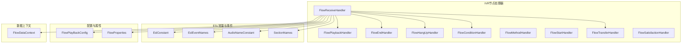
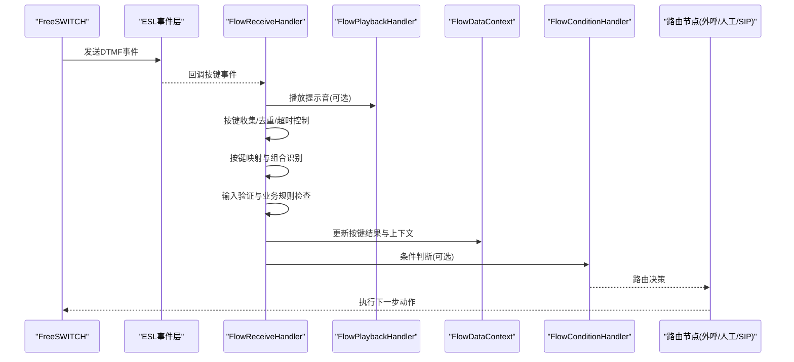
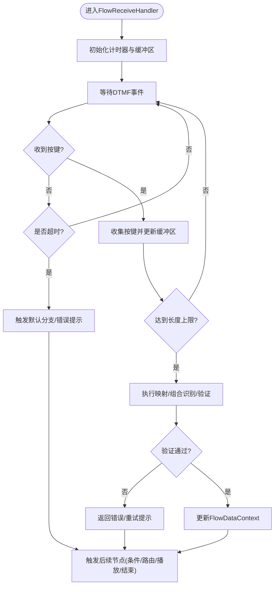
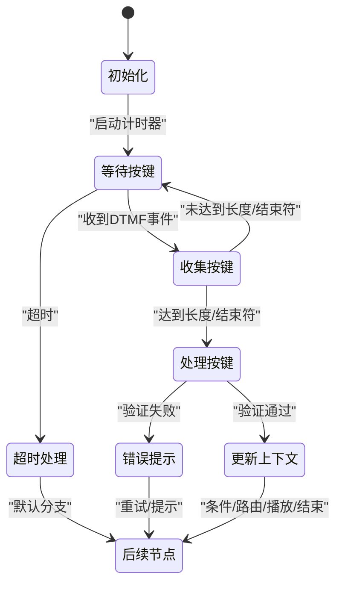
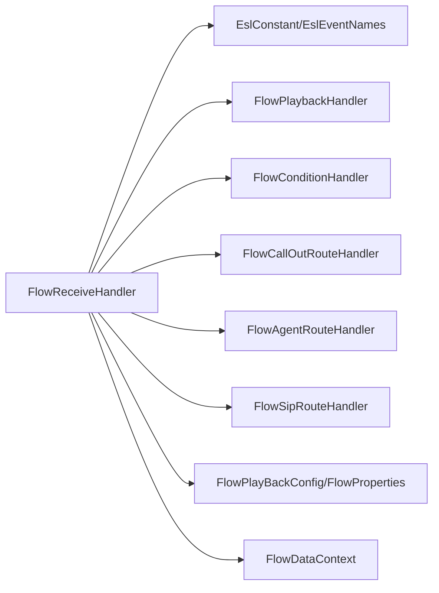

# 按键接收处理器

<cite>
**本文引用的文件**
- [FlowReceiveHandler.java](file://yudao-cloud/yudao-module-cc/yudao-module-cc-server/src/main/java/cn/iocoder/yudao/module/cc/ivr/handler/node/FlowReceiveHandler.java)
- [AbstractIFlowNodeHandler.java](file://yudao-cloud/yudao-module-cc/yudao-module-cc-server/src/main/java/cn/iocoder/yudao/module/cc/ivr/handler/node/AbstractIFlowNodeHandler.java)
- [FlowMenuHandler.java](file://yudao-cloud/yudao-module-cc/yudao-module-cc-server/src/main/java/cn/iocoder/yudao/module/cc/ivr/handler/node/FlowMenuHandler.java)
- [FlowPlaybackHandler.java](file://yudao-cloud/yudao-module-cc/yudao-module-cc-server/src/main/java/cn/iocoder/yudao/module/cc/ivr/handler/node/FlowPlaybackHandler.java)
- [FlowEndHandler.java](file://yudao-cloud/yudao-module-cc/yudao-module-cc-server/src/main/java/cn/iocoder/yudao/module/cc/ivr/handler/node/FlowEndHandler.java)
- [FlowHangUpHandler.java](file://yudao-cloud/yudao-module-cc/yudao-module-cc-server/src/main/java/cn/iocoder/yudao/module/cc/ivr/handler/node/FlowHangUpHandler.java)
- [FlowConditionHandler.java](file://yudao-cloud/yudao-module-cc/yudao-module-cc-server/src/main/java/cn/iocoder/yudao/module/cc/ivr/handler/node/FlowConditionHandler.java)
- [FlowMethodHandler.java](file://yudao-cloud/yudao-module-cc/yudao-module-cc-server/src/main/java/cn/iocoder/yudao/module/cc/ivr/handler/node/FlowMethodHandler.java)
- [FlowStartHandler.java](file://yudao-cloud/yudao-module-cc/yudao-module-cc-server/src/main/java/cn/iocoder/yudao/module/cc/ivr/handler/node/FlowStartHandler.java)
- [FlowTransferHandler.java](file://yudao-cloud/yudao-module-cc/yudao-module-cc-server/src/main/java/cn/iocoder/yudao/module/cc/ivr/handler/node/FlowTransferHandler.java)
- [FlowSatisfactionHandler.java](file://yudao-cloud/yudao-module-cc/yudao-module-cc-server/src/main/java/cn/iocoder/yudao/module/cc/ivr/handler/node/FlowSatisfactionHandler.java)
- [FlowConditionEvaluator.java](file://yudao-cloud/yudao-module-cc/yudao-module-cc-server/src/main/java/cn/iocoder/yudao/module/cc/ivr/handler/node/FlowConditionEvaluator.java)
- [FlowCallOutRouteHandler.java](file://yudao-cloud/yudao-module-cc/yudao-module-cc-server/src/main/java/cn/iocoder/yudao/module/cc/ivr/handler/route/FlowCallOutRouteHandler.java)
- [FlowAgentRouteHandler.java](file://yudao-cloud/yudao-module-cc/yudao-module-cc-server/src/main/java/cn/iocoder/yudao/module/cc/ivr/handler/route/FlowAgentRouteHandler.java)
- [FlowAgentGroupRouteHandler.java](file://yudao-cloud/yudao-module-cc/yudao-module-cc-server/src/main/java/cn/iocoder/yudao/module/cc/ivr/handler/route/FlowAgentGroupRouteHandler.java)
- [FlowSipRouteHandler.java](file://yudao-cloud/yudao-module-cc/yudao-module-cc-server/src/main/java/cn/iocoder/yudao/module/cc/ivr/handler/route/FlowSipRouteHandler.java)
- [EslConstant.java](file://yudao-cloud/yudao-module-cc/yudao-module-cc-server/src/main/java/cn/iocoder/yudao/module/cc/esl/constant/EslConstant.java)
- [EslEventNames.java](file://yudao-cloud/yudao-module-cc/yudao-module-cc-server/src/main/java/cn/iocoder/yudao/module/cc/esl/constant/EslEventNames.java)
- [AudioNameConstant.java](file://yudao-cloud/yudao-module-cc/yudao-module-cc-server/src/main/java/cn/iocoder/yudao/module/cc/esl/constant/AudioNameConstant.java)
- [SectionNames.java](file://yudao-cloud/yudao-module-cc/yudao-module-cc-server/src/main/java/cn/iocoder/yudao/module/cc/esl/constant/SectionNames.java)
- [FlowDataContext.java](file://yudao-cloud/yudao-module-cc/yudao-module-cc-server/src/main/java/cn/iocoder/yudao/module/cc/esl/dto/FlowDataContext.java)
- [FlowPlayBackConfig.java](file://yudao-cloud/yudao-module-cc/yudao-module-cc-server/src/main/java/cn/iocoder/yudao/module/cc/ivr/config/FlowPlayBackConfig.java)
- [FlowProperties.java](file://yudao-cloud/yudao-module-cc/yudao-module-cc-server/src/main/java/cn/iocoder/yudao/module/cc/ivr/properties/FlowProperties.java)
</cite>

## 目录
1. [简介](#简介)
2. [项目结构](#项目结构)
3. [核心组件](#核心组件)
4. [架构总览](#架构总览)
5. [详细组件分析](#详细组件分析)
6. [依赖关系分析](#依赖关系分析)
7. [性能考虑](#性能考虑)
8. [故障排查指南](#故障排查指南)
9. [结论](#结论)
10. [附录](#附录)

## 简介
本文件面向呼叫中心IVR流程中的“按键接收处理器”，围绕 FlowReceiveHandler 的DTMF信号检测与处理机制，系统化说明按键识别算法、超时处理、重复按键过滤、按键映射配置（数字键、星号键、井号键、特殊字符）、输入验证规则（长度限制、格式校验、业务规则检查）、事件生命周期管理（从信号接收到业务处理的完整流程），以及按键组合识别（多键序列检测与快捷键支持）。同时提供菜单选择、密码输入、查询条件设置等实际使用示例。

## 项目结构
该功能位于 yudao-module-cc-server 模块中，属于 IVR 节点处理器体系：
- 节点处理器：以 IFlowNodeHandler 为抽象基类，FlowReceiveHandler 负责接收并解析DTMF按键；其他节点如播放、结束、挂断、条件跳转、路由等协同完成IVR流程。
- ESL常量与事件：通过 EslConstant、EslEventNames 等定义FreeSWITCH事件名与通道属性，用于DTMF事件捕获与上下文传递。
- 配置与属性：FlowPlayBackConfig、FlowProperties 提供播放与流程级参数，影响按键超时、提示音、最大按键长度等。
- 数据上下文：FlowDataContext 承载一次呼叫的上下文信息，包括已收集的按键序列、状态标志、业务变量等。

图表来源
- [FlowReceiveHandler.java](file://yudao-cloud/yudao-module-cc/yudao-module-cc-server/src/main/java/cn/iocoder/yudao/module/cc/ivr/handler/node/FlowReceiveHandler.java)
- [FlowPlaybackHandler.java](file://yudao-cloud/yudao-module-cc/yudao-module-cc-server/src/main/java/cn/iocoder/yudao/module/cc/ivr/handler/node/FlowPlaybackHandler.java)
- [FlowEndHandler.java](file://yudao-cloud/yudao-module-cc/yudao-module-cc-server/src/main/java/cn/iocoder/yudao/module/cc/ivr/handler/node/FlowEndHandler.java)
- [FlowHangUpHandler.java](file://yudao-cloud/yudao-module-cc/yudao-module-cc-server/src/main/java/cn/iocoder/yudao/module/cc/ivr/handler/node/FlowHangUpHandler.java)
- [FlowConditionHandler.java](file://yudao-cloud/yudao-module-cc/yudao-module-cc-server/src/main/java/cn/iocoder/yudao/module/cc/ivr/handler/node/FlowConditionHandler.java)
- [FlowMethodHandler.java](file://yudao-cloud/yudao-module-cc/yudao-module-cc-server/src/main/java/cn/iocoder/yudao/module/cc/ivr/handler/node/FlowMethodHandler.java)
- [FlowStartHandler.java](file://yudao-cloud/yudao-module-cc/yudao-module-cc-server/src/main/java/cn/iocoder/yudao/module/cc/ivr/handler/node/FlowStartHandler.java)
- [FlowTransferHandler.java](file://yudao-cloud/yudao-module-cc/yudao-module-cc-server/src/main/java/cn/iocoder/yudao/module/cc/ivr/handler/node/FlowTransferHandler.java)
- [FlowSatisfactionHandler.java](file://yudao-cloud/yudao-module-cc/yudao-module-cc-server/src/main/java/cn/iocoder/yudao/module/cc/ivr/handler/node/FlowSatisfactionHandler.java)
- [EslConstant.java](file://yudao-cloud/yudao-module-cc/yudao-module-cc-server/src/main/java/cn/iocoder/yudao/module/cc/esl/constant/EslConstant.java)
- [EslEventNames.java](file://yudao-cloud/yudao-module-cc/yudao-module-cc-server/src/main/java/cn/iocoder/yudao/module/cc/esl/constant/EslEventNames.java)
- [AudioNameConstant.java](file://yudao-cloud/yudao-module-cc/yudao-module-cc-server/src/main/java/cn/iocoder/yudao/module/cc/esl/constant/AudioNameConstant.java)
- [SectionNames.java](file://yudao-cloud/yudao-module-cc/yudao-module-cc-server/src/main/java/cn/iocoder/yudao/module/cc/esl/constant/SectionNames.java)
- [FlowPlayBackConfig.java](file://yudao-cloud/yudao-module-cc/yudao-module-cc-server/src/main/java/cn/iocoder/yudao/module/cc/ivr/config/FlowPlayBackConfig.java)
- [FlowProperties.java](file://yudao-cloud/yudao-module-cc/yudao-module-cc-server/src/main/java/cn/iocoder/yudao/module/cc/ivr/properties/FlowProperties.java)

章节来源
- [FlowReceiveHandler.java](file://yudao-cloud/yudao-module-cc/yudao-module-cc-server/src/main/java/cn/iocoder/yudao/module/cc/ivr/handler/node/FlowReceiveHandler.java)
- [AbstractIFlowNodeHandler.java](file://yudao-cloud/yudao-module-cc/yudao-module-cc-server/src/main/java/cn/iocoder/yudao/module/cc/ivr/handler/node/AbstractIFlowNodeHandler.java)
- [EslConstant.java](file://yudao-cloud/yudao-module-cc/yudao-module-cc-server/src/main/java/cn/iocoder/yudao/module/cc/esl/constant/EslConstant.java)
- [EslEventNames.java](file://yudao-cloud/yudao-module-cc/yudao-module-cc-server/src/main/java/cn/iocoder/yudao/module/cc/esl/constant/EslEventNames.java)
- [FlowPlayBackConfig.java](file://yudao-cloud/yudao-module-cc/yudao-module-cc-server/src/main/java/cn/iocoder/yudao/module/cc/ivr/config/FlowPlayBackConfig.java)
- [FlowProperties.java](file://yudao-cloud/yudao-module-cc/yudao-module-cc-server/src/main/java/cn/iocoder/yudao/module/cc/ivr/properties/FlowProperties.java)

## 核心组件
- FlowReceiveHandler：实现按键接收的核心逻辑，负责DTMF事件解析、按键收集、超时控制、重复按键过滤、按键映射与组合识别、输入验证与业务规则检查，并将结果写入FlowDataContext，驱动后续节点流转。
- AbstractIFlowNodeHandler：所有IVR节点的抽象基类，提供统一的执行框架与上下文管理能力。
- FlowPlaybackHandler：在按键等待期间播放提示音，可配置循环次数、音量、语言等。
- FlowConditionHandler / FlowConditionEvaluator：根据按键结果进行条件判断与分支跳转。
- FlowTransferHandler / FlowCallOutRouteHandler / FlowAgentRouteHandler / FlowAgentGroupRouteHandler / FlowSipRouteHandler：将按键结果路由到具体业务目标（外呼、人工坐席、SIP路由等）。
- FlowEndHandler / FlowHangUpHandler：流程结束或挂断。
- FlowMethodHandler：调用外部方法或脚本处理按键结果。
- FlowStartHandler：流程入口节点。
- FlowSatisfactionHandler：满意度评价等场景下的按键处理。
- ESL常量与事件：EslConstant、EslEventNames 等定义了FreeSWITCH事件名称与通道属性键，用于DTMF事件捕获与上下文传递。
- 配置与属性：FlowPlayBackConfig、FlowProperties 提供播放与流程级参数，影响按键超时、提示音、最大按键长度等。
- 数据上下文：FlowDataContext 承载一次呼叫的上下文信息，包括已收集的按键序列、状态标志、业务变量等。

章节来源
- [FlowReceiveHandler.java](file://yudao-cloud/yudao-module-cc/yudao-module-cc-server/src/main/java/cn/iocoder/yudao/module/cc/ivr/handler/node/FlowReceiveHandler.java)
- [AbstractIFlowNodeHandler.java](file://yudao-cloud/yudao-module-cc/yudao-module-cc-server/src/main/java/cn/iocoder/yudao/module/cc/ivr/handler/node/AbstractIFlowNodeHandler.java)
- [FlowPlaybackHandler.java](file://yudao-cloud/yudao-module-cc/yudao-module-cc-server/src/main/java/cn/iocoder/yudao/module/cc/ivr/handler/node/FlowPlaybackHandler.java)
- [FlowConditionHandler.java](file://yudao-cloud/yudao-module-cc/yudao-module-cc-server/src/main/java/cn/iocoder/yudao/module/cc/ivr/handler/node/FlowConditionHandler.java)
- [FlowConditionEvaluator.java](file://yudao-cloud/yudao-module-cc/yudao-module-cc-server/src/main/java/cn/iocoder/yudao/module/cc/ivr/handler/node/FlowConditionEvaluator.java)
- [FlowTransferHandler.java](file://yudao-cloud/yudao-module-cc/yudao-module-cc-server/src/main/java/cn/iocoder/yudao/module/cc/ivr/handler/node/FlowTransferHandler.java)
- [FlowCallOutRouteHandler.java](file://yudao-cloud/yudao-module-cc/yudao-module-cc-server/src/main/java/cn/iocoder/yudao/module/cc/ivr/handler/route/FlowCallOutRouteHandler.java)
- [FlowAgentRouteHandler.java](file://yudao-cloud/yudao-module-cc/yudao-module-cc-server/src/main/java/cn/iocoder/yudao/module/cc/ivr/handler/route/FlowAgentRouteHandler.java)
- [FlowAgentGroupRouteHandler.java](file://yudao-cloud/yudao-module-cc/yudao-module-cc-server/src/main/java/cn/iocoder/yudao/module/cc/ivr/handler/route/FlowAgentGroupRouteHandler.java)
- [FlowSipRouteHandler.java](file://yudao-cloud/yudao-module-cc/yudao-module-cc-server/src/main/java/cn/iocoder/yudao/module/cc/ivr/handler/route/FlowSipRouteHandler.java)
- [FlowEndHandler.java](file://yudao-cloud/yudao-module-cc/yudao-module-cc-server/src/main/java/cn/iocoder/yudao/module/cc/ivr/handler/node/FlowEndHandler.java)
- [FlowHangUpHandler.java](file://yudao-cloud/yudao-module-cc/yudao-module-cc-server/src/main/java/cn/iocoder/yudao/module/cc/ivr/handler/node/FlowHangUpHandler.java)
- [FlowMethodHandler.java](file://yudao-cloud/yudao-module-cc/yudao-module-cc-server/src/main/java/cn/iocoder/yudao/module/cc/ivr/handler/node/FlowMethodHandler.java)
- [FlowStartHandler.java](file://yudao-cloud/yudao-module-cc/yudao-module-cc-server/src/main/java/cn/iocoder/yudao/module/cc/ivr/handler/node/FlowStartHandler.java)
- [FlowSatisfactionHandler.java](file://yudao-cloud/yudao-module-cc/yudao-module-cc-server/src/main/java/cn/iocoder/yudao/module/cc/ivr/handler/node/FlowSatisfactionHandler.java)
- [EslConstant.java](file://yudao-cloud/yudao-module-cc/yudao-module-cc-server/src/main/java/cn/iocoder/yudao/module/cc/esl/constant/EslConstant.java)
- [EslEventNames.java](file://yudao-cloud/yudao-module-cc/yudao-module-cc-server/src/main/java/cn/iocoder/yudao/module/cc/esl/constant/EslEventNames.java)
- [FlowPlayBackConfig.java](file://yudao-cloud/yudao-module-cc/yudao-module-cc-server/src/main/java/cn/iocoder/yudao/module/cc/ivr/config/FlowPlayBackConfig.java)
- [FlowProperties.java](file://yudao-cloud/yudao-module-cc/yudao-module-cc-server/src/main/java/cn/iocoder/yudao/module/cc/ivr/properties/FlowProperties.java)

## 架构总览
按键接收处理器的整体架构围绕“事件驱动+节点编排”展开：
- FreeSWITCH通过ESL发送DTMF事件，系统基于EslEventNames捕获事件。
- FlowReceiveHandler作为IVR节点，负责按键收集、超时控制、重复按键过滤、按键映射与组合识别、输入验证与业务规则检查。
- 处理完成后，FlowReceiveHandler更新FlowDataContext，并根据结果触发后续节点（如条件判断、路由、播放、结束等）。
- 播放节点FlowPlaybackHandler可在等待按键时播放提示音，提升交互体验。
- 路由节点根据按键结果决定下一步动作（外呼、转人工、SIP路由等）。

图表来源
- [FlowReceiveHandler.java](file://yudao-cloud/yudao-module-cc/yudao-module-cc-server/src/main/java/cn/iocoder/yudao/module/cc/ivr/handler/node/FlowReceiveHandler.java)
- [FlowPlaybackHandler.java](file://yudao-cloud/yudao-module-cc/yudao-module-cc-server/src/main/java/cn/iocoder/yudao/module/cc/ivr/handler/node/FlowPlaybackHandler.java)
- [FlowConditionHandler.java](file://yudao-cloud/yudao-module-cc/yudao-module-cc-server/src/main/java/cn/iocoder/yudao/module/cc/ivr/handler/node/FlowConditionHandler.java)
- [FlowCallOutRouteHandler.java](file://yudao-cloud/yudao-module-cc/yudao-module-cc-server/src/main/java/cn/iocoder/yudao/module/cc/ivr/handler/route/FlowCallOutRouteHandler.java)
- [FlowAgentRouteHandler.java](file://yudao-cloud/yudao-module-cc/yudao-module-cc-server/src/main/java/cn/iocoder/yudao/module/cc/ivr/handler/route/FlowAgentRouteHandler.java)
- [FlowSipRouteHandler.java](file://yudao-cloud/yudao-module-cc/yudao-module-cc-server/src/main/java/cn/iocoder/yudao/module/cc/ivr/handler/route/FlowSipRouteHandler.java)
- [EslEventNames.java](file://yudao-cloud/yudao-module-cc/yudao-module-cc-server/src/main/java/cn/iocoder/yudao/module/cc/esl/constant/EslEventNames.java)

## 详细组件分析

### FlowReceiveHandler 按键接收与处理机制
- DTMF信号检测：通过ESL事件层监听FreeSWITCH上报的DTMF事件，提取按键值与时间戳。
- 按键识别算法：
  - 单键识别：直接映射数字键（0-9）、星号键（*）、井号键（#）及可能的特殊字符。
  - 组合识别：支持多键序列检测（如“123#”、“*91#”）与快捷键（如“*”、“#”单独作为快捷操作）。
  - 去重与防抖：对短时间内重复按键进行过滤，避免误触。
- 超时处理：在等待按键期间启动定时器，若超过设定阈值未收到按键，则触发默认分支或错误提示。
- 按键映射配置：支持数字键、星号键、井号键与特殊字符的映射表，便于扩展新按键语义。
- 输入验证规则：
  - 长度限制：限制按键序列的最大长度，防止过长输入导致性能问题。
  - 格式校验：校验按键序列是否符合预期格式（如纯数字、特定前缀等）。
  - 业务规则检查：结合业务上下文进行合法性校验（如账户号位数、区号范围等）。
- 事件生命周期管理：
  - 开始：进入FlowReceiveHandler节点，初始化计时器与缓冲区。
  - 收集：持续接收DTMF事件，更新按键序列。
  - 终止：达到长度上限、检测到结束符（如#）、或超时，停止收集。
  - 处理：执行映射、组合识别、验证与业务规则检查。
  - 输出：更新FlowDataContext，触发后续节点（条件判断、路由、播放、结束等）。

图表来源
- [FlowReceiveHandler.java](file://yudao-cloud/yudao-module-cc/yudao-module-cc-server/src/main/java/cn/iocoder/yudao/module/cc/ivr/handler/node/FlowReceiveHandler.java)
- [FlowPlaybackHandler.java](file://yudao-cloud/yudao-module-cc/yudao-module-cc-server/src/main/java/cn/iocoder/yudao/module/cc/ivr/handler/node/FlowPlaybackHandler.java)
- [FlowConditionHandler.java](file://yudao-cloud/yudao-module-cc/yudao-module-cc-server/src/main/java/cn/iocoder/yudao/module/cc/ivr/handler/node/FlowConditionHandler.java)
- [FlowCallOutRouteHandler.java](file://yudao-cloud/yudao-module-cc/yudao-module-cc-server/src/main/java/cn/iocoder/yudao/module/cc/ivr/handler/route/FlowCallOutRouteHandler.java)
- [FlowAgentRouteHandler.java](file://yudao-cloud/yudao-module-cc/yudao-module-cc/server/src/main/java/cn/iocoder/yudao/module/cc/ivr/handler/route/FlowAgentRouteHandler.java)
- [FlowSipRouteHandler.java](file://yudao-cloud/yudao-module-cc/yudao-module-cc-server/src/main/java/cn/iocoder/yudao/module/cc/ivr/handler/route/FlowSipRouteHandler.java)
- [EslEventNames.java](file://yudao-cloud/yudao-module-cc/yudao-module-cc-server/src/main/java/cn/iocoder/yudao/module/cc/esl/constant/EslEventNames.java)

章节来源
- [FlowReceiveHandler.java](file://yudao-cloud/yudao-module-cc/yudao-module-cc-server/src/main/java/cn/iocoder/yudao/module/cc/ivr/handler/node/FlowReceiveHandler.java)
- [FlowPlaybackHandler.java](file://yudao-cloud/yudao-module-cc/yudao-module-cc-server/src/main/java/cn/iocoder/yudao/module/cc/ivr/handler/node/FlowPlaybackHandler.java)
- [FlowConditionHandler.java](file://yudao-cloud/yudao-module-cc/yudao-module-cc-server/src/main/java/cn/iocoder/yudao/module/cc/ivr/handler/node/FlowConditionHandler.java)
- [FlowCallOutRouteHandler.java](file://yudao-cloud/yudao-module-cc/yudao-module-cc-server/src/main/java/cn/iocoder/yudao/module/cc/ivr/handler/route/FlowCallOutRouteHandler.java)
- [FlowAgentRouteHandler.java](file://yudao-cloud/yudao-module-cc/yudao-module-cc-server/src/main/java/cn/iocoder/yudao/module/cc/ivr/handler/route/FlowAgentRouteHandler.java)
- [FlowSipRouteHandler.java](file://yudao-cloud/yudao-module-cc/yudao-module-cc-server/src/main/java/cn/iocoder/yudao/module/cc/ivr/handler/route/FlowSipRouteHandler.java)
- [EslEventNames.java](file://yudao-cloud/yudao-module-cc/yudao-module-cc-server/src/main/java/cn/iocoder/yudao/module/cc/esl/constant/EslEventNames.java)

### 按键映射配置
- 数字键（0-9）：直接映射为对应数值，常用于菜单选择、号码输入等。
- 星号键（*）：可作为快捷键或前缀，用于快速操作（如返回主菜单、取消输入）。
- 井号键（#）：常作为结束符，表示输入完成。
- 特殊字符：可扩展支持其他符号或自定义按键语义，便于业务定制。

章节来源
- [FlowReceiveHandler.java](file://yudao-cloud/yudao-module-cc/yudao-module-cc-server/src/main/java/cn/iocoder/yudao/module/cc/ivr/handler/node/FlowReceiveHandler.java)
- [AudioNameConstant.java](file://yudao-cloud/yudao-module-cc/yudao-module-cc-server/src/main/java/cn/iocoder/yudao/module/cc/esl/constant/AudioNameConstant.java)
- [SectionNames.java](file://yudao-cloud/yudao-module-cc/yudao-module-cc-server/src/main/java/cn/iocoder/yudao/module/cc/esl/constant/SectionNames.java)

### 输入验证规则
- 长度限制：限制按键序列的最大长度，避免过长输入导致性能问题或内存占用过高。
- 格式校验：校验按键序列是否符合预期格式（如纯数字、特定前缀、固定位数等）。
- 业务规则检查：结合业务上下文进行合法性校验（如账户号位数、区号范围、密码复杂度等）。

章节来源
- [FlowReceiveHandler.java](file://yudao-cloud/yudao-module-cc/yudao-module-cc-server/src/main/java/cn/iocoder/yudao/module/cc/ivr/handler/node/FlowReceiveHandler.java)
- [FlowPlayBackConfig.java](file://yudao-cloud/yudao-module-cc/yudao-module-cc-server/src/main/java/cn/iocoder/yudao/module/cc/ivr/config/FlowPlayBackConfig.java)
- [FlowProperties.java](file://yudao-cloud/yudao-module-cc/yudao-module-cc-server/src/main/java/cn/iocoder/yudao/module/cc/ivr/properties/FlowProperties.java)

### 按键事件的生命周期管理
- 开始：进入FlowReceiveHandler节点，初始化计时器与缓冲区。
- 收集：持续接收DTMF事件，更新按键序列。
- 终止：达到长度上限、检测到结束符（如#）、或超时，停止收集。
- 处理：执行映射、组合识别、验证与业务规则检查。
- 输出：更新FlowDataContext，触发后续节点（条件判断、路由、播放、结束等）。

图表来源
- [FlowReceiveHandler.java](file://yudao-cloud/yudao-module-cc/yudao-module-cc-server/src/main/java/cn/iocoder/yudao/module/cc/ivr/handler/node/FlowReceiveHandler.java)
- [FlowPlaybackHandler.java](file://yudao-cloud/yudao-module-cc/yudao-module-cc-server/src/main/java/cn/iocoder/yudao/module/cc/ivr/handler/node/FlowPlaybackHandler.java)
- [FlowConditionHandler.java](file://yudao-cloud/yudao-module-cc/yudao-module-cc-server/src/main/java/cn/iocoder/yudao/module/cc/ivr/handler/node/FlowConditionHandler.java)
- [FlowCallOutRouteHandler.java](file://yudao-cloud/yudao-module-cc/yudao-module-cc-server/src/main/java/cn/iocoder/yudao/module/cc/ivr/handler/route/FlowCallOutRouteHandler.java)
- [FlowAgentRouteHandler.java](file://yudao-cloud/yudao-module-cc/yudao-module-cc-server/src/main/java/cn/iocoder/yudao/module/cc/ivr/handler/route/FlowAgentRouteHandler.java)
- [FlowSipRouteHandler.java](file://yudao-cloud/yudao-module-cc/yudao-module-cc-server/src/main/java/cn/iocoder/yudao/module/cc/ivr/handler/route/FlowSipRouteHandler.java)

章节来源
- [FlowReceiveHandler.java](file://yudao-cloud/yudao-module-cc/yudao-module-cc-server/src/main/java/cn/iocoder/yudao/module/cc/ivr/handler/node/FlowReceiveHandler.java)
- [FlowPlaybackHandler.java](file://yudao-cloud/yudao-module-cc/yudao-module-cc-server/src/main/java/cn/iocoder/yudao/module/cc/ivr/handler/node/FlowPlaybackHandler.java)
- [FlowConditionHandler.java](file://yudao-cloud/yudao-module-cc/yudao-module-cc-server/src/main/java/cn/iocoder/yudao/module/cc/ivr/handler/node/FlowConditionHandler.java)
- [FlowCallOutRouteHandler.java](file://yudao-cloud/yudao-module-cc/yudao-module-cc-server/src/main/java/cn/iocoder/yudao/module/cc/ivr/handler/route/FlowCallOutRouteHandler.java)
- [FlowAgentRouteHandler.java](file://yudao-cloud/yudao-module-cc/yudao-module-cc-server/src/main/java/cn/iocoder/yudao/module/cc/ivr/handler/route/FlowAgentRouteHandler.java)
- [FlowSipRouteHandler.java](file://yudao-cloud/yudao-module-cc/yudao-module-cc-server/src/main/java/cn/iocoder/yudao/module/cc/ivr/handler/route/FlowSipRouteHandler.java)

### 按键组合识别功能
- 多键序列检测：支持连续按键的组合识别（如“123#”、“*91#”），用于复杂菜单或指令输入。
- 快捷键支持：星号键（*）与井号键（#）可作为快捷键，快速触发特定操作（如返回主菜单、确认输入）。

章节来源
- [FlowReceiveHandler.java](file://yudao-cloud/yudao-module-cc/yudao-module-cc-server/src/main/java/cn/iocoder/yudao/module/cc/ivr/handler/node/FlowReceiveHandler.java)
- [AudioNameConstant.java](file://yudao-cloud/yudao-module-cc/yudao-module-cc-server/src/main/java/cn/iocoder/yudao/module/cc/esl/constant/AudioNameConstant.java)
- [SectionNames.java](file://yudao-cloud/yudao-module-cc/yudao-module-cc-server/src/main/java/cn/iocoder/yudao/module/cc/esl/constant/SectionNames.java)

### 实际使用示例
- 菜单选择：用户按数字键选择菜单项，系统根据按键跳转到相应子菜单或执行操作。
- 密码输入：用户输入固定长度的数字序列，系统进行格式校验与业务规则检查，成功后进入下一步。
- 查询条件设置：用户输入区号、账号等条件，系统进行长度与格式校验，成功后执行查询并反馈结果。

章节来源
- [FlowReceiveHandler.java](file://yudao-cloud/yudao-module-cc/yudao-module-cc-server/src/main/java/cn/iocoder/yudao/module/cc/ivr/handler/node/FlowReceiveHandler.java)
- [FlowPlaybackHandler.java](file://yudao-cloud/yudao-module-cc/yudao-module-cc-server/src/main/java/cn/iocoder/yudao/module/cc/ivr/handler/node/FlowPlaybackHandler.java)
- [FlowConditionHandler.java](file://yudao-cloud/yudao-module-cc/yudao-module-cc-server/src/main/java/cn/iocoder/yudao/module/cc/ivr/handler/node/FlowConditionHandler.java)
- [FlowCallOutRouteHandler.java](file://yudao-cloud/yudao-module-cc/yudao-module-cc-server/src/main/java/cn/iocoder/yudao/module/cc/ivr/handler/route/FlowCallOutRouteHandler.java)
- [FlowAgentRouteHandler.java](file://yudao-cloud/yudao-module-cc/yudao-module-cc-server/src/main/java/cn/iocoder/yudao/module/cc/ivr/handler/route/FlowAgentRouteHandler.java)
- [FlowSipRouteHandler.java](file://yudao-cloud/yudao-module-cc/yudao-module-cc-server/src/main/java/cn/iocoder/yudao/module/cc/ivr/handler/route/FlowSipRouteHandler.java)

## 依赖关系分析
FlowReceiveHandler 与其他组件的依赖关系如下：
- 依赖ESL常量与事件：EslConstant、EslEventNames 用于DTMF事件捕获与通道属性传递。
- 依赖播放节点：FlowPlaybackHandler 用于在等待按键时播放提示音。
- 依赖条件与路由节点：FlowConditionHandler、FlowCallOutRouteHandler、FlowAgentRouteHandler、FlowSipRouteHandler 用于按键结果的分支与路由。
- 依赖配置与属性：FlowPlayBackConfig、FlowProperties 用于控制播放与流程参数。
- 依赖数据上下文：FlowDataContext 用于存储按键结果与状态。

图表来源
- [FlowReceiveHandler.java](file://yudao-cloud/yudao-module-cc/yudao-module-cc-server/src/main/java/cn/iocoder/yudao/module/cc/ivr/handler/node/FlowReceiveHandler.java)
- [EslConstant.java](file://yudao-cloud/yudao-module-cc/yudao-module-cc-server/src/main/java/cn/iocoder/yudao/module/cc/esl/constant/EslConstant.java)
- [EslEventNames.java](file://yudao-cloud/yudao-module-cc/yudao-module-cc-server/src/main/java/cn/iocoder/yudao/module/cc/esl/constant/EslEventNames.java)
- [FlowPlaybackHandler.java](file://yudao-cloud/yudao-module-cc/yudao-module-cc-server/src/main/java/cn/iocoder/yudao/module/cc/ivr/handler/node/FlowPlaybackHandler.java)
- [FlowConditionHandler.java](file://yudao-cloud/yudao-module-cc/yudao-module-cc-server/src/main/java/cn/iocoder/yudao/module/cc/ivr/handler/node/FlowConditionHandler.java)
- [FlowCallOutRouteHandler.java](file://yudao-cloud/yudao-module-cc/yudao-module-cc-server/src/main/java/cn/iocoder/yudao/module/cc/ivr/handler/route/FlowCallOutRouteHandler.java)
- [FlowAgentRouteHandler.java](file://yudao-cloud/yudao-module-cc/yudao-module-cc-server/src/main/java/cn/iocoder/yudao/module/cc/ivr/handler/route/FlowAgentRouteHandler.java)
- [FlowSipRouteHandler.java](file://yudao-cloud/yudao-module-cc/yudao-module-cc-server/src/main/java/cn/iocoder/yudao/module/cc/ivr/handler/route/FlowSipRouteHandler.java)
- [FlowPlayBackConfig.java](file://yudao-cloud/yudao-module-cc/yudao-module-cc-server/src/main/java/cn/iocoder/yudao/module/cc/ivr/config/FlowPlayBackConfig.java)
- [FlowProperties.java](file://yudao-cloud/yudao-module-cc/yudao-module-cc-server/src/main/java/cn/iocoder/yudao/module/cc/ivr/properties/FlowProperties.java)

章节来源
- [FlowReceiveHandler.java](file://yudao-cloud/yudao-module-cc/yudao-module-cc-server/src/main/java/cn/iocoder/yudao/module/cc/ivr/handler/node/FlowReceiveHandler.java)
- [EslConstant.java](file://yudao-cloud/yudao-module-cc/yudao-module-cc-server/src/main/java/cn/iocoder/yudao/module/cc/esl/constant/EslConstant.java)
- [EslEventNames.java](file://yudao-cloud/yudao-module-cc/yudao-module-cc-server/src/main/java/cn/iocoder/yudao/module/cc/esl/constant/EslEventNames.java)
- [FlowPlaybackHandler.java](file://yudao-cloud/yudao-module-cc/yudao-module-cc-server/src/main/java/cn/iocoder/yudao/module/cc/ivr/handler/node/FlowPlaybackHandler.java)
- [FlowConditionHandler.java](file://yudao-cloud/yudao-module-cc/yudao-module-cc-server/src/main/java/cn/iocoder/yudao/module/cc/ivr/handler/node/FlowConditionHandler.java)
- [FlowCallOutRouteHandler.java](file://yudao-cloud/yudao-module-cc/yudao-module-cc-server/src/main/java/cn/iocoder/yudao/module/cc/ivr/handler/route/FlowCallOutRouteHandler.java)
- [FlowAgentRouteHandler.java](file://yudao-cloud/yudao-module-cc/yudao-module-cc-server/src/main/java/cn/iocoder/yudao/module/cc/ivr/handler/route/FlowAgentRouteHandler.java)
- [FlowSipRouteHandler.java](file://yudao-cloud/yudao-module-cc/yudao-module-cc-server/src/main/java/cn/iocoder/yudao/module/cc/ivr/handler/route/FlowSipRouteHandler.java)
- [FlowPlayBackConfig.java](file://yudao-cloud/yudao-module-cc/yudao-module-cc-server/src/main/java/cn/iocoder/yudao/module/cc/ivr/config/FlowPlayBackConfig.java)
- [FlowProperties.java](file://yudao-cloud/yudao-module-cc/yudao-module-cc-server/src/main/java/cn/iocoder/yudao/module/cc/ivr/properties/FlowProperties.java)

## 性能考虑
- 按键去重与防抖：减少无效按键对系统资源的消耗。
- 超时控制：避免长时间阻塞，提高响应速度。
- 长度限制：防止过长输入导致内存占用过高。
- 异步处理：按键事件处理应尽量异步化，避免阻塞主线程。
- 缓存优化：对常用按键映射与业务规则进行缓存，提升匹配效率。

[本节为通用性能建议，不直接分析具体文件]

## 故障排查指南
- DTMF事件未捕获：检查ESL事件订阅是否正确，确认EslEventNames配置无误。
- 按键识别异常：核对按键映射配置，确认数字键、星号键、井号键与特殊字符映射正确。
- 超时频繁触发：调整超时阈值，确保用户有足够时间输入。
- 输入验证失败：检查长度限制、格式校验与业务规则配置，确保与实际业务一致。
- 路由错误：核对条件判断与路由节点配置，确保按键结果能正确路由到目标节点。

章节来源
- [FlowReceiveHandler.java](file://yudao-cloud/yudao-module-cc/yudao-module-cc-server/src/main/java/cn/iocoder/yudao/module/cc/ivr/handler/node/FlowReceiveHandler.java)
- [EslEventNames.java](file://yudao-cloud/yudao-module-cc/yudao-module-cc-server/src/main/java/cn/iocoder/yudao/module/cc/esl/constant/EslEventNames.java)
- [FlowConditionHandler.java](file://yudao-cloud/yudao-module-cc/yudao-module-cc-server/src/main/java/cn/iocoder/yudao/module/cc/ivr/handler/node/FlowConditionHandler.java)
- [FlowCallOutRouteHandler.java](file://yudao-cloud/yudao-module-cc/yudao-module-cc-server/src/main/java/cn/iocoder/yudao/module/cc/ivr/handler/route/FlowCallOutRouteHandler.java)
- [FlowAgentRouteHandler.java](file://yudao-cloud/yudao-module-cc/yudao-module-cc-server/src/main/java/cn/iocoder/yudao/module/cc/ivr/handler/route/FlowAgentRouteHandler.java)
- [FlowSipRouteHandler.java](file://yudao-cloud/yudao-module-cc/yudao-module-cc-server/src/main/java/cn/iocoder/yudao/module/cc/ivr/handler/route/FlowSipRouteHandler.java)

## 结论
FlowReceiveHandler 作为IVR流程中的关键组件，提供了完整的DTMF按键接收与处理能力，涵盖按键识别、超时控制、重复按键过滤、按键映射与组合识别、输入验证与业务规则检查，以及与播放、条件、路由等节点的协同工作。通过合理的配置与优化，可实现高效、稳定的按键交互体验。

[本节为总结性内容，不直接分析具体文件]

## 附录
- 相关常量与事件：EslConstant、EslEventNames、AudioNameConstant、SectionNames 提供了DTMF事件与音频资源的基础定义。
- 配置与属性：FlowPlayBackConfig、FlowProperties 提供了播放与流程级参数的配置选项。
- 数据上下文：FlowDataContext 承载了一次呼叫的上下文信息，便于跨节点共享状态。

章节来源
- [EslConstant.java](file://yudao-cloud/yudao-module-cc/yudao-module-cc-server/src/main/java/cn/iocoder/yudao/module/cc/esl/constant/EslConstant.java)
- [EslEventNames.java](file://yudao-cloud/yudao-module-cc/yudao-module-cc-server/src/main/java/cn/iocoder/yudao/module/cc/esl/constant/EslEventNames.java)
- [AudioNameConstant.java](file://yudao-cloud/yudao-module-cc/yudao-module-cc-server/src/main/java/cn/iocoder/yudao/module/cc/esl/constant/AudioNameConstant.java)
- [SectionNames.java](file://yudao-cloud/yudao-module-cc/yudao-module-cc-server/src/main/java/cn/iocoder/yudao/module/cc/esl/constant/SectionNames.java)
- [FlowPlayBackConfig.java](file://yudao-cloud/yudao-module-cc/yudao-module-cc-server/src/main/java/cn/iocoder/yudao/module/cc/ivr/config/FlowPlayBackConfig.java)
- [FlowProperties.java](file://yudao-cloud/yudao-module-cc/yudao-module-cc-server/src/main/java/cn/iocoder/yudao/module/cc/ivr/properties/FlowProperties.java)
- [FlowDataContext.java](file://yudao-cloud/yudao-module-cc/yudao-module-cc-server/src/main/java/cn/iocoder/yudao/module/cc/esl/dto/FlowDataContext.java)