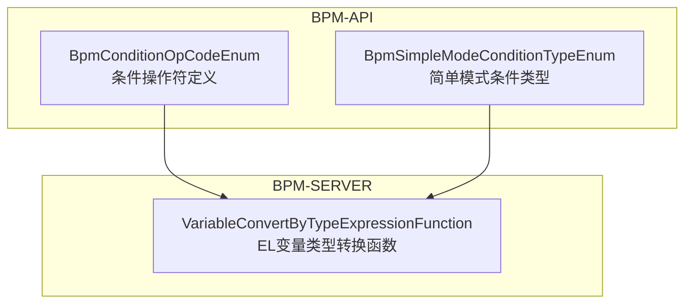
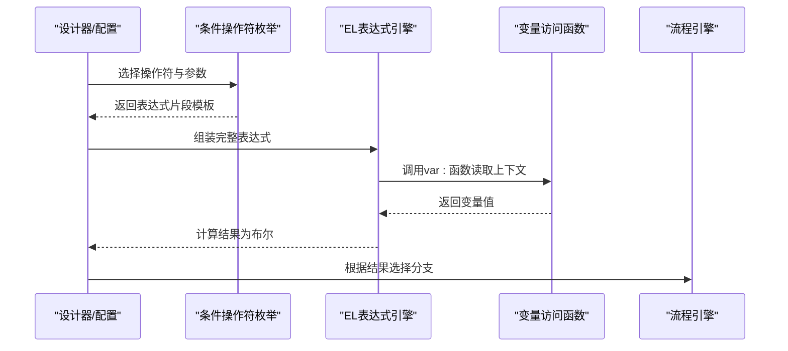
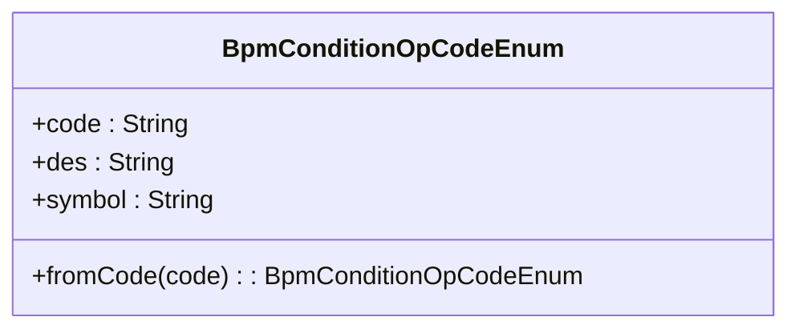
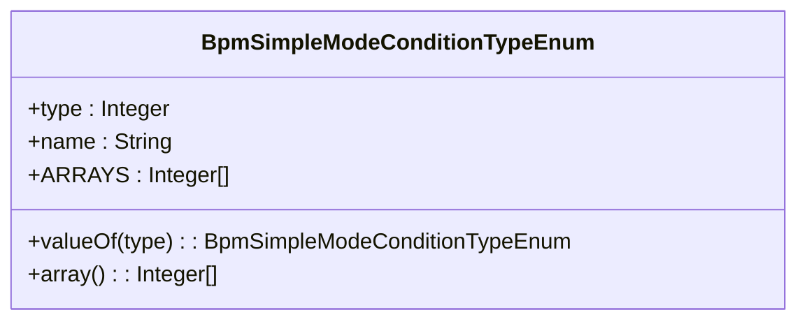
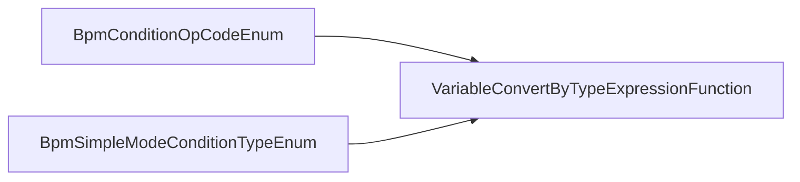

# 条件判断处理器

<cite>
**本文引用的文件**
- [BpmConditionOpCodeEnum.java](file://yudao-cloud/yudao-module-bpm/yudao-module-bpm-api/src/main/java/cn/iocoder/yudao/module/bpm/enums/definition/BpmConditionOpCodeEnum.java)
- [BpmSimpleModeConditionTypeEnum.java](file://yudao-cloud/yudao-module-bpm/yudao-module-bpm-api/src/main/java/cn/iocoder/yudao/module/bpm/enums/definition/BpmSimpleModeConditionTypeEnum.java)
- [VariableConvertByTypeExpressionFunction.java](file://yudao-cloud/yudao-module-bpm/yudao-module-bpm-server/src/main/java/cn/iocoder/yudao/module/bpm/framework/flowable/core/el/VariableConvertByTypeExpressionFunction.java)
</cite>

## 目录
1. [简介](#简介)
2. [项目结构](#项目结构)
3. [核心组件](#核心组件)
4. [架构总览](#架构总览)
5. [详细组件分析](#详细组件分析)
6. [依赖关系分析](#依赖关系分析)
7. [性能考虑](#性能考虑)
8. [故障排查指南](#故障排查指南)
9. [结论](#结论)
10. [附录](#附录)

## 简介
本章节面向“条件判断处理器”的文档目标，聚焦于流程引擎中的条件表达式解析与执行机制。结合仓库中BPM模块的实现，说明：
- 条件操作符与语法支持（等于、不等于、大小比较、包含/不包含等）
- 表达式上下文变量访问方式（如 var: 前缀函数）
- 简单模式下的条件类型（表达式/规则）
- 内置函数与类型转换能力（基于EL扩展）
- 复杂条件的构建方法（嵌套、多分支、组合）
- 典型应用场景（业务规则、身份校验、路由决策）

## 项目结构
条件判断相关代码主要位于BPM模块：
- API层提供条件操作符枚举与简单模式条件类型枚举
- Server层提供EL表达式函数扩展，用于变量类型转换与访问

图表来源
- [BpmConditionOpCodeEnum.java:1-39](file://yudao-cloud/yudao-module-bpm/yudao-module-bpm-api/src/main/java/cn/iocoder/yudao/module/bpm/enums/definition/BpmConditionOpCodeEnum.java#L1-L39)
- [BpmSimpleModeConditionTypeEnum.java:1-37](file://yudao-cloud/yudao-module-bpm/yudao-module-bpm-api/src/main/java/cn/iocoder/yudao/module/bpm/enums/definition/BpmSimpleModeConditionTypeEnum.java#L1-L37)
- [VariableConvertByTypeExpressionFunction.java](file://yudao-cloud/yudao-module-bpm/yudao-module-bpm-server/src/main/java/cn/iocoder/yudao/module/bpm/framework/flowable/core/el/VariableConvertByTypeExpressionFunction.java)

章节来源
- [BpmConditionOpCodeEnum.java:1-39](file://yudao-cloud/yudao-module-bpm/yudao-module-bpm-api/src/main/java/cn/iocoder/yudao/module/bpm/enums/definition/BpmConditionOpCodeEnum.java#L1-L39)
- [BpmSimpleModeConditionTypeEnum.java:1-37](file://yudao-cloud/yudao-module-bpm/yudao-module-bpm-api/src/main/java/cn/iocoder/yudao/module/bpm/enums/definition/BpmSimpleModeConditionTypeEnum.java#L1-L37)
- [VariableConvertByTypeExpressionFunction.java](file://yudao-cloud/yudao-module-bpm/yudao-module-bpm-server/src/main/java/cn/iocoder/yudao/module/bpm/framework/flowable/core/el/VariableConvertByTypeExpressionFunction.java)

## 核心组件
- 条件操作符枚举：定义了支持的比较与集合操作，并映射到可执行的表达式片段，便于在流程节点中进行条件判断。
- 简单模式条件类型：区分“条件表达式”和“条件规则”，为设计器提供统一的条件类型选择。
- EL变量类型转换函数：提供变量读取与类型转换能力，支撑表达式中对流程变量的安全访问与计算。

章节来源
- [BpmConditionOpCodeEnum.java:1-39](file://yudao-cloud/yudao-module-bpm/yudao-module-bpm-api/src/main/java/cn/iocoder/yudao/module/bpm/enums/definition/BpmConditionOpCodeEnum.java#L1-L39)
- [BpmSimpleModeConditionTypeEnum.java:1-37](file://yudao-cloud/yudao-module-bpm/yudao-module-bpm-api/src/main/java/cn/iocoder/yudao/module/bpm/enums/definition/BpmSimpleModeConditionTypeEnum.java#L1-L37)
- [VariableConvertByTypeExpressionFunction.java](file://yudao-cloud/yudao-module-bpm/yudao-module-bpm-server/src/main/java/cn/iocoder/yudao/module/bpm/framework/flowable/core/el/VariableConvertByTypeExpressionFunction.java)

## 架构总览
条件判断处理器的整体流程如下：
- 设计器或配置层选择“条件类型”（表达式/规则）
- 根据选择的“操作符”生成表达式片段
- 通过EL引擎执行表达式，调用变量访问函数获取上下文数据
- 返回布尔结果，驱动流程分支走向

图表来源
- [BpmConditionOpCodeEnum.java:1-39](file://yudao-cloud/yudao-module-bpm/yudao-module-bpm-api/src/main/java/cn/iocoder/yudao/module/bpm/enums/definition/BpmConditionOpCodeEnum.java#L1-L39)
- [VariableConvertByTypeExpressionFunction.java](file://yudao-cloud/yudao-module-bpm/yudao-module-bpm-server/src/main/java/cn/iocoder/yudao/module/bpm/framework/flowable/core/el/VariableConvertByTypeExpressionFunction.java)

## 详细组件分析

### 条件操作符与表达式生成
- 支持的操作符包括：等于、不等于、大于、大于等于、小于、小于等于、包含、不包含
- 每个操作符对应一个表达式片段模板，使用 var: 前缀函数进行变量读取与默认值处理
- 通过 fromCode 方法可按字符串编码查找操作符，未匹配时抛出异常

图表来源
- [BpmConditionOpCodeEnum.java:1-39](file://yudao-cloud/yudao-module-bpm/yudao-module-bpm-api/src/main/java/cn/iocoder/yudao/module/bpm/enums/definition/BpmConditionOpCodeEnum.java#L1-L39)

章节来源
- [BpmConditionOpCodeEnum.java:1-39](file://yudao-cloud/yudao-module-bpm/yudao-module-bpm-api/src/main/java/cn/iocoder/yudao/module/bpm/enums/definition/BpmConditionOpCodeEnum.java#L1-L39)

### 简单模式条件类型
- 两种条件类型：表达式、规则
- 提供类型数组与按类型值查找的方法，便于前端设计器展示与后端解析

图表来源
- [BpmSimpleModeConditionTypeEnum.java:1-37](file://yudao-cloud/yudao-module-bpm/yudao-module-bpm-api/src/main/java/cn/iocoder/yudao/module/bpm/enums/definition/BpmSimpleModeConditionTypeEnum.java#L1-L37)

章节来源
- [BpmSimpleModeConditionTypeEnum.java:1-37](file://yudao-cloud/yudao-module-bpm/yudao-module-bpm-api/src/main/java/cn/iocoder/yudao/module/bpm/enums/definition/BpmSimpleModeConditionTypeEnum.java#L1-L37)

### EL变量类型转换函数
- 提供变量类型转换与访问能力，配合 var: 前缀函数在表达式中安全读取流程变量
- 通常用于将字符串、数字、日期等类型转换为表达式所需类型，避免类型不匹配导致的计算错误

```mermaid
flowchart TD
Start(["进入表达式计算"]) --> ReadVar["调用var:函数读取变量"]
ReadVar --> Convert["类型转换与默认值处理"]
Convert --> Compute["执行比较/逻辑运算"]
Compute --> Result{"结果为真?"}
Result --> |是| BranchTrue["走真分支"]
Result --> |否| BranchFalse["走假分支"]
BranchTrue --> End(["结束"])
BranchFalse --> End
```

图表来源
- [VariableConvertByTypeExpressionFunction.java](file://yudao-cloud/yudao-module-bpm/yudao-module-bpm-server/src/main/java/cn/iocoder/yudao/module/bpm/framework/flowable/core/el/VariableConvertByTypeExpressionFunction.java)

章节来源
- [VariableConvertByTypeExpressionFunction.java](file://yudao-cloud/yudao-module-bpm/yudao-module-bpm-server/src/main/java/cn/iocoder/yudao/module/bpm/framework/flowable/core/el/VariableConvertByTypeExpressionFunction.java)

## 依赖关系分析
- 操作符枚举依赖EL变量函数以完成变量读取与比较
- 简单模式条件类型作为上层抽象，指导表达式或规则的生成与执行
- 整体耦合度低，职责清晰：枚举负责操作符映射，EL函数负责变量访问与类型转换

图表来源
- [BpmConditionOpCodeEnum.java:1-39](file://yudao-cloud/yudao-module-bpm/yudao-module-bpm-api/src/main/java/cn/iocoder/yudao/module/bpm/enums/definition/BpmConditionOpCodeEnum.java#L1-L39)
- [BpmSimpleModeConditionTypeEnum.java:1-37](file://yudao-cloud/yudao-module-bpm/yudao-module-bpm-api/src/main/java/cn/iocoder/yudao/module/bpm/enums/definition/BpmSimpleModeConditionTypeEnum.java#L1-L37)
- [VariableConvertByTypeExpressionFunction.java](file://yudao-cloud/yudao-module-bpm/yudao-module-bpm-server/src/main/java/cn/iocoder/yudao/module/bpm/framework/flowable/core/el/VariableConvertByTypeExpressionFunction.java)

章节来源
- [BpmConditionOpCodeEnum.java:1-39](file://yudao-cloud/yudao-module-bpm/yudao-module-bpm-api/src/main/java/cn/iocoder/yudao/module/bpm/enums/definition/BpmConditionOpCodeEnum.java#L1-L39)
- [BpmSimpleModeConditionTypeEnum.java:1-37](file://yudao-cloud/yudao-module-bpm/yudao-module-bpm-api/src/main/java/cn/iocoder/yudao/module/bpm/enums/definition/BpmSimpleModeConditionTypeEnum.java#L1-L37)
- [VariableConvertByTypeExpressionFunction.java](file://yudao-cloud/yudao-module-bpm/yudao-module-bpm-server/src/main/java/cn/iocoder/yudao/module/bpm/framework/flowable/core/el/VariableConvertByTypeExpressionFunction.java)

## 性能考虑
- 表达式片段由枚举预定义，减少运行时拼接开销
- 变量访问通过统一的 var: 函数进行，具备默认值与类型转换，降低空指针与类型错误风险
- 建议在复杂条件中尽量复用子表达式，避免重复计算

## 故障排查指南
- 未知操作符：当使用 not found 的操作符编码时会抛出异常，检查是否使用了正确的 code
- 变量为空或类型不匹配：确保通过 var: 函数进行读取与转换，必要时设置默认值
- 表达式语法错误：核对操作符对应的表达式片段模板，确认参数顺序与引用正确

章节来源
- [BpmConditionOpCodeEnum.java:29-36](file://yudao-cloud/yudao-module-bpm/yudao-module-bpm-api/src/main/java/cn/iocoder/yudao/module/bpm/enums/definition/BpmConditionOpCodeEnum.java#L29-L36)

## 结论
该条件判断处理器通过枚举化的操作符与EL变量函数，提供了稳定、可扩展的条件表达式执行能力。其设计简洁、职责清晰，适合在流程引擎中实现灵活的路由与分支控制。对于更复杂的业务规则，可在现有基础上扩展更多内置函数与操作符。

## 附录

### 语法支持与运算优先级
- 支持的比较操作：等于、不等于、大于、大于等于、小于、小于等于
- 集合操作：包含、不包含
- 变量访问：通过 var: 前缀函数读取上下文变量，支持默认值与类型转换
- 优先级建议：先进行变量读取与类型转换，再进行比较与集合操作；复杂表达式建议使用括号明确优先级

### 数据类型比较与函数调用
- 数值比较：确保变量为数值类型或通过转换函数转为数值
- 字符串比较：注意大小写与空白字符，必要时进行标准化处理
- 时间比较：将时间字符串或对象转换为可比的时间类型后再进行比较
- 函数调用：优先使用内置的 var: 函数进行变量访问，避免直接访问底层对象导致的不一致

### 变量引用与上下文数据访问
- 会话变量：通过 var: 函数读取当前会话上下文中的变量
- 系统变量：读取流程引擎提供的系统级变量（如流程实例ID、任务创建时间等）
- 用户自定义变量：在流程启动或任务节点中设置的自定义变量，可通过 var: 函数访问

### 复杂条件表达式的构建方法
- 嵌套条件：在表达式中使用括号组织多层判断，提高可读性与可维护性
- 多分支判断：结合多个操作符与变量，形成 if-else 风格的分支逻辑
- 条件组合：使用逻辑与/或连接多个子条件，形成复合判断

### 实际应用示例
- 业务规则判断：例如订单金额阈值、库存状态、折扣策略等
- 用户身份验证：根据角色、部门、权限等条件决定审批路径
- 路由决策：根据输入参数与上下文动态选择后续节点