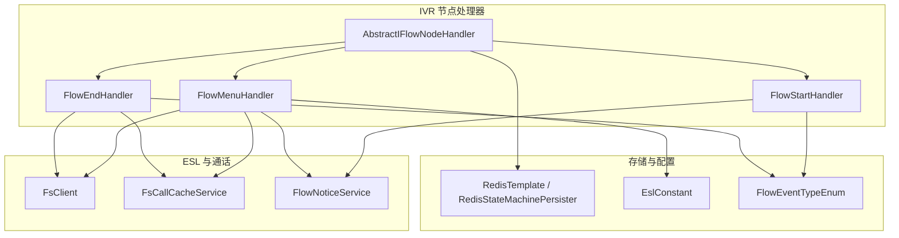
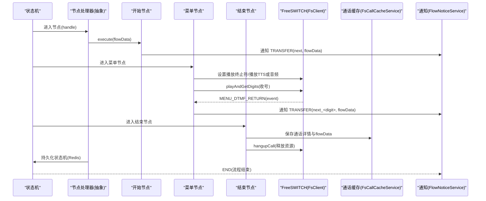
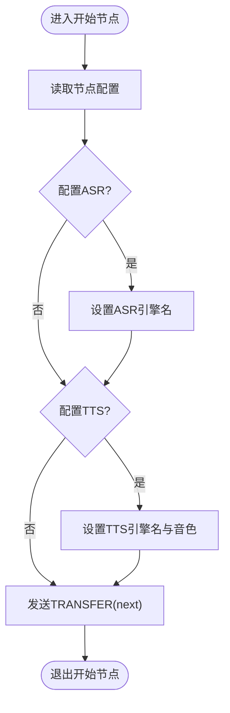
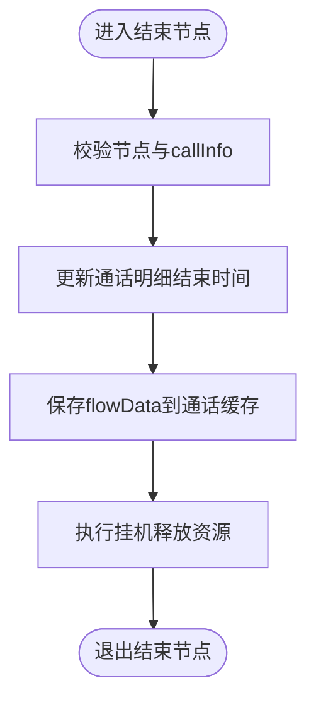
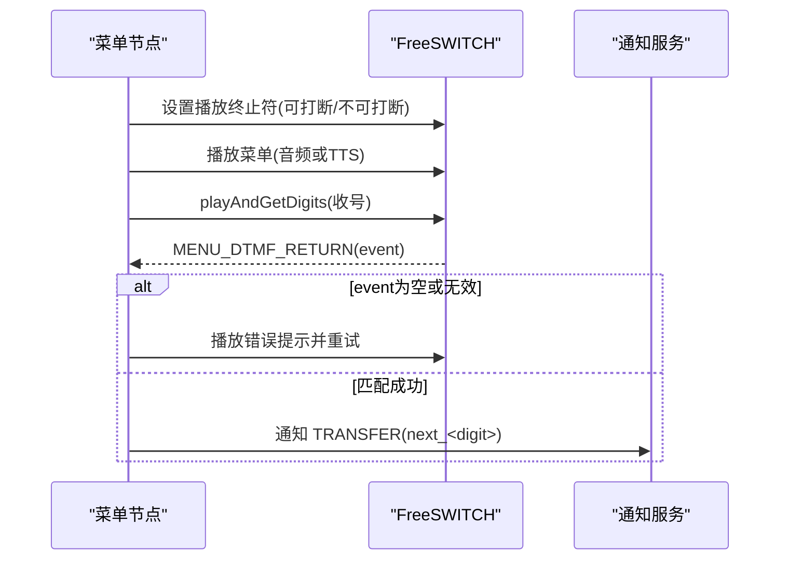
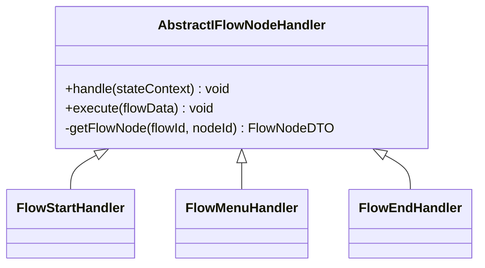
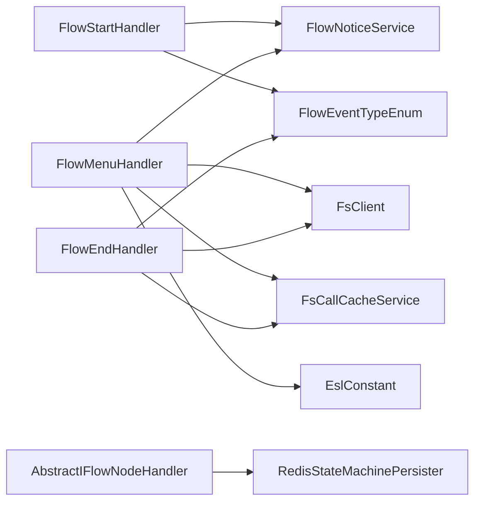

# 流程控制处理器

<cite>
**本文引用的文件**
- [FlowStartHandler.java](file://yudao-cloud/yudao-module-cc/yudao-module-cc-server/src/main/java/cn/iocoder/yudao/module/cc/ivr/handler/node/FlowStartHandler.java)
- [FlowEndHandler.java](file://yudao-cloud/yudao-module-cc/yudao-module-cc-server/src/main/java/cn/iocoder/yudao/module/cc/ivr/handler/node/FlowEndHandler.java)
- [FlowMenuHandler.java](file://yudao-cloud/yudao-module-cc/yudao-module-cc-server/src/main/java/cn/iocoder/yudao/module/cc/ivr/handler/node/FlowMenuHandler.java)
- [AbstractIFlowNodeHandler.java](file://yudao-cloud/yudao-module-cc/yudao-module-cc-server/src/main/java/cn/iocoder/yudao/module/cc/ivr/handler/node/AbstractIFlowNodeHandler.java)
- [IFlowNodeHandler.java](file://yudao-cloud/yudao-module-cc/yudao-module-cc-server/src/main/java/cn/iocoder/yudao/module/cc/ivr/handler/node/IFlowNodeHandler.java)
- [FlowDataContext.java](file://yudao-cloud/yudao-module-cc/yudao-module-cc-server/src/main/java/cn/iocoder/yudao/module/cc/esl/dto/FlowDataContext.java)
- [CallInfo.java](file://yudao-cloud/yudao-module-cc/yudao-module-cc-server/src/main/java/cn/iocoder/yudao/module/cc/esl/dto/CallInfo.java)
- [FsClient.java](file://yudao-cloud/yudao-module-cc/yudao-module-cc-server/src/main/java/cn/iocoder/yudao/module/cc/esl/client/FsClient.java)
- [FlowNoticeService.java](file://yudao-cloud/yudao-module-cc/yudao-module-cc-server/src/main/java/cn/iocoder/yudao/module/cc/esl/service/FlowNoticeService.java)
- [FsCallCacheService.java](file://yudao-cloud/yudao-module-cc/yudao-module-cc-server/src/main/java/cn/iocoder/yudao/module/cc/esl/service/FsCallCacheService.java)
- [FlowEventTypeEnum.java](file://yudao-cloud/yudao-module-cc/yudao-module-cc-server/src/main/java/cn/iocoder/yudao/module/cc/esl/enums/FlowEventTypeEnum.java)
- [EslConstant.java](file://yudao-cloud/yudao-module-cc/yudao-module-cc-server/src/main/java/cn/iocoder/yudao/module/cc/esl/constant/EslConstant.java)
- [RedisConstants.java](file://yudao-cloud/yudao-module-cc/yudao-module-cc-server/src/main/java/cn/iocoder/yudao/module/cc/constant/RedisConstants.java)
</cite>

## 目录
1. [简介](#简介)
2. [项目结构](#项目结构)
3. [核心组件](#核心组件)
4. [架构总览](#架构总览)
5. [详细组件分析](#详细组件分析)
6. [依赖关系分析](#依赖关系分析)
7. [性能考量](#性能考量)
8. [故障排查指南](#故障排查指南)
9. [结论](#结论)
10. [附录](#附录)

## 简介
本文件面向“流程控制处理器”，聚焦 IVR 流程中的关键节点处理器：流程启动 FlowStartHandler、流程结束 FlowEndHandler、菜单处理 FlowMenuHandler。文档覆盖以下主题：
- 流程启动的初始化过程：会话上下文准备、ASR/TTS 引擎绑定、环境参数注入与后续流转通知
- 流程结束的清理机制：通话详情保存、挂机释放、统计信息收集
- 菜单处理的导航逻辑：菜单项渲染（音频或 TTS）、用户按键选择、错误提示与路径规划
- 流程状态管理：上下文传递、变量作用域、状态持久化
- 版本控制与灰度发布策略建议（概念性）
- 监控与调试工具使用：执行轨迹追踪、性能分析
- 复杂 IVR 业务流程示例（概念性）

## 项目结构
IVR 流程节点处理器位于 cc 模块的 ivr/handler/node 包中，采用统一抽象基类与接口实现，结合 FreeSWITCH ESL 客户端进行媒体播放、收号等交互；通过服务层完成数据缓存、通知与外部资源访问；状态机由 Spring StateMachine + Redis 持久化支撑。

图表来源
- [AbstractIFlowNodeHandler.java:28-79](file://yudao-cloud/yudao-module-cc/yudao-module-cc-server/src/main/java/cn/iocoder/yudao/module/cc/ivr/handler/node/AbstractIFlowNodeHandler.java#L28-L79)
- [FlowStartHandler.java:23-55](file://yudao-cloud/yudao-module-cc/yudao-module-cc-server/src/main/java/cn/iocoder/yudao/module/cc/ivr/handler/node/FlowStartHandler.java#L23-L55)
- [FlowMenuHandler.java:33-157](file://yudao-cloud/yudao-module-cc/yudao-module-cc-server/src/main/java/cn/iocoder/yudao/module/cc/ivr/handler/node/FlowMenuHandler.java#L33-L157)
- [FlowEndHandler.java:22-53](file://yudao-cloud/yudao-module-cc/yudao-module-cc-server/src/main/java/cn/iocoder/yudao/module/cc/ivr/handler/node/FlowEndHandler.java#L22-L53)
- [FsClient.java](file://yudao-cloud/yudao-module-cc/yudao-module-cc-server/src/main/java/cn/iocoder/yudao/module/cc/esl/client/FsClient.java)
- [FsCallCacheService.java](file://yudao-cloud/yudao-module-cc/yudao-module-cc-server/src/main/java/cn/iocoder/yudao/module/cc/esl/service/FsCallCacheService.java)
- [FlowNoticeService.java](file://yudao-cloud/yudao-module-cc/yudao-module-cc-server/src/main/java/cn/iocoder/yudao/module/cc/esl/service/FlowNoticeService.java)
- [EslConstant.java](file://yudao-cloud/yudao-module-cc/yudao-module-cc-server/src/main/java/cn/iocoder/yudao/module/cc/esl/constant/EslConstant.java)
- [FlowEventTypeEnum.java](file://yudao-cloud/yudao-module-cc/yudao-module-cc-server/src/main/java/cn/iocoder/yudao/module/cc/esl/enums/FlowEventTypeEnum.java)

章节来源
- [AbstractIFlowNodeHandler.java:28-79](file://yudao-cloud/yudao-module-cc/yudao-module-cc-server/src/main/java/cn/iocoder/yudao/module/cc/ivr/handler/node/AbstractIFlowNodeHandler.java#L28-L79)
- [FlowStartHandler.java:23-55](file://yudao-cloud/yudao-module-cc/yudao-module-cc-server/src/main/java/cn/iocoder/yudao/module/cc/ivr/handler/node/FlowStartHandler.java#L23-L55)
- [FlowMenuHandler.java:33-157](file://yudao-cloud/yudao-module-cc/yudao-module-cc-server/src/main/java/cn/iocoder/yudao/module/cc/ivr/handler/node/FlowMenuHandler.java#L33-L157)
- [FlowEndHandler.java:22-53](file://yudao-cloud/yudao-module-cc/yudao-module-cc-server/src/main/java/cn/iocoder/yudao/module/cc/ivr/handler/node/FlowEndHandler.java#L22-L53)

## 核心组件
- 抽象节点处理器 AbstractIFlowNodeHandler：统一封装 handle 生命周期，负责从状态机上下文获取 FlowDataContext，调用具体 execute，异常时设置挂断原因并发送结束通知，最终将状态机持久化到 Redis，并在状态机结束时发出 END 事件。
- 开始节点 FlowStartHandler：解析开始节点属性，绑定 ASR/TTS 引擎名称及语音音色到 FlowDataContext，随后触发 next 转移事件。
- 菜单节点 FlowMenuHandler：根据配置决定播放类型（音频文件或 TTS），设置是否允许打断收号，发起收号并处理返回事件，匹配按钮值后触发 next_数字 事件，否则播放错误提示并重试。
- 结束节点 FlowEndHandler：校验节点与通话信息，更新通话明细结束时间，保存 FlowDataContext 到通话缓存，默认执行挂机释放资源。

章节来源
- [AbstractIFlowNodeHandler.java:28-79](file://yudao-cloud/yudao-module-cc/yudao-module-cc-server/src/main/java/cn/iocoder/yudao/module/cc/ivr/handler/node/AbstractIFlowNodeHandler.java#L28-L79)
- [FlowStartHandler.java:23-55](file://yudao-cloud/yudao-module-cc/yudao-module-cc-server/src/main/java/cn/iocoder/yudao/module/cc/ivr/handler/node/FlowStartHandler.java#L23-L55)
- [FlowMenuHandler.java:33-157](file://yudao-cloud/yudao-module-cc/yudao-module-cc-server/src/main/java/cn/iocoder/yudao/module/cc/ivr/handler/node/FlowMenuHandler.java#L33-L157)
- [FlowEndHandler.java:22-53](file://yudao-cloud/yudao-module-cc/yudao-module-cc-server/src/main/java/cn/iocoder/yudao/module/cc/ivr/handler/node/FlowEndHandler.java#L22-L53)

## 架构总览
下图展示了 IVR 流程在状态机驱动下的整体交互：节点处理器通过 FsClient 与 FreeSWITCH 交互，通过 FsCallCacheService 读写通话上下文，通过 FlowNoticeService 广播事件，状态机状态通过 RedisStateMachinePersister 持久化。

图表来源
- [AbstractIFlowNodeHandler.java:50-72](file://yudao-cloud/yudao-module-cc/yudao-module-cc-server/src/main/java/cn/iocoder/yudao/module/cc/ivr/handler/node/AbstractIFlowNodeHandler.java#L50-L72)
- [FlowStartHandler.java:27-52](file://yudao-cloud/yudao-module-cc/yudao-module-cc-server/src/main/java/cn/iocoder/yudao/module/cc/ivr/handler/node/FlowStartHandler.java#L27-L52)
- [FlowMenuHandler.java:36-156](file://yudao-cloud/yudao-module-cc/yudao-module-cc-server/src/main/java/cn/iocoder/yudao/module/cc/ivr/handler/node/FlowMenuHandler.java#L36-L156)
- [FlowEndHandler.java:25-51](file://yudao-cloud/yudao-module-cc/yudao-module-cc-server/src/main/java/cn/iocoder/yudao/module/cc/ivr/handler/node/FlowEndHandler.java#L25-L51)
- [FsClient.java](file://yudao-cloud/yudao-module-cc/yudao-module-cc-server/src/main/java/cn/iocoder/yudao/module/cc/esl/client/FsClient.java)
- [FsCallCacheService.java](file://yudao-cloud/yudao-module-cc/yudao-module-cc-server/src/main/java/cn/iocoder/yudao/module/cc/esl/service/FsCallCacheService.java)
- [FlowNoticeService.java](file://yudao-cloud/yudao-module-cc/yudao-module-cc-server/src/main/java/cn/iocoder/yudao/module/cc/esl/service/FlowNoticeService.java)

## 详细组件分析

### 流程启动 FlowStartHandler
- 初始化职责
  - 读取当前节点配置，解析开始节点属性
  - 若配置了 ASR 引擎，则加载引擎名称并写入 FlowDataContext
  - 若配置了 TTS 引擎，则加载引擎名称与语音音色并写入 FlowDataContext
  - 触发 TRANSFER(next) 事件，交由路由或下一节点继续执行
- 异常处理
  - 捕获异常并抛出服务异常，上层统一记录日志
- 关键点
  - 通过 voiceEngineService 获取系统语音引擎配置
  - 通过 flowNoticeService.notice 发送转移事件

图表来源
- [FlowStartHandler.java:27-52](file://yudao-cloud/yudao-module-cc/yudao-module-cc-server/src/main/java/cn/iocoder/yudao/module/cc/ivr/handler/node/FlowStartHandler.java#L27-L52)

章节来源
- [FlowStartHandler.java:23-55](file://yudao-cloud/yudao-module-cc/yudao-module-cc-server/src/main/java/cn/iocoder/yudao/module/cc/ivr/handler/node/FlowStartHandler.java#L23-L55)

### 流程结束 FlowEndHandler
- 清理职责
  - 校验节点与通话信息是否存在
  - 遍历通话明细，对特定转移类型设置结束时间
  - 将 FlowDataContext 保存到通话缓存
  - 默认执行挂机释放通话资源
- 关键点
  - 通过 fsCallCacheService 读写 CallInfo
  - 通过 fsClient.hangupCall 释放通道

图表来源
- [FlowEndHandler.java:25-51](file://yudao-cloud/yudao-module-cc/yudao-module-cc-server/src/main/java/cn/iocoder/yudao/module/cc/ivr/handler/node/FlowEndHandler.java#L25-L51)

章节来源
- [FlowEndHandler.java:22-53](file://yudao-cloud/yudao-module-cc/yudao-module-cc-server/src/main/java/cn/iocoder/yudao/module/cc/ivr/handler/node/FlowEndHandler.java#L22-L53)

### 菜单处理 FlowMenuHandler
- 导航逻辑
  - 读取菜单节点配置，校验完整性
  - 根据 interrupt 标志设置播放终止符（支持打断或不支持打断）
  - 根据 playbackType 选择播放音频文件或 TTS 内容，必要时设置 TTS 引擎与音色
  - 若未配置错误提示，则使用静音占位
  - 调用 playAndGetDigits 收号，超时或错误时重复提示
  - 收到 MENU_DTMF_RETURN 事件后，匹配按钮值，命中则触发 next_<digit> 事件，否则播放错误提示并重试
- 关键点
  - 通过 EslConstant 设置播放终止符与 TTS 参数
  - 通过 fsClient 与 FreeSWITCH 交互
  - 通过 flowNoticeService.notice 触发状态机转移

图表来源
- [FlowMenuHandler.java:36-156](file://yudao-cloud/yudao-module-cc/yudao-module-cc-server/src/main/java/cn/iocoder/yudao/module/cc/ivr/handler/node/FlowMenuHandler.java#L36-L156)
- [EslConstant.java](file://yudao-cloud/yudao-module-cc/yudao-module-cc-server/src/main/java/cn/iocoder/yudao/module/cc/esl/constant/EslConstant.java)

章节来源
- [FlowMenuHandler.java:33-157](file://yudao-cloud/yudao-module-cc/yudao-module-cc-server/src/main/java/cn/iocoder/yudao/module/cc/ivr/handler/node/FlowMenuHandler.java#L33-L157)

### 抽象节点处理器 AbstractIFlowNodeHandler
- 生命周期
  - handle 从状态机扩展状态获取 FlowDataContext
  - 调用子类 execute，捕获 ServiceException 时设置挂断原因并发送 END 通知
  - 将状态机持久化到 Redis（按实例键）
  - 当状态机完成时发送 END 事件
- 辅助能力
  - getFlowNode 从 Redis Hash 中读取节点配置
- 关键点
  - 通过 RedisStateMachinePersister 实现状态机持久化
  - 通过 FlowNoticeService 统一事件通知

图表来源
- [AbstractIFlowNodeHandler.java:28-79](file://yudao-cloud/yudao-module-cc/yudao-module-cc-server/src/main/java/cn/iocoder/yudao/module/cc/ivr/handler/node/AbstractIFlowNodeHandler.java#L28-L79)
- [FlowStartHandler.java:23-55](file://yudao-cloud/yudao-module-cc/yudao-module-cc-server/src/main/java/cn/iocoder/yudao/module/cc/ivr/handler/node/FlowStartHandler.java#L23-L55)
- [FlowMenuHandler.java:33-157](file://yudao-cloud/yudao-module-cc/yudao-module-cc-server/src/main/java/cn/iocoder/yudao/module/cc/ivr/handler/node/FlowMenuHandler.java#L33-L157)
- [FlowEndHandler.java:22-53](file://yudao-cloud/yudao-module-cc/yudao-module-cc-server/src/main/java/cn/iocoder/yudao/module/cc/ivr/handler/node/FlowEndHandler.java#L22-L53)

章节来源
- [AbstractIFlowNodeHandler.java:28-79](file://yudao-cloud/yudao-module-cc/yudao-module-cc-server/src/main/java/cn/iocoder/yudao/module/cc/ivr/handler/node/AbstractIFlowNodeHandler.java#L28-L79)

## 依赖关系分析
- 内部依赖
  - 节点处理器依赖 FsClient 与 FreeSWITCH 交互
  - 依赖 FsCallCacheService 读写通话上下文与详情
  - 依赖 FlowNoticeService 发送事件（TRANSFER、END）
  - 依赖 Redis 与状态机持久化器进行状态持久化
- 外部依赖
  - FreeSWITCH ESL 协议常量（EslConstant）
  - 事件枚举（FlowEventTypeEnum）
  - Redis Key 常量（RedisConstants）

图表来源
- [FlowStartHandler.java:23-55](file://yudao-cloud/yudao-module-cc/yudao-module-cc-server/src/main/java/cn/iocoder/yudao/module/cc/ivr/handler/node/FlowStartHandler.java#L23-L55)
- [FlowMenuHandler.java:33-157](file://yudao-cloud/yudao-module-cc/yudao-module-cc-server/src/main/java/cn/iocoder/yudao/module/cc/ivr/handler/node/FlowMenuHandler.java#L33-L157)
- [FlowEndHandler.java:22-53](file://yudao-cloud/yudao-module-cc/yudao-module-cc-server/src/main/java/cn/iocoder/yudao/module/cc/ivr/handler/node/FlowEndHandler.java#L22-L53)
- [AbstractIFlowNodeHandler.java:28-79](file://yudao-cloud/yudao-module-cc/yudao-module-cc-server/src/main/java/cn/iocoder/yudao/module/cc/ivr/handler/node/AbstractIFlowNodeHandler.java#L28-L79)
- [EslConstant.java](file://yudao-cloud/yudao-module-cc/yudao-module-cc-server/src/main/java/cn/iocoder/yudao/module/cc/esl/constant/EslConstant.java)
- [FlowEventTypeEnum.java](file://yudao-cloud/yudao-module-cc/yudao-module-cc-server/src/main/java/cn/iocoder/yudao/module/cc/esl/enums/FlowEventTypeEnum.java)

章节来源
- [FlowStartHandler.java:23-55](file://yudao-cloud/yudao-module-cc/yudao-module-cc-server/src/main/java/cn/iocoder/yudao/module/cc/ivr/handler/node/FlowStartHandler.java#L23-L55)
- [FlowMenuHandler.java:33-157](file://yudao-cloud/yudao-module-cc/yudao-module-cc-server/src/main/java/cn/iocoder/yudao/module/cc/ivr/handler/node/FlowMenuHandler.java#L33-L157)
- [FlowEndHandler.java:22-53](file://yudao-cloud/yudao-module-cc/yudao-module-cc-server/src/main/java/cn/iocoder/yudao/module/cc/ivr/handler/node/FlowEndHandler.java#L22-L53)
- [AbstractIFlowNodeHandler.java:28-79](file://yudao-cloud/yudao-module-cc/yudao-module-cc-server/src/main/java/cn/iocoder/yudao/module/cc/ivr/handler/node/AbstractIFlowNodeHandler.java#L28-L79)

## 性能考量
- 收号与播放
  - 菜单节点可根据业务需求开启/关闭打断，避免不必要的中断开销
  - 合理设置最大重试次数与超时时间，减少无效等待
- 状态持久化
  - 每次节点执行后都会持久化状态机，建议在高频场景下评估 Redis 写入压力
- 通话缓存
  - 通话详情更新与保存应在必要时机进行，避免频繁写放大
- 外部依赖
  - FreeSWITCH 命令发送应批量或合并，降低网络往返

[本节为通用性能建议，不直接分析具体文件]

## 故障排查指南
- 常见异常
  - 节点配置缺失：菜单/结束节点会抛出服务异常，需检查节点配置与 ID
  - callInfo 为空：结束节点要求通话信息存在，需确认通话创建与缓存是否成功
  - 状态机持久化失败：抽象节点会记录异常日志，检查 Redis 连接与键空间
- 定位方法
  - 查看 FlowNoticeService 发出的事件（TRANSFER、END），确认流程跳转是否符合预期
  - 检查 FsClient 发送的命令（如播放、收号、挂机）是否被 FreeSWITCH 接受
  - 核对 Redis 中状态机实例键与节点配置 Hash 是否正确

章节来源
- [FlowMenuHandler.java:36-156](file://yudao-cloud/yudao-module-cc/yudao-module-cc-server/src/main/java/cn/iocoder/yudao/module/cc/ivr/handler/node/FlowMenuHandler.java#L36-L156)
- [FlowEndHandler.java:25-51](file://yudao-cloud/yudao-module-cc/yudao-module-cc-server/src/main/java/cn/iocoder/yudao/module/cc/ivr/handler/node/FlowEndHandler.java#L25-L51)
- [AbstractIFlowNodeHandler.java:50-72](file://yudao-cloud/yudao-module-cc/yudao-module-cc-server/src/main/java/cn/iocoder/yudao/module/cc/ivr/handler/node/AbstractIFlowNodeHandler.java#L50-L72)

## 结论
IVR 流程控制处理器以抽象节点为核心，围绕 FreeSWITCH 的媒体能力与状态机持久化，实现了标准化的流程启动、菜单交互与结束清理。通过统一的上下文对象 FlowDataContext 与服务层抽象，流程具备可扩展性与可观测性。建议在生产环境中完善监控与告警，并结合业务特性优化收号与状态持久化策略。

[本节为总结性内容，不直接分析具体文件]

## 附录

### 流程状态管理机制
- 上下文传递
  - FlowDataContext 贯穿整个流程，包含 ASR/TTS 引擎、通话标识、实例 ID、当前节点等信息
- 变量作用域
  - 节点处理器通过 FlowDataContext 共享变量，避免跨节点耦合
- 数据持久化
  - 状态机状态通过 RedisStateMachinePersister 持久化，键由 RedisConstants 定义
  - 通话详情与上下文通过 FsCallCacheService 维护

章节来源
- [AbstractIFlowNodeHandler.java:50-72](file://yudao-cloud/yudao-module-cc/yudao-module-cc-server/src/main/java/cn/iocoder/yudao/module/cc/ivr/handler/node/AbstractIFlowNodeHandler.java#L50-L72)
- [FlowDataContext.java](file://yudao-cloud/yudao-module-cc/yudao-module-cc-server/src/main/java/cn/iocoder/yudao/module/cc/esl/dto/FlowDataContext.java)
- [CallInfo.java](file://yudao-cloud/yudao-module-cc/yudao-module-cc-server/src/main/java/cn/iocoder/yudao/module/cc/esl/dto/CallInfo.java)
- [RedisConstants.java](file://yudao-cloud/yudao-module-cc/yudao-module-cc-server/src/main/java/cn/iocoder/yudao/module/cc/constant/RedisConstants.java)

### 版本控制与回滚策略（概念性）
- 多版本流程
  - 建议为每个流程版本分配独立 ID，并通过路由策略选择生效版本
- 灰度发布
  - 基于租户、号码段或流量比例分流至新版本流程，逐步放量
- 回滚策略
  - 保留历史版本快照，出现问题时可快速切换回稳定版本
- 注意事项
  - 确保新旧版本兼容 FlowDataContext 字段，避免破坏上下文契约

[本节为概念性说明，不直接分析具体文件]

### 监控与调试工具（概念性）
- 执行轨迹追踪
  - 监听 FlowNoticeService 的事件流，记录每个节点的进入与离开
- 性能分析
  - 统计各节点耗时，识别瓶颈（如 TTS 生成、收号超时）
- 问题定位
  - 结合 FreeSWITCH 日志与 ESL 命令输出，验证媒体播放与收号行为
  - 检查 Redis 中状态机与通话缓存的一致性

[本节为概念性说明，不直接分析具体文件]

### 复杂 IVR 业务流程示例（概念性）
- 典型流程
  - 开始节点：绑定 ASR/TTS
  - 菜单节点：主菜单（按 1 转人工，按 2 查询账单，按 3 投诉建议）
  - 条件分支：根据用户身份或历史行为动态调整菜单
  - 结束节点：保存通话详情并挂机
- 设计要点
  - 合理拆分菜单层级，避免过深导致用户体验下降
  - 为错误输入提供友好提示与重试机会
  - 在关键节点埋点，便于后续分析与优化

[本节为概念性说明，不直接分析具体文件]