# 节点处理器

<cite>
**本文引用的文件**
- [yudao-module-cc-server/src/main/java/cn/iocoder/yudao/module/cc/ivr/handler/node/PlayAudioNodeHandler.java](file://yudao-cloud/yudao-module-cc/yudao-module-cc-server/src/main/java/cn/iocoder/yudao/module/cc/ivr/handler/node/PlayAudioNodeHandler.java)
- [yudao-cloud/yudao-module-cc/yudao-module-cc-server/src/main/java/cn/iocoder/yudao/module/cc/ivr/handler/node/DtmfNodeHandler.java](file://yudao-cloud/yudao-module-cc/yudao-module-cc-server/src/main/java/cn/iocoder/yudao/module/cc/ivr/handler/node/DtmfNodeHandler.java)
- [yudao-cloud/yudao-module-cc/yudao-module-cc-server/src/main/java/cn/iocoder/yudao/module/cc/ivr/handler/node/ConditionNodeHandler.java](file://yudao-cloud/yudao-module-cc/yudao-module-cc-server/src/main/java/cn/iocoder/yudao/module/cc/ivr/handler/node/ConditionNodeHandler.java)
- [yudao-cloud/yudao-module-cc/yudao-module-cc-server/src/main/java/cn/iocoder/yudao/module/cc/ivr/handler/node/TransferToAgentNodeHandler.java](file://yudao-cloud/yudao-module-cc/yudao-module-cc-server/src/main/java/cn/iocoder/yudao/module/cc/ivr/handler/node/TransferToAgentNodeHandler.java)
- [yudao-cloud/yudao-module-cc/yudao-module-cc-server/src/main/java/cn/iocoder/yudao/module/cc/ivr/handler/node/SetVariableNodeHandler.java](file://yudao-cloud/yudao-module-cc/yudao-module-cc-server/src/main/java/cn/iocoder/yudao/module/cc/ivr/handler/node/SetVariableNodeHandler.java)
- [yudao-cloud/yudao-module-cc/yudao-module-cc-server/src/main/java/cn/iocoder/yudao/module/cc/ivr/handler/node/FlowAiHandler.java](file://yudao-cloud/yudao-module-cc/yudao-module-cc-server/src/main/java/cn/iocoder/yudao/module/cc/ivr/handler/node/FlowAiHandler.java)
- [yudao-cloud/yudao-module-cc/yudao-module-cc-server/src/main/java/cn/iocoder/yudao/module/cc/ivr/properties/FlowAiNodeProperties.java](file://yudao-cloud/yudao-module-cc/yudao-module-cc-server/src/main/java/cn/iocoder/yudao/module/cc/ivr/properties/FlowAiNodeProperties.java)
- [yudao-cloud/yudao-module-cc/yudao-module-cc-server/src/main/java/cn/iocoder/yudao/module/cc/ivr/constant/NodeOutputRegistry.java](file://yudao-cloud/yudao-module-cc/yudao-module-cc-server/src/main/java/cn/iocoder/yudao/module/cc/ivr/constant/NodeOutputRegistry.java)
- [yudao-cloud/yudao-module-cc/doc/test-all/cc_e2e_test.py](file://yudao-cloud/yudao-module-cc/doc/test-all/cc_e2e_test.py)
- [yudao-cloud/yudao-module-cc/yudao-module-cc-server/src/main/java/cn/iocoder/yudao/module/cc/ivr/handler/node/AbstractNodeHandler.java](file://yudao-cloud/yudao-module-cc/yudao-module-cc-server/src/main/java/cn/iocoder/yudao/module/cc/ivr/handler/node/AbstractNodeHandler.java)
- [yudao-cloud/yudao-module-cc/yudao-module-cc-server/src/main/java/cn/iocoder/yudao/module/cc/ivr/dto/FlowExecutionContext.java](file://yudao-cloud/yudao-module-cc/yudao-module-cc-server/src/main/java/cn/iocoder/yudao/module/cc/ivr/dto/FlowExecutionContext.java)
- [yudao-cloud/yudao-module-cc/yudao-module-cc-server/src/main/java/cn/iocoder/yudao/module/cc/esl/dto/FlowDataContext.java](file://yudao-cloud/yudao-module-cc/yudao-module-cc-server/src/main/java/cn/iocoder/yudao/module/cc/esl/dto/FlowDataContext.java)
- [yudao-cloud/yudao-module-cc/yudao-module-cc-server/src/main/java/cn/iocoder/yudao/module/cc/esl/enums/FlowEventTypeEnum.java](file://yudao-cloud/yudao-module-cc/yudao-module-cc-server/src/main/java/cn/iocoder/yudao/module/cc/esl/enums/FlowEventTypeEnum.java)
- [yudao-cloud/yudao-module-cc/yudao-module-cc-server/src/main/java/cn/iocoder/yudao/module/cc/esl/service/FsCallCacheService.java](file://yudao-cloud/yudao-module-cc/yudao-module-cc-server/src/main/java/cn/iocoder/yudao/module/cc/esl/service/FsCallCacheService.java)
- [yudao-cloud/yudao-module-cc/yudao-module-cc-server/src/main/java/cn/iocoder/yudao/module/cc/esl/service/FsCallCacheServiceImpl.java](file://yudao-cloud/yudao-module-cc/yudao-module-cc-server/src/main/java/cn/iocoder/yudao/module/cc/esl/service/FsCallCacheServiceImpl.java)
- [yudao-cloud/yudao-module-cc/yudao-module-cc-server/src/main/java/cn/iocoder/yudao/module/cc/esl/factory/FsEslProcessFactory.java](file://yudao-cloud/yudao-module-cc/yudao-module-cc-server/src/main/java/cn/iocoder/yudao/module/cc/esl/factory/FsEslProcessFactory.java)
- [yudao-cloud/yudao-module-cc/yudao-module-cc-server/src/main/java/cn/iocoder/yudao/module/cc/esl/handler/event/XmlCurlEventHandler.java](file://yudao-cloud/yudao-module-cc/yudao-module-cc-server/src/main/java/cn/iocoder/yudao/module/cc/esl/handler/event/XmlCurlEventHandler.java)
- [yudao-cloud/yudao-module-cc/yudao-module-cc-server/src/main/java/cn/iocoder/yudao/module/cc/esl/handler/route/DefaultRouteHandler.java](file://yudao-cloud/yudao-module-cc/yudao-module-cc-server/src/main/java/cn/iocoder/yudao/module/cc/esl/handler/route/DefaultRouteHandler.java)
- [yudao-cloud/yudao-module-cc/yudao-module-cc-server/src/main/java/cn/iocoder/yudao/module/cc/esl/constant/EslEventNames.java](file://yudao-cloud/yudao-module-cc/yudao-module-cc-server/src/main/java/cn/iocoder/yudao/module/cc/esl/constant/EslEventNames.java)
- [yudao-cloud/yudao-module-cc/yudao-module-cc-server/src/main/java/cn/iocoder/yudao/module/cc/esl/constant/AudioNameConstant.java](file://yudao-cloud/yudao-module-cc/yudao-module-cc-server/src/main/java/cn/iocoder/yudao/module/cc/esl/constant/AudioNameConstant.java)
</cite>

## 更新摘要

**变更内容**

- 新增AI对话节点处理器（FlowAiHandler）完整文档，包括ASR/TTS集成、中断词匹配、多轮对话管理
- 新增AI对话节点属性配置（FlowAiNodeProperties）说明
- 新增专用呼出路由107和流程107的测试场景说明
- 更新节点执行引擎架构图，包含AI对话节点
- 增强故障排查指南，包含AI对话相关问题的诊断方法

## 目录
1. [简介](#简介)
2. [项目结构](#项目结构)
3. [核心组件](#核心组件)
4. [架构总览](#架构总览)
5. [详细组件分析](#详细组件分析)
6. [依赖关系分析](#依赖关系分析)
7. [性能考虑](#性能考虑)
8. [故障排查指南](#故障排查指南)
9. [结论](#结论)
10. [附录](#附录)

## 简介

本文件面向IVR（交互式语音应答）节点处理器的设计与实现，系统化说明内置节点类型（播放音频、按键接收、条件判断、转人工、变量设置、AI对话等）的处理逻辑，解释节点执行引擎的工作机制（状态管理、上下文传递、错误处理），并给出接口规范与扩展方式。同时提供自定义节点开发示例、测试方法与性能优化、调试技巧，帮助开发者快速构建稳定高效的IVR流程。

## 项目结构
IVR相关代码集中在模块 yudao-module-cc-server 的 ivr 与 esl 子包中：
- ivr：定义节点处理器抽象基类与各具体节点处理器、执行上下文、事件枚举等
- esl：负责FreeSWITCH事件路由、XML-CURL回调、通话缓存、音频常量等

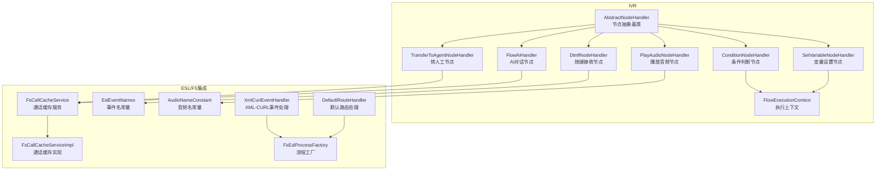

**图表来源**
- [yudao-cloud/yudao-module-cc/yudao-module-cc-server/src/main/java/cn/iocoder/yudao/module/cc/ivr/handler/node/AbstractNodeHandler.java](file://yudao-cloud/yudao-module-cc/yudao-module-cc-server/src/main/java/cn/iocoder/yudao/module/cc/ivr/handler/node/AbstractNodeHandler.java)
- [yudao-cloud/yudao-module-cc/yudao-module-cc-server/src/main/java/cn/iocoder/yudao/module/cc/ivr/handler/node/FlowAiHandler.java](file://yudao-cloud/yudao-module-cc/yudao-module-cc-server/src/main/java/cn/iocoder/yudao/module/cc/ivr/handler/node/FlowAiHandler.java)
- [yudao-cloud/yudao-module-cc/yudao-module-cc-server/src/main/java/cn/iocoder/yudao/module/cc/esl/service/FsCallCacheService.java](file://yudao-cloud/yudao-module-cc/yudao-module-cc-server/src/main/java/cn/iocoder/yudao/module/cc/esl/service/FsCallCacheService.java)

## 核心组件
- 节点抽象基类：定义节点生命周期、统一异常处理、上下文访问与结果返回约定
- 内置节点处理器：
  - 播放音频节点：触发FS播放指定音频，支持超时与中断
  - 按键接收节点：等待DTMF输入，支持超时与重复次数限制
  - 条件判断节点：基于上下文变量进行分支跳转
  - 转人工节点：通过会话桥接或路由将通话转至坐席
  - 变量设置节点：在上下文中读写变量，供后续节点使用
  - **AI对话节点**：集成ASR识别与AI对话，支持中断词匹配和多轮对话
- 执行上下文：跨节点共享数据（如主叫号码、业务ID、用户输入等）
- ESL集成：事件路由、XML-CURL回调、通话缓存、音频资源常量

**章节来源**
- [yudao-cloud/yudao-module-cc/yudao-module-cc-server/src/main/java/cn/iocoder/yudao/module/cc/ivr/handler/node/AbstractNodeHandler.java](file://yudao-cloud/yudao-module-cc/yudao-module-cc-server/src/main/java/cn/iocoder/yudao/module/cc/ivr/handler/node/AbstractNodeHandler.java)
- [yudao-cloud/yudao-module-cc/yudao-module-cc-server/src/main/java/cn/iocoder/yudao/module/cc/ivr/handler/node/FlowAiHandler.java](file://yudao-cloud/yudao-module-cc/yudao-module-cc-server/src/main/java/cn/iocoder/yudao/module/cc/ivr/handler/node/FlowAiHandler.java)
- [yudao-cloud/yudao-module-cc/yudao-module-cc-server/src/main/java/cn/iocoder/yudao/module/cc/ivr/dto/FlowExecutionContext.java](file://yudao-cloud/yudao-module-cc/yudao-module-cc-server/src/main/java/cn/iocoder/yudao/module/cc/ivr/dto/FlowExecutionContext.java)

## 架构总览

IVR执行由ESL事件驱动，XML-CURL回调进入流程工厂，选择对应流程处理器；流程内部按节点顺序执行，每个节点读取/更新执行上下文，必要时调用FS能力（播放音频、收号、桥接等）。通话级状态通过缓存服务持久化到内存/Redis，保证节点间一致性。
**新增AI对话节点**通过ASR流式识别用户语音，结合AI对话服务实现智能交互。

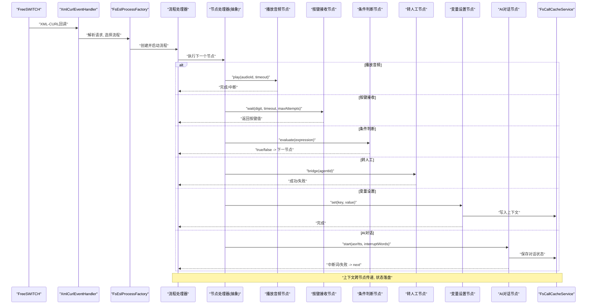

**图表来源**

- [yudao-cloud/yudao-module-cc/yudao-module-cc-server/src/main/java/cn/iocoder/yudao/module/cc/esl/handler/event/XmlCurlEventHandler.java](file://yudao-cloud/yudao-module-cc/yudao-module-cc-server/src/main/java/cn/iocoder/yudao/module/cc/esl/handler/event/XmlCurlEventHandler.java)
- [yudao-cloud/yudao-module-cc/yudao-module-cc-server/src/main/java/cn/iocoder/yudao/module/cc/esl/factory/FsEslProcessFactory.java](file://yudao-cloud/yudao-module-cc/yudao-module-cc-server/src/main/java/cn/iocoder/yudao/module/cc/esl/factory/FsEslProcessFactory.java)
- [yudao-cloud/yudao-module-cc/yudao-module-cc-server/src/main/java/cn/iocoder/yudao/module/cc/esl/service/FsCallCacheService.java](file://yudao-cloud/yudao-module-cc/yudao-module-cc-server/src/main/java/cn/iocoder/yudao/module/cc/esl/service/FsCallCacheService.java)
- [yudao-cloud/yudao-module-cc/yudao-module-cc-server/src/main/java/cn/iocoder/yudao/module/cc/ivr/handler/node/FlowAiHandler.java](file://yudao-cloud/yudao-module-cc/yudao-module-cc-server/src/main/java/cn/iocoder/yudao/module/cc/ivr/handler/node/FlowAiHandler.java)

## 详细组件分析

### 节点抽象基类（AbstractNodeHandler）
- 职责：定义节点统一入口、参数校验、异常捕获、结果封装、上下文访问
- 关键行为：
  - 节点开始/结束钩子，便于埋点与日志
  - 统一的错误码与消息返回，便于上层聚合
  - 对FS异步操作的超时与取消策略
- 设计要点：
  - 所有内置节点继承该基类，确保一致的行为与可观测性
  - 通过上下文对象获取/设置节点间共享数据

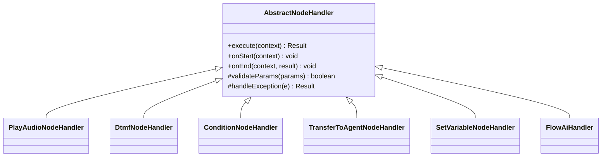

**图表来源**
- [yudao-cloud/yudao-module-cc/yudao-module-cc-server/src/main/java/cn/iocoder/yudao/module/cc/ivr/handler/node/AbstractNodeHandler.java](file://yudao-cloud/yudao-module-cc/yudao-module-cc-server/src/main/java/cn/iocoder/yudao/module/cc/ivr/handler/node/AbstractNodeHandler.java)
- [yudao-cloud/yudao-module-cc/yudao-module-cc-server/src/main/java/cn/iocoder/yudao/module/cc/ivr/handler/node/FlowAiHandler.java](file://yudao-cloud/yudao-module-cc/yudao-module-cc-server/src/main/java/cn/iocoder/yudao/module/cc/ivr/handler/node/FlowAiHandler.java)

**章节来源**
- [yudao-cloud/yudao-module-cc/yudao-module-cc-server/src/main/java/cn/iocoder/yudao/module/cc/ivr/handler/node/AbstractNodeHandler.java](file://yudao-cloud/yudao-module-cc/yudao-module-cc-server/src/main/java/cn/iocoder/yudao/module/cc/ivr/handler/node/AbstractNodeHandler.java)

### 播放音频节点（PlayAudioNodeHandler）
- 功能：触发FS播放指定音频文件，支持超时、打断、循环次数控制
- 关键路径：
  - 校验音频标识与播放参数
  - 调用FS播放接口，监听播放完成或中断事件
  - 将播放结果写入上下文，供后续节点使用
- 异常处理：
  - 音频不存在、FS不可用、播放超时等错误统一封装
- 性能建议：
  - 预加载常用音频，减少首次延迟
  - 合理设置超时，避免阻塞流程

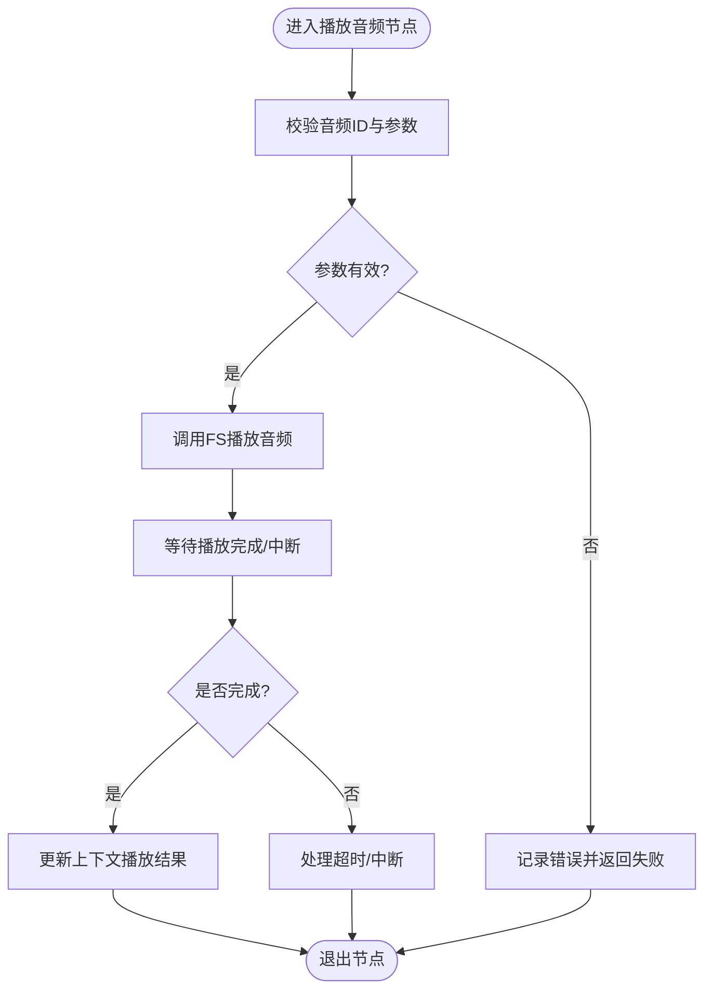

**图表来源**
- [yudao-cloud/yudao-module-cc/yudao-module-cc-server/src/main/java/cn/iocoder/yudao/module/cc/ivr/handler/node/PlayAudioNodeHandler.java](file://yudao-cloud/yudao-module-cc/yudao-module-cc-server/src/main/java/cn/iocoder/yudao/module/cc/ivr/handler/node/PlayAudioNodeHandler.java)
- [yudao-cloud/yudao-module-cc/yudao-module-cc-server/src/main/java/cn/iocoder/yudao/module/cc/esl/constant/AudioNameConstant.java](file://yudao-cloud/yudao-module-cc/yudao-module-cc-server/src/main/java/cn/iocoder/yudao/module/cc/esl/constant/AudioNameConstant.java)

**章节来源**
- [yudao-cloud/yudao-module-cc/yudao-module-cc-server/src/main/java/cn/iocoder/yudao/module/cc/ivr/handler/node/PlayAudioNodeHandler.java](file://yudao-cloud/yudao-module-cc/yudao-module-cc-server/src/main/java/cn/iocoder/yudao/module/cc/ivr/handler/node/PlayAudioNodeHandler.java)
- [yudao-cloud/yudao-module-cc/yudao-module-cc-server/src/main/java/cn/iocoder/yudao/module/cc/esl/constant/AudioNameConstant.java](file://yudao-cloud/yudao-module-cc/yudao-module-cc-server/src/main/java/cn/iocoder/yudao/module/cc/esl/constant/AudioNameConstant.java)

### 按键接收节点（DtmfNodeHandler）
- 功能：等待用户按键输入，支持超时、最大尝试次数、按键集合过滤
- 关键路径：
  - 配置按键集合与超时时间
  - 订阅DTMF事件，收集按键直至满足条件
  - 将按键结果写入上下文
- 异常处理：
  - 无按键、按键非法、事件丢失等错误处理
- 性能建议：
  - 合理设置超时与重试，避免长时间占用通道

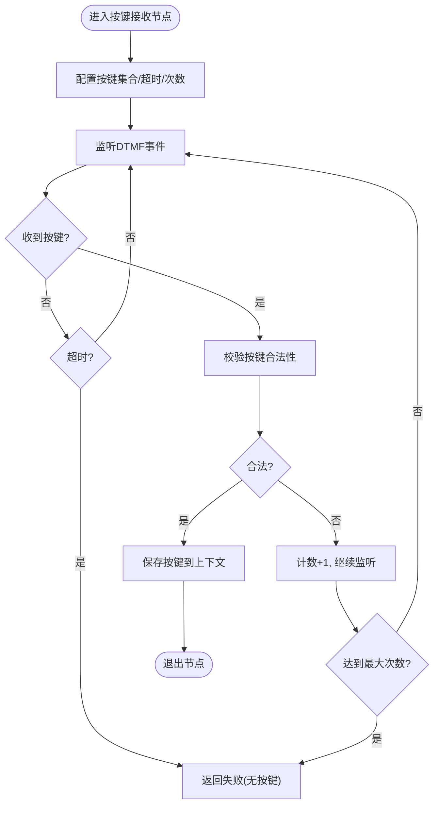

**图表来源**
- [yudao-cloud/yudao-module-cc/yudao-module-cc-server/src/main/java/cn/iocoder/yudao/module/cc/ivr/handler/node/DtmfNodeHandler.java](file://yudao-cloud/yudao-module-cc/yudao-module-cc-server/src/main/java/cn/iocoder/yudao/module/cc/ivr/handler/node/DtmfNodeHandler.java)
- [yudao-cloud/yudao-module-cc/yudao-module-cc-server/src/main/java/cn/iocoder/yudao/module/cc/esl/constant/EslEventNames.java](file://yudao-cloud/yudao-module-cc/yudao-module-cc-server/src/main/java/cn/iocoder/yudao/module/cc/esl/constant/EslEventNames.java)

**章节来源**
- [yudao-cloud/yudao-module-cc/yudao-module-cc-server/src/main/java/cn/iocoder/yudao/module/cc/ivr/handler/node/DtmfNodeHandler.java](file://yudao-cloud/yudao-module-cc/yudao-module-cc-server/src/main/java/cn/iocoder/yudao/module/cc/ivr/handler/node/DtmfNodeHandler.java)
- [yudao-cloud/yudao-module-cc/yudao-module-cc-server/src/main/java/cn/iocoder/yudao/module/cc/esl/constant/EslEventNames.java](file://yudao-cloud/yudao-module-cc/yudao-module-cc-server/src/main/java/cn/iocoder/yudao/module/cc/esl/constant/EslEventNames.java)

### 条件判断节点（ConditionNodeHandler）
- 功能：根据表达式或上下文变量决定下一节点
- 关键路径：
  - 解析条件表达式（支持变量引用、比较、逻辑运算）
  - 计算结果为真/假，选择不同分支
- 异常处理：
  - 表达式语法错误、变量缺失等
- 性能建议：
  - 条件表达式尽量简单，避免复杂计算

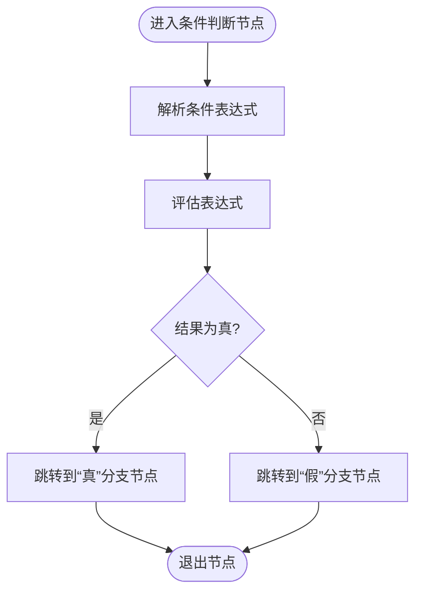

**图表来源**
- [yudao-cloud/yudao-module-cc/yudao-module-cc-server/src/main/java/cn/iocoder/yudao/module/cc/ivr/handler/node/ConditionNodeHandler.java](file://yudao-cloud/yudao-module-cc/yudao-module-cc-server/src/main/java/cn/iocoder/yudao/module/cc/ivr/handler/node/ConditionNodeHandler.java)

**章节来源**
- [yudao-cloud/yudao-module-cc/yudao-module-cc-server/src/main/java/cn/iocoder/yudao/module/cc/ivr/handler/node/ConditionNodeHandler.java](file://yudao-cloud/yudao-module-cc/yudao-module-cc-server/src/main/java/cn/iocoder/yudao/module/cc/ivr/handler/node/ConditionNodeHandler.java)

### 转人工节点（TransferToAgentNodeHandler）
- 功能：将当前通话桥接到坐席或指定路由
- 关键路径：
  - 从上下文获取坐席信息或路由目标
  - 调用FS桥接或路由接口
  - 记录桥接结果与原因
- 异常处理：
  - 坐席忙、路由失败、FS不可用等
- 性能建议：
  - 并发桥接时注意限流与重试退避

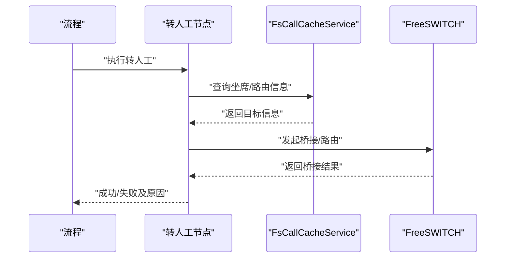

**图表来源**
- [yudao-cloud/yudao-module-cc/yudao-module-cc-server/src/main/java/cn/iocoder/yudao/module/cc/ivr/handler/node/TransferToAgentNodeHandler.java](file://yudao-cloud/yudao-module-cc/yudao-module-cc-server/src/main/java/cn/iocoder/yudao/module/cc/ivr/handler/node/TransferToAgentNodeHandler.java)
- [yudao-cloud/yudao-module-cc/yudao-module-cc-server/src/main/java/cn/iocoder/yudao/module/cc/esl/service/FsCallCacheService.java](file://yudao-cloud/yudao-module-cc/yudao-module-cc-server/src/main/java/cn/iocoder/yudao/module/cc/esl/service/FsCallCacheService.java)

**章节来源**
- [yudao-cloud/yudao-module-cc/yudao-module-cc-server/src/main/java/cn/iocoder/yudao/module/cc/ivr/handler/node/TransferToAgentNodeHandler.java](file://yudao-cloud/yudao-module-cc/yudao-module-cc-server/src/main/java/cn/iocoder/yudao/module/cc/ivr/handler/node/TransferToAgentNodeHandler.java)
- [yudao-cloud/yudao-module-cc/yudao-module-cc-server/src/main/java/cn/iocoder/yudao/module/cc/esl/service/FsCallCacheService.java](file://yudao-cloud/yudao-module-cc/yudao-module-cc-server/src/main/java/cn/iocoder/yudao/module/cc/esl/service/FsCallCacheService.java)

### 变量设置节点（SetVariableNodeHandler）
- 功能：在上下文中设置键值对，供后续节点读取
- 关键路径：
  - 解析变量名与值（支持表达式求值）
  - 写入执行上下文与通话缓存
- 异常处理：
  - 变量名非法、值类型不匹配等
- 性能建议：
  - 批量设置时合并写入，减少缓存操作

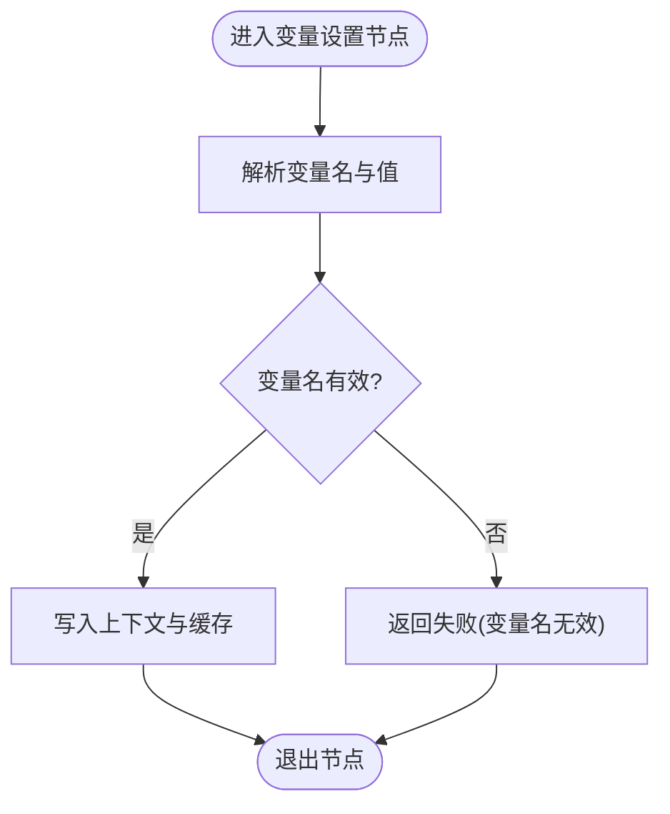

**图表来源**
- [yudao-cloud/yudao-module-cc/yudao-module-cc-server/src/main/java/cn/iocoder/yudao/module/cc/ivr/handler/node/SetVariableNodeHandler.java](file://yudao-cloud/yudao-module-cc/yudao-module-cc-server/src/main/java/cn/iocoder/yudao/module/cc/ivr/handler/node/SetVariableNodeHandler.java)
- [yudao-cloud/yudao-module-cc/yudao-module-cc-server/src/main/java/cn/iocoder/yudao/module/cc/esl/service/FsCallCacheService.java](file://yudao-cloud/yudao-module-cc/yudao-module-cc-server/src/main/java/cn/iocoder/yudao/module/cc/esl/service/FsCallCacheService.java)

**章节来源**
- [yudao-cloud/yudao-module-cc/yudao-module-cc-server/src/main/java/cn/iocoder/yudao/module/cc/ivr/handler/node/SetVariableNodeHandler.java](file://yudao-cloud/yudao-module-cc/yudao-module-cc-server/src/main/java/cn/iocoder/yudao/module/cc/ivr/handler/node/SetVariableNodeHandler.java)
- [yudao-cloud/yudao-module-cc/yudao-module-cc-server/src/main/java/cn/iocoder/yudao/module/cc/esl/service/FsCallCacheService.java](file://yudao-cloud/yudao-module-cc/yudao-module-cc-server/src/main/java/cn/iocoder/yudao/module/cc/esl/service/FsCallCacheService.java)

### AI对话节点（FlowAiHandler）

- **功能**：集成ASR流式识别与AI对话服务，实现智能语音交互
- **核心特性**：
    - ASR实时识别用户语音，支持中断词包含匹配
    - 多轮对话保持上下文，复用同一会话ID
    - TTS流式播报AI回复，支持开场语配置
    - 完善的超时保护与轮次限制，防止无限对话
- **关键路径**：
    - 初始化ASR监听器，注册音频采集
    - 创建或复用AI对话会话
    - 每轮识别后先匹配中断词，命中则立即结束
    - 未命中则调用AI服务，TTS播报回复后继续监听
    - 静默超时或轮次超限统一标记为"ai对话失败"
- **异常处理**：
    - ASR识别异常、AI服务调用失败、TTS播放失败等
    - 回声保护窗口避免系统自对话
    - 线程安全保证多路并发对话互斥
- **性能优化**：
    - 专用线程池处理AI调用，避免阻塞IO线程
    - 流式播放减少首字延迟
    - 合理的超时配置防止资源泄漏

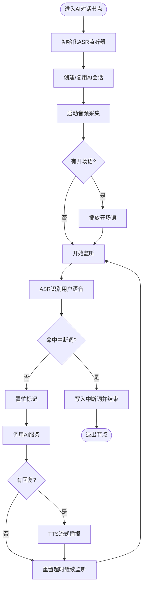

**图表来源**

- [yudao-cloud/yudao-module-cc/yudao-module-cc-server/src/main/java/cn/iocoder/yudao/module/cc/ivr/handler/node/FlowAiHandler.java](file://yudao-cloud/yudao-module-cc/yudao-module-cc-server/src/main/java/cn/iocoder/yudao/module/cc/ivr/handler/node/FlowAiHandler.java)
- [yudao-cloud/yudao-module-cc/yudao-module-cc-server/src/main/java/cn/iocoder/yudao/module/cc/ivr/properties/FlowAiNodeProperties.java](file://yudao-cloud/yudao-module-cc/yudao-module-cc-server/src/main/java/cn/iocoder/yudao/module/cc/ivr/properties/FlowAiNodeProperties.java)

**章节来源**

- [yudao-cloud/yudao-module-cc/yudao-module-cc-server/src/main/java/cn/iocoder/yudao/module/cc/ivr/handler/node/FlowAiHandler.java](file://yudao-cloud/yudao-module-cc/yudao-module-cc-server/src/main/java/cn/iocoder/yudao/module/cc/ivr/handler/node/FlowAiHandler.java)
- [yudao-cloud/yudao-module-cc/yudao-module-cc-server/src/main/java/cn/iocoder/yudao/module/cc/ivr/properties/FlowAiNodeProperties.java](file://yudao-cloud/yudao-module-cc/yudao-module-cc-server/src/main/java/cn/iocoder/yudao/module/cc/ivr/properties/FlowAiNodeProperties.java)

### 执行上下文与事件模型
- 执行上下文（FlowExecutionContext）：节点间共享数据的载体，包含主叫信息、业务ID、用户输入、中间结果等
- ESL事件模型（FlowEventTypeEnum）：定义流程事件类型，用于节点状态流转与监控
- 通话缓存（FsCallCacheService/Impl）：跨节点持久化上下文，保障节点重启或进程切换后状态不丢失

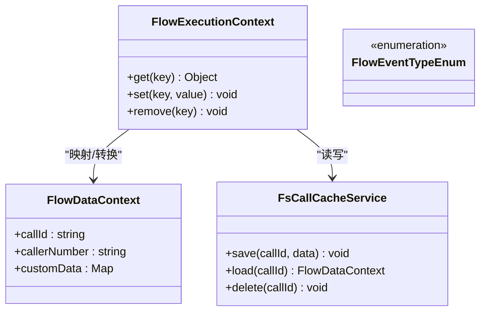

**图表来源**
- [yudao-cloud/yudao-module-cc/yudao-module-cc-server/src/main/java/cn/iocoder/yudao/module/cc/ivr/dto/FlowExecutionContext.java](file://yudao-cloud/yudao-module-cc/yudao-module-cc-server/src/main/java/cn/iocoder/yudao/module/cc/ivr/dto/FlowExecutionContext.java)
- [yudao-cloud/yudao-module-cc/yudao-module-cc-server/src/main/java/cn/iocoder/yudao/module/cc/esl/dto/FlowDataContext.java](file://yudao-cloud/yudao-module-cc/yudao-module-cc-server/src/main/java/cn/iocoder/yudao/module/cc/esl/dto/FlowDataContext.java)
- [yudao-cloud/yudao-module-cc/yudao-module-cc-server/src/main/java/cn/iocoder/yudao/module/cc/esl/enums/FlowEventTypeEnum.java](file://yudao-cloud/yudao-module-cc/yudao-module-cc-server/src/main/java/cn/iocoder/yudao/module/cc/esl/enums/FlowEventTypeEnum.java)
- [yudao-cloud/yudao-module-cc/yudao-module-cc-server/src/main/java/cn/iocoder/yudao/module/cc/esl/service/FsCallCacheService.java](file://yudao-cloud/yudao-module-cc/yudao-module-cc-server/src/main/java/cn/iocoder/yudao/module/cc/esl/service/FsCallCacheService.java)

**章节来源**
- [yudao-cloud/yudao-module-cc/yudao-module-cc-server/src/main/java/cn/iocoder/yudao/module/cc/ivr/dto/FlowExecutionContext.java](file://yudao-cloud/yudao-module-cc/yudao-module-cc-server/src/main/java/cn/iocoder/yudao/module/cc/ivr/dto/FlowExecutionContext.java)
- [yudao-cloud/yudao-module-cc/yudao-module-cc-server/src/main/java/cn/iocoder/yudao/module/cc/esl/dto/FlowDataContext.java](file://yudao-cloud/yudao-module-cc/yudao-module-cc-server/src/main/java/cn/iocoder/yudao/module/cc/esl/dto/FlowDataContext.java)
- [yudao-cloud/yudao-module-cc/yudao-module-cc-server/src/main/java/cn/iocoder/yudao/module/cc/esl/enums/FlowEventTypeEnum.java](file://yudao-cloud/yudao-module-cc/yudao-module-cc-server/src/main/java/cn/iocoder/yudao/module/cc/esl/enums/FlowEventTypeEnum.java)
- [yudao-cloud/yudao-module-cc/yudao-module-cc-server/src/main/java/cn/iocoder/yudao/module/cc/esl/service/FsCallCacheService.java](file://yudao-cloud/yudao-module-cc/yudao-module-cc-server/src/main/java/cn/iocoder/yudao/module/cc/esl/service/FsCallCacheService.java)

## 依赖关系分析
- 节点处理器依赖：
  - 播放音频节点依赖音频常量
  - 按键接收节点依赖ESL事件名
  - 转人工节点依赖通话缓存服务
  - 变量设置节点依赖执行上下文与缓存服务
  - **AI对话节点依赖ASR服务、AI对话API、音频采集服务**
- 事件路由依赖：
  - XML-CURL事件处理器依赖流程工厂
  - 默认路由处理器依赖流程工厂
- 耦合与内聚：
  - 节点与FS能力解耦，通过抽象接口调用
  - 上下文与缓存分离，便于替换存储后端

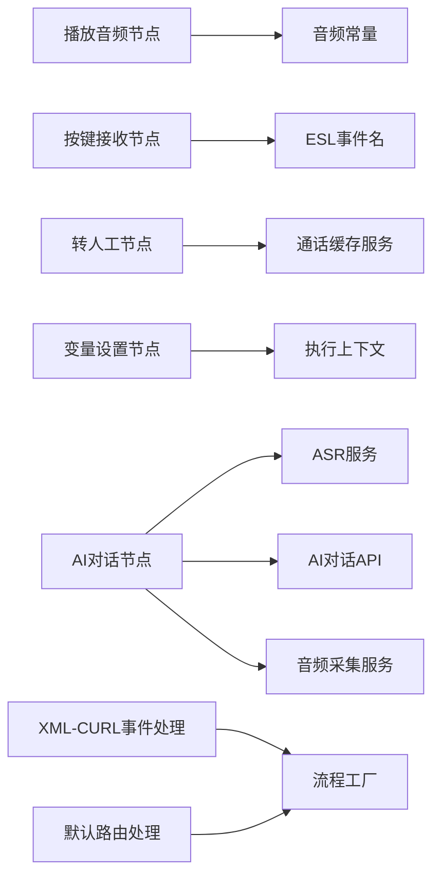

**图表来源**
- [yudao-cloud/yudao-module-cc/yudao-module-cc-server/src/main/java/cn/iocoder/yudao/module/cc/esl/constant/AudioNameConstant.java](file://yudao-cloud/yudao-module-cc/yudao-module-cc-server/src/main/java/cn/iocoder/yudao/module/cc/esl/constant/AudioNameConstant.java)
- [yudao-cloud/yudao-module-cc/yudao-module-cc-server/src/main/java/cn/iocoder/yudao/module/cc/esl/constant/EslEventNames.java](file://yudao-cloud/yudao-module-cc/yudao-module-cc-server/src/main/java/cn/iocoder/yudao/module/cc/esl/constant/EslEventNames.java)
- [yudao-cloud/yudao-module-cc/yudao-module-cc-server/src/main/java/cn/iocoder/yudao/module/cc/esl/service/FsCallCacheService.java](file://yudao-cloud/yudao-module-cc/yudao-module-cc-server/src/main/java/cn/iocoder/yudao/module/cc/esl/service/FsCallCacheService.java)
- [yudao-cloud/yudao-module-cc/yudao-module-cc-server/src/main/java/cn/iocoder/yudao/module/cc/esl/handler/event/XmlCurlEventHandler.java](file://yudao-cloud/yudao-module-cc/yudao-module-cc-server/src/main/java/cn/iocoder/yudao/module/cc/esl/handler/event/XmlCurlEventHandler.java)
- [yudao-cloud/yudao-module-cc/yudao-module-cc-server/src/main/java/cn/iocoder/yudao/module/cc/esl/handler/route/DefaultRouteHandler.java](file://yudao-cloud/yudao-module-cc/yudao-module-cc-server/src/main/java/cn/iocoder/yudao/module/cc/esl/handler/route/DefaultRouteHandler.java)
- [yudao-cloud/yudao-module-cc/yudao-module-cc-server/src/main/java/cn/iocoder/yudao/module/cc/esl/factory/FsEslProcessFactory.java](file://yudao-cloud/yudao-module-cc/yudao-module-cc-server/src/main/java/cn/iocoder/yudao/module/cc/esl/factory/FsEslProcessFactory.java)

**章节来源**
- [yudao-cloud/yudao-module-cc/yudao-module-cc-server/src/main/java/cn/iocoder/yudao/module/cc/esl/constant/AudioNameConstant.java](file://yudao-cloud/yudao-module-cc/yudao-module-cc-server/src/main/java/cn/iocoder/yudao/module/cc/esl/constant/AudioNameConstant.java)
- [yudao-cloud/yudao-module-cc/yudao-module-cc-server/src/main/java/cn/iocoder/yudao/module/cc/esl/constant/EslEventNames.java](file://yudao-cloud/yudao-module-cc/yudao-module-cc-server/src/main/java/cn/iocoder/yudao/module/cc/esl/constant/EslEventNames.java)
- [yudao-cloud/yudao-module-cc/yudao-module-cc-server/src/main/java/cn/iocoder/yudao/module/cc/esl/handler/event/XmlCurlEventHandler.java](file://yudao-cloud/yudao-module-cc/yudao-module-cc-server/src/main/java/cn/iocoder/yudao/module/cc/esl/handler/event/XmlCurlEventHandler.java)
- [yudao-cloud/yudao-module-cc/yudao-module-cc-server/src/main/java/cn/iocoder/yudao/module/cc/esl/handler/route/DefaultRouteHandler.java](file://yudao-cloud/yudao-module-cc/yudao-module-cc-server/src/main/java/cn/iocoder/yudao/module/cc/esl/handler/route/DefaultRouteHandler.java)
- [yudao-cloud/yudao-module-cc/yudao-module-cc-server/src/main/java/cn/iocoder/yudao/module/cc/esl/factory/FsEslProcessFactory.java](file://yudao-cloud/yudao-module-cc/yudao-module-cc-server/src/main/java/cn/iocoder/yudao/module/cc/esl/factory/FsEslProcessFactory.java)

## 性能考虑
- 节点执行效率
  - 减少不必要的FS调用，合并多次上下文写入
  - 合理设置超时与重试，避免长尾阻塞
  - **AI对话节点使用专用线程池避免阻塞IO线程**
- 上下文与缓存
  - 使用本地缓存热点数据，降低远程缓存压力
  - 对大对象进行序列化压缩，减少网络开销
- 并发与限流
  - 对桥接、播放等高开销操作进行限流
  - 使用连接池与线程池管理外部资源
  - **AI对话节点通过AtomicBoolean保证多路并发互斥**
- 可观测性
  - 节点开始/结束埋点，统计耗时与失败率
  - 关键路径打点，便于定位瓶颈
  - **AI对话节点提供详细的ASR识别和AI调用日志**

## 故障排查指南
- 常见问题
  - 音频播放失败：检查音频文件是否存在、FS权限与路径
  - 按键无响应：确认DTMF事件订阅与超时配置
  - 转人工失败：检查坐席状态、路由配置与FS桥接能力
  - 变量未生效：确认上下文写入与缓存同步
  - **AI对话失败：检查ASR引擎配置、AI服务可用性、网络连接**
- 排查步骤
  - 查看节点日志与错误码
  - 检查上下文内容与缓存数据
  - 验证FS事件与XML-CURL回调链路
  - **AI对话问题：检查ASR识别日志、AI会话创建、TTS播放状态**
- 工具与技巧
  - 启用详细日志级别，输出节点执行轨迹
  - 使用单元测试模拟FS事件，验证节点逻辑
  - 通过监控指标观察节点耗时与失败率
  - **AI对话测试：使用pjsua WAV注入模拟用户语音，验证中断词匹配**

**章节来源**
- [yudao-cloud/yudao-module-cc/yudao-module-cc-server/src/main/java/cn/iocoder/yudao/module/cc/esl/handler/event/XmlCurlEventHandler.java](file://yudao-cloud/yudao-module-cc/yudao-module-cc-server/src/main/java/cn/iocoder/yudao/module/cc/esl/handler/event/XmlCurlEventHandler.java)
- [yudao-cloud/yudao-module-cc/yudao-module-cc-server/src/main/java/cn/iocoder/yudao/module/cc/esl/handler/route/DefaultRouteHandler.java](file://yudao-cloud/yudao-module-cc/yudao-module-cc-server/src/main/java/cn/iocoder/yudao/module/cc/esl/handler/route/DefaultRouteHandler.java)
- [yudao-cloud/yudao-module-cc/yudao-module-cc-server/src/main/java/cn/iocoder/yudao/module/cc/esl/factory/FsEslProcessFactory.java](file://yudao-cloud/yudao-module-cc/yudao-module-cc-server/src/main/java/cn/iocoder/yudao/module/cc/esl/factory/FsEslProcessFactory.java)
- [yudao-cloud/yudao-module-cc/doc/test-all/cc_e2e_test.py](file://yudao-cloud/yudao-module-cc/doc/test-all/cc_e2e_test.py)

## 结论

本文档系统梳理了IVR节点处理器的架构与实现，覆盖内置节点类型、执行引擎机制、接口规范与扩展方式，并提供自定义节点开发示例、测试方法与性能优化、调试技巧。
**新增的AI对话节点**实现了完整的语音交互能力，通过ASR识别与AI对话服务的集成，为用户提供智能化的IVR体验。遵循统一抽象与上下文传递的设计，能够高效构建可扩展、可观测、高可用的IVR流程。

## 附录
- 自定义节点开发步骤
  - 新建节点类，继承抽象基类
  - 实现节点执行逻辑，读取/更新上下文
  - 注册节点处理器，配置节点属性
  - 编写单元测试，模拟FS事件与上下文
  - **AI对话节点：集成ASR服务、AI API、音频采集，实现多轮对话管理**
- 最佳实践
  - 保持节点单一职责，避免复杂逻辑
  - 使用表达式引擎简化条件判断
  - 对FS调用进行超时与重试保护
  - 完善日志与埋点，提升可观测性
  - **AI对话节点：合理配置超时和轮次限制，防止资源泄漏**
- **AI对话测试场景**
    - 专用路由107：坐席1001拨00600触发AI对话流程
    - 中断词匹配：识别"转人工"等关键词后立即转接坐席
    - 失败处理：AI服务异常、ASR识别失败统一标记为"ai对话失败"
    - 三方证据：Java日志、数据库记录、ESL事件联合验证
    - 测试脚本：场景10使用pjsua WAV注入模拟用户语音输入

**章节来源**

- [yudao-cloud/yudao-module-cc/doc/test-all/cc_e2e_test.py](file://yudao-cloud/yudao-module-cc/doc/test-all/cc_e2e_test.py)
- [yudao-cloud/yudao-module-cc/yudao-module-cc-server/src/main/java/cn/iocoder/yudao/module/cc/ivr/handler/node/FlowAiHandler.java](file://yudao-cloud/yudao-module-cc/yudao-module-cc-server/src/main/java/cn/iocoder/yudao/module/cc/ivr/handler/node/FlowAiHandler.java)
- [yudao-cloud/yudao-module-cc/yudao-module-cc-server/src/main/java/cn/iocoder/yudao/module/cc/ivr/properties/FlowAiNodeProperties.java](file://yudao-cloud/yudao-module-cc/yudao-module-cc-server/src/main/java/cn/iocoder/yudao/module/cc/ivr/properties/FlowAiNodeProperties.java)
- [yudao-cloud/yudao-module-cc/yudao-module-cc-server/src/main/java/cn/iocoder/yudao/module/cc/ivr/constant/NodeOutputRegistry.java](file://yudao-cloud/yudao-module-cc/yudao-module-cc-server/src/main/java/cn/iocoder/yudao/module/cc/ivr/constant/NodeOutputRegistry.java)