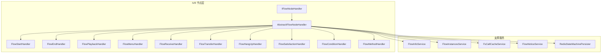
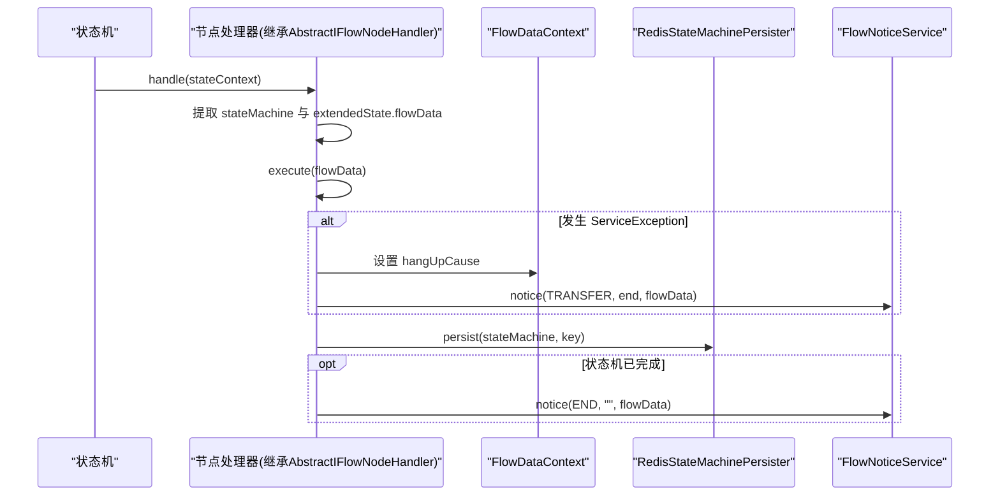
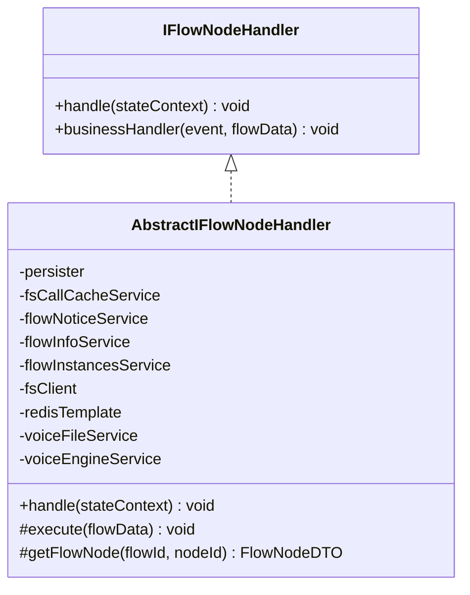
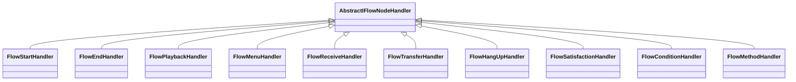
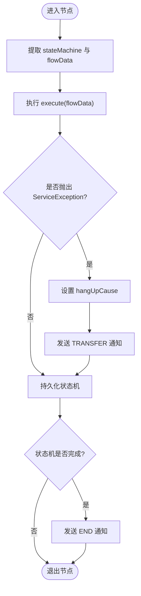
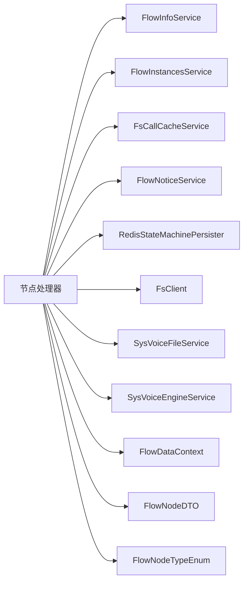

# 节点架构基础

<cite>
**本文引用的文件**
- [IFlowNodeHandler.java](file://yudao-cloud/yudao-module-cc/yudao-module-cc-server/src/main/java/cn/iocoder/yudao/module/cc/ivr/handler/node/IFlowNodeHandler.java)
- [AbstractIFlowNodeHandler.java](file://yudao-cloud/yudao-module-cc/yudao-module-cc-server/src/main/java/cn/iocoder/yudao/module/cc/ivr/handler/node/AbstractIFlowNodeHandler.java)
- [FlowNodeHanderConstant.java](file://yudao-cloud/yudao-module-cc/yudao-module-cc-server/src/main/java/cn/iocoder/yudao/module/cc/ivr/constant/FlowNodeHanderConstant.java)
- [FlowStartHandler.java](file://yudao-cloud/yudao-module-cc/yudao-module-cc-server/src/main/java/cn/iocoder/yudao/module/cc/ivr/handler/node/FlowStartHandler.java)
- [FlowEndHandler.java](file://yudao-cloud/yudao-module-cc/yudao-module-cc-server/src/main/java/cn/iocoder/yudao/module/cc/ivr/handler/node/FlowEndHandler.java)
- [FlowPlaybackHandler.java](file://yudao-cloud/yudao-module-cc/yudao-module-cc-server/src/main/java/cn/iocoder/yudao/module/cc/ivr/handler/node/FlowPlaybackHandler.java)
- [FlowMenuHandler.java](file://yudao-cloud/yudao-module-cc/yudao-module-cc-server/src/main/java/cn/iocoder/yudao/module/cc/ivr/handler/node/FlowMenuHandler.java)
- [FlowReceiveHandler.java](file://yudao-cloud/yudao-module-cc/yudao-module-cc-server/src/main/java/cn/iocoder/yudao/module/cc/ivr/handler/node/FlowReceiveHandler.java)
- [FlowTransferHandler.java](file://yudao-cloud/yudao-module-cc/yudao-module-cc-server/src/main/java/cn/iocoder/yudao/module/cc/ivr/handler/node/FlowTransferHandler.java)
- [FlowHangUpHandler.java](file://yudao-cloud/yudao-module-cc/yudao-module-cc-server/src/main/java/cn/iocoder/yudao/module/cc/ivr/handler/node/FlowHangUpHandler.java)
- [FlowSatisfactionHandler.java](file://yudao-cloud/yudao-module-cc/yudao-module-cc-server/src/main/java/cn/iocoder/yudao/module/cc/ivr/handler/node/FlowSatisfactionHandler.java)
- [FlowConditionHandler.java](file://yudao-cloud/yudao-module-cc/yudao-module-cc-server/src/main/java/cn/iocoder/yudao/module/cc/ivr/handler/node/FlowConditionHandler.java)
- [FlowMethodHandler.java](file://yudao-cloud/yudao-module-cc/yudao-module-cc-server/src/main/java/cn/iocoder/yudao/module/cc/ivr/handler/node/FlowMethodHandler.java)
- [FlowEvent.java](file://yudao-cloud/yudao-module-cc/yudao-module-cc-server/src/main/java/cn/iocoder/yudao/module/cc/ivr/event/FlowEvent.java)
- [FlowEventListener.java](file://yudao-cloud/yudao-module-cc/yudao-module-cc-server/src/main/java/cn/iocoder/yudao/module/cc/ivr/listener/FlowEventListener.java)
- [FlowStateMachineListener.java](file://yudao-cloud/yudao-module-cc/yudao-module-cc-server/src/main/java/cn/iocoder/yudao/module/cc/ivr/listener/FlowStateMachineListener.java)
- [FlowInfoService.java](file://yudao-cloud/yudao-module-cc/yudao-module-cc-server/src/main/java/cn/iocoder/yudao/module/cc/service/flow/FlowInfoService.java)
- [FlowInstancesService.java](file://yudao-cloud/yudao-module-cc/yudao-module-cc-server/src/main/java/cn/iocoder/yudao/module/cc/service/flow/FlowInstancesService.java)
- [FsCallCacheService.java](file://yudao-cloud/yudao-module-cc/yudao-module-cc-server/src/main/java/cn/iocoder/yudao/module/cc/esl/service/FsCallCacheService.java)
- [FlowNoticeService.java](file://yudao-cloud/yudao-module-cc/yudao-module-cc-server/src/main/java/cn/iocoder/yudao/module/cc/esl/service/FlowNoticeService.java)
- [FlowDataContext.java](file://yudao-cloud/yudao-module-cc/yudao-module-cc-server/src/main/java/cn/iocoder/yudao/module/cc/esl/dto/FlowDataContext.java)
- [FlowNodeDTO.java](file://yudao-cloud/yudao-module-cc/yudao-module-cc-server/src/main/java/cn/iocoder/yudao/module/cc/ivr/dto/FlowNodeDTO.java)
- [FlowNodeTypeEnum.java](file://yudao-cloud/yudao-module-cc/yudao-module-cc-server/src/main/java/cn/iocoder/yudao/module/cc/ivr/enums/FlowNodeTypeEnum.java)
</cite>

## 目录
1. [简介](#简介)
2. [项目结构](#项目结构)
3. [核心组件](#核心组件)
4. [架构总览](#架构总览)
5. [详细组件分析](#详细组件分析)
6. [依赖关系分析](#依赖关系分析)
7. [性能考量](#性能考量)
8. [故障排查指南](#故障排查指南)
9. [结论](#结论)
10. [附录：自定义节点开发指南与示例](#附录自定义节点开发指南与示例)

## 简介
本文件面向IVR（交互式语音应答）节点架构的基础实现，聚焦于节点处理器的核心接口与抽象基类设计、生命周期管理、执行上下文传递、错误处理机制，以及工厂模式驱动的节点注册与动态加载。文档同时提供自定义节点开发的最佳实践与完整示例路径，帮助开发者快速构建稳定、可维护的IVR节点处理器。

## 项目结构
IVR节点相关代码集中在模块 yudao-module-cc-server 的 ivr 包中，采用“按能力分层 + 按领域子包”的组织方式：
- handler/node：节点处理器集合，定义统一接口 IFlowNodeHandler 与通用基类 AbstractIFlowNodeHandler，并包含多种内置节点实现（开始、结束、放音、菜单、收号、转接、挂机、满意度、条件判断、方法调用等）。
- constant：节点处理器常量映射，用于将流程节点类型标识与具体处理器Bean名称关联。
- event/listener：事件与监听器，用于状态机事件流转与业务通知。
- dto/enums/properties：数据模型、枚举与节点属性配置。
- service：流程信息、实例、通话缓存、通知等服务，被节点处理器广泛使用。

图表来源
- [IFlowNodeHandler.java:1-16](file://yudao-cloud/yudao-module-cc/yudao-module-cc-server/src/main/java/cn/iocoder/yudao/module/cc/ivr/handler/node/IFlowNodeHandler.java#L1-L16)
- [AbstractIFlowNodeHandler.java:1-80](file://yudao-cloud/yudao-module-cc/yudao-module-cc-server/src/main/java/cn/iocoder/yudao/module/cc/ivr/handler/node/AbstractIFlowNodeHandler.java#L1-L80)
- [FlowNodeHanderConstant.java:1-46](file://yudao-cloud/yudao-module-cc/yudao-module-cc-server/src/main/java/cn/iocoder/yudao/module/cc/ivr/constant/FlowNodeHanderConstant.java#L1-L46)

章节来源
- [IFlowNodeHandler.java:1-16](file://yudao-cloud/yudao-module-cc/yudao-module-cc-server/src/main/java/cn/iocoder/yudao/module/cc/ivr/handler/node/IFlowNodeHandler.java#L1-L16)
- [AbstractIFlowNodeHandler.java:1-80](file://yudao-cloud/yudao-module-cc/yudao-module-cc-server/src/main/java/cn/iocoder/yudao/module/cc/ivr/handler/node/AbstractIFlowNodeHandler.java#L1-L80)
- [FlowNodeHanderConstant.java:1-46](file://yudao-cloud/yudao-module-cc/yudao-module-cc-server/src/main/java/cn/iocoder/yudao/module/cc/ivr/constant/FlowNodeHanderConstant.java#L1-L46)

## 核心组件
- 节点处理器接口 IFlowNodeHandler
  - 定义统一的 handle(StateContext) 入口，供状态机调度执行。
  - 提供默认业务处理方法 businessHandler(event, flowData)，未实现时抛出“未实现”异常，便于扩展点校验。
- 抽象基类 AbstractIFlowNodeHandler
  - 封装节点生命周期：从 StateContext 提取 FlowDataContext，执行 execute(flowData)，捕获 ServiceException 并设置挂起原因，持久化状态机到 Redis，完成后发送结束通知。
  - 注入常用服务：流程信息、实例、通话缓存、FS客户端、Redis状态机持久化、语音文件/引擎服务等。
  - 提供 getFlowNode(flowId, nodeId) 便捷方法，从Redis读取节点配置。
- 节点处理器常量 FlowNodeHanderConstant
  - 集中声明各节点类型的处理器Bean名称，如开始、结束、放音、菜单、收号、转接、挂机、满意度、条件、方法调用等，作为工厂映射键。

章节来源
- [IFlowNodeHandler.java:1-16](file://yudao-cloud/yudao-module-cc/yudao-module-cc-server/src/main/java/cn/iocoder/yudao/module/cc/ivr/handler/node/IFlowNodeHandler.java#L1-L16)
- [AbstractIFlowNodeHandler.java:1-80](file://yudao-cloud/yudao-module-cc/yudao-module-cc-server/src/main/java/cn/iocoder/yudao/module/cc/ivr/handler/node/AbstractIFlowNodeHandler.java#L1-L80)
- [FlowNodeHanderConstant.java:1-46](file://yudao-cloud/yudao-module-cc/yudao-module-cc-server/src/main/java/cn/iocoder/yudao/module/cc/ivr/constant/FlowNodeHanderConstant.java#L1-L46)

## 架构总览
IVR节点通过Spring Statemachine驱动，每个节点对应一个处理器Bean。状态机在转换过程中调用节点的 handle()，由抽象基类完成上下文提取、执行、异常处理、状态持久化与通知。节点之间通过 FlowDataContext 共享执行上下文，并通过 FlowNoticeService 进行跨节点/跨阶段的事件通知。

图表来源
- [AbstractIFlowNodeHandler.java:50-74](file://yudao-cloud/yudao-module-cc/yudao-module-cc-server/src/main/java/cn/iocoder/yudao/module/cc/ivr/handler/node/AbstractIFlowNodeHandler.java#L50-L74)
- [FlowNoticeService.java](file://yudao-cloud/yudao-module-cc/yudao-module-cc-server/src/main/java/cn/iocoder/yudao/module/cc/esl/service/FlowNoticeService.java)
- [FlowDataContext.java](file://yudao-cloud/yudao-module-cc/yudao-module-cc-server/src/main/java/cn/iocoder/yudao/module/cc/esl/dto/FlowDataContext.java)

## 详细组件分析

### 接口与基类设计
- IFlowNodeHandler
  - handle(StateContext)：统一入口，由状态机框架调用。
  - businessHandler(event, flowData)：默认抛出“未实现”，强制子类按需覆盖，避免空实现导致静默失败。
- AbstractIFlowNodeHandler
  - 生命周期：
    - 进入：从 StateContext 获取 StateMachine 与 FlowDataContext。
    - 执行：调用子类实现的 execute(flowData)。
    - 异常：捕获 ServiceException，设置挂起原因，发送转移/结束通知。
    - 持久化：将状态机快照写入Redis，键基于 instanceId。
    - 完成：若状态机完成，发送结束通知。
  - 工具方法：getFlowNode(flowId, nodeId) 从Redis读取节点配置。

图表来源
- [IFlowNodeHandler.java:1-16](file://yudao-cloud/yudao-module-cc/yudao-module-cc-server/src/main/java/cn/iocoder/yudao/module/cc/ivr/handler/node/IFlowNodeHandler.java#L1-L16)
- [AbstractIFlowNodeHandler.java:1-80](file://yudao-cloud/yudao-module-cc/yudao-module-cc-server/src/main/java/cn/iocoder/yudao/module/cc/ivr/handler/node/AbstractIFlowNodeHandler.java#L1-L80)

章节来源
- [IFlowNodeHandler.java:1-16](file://yudao-cloud/yudao-module-cc/yudao-module-cc-server/src/main/java/cn/iocoder/yudao/module/cc/ivr/handler/node/IFlowNodeHandler.java#L1-L16)
- [AbstractIFlowNodeHandler.java:1-80](file://yudao-cloud/yudao-module-cc/yudao-module-cc-server/src/main/java/cn/iocoder/yudao/module/cc/ivr/handler/node/AbstractIFlowNodeHandler.java#L1-L80)

### 内置节点处理器概览
以下节点均继承自 AbstractIFlowNodeHandler，实现各自业务逻辑：
- FlowStartHandler：流程开始初始化上下文。
- FlowEndHandler：流程结束收尾。
- FlowPlaybackHandler：播放音频。
- FlowMenuHandler：菜单选择分支。
- FlowReceiveHandler：收号（DTMF或语音识别结果）。
- FlowTransferHandler：转接至坐席或外部号码。
- FlowHangUpHandler：主动挂机。
- FlowSatisfactionHandler：满意度收集。
- FlowConditionHandler：条件判断分支。
- FlowMethodHandler：调用外部方法/HTTP等。

图表来源
- [FlowStartHandler.java](file://yudao-cloud/yudao-module-cc/yudao-module-cc-server/src/main/java/cn/iocoder/yudao/module/cc/ivr/handler/node/FlowStartHandler.java)
- [FlowEndHandler.java](file://yudao-cloud/yudao-module-cc/yudao-module-cc-server/src/main/java/cn/iocoder/yudao/module/cc/ivr/handler/node/FlowEndHandler.java)
- [FlowPlaybackHandler.java](file://yudao-cloud/yudao-module-cc/yudao-module-cc-server/src/main/java/cn/iocoder/yudao/module/cc/ivr/handler/node/FlowPlaybackHandler.java)
- [FlowMenuHandler.java](file://yudao-cloud/yudao-module-cc/yudao-module-cc-server/src/main/java/cn/iocoder/yudao/module/cc/ivr/handler/node/FlowMenuHandler.java)
- [FlowReceiveHandler.java](file://yudao-cloud/yudao-module-cc/yudao-module-cc-server/src/main/java/cn/iocoder/yudao/module/cc/ivr/handler/node/FlowReceiveHandler.java)
- [FlowTransferHandler.java](file://yudao-cloud/yudao-module-cc/yudao-module-cc-server/src/main/java/cn/iocoder/yudao/module/cc/ivr/handler/node/FlowTransferHandler.java)
- [FlowHangUpHandler.java](file://yudao-cloud/yudao-module-cc/yudao-module-cc-server/src/main/java/cn/iocoder/yudao/module/cc/ivr/handler/node/FlowHangUpHandler.java)
- [FlowSatisfactionHandler.java](file://yudao-cloud/yudao-module-cc/yudao-module-cc-server/src/main/java/cn/iocoder/yudao/module/cc/ivr/handler/node/FlowSatisfactionHandler.java)
- [FlowConditionHandler.java](file://yudao-cloud/yudao-module-cc/yudao-module-cc-server/src/main/java/cn/iocoder/yudao/module/cc/ivr/handler/node/FlowConditionHandler.java)
- [FlowMethodHandler.java](file://yudao-cloud/yudao-module-cc/yudao-module-cc-server/src/main/java/cn/iocoder/yudao/module/cc/ivr/handler/node/FlowMethodHandler.java)
- [AbstractIFlowNodeHandler.java:1-80](file://yudao-cloud/yudao-module-cc/yudao-module-cc-server/src/main/java/cn/iocoder/yudao/module/cc/ivr/handler/node/AbstractIFlowNodeHandler.java#L1-L80)

章节来源
- [FlowStartHandler.java](file://yudao-cloud/yudao-module-cc/yudao-module-cc-server/src/main/java/cn/iocoder/yudao/module/cc/ivr/handler/node/FlowStartHandler.java)
- [FlowEndHandler.java](file://yudao-cloud/yudao-module-cc/yudao-module-cc-server/src/main/java/cn/iocoder/yudao/module/cc/ivr/handler/node/FlowEndHandler.java)
- [FlowPlaybackHandler.java](file://yudao-cloud/yudao-module-cc/yudao-module-cc-server/src/main/java/cn/iocoder/yudao/module/cc/ivr/handler/node/FlowPlaybackHandler.java)
- [FlowMenuHandler.java](file://yudao-cloud/yudao-module-cc/yudao-module-cc-server/src/main/java/cn/iocoder/yudao/module/cc/ivr/handler/node/FlowMenuHandler.java)
- [FlowReceiveHandler.java](file://yudao-cloud/yudao-module-cc/yudao-module-cc-server/src/main/java/cn/iocoder/yudao/module/cc/ivr/handler/node/FlowReceiveHandler.java)
- [FlowTransferHandler.java](file://yudao-cloud/yudao-module-cc/yudao-module-cc-server/src/main/java/cn/iocoder/yudao/module/cc/ivr/handler/node/FlowTransferHandler.java)
- [FlowHangUpHandler.java](file://yudao-cloud/yudao-module-cc/yudao-module-cc-server/src/main/java/cn/iocoder/yudao/module/cc/ivr/handler/node/FlowHangUpHandler.java)
- [FlowSatisfactionHandler.java](file://yudao-cloud/yudao-module-cc/yudao-module-cc-server/src/main/java/cn/iocoder/yudao/module/cc/ivr/handler/node/FlowSatisfactionHandler.java)
- [FlowConditionHandler.java](file://yudao-cloud/yudao-module-cc/yudao-module-cc-server/src/main/java/cn/iocoder/yudao/module/cc/ivr/handler/node/FlowConditionHandler.java)
- [FlowMethodHandler.java](file://yudao-cloud/yudao-module-cc/yudao-module-cc-server/src/main/java/cn/iocoder/yudao/module/cc/ivr/handler/node/FlowMethodHandler.java)
- [AbstractIFlowNodeHandler.java:1-80](file://yudao-cloud/yudao-module-cc/yudao-module-cc-server/src/main/java/cn/iocoder/yudao/module/cc/ivr/handler/node/AbstractIFlowNodeHandler.java#L1-L80)

### 节点生命周期与执行上下文
- 生命周期
  - 进入节点：状态机触发 handle(stateContext)。
  - 执行：调用 execute(flowData) 完成具体业务。
  - 异常：捕获 ServiceException，设置 hangUpCause，发送 TRANSFER 通知。
  - 持久化：将状态机快照保存到Redis，键为 CALL_IVR_INSTANCES_KEY + instanceId。
  - 完成：若状态机完成，发送 END 通知。
- 执行上下文
  - FlowDataContext 通过 StateContext 的 extendedState 注入，贯穿整个流程，承载通话ID、节点ID、参数、结果、挂起原因等。
  - 节点可通过 getFlowNode(flowId, nodeId) 从Redis读取节点配置。

图表来源
- [AbstractIFlowNodeHandler.java:50-74](file://yudao-cloud/yudao-module-cc/yudao-module-cc-server/src/main/java/cn/iocoder/yudao/module/cc/ivr/handler/node/AbstractIFlowNodeHandler.java#L50-L74)

章节来源
- [AbstractIFlowNodeHandler.java:50-74](file://yudao-cloud/yudao-module-cc/yudao-module-cc-server/src/main/java/cn/iocoder/yudao/module/cc/ivr/handler/node/AbstractIFlowNodeHandler.java#L50-L74)

### 工厂模式与动态加载
- 节点类型到处理器Bean名称的映射由 FlowNodeHanderConstant 集中管理，例如 START_HANDLER、END_HANDLER、PLAY_HANDLER、MENU_HANDLER、RECEIVE_HANDLER、TRANSFER_HANDLER、HANGUP_HANDLER、SATISFACTION_HANDLER、CONDITION_HANDLER、METHOD_HANDLER。
- 运行时根据流程节点类型查找对应处理器Bean，实现动态加载与解耦。
- 建议结合 Spring 的 @Component/@Service 注解注册处理器，并在工厂中通过 BeanName 解析。

章节来源
- [FlowNodeHanderConstant.java:1-46](file://yudao-cloud/yudao-module-cc/yudao-module-cc-server/src/main/java/cn/iocoder/yudao/module/cc/ivr/constant/FlowNodeHanderConstant.java#L1-L46)

### 事件与监听
- FlowEvent：IVR流程事件载体。
- FlowEventListener：监听流程事件，进行日志、指标或下游通知。
- FlowStateMachineListener：监听状态机生命周期事件（进入/离开状态、转换等），可用于审计与监控。

章节来源
- [FlowEvent.java](file://yudao-cloud/yudao-module-cc/yudao-module-cc-server/src/main/java/cn/iocoder/yudao/module/cc/ivr/event/FlowEvent.java)
- [FlowEventListener.java](file://yudao-cloud/yudao-module-cc/yudao-module-cc-server/src/main/java/cn/iocoder/yudao/module/cc/ivr/listener/FlowEventListener.java)
- [FlowStateMachineListener.java](file://yudao-cloud/yudao-module-cc/yudao-module-cc-server/src/main/java/cn/iocoder/yudao/module/cc/ivr/listener/FlowStateMachineListener.java)

## 依赖关系分析
- 节点处理器依赖的服务
  - FlowInfoService：流程元数据访问。
  - FlowInstancesService：流程实例管理。
  - FsCallCacheService：通话级缓存（如会话状态、临时数据）。
  - FlowNoticeService：流程事件通知（如 TRANSFER、END）。
  - RedisStateMachinePersister：状态机持久化。
  - FsClient：FreeSWITCH客户端交互。
  - SysVoiceFileService / SysVoiceEngineService：语音文件与TTS引擎。
- 数据模型
  - FlowDataContext：执行上下文。
  - FlowNodeDTO：节点配置。
  - FlowNodeTypeEnum：节点类型枚举。

图表来源
- [AbstractIFlowNodeHandler.java:1-80](file://yudao-cloud/yudao-module-cc/yudao-module-cc-server/src/main/java/cn/iocoder/yudao/module/cc/ivr/handler/node/AbstractIFlowNodeHandler.java#L1-L80)
- [FlowDataContext.java](file://yudao-cloud/yudao-module-cc/yudao-module-cc-server/src/main/java/cn/iocoder/yudao/module/cc/esl/dto/FlowDataContext.java)
- [FlowNodeDTO.java](file://yudao-cloud/yudao-module-cc/yudao-module-cc-server/src/main/java/cn/iocoder/yudao/module/cc/ivr/dto/FlowNodeDTO.java)
- [FlowNodeTypeEnum.java](file://yudao-cloud/yudao-module-cc/yudao-module-cc-server/src/main/java/cn/iocoder/yudao/module/cc/ivr/enums/FlowNodeTypeEnum.java)

章节来源
- [AbstractIFlowNodeHandler.java:1-80](file://yudao-cloud/yudao-module-cc/yudao-module-cc-server/src/main/java/cn/iocoder/yudao/module/cc/ivr/handler/node/AbstractIFlowNodeHandler.java#L1-L80)
- [FlowDataContext.java](file://yudao-cloud/yudao-module-cc/yudao-module-cc-server/src/main/java/cn/iocoder/yudao/module/cc/esl/dto/FlowDataContext.java)
- [FlowNodeDTO.java](file://yudao-cloud/yudao-module-cc/yudao-module-cc-server/src/main/java/cn/iocoder/yudao/module/cc/ivr/dto/FlowNodeDTO.java)
- [FlowNodeTypeEnum.java](file://yudao-cloud/yudao-module-cc/yudao-module-cc-server/src/main/java/cn/iocoder/yudao/module/cc/ivr/enums/FlowNodeTypeEnum.java)

## 性能考量
- 减少阻塞操作：节点内避免长耗时同步I/O，必要时异步化（如HTTP调用、TTS合成）。
- 合理缓存：利用 FsCallCacheService 缓存通话级数据，降低重复查询。
- 控制持久化频率：AbstractIFlowNodeHandler 已在节点结束时持久化状态机，避免频繁落盘。
- 日志级别：仅记录必要信息，避免高频打点影响吞吐。
- 资源释放：确保网络/IO资源及时关闭，防止连接泄漏。

## 故障排查指南
- 常见异常
  - 未实现业务处理：businessHandler 默认抛出“未实现”，检查是否覆盖。
  - 状态机持久化失败：关注 Redis 连接与键空间，确认实例ID正确。
  - 流程未完成但已挂起：检查 hangUpCause 设置与通知是否正确。
- 定位步骤
  - 查看 FlowNoticeService 的通知内容（TRANSFER/END）。
  - 检查 FlowDataContext 中的关键属性（instanceId、nodeId、hangUpCause）。
  - 核对 FlowNodeHanderConstant 中的处理器映射与实际Bean名称一致。
  - 使用 FlowStateMachineListener 输出状态机事件轨迹。

章节来源
- [AbstractIFlowNodeHandler.java:50-74](file://yudao-cloud/yudao-module-cc/yudao-module-cc-server/src/main/java/cn/iocoder/yudao/module/cc/ivr/handler/node/AbstractIFlowNodeHandler.java#L50-L74)
- [FlowNodeHanderConstant.java:1-46](file://yudao-cloud/yudao-module-cc/yudao-module-cc-server/src/main/java/cn/iocoder/yudao/module/cc/ivr/constant/FlowNodeHanderConstant.java#L1-L46)

## 结论
IVR节点架构以 IFlowNodeHandler 为契约、AbstractIFlowNodeHandler 为通用骨架，配合常量驱动的工厂映射，实现了高内聚、低耦合的节点体系。通过 FlowDataContext 传递上下文、FlowNoticeService 进行事件通知、RedisStateMachinePersister 保证状态可恢复，整体具备良好的可扩展性与可观测性。遵循本文最佳实践，可快速构建高质量自定义节点。

## 附录：自定义节点开发指南与示例

### 开发步骤
- 新建处理器类
  - 继承 AbstractIFlowNodeHandler，实现 execute(flowData) 完成业务逻辑。
  - 如需暴露业务钩子，可覆盖 businessHandler(event, flowData)。
- 注册处理器
  - 使用 Spring 注解（@Component/@Service）注册为Bean。
  - 在 FlowNodeHanderConstant 中添加新节点类型与Bean名称映射。
- 配置流程节点
  - 在流程定义中使用新的节点类型，确保与常量映射一致。
- 测试与验证
  - 构造 FlowDataContext，模拟输入参数。
  - 断言节点行为与上下文变更是否符合预期。
  - 观察通知与状态机持久化结果。

### 最佳实践
- 异常处理
  - 业务异常统一抛出自定义 ServiceException，便于上层捕获并设置 hangUpCause。
  - 非业务异常应记录日志并向上抛出，避免吞异常。
- 上下文使用
  - 读写 FlowDataContext 时注意线程安全；尽量只写当前节点所需字段。
- 性能优化
  - 避免在节点中做重型计算；必要时拆分到方法节点或异步任务。
  - 合理使用缓存与批量操作。
- 可观测性
  - 记录关键节点进入/退出与耗时。
  - 通过 FlowNoticeService 发送结构化事件，便于追踪。

### 第一个自定义节点示例（路径指引）
- 参考现有节点实现，创建你的处理器类：
  - 示例路径：[FlowStartHandler.java](file://yudao-cloud/yudao-module-cc/yudao-module-cc-server/src/main/java/cn/iocoder/yudao/module/cc/ivr/handler/node/FlowStartHandler.java)
  - 示例路径：[FlowEndHandler.java](file://yudao-cloud/yudao-module-cc/yudao-module-cc-server/src/main/java/cn/iocoder/yudao/module/cc/ivr/handler/node/FlowEndHandler.java)
- 在常量中注册新节点类型：
  - 示例路径：[FlowNodeHanderConstant.java:1-46](file://yudao-cloud/yudao-module-cc/yudao-module-cc-server/src/main/java/cn/iocoder/yudao/module/cc/ivr/constant/FlowNodeHanderConstant.java#L1-L46)
- 在流程定义中使用新节点类型，并配置节点属性（参考 properties 包下的节点属性类）。

章节来源
- [FlowStartHandler.java](file://yudao-cloud/yudao-module-cc/yudao-module-cc-server/src/main/java/cn/iocoder/yudao/module/cc/ivr/handler/node/FlowStartHandler.java)
- [FlowEndHandler.java](file://yudao-cloud/yudao-module-cc/yudao-module-cc-server/src/main/java/cn/iocoder/yudao/module/cc/ivr/handler/node/FlowEndHandler.java)
- [FlowNodeHanderConstant.java:1-46](file://yudao-cloud/yudao-module-cc/yudao-module-cc-server/src/main/java/cn/iocoder/yudao/module/cc/ivr/constant/FlowNodeHanderConstant.java#L1-L46)