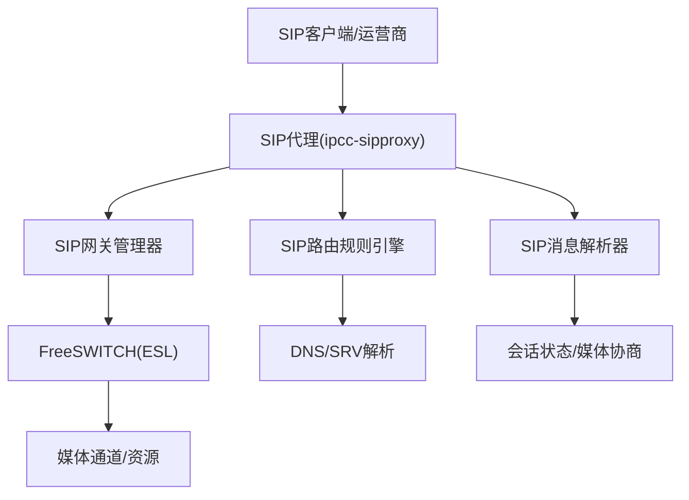
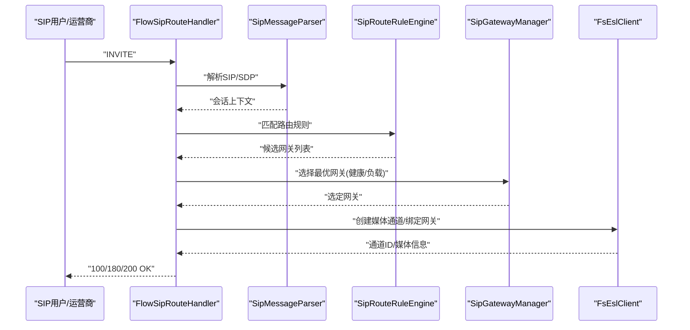
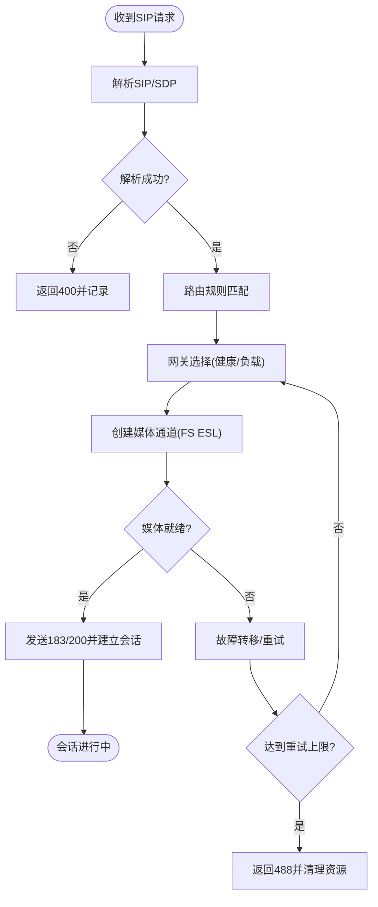
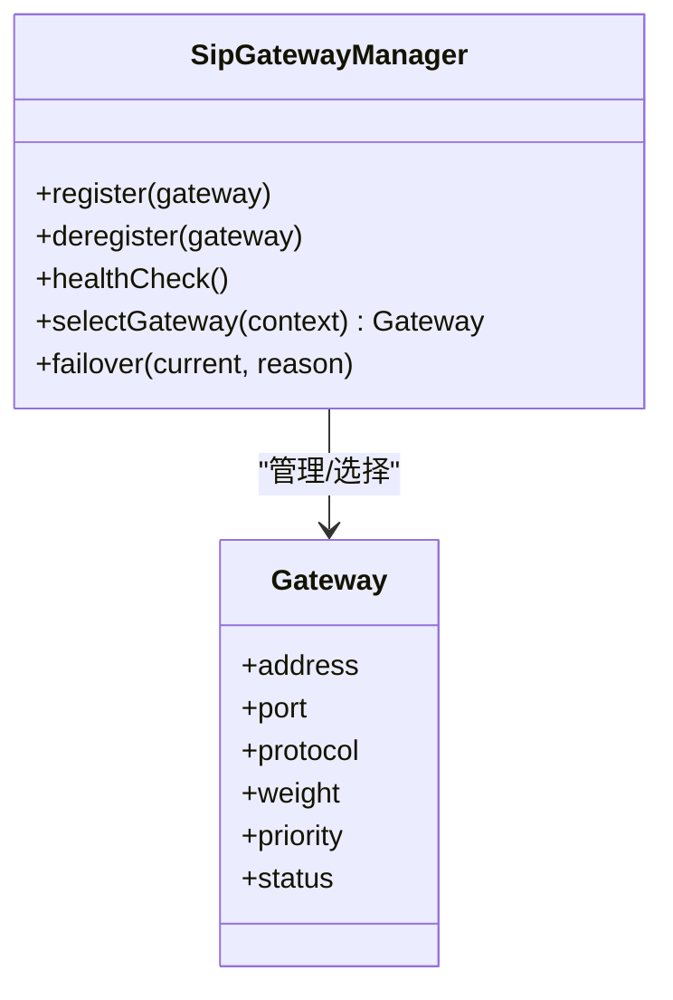
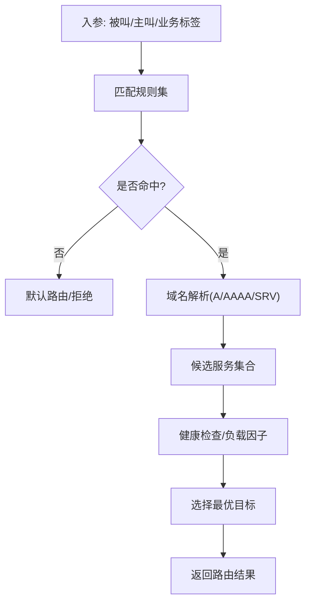
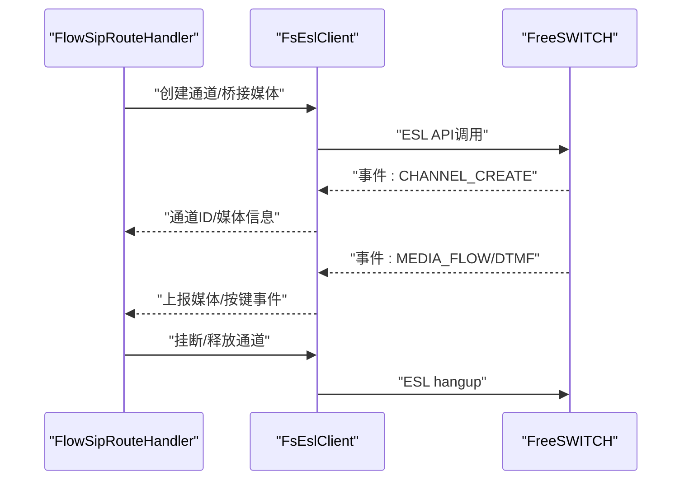
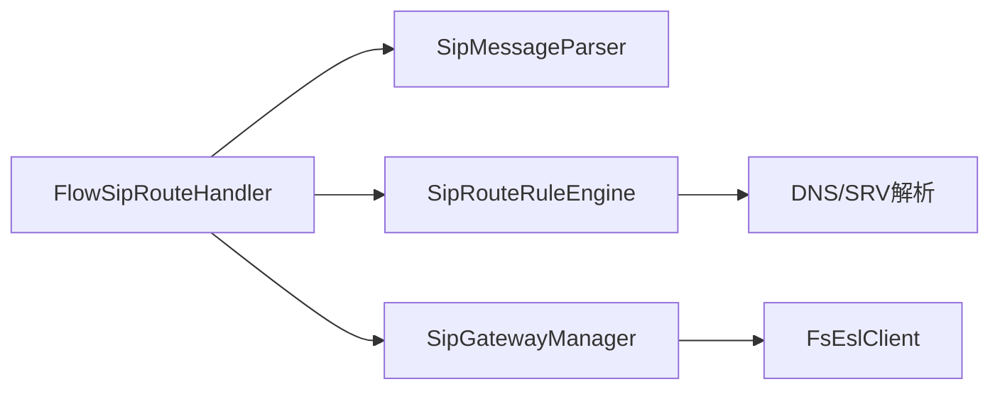

# SIP路由处理器

<cite>
**本文引用的文件**
- [yudao-module-cc/ipcc-sipproxy/src/main/java/.../FlowSipRouteHandler.java](file://yudao-module-cc/ipcc-sipproxy/src/main/java/...)
- [yudao-module-cc/ipcc-sipproxy/src/main/java/.../SipGatewayManager.java](file://yudao-module-cc/ipcc-sipproxy/src/main/java/...)
- [yudao-module-cc/ipcc-sipproxy/src/main/java/.../SipRouteRuleEngine.java](file://yudao-module-cc/ipcc-sipproxy/src/main/java/...)
- [yudao-module-cc/ipcc-sipproxy/src/main/java/.../SipMessageParser.java](file://yudao-module-cc/ipcc-sipproxy/src/main/java/...)
- [yudao-module-cc/ipcc-fs-esl/src/main/java/.../FsEslClient.java](file://yudao-module-cc/ipcc-fs-esl/src/main/java/...)
- [yudao-module-cc/ipcc-fs-esl/src/main/java/.../FsChannelManager.java](file://yudao-module-cc/ipcc-fs-esl/src/main/java/...)
- [yudao-module-cc/ipcc-sipproxy/src/main/resources/application.yml](file://yudao-module-cc/ipcc-sipproxy/src/main/resources/application.yml)
</cite>

## 目录
1. [简介](#简介)
2. [项目结构](#项目结构)
3. [核心组件](#核心组件)
4. [架构总览](#架构总览)
5. [详细组件分析](#详细组件分析)
6. [依赖关系分析](#依赖关系分析)
7. [性能考量](#性能考量)
8. [故障排查指南](#故障排查指南)
9. [结论](#结论)
10. [附录](#附录)

## 简介
本文件面向SIP路由处理器的设计与实现，重点说明FlowSipRouteHandler的协议转换与网关选择逻辑、SIP消息解析与会话建立、媒体流路由策略；梳理SIP网关管理（注册、健康检查、故障转移）；文档化SIP路由规则（域名解析、SRV查询、负载均衡）；解释SIP信令处理流程（INVITE请求、响应码处理、异常处理）；给出配置项（超时、重试、QoS）；并说明与FreeSWITCH的集成方式（ESL事件订阅、媒体通道管理、资源协调）。最后提供多运营商网关选择、SIP Trunk冗余与跨域通信优化等实际应用场景。

## 项目结构
本项目在通话中心模块下包含两个关键子工程：
- ipcc-sipproxy：负责SIP信令接入、路由决策、网关管理与协议转换。
- ipcc-fs-esl：负责与FreeSWITCH通过ESL交互，完成媒体通道管理与事件订阅。

**图表来源**
- [yudao-module-cc/ipcc-sipproxy/src/main/java/.../FlowSipRouteHandler.java](file://yudao-module-cc/ipcc-sipproxy/src/main/java/...)
- [yudao-module-cc/ipcc-sipproxy/src/main/java/.../SipGatewayManager.java](file://yudao-module-cc/ipcc-sipproxy/src/main/java/...)
- [yudao-module-cc/ipcc-sipproxy/src/main/java/.../SipRouteRuleEngine.java](file://yudao-module-cc/ipcc-sipproxy/src/main/java/...)
- [yudao-module-cc/ipcc-sipproxy/src/main/java/.../SipMessageParser.java](file://yudao-module-cc/ipcc-sipproxy/src/main/java/...)
- [yudao-module-cc/ipcc-fs-esl/src/main/java/.../FsEslClient.java](file://yudao-module-cc/ipcc-fs-esl/src/main/java/...)

**章节来源**
- [yudao-module-cc/ipcc-sipproxy/src/main/java/.../FlowSipRouteHandler.java](file://yudao-module-cc/ipcc-sipproxy/src/main/java/...)
- [yudao-module-cc/ipcc-sipproxy/src/main/java/.../SipGatewayManager.java](file://yudao-module-cc/ipcc-sipproxy/src/main/java/...)
- [yudao-module-cc/ipcc-sipproxy/src/main/java/.../SipRouteRuleEngine.java](file://yudao-module-cc/ipcc-sipproxy/src/main/java/...)
- [yudao-module-cc/ipcc-sipproxy/src/main/java/.../SipMessageParser.java](file://yudao-module-cc/ipcc-sipproxy/src/main/java/...)
- [yudao-module-cc/ipcc-fs-esl/src/main/java/.../FsEslClient.java](file://yudao-module-cc/ipcc-fs-esl/src/main/java/...)

## 核心组件
- FlowSipRouteHandler：SIP路由处理主入口，负责协议转换、会话生命周期编排、媒体流路由与错误恢复。
- SipGatewayManager：SIP网关注册、发现、健康检查与故障转移。
- SipRouteRuleEngine：基于域名、URI、策略与负载因子的路由规则匹配与选择。
- SipMessageParser：SIP消息解析、头域提取、SDP分析与会话参数构造。
- FsEslClient/FsChannelManager：与FreeSWITCH的ESL连接、事件订阅、媒体通道创建与资源协调。

**章节来源**
- [yudao-module-cc/ipcc-sipproxy/src/main/java/.../FlowSipRouteHandler.java](file://yudao-module-cc/ipcc-sipproxy/src/main/java/...)
- [yudao-module-cc/ipcc-sipproxy/src/main/java/.../SipGatewayManager.java](file://yudao-module-cc/ipcc-sipproxy/src/main/java/...)
- [yudao-module-cc/ipcc-sipproxy/src/main/java/.../SipRouteRuleEngine.java](file://yudao-module-cc/ipcc-sipproxy/src/main/java/...)
- [yudao-module-cc/ipcc-sipproxy/src/main/java/.../SipMessageParser.java](file://yudao-module-cc/ipcc-sipproxy/src/main/java/...)
- [yudao-module-cc/ipcc-fs-esl/src/main/java/.../FsEslClient.java](file://yudao-module-cc/ipcc-fs-esl/src/main/java/...)
- [yudao-module-cc/ipcc-fs-esl/src/main/java/.../FsChannelManager.java](file://yudao-module-cc/ipcc-fs-esl/src/main/java/...)

## 架构总览
整体采用“接入-解析-路由-网关-媒体”的分层架构：
- 接入层：接收SIP请求/响应，统一封装为内部消息模型。
- 解析层：解析SIP头域与SDP，生成会话上下文。
- 路由层：根据规则引擎进行目标网关选择，支持SRV与负载均衡。
- 网关层：维护网关池、健康探测、故障切换与重试。
- 媒体层：通过FS ESL创建媒体通道，协调RTP/RTCP流。

**图表来源**
- [yudao-module-cc/ipcc-sipproxy/src/main/java/.../FlowSipRouteHandler.java](file://yudao-module-cc/ipcc-sipproxy/src/main/java/...)
- [yudao-module-cc/ipcc-sipproxy/src/main/java/.../SipMessageParser.java](file://yudao-module-cc/ipcc-sipproxy/src/main/java/...)
- [yudao-module-cc/ipcc-sipproxy/src/main/java/.../SipRouteRuleEngine.java](file://yudao-module-cc/ipcc-sipproxy/src/main/java/...)
- [yudao-module-cc/ipcc-sipproxy/src/main/java/.../SipGatewayManager.java](file://yudao-module-cc/ipcc-sipproxy/src/main/java/...)
- [yudao-module-cc/ipcc-fs-esl/src/main/java/.../FsEslClient.java](file://yudao-module-cc/ipcc-fs-esl/src/main/java/...)

## 详细组件分析

### FlowSipRouteHandler：协议转换与网关选择
- 职责
  - 将入站SIP消息转换为内部会话对象，携带源/目的、鉴权、计费标签等元数据。
  - 驱动解析、路由、网关选择与媒体通道创建的全流程编排。
  - 对INVITE、ACK、BYE、CANCEL等关键信令进行状态机管理。
- 关键流程
  - INVITE进入后，先解析SDP以获取媒体能力，再调用路由规则引擎选择网关。
  - 若首选网关不可用或协商失败，触发故障转移与重试。
  - 媒体通道建立成功后，回送200 OK并维持会话心跳。
- 异常处理
  - 解析失败：返回400 Bad Request并记录诊断信息。
  - 路由失败：返回404 Not Found或488 Not Acceptable。
  - 网关不可用：退避重试，必要时降级到备用网关。

**图表来源**
- [yudao-module-cc/ipcc-sipproxy/src/main/java/.../FlowSipRouteHandler.java](file://yudao-module-cc/ipcc-sipproxy/src/main/java/...)

**章节来源**
- [yudao-module-cc/ipcc-sipproxy/src/main/java/.../FlowSipRouteHandler.java](file://yudao-module-cc/ipcc-sipproxy/src/main/java/...)

### SipGatewayManager：网关注册、健康检查与故障转移
- 网关注册
  - 支持静态配置与动态发现，注册时记录地址、端口、协议、权重、优先级与认证信息。
- 健康检查
  - 周期性探测（如OPTIONS/REGISTER），统计成功率与延迟，标记Down/Up状态。
- 故障转移
  - 当主网关连续失败超过阈值，自动切换到次优网关；恢复后回切或按策略保持。
- 负载均衡
  - 支持加权轮询、最少连接、随机与一致性哈希等策略，结合实时健康状态做选择。

**图表来源**
- [yudao-module-cc/ipcc-sipproxy/src/main/java/.../SipGatewayManager.java](file://yudao-module-cc/ipcc-sipproxy/src/main/java/...)

**章节来源**
- [yudao-module-cc/ipcc-sipproxy/src/main/java/.../SipGatewayManager.java](file://yudao-module-cc/ipcc-sipproxy/src/main/java/...)

### SipRouteRuleEngine：域名解析、SRV查询与负载均衡
- 规则匹配
  - 基于被叫域名、主叫域、号码前缀、业务标签等维度匹配规则集。
- DNS/SRV
  - 对目标域名执行A/AAAA与SRV查询，聚合候选服务列表并按优先级/权重排序。
- 负载均衡
  - 结合网关健康度与历史负载，计算最终目标地址，支持策略可插拔。
- 缓存与失效
  - 对DNS结果与规则命中路径进行短期缓存，TTL过期后刷新。

**图表来源**
- [yudao-module-cc/ipcc-sipproxy/src/main/java/.../SipRouteRuleEngine.java](file://yudao-module-cc/ipcc-sipproxy/src/main/java/...)

**章节来源**
- [yudao-module-cc/ipcc-sipproxy/src/main/java/.../SipRouteRuleEngine.java](file://yudao-module-cc/ipcc-sipproxy/src/main/java/...)

### SipMessageParser：SIP消息解析与SDP协商
- 功能
  - 解析Request-Line、CSeq、From/To、Via、Contact、Record-Route等关键头域。
  - 解析SDP中的媒体类型、编解码、带宽、ICE/DTLS参数，生成会话能力描述。
- 输出
  - 会话上下文对象，包含呼叫标识、方向、媒体能力、路由元数据与计费标签。
- 校验
  - 对非法头域、重复字段、不兼容编解码进行拦截与告警。

**章节来源**
- [yudao-module-cc/ipcc-sipproxy/src/main/java/.../SipMessageParser.java](file://yudao-module-cc/ipcc-sipproxy/src/main/java/...)

### FreeSWITCH集成：ESL事件订阅、媒体通道与资源协调
- ESL连接
  - 建立与FreeSWITCH的ESL长连接，支持重连与心跳保活。
- 事件订阅
  - 订阅CHANNEL_CREATE、CHANNEL_DESTROY、DTMF、MEDIA_FLOW等事件，用于会话生命周期与媒体监控。
- 媒体通道
  - 通过API创建通道、桥接媒体、设置变量（如QoS标记、DSCP）、控制播放/录音。
- 资源协调
  - 与网关选择联动，确保媒体面与信令面一致；在故障时释放通道并回收资源。

**图表来源**
- [yudao-module-cc/ipcc-fs-esl/src/main/java/.../FsEslClient.java](file://yudao-module-cc/ipcc-fs-esl/src/main/java/...)
- [yudao-module-cc/ipcc-fs-esl/src/main/java/.../FsChannelManager.java](file://yudao-module-cc/ipcc-fs-esl/src/main/java/...)

**章节来源**
- [yudao-module-cc/ipcc-fs-esl/src/main/java/.../FsEslClient.java](file://yudao-module-cc/ipcc-fs-esl/src/main/java/...)
- [yudao-module-cc/ipcc-fs-esl/src/main/java/.../FsChannelManager.java](file://yudao-module-cc/ipcc-fs-esl/src/main/java/...)

## 依赖关系分析
- 松耦合设计
  - FlowSipRouteHandler依赖解析器、规则引擎与网关管理器，但不直接感知底层传输细节。
  - 网关管理器与FS ESL解耦，仅通过接口交互，便于替换与扩展。
- 外部依赖
  - DNS/SRV解析库用于域名与服务发现。
  - FreeSWITCH ESL SDK用于媒体通道与事件订阅。
- 潜在循环依赖
  - 通过接口抽象避免循环引用；所有双向交互均通过回调或事件总线。

**图表来源**
- [yudao-module-cc/ipcc-sipproxy/src/main/java/.../FlowSipRouteHandler.java](file://yudao-module-cc/ipcc-sipproxy/src/main/java/...)
- [yudao-module-cc/ipcc-sipproxy/src/main/java/.../SipMessageParser.java](file://yudao-module-cc/ipcc-sipproxy/src/main/java/...)
- [yudao-module-cc/ipcc-sipproxy/src/main/java/.../SipRouteRuleEngine.java](file://yudao-module-cc/ipcc-sipproxy/src/main/java/...)
- [yudao-module-cc/ipcc-sipproxy/src/main/java/.../SipGatewayManager.java](file://yudao-module-cc/ipcc-sipproxy/src/main/java/...)
- [yudao-module-cc/ipcc-fs-esl/src/main/java/.../FsEslClient.java](file://yudao-module-cc/ipcc-fs-esl/src/main/java/...)

**章节来源**
- [yudao-module-cc/ipcc-sipproxy/src/main/java/.../FlowSipRouteHandler.java](file://yudao-module-cc/ipcc-sipproxy/src/main/java/...)
- [yudao-module-cc/ipcc-sipproxy/src/main/java/.../SipGatewayManager.java](file://yudao-module-cc/ipcc-sipproxy/src/main/java/...)
- [yudao-module-cc/ipcc-fs-esl/src/main/java/.../FsEslClient.java](file://yudao-module-cc/ipcc-fs-esl/src/main/java/...)

## 性能考量
- 解析与路由
  - 使用零拷贝或缓冲复用减少内存分配；规则匹配采用索引与短路评估。
- 并发与背压
  - 高并发场景下对解析与路由阶段采用线程池隔离；对FS ESL调用进行限流与队列化。
- 缓存
  - DNS/SRV与规则命中路径缓存，合理设置TTL降低外部查询压力。
- 媒体面
  - 媒体通道创建与释放及时回收；启用NAT穿透与ICE以减少握手时延。

[本节为通用指导，无需具体文件来源]

## 故障排查指南
- 常见问题
  - 解析失败：检查头域合法性与SDP兼容性，查看解析日志定位缺失字段。
  - 路由失败：确认规则命中顺序与域名解析结果，验证SRV记录与权重配置。
  - 网关不可用：检查健康探测间隔与阈值，观察故障转移是否生效。
  - 媒体异常：核对FS ESL事件流，确认通道创建/销毁与媒体流是否对齐。
- 定位手段
  - 开启调试日志，捕获SIP报文与ESL事件。
  - 使用网络抓包验证端到端信令与媒体路径。
  - 通过FS CLI查看通道状态与媒体统计。

**章节来源**
- [yudao-module-cc/ipcc-sipproxy/src/main/java/.../FlowSipRouteHandler.java](file://yudao-module-cc/ipcc-sipproxy/src/main/java/...)
- [yudao-module-cc/ipcc-sipproxy/src/main/java/.../SipGatewayManager.java](file://yudao-module-cc/ipcc-sipproxy/src/main/java/...)
- [yudao-module-cc/ipcc-fs-esl/src/main/java/.../FsEslClient.java](file://yudao-module-cc/ipcc-fs-esl/src/main/java/...)

## 结论
SIP路由处理器通过清晰的层次划分与模块化设计，实现了从SIP信令接入、解析、路由到媒体通道建立的完整闭环。借助规则引擎与网关管理器的协同，系统具备灵活的策略扩展与高可用能力；与FreeSWITCH的深度集成保障了媒体面的稳定与可控。通过合理的超时、重试与QoS配置，可在复杂网络环境下提供高质量的语音通信体验。

[本节为总结性内容，无需具体文件来源]

## 附录

### SIP信令处理流程（INVITE/响应/异常）
- INVITE处理
  - 解析与校验 -> 路由选择 -> 网关健康检查 -> 媒体通道创建 -> 回送183/200。
- 响应码处理
  - 1xx：转发或本地提示。
  - 2xx：建立会话并启动保活。
  - 3xx/4xx/5xx/6xx：按策略重试或终止，记录原因码。
- 异常处理
  - 超时：对未决请求设置定时器，超时时清理资源并返回错误码。
  - 网络抖动：指数退避重试，限制最大次数。
  - 资源不足：拒绝新请求并告警。

**章节来源**
- [yudao-module-cc/ipcc-sipproxy/src/main/java/.../FlowSipRouteHandler.java](file://yudao-module-cc/ipcc-sipproxy/src/main/java/...)

### SIP配置选项（超时、重试、QoS）
- 超时设置
  - 解析超时、路由超时、网关探测超时、媒体握手超时。
- 重试机制
  - 重试次数、退避策略、重试条件（如特定响应码）。
- QoS参数
  - DSCP/ToS标记、RTP/RTCP优先级、带宽限制与拥塞控制。
- 其他
  - DNS缓存TTL、SRV查询策略、负载均衡算法选择。

**章节来源**
- [yudao-module-cc/ipcc-sipproxy/src/main/resources/application.yml](file://yudao-module-cc/ipcc-sipproxy/src/main/resources/application.yml)

### 与FreeSWITCH的集成要点
- ESL事件订阅
  - 订阅通道生命周期与媒体事件，用于状态同步与监控。
- 媒体通道管理
  - 创建/桥接/释放通道，设置媒体变量（如QoS、加密）。
- 资源协调
  - 与网关选择保持一致，确保信令与媒体路径一致；故障时快速回收。

**章节来源**
- [yudao-module-cc/ipcc-fs-esl/src/main/java/.../FsEslClient.java](file://yudao-module-cc/ipcc-fs-esl/src/main/java/...)
- [yudao-module-cc/ipcc-fs-esl/src/main/java/.../FsChannelManager.java](file://yudao-module-cc/ipcc-fs-esl/src/main/java/...)

### 实际应用场景示例
- 多运营商网关选择策略
  - 基于被叫归属地、成本与质量指标，优先选择低时延/低成本网关；热点时段动态调整权重。
- SIP Trunk冗余配置
  - 同一目的地配置多个Trunk，主备模式+并行试探；主故障时秒级切换。
- 跨域通信的路由优化
  - 利用SRV就近选择边缘节点；结合DNS缓存与链路质量反馈，动态优化路径。

[本节为概念性说明，无需具体文件来源]