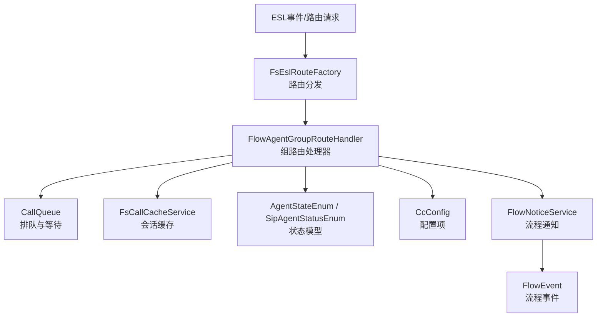
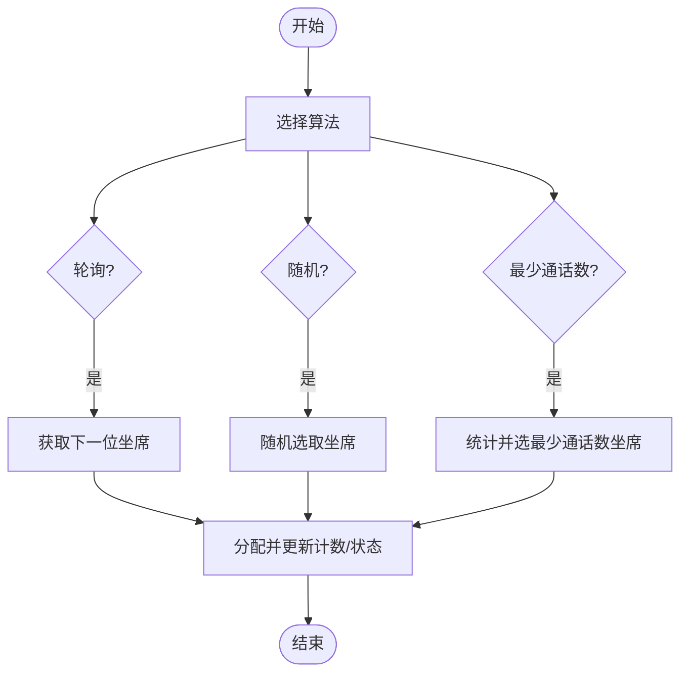
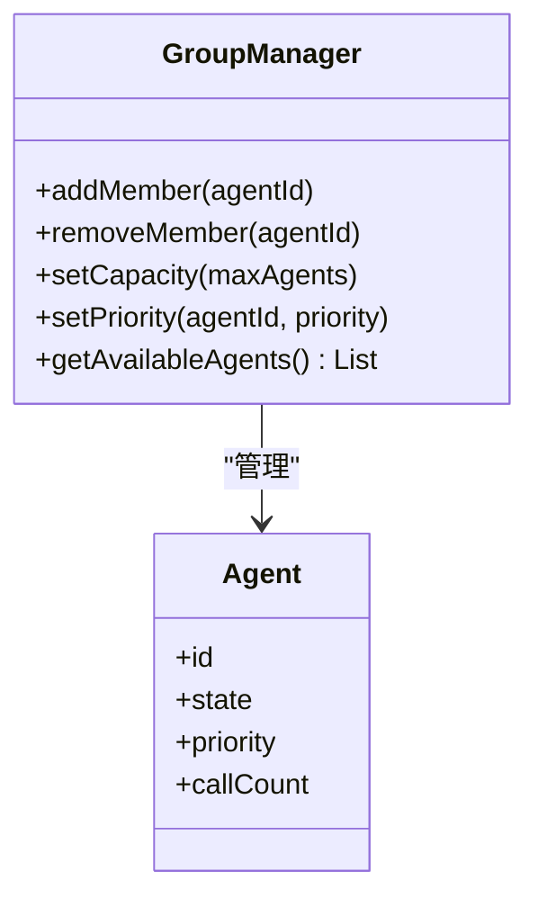
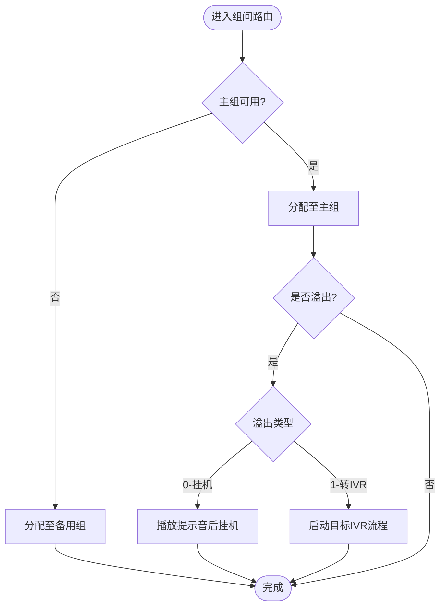
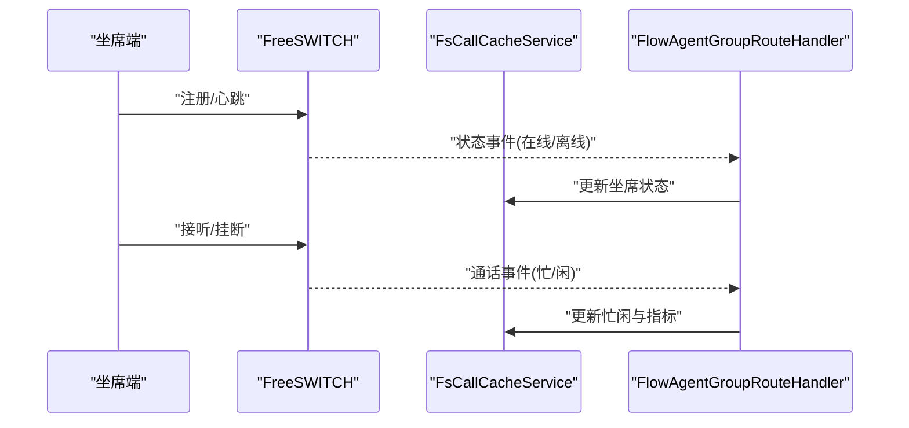
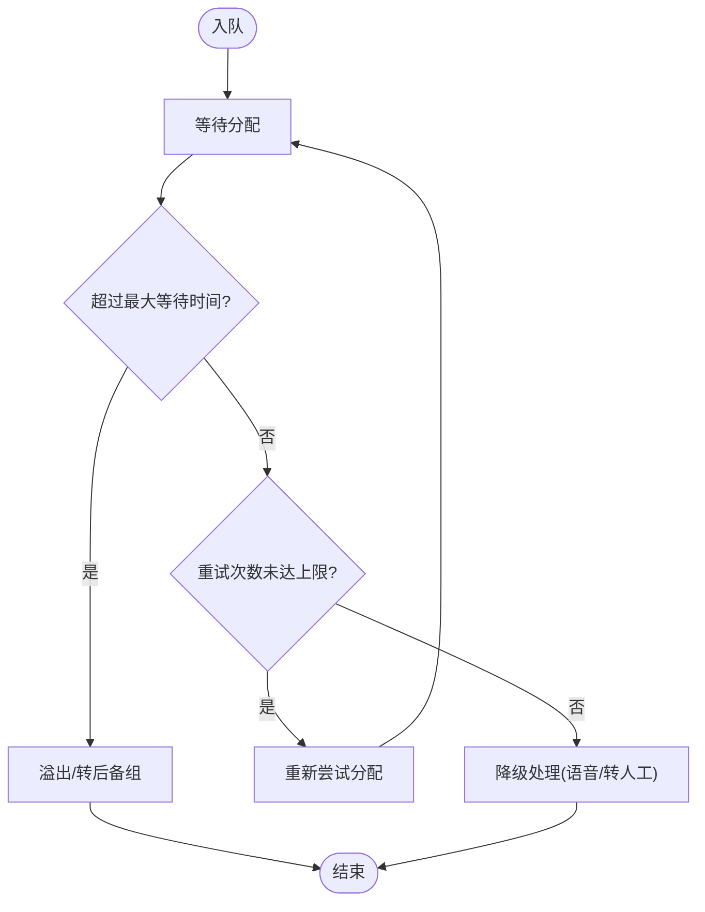
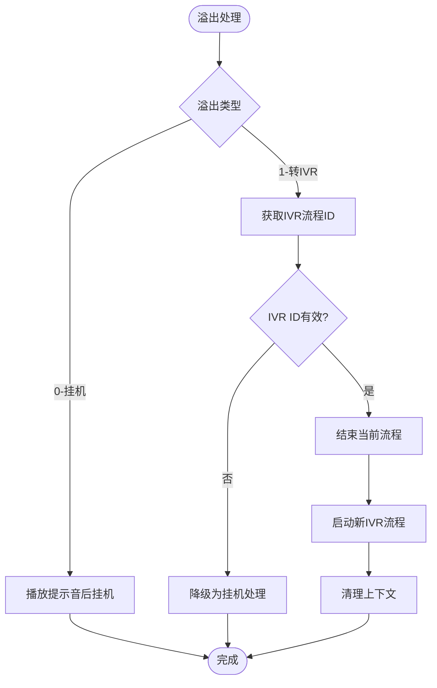
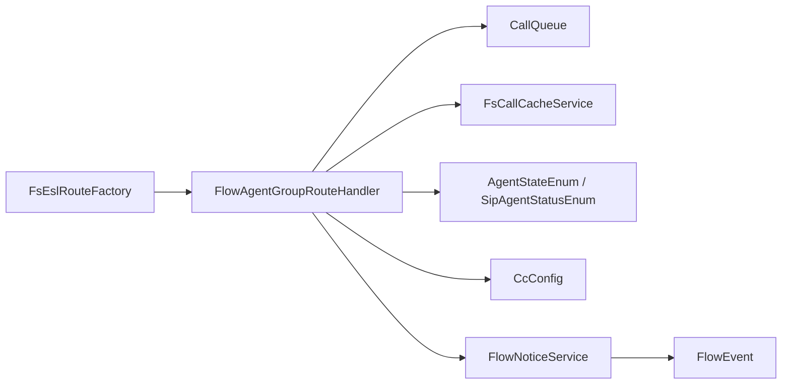

# 坐席组路由处理器

<cite>
**本文引用的文件**
- [FlowAgentGroupRouteHandler.java](file://yudao-cloud/yudao-module-cc/yudao-module-cc-server/src/main/java/cn/iocoder/yudao/module/cc/ivr/handler/route/FlowAgentGroupRouteHandler.java)
- [FlowNoticeService.java](file://yudao-cloud/yudao-module-cc/yudao-module-cc-server/src/main/java/cn/iocoder/yudao/module/cc/esl/service/FlowNoticeService.java)
- [FlowNoticeServiceImpl.java](file://yudao-cloud/yudao-module-cc/yudao-module-cc-server/src/main/java/cn/iocoder/yudao/module/cc/esl/service/FlowNoticeServiceImpl.java)
- [SysAgentGroupDO.java](file://yudao-cloud/yudao-module-cc/yudao-module-cc-server/src/main/java/cn/iocoder/yudao/module/cc/dal/dataobject/call/SysAgentGroupDO.java)
- [FlowEvent.java](file://yudao-cloud/yudao-module-cc/yudao-module-cc-server/src/main/java/cn/iocoder/yudao/module/cc/ivr/event/FlowEvent.java)
- [FsEslRouteFactory.java](file://yudao-cloud/yudao-module-cc/yudao-module-cc-server/src/main/java/cn/iocoder/yudao/module/cc/esl/factory/FsEslRouteFactory.java)
- [CallQueue.java](file://yudao-cloud/yudao-module-cc/yudao-module-cc-server/src/main/java/cn/iocoder/yudao/module/cc/esl/queue/CallQueue.java)
- [FsCallCacheService.java](file://yudao-cloud/yudao-module-cc/yudao-module-cc-server/src/main/java/cn/iocoder/yudao/module/cc/esl/service/FsCallCacheService.java)
- [FsCallCacheServiceImpl.java](file://yudao-cloud/yudao-module-cc/yudao-module-cc-server/src/main/java/cn/iocoder/yudao/module/cc/esl/service/FsCallCacheServiceImpl.java)
- [AgentStateEnum.java](file://yudao-cloud/yudao-module-cc/yudao-module-cc-server/src/main/java/cn/iocoder/yudao/module/cc/esl/enums/AgentStateEnum.java)
- [SipAgentStatusEnum.java](file://yudao-cloud/yudao-module-cc/yudao-module-cc-server/src/main/java/cn/iocoder/yudao/module/cc/esl/enums/SipAgentStatusEnum.java)
- [CcConfig.java](file://yudao-cloud/yudao-module-cc/yudao-module-cc-server/src/main/java/cn/iocoder/yudao/module/cc/config/CcConfig.java)
- [RedisConstants.java](file://yudao-cloud/yudao-module-cc/yudao-module-cc-server/src/main/java/cn/iocoder/yudao/module/cc/constant/RedisConstants.java)
- [RedisKeyConstants.java](file://yudao-cloud/yudao-module-cc/yudao-module-cc-server/src/main/java/cn/iocoder/yudao/module/cc/dal/redis/RedisKeyConstants.java)
</cite>

## 更新摘要

**变更内容**

- 新增"转IVR"溢出策略功能，在FlowAgentGroupRouteHandler中实现overflowType == 1分支
- 完善溢出处理流程，支持将溢出呼叫转移到指定IVR流程
- 增强CallInfo更新和缓存管理机制
- 优化IVR流程启动和通知机制

## 目录
1. [简介](#简介)
2. [项目结构](#项目结构)
3. [核心组件](#核心组件)
4. [架构总览](#架构总览)
5. [详细组件分析](#详细组件分析)
6. [依赖关系分析](#依赖关系分析)
7. [性能考量](#性能考量)
8. [故障排查指南](#故障排查指南)
9. [结论](#结论)
10. [附录](#附录)

## 简介

本文件面向"坐席组路由处理器"，聚焦 FlowAgentGroupRouteHandler
的组内调度策略、组管理、组间路由、状态同步与配置项，并结合实际业务场景给出落地建议。文档以代码为依据，提供架构图、时序图与流程图，帮助读者快速理解并正确配置使用。
**最新更新**：实现了"转IVR"溢出策略功能，支持将溢出呼叫转移到指定IVR流程继续处理。

## 项目结构

围绕坐席组路由的核心代码位于 CC 模块的 IVR 处理层与服务层：
- 路由入口与策略：FlowAgentGroupRouteHandler（组路由处理器）、FsEslRouteFactory（路由工厂）
- 队列与缓存：CallQueue（呼叫队列）、FsCallCacheService/Impl（会话缓存服务）
- 状态枚举：AgentStateEnum、SipAgentStatusEnum（坐席状态）
- 配置与键空间：CcConfig（系统配置）、RedisConstants/RedisKeyConstants（Redis Key 常量）
- 通知与流程：FlowNoticeService/Impl（流程通知）、FlowEvent（流程事件）



**图表来源**
- [FsEslRouteFactory.java](file://yudao-cloud/yudao-module-cc/yudao-module-cc-server/src/main/java/cn/iocoder/yudao/module/cc/esl/factory/FsEslRouteFactory.java)
- [FlowAgentGroupRouteHandler.java](file://yudao-cloud/yudao-module-cc/yudao-module-cc-server/src/main/java/cn/iocoder/yudao/module/cc/ivr/handler/route/FlowAgentGroupRouteHandler.java)
- [CallQueue.java](file://yudao-cloud/yudao-module-cc/yudao-module-cc-server/src/main/java/cn/iocoder/yudao/module/cc/esl/queue/CallQueue.java)
- [FsCallCacheService.java](file://yudao-cloud/yudao-module-cc/yudao-module-cc-server/src/main/java/cn/iocoder/yudao/module/cc/esl/service/FsCallCacheService.java)
- [FlowNoticeService.java](file://yudao-cloud/yudao-module-cc/yudao-module-cc-server/src/main/java/cn/iocoder/yudao/module/cc/esl/service/FlowNoticeService.java)
- [FlowEvent.java](file://yudao-cloud/yudao-module-cc/yudao-module-cc-server/src/main/java/cn/iocoder/yudao/module/cc/ivr/event/FlowEvent.java)

**章节来源**
- [FsEslRouteFactory.java](file://yudao-cloud/yudao-module-cc/yudao-module-cc-server/src/main/java/cn/iocoder/yudao/module/cc/esl/factory/FsEslRouteFactory.java)
- [FlowAgentGroupRouteHandler.java](file://yudao-cloud/yudao-module-cc/yudao-module-cc-server/src/main/java/cn/iocoder/yudao/module/cc/ivr/handler/route/FlowAgentGroupRouteHandler.java)

## 核心组件

- FlowAgentGroupRouteHandler：实现坐席组的入队、分配与出队逻辑，支持多种组内调度算法（轮询、随机、最少通话数），并与队列、缓存、状态和通知协作。
  **新增**：支持"转IVR"溢出策略。
- FsEslRouteFactory：根据路由类型将事件分发给具体处理器，确保可扩展的路由体系。
- CallQueue：维护组内呼叫队列，负责等待、超时、重试等排队行为。
- FsCallCacheService/Impl：维护会话级缓存（如当前坐席、等待时间、路由上下文等），支撑状态同步与指标采集。
- AgentStateEnum / SipAgentStatusEnum：定义坐席在线/离线、忙/闲等状态，用于状态同步与可用性判断。
- CcConfig：集中管理路由相关配置（最大等待时间、重试次数、超时策略等）。
- RedisConstants / RedisKeyConstants：统一命名规范，避免键冲突，便于监控与运维。
- FlowNoticeService/Impl：在关键路由节点发送流程通知，便于前端或外部系统联动。 **新增**：支持启动新的IVR流程。

**章节来源**

- [FlowAgentGroupRouteHandler.java](file://yudao-cloud/yudao-module-cc/yudao-module-cc-server/src/main/java/cn/iocoder/yudao/module/cc/ivr/handler/route/FlowAgentGroupRouteHandler.java)
- [FsEslRouteFactory.java](file://yudao-cloud/yudao-module-cc/yudao-module-cc-server/src/main/java/cn/iocoder/yudao/module/cc/esl/factory/FsEslRouteFactory.java)
- [CallQueue.java](file://yudao-cloud/yudao-module-cc/yudao-module-cc-server/src/main/java/cn/iocoder/yudao/module/cc/esl/queue/CallQueue.java)
- [FsCallCacheService.java](file://yudao-cloud/yudao-module-cc/yudao-module-cc-server/src/main/java/cn/iocoder/yudao/module/cc/esl/service/FsCallCacheService.java)
- [FsCallCacheServiceImpl.java](file://yudao-cloud/yudao-module-cc/yudao-module-cc-server/src/main/java/cn/iocoder/yudao/module/cc/esl/service/FsCallCacheServiceImpl.java)
- [AgentStateEnum.java](file://yudao-cloud/yudao-module-cc/yudao-module-cc-server/src/main/java/cn/iocoder/yudao/module/cc/esl/enums/AgentStateEnum.java)
- [SipAgentStatusEnum.java](file://yudao-cloud/yudao-module-cc/yudao-module-cc-server/src/main/java/cn/iocoder/yudao/module/cc/esl/enums/SipAgentStatusEnum.java)
- [CcConfig.java](file://yudao-cloud/yudao-module-cc/yudao-module-cc-server/src/main/java/cn/iocoder/yudao/module/cc/config/CcConfig.java)
- [RedisConstants.java](file://yudao-cloud/yudao-module-cc/yudao-module-cc-server/src/main/java/cn/iocoder/yudao/module/cc/constant/RedisConstants.java)
- [RedisKeyConstants.java](file://yudao-cloud/yudao-module-cc/yudao-module-cc-server/src/main/java/cn/iocoder/yudao/module/cc/dal/redis/RedisKeyConstants.java)
- [FlowNoticeService.java](file://yudao-cloud/yudao-module-cc/yudao-module-cc-server/src/main/java/cn/iocoder/yudao/module/cc/esl/service/FlowNoticeService.java)
- [FlowNoticeServiceImpl.java](file://yudao-cloud/yudao-module-cc/yudao-module-cc-server/src/main/java/cn/iocoder/yudao/module/cc/esl/service/FlowNoticeServiceImpl.java)

## 架构总览

下图展示了从路由入口到组内分配、再到状态同步与通知的整体流程， **新增**了转IVR溢出策略的处理路径。

```mermaid
sequenceDiagram
participant FS as "FreeSWITCH/ESL"
participant Factory as "FsEslRouteFactory"
participant Handler as "FlowAgentGroupRouteHandler"
participant Queue as "CallQueue"
participant Cache as "FsCallCacheService"
participant Notice as "FlowNoticeService"
participant IVR as "IVR流程引擎"
FS->>Factory : "路由事件(组ID/技能/区域)"
Factory->>Handler : "选择组路由处理器"
Handler->>Queue : "入队(等待/超时/重试)"
Handler->>Cache : "写入会话上下文"
alt 组内可用坐席
Handler->>Handler : "选择算法(轮询/随机/最少通话数)"
Handler->>FS : "桥接/振铃坐席"
Handler->>Notice : "发送已分配通知"
else 无可用坐席
Handler->>Queue : "继续等待或溢出"
Handler->>Notice : "发送排队中通知"
opt 溢出处理
Handler->>Handler : "检查溢出类型"
alt overflowType == 0 (挂机)
Handler->>FS : "播放提示音后挂机"
else overflowType == 1 (转IVR)
Handler->>Notice : "结束当前流程"
Handler->>IVR : "启动新IVR流程"
end
end
```

**图表来源**
- [FsEslRouteFactory.java](file://yudao-cloud/yudao-module-cc/yudao-module-cc-server/src/main/java/cn/iocoder/yudao/module/cc/esl/factory/FsEslRouteFactory.java)
- [FlowAgentGroupRouteHandler.java](file://yudao-cloud/yudao-module-cc/yudao-module-cc-server/src/main/java/cn/iocoder/yudao/module/cc/ivr/handler/route/FlowAgentGroupRouteHandler.java)
- [CallQueue.java](file://yudao-cloud/yudao-module-cc/yudao-module-cc-server/src/main/java/cn/iocoder/yudao/module/cc/esl/queue/CallQueue.java)
- [FsCallCacheService.java](file://yudao-cloud/yudao-module-cc/yudao-module-cc-server/src/main/java/cn/iocoder/yudao/module/cc/esl/service/FsCallCacheService.java)
- [FlowNoticeService.java](file://yudao-cloud/yudao-module-cc/yudao-module-cc-server/src/main/java/cn/iocoder/yudao/module/cc/esl/service/FlowNoticeService.java)

## 详细组件分析

### FlowAgentGroupRouteHandler：组内调度策略
- 轮询(Round Robin)：按顺序为每个新呼叫分配下一个可用坐席，适合均匀负载场景。
- 随机(Random)：从可用坐席集合中随机选取，降低热点坐席压力，适合高并发且差异不大的场景。
- 最少通话数(Least Calls)：优先分配给历史通话数最少的坐席，有助于长期均衡与公平性。



**图表来源**

- [FlowAgentGroupRouteHandler.java](file://yudao-cloud/yudao-module-cc/yudao-module-cc-server/src/main/java/cn/iocoder/yudao/module/cc/ivr/handler/route/FlowAgentGroupRouteHandler.java)

**章节来源**

- [FlowAgentGroupRouteHandler.java](file://yudao-cloud/yudao-module-cc/yudao-module-cc-server/src/main/java/cn/iocoder/yudao/module/cc/ivr/handler/route/FlowAgentGroupRouteHandler.java)

### 坐席组管理：成员动态增删、容量限制与优先级
- 组成员动态添加/移除：通过组管理服务接口维护成员列表，新增成员即时纳入调度池，移除成员立即停止分配。
- 组容量限制：结合组级别的最大并发/在线人数上限，防止过载；超出时触发排队或溢出策略。
- 优先级设置：可为不同坐席或子组设置优先级，高优先级优先被分配，适用于VIP或专家坐席。



**图表来源**

- [FlowAgentGroupRouteHandler.java](file://yudao-cloud/yudao-module-cc/yudao-module-cc-server/src/main/java/cn/iocoder/yudao/module/cc/ivr/handler/route/FlowAgentGroupRouteHandler.java)

**章节来源**

- [FlowAgentGroupRouteHandler.java](file://yudao-cloud/yudao-module-cc/yudao-module-cc-server/src/main/java/cn/iocoder/yudao/module/cc/ivr/handler/route/FlowAgentGroupRouteHandler.java)

### 组间路由策略：主备切换、溢出与负载均衡
- 主备组切换：当主组不可用或达到阈值时，自动切换到备用组，保障连续性。
- 溢出处理：主组满载或等待超时时，将呼叫溢出至备用组或全局队列。 **新增**：支持转IVR策略。
- 负载均衡：跨组维度可基于权重或实时负载进行分流，避免单点瓶颈。



**图表来源**

- [FlowAgentGroupRouteHandler.java](file://yudao-cloud/yudao-module-cc/yudao-module-cc-server/src/main/java/cn/iocoder/yudao/module/cc/ivr/handler/route/FlowAgentGroupRouteHandler.java)
- [SysAgentGroupDO.java](file://yudao-cloud/yudao-module-cc/yudao-module-cc-server/src/main/java/cn/iocoder/yudao/module/cc/dal/dataobject/call/SysAgentGroupDO.java)

**章节来源**

- [FlowAgentGroupRouteHandler.java](file://yudao-cloud/yudao-module-cc/yudao-module-cc-server/src/main/java/cn/iocoder/yudao/module/cc/ivr/handler/route/FlowAgentGroupRouteHandler.java)
- [SysAgentGroupDO.java](file://yudao-cloud/yudao-module-cc/yudao-module-cc-server/src/main/java/cn/iocoder/yudao/module/cc/dal/dataobject/call/SysAgentGroupDO.java)

### 坐席状态同步机制：在线监控、忙闲管理与指标收集
- 在线状态监控：通过 SIP 注册/心跳与 ESL 事件，实时更新坐席在线/离线。
- 忙闲状态管理：接听/通话中为忙，空闲为闲；状态变更驱动调度器可用性计算。
- 性能指标收集：记录通话时长、等待时长、分配成功率、溢出率等，写入缓存或指标存储。



**图表来源**
- [FsCallCacheService.java](file://yudao-cloud/yudao-module-cc/yudao-module-cc-server/src/main/java/cn/iocoder/yudao/module/cc/esl/service/FsCallCacheService.java)
- [FsCallCacheServiceImpl.java](file://yudao-cloud/yudao-module-cc/yudao-module-cc-server/src/main/java/cn/iocoder/yudao/module/cc/esl/service/FsCallCacheServiceImpl.java)
- [AgentStateEnum.java](file://yudao-cloud/yudao-module-cc/yudao-module-cc-server/src/main/java/cn/iocoder/yudao/module/cc/esl/enums/AgentStateEnum.java)
- [SipAgentStatusEnum.java](file://yudao-cloud/yudao-module-cc/yudao-module-cc-server/src/main/java/cn/iocoder/yudao/module/cc/esl/enums/SipAgentStatusEnum.java)
- [FlowAgentGroupRouteHandler.java](file://yudao-cloud/yudao-module-cc/yudao-module-cc-server/src/main/java/cn/iocoder/yudao/module/cc/ivr/handler/route/FlowAgentGroupRouteHandler.java)

**章节来源**
- [FsCallCacheService.java](file://yudao-cloud/yudao-module-cc/yudao-module-cc-server/src/main/java/cn/iocoder/yudao/module/cc/esl/service/FsCallCacheService.java)
- [FsCallCacheServiceImpl.java](file://yudao-cloud/yudao-module-cc/yudao-module-cc-server/src/main/java/cn/iocoder/yudao/module/cc/esl/service/FsCallCacheServiceImpl.java)
- [AgentStateEnum.java](file://yudao-cloud/yudao-module-cc/yudao-module-cc-server/src/main/java/cn/iocoder/yudao/module/cc/esl/enums/AgentStateEnum.java)
- [SipAgentStatusEnum.java](file://yudao-cloud/yudao-module-cc/yudao-module-cc-server/src/main/java/cn/iocoder/yudao/module/cc/esl/enums/SipAgentStatusEnum.java)
- [FlowAgentGroupRouteHandler.java](file://yudao-cloud/yudao-module-cc/yudao-module-cc-server/src/main/java/cn/iocoder/yudao/module/cc/ivr/handler/route/FlowAgentGroupRouteHandler.java)

### 组路由配置选项：最大等待时间、重试次数与超时处理
- 最大等待时间：控制呼叫在组内队列中的最长等待时长，超时后执行溢出或转人工/语音提示。
- 重试次数：对分配失败或临时不可用的坐席进行有限次重试，提升成功率。
- 超时处理：包括拨号超时、振铃超时、应答超时等，配合队列与通知机制进行降级处理。



**图表来源**
- [CallQueue.java](file://yudao-cloud/yudao-module-cc/yudao-module-cc-server/src/main/java/cn/iocoder/yudao/module/cc/esl/queue/CallQueue.java)
- [CcConfig.java](file://yudao-cloud/yudao-module-cc/yudao-module-cc-server/src/main/java/cn/iocoder/yudao/module/cc/config/CcConfig.java)
- [FlowAgentGroupRouteHandler.java](file://yudao-cloud/yudao-module-cc/yudao-module-cc-server/src/main/java/cn/iocoder/yudao/module/cc/ivr/handler/route/FlowAgentGroupRouteHandler.java)

**章节来源**
- [CallQueue.java](file://yudao-cloud/yudao-module-cc/yudao-module-cc-server/src/main/java/cn/iocoder/yudao/module/cc/esl/queue/CallQueue.java)
- [CcConfig.java](file://yudao-cloud/yudao-module-cc/yudao-module-cc-server/src/main/java/cn/iocoder/yudao/module/cc/config/CcConfig.java)
- [FlowAgentGroupRouteHandler.java](file://yudao-cloud/yudao-module-cc/yudao-module-cc-server/src/main/java/cn/iocoder/yudao/module/cc/ivr/handler/route/FlowAgentGroupRouteHandler.java)

### 转IVR溢出策略：新增功能详解

**新增功能**：实现了"转IVR"溢出策略，当坐席组全忙且溢出类型为1时，不再直接挂机，而是启动指定的IVR流程继续处理来电。

#### 实现原理

- **溢出类型检测**：在`overFlowStrategy`方法中检查`sysAgentGroup.getOverflowType()`是否为1
- **IVR流程ID获取**：从`sysAgentGroup.getOverflowValue()`获取目标IVR流程ID
- **流程结束通知**：调用`flowNoticeService.notice(FlowEventTypeEnum.TRANSFER.getCode(), "end", flowData)`结束当前流程
- **新流程启动**：通过`flowNoticeService.notice(address, callInfo.getCallId(), uniqueId, ivrFlowId)`启动新的IVR流程
- **资源清理**：从`channelInfoMap`中移除当前呼叫的上下文信息

#### 降级处理

- 如果`overflowValue`为空，降级为挂机处理，播放未接通提示音后挂断
- 包含完整的日志记录和错误处理机制



**图表来源**

- [FlowAgentGroupRouteHandler.java:253-284](file://yudao-cloud/yudao-module-cc/yudao-module-cc-server/src/main/java/cn/iocoder/yudao/module/cc/ivr/handler/route/FlowAgentGroupRouteHandler.java#L253-L284)
- [FlowNoticeService.java:15-24](file://yudao-cloud/yudao-module-cc/yudao-module-cc-server/src/main/java/cn/iocoder/yudao/module/cc/esl/service/FlowNoticeService.java#L15-L24)
- [FlowNoticeServiceImpl.java:20-28](file://yudao-cloud/yudao-module-cc/yudao-module-cc-server/src/main/java/cn/iocoder/yudao/module/cc/esl/service/FlowNoticeServiceImpl.java#L20-L28)

**章节来源**

- [FlowAgentGroupRouteHandler.java](file://yudao-cloud/yudao-module-cc/yudao-module-cc-server/src/main/java/cn/iocoder/yudao/module/cc/ivr/handler/route/FlowAgentGroupRouteHandler.java)
- [FlowNoticeService.java](file://yudao-cloud/yudao-module-cc/yudao-module-cc-server/src/main/java/cn/iocoder/yudao/module/cc/esl/service/FlowNoticeService.java)
- [FlowNoticeServiceImpl.java](file://yudao-cloud/yudao-module-cc/yudao-module-cc-server/src/main/java/cn/iocoder/yudao/module/cc/esl/service/FlowNoticeServiceImpl.java)
- [SysAgentGroupDO.java](file://yudao-cloud/yudao-module-cc/yudao-module-cc-server/src/main/java/cn/iocoder/yudao/module/cc/dal/dataobject/call/SysAgentGroupDO.java)

### 实际应用场景示例

- 客服热线组的技能分组：按语言/产品/问题类型划分技能组，结合"最少通话数"保证公平与效率。
- 技术支持团队的专业领域划分：按硬件/软件/网络等专业域建组，复杂问题溢出至专家组。
- 销售团队的区域分配策略：按地域建组，结合"轮询"或"随机"均衡各区域负荷，高峰时段启用备用组。
- **新增**：IVR流程集成：当所有坐席忙碌时，自动转入预设的IVR流程，提供自助服务或留言功能。

## 依赖关系分析
- 路由入口依赖 FsEslRouteFactory 进行分发，再交由 FlowAgentGroupRouteHandler 处理。
- 处理器依赖 CallQueue 进行排队与超时控制，依赖 FsCallCacheService 维护会话与状态。
- 状态模型由 AgentStateEnum 与 SipAgentStatusEnum 提供，确保一致性。
- 配置项集中在 CcConfig，键空间由 RedisConstants/RedisKeyConstants 统一管理。
- 通知通过 FlowNoticeService 在关键节点广播，便于前后端联动。 **新增**：支持启动新的IVR流程。



**图表来源**
- [FsEslRouteFactory.java](file://yudao-cloud/yudao-module-cc/yudao-module-cc-server/src/main/java/cn/iocoder/yudao/module/cc/esl/factory/FsEslRouteFactory.java)
- [FlowAgentGroupRouteHandler.java](file://yudao-cloud/yudao-module-cc/yudao-module-cc-server/src/main/java/cn/iocoder/yudao/module/cc/ivr/handler/route/FlowAgentGroupRouteHandler.java)
- [CallQueue.java](file://yudao-cloud/yudao-module-cc/yudao-module-cc-server/src/main/java/cn/iocoder/yudao/module/cc/esl/queue/CallQueue.java)
- [FsCallCacheService.java](file://yudao-cloud/yudao-module-cc/yudao-module-cc-server/src/main/java/cn/iocoder/yudao/module/cc/esl/service/FsCallCacheService.java)
- [AgentStateEnum.java](file://yudao-cloud/yudao-module-cc/yudao-module-cc-server/src/main/java/cn/iocoder/yudao/module/cc/esl/enums/AgentStateEnum.java)
- [SipAgentStatusEnum.java](file://yudao-cloud/yudao-module-cc/yudao-module-cc-server/src/main/java/cn/iocoder/yudao/module/cc/esl/enums/SipAgentStatusEnum.java)
- [CcConfig.java](file://yudao-cloud/yudao-module-cc/yudao-module-cc-server/src/main/java/cn/iocoder/yudao/module/cc/config/CcConfig.java)
- [FlowNoticeService.java](file://yudao-cloud/yudao-module-cc/yudao-module-cc-server/src/main/java/cn/iocoder/yudao/module/cc/esl/service/FlowNoticeService.java)
- [FlowEvent.java](file://yudao-cloud/yudao-module-cc/yudao-module-cc-server/src/main/java/cn/iocoder/yudao/module/cc/ivr/event/FlowEvent.java)

**章节来源**
- [FsEslRouteFactory.java](file://yudao-cloud/yudao-module-cc/yudao-module-cc-server/src/main/java/cn/iocoder/yudao/module/cc/esl/factory/FsEslRouteFactory.java)
- [FlowAgentGroupRouteHandler.java](file://yudao-cloud/yudao-module-cc/yudao-module-cc-server/src/main/java/cn/iocoder/yudao/module/cc/ivr/handler/route/FlowAgentGroupRouteHandler.java)

## 性能考量
- 算法选择：高并发且差异不大时优先随机；需要长期均衡时采用最少通话数；简单场景用轮询。
- 队列与超时：合理设置最大等待时间与重试次数，避免雪崩；必要时启用溢出与降级。
- 状态与缓存：减少锁粒度与序列化开销；利用 Redis 键空间优化查询路径。
- 监控与告警：关注分配成功率、平均等待时长、溢出率与错误率，及时调优。
- **新增**：IVR流程启动性能：确保IVR流程启动的快速响应，避免阻塞主流程。

## 故障排查指南
- 无法分配坐席：检查坐席在线/忙闲状态、组容量与优先级配置；查看队列等待与超时日志。
- 频繁溢出：评估组容量与负载，调整溢出阈值与备用组策略；检查网络与 FreeSWITCH 连接。
- 状态不同步：核对 SIP 注册/心跳与 ESL 事件链路；确认缓存写入与读取一致。
- 指标异常：校验指标采集点与存储通道；对比历史基线定位波动原因。
- **新增**：转IVR失败：检查IVR流程ID配置是否正确，验证IVR流程是否存在且可访问。

**章节来源**
- [FsCallCacheService.java](file://yudao-cloud/yudao-module-cc/yudao-module-cc-server/src/main/java/cn/iocoder/yudao/module/cc/esl/service/FsCallCacheService.java)
- [FsCallCacheServiceImpl.java](file://yudao-cloud/yudao-module-cc/yudao-module-cc-server/src/main/java/cn/iocoder/yudao/module/cc/esl/service/FsCallCacheServiceImpl.java)
- [CallQueue.java](file://yudao-cloud/yudao-module-cc/yudao-module-cc-server/src/main/java/cn/iocoder/yudao/module/cc/esl/queue/CallQueue.java)
- [FlowAgentGroupRouteHandler.java](file://yudao-cloud/yudao-module-cc/yudao-module-cc-server/src/main/java/cn/iocoder/yudao/module/cc/ivr/handler/route/FlowAgentGroupRouteHandler.java)

## 结论

FlowAgentGroupRouteHandler 提供了灵活的组内调度策略与完善的组间路由能力，结合队列、缓存、状态与通知机制，可满足客服热线、技术支持与销售团队等多类场景的复杂路由需求。
**最新增强**：通过"转IVR"溢出策略功能，系统在坐席全忙时能够无缝切换到IVR流程，提供更好的用户体验和业务连续性。通过合理的配置与监控，可实现高可用、高吞吐与低延迟的坐席分配体验。

## 附录
- 配置项参考：最大等待时间、重试次数、超时策略等详见配置类。
- 键空间规范：统一使用 Redis 常量，便于监控与运维。
- 扩展建议：可按业务需要增加新的调度算法或组间路由策略，保持向后兼容。
- **新增**：IVR配置：在坐席组配置中设置溢出类型为"转IVR"，并配置目标IVR流程ID。

**章节来源**
- [CcConfig.java](file://yudao-cloud/yudao-module-cc/yudao-module-cc-server/src/main/java/cn/iocoder/yudao/module/cc/config/CcConfig.java)
- [RedisConstants.java](file://yudao-cloud/yudao-module-cc/yudao-module-cc-server/src/main/java/cn/iocoder/yudao/module/cc/constant/RedisConstants.java)
- [RedisKeyConstants.java](file://yudao-cloud/yudao-module-cc/yudao-module-cc-server/src/main/java/cn/iocoder/yudao/module/cc/dal/redis/RedisKeyConstants.java)
- [SysAgentGroupDO.java](file://yudao-cloud/yudao-module-cc/yudao-module-cc-server/src/main/java/cn/iocoder/yudao/module/cc/dal/dataobject/call/SysAgentGroupDO.java)