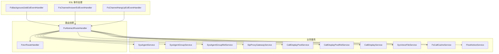
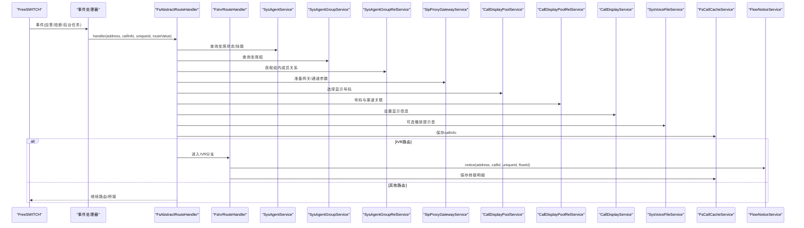
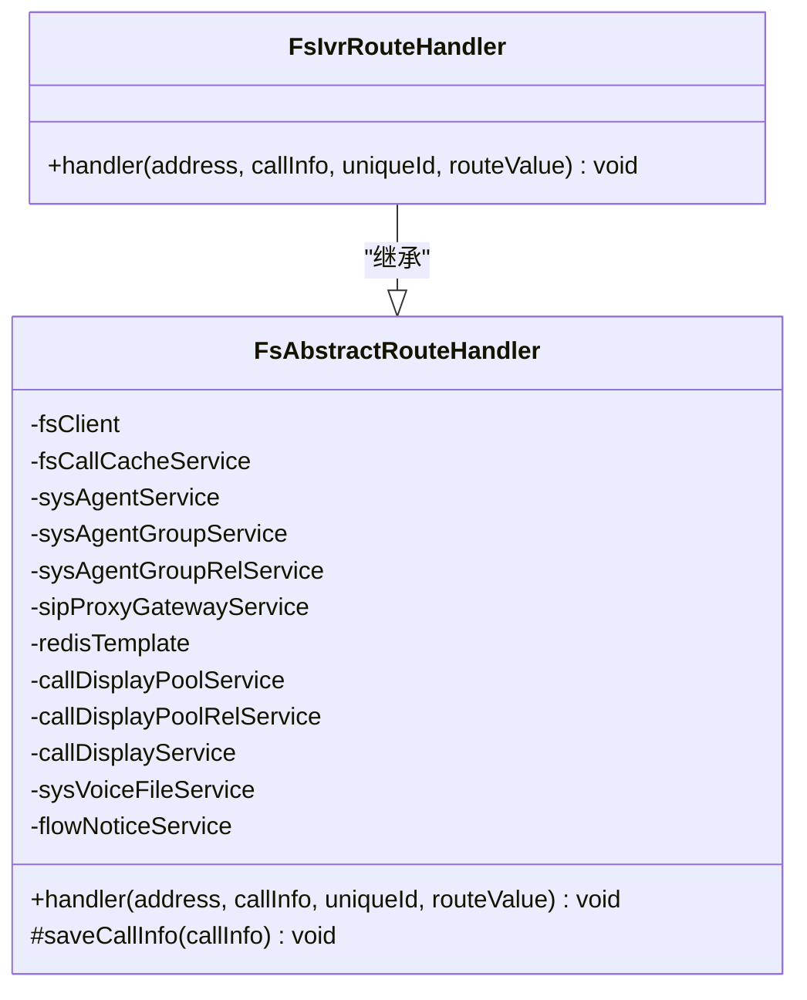
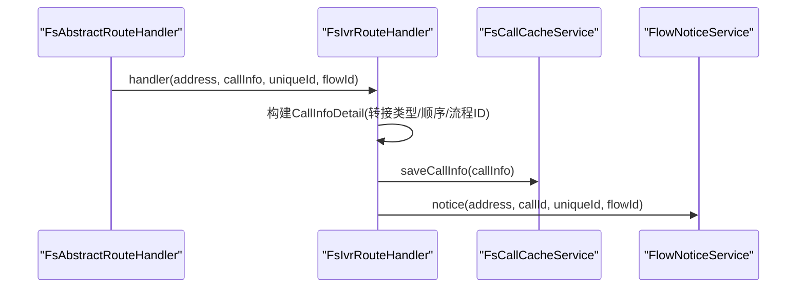
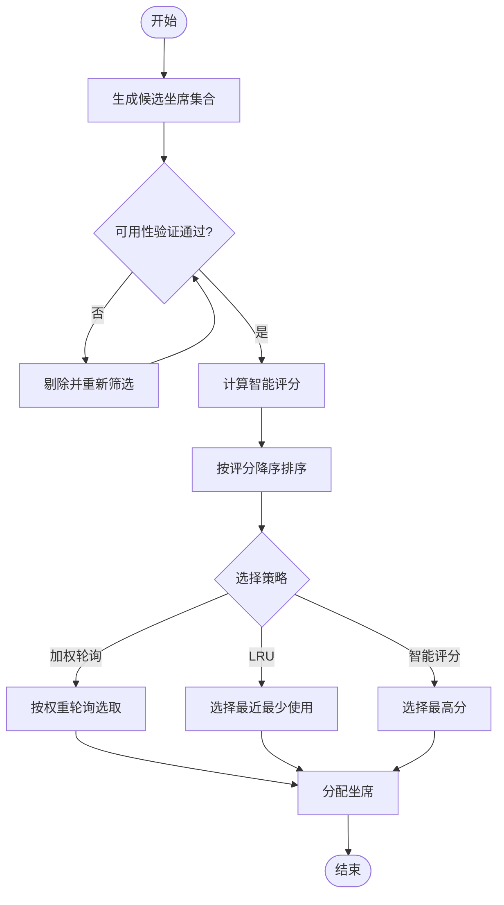
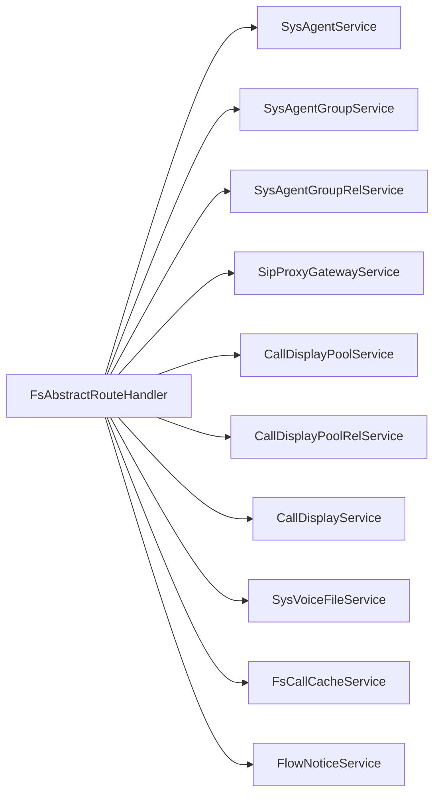

# 坐席路由处理器

<cite>
**本文引用的文件**
- [FsAbstractRouteHandler.java](file://yudao-cloud/yudao-module-cc/yudao-module-cc-server/src/main/java/cn/iocoder/yudao/module/cc/esl/handler/route/FsAbstractRouteHandler.java)
- [FsIvrRouteHandler.java](file://yudao-cloud/yudao-module-cc/yudao-module-cc-server/src/main/java/cn/iocoder/yudao/module/cc/esl/handler/route/FsIvrRouteHandler.java)
- [FsCallBridgeProcess.java](file://yudao-cloud/yudao-module-cc/yudao-module-cc-server/src/main/java/cn/iocoder/yudao/module/cc/esl/handler/call/FsCallBridgeProcess.java)
- [FsCallIRouteProcess.java](file://yudao-cloud/yudao-module-cc/yudao-module-cc-server/src/main/java/cn/iocoder/yudao/module/cc/esl/handler/call/FsCallIRouteProcess.java)
- [FsBackgroundJobEslEventHandler.java](file://yudao-cloud/yudao-module-cc/yudao-module-cc-server/src/main/java/cn/iocoder/yudao/module/cc/esl/handler/event/FsBackgroundJobEslEventHandler.java)
- [FsChannelAnswerEslEventHandler.java](file://yudao-cloud/yudao-module-cc/yudao-module-cc-server/src/main/java/cn/iocoder/yudao/module/cc/esl/handler/event/FsChannelAnswerEslEventHandler.java)
- [FsChannelHangUpEslEventHandler.java](file://yudao-cloud/yudao-module-cc/yudao-module-cc-server/src/main/java/cn/iocoder/yudao/module/cc/esl/handler/event/FsChannelHangUpEslEventHandler.java)
- [FsDialplanXmlCurlHandler.java](file://yudao-cloud/yudao-module-cc/yudao-module-cc-server/src/main/java/cn/iocoder/yudao/module/cc/esl/handler/xmlcurl/FsDialplanXmlCurlHandler.java)
- [FlowNoticeService.java](file://yudao-cloud/yudao-module-cc/yudao-module-cc-server/src/main/java/cn/iocoder/yudao/module/cc/esl/service/FlowNoticeService.java)
- [FsCallCacheService.java](file://yudao-cloud/yudao-module-cc/yudao-module-cc-server/src/main/java/cn/iocoder/yudao/module/cc/esl/service/FsCallCacheService.java)
- [SysAgentService.java](file://yudao-cloud/yudao-module-cc/yudao-module-cc-server/src/main/java/cn/iocoder/yudao/module/cc/service/sys/SysAgentService.java)
- [SysAgentGroupService.java](file://yudao-cloud/yudao-module-cc/yudao-module-cc-server/src/main/java/cn/iocoder/yudao/module/cc/service/sys/SysAgentGroupService.java)
- [SysAgentGroupRelService.java](file://yudao-cloud/yudao-module-cc/yudao-module-cc-server/src/main/java/cn/iocoder/yudao/module/cc/service/sys/SysAgentGroupRelService.java)
- [SipProxyGatewayService.java](file://yudao-cloud/yudao-module-cc/yudao-module-cc-server/src/main/java/cn/iocoder/yudao/module/cc/service/sipproxy/SipProxyGatewayService.java)
- [CallDisplayPoolService.java](file://yudao-cloud/yudao-module-cc/yudao-module-cc-server/src/main/java/cn/iocoder/yudao/module/cc/service/call/CallDisplayPoolService.java)
- [CallDisplayPoolRelService.java](file://yudao-cloud/yudao-module-cc/yudao-module-cc-server/src/main/java/cn/iocoder/yudao/module/cc/service/call/CallDisplayPoolRelService.java)
- [CallDisplayService.java](file://yudao-cloud/yudao-module-cc/yudao-module-cc-server/src/main/java/cn/iocoder/yudao/module/cc/service/call/CallDisplayService.java)
- [SysVoiceFileService.java](file://yudao-cloud/yudao-module-cc/yudao-module-cc-server/src/main/java/cn/iocoder/yudao/module/cc/service/sys/SysVoiceFileService.java)
</cite>

## 目录
1. [简介](#简介)
2. [项目结构](#项目结构)
3. [核心组件](#核心组件)
4. [架构总览](#架构总览)
5. [详细组件分析](#详细组件分析)
6. [依赖关系分析](#依赖关系分析)
7. [性能考量](#性能考量)
8. [故障排查指南](#故障排查指南)
9. [结论](#结论)
10. [附录](#附录)

## 简介
本文件围绕“坐席路由处理器”进行系统化文档化，重点说明 FlowAgentRouteHandler（在代码中体现为 FsAbstractRouteHandler 及其具体实现）的智能分配能力与扩展点。内容涵盖：
- 技能匹配机制、负载均衡策略与优先级排序逻辑的抽象设计
- 坐席状态检查、可用性验证与技能标签匹配的集成点
- 路由规则配置项（技能要求、经验等级、实时负载监控）如何接入
- 动态调整机制（基于历史成功率的权重调整、故障转移）
- 坐席选择算法的实现细节（LRU、加权轮询、智能评分系统）
- 实际应用场景示例（技术支持团队技能路由、销售团队专业领域分配、客服中心负载均衡）

## 项目结构
坐席路由相关代码位于 CC 模块的 ESL 事件处理层与业务服务层之间，采用“抽象基类 + 具体处理器 + 服务协作”的分层组织方式：
- 路由抽象基类：定义统一入口与通用依赖注入
- 具体路由处理器：按路由类型（如 IVR）实现差异化流程
- 事件处理器：将 FreeSWITCH 事件转换为内部调用链
- 业务服务：负责坐席组、坐席、显示号码池、语音文件、呼叫缓存等能力
- 外部网关：通过 SIP Proxy 网关完成媒体与控制面交互

图表来源
- [FsAbstractRouteHandler.java:1-64](file://yudao-cloud/yudao-module-cc/yudao-module-cc-server/src/main/java/cn/iocoder/yudao/module/cc/esl/handler/route/FsAbstractRouteHandler.java#L1-L64)
- [FsIvrRouteHandler.java:1-38](file://yudao-cloud/yudao-module-cc/yudao-module-cc-server/src/main/java/cn/iocoder/yudao/module/cc/esl/handler/route/FsIvrRouteHandler.java#L1-L38)
- [FsBackgroundJobEslEventHandler.java](file://yudao-cloud/yudao-module-cc/yudao-module-cc-server/src/main/java/cn/iocoder/yudao/module/cc/esl/handler/event/FsBackgroundJobEslEventHandler.java)
- [FsChannelAnswerEslEventHandler.java](file://yudao-cloud/yudao-module-cc/yudao-module-cc-server/src/main/java/cn/iocoder/yudao/module/cc/esl/handler/event/FsChannelAnswerEslEventHandler.java)
- [FsChannelHangUpEslEventHandler.java](file://yudao-cloud/yudao-module-cc/yudao-module-cc-server/src/main/java/cn/iocoder/yudao/module/cc/esl/handler/event/FsChannelHangUpEslEventHandler.java)

章节来源
- [FsAbstractRouteHandler.java:1-64](file://yudao-cloud/yudao-module-cc/yudao-module-cc-server/src/main/java/cn/iocoder/yudao/module/cc/esl/handler/route/FsAbstractRouteHandler.java#L1-L64)
- [FsIvrRouteHandler.java:1-38](file://yudao-cloud/yudao-module-cc/yudao-module-cc-server/src/main/java/cn/iocoder/yudao/module/cc/esl/handler/route/FsIvrRouteHandler.java#L1-L38)

## 核心组件
- 路由抽象基类 FsAbstractRouteHandler
  - 职责：提供统一的 handler 入口；注入并协调坐席、群组、网关、显示号码池、语音文件、呼叫缓存与流程通知等服务；封装 callInfo 保存等通用操作。
  - 关键点：handler(address, callInfo, uniqueId, routeValue) 为扩展点，子类可针对不同路由类型实现差异化逻辑。
- IVR 路由处理器 FsIvrRouteHandler
  - 职责：将呼叫转入 IVR 流程；记录转接明细；持久化呼叫信息；触发流程通知。
  - 关键点：通过 FlowNoticeService 通知下游流程引擎；使用 FsCallCacheService 保存上下文。
- 事件处理器
  - 背景任务、应答、挂断等事件驱动路由或后续处理流程。
- 业务服务
  - 坐席与群组：用于状态检查、可用性验证、技能标签匹配与分组路由。
  - 显示号码池：用于主叫号码选择与展示。
  - 语音文件：用于提示音播放等。
  - 网关：通过 SipProxyGatewayService 控制媒体与控制面。
  - 缓存与通知：FsCallCacheService 与 FlowNoticeService 支撑流程编排与状态同步。

章节来源
- [FsAbstractRouteHandler.java:1-64](file://yudao-cloud/yudao-module-cc/yudao-module-cc-server/src/main/java/cn/iocoder/yudao/module/cc/esl/handler/route/FsAbstractRouteHandler.java#L1-L64)
- [FsIvrRouteHandler.java:1-38](file://yudao-cloud/yudao-module-cc/yudao-module-cc-server/src/main/java/cn/iocoder/yudao/module/cc/esl/handler/route/FsIvrRouteHandler.java#L1-L38)
- [FsBackgroundJobEslEventHandler.java](file://yudao-cloud/yudao-module-cc/yudao-module-cc-server/src/main/java/cn/iocoder/yudao/module/cc/esl/handler/event/FsBackgroundJobEslEventHandler.java)
- [FsChannelAnswerEslEventHandler.java](file://yudao-cloud/yudao-module-cc/yudao-module-cc-server/src/main/java/cn/iocoder/yudao/module/cc/esl/handler/event/FsChannelAnswerEslEventHandler.java)
- [FsChannelHangUpEslEventHandler.java](file://yudao-cloud/yudao-module-cc/yudao/module/cc/esl/handler/event/FsChannelHangUpEslEventHandler.java)

## 架构总览
下图展示了从 FreeSWITCH 事件到路由处理再到业务服务的整体调用链路，以及关键数据流转。

图表来源
- [FsAbstractRouteHandler.java:1-64](file://yudao-cloud/yudao-module-cc/yudao-module-cc-server/src/main/java/cn/iocoder/yudao/module/cc/esl/handler/route/FsAbstractRouteHandler.java#L1-L64)
- [FsIvrRouteHandler.java:1-38](file://yudao-cloud/yudao-module-cc/yudao-module-cc-server/src/main/java/cn/iocoder/yudao/module/cc/esl/handler/route/FsIvrRouteHandler.java#L1-L38)

## 详细组件分析

### 路由抽象基类 FsAbstractRouteHandler
- 设计要点
  - 统一入口：handler(address, callInfo, uniqueId, routeValue) 作为多态扩展点
  - 依赖注入：集中管理坐席、群组、网关、显示号码池、语音文件、缓存与流程通知等依赖
  - 通用能力：saveCallInfo 封装呼叫上下文持久化
- 可扩展性
  - 通过继承实现不同路由类型（如 IVR、技能路由、负载均衡路由）
  - 可在子类中组合调用各服务以实现技能匹配、负载均衡与优先级排序

图表来源
- [FsAbstractRouteHandler.java:1-64](file://yudao-cloud/yudao-module-cc/yudao-module-cc-server/src/main/java/cn/iocoder/yudao/module/cc/esl/handler/route/FsAbstractRouteHandler.java#L1-L64)
- [FsIvrRouteHandler.java:1-38](file://yudao-cloud/yudao-module-cc/yudao-module-cc-server/src/main/java/cn/iocoder/yudao/module/cc/esl/handler/route/FsIvrRouteHandler.java#L1-L38)

章节来源
- [FsAbstractRouteHandler.java:1-64](file://yudao-cloud/yudao-module-cc/yudao-module-cc-server/src/main/java/cn/iocoder/yudao/module/cc/esl/handler/route/FsAbstractRouteHandler.java#L1-L64)

### IVR 路由处理器 FsIvrRouteHandler
- 功能说明
  - 记录转接明细（类型、顺序号、目标流程ID）
  - 保存呼叫上下文
  - 通过 FlowNoticeService 通知流程引擎执行对应 IVR 流程
- 数据流
  - 构建 CallInfoDetail 并追加至 callInfo
  - 调用 fsCallCacheService.saveCallInfo 持久化
  - 调用 flowNoticeService.notice 触发流程

图表来源
- [FsIvrRouteHandler.java:1-38](file://yudao-cloud/yudao-module-cc/yudao-module-cc-server/src/main/java/cn/iocoder/yudao/module/cc/esl/handler/route/FsIvrRouteHandler.java#L1-L38)

章节来源
- [FsIvrRouteHandler.java:1-38](file://yudao-cloud/yudao-module-cc/yudao-module-cc-server/src/main/java/cn/iocoder/yudao/module/cc/esl/handler/route/FsIvrRouteHandler.java#L1-L38)

### 事件驱动与路由衔接
- 背景任务、应答、挂断等事件由相应事件处理器接收，并在适当时机调用路由处理器的 handler 方法，从而将 FreeSWITCH 侧的事件转化为内部路由决策。
- 典型路径：事件 -> 事件处理器 -> 路由抽象基类 -> 具体路由处理器 -> 业务服务 -> 网关/流程/缓存

章节来源
- [FsBackgroundJobEslEventHandler.java](file://yudao-cloud/yudao-module-cc/yudao-module-cc-server/src/main/java/cn/iocoder/yudao/module/cc/esl/handler/event/FsBackgroundJobEslEventHandler.java)
- [FsChannelAnswerEslEventHandler.java](file://yudao-cloud/yudao-module-cc/yudao-module-cc-server/src/main/java/cn/iocoder/yudao/module/cc/esl/handler/event/FsChannelAnswerEslEventHandler.java)
- [FsChannelHangUpEslEventHandler.java](file://yudao-cloud/yudao-module-cc/yudao-module-cc-server/src/main/java/cn/iocoder/yudao/module/cc/esl/handler/event/FsChannelHangUpEslEventHandler.java)

### 坐席选择算法与智能评分系统（设计建议）
以下为推荐实现的坐席选择算法框架，便于在 FsAbstractRouteHandler 的子类中落地：
- 候选集生成
  - 基于技能标签匹配：筛选具备所需技能的坐席
  - 基于经验等级过滤：满足最低经验门槛
  - 基于群组关系：限定在指定坐席组内
- 可用性验证
  - 状态检查：在线、空闲、可接听
  - 负载阈值：当前并发数低于上限
  - 健康检查：最近失败率/超时率低于阈值
- 优先级排序与打分
  - 加权评分 = 技能匹配度 × w1 + 经验等级 × w2 + (1 - 负载率) × w3 + 历史成功率 × w4
  - 支持动态权重 w1..w4，随业务阶段调整
- 选择策略
  - 加权轮询：在高评分集合内按权重轮询，避免热点坐席过载
  - LRU：优先选择最近最少使用的坐席，提升均衡性
  - 智能评分：综合上述维度计算得分，取最高分者
- 动态调整与故障转移
  - 基于历史成功率滑动窗口更新权重
  - 连续失败或健康检查不通过时降级/隔离该坐席
  - 自动切换到次优候选或备用组

[此图为概念性流程图，无需图表来源]

### 路由规则配置（技能要求、经验等级、实时负载监控）
- 技能要求
  - 在坐席属性或标签中维护技能集合，路由时根据请求特征（如问题类型、产品域）匹配
- 经验等级
  - 设定最低经验门槛，确保复杂问题由高级坐席处理
- 实时负载监控
  - 通过 Redis 或内存指标维护坐席当前并发、排队长度、响应时间
  - 结合阈值与滑动窗口统计，动态调整权重或隔离异常坐席

章节来源
- [SysAgentService.java](file://yudao-cloud/yudao-module-cc/yudao-module-cc-server/src/main/java/cn/iocoder/yudao/module/cc/service/sys/SysAgentService.java)
- [SysAgentGroupService.java](file://yudao-cloud/yudao-module-cc/yudao-module-cc-server/src/main/java/cn/iocoder/yudao/module/cc/service/sys/SysAgentGroupService.java)
- [SysAgentGroupRelService.java](file://yudao-cloud/yudao-module-cc/yudao-module-cc-server/src/main/java/cn/iocoder/yudao/module/cc/service/sys/SysAgentGroupRelService.java)

### 实际应用场景示例
- 技术支持团队技能路由
  - 依据问题分类（硬件/软件/网络）匹配技能标签
  - 高优先级客户或紧急工单提高经验等级权重
  - 实时监控队列长度，超过阈值则切换至备用组
- 销售团队专业领域分配
  - 按行业/产品线划分技能标签
  - 结合历史转化率动态调整权重，倾向高转化坐席
  - 对大客户启用专属坐席池
- 客服中心负载均衡配置
  - 使用加权轮询与 LRU 组合策略，避免热点
  - 设置并发上限与响应时间阈值，自动降级
  - 通过 FlowNoticeService 将长耗时流程转入 IVR 或排队等待

[本节为场景化说明，不直接分析具体文件，故无章节来源]

## 依赖关系分析
- 组件耦合
  - 路由抽象基类高度依赖业务服务层（坐席、群组、网关、显示号码池、语音文件、缓存与流程通知），形成松耦合的服务调用模式
  - 具体路由处理器仅关注特定路由类型的流程编排，复用基类的通用能力
- 外部依赖
  - FreeSWITCH 事件驱动：通过 ESL 事件处理器接入
  - SIP Proxy 网关：用于媒体与控制面交互
  - Redis：可能用于会话与指标存储（基类注入 RedisTemplate）

图表来源
- [FsAbstractRouteHandler.java:1-64](file://yudao-cloud/yudao-module-cc/yudao-module-cc-server/src/main/java/cn/iocoder/yudao/module/cc/esl/handler/route/FsAbstractRouteHandler.java#L1-L64)

章节来源
- [FsAbstractRouteHandler.java:1-64](file://yudao-cloud/yudao-module-cc/yudao-module-cc-server/src/main/java/cn/iocoder/yudao/module/cc/esl/handler/route/FsAbstractRouteHandler.java#L1-L64)

## 性能考量
- 缓存与异步
  - 使用 FsCallCacheService 减少重复查询与上下文重建开销
  - 通过 FlowNoticeService 异步通知流程引擎，降低主路径延迟
- 负载均衡
  - 加权轮询与 LRU 组合避免热点坐席
  - 实时监控并发与响应时间，动态调整权重或隔离异常
- 资源限制
  - 设置坐席并发上限与超时阈值，防止雪崩
  - 对大流量场景考虑分片与限流

[本节为通用性能建议，不直接分析具体文件，故无章节来源]

## 故障排查指南
- 常见问题定位
  - 事件未触发路由：检查事件处理器是否正确注册与转发
  - 坐席不可用：核查坐席状态、群组关系与负载阈值
  - 流程未执行：确认 FlowNoticeService 通知是否成功
  - 显示号码错误：校验 CallDisplayPoolService 与关联关系
- 日志与追踪
  - 在路由处理器与事件处理器中增加关键日志
  - 使用 FsCallCacheService 保存上下文以便回溯
- 恢复策略
  - 自动隔离异常坐席并切换至备用组
  - 回退到默认路由或 IVR 排队

章节来源
- [FsBackgroundJobEslEventHandler.java](file://yudao-cloud/yudao-module-cc/yudao-module-cc-server/src/main/java/cn/iocoder/yudao/module/cc/esl/handler/event/FsBackgroundJobEslEventHandler.java)
- [FsChannelAnswerEslEventHandler.java](file://yudao-cloud/yudao-module-cc/yudao-module-cc-server/src/main/java/cn/iocoder/yudao/module/cc/esl/handler/event/FsChannelAnswerEslEventHandler.java)
- [FsChannelHangUpEslEventHandler.java](file://yudao-cloud/yudao-module-cc/yudao-module-cc-server/src/main/java/cn/iocoder/yudao/module/cc/esl/handler/event/FsChannelHangUpEslEventHandler.java)
- [FsIvrRouteHandler.java:1-38](file://yudao-cloud/yudao-module-cc/yudao-module-cc-server/src/main/java/cn/iocoder/yudao/module/cc/esl/handler/route/FsIvrRouteHandler.java#L1-L38)

## 结论
本路由体系以 FsAbstractRouteHandler 为核心抽象，结合具体路由处理器与丰富的业务服务，实现了灵活、可扩展的坐席路由能力。通过技能匹配、负载均衡与智能评分的组合，能够适应多种业务场景；借助事件驱动与服务解耦，具备良好的可维护性与扩展性。建议在落地时完善动态权重与故障转移机制，并结合监控指标持续优化。

## 附录
- 相关处理过程参考
  - 桥接与 IVR 路由处理：FsCallBridgeProcess、FsCallIRouteProcess
  - 拨号计划 XML 回调：FsDialplanXmlCurlHandler

章节来源
- [FsCallBridgeProcess.java](file://yudao-cloud/yudao-module-cc/yudao-module-cc-server/src/main/java/cn/iocoder/yudao/module/cc/esl/handler/call/FsCallBridgeProcess.java)
- [FsCallIRouteProcess.java](file://yudao-cloud/yudao-module-cc/yudao-module-cc-server/src/main/java/cn/iocoder/yudao/module/cc/esl/handler/call/FsCallIRouteProcess.java)
- [FsDialplanXmlCurlHandler.java](file://yudao-cloud/yudao-module-cc/yudao-module-cc-server/src/main/java/cn/iocoder/yudao/module/cc/esl/handler/xmlcurl/FsDialplanXmlCurlHandler.java)