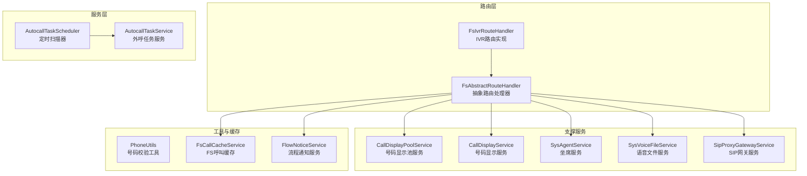
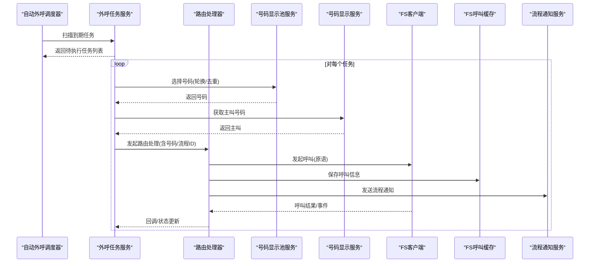
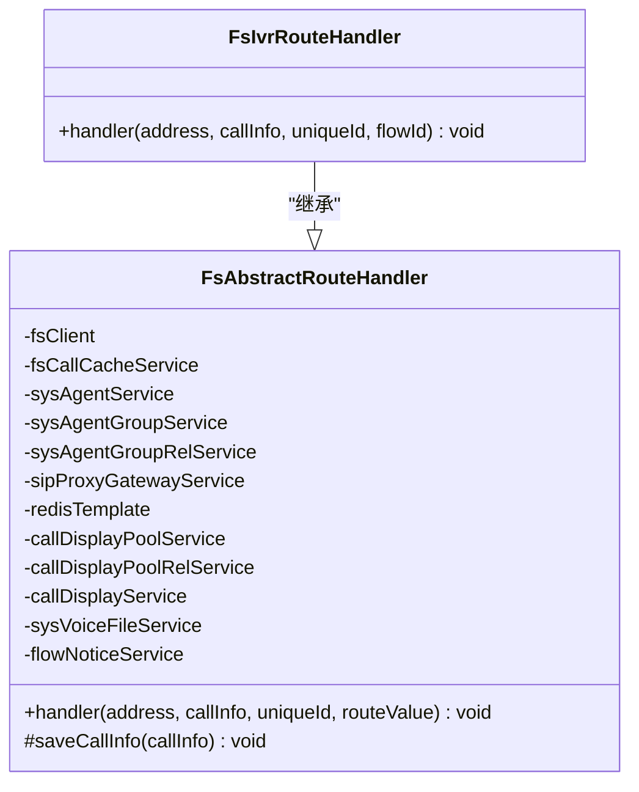
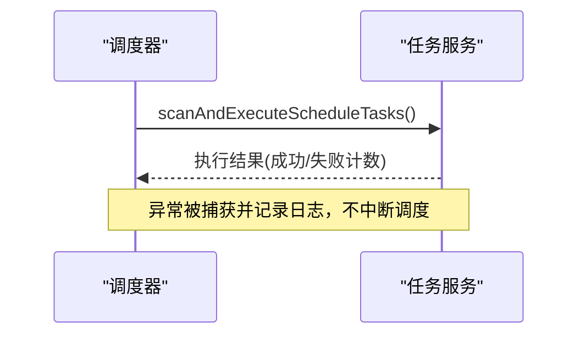
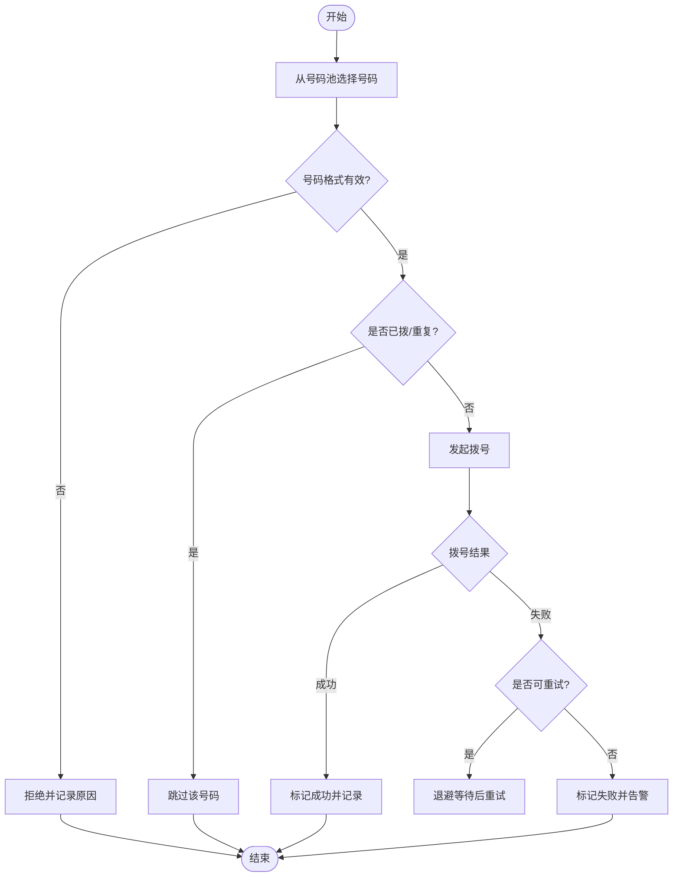
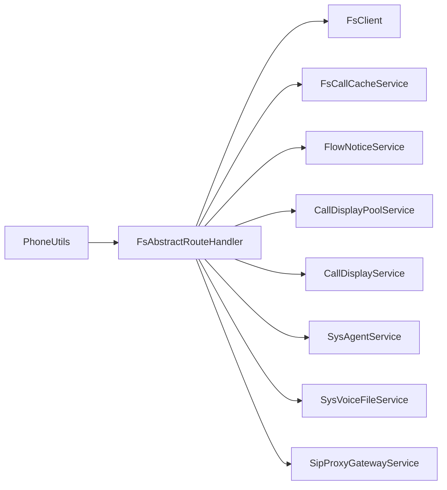

# 外呼路由处理器

<cite>
**本文引用的文件**
- [FsAbstractRouteHandler.java](file://yudao-cloud/yudao-module-cc/yudao-module-cc-server/src/main/java/cn/iocoder/yudao/module/cc/esl/handler/route/FsAbstractRouteHandler.java)
- [FsIvrRouteHandler.java](file://yudao-cloud/yudao-module-cc/yudao-module-cc-server/src/main/java/cn/iocoder/yudao/module/cc/esl/handler/route/FsIvrRouteHandler.java)
- [AutocallTaskScheduler.java](file://yudao-cloud/yudao-module-cc/yudao-module-cc-server/src/main/java/cn/iocoder/yudao/module/cc/service/autocall/AutocallTaskScheduler.java)
- [AutocallTaskService.java](file://yudao-cloud/yudao-module-cc/yudao-module-cc-server/src/main/java/cn/iocoder/yudao/module/cc/service/autocall/AutocallTaskService.java)
- [CallDisplayPoolService.java](file://yudao-cloud/yudao-module-cc/yudao-module-cc-server/src/main/java/cn/iocoder/yudao/module/cc/service/call/CallDisplayPoolService.java)
- [CallDisplayPoolRelService.java](file://yudao-cloud/yudao-module-cc/yudao-module-cc-server/src/main/java/cn/iocoder/yudao/module/cc/service/call/CallDisplayPoolRelService.java)
- [CallDisplayService.java](file://yudao-cloud/yudao-module-cc/yudao-module-cc-server/src/main/java/cn/iocoder/yudao/module/cc/service/call/CallDisplayService.java)
- [SysAgentService.java](file://yudao-cloud/yudao-module-cc/yudao-module-cc-server/src/main/java/cn/iocoder/yudao/module/cc/service/sys/SysAgentService.java)
- [SysVoiceFileService.java](file://yudao-cloud/yudao-module-cc/yudao-module-cc-server/src/main/java/cn/iocoder/yudao/module/cc/service/sys/SysVoiceFileService.java)
- [FlowNoticeService.java](file://yudao-cloud/yudao-module-cc/yudao-module-cc-server/src/main/java/cn/iocoder/yudao/module/cc/esl/service/FlowNoticeService.java)
- [FsCallCacheService.java](file://yudao-cloud/yudao-module-cc/yudao-module-cc-server/src/main/java/cn/iocoder/yudao/module/cc/esl/service/FsCallCacheService.java)
- [SipProxyGatewayService.java](file://yudao-cloud/yudao-module-cc/yudao-module-cc-server/src/main/java/cn/iocoder/yudao/module/cc/service/sipproxy/SipProxyGatewayService.java)
- [PhoneUtils.java](file://yudao-cloud/yudao-module-cc/yudao-module-cc-server/src/main/java/cn/iocoder/yudao/module/cc/esl/utils/PhoneUtils.java)
</cite>

## 目录
1. [简介](#简介)
2. [项目结构](#项目结构)
3. [核心组件](#核心组件)
4. [架构总览](#架构总览)
5. [详细组件分析](#详细组件分析)
6. [依赖关系分析](#依赖关系分析)
7. [性能与并发控制](#性能与并发控制)
8. [故障处理与告警](#故障处理与告警)
9. [配置项说明](#配置项说明)
10. [集成与任务调度](#集成与任务调度)
11. [应用场景示例](#应用场景示例)
12. [结论](#结论)

## 简介
本文件围绕外呼路由处理器，系统化梳理 FlowCallOutRouteHandler（以 FsAbstractRouteHandler 及其子类实现为代表）的拨号策略、号码池管理、拨号时机控制、失败重试机制；并详细说明外呼任务调度（批量拨号、并发控制、速率限制）、号码格式验证与国际号码支持、号码去重逻辑、拨号失败处理（错误分类、重试策略、告警通知）、外呼路由配置（拨号间隔、最大尝试次数、时段控制），以及与自动外呼系统的集成（任务队列、进度跟踪、结果统计）。文档同时提供营销外呼号码轮换、客户回访时段控制、紧急通知优先拨号等实际场景建议。

## 项目结构
- 路由层：基于 FreeSWITCH ESL 的事件路由，抽象基类封装通用能力，具体路由处理器负责不同业务路径（如 IVR 路由）。
- 服务层：自动外呼任务调度与服务接口，提供任务创建、执行、暂停、取消、刷新统计等能力。
- 资源与网关：号码显示池、语音文件、坐席、SIP 代理网关等支撑服务。
- 工具与缓存：电话号码校验工具、FS 呼叫缓存服务、流程通知服务等。

图表来源
- [FsAbstractRouteHandler.java:1-64](file://yudao-cloud/yudao-module-cc/yudao-module-cc-server/src/main/java/cn/iocoder/yudao/module/cc/esl/handler/route/FsAbstractRouteHandler.java#L1-L64)
- [FsIvrRouteHandler.java:1-38](file://yudao-cloud/yudao-module-cc/yudao-module-cc-server/src/main/java/cn/iocoder/yudao/module/cc/esl/handler/route/FsIvrRouteHandler.java#L1-L38)
- [AutocallTaskScheduler.java:1-41](file://yudao-cloud/yudao-module-cc/yudao-module-cc-server/src/main/java/cn/iocoder/yudao/module/cc/service/autocall/AutocallTaskScheduler.java#L1-L41)
- [AutocallTaskService.java:1-104](file://yudao-cloud/yudao-module-cc/yudao-module-cc-server/src/main/java/cn/iocoder/yudao/module/cc/service/autocall/AutocallTaskService.java#L1-L104)

章节来源
- [FsAbstractRouteHandler.java:1-64](file://yudao-cloud/yudao-module-cc/yudao-module-cc-server/src/main/java/cn/iocoder/yudao/module/cc/esl/handler/route/FsAbstractRouteHandler.java#L1-L64)
- [FsIvrRouteHandler.java:1-38](file://yudao-cloud/yudao-module-cc/yudao-module-cc-server/src/main/java/cn/iocoder/yudao/module/cc/esl/handler/route/FsIvrRouteHandler.java#L1-L38)
- [AutocallTaskScheduler.java:1-41](file://yudao-cloud/yudao-module-cc/yudao-module-cc-server/src/main/java/cn/iocoder/yudao/module/cc/service/autocall/AutocallTaskScheduler.java#L1-L41)
- [AutocallTaskService.java:1-104](file://yudao-cloud/yudao-module-cc/yudao-module-cc-server/src/main/java/cn/iocoder/yudao/module/cc/service/autocall/AutocallTaskService.java#L1-L104)

## 核心组件
- 抽象路由处理器：统一注入 FS 客户端、呼叫缓存、坐席、号码池、语音文件、SIP 网关、Redis 等能力，对外暴露 handler 方法用于路由分发。
- IVR 路由处理器：将呼叫转入 IVR 流程，记录转接明细并通过流程通知服务下发。
- 自动外呼调度器：定时扫描到期且待执行的任务，调用服务层执行。
- 自动外呼服务：定义任务生命周期管理（创建、更新、删除、执行、暂停、取消、刷新统计）及调度扫描入口。

章节来源
- [FsAbstractRouteHandler.java:1-64](file://yudao-cloud/yudao-module-cc/yudao-module-cc-server/src/main/java/cn/iocoder/yudao/module/cc/esl/handler/route/FsAbstractRouteHandler.java#L1-L64)
- [FsIvrRouteHandler.java:1-38](file://yudao-cloud/yudao-module-cc/yudao-module-cc-server/src/main/java/cn/iocoder/yudao/module/cc/esl/handler/route/FsIvrRouteHandler.java#L1-L38)
- [AutocallTaskScheduler.java:1-41](file://yudao-cloud/yudao-module-cc/yudao-module-cc-server/src/main/java/cn/iocoder/yudao/module/cc/service/autocall/AutocallTaskScheduler.java#L1-L41)
- [AutocallTaskService.java:1-104](file://yudao-cloud/yudao-module-cc/yudao-module-cc-server/src/main/java/cn/iocoder/yudao/module/cc/service/autocall/AutocallTaskService.java#L1-L104)

## 架构总览
外呼路由处理器通过 FreeSWITCH 事件驱动，结合自动外呼任务调度，形成“任务调度—号码选择—路由拨号—结果回写”的闭环。号码池与号码显示服务协同完成号码轮换与主叫展示；流程通知服务与 FS 呼叫缓存保障状态同步与可观测性。

图表来源
- [AutocallTaskScheduler.java:1-41](file://yudao-cloud/yudao-module-cc/yudao-module-cc-server/src/main/java/cn/iocoder/yudao/module/cc/service/autocall/AutocallTaskScheduler.java#L1-L41)
- [AutocallTaskService.java:1-104](file://yudao-cloud/yudao-module-cc/yudao-module-cc-server/src/main/java/cn/iocoder/yudao/module/cc/service/autocall/AutocallTaskService.java#L1-L104)
- [FsAbstractRouteHandler.java:1-64](file://yudao-cloud/yudao-module-cc/yudao-module-cc-server/src/main/java/cn/iocoder/yudao/module/cc/esl/handler/route/FsAbstractRouteHandler.java#L1-L64)
- [FsIvrRouteHandler.java:1-38](file://yudao-cloud/yudao-module-cc/yudao-module-cc-server/src/main/java/cn/iocoder/yudao/module/cc/esl/handler/route/FsIvrRouteHandler.java#L1-L38)

## 详细组件分析

### 路由处理器（FsAbstractRouteHandler 与 FsIvrRouteHandler）
- 职责
  - 抽象路由处理器：集中管理 FS 客户端、呼叫缓存、坐席、号码池、语音文件、SIP 网关、Redis 等依赖，提供 saveCallInfo 等通用能力，并定义 handler 扩展点。
  - IVR 路由处理器：将呼叫转入指定 IVR 流程，记录转接明细（顺序号、类型、目标 ID），保存呼叫信息并触发流程通知。
- 关键交互
  - 通过 fsClient 发起呼叫或转接。
  - 通过 fsCallCacheService 持久化/缓存呼叫上下文。
  - 通过 flowNoticeService 向流程引擎推送事件。
  - 通过 callDisplayPoolService / callDisplayPoolRelService / callDisplayService 完成号码选择与主叫展示。
  - 通过 sysAgentService / sysVoiceFileService / sipProxyGatewayService 完成坐席、语音、网关相关能力。

图表来源
- [FsAbstractRouteHandler.java:1-64](file://yudao-cloud/yudao-module-cc/yudao-module-cc-server/src/main/java/cn/iocoder/yudao/module/cc/esl/handler/route/FsAbstractRouteHandler.java#L1-L64)
- [FsIvrRouteHandler.java:1-38](file://yudao-cloud/yudao-module-cc/yudao-module-cc-server/src/main/java/cn/iocoder/yudao/module/cc/esl/handler/route/FsIvrRouteHandler.java#L1-L38)

章节来源
- [FsAbstractRouteHandler.java:1-64](file://yudao-cloud/yudao-module-cc/yudao-module-cc-server/src/main/java/cn/iocoder/yudao/module/cc/esl/handler/route/FsAbstractRouteHandler.java#L1-L64)
- [FsIvrRouteHandler.java:1-38](file://yudao-cloud/yudao-module-cc/yudao-module-cc-server/src/main/java/cn/iocoder/yudao/module/cc/esl/handler/route/FsIvrRouteHandler.java#L1-L38)

### 自动外呼任务调度（AutocallTaskScheduler 与 AutocallTaskService）
- 调度器
  - 使用固定延迟调度，每 30 秒扫描一次，调用服务层执行扫描与执行。
  - 异常捕获仅记录日志，不影响下一次调度。
- 服务接口
  - 提供任务创建、更新、删除、分页查询、立即执行、暂停、取消、刷新统计、调度扫描入口等方法。
  - 注释明确“拆分号码生成记录，逐个发起 ESL originate”，体现批量拨号与逐条执行语义。

图表来源
- [AutocallTaskScheduler.java:1-41](file://yudao-cloud/yudao-module-cc/yudao-module-cc-server/src/main/java/cn/iocoder/yudao/module/cc/service/autocall/AutocallTaskScheduler.java#L1-L41)
- [AutocallTaskService.java:1-104](file://yudao-cloud/yudao-module-cc/yudao-module-cc-server/src/main/java/cn/iocoder/yudao/module/cc/service/autocall/AutocallTaskService.java#L1-L104)

章节来源
- [AutocallTaskScheduler.java:1-41](file://yudao-cloud/yudao-module-cc/yudao-module-cc-server/src/main/java/cn/iocoder/yudao/module/cc/service/autocall/AutocallTaskScheduler.java#L1-L41)
- [AutocallTaskService.java:1-104](file://yudao-cloud/yudao-module-cc/yudao-module-cc-server/src/main/java/cn/iocoder/yudao/module/cc/service/autocall/AutocallTaskService.java#L1-L104)

### 号码池管理与拨号策略
- 号码池服务：负责号码池的增删改查与关联关系维护。
- 号码显示服务：负责主叫号码的选择与展示，常与号码池配合实现轮换策略。
- 拨号策略建议
  - 轮换策略：按池内规则轮询或随机选取，避免重复拨打同一号码。
  - 去重逻辑：在单次任务或批次内维护已拨号码集合，防止重复。
  - 国际号码：结合 PhoneUtils 进行格式校验与国际化前缀处理。

图表来源
- [CallDisplayPoolService.java](file://yudao-cloud/yudao-module-cc/yudao-module-cc-server/src/main/java/cn/iocoder/yudao/module/cc/service/call/CallDisplayPoolService.java)
- [CallDisplayPoolRelService.java](file://yudao-cloud/yudao-module-cc/yudao-module-cc-server/src/main/java/cn/iocoder/yudao/module/cc/service/call/CallDisplayPoolRelService.java)
- [CallDisplayService.java](file://yudao-cloud/yudao-module-cc/yudao-module-cc-server/src/main/java/cn/iocoder/yudao/module/cc/service/call/CallDisplayService.java)
- [PhoneUtils.java](file://yudao-cloud/yudao-module-cc/yudao-module-cc-server/src/main/java/cn/iocoder/yudao/module/cc/esl/utils/PhoneUtils.java)

章节来源
- [CallDisplayPoolService.java](file://yudao-cloud/yudao-module-cc/yudao-module-cc-server/src/main/java/cn/iocoder/yudao/module/cc/service/call/CallDisplayPoolService.java)
- [CallDisplayPoolRelService.java](file://yudao-cloud/yudao-module-cc/yudao-module-cc-server/src/main/java/cn/iocoder/yudao/module/cc/service/call/CallDisplayPoolRelService.java)
- [CallDisplayService.java](file://yudao-cloud/yudao-module-cc/yudao-module-cc-server/src/main/java/cn/iocoder/yudao/module/cc/service/call/CallDisplayService.java)
- [PhoneUtils.java](file://yudao-cloud/yudao-module-cc/yudao-module-cc-server/src/main/java/cn/iocoder/yudao/module/cc/esl/utils/PhoneUtils.java)

### 号码格式验证、国际号码支持与去重逻辑
- 号码格式验证：通过 PhoneUtils 进行基础合法性检查（长度、前缀、字符集等）。
- 国际号码支持：识别国际前缀与区号，必要时进行标准化（如去除多余前缀、补全国家码）。
- 去重逻辑：在任务级或批次级维护 Set/Map 结构，键为标准化后的号码，确保同一号码在同一任务中只拨一次。

章节来源
- [PhoneUtils.java](file://yudao-cloud/yudao-module-cc/yudao-module-cc-server/src/main/java/cn/iocoder/yudao/module/cc/esl/utils/PhoneUtils.java)

### 拨号失败处理（错误分类、重试策略、告警通知）
- 错误分类：网络超时、远端忙、号码无效、系统限流等。
- 重试策略：指数退避、最大重试次数、抖动随机化，避免雪崩。
- 告警通知：达到阈值或特定错误码时，通过流程通知服务或外部告警通道上报。

章节来源
- [FsAbstractRouteHandler.java:1-64](file://yudao-cloud/yudao-module-cc/yudao-module-cc-server/src/main/java/cn/iocoder/yudao/module/cc/esl/handler/route/FsAbstractRouteHandler.java#L1-L64)
- [FlowNoticeService.java](file://yudao-cloud/yudao-module-cc/yudao-module-cc-server/src/main/java/cn/iocoder/yudao/module/cc/esl/service/FlowNoticeService.java)

### 外呼路由配置（拨号间隔、最大尝试次数、时段控制）
- 拨号间隔：可通过调度器的 fixedDelay 与 initialDelay 控制扫描频率，或在任务执行层设置批次间间隔。
- 最大尝试次数：在重试逻辑中配置上限，超过即放弃并记录失败。
- 时段控制：在任务调度或服务层加入时间段判断，仅在允许时段内执行拨号。

章节来源
- [AutocallTaskScheduler.java:1-41](file://yudao-cloud/yudao-module-cc/yudao-module-cc-server/src/main/java/cn/iocoder/yudao/module/cc/service/autocall/AutocallTaskScheduler.java#L1-L41)
- [AutocallTaskService.java:1-104](file://yudao-cloud/yudao-module-cc/yudao-module-cc-server/src/main/java/cn/iocoder/yudao/module/cc/service/autocall/AutocallTaskService.java#L1-L104)

## 依赖关系分析
- 路由处理器依赖 FS 客户端、呼叫缓存、流程通知、号码池、号码显示、坐席、语音文件、SIP 网关等。
- 自动外呼调度器依赖任务服务，任务服务依赖数据库与缓存（由上层框架提供）。
- 工具类 PhoneUtils 为号码校验提供通用能力。

图表来源
- [FsAbstractRouteHandler.java:1-64](file://yudao-cloud/yudao-module-cc/yudao-module-cc-server/src/main/java/cn/iocoder/yudao/module/cc/esl/handler/route/FsAbstractRouteHandler.java#L1-L64)
- [PhoneUtils.java](file://yudao-cloud/yudao-module-cc/yudao-module-cc-server/src/main/java/cn/iocoder/yudao/module/cc/esl/utils/PhoneUtils.java)

章节来源
- [FsAbstractRouteHandler.java:1-64](file://yudao-cloud/yudao-module-cc/yudao-module-cc-server/src/main/java/cn/iocoder/yudao/module/cc/esl/handler/route/FsAbstractRouteHandler.java#L1-L64)

## 性能与并发控制
- 批量拨号：任务服务“拆分号码生成记录，逐个发起 ESL originate”，建议在任务执行层引入线程池或消息队列进行并发控制。
- 并发控制：通过限流器（令牌桶/漏桶）控制每秒拨号数，避免对 FS/运营商造成压力。
- 速率限制：结合调度器间隔与任务内部批大小，调节吞吐；高峰期降低批大小或增加间隔。
- 内存与缓存：使用 Redis 或本地缓存维护去重集合与速率计数器，注意过期策略。

[本节为通用性能指导，不直接分析具体文件]

## 故障处理与告警
- 异常捕获：调度器捕获异常并记录日志，保证调度连续性。
- 错误分类：区分可重试与不可重试错误，分别走重试或快速失败路径。
- 告警通知：通过 FlowNoticeService 或外部告警通道上报异常与指标（成功率、失败率、重试次数）。

章节来源
- [AutocallTaskScheduler.java:1-41](file://yudao-cloud/yudao-module-cc/yudao-module-cc-server/src/main/java/cn/iocoder/yudao/module/cc/service/autocall/AutocallTaskScheduler.java#L1-L41)
- [FlowNoticeService.java](file://yudao-cloud/yudao-module-cc/yudao-module-cc-server/src/main/java/cn/iocoder/yudao/module/cc/esl/service/FlowNoticeService.java)

## 配置项说明
- 调度间隔：fixedDelay=30000ms，initialDelay=30000ms（可在调度器中调整）。
- 最大尝试次数：在重试逻辑中配置（建议默认 3 次，指数退避）。
- 时段控制：在服务层或任务配置中启用时间段白名单（如工作日 9:00-18:00）。
- 并发与速率：建议通过线程池大小与限流器参数控制（如 QPS 限制）。

章节来源
- [AutocallTaskScheduler.java:1-41](file://yudao-cloud/yudao-module-cc/yudao-module-cc-server/src/main/java/cn/iocoder/yudao/module/cc/service/autocall/AutocallTaskScheduler.java#L1-L41)

## 集成与任务调度
- 任务队列管理：建议使用消息队列解耦任务生产与消费，提升可靠性与可扩展性。
- 进度跟踪：通过 FsCallCacheService 与任务服务刷新统计，实时展示成功/失败/总数。
- 结果统计：refreshTaskStats 根据记录表状态重新计算指标，便于报表与监控。

章节来源
- [AutocallTaskService.java:1-104](file://yudao-cloud/yudao-module-cc/yudao-module-cc-server/src/main/java/cn/iocoder/yudao/module/cc/service/autocall/AutocallTaskService.java#L1-L104)
- [FsCallCacheService.java](file://yudao-cloud/yudao-module-cc/yudao-module-cc-server/src/main/java/cn/iocoder/yudao/module/cc/esl/service/FsCallCacheService.java)

## 应用场景示例
- 营销外呼的号码轮换策略
  - 策略：按号码池顺序或随机轮换，结合去重集合避免重复拨打。
  - 效果：提升触达率，降低骚扰风险。
- 客户回访的时间段控制
  - 策略：在任务执行层加入时间段判断，仅在工作日指定时段拨号。
  - 效果：符合合规要求，提高接通率。
- 紧急通知的优先拨号机制
  - 策略：为高优先级任务设置更高并发与更短间隔，必要时跳过时段限制。
  - 效果：确保关键信息及时送达。

[本节为概念性说明，不直接分析具体文件]

## 结论
外呼路由处理器以 FsAbstractRouteHandler 为核心，结合自动外呼任务调度与号码池管理，实现了可配置、可观测、可扩展的外呼体系。通过合理的拨号策略、并发控制、失败重试与时段控制，可满足营销外呼、客户回访、紧急通知等多类场景需求。建议在生产环境中完善限流、监控与告警，持续优化拨号效率与用户体验。