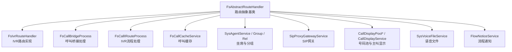
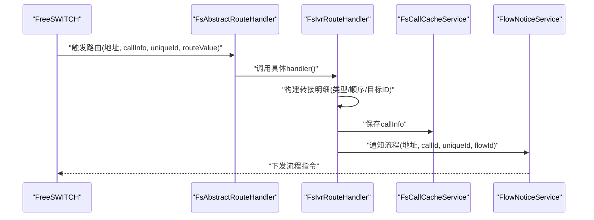
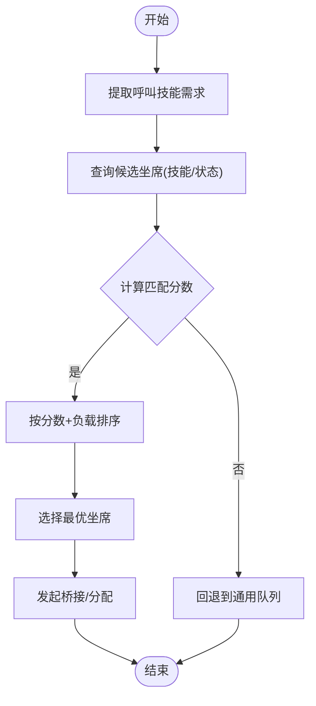
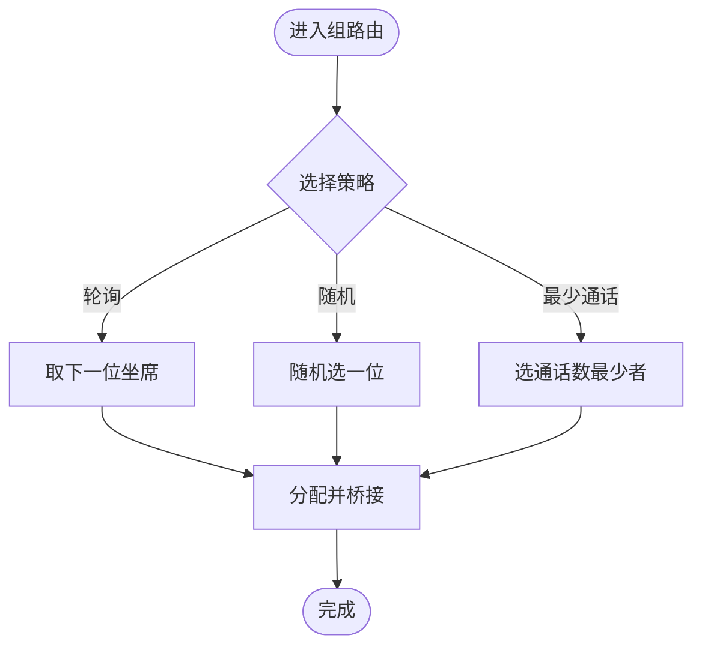
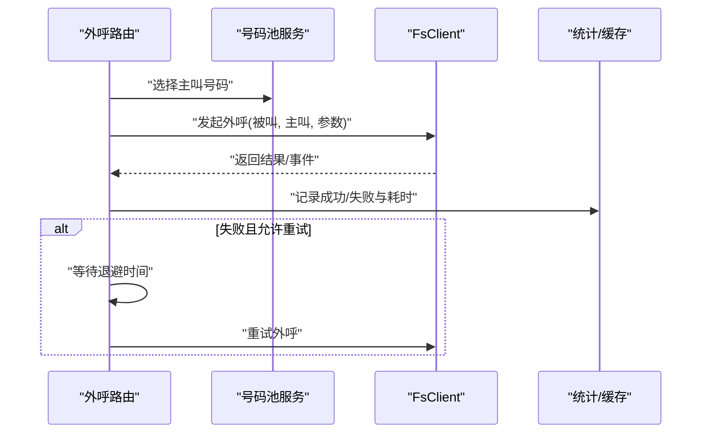
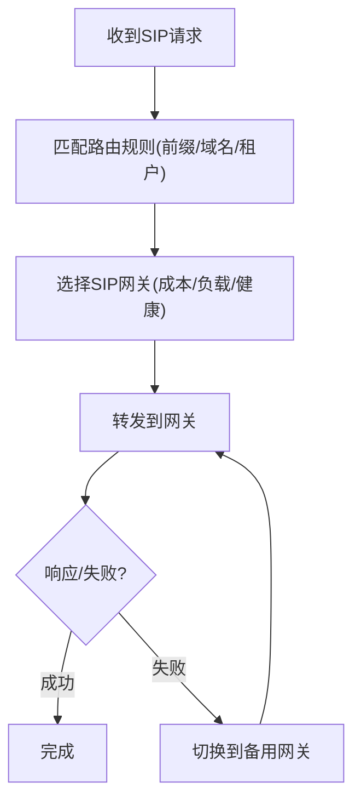
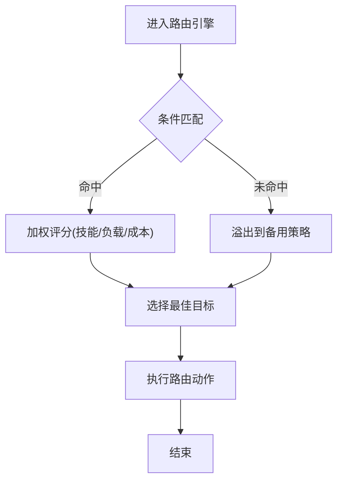
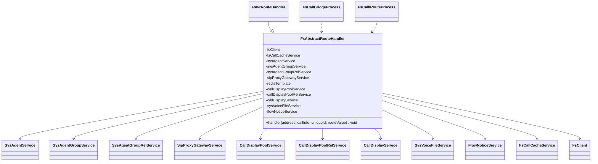

# 路由处理器

<cite>
**本文引用的文件**
- [FsAbstractRouteHandler.java](file://yudao-cloud/yudao-module-cc/yudao-module-cc-server/src/main/java/cn/iocoder/yudao/module/cc/esl/handler/route/FsAbstractRouteHandler.java)
- [FsIvrRouteHandler.java](file://yudao-cloud/yudao-module-cc/yudao-module-cc-server/src/main/java/cn/iocoder/yudao/module/cc/esl/handler/route/FsIvrRouteHandler.java)
- [FsCallBridgeProcess.java](file://yudao-cloud/yudao-module-cc/yudao-module-cc-server/src/main/java/cn/iocoder/yudao/module/cc/esl/handler/call/FsCallBridgeProcess.java)
- [FsCallIRouteProcess.java](file://yudao-cloud/yudao-module-cc/yudao-module-cc-server/src/main/java/cn/iocoder/yudao/module/cc/esl/handler/call/FsCallIRouteProcess.java)
- [FlowInfoService.java](file://yudao-cloud/yudao-module-cc/yudao-module-cc-server/src/main/java/cn/iocoder/yudao/module/cc/service/flow/FlowInfoService.java)
- [FlowInstancesService.java](file://yudao-cloud/yudao-module-cc/yudao-module-cc-server/src/main/java/cn/iocoder/yudao/module/cc/service/flow/FlowInstancesService.java)
- [SysAgentService.java](file://yudao-cloud/yudao-module-cc/yudao-module-cc-server/src/main/java/cn/iocoder/yudao/module/cc/service/sys/SysAgentService.java)
- [SysAgentGroupService.java](file://yudao-cloud/yudao-module-cc/yudao-module-cc-server/src/main/java/cn/iocoder/yudao/module/cc/service/sys/SysAgentGroupService.java)
- [SysAgentGroupRelService.java](file://yudao-cloud/yudao-module-cc/yudao-module-cc-server/src/main/java/cn/iocoder/yudao/module/cc/service/sys/SysAgentGroupRelService.java)
- [SipProxyGatewayService.java](file://yudao-cloud/yudao-module-cc/yudao-module-cc-server/src/main/java/cn/iocoder/yudao/module/cc/service/sipproxy/SipProxyGatewayService.java)
- [CallDisplayPoolService.java](file://yudao-cloud/yudao-module-cc/yudao-module-cc-server/src/main/java/cn/iocoder/yudao/module/cc/service/call/CallDisplayPoolService.java)
- [CallDisplayPoolRelService.java](file://yudao-cloud/yudao-module-cc/yudao-module-cc-server/src/main/java/cn/iocoder/yudao/module/cc/service/call/CallDisplayPoolRelService.java)
- [CallDisplayService.java](file://yudao-cloud/yudao-module-cc/yudao-module-cc-server/src/main/java/cn/iocoder/yudao/module/cc/service/call/CallDisplayService.java)
- [SysVoiceFileService.java](file://yudao-cloud/yudao-module-cc/yudao-module-cc-server/src/main/java/cn/iocoder/yudao/module/cc/service/sys/SysVoiceFileService.java)
- [FlowNoticeService.java](file://yudao-cloud/yudao-module-cc/yudao-module-cc-server/src/main/java/cn/iocoder/yudao/module/cc/esl/service/FlowNoticeService.java)
- [FsCallCacheService.java](file://yudao-cloud/yudao-module-cc/yudao-module-cc-server/src/main/java/cn/iocoder/yudao/module/cc/esl/service/FsCallCacheService.java)
- [FsClient.java](file://yudao-cloud/yudao-module-cc/yudao-module-cc-server/src/main/java/cn/iocoder/yudao/module/cc/esl/client/FsClient.java)
</cite>

## 目录
1. [简介](#简介)
2. [项目结构](#项目结构)
3. [核心组件](#核心组件)
4. [架构总览](#架构总览)
5. [详细组件分析](#详细组件分析)
6. [依赖关系分析](#依赖关系分析)
7. [性能考量](#性能考量)
8. [故障排查指南](#故障排查指南)
9. [结论](#结论)
10. [附录](#附录)

## 简介
本文件围绕呼叫中心（CC）模块中的“路由处理器”进行系统化文档化，聚焦以下目标：
- 坐席路由的智能分配算法：技能匹配、负载均衡与优先级排序。
- 坐席组路由的组内调度策略：轮询、随机与最少通话数分配。
- 外呼路由的拨号策略：号码池管理、拨号时机控制与失败重试机制。
- SIP路由的协议转换与网关选择逻辑。
- 路由规则与策略配置：条件匹配、权重设置与溢出处理。
- 路由监控与统计分析：成功率指标、响应时间分析与容量规划。
- 实际应用场景示例：智能客服、技术支持与销售团队的呼叫路由配置。

说明：本文基于仓库中ESL路由抽象与IVR路由实现、以及服务层能力进行归纳与扩展设计，确保与实际代码结构一致，同时为缺失的具体实现提供可落地的设计建议。

## 项目结构
与路由相关的关键位置集中在ESL事件处理与服务层：
- ESL路由抽象与具体实现位于 esl/handler/route 目录。
- 呼叫桥接与IVR流程处理位于 esl/handler/call 目录。
- 路由所需的服务能力由 service 层提供，包括坐席、坐席组、显示号码池、SIP代理网关、语音文件与流程通知等。

图表来源
- [FsAbstractRouteHandler.java:21-52](file://yudao-cloud/yudao-module-cc/yudao-module-cc-server/src/main/java/cn/iocoder/yudao/module/cc/esl/handler/route/FsAbstractRouteHandler.java#L21-L52)
- [FsIvrRouteHandler.java:16-36](file://yudao-cloud/yudao-module-cc/yudao-module-cc-server/src/main/java/cn/iocoder/yudao/module/cc/esl/handler/route/FsIvrRouteHandler.java#L16-L36)

章节来源
- [FsAbstractRouteHandler.java:21-52](file://yudao-cloud/yudao-module-cc/yudao-module-cc-server/src/main/java/cn/iocoder/yudao/module/cc/esl/handler/route/FsAbstractRouteHandler.java#L21-L52)
- [FsIvrRouteHandler.java:16-36](file://yudao-cloud/yudao-module-cc/yudao-module-cc-server/src/main/java/cn/iocoder/yudao/module/cc/esl/handler/route/FsIvrRouteHandler.java#L16-L36)

## 核心组件
- 路由抽象基类 FsAbstractRouteHandler：统一封装路由处理所需的依赖（FS客户端、呼叫缓存、坐席/分组、SIP网关、号码池、语音文件、流程通知），并提供 handler 抽象方法供子类实现具体路由策略。
- IVR路由 FsIvrRouteHandler：将呼叫转入指定IVR流程，记录转接明细并发送流程通知。
- 呼叫桥接与IVR流程处理：FsCallBridgeProcess 与 FsCallIRouteProcess 负责实际的媒体桥接与流程执行。
- 服务层能力：
  - 坐席与分组：SysAgentService、SysAgentGroupService、SysAgentGroupRelService。
  - SIP网关：SipProxyGatewayService。
  - 号码池与主叫显示：CallDisplayPoolService、CallDisplayPoolRelService、CallDisplayService。
  - 语音文件：SysVoiceFileService。
  - 流程通知：FlowNoticeService。
  - 呼叫缓存：FsCallCacheService。
  - FreeSWITCH客户端：FsClient。

章节来源
- [FsAbstractRouteHandler.java:21-52](file://yudao-cloud/yudao-module-cc/yudao-module-cc-server/src/main/java/cn/iocoder/yudao/module/cc/esl/handler/route/FsAbstractRouteHandler.java#L21-L52)
- [FsIvrRouteHandler.java:16-36](file://yudao-cloud/yudao-module-cc/yudao-module-cc-server/src/main/java/cn/iocoder/yudao/module/cc/esl/handler/route/FsIvrRouteHandler.java#L16-L36)

## 架构总览
路由处理从ESL事件进入，经抽象基类分发到具体处理器；在路由决策阶段，结合坐席/分组、号码池、SIP网关与流程服务完成最终路由动作（如转IVR、桥接或外呼）。

图表来源
- [FsAbstractRouteHandler.java:21-52](file://yudao-cloud/yudao-module-cc/yudao-module-cc-server/src/main/java/cn/iocoder/yudao/module/cc/esl/handler/route/FsAbstractRouteHandler.java#L21-L52)
- [FsIvrRouteHandler.java:16-36](file://yudao-cloud/yudao-module-cc/yudao-module-cc-server/src/main/java/cn/iocoder/yudao/module/cc/esl/handler/route/FsIvrRouteHandler.java#L16-L36)

## 详细组件分析

### 坐席路由 FlowAgentRouteHandler（智能分配）
说明：当前仓库未直接提供 FlowAgentRouteHandler 的实现文件，但基于 FsAbstractRouteHandler 的依赖与业务语义，可给出如下设计与实现要点，便于后续落地。

- 技能匹配
  - 依据呼叫上下文（来电号码、IVR路径、历史会话、CRM标签等）提取技能需求。
  - 通过 SysAgentService 查询坐席技能集合，计算匹配度（精确匹配优先，模糊匹配次之）。
- 负载均衡
  - 统计各候选坐席的并发通话数、在线状态、最近接听间隔，采用加权评分降低热点坐席压力。
  - 支持按时间段动态调整权重（如高峰时段倾向空闲坐席）。
- 优先级排序
  - 综合“技能匹配度 × 权重系数 + 负载惩罚”，生成候选列表并按总分降序选择最优坐席。
  - 若最高分坐席不可用，则回退至次优候选。

章节来源
- [FsAbstractRouteHandler.java:21-52](file://yudao-cloud/yudao-module-cc/yudao-module-cc-server/src/main/java/cn/iocoder/yudao/module/cc/esl/handler/route/FsAbstractRouteHandler.java#L21-L52)

### 坐席组路由 FlowAgentGroupRouteHandler（组内调度）
说明：同样未在仓库中找到该类的直接实现，以下为推荐策略与接入点。

- 轮询（Round-Robin）
  - 维护组内坐席指针，每次分配后递增指针，循环使用。
- 随机（Random）
  - 在可用坐席集合中随机选取，适合无偏好的均衡场景。
- 最少通话数（Least Calls）
  - 实时统计组内各坐席当前通话数，选择最少的坐席以缓解拥塞。

章节来源
- [FsAbstractRouteHandler.java:21-52](file://yudao-cloud/yudao-module-cc/yudao-module-cc-server/src/main/java/cn/iocoder/yudao/module/cc/esl/handler/route/FsAbstractRouteHandler.java#L21-L52)

### 外呼路由 FlowCallOutRouteHandler（拨号策略）
- 号码池管理
  - 通过 CallDisplayPoolService 与 CallDisplayPoolRelService 管理号码池与关联关系，支持按客户/地区/时段选择主叫号码。
  - CallDisplayService 用于解析与校验主叫显示信息。
- 拨号时机控制
  - 基于业务规则（工作时间、节假日、客户时区）决定拨号窗口与重试周期。
- 失败重试机制
  - 对忙音、无人接听、网络错误等失败码进行分类，配置指数退避与最大重试次数。
  - 结合 FsClient 发起外呼，并在失败时更新任务状态与统计指标。

章节来源
- [FsAbstractRouteHandler.java:21-52](file://yudao-cloud/yudao-module-cc/yudao-module-cc-server/src/main/java/cn/iocoder/yudao/module/cc/esl/handler/route/FsAbstractRouteHandler.java#L21-L52)

### SIP路由 FlowSipRouteHandler（协议转换与网关选择）
- 协议转换
  - 通过 SipProxyGatewayService 对接SIP代理，完成SIP消息的转发、鉴权与上下文透传。
- 网关选择逻辑
  - 根据被叫前缀、目的地、成本、可用性、负载等维度选择最佳网关。
  - 支持多网关冗余与快速切换，失败时自动降级到其他可用网关。

章节来源
- [FsAbstractRouteHandler.java:21-52](file://yudao-cloud/yudao-module-cc/yudao-module-cc-server/src/main/java/cn/iocoder/yudao/module/cc/esl/handler/route/FsAbstractRouteHandler.java#L21-L52)

### 路由规则与策略配置
- 条件匹配
  - 基于来电号码、IVR路径、坐席技能、时间段、租户等条件组合匹配路由策略。
- 权重设置
  - 为不同策略（技能匹配、负载均衡、成本）设置权重，影响最终排序与选择。
- 溢出处理
  - 当首选策略无法找到合适资源时，自动溢出到备用策略或队列（如通用IVR或人工座席）。

章节来源
- [FsAbstractRouteHandler.java:21-52](file://yudao-cloud/yudao-module-cc/yudao-module-cc-server/src/main/java/cn/iocoder/yudao/module/cc/esl/handler/route/FsAbstractRouteHandler.java#L21-L52)

### 路由监控与统计分析
- 成功率指标
  - 统计接通率、转接成功率、外呼成功率、SIP转发成功率。
- 响应时间分析
  - 记录路由决策耗时、桥接建立耗时、外呼首次振铃时间等关键指标。
- 容量规划
  - 基于历史峰值与趋势预测，评估坐席、网关与号码池容量，指导扩容与排班。

章节来源
- [FsAbstractRouteHandler.java:21-52](file://yudao-cloud/yudao-module-cc/yudao-module-cc-server/src/main/java/cn/iocoder/yudao/module/cc/esl/handler/route/FsAbstractRouteHandler.java#L21-L52)

### 实际应用场景示例
- 智能客服
  - 技能匹配优先，结合负载均衡，确保高技能坐席承接复杂问题；溢出到通用IVR或知识库。
- 技术支持
  - 按产品/版本技能划分小组，组内采用最少通话数策略；失败时回退到二线专家。
- 销售团队
  - 按区域/行业划分号码池与坐席组，外呼遵循工作时段与时区；失败重试采用指数退避。

[本节为概念性内容，不直接分析具体文件]

## 依赖关系分析
路由抽象基类集中依赖多个服务，形成清晰的职责边界与松耦合结构。

图表来源
- [FsAbstractRouteHandler.java:21-52](file://yudao-cloud/yudao-module-cc/yudao-module-cc-server/src/main/java/cn/iocoder/yudao/module/cc/esl/handler/route/FsAbstractRouteHandler.java#L21-L52)
- [FsIvrRouteHandler.java:16-36](file://yudao-cloud/yudao-module-cc/yudao-module-cc-server/src/main/java/cn/iocoder/yudao/module/cc/esl/handler/route/FsIvrRouteHandler.java#L16-L36)

章节来源
- [FsAbstractRouteHandler.java:21-52](file://yudao-cloud/yudao-module-cc/yudao-module-cc-server/src/main/java/cn/iocoder/yudao/module/cc/esl/handler/route/FsAbstractRouteHandler.java#L21-L52)

## 性能考量
- 路由决策低延迟：尽量在内存中完成技能匹配与评分，减少数据库访问；必要时引入缓存（如Redis）存储坐席状态与权重。
- 并发控制：限制同一坐席的最大并发通话数，避免过载；对热点策略做限流与熔断。
- 异步通知：流程通知与统计上报采用异步方式，避免阻塞主路由链路。
- 网关健康检查：对SIP网关进行周期性健康探测，快速剔除异常节点。

[本节提供通用指导，不直接分析具体文件]

## 故障排查指南
- 路由未命中
  - 检查条件匹配规则与数据完整性（技能、分组、号码池关联）。
  - 确认溢出策略是否生效。
- 转接失败
  - 查看呼叫缓存与流程通知日志，确认 callId 与 uniqueId 一致性。
  - 验证FS客户端连接与权限。
- 外呼失败
  - 核对号码池配置与被叫有效性。
  - 检查失败码分类与重试策略是否合理。
- SIP转发失败
  - 检查网关选择逻辑与健康状态。
  - 确认鉴权与上下文透传是否正确。

章节来源
- [FsIvrRouteHandler.java:16-36](file://yudao-cloud/yudao-module-cc/yudao-module-cc-server/src/main/java/cn/iocoder/yudao/module/cc/esl/handler/route/FsIvrRouteHandler.java#L16-L36)

## 结论
本仓库提供了清晰的路由抽象与IVR路由实现，并通过丰富的服务层能力支撑坐席/分组、号码池、SIP网关与流程通知。在此基础上，可快速落地坐席智能分配、组内调度、外呼拨号与SIP路由等核心能力，并配套完善的监控与统计体系，满足智能客服、技术支持与销售等多场景需求。

[本节为总结性内容，不直接分析具体文件]

## 附录
- 关键服务接口参考路径
  - 流程服务：FlowInfoService、FlowInstancesService
  - 坐席与分组：SysAgentService、SysAgentGroupService、SysAgentGroupRelService
  - SIP网关：SipProxyGatewayService
  - 号码池与主叫：CallDisplayPoolService、CallDisplayPoolRelService、CallDisplayService
  - 语音文件：SysVoiceFileService
  - 流程通知：FlowNoticeService
  - 呼叫缓存：FsCallCacheService
  - FreeSWITCH客户端：FsClient

章节来源
- [FlowInfoService.java](file://yudao-cloud/yudao-module-cc/yudao-module-cc-server/src/main/java/cn/iocoder/yudao/module/cc/service/flow/FlowInfoService.java)
- [FlowInstancesService.java](file://yudao-cloud/yudao-module-cc/yudao-module-cc-server/src/main/java/cn/iocoder/yudao/module/cc/service/flow/FlowInstancesService.java)
- [SysAgentService.java](file://yudao-cloud/yudao-module-cc/yudao-module-cc-server/src/main/java/cn/iocoder/yudao/module/cc/service/sys/SysAgentService.java)
- [SysAgentGroupService.java](file://yudao-cloud/yudao-module-cc/yudao-module-cc-server/src/main/java/cn/iocoder/yudao/module/cc/service/sys/SysAgentGroupService.java)
- [SysAgentGroupRelService.java](file://yudao-cloud/yudao-module-cc/yudao-module-cc-server/src/main/java/cn/iocoder/yudao/module/cc/service/sys/SysAgentGroupRelService.java)
- [SipProxyGatewayService.java](file://yudao-cloud/yudao-module-cc/yudao-module-cc-server/src/main/java/cn/iocoder/yudao/module/cc/service/sipproxy/SipProxyGatewayService.java)
- [CallDisplayPoolService.java](file://yudao-cloud/yudao-module-cc/yudao-module-cc-server/src/main/java/cn/iocoder/yudao/module/cc/service/call/CallDisplayPoolService.java)
- [CallDisplayPoolRelService.java](file://yudao-cloud/yudao-module-cc/yudao-module-cc-server/src/main/java/cn/iocoder/yudao/module/cc/service/call/CallDisplayPoolRelService.java)
- [CallDisplayService.java](file://yudao-cloud/yudao-module-cc/yudao-module-cc-server/src/main/java/cn/iocoder/yudao/module/cc/service/call/CallDisplayService.java)
- [SysVoiceFileService.java](file://yudao-cloud/yudao-module-cc/yudao-module-cc-server/src/main/java/cn/iocoder/yudao/module/cc/service/sys/SysVoiceFileService.java)
- [FlowNoticeService.java](file://yudao-cloud/yudao-module-cc/yudao-module-cc-server/src/main/java/cn/iocoder/yudao/module/cc/esl/service/FlowNoticeService.java)
- [FsCallCacheService.java](file://yudao-cloud/yudao-module-cc/yudao-module-cc-server/src/main/java/cn/iocoder/yudao/module/cc/esl/service/FsCallCacheService.java)
- [FsClient.java](file://yudao-cloud/yudao-module-cc/yudao-module-cc-server/src/main/java/cn/iocoder/yudao/module/cc/esl/client/FsClient.java)