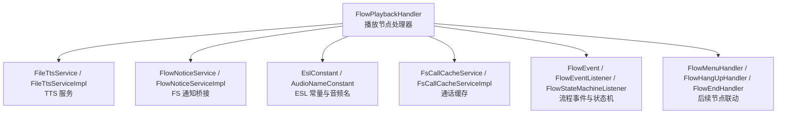
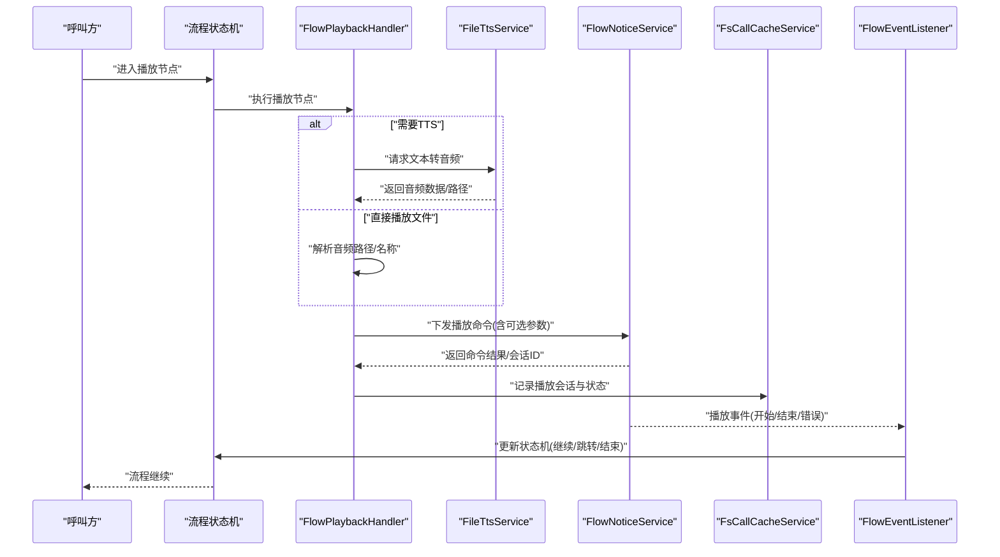
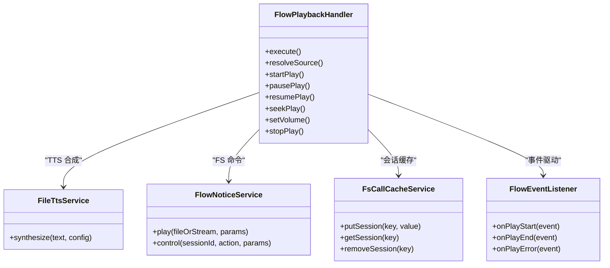
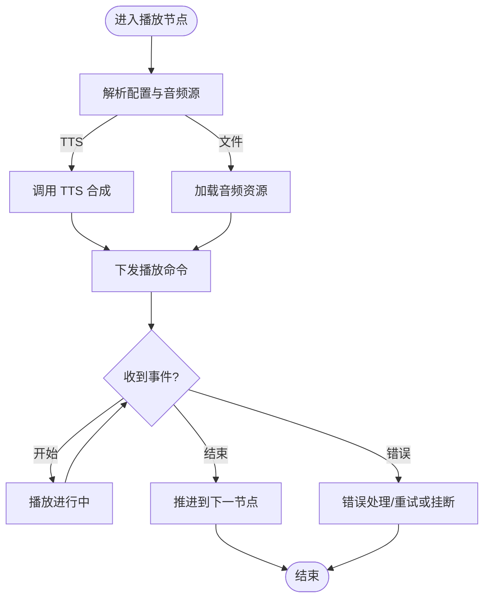
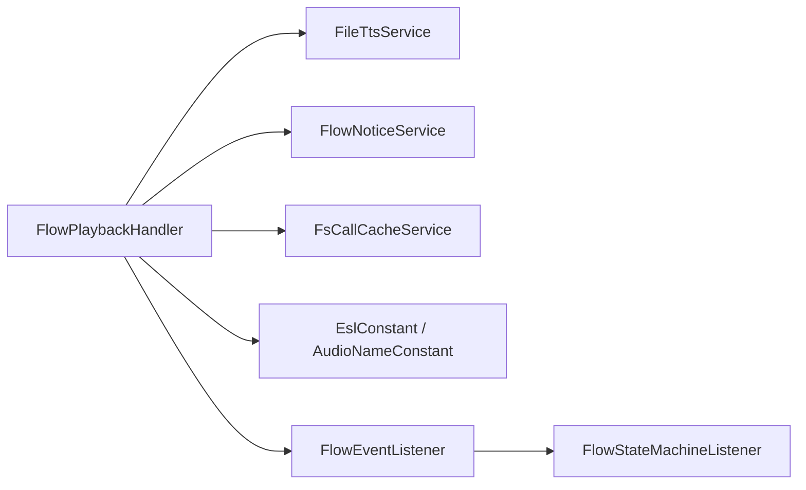

# 音频播放处理器

<cite>
**本文引用的文件**
- [FlowPlaybackHandler.java](file://yudao-cloud/yudao-module-cc/yudao-module-cc-server/src/main/java/cn/iocoder/yudao/module/cc/ivr/handler/node/FlowPlaybackHandler.java)
- [FlowPlaybackNodeProperties.java](file://yudao-cloud/yudao-module-cc/yudao-module-cc-server/src/main/java/cn/iocoder/yudao/module/cc/ivr/properties/FlowPlaybackNodeProperties.java)
- [FileTtsService.java](file://yudao-cloud/yudao-module-cc/yudao-module-cc-server/src/main/java/cn/iocoder/yudao/module/cc/tts/FileTtsService.java)
- [FileTtsServiceImpl.java](file://yudao-cloud/yudao-module-cc/yudao-module-cc-server/src/main/java/cn/iocoder/yudao/module/cc/tts/FileTtsServiceImpl.java)
- [AudioNameConstant.java](file://yudao-cloud/yudao-module-cc/yudao-module-cc-server/src/main/java/cn/iocoder/yudao/module/cc/esl/constant/AudioNameConstant.java)
- [EslConstant.java](file://yudao-cloud/yudao-module-cc/yudao-module-cc-server/src/main/java/cn/iocoder/yudao/module/cc/esl/constant/EslConstant.java)
- [FlowNoticeService.java](file://yudao-cloud/yudao-module-cc/yudao-module-cc-server/src/main/java/cn/iocoder/yudao/module/cc/esl/service/FlowNoticeService.java)
- [FlowNoticeServiceImpl.java](file://yudao-cloud/yudao-module-cc/yudao-module-cc-server/src/main/java/cn/iocoder/yudao/module/cc/esl/service/FlowNoticeServiceImpl.java)
- [FsCallCacheService.java](file://yudao-cloud/yudao-module-cc/yudao-module-cc-server/src/main/java/cn/iocoder/yudao/module/cc/esl/service/FsCallCacheService.java)
- [FsCallCacheServiceImpl.java](file://yudao-cloud/yudao-module-cc/yudao-module-cc-server/src/main/java/cn/iocoder/yudao/module/cc/esl/service/FsCallCacheServiceImpl.java)
- [FlowEvent.java](file://yudao-cloud/yudao-module-cc/yudao-module-cc-server/src/main/java/cn/iocoder/yudao/module/cc/ivr/event/FlowEvent.java)
- [FlowEventListener.java](file://yudao-cloud/yudao-module-cc/yudao-module-cc-server/src/main/java/cn/iocoder/yudao/module/cc/ivr/listener/FlowEventListener.java)
- [FlowStateMachineListener.java](file://yudao-cloud/yudao-module-cc/yudao-module-cc-server/src/main/java/cn/iocoder/yudao/module/cc/ivr/listener/FlowStateMachineListener.java)
- [FlowMenuHandler.java](file://yudao-cloud/yudao-module-cc/yudao-module-cc-server/src/main/java/cn/iocoder/yudao/module/cc/ivr/handler/node/FlowMenuHandler.java)
- [FlowHangUpHandler.java](file://yudao-cloud/yudao-module-cc/yudao-module-cc-server/src/main/java/cn/iocoder/yudao/module/cc/ivr/handler/node/FlowHangUpHandler.java)
- [FlowEndHandler.java](file://yudao-cloud/yudao-module-cc/yudao-module-cc-server/src/main/java/cn/iocoder/yudao/module/cc/ivr/handler/node/FlowEndHandler.java)
- [SysVoiceTypeEnum.java](file://yudao-cloud/yudao-module-cc/yudao-module-cc-api/src/main/java/cn/iocoder/yudao/module/cc/enums/SysVoiceTypeEnum.java)
- [SysVoiceTtsTypeConstants.java](file://yudao-cloud/yudao-module-cc/yudao-module-cc-api/src/main/java/cn/iocoder/yudao/module/cc/enums/SysVoiceTtsTypeConstants.java)
</cite>

## 目录
1. [简介](#简介)
2. [项目结构](#项目结构)
3. [核心组件](#核心组件)
4. [架构总览](#架构总览)
5. [详细组件分析](#详细组件分析)
6. [依赖关系分析](#依赖关系分析)
7. [性能考虑](#性能考虑)
8. [故障排查指南](#故障排查指南)
9. [结论](#结论)
10. [附录：配置与使用示例](#附录配置与使用示例)

## 简介
本文件为“音频播放处理器”的完整技术文档，聚焦于 FlowPlaybackHandler 的实现原理与使用方式。内容涵盖：
- 音频文件加载、播放控制（暂停、恢复、跳转、音量）与流媒体传输机制
- 支持的音频格式、编码与质量配置选项
- TTS 语音合成集成（文本转语音 API 调用与结果处理）
- 音频资源管理策略（缓存、内存优化、并发访问控制）
- 完整的配置示例与典型使用场景（欢迎语播放、菜单提示音、录音通知）

## 项目结构
本项目在 CC 模块中实现了 IVR 流程引擎，其中 FlowPlaybackHandler 作为“播放节点”处理器，负责将音频或 TTS 生成的音频推送到通话通道进行播放。与之协作的关键组件包括：
- ESL 常量与事件：用于 FreeSWITCH 通道操作与事件回调
- TTS 服务：提供文本到音频的转换能力
- 流程事件监听器：统一处理播放完成、错误等状态流转
- 通话缓存服务：维护通话上下文与播放状态

图表来源
- [FlowPlaybackHandler.java](file://yudao-cloud/yudao-module-cc/yudao-module-cc-server/src/main/java/cn/iocoder/yudao/module/cc/ivr/handler/node/FlowPlaybackHandler.java)
- [FileTtsService.java](file://yudao-cloud/yudao-module-cc/yudao-module-cc-server/src/main/java/cn/iocoder/yudao/module/cc/tts/FileTtsService.java)
- [FileTtsServiceImpl.java](file://yudao-cloud/yudao-module-cc/yudao-module-cc-server/src/main/java/cn/iocoder/yudao/module/cc/tts/FileTtsServiceImpl.java)
- [EslConstant.java](file://yudao-cloud/yudao-module-cc/yudao-module-cc-server/src/main/java/cn/iocoder/yudao/module/cc/esl/constant/EslConstant.java)
- [AudioNameConstant.java](file://yudao-cloud/yudao-module-cc/yudao-module-cc-server/src/main/java/cn/iocoder/yudao/module/cc/esl/constant/AudioNameConstant.java)
- [FlowNoticeService.java](file://yudao-cloud/yudao-module-cc/yudao-module-cc-server/src/main/java/cn/iocoder/yudao/module/cc/esl/service/FlowNoticeService.java)
- [FlowNoticeServiceImpl.java](file://yudao-cloud/yudao-module-cc/yudao-module-cc-server/src/main/java/cn/iocoder/yudao/module/cc/esl/service/FlowNoticeServiceImpl.java)
- [FsCallCacheService.java](file://yudao-cloud/yudao-module-cc/yudao-module-cc-server/src/main/java/cn/iocoder/yudao/module/cc/esl/service/FsCallCacheService.java)
- [FsCallCacheServiceImpl.java](file://yudao-cloud/yudao-module-cc/yudao-module-cc-server/src/main/java/cn/iocoder/yudao/module/cc/esl/service/FsCallCacheServiceImpl.java)
- [FlowEvent.java](file://yudao-cloud/yudao-module-cc/yudao-module-cc-server/src/main/java/cn/iocoder/yudao/module/cc/ivr/event/FlowEvent.java)
- [FlowEventListener.java](file://yudao-cloud/yudao-module-cc/yudao-module-cc-server/src/main/java/cn/iocoder/yudao/module/cc/ivr/listener/FlowEventListener.java)
- [FlowStateMachineListener.java](file://yudao-cloud/yudao-module-cc/yudao-module-cc-server/src/main/java/cn/iocoder/yudao/module/cc/ivr/listener/FlowStateMachineListener.java)
- [FlowMenuHandler.java](file://yudao-cloud/yudao-module-cc/yudao-module-cc-server/src/main/java/cn/iocoder/yudao/module/cc/ivr/handler/node/FlowMenuHandler.java)
- [FlowHangUpHandler.java](file://yudao-cloud/yudao-module-cc/yudao-module-cc-server/src/main/java/cn/iocoder/yudao/module/cc/ivr/handler/node/FlowHangUpHandler.java)
- [FlowEndHandler.java](file://yudao-cloud/yudao-module-cc/yudao-module-cc-server/src/main/java/cn/iocoder/yudao/module/cc/ivr/handler/node/FlowEndHandler.java)

章节来源
- [FlowPlaybackHandler.java](file://yudao-cloud/yudao-module-cc/yudao-module-cc-server/src/main/java/cn/iocoder/yudao/module/cc/ivr/handler/node/FlowPlaybackHandler.java)
- [FlowPlaybackNodeProperties.java](file://yudao-cloud/yudao-module-cc/yudao-module-cc-server/src/main/java/cn/iocoder/yudao/module/cc/ivr/properties/FlowPlaybackNodeProperties.java)

## 核心组件
- FlowPlaybackHandler：IVR 流程中的“播放节点”处理器，负责选择音频源（本地文件或 TTS）、发起播放、控制播放生命周期并驱动流程状态迁移。
- FlowPlaybackNodeProperties：播放节点的配置属性，包含音频路径、TTS 参数、播放行为开关等。
- FileTtsService / FileTtsServiceImpl：TTS 服务接口与实现，负责将文本转换为音频数据或临时文件，供播放器消费。
- FlowNoticeService / FlowNoticeServiceImpl：封装对 FreeSWITCH 的通知与命令下发（如播放、挂断、变量设置等）。
- FsCallCacheService / FsCallCacheServiceImpl：维护通话级上下文与播放状态，支持并发安全访问。
- ESL 常量：EslConstant、AudioNameConstant 提供 FS 命令、事件名与内置音频名称等常量。
- 流程事件与监听器：FlowEvent、FlowEventListener、FlowStateMachineListener 负责事件分发与状态机推进。

章节来源
- [FlowPlaybackHandler.java](file://yudao-cloud/yudao-module-cc/yudao-module-cc-server/src/main/java/cn/iocoder/yudao/module/cc/ivr/handler/node/FlowPlaybackHandler.java)
- [FlowPlaybackNodeProperties.java](file://yudao-cloud/yudao-module-cc/yudao-module-cc-server/src/main/java/cn/iocoder/yudao/module/cc/ivr/properties/FlowPlaybackNodeProperties.java)
- [FileTtsService.java](file://yudao-cloud/yudao-module-cc/yudao-module-cc-server/src/main/java/cn/iocoder/yudao/module/cc/tts/FileTtsService.java)
- [FileTtsServiceImpl.java](file://yudao-cloud/yudao-module-cc/yudao-module-cc-server/src/main/java/cn/iocoder/yudao/module/cc/tts/FileTtsServiceImpl.java)
- [FlowNoticeService.java](file://yudao-cloud/yudao-module-cc/yudao-module-cc-server/src/main/java/cn/iocoder/yudao/module/cc/esl/service/FlowNoticeService.java)
- [FlowNoticeServiceImpl.java](file://yudao-cloud/yudao-module-cc/yudao-module-cc-server/src/main/java/cn/iocoder/yudao/module/cc/esl/service/FlowNoticeServiceImpl.java)
- [FsCallCacheService.java](file://yudao-cloud/yudao-module-cc/yudao-module-cc-server/src/main/java/cn/iocoder/yudao/module/cc/esl/service/FsCallCacheService.java)
- [FsCallCacheServiceImpl.java](file://yudao-cloud/yudao-module-cc/yudao-module-cc-server/src/main/java/cn/iocoder/yudao/module/cc/esl/service/FsCallCacheServiceImpl.java)
- [EslConstant.java](file://yudao-cloud/yudao-module-cc/yudao-module-cc-server/src/main/java/cn/iocoder/yudao/module/cc/esl/constant/EslConstant.java)
- [AudioNameConstant.java](file://yudao-cloud/yudao-module-cc/yudao-module-cc-server/src/main/java/cn/iocoder/yudao/module/cc/esl/constant/AudioNameConstant.java)
- [FlowEvent.java](file://yudao-cloud/yudao-module-cc/yudao-module-cc-server/src/main/java/cn/iocoder/yudao/module/cc/ivr/event/FlowEvent.java)
- [FlowEventListener.java](file://yudao-cloud/yudao-module-cc/yudao-module-cc-server/src/main/java/cn/iocoder/yudao/module/cc/ivr/listener/FlowEventListener.java)
- [FlowStateMachineListener.java](file://yudao-cloud/yudao-module-cc/yudao-module-cc-server/src/main/java/cn/iocoder/yudao/module/cc/ivr/listener/FlowStateMachineListener.java)

## 架构总览
下图展示了播放节点从触发到结束的端到端流程，包括 TTS 生成、FS 播放控制、事件回传与状态机推进。

图表来源
- [FlowPlaybackHandler.java](file://yudao-cloud/yudao-module-cc/yudao-module-cc-server/src/main/java/cn/iocoder/yudao/module/cc/ivr/handler/node/FlowPlaybackHandler.java)
- [FileTtsService.java](file://yudao-cloud/yudao-module-cc/yudao-module-cc-server/src/main/java/cn/iocoder/yudao/module/cc/tts/FileTtsService.java)
- [FlowNoticeService.java](file://yudao-cloud/yudao-module-cc/yudao/module/cc/esl/service/FlowNoticeService.java)
- [FsCallCacheService.java](file://yudao-cloud/yudao-module-cc/yudao-module-cc-server/src/main/java/cn/iocoder/yudao/module/cc/esl/service/FsCallCacheService.java)
- [FlowEventListener.java](file://yudao-cloud/yudao-module-cc/yudao-module-cc-server/src/main/java/cn/iocoder/yudao/module/cc/ivr/listener/FlowEventListener.java)

## 详细组件分析

### FlowPlaybackHandler：播放节点处理器
- 职责
  - 解析播放节点配置（音频路径、TTS 参数、播放行为）
  - 决定音频来源（本地文件 vs TTS）
  - 通过 FlowNoticeService 向 FreeSWITCH 下发播放指令
  - 管理播放会话状态（开始、暂停、恢复、跳转、结束）
  - 发布/订阅流程事件，驱动状态机前进
- 关键交互
  - 与 TTS 服务协作生成音频
  - 与 ESL 常量协作构造 FS 命令
  - 与通话缓存服务协作维护播放上下文
  - 与事件监听器协作处理播放完成/异常

图表来源
- [FlowPlaybackHandler.java](file://yudao-cloud/yudao-module-cc/yudao-module-cc-server/src/main/java/cn/iocoder/yudao/module/cc/ivr/handler/node/FlowPlaybackHandler.java)
- [FileTtsService.java](file://yudao-cloud/yudao-module-cc/yudao-module-cc-server/src/main/java/cn/iocoder/yudao/module/cc/tts/FileTtsService.java)
- [FlowNoticeService.java](file://yudao-cloud/yudao-module-cc/yudao-module-cc-server/src/main/java/cn/iocoder/yudao/module/cc/esl/service/FlowNoticeService.java)
- [FsCallCacheService.java](file://yudao-cloud/yudao-module-cc/yudao-module-cc-server/src/main/java/cn/iocoder/yudao/module/cc/esl/service/FsCallCacheService.java)
- [FlowEventListener.java](file://yudao-cloud/yudao-module-cc/yudao-module-cc-server/src/main/java/cn/iocoder/yudao/module/cc/ivr/listener/FlowEventListener.java)

章节来源
- [FlowPlaybackHandler.java](file://yudao-cloud/yudao-module-cc/yudao-module-cc-server/src/main/java/cn/iocoder/yudao/module/cc/ivr/handler/node/FlowPlaybackHandler.java)

### FlowPlaybackNodeProperties：播放节点配置
- 作用
  - 定义播放节点的行为与参数，例如：
    - 音频资源标识或路径
    - TTS 文本与音色/语言/速率等参数
    - 播放模式（单次、循环）、是否打断、是否等待完成
    - 音量、起始位置、超时等控制项
- 使用方式
  - 在 IVR 流程定义中声明播放节点时，传入上述配置
  - 处理器读取配置后决定 TTS 或直接播放文件

章节来源
- [FlowPlaybackNodeProperties.java](file://yudao-cloud/yudao-module-cc/yudao-module-cc-server/src/main/java/cn/iocoder/yudao/module/cc/ivr/properties/FlowPlaybackNodeProperties.java)

### TTS 集成：FileTtsService / FileTtsServiceImpl
- 职责
  - 接收文本与 TTS 配置（音色、语言、语速、采样率等）
  - 调用后端 TTS 服务或本地引擎生成音频数据/文件
  - 返回可供播放器消费的音频流或文件路径
- 与播放器的协作
  - 播放节点根据配置判断是否需要 TTS
  - 若需要，则先合成再播放；否则直接播放已有音频

章节来源
- [FileTtsService.java](file://yudao-cloud/yudao-module-cc/yudao-module-cc-server/src/main/java/cn/iocoder/yudao/module/cc/tts/FileTtsService.java)
- [FileTtsServiceImpl.java](file://yudao-cloud/yudao-module-cc/yudao-module-cc-server/src/main/java/cn/iocoder/yudao/module/cc/tts/FileTtsServiceImpl.java)
- [SysVoiceTypeEnum.java](file://yudao-cloud/yudao-module-cc/yudao-module-cc-api/src/main/java/cn/iocoder/yudao/module/cc/enums/SysVoiceTypeEnum.java)
- [SysVoiceTtsTypeConstants.java](file://yudao-cloud/yudao-module-cc/yudao-module-cc-api/src/main/java/cn/iocoder/yudao/module/cc/enums/SysVoiceTtsTypeConstants.java)

### 播放控制与流媒体传输
- 播放控制
  - 暂停/恢复：通过 FlowNoticeService 下发控制命令，结合 FsCallCacheService 维护会话状态
  - 跳转：支持按时间或片段跳转播放
  - 音量调节：通过控制命令调整输出音量
- 流媒体传输
  - 对于大文件或长音频，优先采用流式传输以降低内存占用
  - 结合 FreeSWITCH 的播放能力，边读边播，减少峰值内存

章节来源
- [FlowPlaybackHandler.java](file://yudao-cloud/yudao-module-cc/yudao-module-cc-server/src/main/java/cn/iocoder/yudao/module/cc/ivr/handler/node/FlowPlaybackHandler.java)
- [FlowNoticeService.java](file://yudao-cloud/yudao-module-cc/yudao-module-cc-server/src/main/java/cn/iocoder/yudao/module/cc/esl/service/FlowNoticeService.java)
- [FsCallCacheService.java](file://yudao-cloud/yudao-module-cc/yudao-module-cc-server/src/main/java/cn/iocoder/yudao/module/cc/esl/service/FsCallCacheService.java)
- [EslConstant.java](file://yudao-cloud/yudao-module-cc/yudao-module-cc-server/src/main/java/cn/iocoder/yudao/module/cc/esl/constant/EslConstant.java)

### 音频资源管理与缓存策略
- 缓存机制
  - 对常用短音频（如提示音、欢迎语）进行内存或磁盘缓存，避免重复 I/O
  - 基于音频名称或哈希键进行缓存命中
- 内存优化
  - 大文件采用流式读取与分块发送
  - 及时释放不再使用的音频句柄与临时文件
- 并发访问控制
  - 使用 FsCallCacheService 维护通话级上下文，保证同一通话内播放状态的线程安全
  - 对全局缓存加锁或使用并发容器，避免竞态条件

章节来源
- [FsCallCacheService.java](file://yudao-cloud/yudao-module-cc/yudao-module-cc-server/src/main/java/cn/iocoder/yudao/module/cc/esl/service/FsCallCacheService.java)
- [FsCallCacheServiceImpl.java](file://yudao-cloud/yudao-module-cc/yudao-module-cc-server/src/main/java/cn/iocoder/yudao/module/cc/esl/service/FsCallCacheServiceImpl.java)
- [AudioNameConstant.java](file://yudao-cloud/yudao-module-cc/yudao-module-cc-server/src/main/java/cn/iocoder/yudao/module/cc/esl/constant/AudioNameConstant.java)

### 事件与状态机联动
- 事件类型
  - 播放开始、播放结束、播放错误、用户中断等
- 状态机推进
  - 播放完成后，根据配置决定是否继续下一节点或跳转
  - 错误时进入错误分支或挂断流程

图表来源
- [FlowPlaybackHandler.java](file://yudao-cloud/yudao-module-cc/yudao-module-cc-server/src/main/java/cn/iocoder/yudao/module/cc/ivr/handler/node/FlowPlaybackHandler.java)
- [FlowEvent.java](file://yudao-cloud/yudao-module-cc/yudao-module-cc-server/src/main/java/cn/iocoder/yudao/module/cc/ivr/event/FlowEvent.java)
- [FlowEventListener.java](file://yudao-cloud/yudao-module-cc/yudao-module-cc-server/src/main/java/cn/iocoder/yudao/module/cc/ivr/listener/FlowEventListener.java)
- [FlowStateMachineListener.java](file://yudao-cloud/yudao-module-cc/yudao-module-cc-server/src/main/java/cn/iocoder/yudao/module/cc/ivr/listener/FlowStateMachineListener.java)

章节来源
- [FlowEvent.java](file://yudao-cloud/yudao-module-cc/yudao-module-cc-server/src/main/java/cn/iocoder/yudao/module/cc/ivr/event/FlowEvent.java)
- [FlowEventListener.java](file://yudao-cloud/yudao-module-cc/yudao-module-cc-server/src/main/java/cn/iocoder/yudao/module/cc/ivr/listener/FlowEventListener.java)
- [FlowStateMachineListener.java](file://yudao-cloud/yudao-module-cc/yudao-module-cc-server/src/main/java/cn/iocoder/yudao/module/cc/ivr/listener/FlowStateMachineListener.java)

## 依赖关系分析
- 内部依赖
  - FlowPlaybackHandler 依赖 TTS 服务、FS 通知服务、通话缓存服务与 ESL 常量
  - 事件监听器依赖状态机与流程事件
- 外部依赖
  - FreeSWITCH：通过 ESL 命令进行播放与控制
  - TTS 服务：可能为远程 API 或本地引擎
- 耦合度与内聚性
  - 播放节点高内聚：仅关注播放逻辑
  - 通过服务接口解耦：便于替换 TTS 实现或 FS 客户端

图表来源
- [FlowPlaybackHandler.java](file://yudao-cloud/yudao-module-cc/yudao-module-cc-server/src/main/java/cn/iocoder/yudao/module/cc/ivr/handler/node/FlowPlaybackHandler.java)
- [FileTtsService.java](file://yudao-cloud/yudao-module-cc/yudao-module-cc-server/src/main/java/cn/iocoder/yudao/module/cc/tts/FileTtsService.java)
- [FlowNoticeService.java](file://yudao-cloud/yudao-module-cc/yudao-module-cc-server/src/main/java/cn/iocoder/yudao/module/cc/esl/service/FlowNoticeService.java)
- [FsCallCacheService.java](file://yudao-cloud/yudao-module-cc/yudao-module-cc-server/src/main/java/cn/iocoder/yudao/module/cc/esl/service/FsCallCacheService.java)
- [EslConstant.java](file://yudao-cloud/yudao-module-cc/yudao-module-cc-server/src/main/java/cn/iocoder/yudao/module/cc/esl/constant/EslConstant.java)
- [AudioNameConstant.java](file://yudao-cloud/yudao-module-cc/yudao-module-cc-server/src/main/java/cn/iocoder/yudao/module/cc/esl/constant/AudioNameConstant.java)
- [FlowEventListener.java](file://yudao-cloud/yudao-module-cc/yudao-module-cc-server/src/main/java/cn/iocoder/yudao/module/cc/ivr/listener/FlowEventListener.java)
- [FlowStateMachineListener.java](file://yudao-cloud/yudao-module-cc/yudao-module-cc-server/src/main/java/cn/iocoder/yudao/module/cc/ivr/listener/FlowStateMachineListener.java)

章节来源
- [FlowPlaybackHandler.java](file://yudao-cloud/yudao-module-cc/yudao-module-cc-server/src/main/java/cn/iocoder/yudao/module/cc/ivr/handler/node/FlowPlaybackHandler.java)
- [FlowEventListener.java](file://yudao-cloud/yudao-module-cc/yudao-module-cc-server/src/main/java/cn/iocoder/yudao/module/cc/ivr/listener/FlowEventListener.java)

## 性能考虑
- 流式播放：对长音频或实时 TTS 输出采用流式传输，降低内存峰值
- 缓存复用：对高频短音频进行缓存，减少 I/O 与网络开销
- 并发控制：以通话为单位隔离播放上下文，避免跨通话干扰
- 资源回收：播放结束后及时释放句柄与临时文件，防止泄漏
- 降级策略：TTS 失败时回退到预设音频，保障用户体验

[本节为通用性能建议，不直接分析具体文件]

## 故障排查指南
- 常见问题
  - 音频无法播放：检查音频路径/名称是否正确，FS 命令是否成功下发
  - TTS 失败：检查 TTS 服务连通性与参数合法性
  - 播放卡住：确认事件回调是否正常，状态机是否被阻塞
  - 音量异常：核对音量控制命令与设备支持情况
- 定位方法
  - 查看 FlowNoticeService 的命令返回与 FS 日志
  - 检查 FsCallCacheService 中的会话状态
  - 通过 FlowEventListener 的事件日志追踪播放生命周期
  - 校验 ESL 常量与事件名是否与当前 FS 版本匹配

章节来源
- [FlowNoticeService.java](file://yudao-cloud/yudao-module-cc/yudao-module-cc-server/src/main/java/cn/iocoder/yudao/module/cc/esl/service/FlowNoticeService.java)
- [FlowNoticeServiceImpl.java](file://yudao-cloud/yudao-module-cc/yudao-module-cc-server/src/main/java/cn/iocoder/yudao/module/cc/esl/service/FlowNoticeServiceImpl.java)
- [FsCallCacheService.java](file://yudao-cloud/yudao-module-cc/yudao-module-cc-server/src/main/java/cn/iocoder/yudao/module/cc/esl/service/FsCallCacheService.java)
- [FlowEventListener.java](file://yudao-cloud/yudao-module-cc/yudao-module-cc-server/src/main/java/cn/iocoder/yudao/module/cc/ivr/listener/FlowEventListener.java)
- [EslConstant.java](file://yudao-cloud/yudao-module-cc/yudao-module-cc-server/src/main/java/cn/iocoder/yudao/module/cc/esl/constant/EslConstant.java)

## 结论
FlowPlaybackHandler 作为 IVR 流程中的播放中枢，整合了 TTS 合成、FS 播放控制与事件驱动的状态机推进，具备完善的播放控制能力与资源管理策略。通过合理的配置与缓存设计，可在多种业务场景中稳定提供高质量的音频播放体验。

[本节为总结性内容，不直接分析具体文件]

## 附录：配置与使用示例
- 配置项说明（来自 FlowPlaybackNodeProperties）
  - 音频资源：本地文件路径或内置音频名称
  - TTS 参数：文本、音色、语言、语速、采样率等
  - 播放行为：是否循环、是否打断、是否等待完成
  - 控制参数：音量、起始位置、超时
- 使用场景
  - 欢迎语播放：首次入线播放欢迎提示，可结合 TTS 个性化问候
  - 菜单提示音：按键前播放菜单引导，支持循环与打断
  - 录音通知：录制前后播放提示音，确保用户感知
- 典型流程
  - 进入播放节点 -> 解析配置 -> 选择音频源 -> 下发播放 -> 监听事件 -> 推进状态机

章节来源
- [FlowPlaybackNodeProperties.java](file://yudao-cloud/yudao-module-cc/yudao-module-cc-server/src/main/java/cn/iocoder/yudao/module/cc/ivr/properties/FlowPlaybackNodeProperties.java)
- [FlowMenuHandler.java](file://yudao-cloud/yudao-module-cc/yudao-module-cc-server/src/main/java/cn/iocoder/yudao/module/cc/ivr/handler/node/FlowMenuHandler.java)
- [FlowHangUpHandler.java](file://yudao-cloud/yudao-module-cc/yudao-module-cc-server/src/main/java/cn/iocoder/yudao/module/cc/ivr/handler/node/FlowHangUpHandler.java)
- [FlowEndHandler.java](file://yudao-cloud/yudao-module-cc/yudao-module-cc-server/src/main/java/cn/iocoder/yudao/module/cc/ivr/handler/node/FlowEndHandler.java)