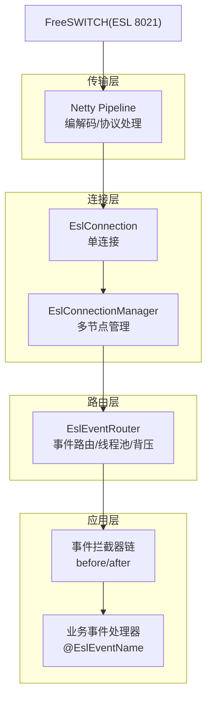
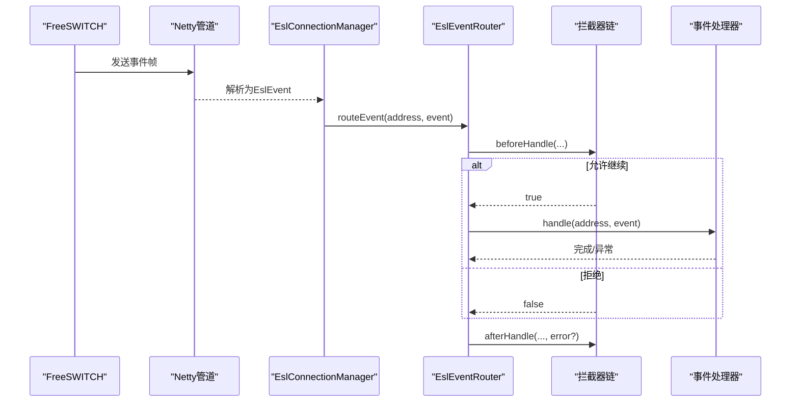
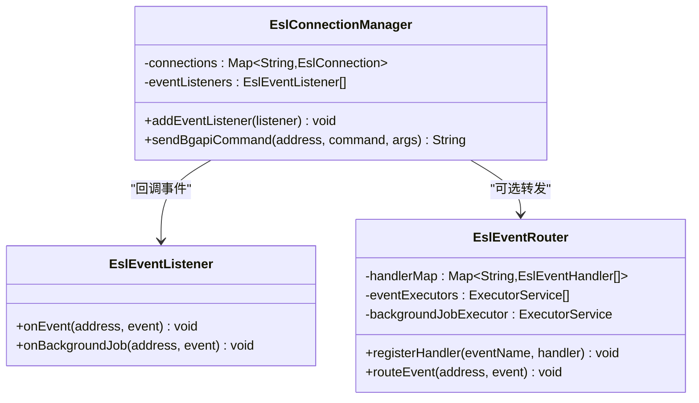
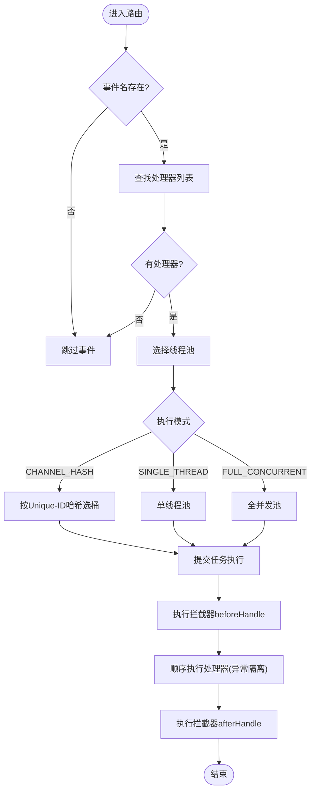
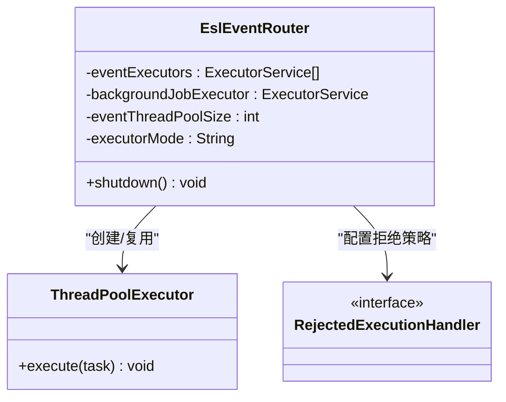
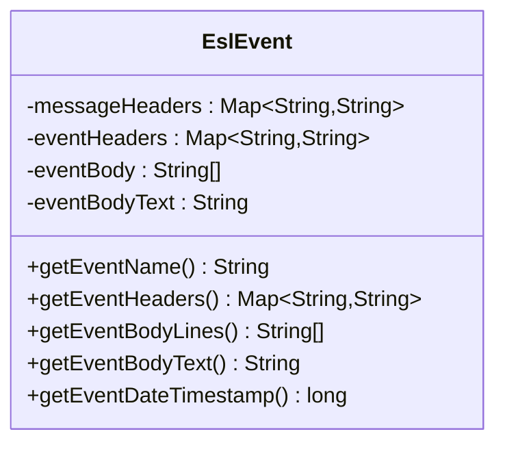
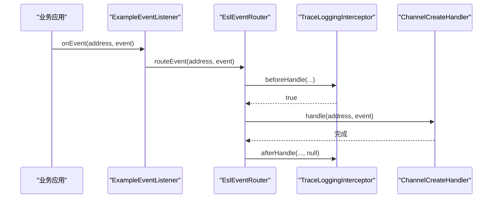
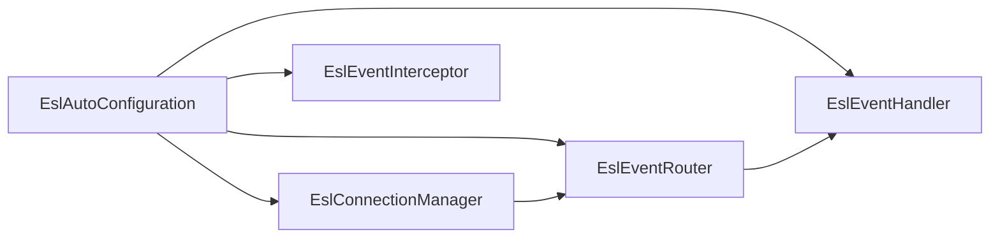

# ESL事件处理

<cite>
**本文引用的文件**
- [EslEventListener.java](file://yudao-cloud/yudao-module-cc/ipcc-fs-esl/src/main/java/cn/ipcc/fs/esl/listener/EslEventListener.java)
- [EslEventRouter.java](file://yudao-cloud/yudao-module-cc/ipcc-fs-esl/src/main/java/cn/ipcc/fs/esl/router/EslEventRouter.java)
- [EslEventHandler.java](file://yudao-cloud/yudao-module-cc/ipcc-fs-esl/src/main/java/cn/ipcc/fs/esl/router/EslEventHandler.java)
- [EslEventName.java](file://yudao-cloud/yudao-module-cc/ipcc-fs-esl/src/main/java/cn/ipcc/fs/esl/annotation/EslEventName.java)
- [EslAutoConfiguration.java](file://yudao-cloud/yudao-module-cc/ipcc-fs-esl/src/main/java/cn/ipcc/fs/esl/spring/EslAutoConfiguration.java)
- [EslConnectionManager.java](file://yudao-cloud/yudao-module-cc/ipcc-fs-esl/src/main/java/cn/ipcc/fs/esl/EslConnectionManager.java)
- [EslEventInterceptor.java](file://yudao-cloud/yudao-module-cc/ipcc-fs-esl/src/main/java/cn/ipcc/fs/esl/interceptor/EslEventInterceptor.java)
- [EslEvent.java](file://yudao-cloud/yudao-module-cc/ipcc-fs-esl/src/main/java/cn/ipcc/fs/esl/transport/EslEvent.java)
- [ChannelCreateHandler.java](file://yudao-cloud/yudao-module-cc/ipcc-fs-esl/example/example-java/src/main/java/cn/ipcc/fs/esl/example/handler/ChannelCreateHandler.java)
- [ExampleEventListener.java](file://yudao-cloud/yudao-module-cc/ipcc-fs-esl/example/example-java/src/main/java/cn/ipcc/fs/esl/example/listener/ExampleEventListener.java)
- [TraceLoggingInterceptor.java](file://yudao-cloud/yudao-module-cc/ipcc-fs-esl/example/example-java/src/main/java/cn/ipcc/fs/esl/example/interceptor/TraceLoggingInterceptor.java)
- [README.md](file://yudao-cloud/yudao-module-cc/ipcc-fs-esl/README.md)
</cite>

## 目录
1. [简介](#简介)
2. [项目结构](#项目结构)
3. [核心组件](#核心组件)
4. [架构总览](#架构总览)
5. [详细组件分析](#详细组件分析)
6. [依赖关系分析](#依赖关系分析)
7. [性能与并发特性](#性能与并发特性)
8. [故障排查指南](#故障排查指南)
9. [结论](#结论)
10. [附录：示例与最佳实践](#附录示例与最佳实践)

## 简介
本文件面向ESL（FreeSWITCH Event Socket Layer）事件处理系统，聚焦事件监听器架构、事件路由算法、异步处理模型与背压策略，并提供自定义事件监听器创建、订阅特定事件、处理事件数据的实践方法。文档同时涵盖性能优化、错误隔离与调试技巧，帮助读者在高吞吐、低延迟的呼叫中心场景中稳定使用ESL事件能力。

## 项目结构
ESL事件处理位于模块 yudao-module-cc/ipcc-fs-esl 中，采用分层设计：传输层（Netty）、连接管理层、事件路由层、分布式协调层与Spring自动配置。事件流从FS节点经Netty解码为EslEvent，由EslConnectionManager分发到监听器或路由器，最终交由按注解注册的事件处理器执行。

图表来源
- [EslEventRouter.java:14-31](file://yudao-cloud/yudao-module-cc/ipcc-fs-esl/src/main/java/cn/ipcc/fs/esl/router/EslEventRouter.java#L14-L31)
- [EslConnectionManager.java:19-28](file://yudao-cloud/yudao-module-cc/ipcc-fs-esl/src/main/java/cn/ipcc/fs/esl/EslConnectionManager.java#L19-L28)
- [README.md:50-98](file://yudao-cloud/yudao-module-cc/ipcc-fs-esl/README.md#L50-L98)

章节来源
- [README.md:50-98](file://yudao-cloud/yudao-module-cc/ipcc-fs-esl/README.md#L50-L98)

## 核心组件
- EslEventListener：事件回调接口，支持普通事件与BACKGROUND_JOB事件；实现类作为Spring Bean被自动收集并注册到连接管理器。
- EslEventRouter：事件路由器，负责事件名匹配、处理器调度、拦截器链执行、线程池选择与背压控制。
- EslEventHandler + @EslEventName：声明式事件处理器，按事件名注册，支持多处理器与顺序控制。
- EslEventInterceptor：拦截器链，提供前置/后置扩展点，用于日志、追踪、过滤、指标统计等。
- EslConnectionManager：多节点连接管理，负责节点注册、选择、批量命令与事件转发。
- EslEvent：事件数据载体，包含事件头、事件体、原始消息头等，并对值进行URL解码。

章节来源
- [EslEventListener.java:5-27](file://yudao-cloud/yudao-module-cc/ipcc-fs-esl/src/main/java/cn/ipcc/fs/esl/listener/EslEventListener.java#L5-L27)
- [EslEventRouter.java:14-31](file://yudao-cloud/yudao-module-cc/ipcc-fs-esl/src/main/java/cn/ipcc/fs/esl/router/EslEventRouter.java#L14-L31)
- [EslEventHandler.java:5-18](file://yudao-cloud/yudao-module-cc/ipcc-fs-esl/src/main/java/cn/ipcc/fs/esl/router/EslEventHandler.java#L5-L18)
- [EslEventName.java:5-15](file://yudao-cloud/yudao-module-cc/ipcc-fs-esl/src/main/java/cn/ipcc/fs/esl/annotation/EslEventName.java#L5-L15)
- [EslEventInterceptor.java:5-29](file://yudao-cloud/yudao-module-cc/ipcc-fs-esl/src/main/java/cn/ipcc/fs/esl/interceptor/EslEventInterceptor.java#L5-L29)
- [EslConnectionManager.java:19-28](file://yudao-cloud/yudao-module-cc/ipcc-fs-esl/src/main/java/cn/ipcc/fs/esl/EslConnectionManager.java#L19-L28)
- [EslEvent.java:10-16](file://yudao-cloud/yudao-module-cc/ipcc-fs-esl/src/main/java/cn/ipcc/fs/esl/transport/EslEvent.java#L10-L16)

## 架构总览
ESL事件处理遵循“传输-连接-路由-业务”的分层模式：
- 传输层：基于Netty 4.x，完成帧解析与协议处理。
- 连接层：管理单连接与多节点，提供健康检查、重连、状态回调。
- 路由层：按事件名路由到处理器，支持通道一致性哈希保证同通道事件顺序，BACKGROUND_JOB走独立线程池。
- 业务层：通过注解驱动的事件处理器与拦截器扩展，实现具体业务逻辑。

图表来源
- [EslEventRouter.java:90-153](file://yudao-cloud/yudao-module-cc/ipcc-fs-esl/src/main/java/cn/ipcc/fs/esl/router/EslEventRouter.java#L90-L153)
- [EslEventInterceptor.java:17-29](file://yudao-cloud/yudao-module-cc/ipcc-fs-esl/src/main/java/cn/ipcc/fs/esl/interceptor/EslEventInterceptor.java#L17-L29)
- [EslConnectionManager.java:207-217](file://yudao-cloud/yudao-module-cc/ipcc-fs-esl/src/main/java/cn/ipcc/fs/esl/EslConnectionManager.java#L207-L217)

## 详细组件分析

### 事件监听器架构与生命周期
- EslEventListener定义onEvent与onBackgroundJob两个回调，默认实现将BACKGROUND_JOB转发至onEvent，便于统一处理。
- Spring自动配置会扫描容器中的EslEventListener实现，并注册到EslConnectionManager，使所有节点的事件都能回调到监听器。
- 若未提供业务自定义EslEventListener，框架会注册默认的桥接监听器，将事件转发给EslEventRouter进行注解路由。

图表来源
- [EslEventListener.java:10-27](file://yudao-cloud/yudao-module-cc/ipcc-fs-esl/src/main/java/cn/ipcc/fs/esl/listener/EslEventListener.java#L10-L27)
- [EslConnectionManager.java:33-40](file://yudao-cloud/yudao-module-cc/ipcc-fs-esl/src/main/java/cn/ipcc/fs/esl/EslConnectionManager.java#L33-L40)
- [EslEventRouter.java:35-73](file://yudao-cloud/yudao-module-cc/ipcc-fs-esl/src/main/java/cn/ipcc/fs/esl/router/EslEventRouter.java#L35-L73)

章节来源
- [EslEventListener.java:5-27](file://yudao-cloud/yudao-module-cc/ipcc-fs-esl/src/main/java/cn/ipcc/fs/esl/listener/EslEventListener.java#L5-L27)
- [EslAutoConfiguration.java:100-127](file://yudao-cloud/yudao-module-cc/ipcc-fs-esl/src/main/java/cn/ipcc/fs/esl/spring/EslAutoConfiguration.java#L100-L127)
- [EslAutoConfiguration.java:236-246](file://yudao-cloud/yudao-module-cc/ipcc-fs-esl/src/main/java/cn/ipcc/fs/esl/spring/EslAutoConfiguration.java#L236-L246)

### 事件路由算法与优先级
- 事件名匹配：EslEventRouter维护事件名到处理器列表的映射，按事件名查找处理器。
- 优先级：处理器按Spring @Order排序后依次执行，确保同一事件的多处理器有序执行。
- 线程选择策略：
  - CHANNEL_HASH：按Unique-ID哈希分配到固定单线程池，保证同一通道事件顺序。
  - SINGLE_THREAD：单线程串行处理。
  - FULL_CONCURRENT：全量并发线程池。
- BACKGROUND_JOB：始终使用独立线程池，避免与普通事件互相阻塞。

图表来源
- [EslEventRouter.java:90-174](file://yudao-cloud/yudao-module-cc/ipcc-fs-esl/src/main/java/cn/ipcc/fs/esl/router/EslEventRouter.java#L90-L174)
- [EslAutoConfiguration.java:181-213](file://yudao-cloud/yudao-module-cc/ipcc-fs-esl/src/main/java/cn/ipcc/fs/esl/spring/EslAutoConfiguration.java#L181-L213)

章节来源
- [EslEventRouter.java:14-31](file://yudao-cloud/yudao-module-cc/ipcc-fs-esl/src/main/java/cn/ipcc/fs/esl/router/EslEventRouter.java#L14-L31)
- [EslEventRouter.java:155-174](file://yudao-cloud/yudao-module-cc/ipcc-fs-esl/src/main/java/cn/ipcc/fs/esl/router/EslEventRouter.java#L155-L174)
- [EslAutoConfiguration.java:188-213](file://yudao-cloud/yudao-module-cc/ipcc-fs-esl/src/main/java/cn/ipcc/fs/esl/spring/EslAutoConfiguration.java#L188-L213)

### 异步事件处理模型：队列、线程池与背压
- 线程池初始化：根据执行模式创建不同配置的线程池；CHANNEL_HASH模式下为每个哈希桶创建单线程池，保障通道内顺序。
- 队列容量：通过配置项设置队列容量，防止内存膨胀。
- 背压策略：支持CALLER_RUNS、ABORT、DISCARD三种拒绝策略，在队列满时回压或丢弃，保护系统稳定性。
- 后台作业隔离：BACKGROUND_JOB事件使用独立线程池，避免与普通事件互相阻塞。

图表来源
- [EslEventRouter.java:43-73](file://yudao-cloud/yudao-module-cc/ipcc-fs-esl/src/main/java/cn/ipcc/fs/esl/router/EslEventRouter.java#L43-L73)
- [EslEventRouter.java:176-186](file://yudao-cloud/yudao-module-cc/ipcc-fs-esl/src/main/java/cn/ipcc/fs/esl/router/EslEventRouter.java#L176-L186)

章节来源
- [EslEventRouter.java:43-73](file://yudao-cloud/yudao-module-cc/ipcc-fs-esl/src/main/java/cn/ipcc/fs/esl/router/EslEventRouter.java#L43-L73)
- [EslEventRouter.java:176-186](file://yudao-cloud/yudao-module-cc/ipcc-fs-esl/src/main/java/cn/ipcc/fs/esl/router/EslEventRouter.java#L176-L186)
- [README.md:157-178](file://yudao-cloud/yudao-module-cc/ipcc-fs-esl/README.md#L157-L178)

### 事件数据模型与解析
- EslEvent封装事件头、事件体与原始消息头，对事件头值进行URL解码，兼容plain格式解析。
- 提供事件名称、事件时间戳等便捷访问方法，便于业务快速提取关键信息。

图表来源
- [EslEvent.java:18-135](file://yudao-cloud/yudao-module-cc/ipcc-fs-esl/src/main/java/cn/ipcc/fs/esl/transport/EslEvent.java#L18-L135)

章节来源
- [EslEvent.java:10-16](file://yudao-cloud/yudao-module-cc/ipcc-fs-esl/src/main/java/cn/ipcc/fs/esl/transport/EslEvent.java#L10-L16)
- [EslEvent.java:42-92](file://yudao-cloud/yudao-module-cc/ipcc-fs-esl/src/main/java/cn/ipcc/fs/esl/transport/EslEvent.java#L42-L92)
- [EslEvent.java:102-133](file://yudao-cloud/yudao-module-cc/ipcc-fs-esl/src/main/java/cn/ipcc/fs/esl/transport/EslEvent.java#L102-L133)

### 自定义事件监听器与处理器示例
- 创建事件处理器：实现EslEventHandler，标注@EslEventName指定事件名，可用@Order控制执行顺序。
- 订阅事件：实现EslEventListener，接收所有节点事件；若自定义该监听器，则需自行将事件转发到EslEventRouter。
- 拦截器扩展：实现EslEventInterceptor，实现beforeHandle/afterHandle，用于链路追踪、日志、过滤等。

图表来源
- [ExampleEventListener.java:25-33](file://yudao-cloud/yudao-module-cc/ipcc-fs-esl/example/example-java/src/main/java/cn/ipcc/fs/esl/example/listener/ExampleEventListener.java#L25-L33)
- [TraceLoggingInterceptor.java:26-52](file://yudao-cloud/yudao-module-cc/ipcc-fs-esl/example/example-java/src/main/java/cn/ipcc/fs/esl/example/interceptor/TraceLoggingInterceptor.java#L26-L52)
- [ChannelCreateHandler.java:23-32](file://yudao-cloud/yudao-module-cc/ipcc-fs-esl/example/example-java/src/main/java/cn/ipcc/fs/esl/example/handler/ChannelCreateHandler.java#L23-L32)

章节来源
- [ChannelCreateHandler.java:13-32](file://yudao-cloud/yudao-module-cc/ipcc-fs-esl/example/example-java/src/main/java/cn/ipcc/fs/esl/example/handler/ChannelCreateHandler.java#L13-L32)
- [ExampleEventListener.java:10-33](file://yudao-cloud/yudao-module-cc/ipcc-fs-esl/example/example-java/src/main/java/cn/ipcc/fs/esl/example/listener/ExampleEventListener.java#L10-L33)
- [TraceLoggingInterceptor.java:11-52](file://yudao-cloud/yudao-module-cc/ipcc-fs-esl/example/example-java/src/main/java/cn/ipcc/fs/esl/example/interceptor/TraceLoggingInterceptor.java#L11-L52)

## 依赖关系分析
- EslAutoConfiguration负责装配EslConnectionManager、EslEventRouter、拦截器与默认监听器桥接，并将Spring容器中的处理器与拦截器按@Order排序后注册。
- EslConnectionManager持有多个EslConnection实例，负责事件转发与命令发送。
- EslEventRouter依赖EslClientConfig提供的执行模式、线程池大小、队列容量与拒绝策略。

图表来源
- [EslAutoConfiguration.java:100-127](file://yudao-cloud/yudao-module-cc/ipcc-fs-esl/src/main/java/cn/ipcc/fs/esl/spring/EslAutoConfiguration.java#L100-L127)
- [EslAutoConfiguration.java:181-213](file://yudao-cloud/yudao-module-cc/ipcc-fs-esl/src/main/java/cn/ipcc/fs/esl/spring/EslAutoConfiguration.java#L181-L213)
- [EslConnectionManager.java:207-217](file://yudao-cloud/yudao-module-cc/ipcc-fs-esl/src/main/java/cn/ipcc/fs/esl/EslConnectionManager.java#L207-L217)

章节来源
- [EslAutoConfiguration.java:100-127](file://yudao-cloud/yudao-module-cc/ipcc-fs-esl/src/main/java/cn/ipcc/fs/esl/spring/EslAutoConfiguration.java#L100-L127)
- [EslAutoConfiguration.java:181-213](file://yudao-cloud/yudao-module-cc/ipcc-fs-esl/src/main/java/cn/ipcc/fs/esl/spring/EslAutoConfiguration.java#L181-L213)

## 性能与并发特性
- 通道一致性哈希：按Unique-ID哈希分配固定线程，保证同一通道事件顺序，降低乱序风险。
- 后台作业隔离：BACKGROUND_JOB使用独立线程池，避免阻塞普通事件处理。
- 背压保护：队列容量与拒绝策略可配置，防止高并发下OOM或CPU抖动。
- 拦截器链在同一线程执行：确保ThreadLocal上下文透传，减少跨线程开销。
- 建议：
  - CHANNEL_HASH模式适合大多数场景，兼顾顺序与吞吐。
  - 合理设置event-thread-pool-size与event-queue-capacity，结合监控观察队列堆积与拒绝率。
  - 使用拦截器记录耗时与traceId，定位慢事件与异常路径。

[本节为通用指导，不直接分析具体文件]

## 故障排查指南
- 事件名缺失：路由前校验事件名，缺失则跳过并记录警告日志。
- 处理器异常隔离：单个处理器异常不影响其他处理器执行，记录异常堆栈便于定位。
- 拦截器异常：afterHandle捕获异常并记录，避免资源泄漏（如ThreadLocal清理）。
- 连接问题：EslConnectionManager在节点不可用时跳过发送，记录警告；可通过健康检查与重连机制恢复。
- 调试技巧：
  - 启用TraceLoggingInterceptor，输出traceId与耗时，关联上下游日志。
  - 调整event-rejected-policy为CALLER_RUNS以观察背压影响，或ABORT/DISCARD快速失败。
  - 关注EslEventRouter的总路由计数，评估吞吐与瓶颈。

章节来源
- [EslEventRouter.java:106-153](file://yudao-cloud/yudao-module-cc/ipcc-fs-esl/src/main/java/cn/ipcc/fs/esl/router/EslEventRouter.java#L106-L153)
- [EslConnectionManager.java:167-195](file://yudao-cloud/yudao-module-cc/ipcc-fs-esl/src/main/java/cn/ipcc/fs/esl/EslConnectionManager.java#L167-L195)
- [TraceLoggingInterceptor.java:26-52](file://yudao-cloud/yudao-module-cc/ipcc-fs-esl/example/example-java/src/main/java/cn/ipcc/fs/esl/example/interceptor/TraceLoggingInterceptor.java#L26-L52)

## 结论
ESL事件处理系统通过清晰的层次划分与注解驱动的路由机制，实现了高可靠、可扩展的事件处理能力。EslEventRouter提供灵活的执行策略与背压控制，EslEventListener与EslEventInterceptor提供强大的扩展点。结合合理的线程池与队列配置，可在高并发呼叫中心场景中稳定运行。

[本节为总结性内容，不直接分析具体文件]

## 附录：示例与最佳实践
- 创建自定义事件处理器：实现EslEventHandler并标注@EslEventName，使用@Order控制执行顺序。
- 订阅事件：实现EslEventListener，若自定义该监听器，需手动将事件转发到EslEventRouter。
- 处理事件数据：通过EslEvent获取事件头与事件体，提取关键信息（如Unique-ID、CallerID、DestinationNumber等）。
- 拦截器实践：实现EslEventInterceptor，记录traceId与耗时，必要时在beforeHandle中过滤无关事件。
- 配置建议：
  - 使用CHANNEL_HASH模式，event-thread-pool-size按Unique-ID分布估算。
  - 设置合理的event-queue-capacity与event-rejected-policy，结合监控观察队列与拒绝情况。
  - 启用分布式协调时，确保Redis可用，避免重复处理。

章节来源
- [ChannelCreateHandler.java:13-32](file://yudao-cloud/yudao-module-cc/ipcc-fs-esl/example/example-java/src/main/java/cn/ipcc/fs/esl/example/handler/ChannelCreateHandler.java#L13-L32)
- [ExampleEventListener.java:10-33](file://yudao-cloud/yudao-module-cc/ipcc-fs-esl/example/example-java/src/main/java/cn/ipcc/fs/esl/example/listener/ExampleEventListener.java#L10-L33)
- [TraceLoggingInterceptor.java:11-52](file://yudao-cloud/yudao-module-cc/ipcc-fs-esl/example/example-java/src/main/java/cn/ipcc/fs/esl/example/interceptor/TraceLoggingInterceptor.java#L11-L52)
- [README.md:157-178](file://yudao-cloud/yudao-module-cc/ipcc-fs-esl/README.md#L157-L178)