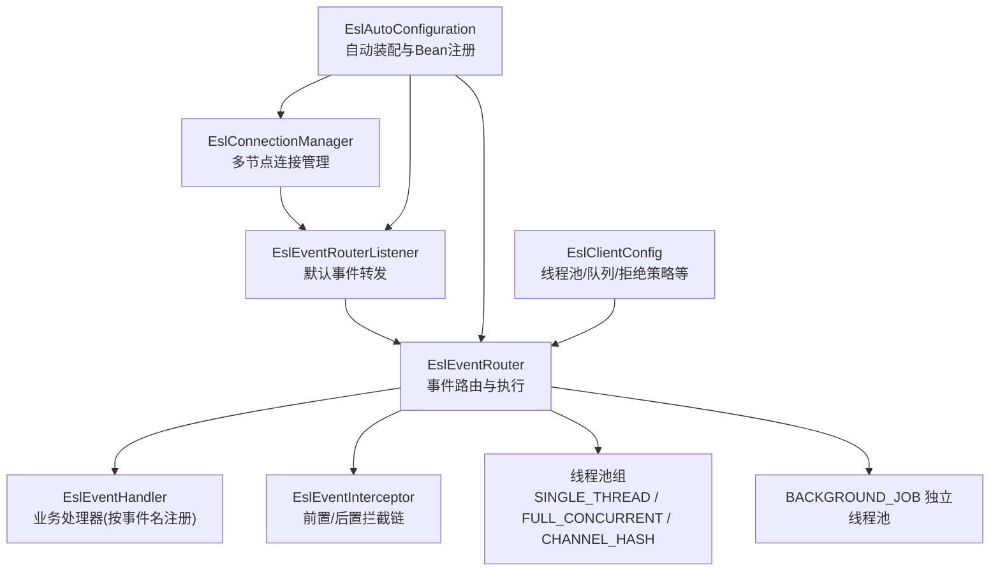
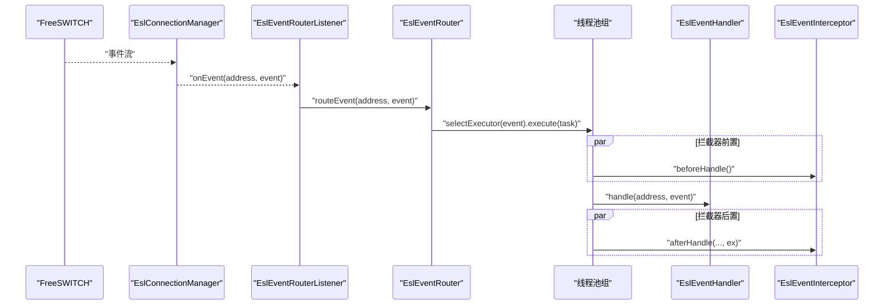
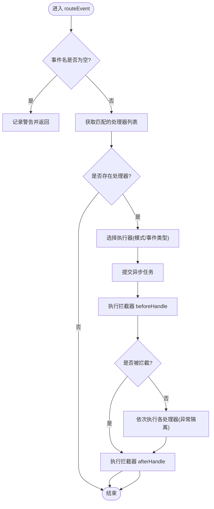
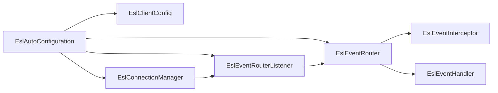

# 事件分发器

<cite>
**本文引用的文件**
- [EslEventRouter.java](file://yudao-cloud/yudao-module-cc/ipcc-fs-esl/src/main/java/cn/ipcc/fs/esl/router/EslEventRouter.java)
- [EslAutoConfiguration.java](file://yudao-cloud/yudao-module-cc/ipcc-fs-esl/src/main/java/cn/ipcc/fs/esl/spring/EslAutoConfiguration.java)
- [EslEventRouterListener.java](file://yudao-cloud/yudao-module-cc/ipcc-fs-esl/src/main/java/cn/ipcc/fs/esl/spring/EslEventRouterListener.java)
- [EslClientConfig.java](file://yudao-cloud/yudao-module-cc/ipcc-fs-esl/src/main/java/cn/ipcc/fs/esl/EslClientConfig.java)
- [EslConnectionManager.java](file://yudao-cloud/yudao-module-cc/ipcc-fs-esl/src/main/java/cn/ipcc/fs/esl/EslConnectionManager.java)
- [EslEvent.java](file://yudao-cloud/yudao-module-cc/ipcc-fs-esl/src/main/java/cn/ipcc/fs/esl/transport/EslEvent.java)
- [EslEventHandler.java](file://yudao-cloud/yudao-module-cc/ipcc-fs-esl/src/main/java/cn/ipcc/fs/esl/router/EslEventHandler.java)
- [EslEventInterceptor.java](file://yudao-cloud/yudao-module-cc/ipcc-fs-esl/src/main/java/cn/ipcc/fs/esl/interceptor/EslEventInterceptor.java)
- [EslEventName.java](file://yudao-cloud/yudao-module-cc/ipcc-fs-esl/src/main/java/cn/ipcc/fs/esl/annotation/EslEventName.java)
</cite>

## 目录
1. [简介](#简介)
2. [项目结构](#项目结构)
3. [核心组件](#核心组件)
4. [架构总览](#架构总览)
5. [详细组件分析](#详细组件分析)
6. [依赖关系分析](#依赖关系分析)
7. [性能考量](#性能考量)
8. [故障排查指南](#故障排查指南)
9. [结论](#结论)
10. [附录](#附录)

## 简介
本文件面向 ESL（FreeSWITCH Event Socket Library）事件分发器的设计与实现，聚焦 EslEventDispatcher（在本仓库中由 EslEventRouter 承担核心职责）的事件接收、解析、验证与分发流程；详细说明异步事件处理模型（队列管理、线程池配置、背压策略）；文档化同步/异步/批量分发策略的使用场景；并提供配置、监控与异常处理的实践建议。同时给出事件去重、重试机制与死信队列的落地方案，帮助在高吞吐、低延迟的呼叫中心场景中稳定运行。

## 项目结构
ESL 事件分发相关代码集中在 ipcc-fs-esl 模块：
- 路由与处理器：router 包下的 EslEventRouter、EslEventHandler
- 拦截器：interceptor 包下的 EslEventInterceptor
- 装配与默认监听器：spring 包下的 EslAutoConfiguration、EslEventRouterListener
- 配置：EslClientConfig
- 连接与事件对象：EslConnectionManager、transport.EslEvent
- 注解：annotation.EslEventName

图表来源
- [EslConnectionManager.java:31-254](file://yudao-cloud/yudao-module-cc/ipcc-fs-esl/src/main/java/cn/ipcc/fs/esl/EslConnectionManager.java#L31-L254)
- [EslEventRouterListener.java:17-48](file://yudao-cloud/yudao-module-cc/ipcc-fs-esl/src/main/java/cn/ipcc/fs/esl/spring/EslEventRouterListener.java#L17-L48)
- [EslEventRouter.java:33-201](file://yudao-cloud/yudao-module-cc/ipcc-fs-esl/src/main/java/cn/ipcc/fs/esl/router/EslEventRouter.java#L33-L201)
- [EslAutoConfiguration.java:50-248](file://yudao-cloud/yudao-module-cc/ipcc-fs-esl/src/main/java/cn/ipcc/fs/esl/spring/EslAutoConfiguration.java#L50-L248)
- [EslClientConfig.java:10-61](file://yudao-cloud/yudao-module-cc/ipcc-fs-esl/src/main/java/cn/ipcc/fs/esl/EslClientConfig.java#L10-L61)

章节来源
- [EslConnectionManager.java:31-254](file://yudao-cloud/yudao-module-cc/ipcc-fs-esl/src/main/java/cn/ipcc/fs/esl/EslConnectionManager.java#L31-L254)
- [EslEventRouter.java:33-201](file://yudao-cloud/yudao-module-cc/ipcc-fs-esl/src/main/java/cn/ipcc/fs/esl/router/EslEventRouter.java#L33-L201)
- [EslAutoConfiguration.java:50-248](file://yudao-cloud/yudao-module-cc/ipcc-fs-esl/src/main/java/cn/ipcc/fs/esl/spring/EslAutoConfiguration.java#L50-L248)
- [EslClientConfig.java:10-61](file://yudao-cloud/yudao-module-cc/ipcc-fs-esl/src/main/java/cn/ipcc/fs/esl/EslClientConfig.java#L10-L61)

## 核心组件
- EslEventRouter：事件路由与执行引擎，负责事件名到处理器映射、拦截器链、线程池选择与任务提交、异常隔离与统计。
- EslEventRouterListener：默认事件监听器，将连接层收到的事件转发给路由器。
- EslAutoConfiguration：Spring 自动装配，创建并注册路由器、监听器、拦截器、指标组件，并将配置注入。
- EslClientConfig：纯 POJO 配置，定义事件执行模式、线程池大小、队列容量与拒绝策略等。
- EslConnectionManager：多节点连接管理，负责节点注册/移除、命令发送、状态聚合与批量操作。
- EslEvent：事件数据模型，封装事件头、事件体、时间戳等。
- EslEventHandler / EslEventInterceptor / EslEventName：处理器接口、拦截器接口与事件名注解。

章节来源
- [EslEventRouter.java:33-201](file://yudao-cloud/yudao-module-cc/ipcc-fs-esl/src/main/java/cn/ipcc/fs/esl/router/EslEventRouter.java#L33-L201)
- [EslEventRouterListener.java:17-48](file://yudao-cloud/yudao-module-cc/ipcc-fs-esl/src/main/java/cn/ipcc/fs/esl/spring/EslEventRouterListener.java#L17-L48)
- [EslAutoConfiguration.java:50-248](file://yudao-cloud/yudao-module-cc/ipcc-fs-esl/src/main/java/cn/ipcc/fs/esl/spring/EslAutoConfiguration.java#L50-L248)
- [EslClientConfig.java:10-61](file://yudao-cloud/yudao-module-cc/ipcc-fs-esl/src/main/java/cn/ipcc/fs/esl/EslClientConfig.java#L10-L61)
- [EslConnectionManager.java:31-254](file://yudao-cloud/yudao-module-cc/ipcc-fs-esl/src/main/java/cn/ipcc/fs/esl/EslConnectionManager.java#L31-L254)
- [EslEvent.java:18-135](file://yudao-cloud/yudao-module-cc/ipcc-fs-esl/src/main/java/cn/ipcc/fs/esl/transport/EslEvent.java#L18-L135)
- [EslEventHandler.java:11-19](file://yudao-cloud/yudao-module-cc/ipcc-fs-esl/src/main/java/cn/ipcc/fs/esl/router/EslEventHandler.java#L11-L19)
- [EslEventInterceptor.java:15-31](file://yudao-cloud/yudao-module-cc/ipcc-fs-esl/src/main/java/cn/ipcc/fs/esl/interceptor/EslEventInterceptor.java#L15-L31)
- [EslEventName.java:10-16](file://yudao-cloud/yudao-module-cc/ipcc-fs-esl/src/main/java/cn/ipcc/fs/esl/annotation/EslEventName.java#L10-L16)

## 架构总览
事件从 FreeSWITCH 经 ESL 到达连接层，由 EslConnectionManager 统一接入，再通过默认监听器 EslEventRouterListener 转发至 EslEventRouter。路由器根据事件名匹配处理器，通过拦截器链进行前置/后置处理，并按执行策略选择线程池异步执行。BACKGROUND_JOB 事件走独立线程池，避免与普通事件互相阻塞。

图表来源
- [EslConnectionManager.java:31-254](file://yudao-cloud/yudao-module-cc/ipcc-fs-esl/src/main/java/cn/ipcc/fs/esl/EslConnectionManager.java#L31-L254)
- [EslEventRouterListener.java:17-48](file://yudao-cloud/yudao-module-cc/ipcc-fs-esl/src/main/java/cn/ipcc/fs/esl/spring/EslEventRouterListener.java#L17-L48)
- [EslEventRouter.java:90-153](file://yudao-cloud/yudao-module-cc/ipcc-fs-esl/src/main/java/cn/ipcc/fs/esl/router/EslEventRouter.java#L90-L153)
- [EslEventInterceptor.java:15-31](file://yudao-cloud/yudao-module-cc/ipcc-fs-esl/src/main/java/cn/ipcc/fs/esl/interceptor/EslEventInterceptor.java#L15-L31)
- [EslEventHandler.java:11-19](file://yudao-cloud/yudao-module-cc/ipcc-fs-esl/src/main/java/cn/ipcc/fs/esl/router/EslEventHandler.java#L11-L19)

## 详细组件分析

### EslEventRouter：事件路由与执行引擎
- 职责
  - 维护事件名到处理器列表的映射，支持同一事件多个处理器按 @Order 顺序执行。
  - 拦截器链：beforeHandle 返回 false 则跳过处理器，finally 保证 afterHandle 执行。
  - 线程模型：支持 SINGLE_THREAD、FULL_CONCURRENT、CHANNEL_HASH 三种模式；BACKGROUND_JOB 使用独立线程池。
  - 背压：基于 ArrayBlockingQueue + RejectedExecutionHandler（CALLER_RUNS/DISCARD/ABORT）。
  - 统计：累计路由次数，便于监控。
- 关键流程
  - routeEvent：校验事件名→选择执行器→提交任务→拦截器 before→处理器 handle→拦截器 after（异常隔离）。
  - selectExecutor：按事件名或模式选择线程池；CHANNEL_HASH 按 Unique-ID 哈希固定单线程，保障通道内事件顺序。
  - shutdown：关闭所有线程池并输出统计。

图表来源
- [EslEventRouter.java:90-153](file://yudao-cloud/yudao-module-cc/ipcc-fs-esl/src/main/java/cn/ipcc/fs/esl/router/EslEventRouter.java#L90-L153)
- [EslEventRouter.java:155-186](file://yudao-cloud/yudao-module-cc/ipcc-fs-esl/src/main/java/cn/ipcc/fs/esl/router/EslEventRouter.java#L155-L186)

章节来源
- [EslEventRouter.java:33-201](file://yudao-cloud/yudao-module-cc/ipcc-fs-esl/src/main/java/cn/ipcc/fs/esl/router/EslEventRouter.java#L33-L201)

### EslAutoConfiguration：自动装配与默认行为
- 功能
  - 将配置属性转换为 EslClientConfig。
  - 创建 EslConnectionManager 并自动注册事件/连接监听器与静态节点。
  - 条件创建分布式协调器（Redis 存在且开启时），并在容器就绪后启动竞争任务。
  - 创建 EslEventRouter，自动收集 @EslEventName 标注的处理器与拦截器并注册。
  - 提供默认 EslMetrics 与拦截器；若无自定义 EslEventListener，则注册 EslEventRouterListener 作为默认转发。
- 关键点
  - initMethod/destroyMethod 控制生命周期。
  - ApplicationReadyEvent 启动协调器，避免与 Bean 初始化并发冲突。

章节来源
- [EslAutoConfiguration.java:50-248](file://yudao-cloud/yudao-module-cc/ipcc-fs-esl/src/main/java/cn/ipcc/fs/esl/spring/EslAutoConfiguration.java#L50-L248)

### EslEventRouterListener：默认事件转发
- 作用
  - 将连接层收到的普通事件与 BACKGROUND_JOB 事件统一转发到 EslEventRouter。
  - 在容器中无自定义 EslEventListener 时生效，避免重复路由。

章节来源
- [EslEventRouterListener.java:17-48](file://yudao-cloud/yudao-module-cc/ipcc-fs-esl/src/main/java/cn/ipcc/fs/esl/spring/EslEventRouterListener.java#L17-L48)

### EslClientConfig：事件线程池与背压配置
- 关键项
  - eventExecutorMode：SINGLE_THREAD / FULL_CONCURRENT / CHANNEL_HASH
  - eventThreadPoolSize：线程池大小（通道哈希模式下为单线程池数量）
  - eventQueueCapacity：队列容量
  - eventRejectedPolicy：拒绝策略（CALLER_RUNS / DISCARD / ABORT）
- 影响
  - 决定事件处理吞吐、延迟与背压行为；结合业务场景调优。

章节来源
- [EslClientConfig.java:10-61](file://yudao-cloud/yudao-module-cc/ipcc-fs-esl/src/main/java/cn/ipcc/fs/esl/EslClientConfig.java#L10-L61)

### EslConnectionManager：多节点接入与命令下发
- 职责
  - 管理多个 ESL 节点连接，提供随机选择、批量 bgapi 发送、同步命令发送、消息发送等能力。
  - 对节点进行注册/移除、状态聚合与优雅关闭。
- 与事件分发关系
  - 作为事件入口的承载者，将事件交给监听器并最终路由到 EslEventRouter。

章节来源
- [EslConnectionManager.java:31-254](file://yudao-cloud/yudao-module-cc/ipcc-fs-esl/src/main/java/cn/ipcc/fs/esl/EslConnectionManager.java#L31-L254)

### EslEvent：事件数据模型
- 内容
  - 事件名、事件头、事件体行与文本、原始消息头、事件时间戳（微秒）。
- 解析
  - 支持 plain 格式解析，Content-Length 前为事件头，之后为事件体；值做 URL 解码，异常降级。

章节来源
- [EslEvent.java:18-135](file://yudao-cloud/yudao-module-cc/ipcc-fs-esl/src/main/java/cn/ipcc/fs/esl/transport/EslEvent.java#L18-L135)

### 处理器与拦截器
- EslEventHandler：定义 handle(address, event)，用于业务逻辑。
- EslEventInterceptor：beforeHandle/afterHandle 扩展点，用于日志、追踪、过滤、指标等。
- EslEventName：标注处理器对应的事件名，由自动装配扫描注册。

章节来源
- [EslEventHandler.java:11-19](file://yudao-cloud/yudao-module-cc/ipcc-fs-esl/src/main/java/cn/ipcc/fs/esl/router/EslEventHandler.java#L11-L19)
- [EslEventInterceptor.java:15-31](file://yudao-cloud/yudao-module-cc/ipcc-fs-esl/src/main/java/cn/ipcc/fs/esl/interceptor/EslEventInterceptor.java#L15-L31)
- [EslEventName.java:10-16](file://yudao-cloud/yudao-module-cc/ipcc-fs-esl/src/main/java/cn/ipcc/fs/esl/annotation/EslEventName.java#L10-L16)

## 依赖关系分析
- 装配依赖：EslAutoConfiguration 依赖 EslClientConfig、EslConnectionManager、EslEventRouter、EslEventRouterListener、EslEventInterceptor、EslEventHandler、EslEventName。
- 运行时依赖：EslEventRouter 依赖线程池与队列；EslEventRouterListener 依赖 EslEventRouter；EslConnectionManager 依赖 EslConnection（外部）与监听器集合。
- 潜在循环：当前设计分层清晰，未见直接循环依赖。

图表来源
- [EslAutoConfiguration.java:50-248](file://yudao-cloud/yudao-module-cc/ipcc-fs-esl/src/main/java/cn/ipcc/fs/esl/spring/EslAutoConfiguration.java#L50-L248)
- [EslEventRouter.java:33-201](file://yudao-cloud/yudao-module-cc/ipcc-fs-esl/src/main/java/cn/ipcc/fs/esl/router/EslEventRouter.java#L33-L201)
- [EslEventRouterListener.java:17-48](file://yudao-cloud/yudao-module-cc/ipcc-fs-esl/src/main/java/cn/ipcc/fs/esl/spring/EslEventRouterListener.java#L17-L48)
- [EslConnectionManager.java:31-254](file://yudao-cloud/yudao-module-cc/ipcc-fs-esl/src/main/java/cn/ipcc/fs/esl/EslConnectionManager.java#L31-L254)

章节来源
- [EslAutoConfiguration.java:50-248](file://yudao-cloud/yudao-module-cc/ipcc-fs-esl/src/main/java/cn/ipcc/fs/esl/spring/EslAutoConfiguration.java#L50-L248)
- [EslEventRouter.java:33-201](file://yudao-cloud/yudao-module-cc/ipcc-fs-esl/src/main/java/cn/ipcc/fs/esl/router/EslEventRouter.java#L33-L201)

## 性能考量
- 线程池与队列
  - 推荐 CHANNEL_HASH 模式以保障同通道事件顺序；FULL_CONCURRENT 适合无关联事件的高吞吐场景；SINGLE_THREAD 仅适用于极低并发。
  - 合理设置 eventThreadPoolSize 与 eventQueueCapacity，避免队列溢出导致拒绝。
- 背压策略
  - CALLER_RUNS：回压调用方，降低入队速率，适合读多写少或上游可控场景。
  - DISCARD：丢弃过载事件，适合可容忍丢事件的统计类场景。
  - ABORT：抛出异常，便于快速发现瓶颈。
- 独立线程池
  - BACKGROUND_JOB 使用独立线程池，避免长耗时任务阻塞普通事件。
- 健康检查与重连
  - 通过健康检查间隔与失败阈值触发重连，提升可用性。
- 监控
  - 利用 EslMetrics 与拦截器统计事件计数与延迟，结合系统指标观察吞吐与时延。

[本节为通用性能指导，不直接分析具体文件]

## 故障排查指南
- 事件未路由
  - 检查事件名是否为空；确认处理器已用 @EslEventName 标注并被自动装配扫描。
  - 若自定义了 EslEventListener，需确保在 listener 中调用 router.routeEvent。
- 处理器异常
  - 每个处理器异常隔离，不影响其他处理器；查看拦截器 afterHandle 中的异常信息。
- 队列满/拒绝
  - 调整 eventQueueCapacity 或更换拒绝策略；观察拒绝率与 CPU/内存占用。
- 通道事件乱序
  - 使用 CHANNEL_HASH 模式，确保同一 Unique-ID 的事件在同一单线程池中顺序执行。
- 后台任务阻塞
  - 确认 BACKGROUND_JOB 事件未误入普通事件线程池；必要时拆分任务或限流。
- 节点不可用
  - 检查 EslConnectionManager 的可用节点列表与连接状态；必要时重启或重新注册节点。

章节来源
- [EslEventRouter.java:90-153](file://yudao-cloud/yudao-module-cc/ipcc-fs-esl/src/main/java/cn/ipcc/fs/esl/router/EslEventRouter.java#L90-L153)
- [EslEventRouter.java:155-186](file://yudao-cloud/yudao-module-cc/ipcc-fs-esl/src/main/java/cn/ipcc/fs/esl/router/EslEventRouter.java#L155-L186)
- [EslAutoConfiguration.java:171-214](file://yudao-cloud/yudao-module-cc/ipcc-fs-esl/src/main/java/cn/ipcc/fs/esl/spring/EslAutoConfiguration.java#L171-L214)
- [EslConnectionManager.java:121-175](file://yudao-cloud/yudao-module-cc/ipcc-fs-esl/src/main/java/cn/ipcc/fs/esl/EslConnectionManager.java#L121-L175)

## 结论
EslEventRouter 提供了高内聚、可扩展的事件分发能力：通过拦截器链、多种执行模式与独立后台任务线程池，兼顾顺序性、吞吐与稳定性；配合 EslAutoConfiguration 的自动装配与默认监听器，开箱即用；通过 EslClientConfig 可灵活调优线程池与背压策略。建议在呼叫中心等高并发场景优先采用 CHANNEL_HASH 模式，并结合监控与告警持续优化。

[本节为总结性内容，不直接分析具体文件]

## 附录

### 配置示例与最佳实践
- 基本配置
  - 设置事件执行模式、线程池大小、队列容量与拒绝策略。
  - 启用分布式监听权竞争（可选）。
- 处理器注册
  - 在处理器类上标注 @EslEventName，交由自动装配注册。
- 拦截器
  - 实现 EslEventInterceptor，完成日志、追踪、过滤与指标统计。
- 默认监听器
  - 若未自定义 EslEventListener，系统将自动注册 EslEventRouterListener 完成转发。

章节来源
- [EslClientConfig.java:10-61](file://yudao-cloud/yudao-module-cc/ipcc-fs-esl/src/main/java/cn/ipcc/fs/esl/EslClientConfig.java#L10-L61)
- [EslAutoConfiguration.java:171-214](file://yudao-cloud/yudao-module-cc/ipcc-fs-esl/src/main/java/cn/ipcc/fs/esl/spring/EslAutoConfiguration.java#L171-L214)
- [EslEventRouterListener.java:17-48](file://yudao-cloud/yudao-module-cc/ipcc-fs-esl/src/main/java/cn/ipcc/fs/esl/spring/EslEventRouterListener.java#L17-L48)

### 事件分发策略与使用场景
- 同步分发
  - 适用于需要立即得到结果的短小命令（如 sendmsg、sync 命令），通过 EslConnectionManager 的同步方法调用。
- 异步分发
  - 大多数事件处理应走 EslEventRouter 的异步线程池，避免阻塞网络 IO。
- 批量分发
  - 向所有节点发送 bgapi 命令，使用 EslConnectionManager.sendBgapiToAll，返回地址到 Job-UUID 的映射。

章节来源
- [EslConnectionManager.java:141-195](file://yudao-cloud/yudao-module-cc/ipcc-fs-esl/src/main/java/cn/ipcc/fs/esl/EslConnectionManager.java#L141-L195)

### 监控与性能观测
- 指标采集
  - 使用 EslMetrics 与 EslMetricsInterceptor 统计事件计数与延迟。
- 关键指标
  - 路由总数、拒绝数、队列长度、线程池活跃数、处理器耗时分布。
- 定位手段
  - 结合拦截器日志与 ThreadLocal 链路追踪，定位慢路径与异常。

章节来源
- [EslAutoConfiguration.java:216-234](file://yudao-cloud/yudao-module-cc/ipcc-fs-esl/src/main/java/cn/ipcc/fs/esl/spring/EslAutoConfiguration.java#L216-L234)

### 事件去重、重试与死信队列（设计方案）
- 事件去重
  - 基于事件唯一键（如 Unique-ID + 事件名 + 时间窗口）在 Redis 中记录最近 N 分钟内的已处理事件，路由前查询去重。
  - 可在拦截器 beforeHandle 中实现，命中则直接返回 false 跳过处理器。
- 重试机制
  - 对可重试的处理器异常，记录重试次数与下次重试时间，使用定时任务或消息队列进行延迟重试。
  - 结合 EslEventInterceptor.afterHandle 捕获异常并写入重试队列。
- 死信队列
  - 超过最大重试次数或最终失败的记录，转入死信主题/表，供后续人工处理与审计。
  - 可通过独立的消费者或批处理任务消费死信，生成告警与报表。

[本节为概念性方案说明，不直接分析具体文件]