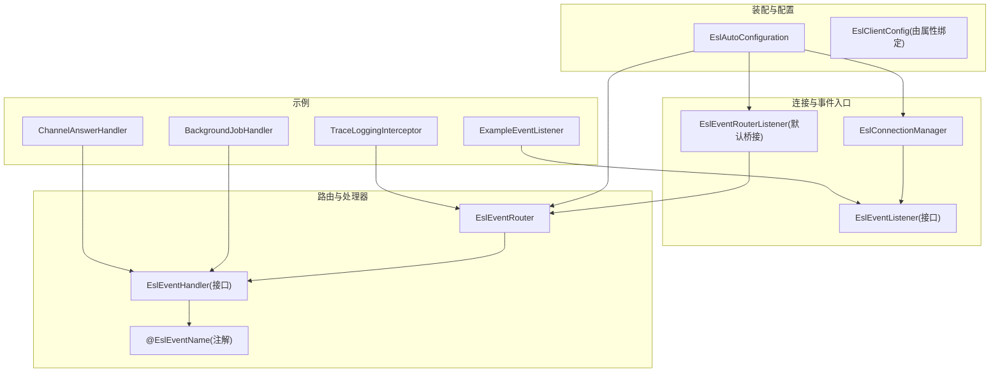
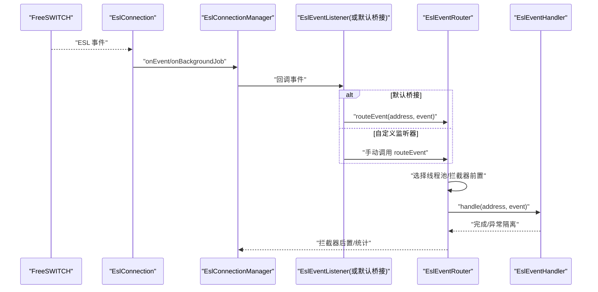
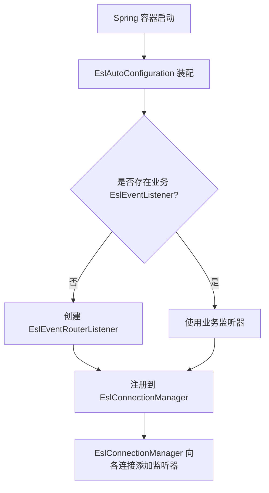
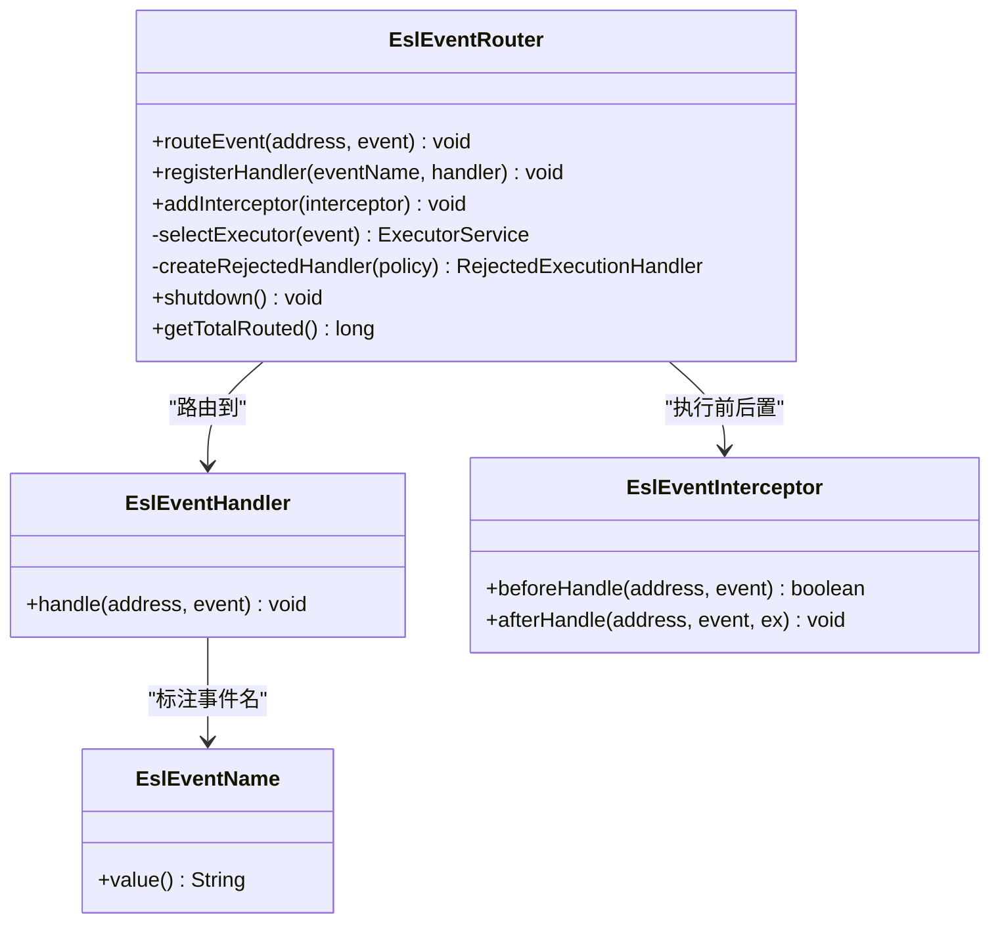
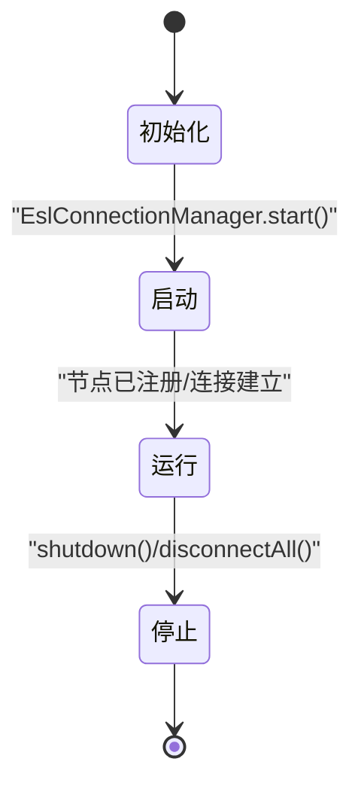
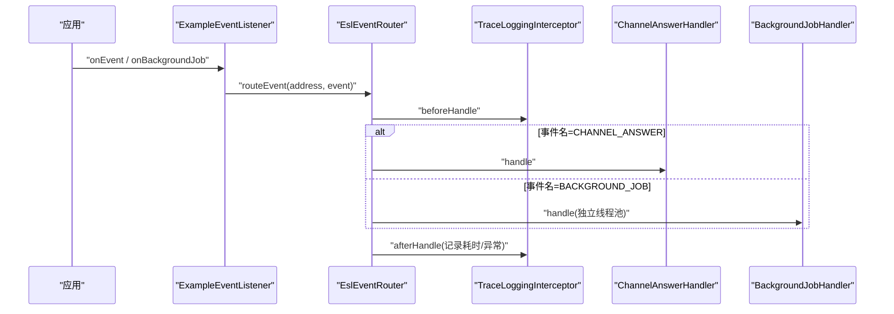
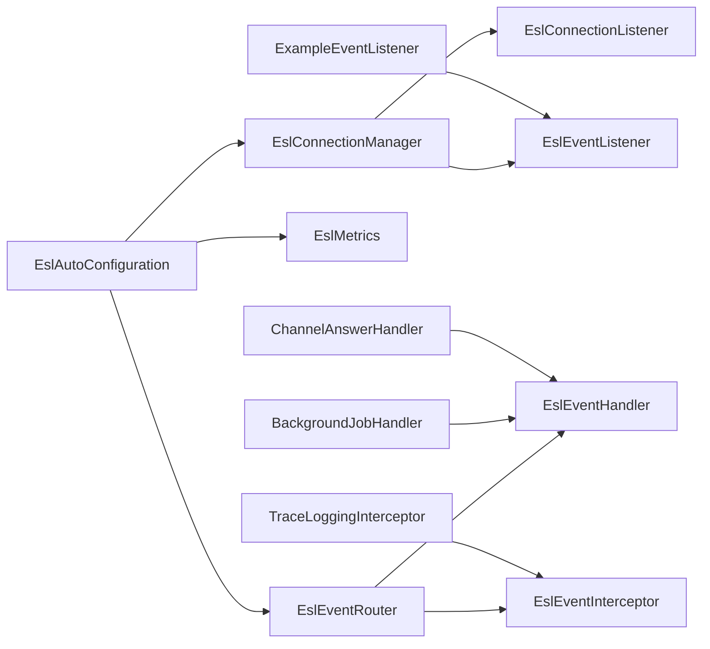

# 事件监听器架构

<cite>
**本文引用的文件**
- [EslEventListener.java](file://yudao-cloud/yudao-module-cc/ipcc-fs-esl/src/main/java/cn/ipcc/fs/esl/listener/EslEventListener.java)
- [EslConnectionManager.java](file://yudao-cloud/yudao-module-cc/ipcc-fs-esl/src/main/java/cn/ipcc/fs/esl/EslConnectionManager.java)
- [EslAutoConfiguration.java](file://yudao-cloud/yudao-module-cc/ipcc-fs-esl/src/main/java/cn/ipcc/fs/esl/spring/EslAutoConfiguration.java)
- [EslEventRouterListener.java](file://yudao-cloud/yudao-module-cc/ipcc-fs-esl/src/main/java/cn/ipcc/fs/esl/spring/EslEventRouterListener.java)
- [EslEventRouter.java](file://yudao-cloud/yudao-module-cc/ipcc-fs-esl/src/main/java/cn/ipcc/fs/esl/router/EslEventRouter.java)
- [EslEventHandler.java](file://yudao-cloud/yudao-module-cc/ipcc-fs-esl/src/main/java/cn/ipcc/fs/esl/router/EslEventHandler.java)
- [EslEventName.java](file://yudao-cloud/yudao-module-cc/ipcc-fs-esl/src/main/java/cn/ipcc/fs/esl/annotation/EslEventName.java)
- [ExampleEventListener.java](file://yudao-cloud/yudao-module-cc/ipcc-fs-esl/example/example-java/src/main/java/cn/ipcc/fs/esl/example/listener/ExampleEventListener.java)
- [BackgroundJobHandler.java](file://yudao-cloud/yudao-module-cc/ipcc-fs-esl/example/example-java/src/main/java/cn/ipcc/fs/esl/example/handler/BackgroundJobHandler.java)
- [ChannelAnswerHandler.java](file://yudao-cloud/yudao-module-cc/ipcc-fs-esl/example/example-java/src/main/java/cn/ipcc/fs/esl/example/handler/ChannelAnswerHandler.java)
- [TraceLoggingInterceptor.java](file://yudao-cloud/yudao-module-cc/ipcc-fs-esl/example/example-java/src/main/java/cn/ipcc/fs/esl/example/interceptor/TraceLoggingInterceptor.java)
</cite>

## 目录
1. [简介](#简介)
2. [项目结构](#项目结构)
3. [核心组件](#核心组件)
4. [架构总览](#架构总览)
5. [详细组件分析](#详细组件分析)
6. [依赖关系分析](#依赖关系分析)
7. [性能考量](#性能考量)
8. [故障排查指南](#故障排查指南)
9. [结论](#结论)
10. [附录](#附录)

## 简介
本文件面向 ESL（Event Socket Library）事件监听器架构，系统性说明 EslEventListener 接口的设计理念与实现模式、事件注册机制（Spring Bean 自动发现与 EslConnectionManager 集成）、生命周期管理（初始化、启动、停止、销毁），并提供自定义事件监听器与后台作业结果处理的示例。同时给出最佳实践、性能优化建议与错误处理策略，帮助开发者在 FreeSWITCH 事件流中构建高可用、可扩展的事件处理体系。

## 项目结构
围绕 ESL 事件处理的关键代码集中在 ipcc-fs-esl 模块中，采用分层与职责分离的设计：
- 监听层：EslEventListener 定义统一事件入口；EslConnectionManager 负责多节点连接与事件分发。
- 路由层：EslEventRouter 基于注解扫描处理器并异步执行，支持拦截器链与多种线程模型。
- 装配层：EslAutoConfiguration 完成 Spring Boot 自动装配、Bean 收集与默认行为注入。
- 示例层：example-java 提供可运行的监听器、处理器与拦截器示例。

图表来源
- [EslAutoConfiguration.java:98-127](file://yudao-cloud/yudao-module-cc/ipcc-fs-esl/src/main/java/cn/ipcc/fs/esl/spring/EslAutoConfiguration.java#L98-L127)
- [EslConnectionManager.java:31-68](file://yudao-cloud/yudao-module-cc/ipcc-fs-esl/src/main/java/cn/ipcc/fs/esl/EslConnectionManager.java#L31-L68)
- [EslEventRouterListener.java:17-47](file://yudao-cloud/yudao-module-cc/ipcc-fs-esl/src/main/java/cn/ipcc/fs/esl/spring/EslEventRouterListener.java#L17-L47)
- [EslEventRouter.java:32-74](file://yudao-cloud/yudao-module-cc/ipcc-fs-esl/src/main/java/cn/ipcc/fs/esl/router/EslEventRouter.java#L32-L74)
- [EslEventHandler.java:11-19](file://yudao-cloud/yudao-module-cc/ipcc-fs-esl/src/main/java/cn/ipcc/fs/esl/router/EslEventHandler.java#L11-L19)
- [EslEventName.java:10-16](file://yudao-cloud/yudao-module-cc/ipcc-fs-esl/src/main/java/cn/ipcc/fs/esl/annotation/EslEventName.java#L10-L16)
- [ExampleEventListener.java:18-34](file://yudao-cloud/yudao-module-cc/ipcc-fs-esl/example/example-java/src/main/java/cn/ipcc/fs/esl/example/listener/ExampleEventListener.java#L18-L34)
- [BackgroundJobHandler.java:18-32](file://yudao-cloud/yudao-module-cc/ipcc-fs-esl/example/example-java/src/main/java/cn/ipcc/fs/esl/example/handler/BackgroundJobHandler.java#L18-L32)
- [ChannelAnswerHandler.java:17-31](file://yudao-cloud/yudao-module-cc/ipcc-fs-esl/example/example-java/src/main/java/cn/ipcc/fs/esl/example/handler/ChannelAnswerHandler.java#L17-L31)
- [TraceLoggingInterceptor.java:18-53](file://yudao-cloud/yudao-module-cc/ipcc-fs-esl/example/example-java/src/main/java/cn/ipcc/fs/esl/example/interceptor/TraceLoggingInterceptor.java#L18-L53)

章节来源
- [EslAutoConfiguration.java:34-49](file://yudao-cloud/yudao-module-cc/ipcc-fs-esl/src/main/java/cn/ipcc/fs/esl/spring/EslAutoConfiguration.java#L34-L49)
- [EslConnectionManager.java:19-29](file://yudao-cloud/yudao-module-cc/ipcc-fs-esl/src/main/java/cn/ipcc/fs/esl/EslConnectionManager.java#L19-L29)

## 核心组件
- EslEventListener：统一事件入口，定义 onEvent 与 onBackgroundJob 两个回调，用于接收普通事件与 bgapi 异步命令结果。
- EslConnectionManager：多节点连接管理器，负责节点注册/移除、批量操作、事件监听器聚合与生命周期管理。
- EslEventRouter：事件路由器，按事件名匹配处理器，支持拦截器链与多种线程执行策略，BACKGROUND_JOB 走独立线程池。
- EslAutoConfiguration：Spring Boot 自动装配，完成配置绑定、Bean 收集、默认监听器注入与节点静态注册。
- EslEventRouterListener：默认事件监听器，将事件转发到路由器；当业务自定义 EslEventListener 时不创建该 Bean。
- EslEventHandler/@EslEventName：处理器接口与注解，声明事件名与处理逻辑，支持 @Order 排序。
- 示例组件：ExampleEventListener、BackgroundJobHandler、ChannelAnswerHandler、TraceLoggingInterceptor，演示完整链路。

章节来源
- [EslEventListener.java:5-27](file://yudao-cloud/yudao-module-cc/ipcc-fs-esl/src/main/java/cn/ipcc/fs/esl/listener/EslEventListener.java#L5-L27)
- [EslConnectionManager.java:31-68](file://yudao-cloud/yudao-module-cc/ipcc-fs-esl/src/main/java/cn/ipcc/fs/esl/EslConnectionManager.java#L31-L68)
- [EslEventRouter.java:14-31](file://yudao-cloud/yudao-module-cc/ipcc-fs-esl/src/main/java/cn/ipcc/fs/esl/router/EslEventRouter.java#L14-L31)
- [EslAutoConfiguration.java:34-49](file://yudao-cloud/yudao-module-cc/ipcc-fs-esl/src/main/java/cn/ipcc/fs/esl/spring/EslAutoConfiguration.java#L34-L49)
- [EslEventRouterListener.java:7-16](file://yudao-cloud/yudao-module-cc/ipcc-fs-esl/src/main/java/cn/ipcc/fs/esl/spring/EslEventRouterListener.java#L7-L16)
- [EslEventHandler.java:5-19](file://yudao-cloud/yudao-module-cc/ipcc-fs-esl/src/main/java/cn/ipcc/fs/esl/router/EslEventHandler.java#L5-L19)
- [EslEventName.java:5-16](file://yudao-cloud/yudao-module-cc/ipcc-fs-esl/src/main/java/cn/ipcc/fs/esl/annotation/EslEventName.java#L5-L16)

## 架构总览
ESL 事件从 FreeSWITCH 经 Netty 通道进入 EslConnection，随后通过 EslConnectionManager 聚合的监听器链进入 EslEventRouter，最终路由到标注了 @EslEventName 的处理器。BACKGROUND_JOB 事件使用独立线程池，避免与普通通道事件互相阻塞。Spring Boot 自动装配负责 Bean 收集与默认行为注入。

图表来源
- [EslConnectionManager.java:207-217](file://yudao-cloud/yudao-module-cc/ipcc-fs-esl/src/main/java/cn/ipcc/fs/esl/EslConnectionManager.java#L207-L217)
- [EslEventRouterListener.java:25-46](file://yudao-cloud/yudao-module-cc/ipcc-fs-esl/src/main/java/cn/ipcc/fs/esl/spring/EslEventRouterListener.java#L25-L46)
- [EslEventRouter.java:90-153](file://yudao-cloud/yudao-module-cc/ipcc-fs-esl/src/main/java/cn/ipcc/fs/esl/router/EslEventRouter.java#L90-L153)
- [EslEventHandler.java:13-19](file://yudao-cloud/yudao-module-cc/ipcc-fs-esl/src/main/java/cn/ipcc/fs/esl/router/EslEventHandler.java#L13-L19)

## 详细组件分析

### EslEventListener 接口设计
- 设计理念：以最小接口暴露事件入口，屏蔽底层连接细节；onBackgroundJob 默认转发至 onEvent，便于业务按需覆盖。
- 使用场景：
  - onEvent：通用事件处理（如 CHANNEL_ANSWER、CHANNEL_DESTROY）。
  - onBackgroundJob：bgapi 异步命令结果处理（含 Job-UUID）。
- 扩展点：业务可实现自定义监听器，并在其中决定直接处理或转发到路由器。

章节来源
- [EslEventListener.java:5-27](file://yudao-cloud/yudao-module-cc/ipcc-fs-esl/src/main/java/cn/ipcc/fs/esl/listener/EslEventListener.java#L5-L27)

### 事件监听器的注册机制
- Spring Bean 自动发现：EslAutoConfiguration 通过 ObjectProvider 收集容器中所有 EslEventListener 与 EslConnectionListener 实现，并逐一注册到 EslConnectionManager。
- 默认桥接：当容器内不存在业务自定义 EslEventListener 时，自动创建 EslEventRouterListener，将事件转发到 EslEventRouter。
- 节点级监听器传播：EslConnectionManager.addEventListener 会将监听器添加到现有连接，并对后续新增连接也生效。

图表来源
- [EslAutoConfiguration.java:106-127](file://yudao-cloud/yudao-module-cc/ipcc-fs-esl/src/main/java/cn/ipcc/fs/esl/spring/EslAutoConfiguration.java#L106-L127)
- [EslAutoConfiguration.java:236-246](file://yudao-cloud/yudao-module-cc/ipcc-fs-esl/src/main/java/cn/ipcc/fs/esl/spring/EslAutoConfiguration.java#L236-L246)
- [EslConnectionManager.java:207-217](file://yudao-cloud/yudao-module-cc/ipcc-fs-esl/src/main/java/cn/ipcc/fs/esl/EslConnectionManager.java#L207-L217)

章节来源
- [EslAutoConfiguration.java:98-127](file://yudao-cloud/yudao-module-cc/ipcc-fs-esl/src/main/java/cn/ipcc/fs/esl/spring/EslAutoConfiguration.java#L98-L127)
- [EslAutoConfiguration.java:236-246](file://yudao-cloud/yudao-module-cc/ipcc-fs-esl/src/main/java/cn/ipcc/fs/esl/spring/EslAutoConfiguration.java#L236-L246)
- [EslConnectionManager.java:207-217](file://yudao-cloud/yudao-module-cc/ipcc-fs-esl/src/main/java/cn/ipcc/fs/esl/EslConnectionManager.java#L207-L217)

### 事件路由与处理器执行
- 处理器注册：EslAutoConfiguration 扫描所有 EslEventHandler，读取 @EslEventName 值并注册到 EslEventRouter。
- 路由分发：EslEventRouter.routeEvent 根据事件名查找处理器列表，按策略选择线程池，依次执行拦截器 beforeHandle、处理器 handle、拦截器 afterHandle。
- 线程模型：
  - SINGLE_THREAD：单线程串行。
  - FULL_CONCURRENT：全并发线程池。
  - CHANNEL_HASH：按 Unique-ID 哈希分配到固定单线程池，保证同一通道事件顺序。
  - BACKGROUND_JOB：独立线程池，避免与普通事件互相阻塞。
- 异常隔离：每个处理器异常被捕获并记录，不影响其他处理器执行。

图表来源
- [EslEventRouter.java:32-74](file://yudao-cloud/yudao-module-cc/ipcc-fs-esl/src/main/java/cn/ipcc/fs/esl/router/EslEventRouter.java#L32-L74)
- [EslEventRouter.java:90-153](file://yudao-cloud/yudao-module-cc/ipcc-fs-esl/src/main/java/cn/ipcc/fs/esl/router/EslEventRouter.java#L90-L153)
- [EslEventRouter.java:155-195](file://yudao-cloud/yudao-module-cc/ipcc-fs-esl/src/main/java/cn/ipcc/fs/esl/router/EslEventRouter.java#L155-L195)
- [EslEventHandler.java:11-19](file://yudao-cloud/yudao-module-cc/ipcc-fs-esl/src/main/java/cn/ipcc/fs/esl/router/EslEventHandler.java#L11-L19)
- [EslEventName.java:10-16](file://yudao-cloud/yudao-module-cc/ipcc-fs-esl/src/main/java/cn/ipcc/fs/esl/annotation/EslEventName.java#L10-L16)

章节来源
- [EslAutoConfiguration.java:171-214](file://yudao-cloud/yudao-module-cc/ipcc-fs-esl/src/main/java/cn/ipcc/fs/esl/spring/EslAutoConfiguration.java#L171-L214)
- [EslEventRouter.java:90-153](file://yudao-cloud/yudao-module-cc/ipcc-fs-esl/src/main/java/cn/ipcc/fs/esl/router/EslEventRouter.java#L90-L153)

### 生命周期管理
- 初始化：EslAutoConfiguration 将配置属性绑定为 EslClientConfig，并创建 EslEventRouter、EslMetrics 等 Bean。
- 启动：EslConnectionManager 以 initMethod=start 启动，日志输出当前节点数；分布式协调器在 ApplicationReadyEvent 后启动，避免与 Bean 初始化并发冲突。
- 运行期：节点动态注册/移除（syncNodes），事件持续路由与处理。
- 停止/销毁：EslConnectionManager.shutdown 优雅关闭连接；EslEventRouter.destroyMethod=shutdown 关闭线程池；JVM shutdown hook 释放资源。

图表来源
- [EslAutoConfiguration.java:98-127](file://yudao-cloud/yudao-module-cc/ipcc-fs-esl/src/main/java/cn/ipcc/fs/esl/spring/EslAutoConfiguration.java#L98-L127)
- [EslAutoConfiguration.java:135-169](file://yudao-cloud/yudao-module-cc/ipcc-fs-esl/src/main/java/cn/ipcc/fs/esl/spring/EslAutoConfiguration.java#L135-L169)
- [EslConnectionManager.java:42-45](file://yudao-cloud/yudao-module-cc/ipcc-fs-esl/src/main/java/cn/ipcc/fs/esl/EslConnectionManager.java#L42-L45)
- [EslConnectionManager.java:219-232](file://yudao-cloud/yudao-module-cc/ipcc-fs-esl/src/main/java/cn/ipcc/fs/esl/EslConnectionManager.java#L219-L232)
- [EslEventRouter.java:188-195](file://yudao-cloud/yudao-module-cc/ipcc-fs-esl/src/main/java/cn/ipcc/fs/esl/router/EslEventRouter.java#L188-L195)

章节来源
- [EslAutoConfiguration.java:56-86](file://yudao-cloud/yudao-module-cc/ipcc-fs-esl/src/main/java/cn/ipcc/fs/esl/spring/EslAutoConfiguration.java#L56-L86)
- [EslAutoConfiguration.java:98-127](file://yudao-cloud/yudao-module-cc/ipcc-fs-esl/src/main/java/cn/ipcc/fs/esl/spring/EslAutoConfiguration.java#L98-L127)
- [EslAutoConfiguration.java:135-169](file://yudao-cloud/yudao-module-cc/ipcc-fs-esl/src/main/java/cn/ipcc/fs/esl/spring/EslAutoConfiguration.java#L135-L169)
- [EslConnectionManager.java:219-232](file://yudao-cloud/yudao-module-cc/ipcc-fs-esl/src/main/java/cn/ipcc/fs/esl/EslConnectionManager.java#L219-L232)
- [EslEventRouter.java:188-195](file://yudao-cloud/yudao-module-cc/ipcc-fs-esl/src/main/java/cn/ipcc/fs/esl/router/EslEventRouter.java#L188-L195)

### 自定义事件监听器与处理器示例
- 自定义监听器：实现 EslEventListener，可选择直接处理或转发到 EslEventRouter。示例见 ExampleEventListener。
- 普通事件处理器：实现 EslEventHandler 并标注 @EslEventName("CHANNEL_ANSWER")，示例见 ChannelAnswerHandler。
- 后台作业结果处理器：实现 EslEventHandler 并标注 @EslEventName("BACKGROUND_JOB")，示例见 BackgroundJobHandler。
- 拦截器：实现 EslEventInterceptor，用于 TraceId 透传与耗时统计，示例见 TraceLoggingInterceptor。

图表来源
- [ExampleEventListener.java:18-34](file://yudao-cloud/yudao-module-cc/ipcc-fs-esl/example/example-java/src/main/java/cn/ipcc/fs/esl/example/listener/ExampleEventListener.java#L18-L34)
- [ChannelAnswerHandler.java:17-31](file://yudao-cloud/yudao-module-cc/ipcc-fs-esl/example/example-java/src/main/java/cn/ipcc/fs/esl/example/handler/ChannelAnswerHandler.java#L17-L31)
- [BackgroundJobHandler.java:18-32](file://yudao-cloud/yudao-module-cc/ipcc-fs-esl/example/example-java/src/main/java/cn/ipcc/fs/esl/example/handler/BackgroundJobHandler.java#L18-L32)
- [TraceLoggingInterceptor.java:18-53](file://yudao-cloud/yudao-module-cc/ipcc-fs-esl/example/example-java/src/main/java/cn/ipcc/fs/esl/example/interceptor/TraceLoggingInterceptor.java#L18-L53)
- [EslEventRouter.java:90-153](file://yudao-cloud/yudao-module-cc/ipcc-fs-esl/src/main/java/cn/ipcc/fs/esl/router/EslEventRouter.java#L90-L153)

章节来源
- [ExampleEventListener.java:10-34](file://yudao-cloud/yudao-module-cc/ipcc-fs-esl/example/example-java/src/main/java/cn/ipcc/fs/esl/example/listener/ExampleEventListener.java#L10-L34)
- [ChannelAnswerHandler.java:13-31](file://yudao-cloud/yudao-module-cc/ipcc-fs-esl/example/example-java/src/main/java/cn/ipcc/fs/esl/example/handler/ChannelAnswerHandler.java#L13-L31)
- [BackgroundJobHandler.java:13-32](file://yudao-cloud/yudao-module-cc/ipcc-fs-esl/example/example-java/src/main/java/cn/ipcc/fs/esl/example/handler/BackgroundJobHandler.java#L13-L32)
- [TraceLoggingInterceptor.java:11-53](file://yudao-cloud/yudao-module-cc/ipcc-fs-esl/example/example-java/src/main/java/cn/ipcc/fs/esl/example/interceptor/TraceLoggingInterceptor.java#L11-L53)

## 依赖关系分析
- EslAutoConfiguration 依赖 EslClientProperties 进行配置绑定，并创建 EslConnectionManager、EslEventRouter、EslMetrics 等核心 Bean。
- EslConnectionManager 依赖 EslEventListener 与 EslConnectionListener 集合，并将监听器传播到各连接实例。
- EslEventRouter 依赖 EslEventHandler 与 EslEventInterceptor 集合，按 @Order 排序执行。
- 示例组件依赖上述核心组件，形成完整的“监听-路由-处理”链路。

图表来源
- [EslAutoConfiguration.java:98-127](file://yudao-cloud/yudao-module-cc/ipcc-fs-esl/src/main/java/cn/ipcc/fs/esl/spring/EslAutoConfiguration.java#L98-L127)
- [EslAutoConfiguration.java:171-214](file://yudao-cloud/yudao-module-cc/ipcc-fs-esl/src/main/java/cn/ipcc/fs/esl/spring/EslAutoConfiguration.java#L171-L214)
- [EslConnectionManager.java:207-217](file://yudao-cloud/yudao-module-cc/ipcc-fs-esl/src/main/java/cn/ipcc/fs/esl/EslConnectionManager.java#L207-L217)
- [EslEventRouter.java:76-88](file://yudao-cloud/yudao-module-cc/ipcc-fs-esl/src/main/java/cn/ipcc/fs/esl/router/EslEventRouter.java#L76-L88)

章节来源
- [EslAutoConfiguration.java:98-127](file://yudao-cloud/yudao-module-cc/ipcc-fs-esl/src/main/java/cn/ipcc/fs/esl/spring/EslAutoConfiguration.java#L98-L127)
- [EslAutoConfiguration.java:171-214](file://yudao-cloud/yudao-module-cc/ipcc-fs-esl/src/main/java/cn/ipcc/fs/esl/spring/EslAutoConfiguration.java#L171-L214)
- [EslConnectionManager.java:207-217](file://yudao-cloud/yudao-module-cc/ipcc-fs-esl/src/main/java/cn/ipcc/fs/esl/EslConnectionManager.java#L207-L217)
- [EslEventRouter.java:76-88](file://yudao-cloud/yudao-module-cc/ipcc-fs-esl/src/main/java/cn/ipcc/fs/esl/router/EslEventRouter.java#L76-L88)

## 性能考量
- 线程模型选择：
  - CHANNEL_HASH：推荐，按 Unique-ID 哈希到固定线程，保证同一通道事件顺序，适合呼叫流程强关联场景。
  - SINGLE_THREAD：低并发场景简单可靠。
  - FULL_CONCURRENT：事件无关联且吞吐要求高时使用。
- 后台作业独立线程池：BACKGROUND_JOB 事件使用独立线程池，避免阻塞普通事件处理。
- 队列与拒绝策略：可通过配置设置队列容量与拒绝策略（CallerRuns/Discard/Abort），在高负载下保护系统稳定性。
- 拦截器开销：拦截器在异步任务内执行，确保 ThreadLocal 上下文透传；注意 in-memory 计算与日志写入的性能影响。
- 节点选择与批量发送：EslConnectionManager 提供随机选择与批量 bgapi 发送，减少热点与提升吞吐。

[本节为通用性能指导，不直接分析具体文件]

## 故障排查指南
- 事件未路由：检查事件名是否为空、是否缺少匹配的处理器或注解标注是否正确。
- 处理器异常：EslEventRouter 对每个处理器异常隔离并记录日志，定位具体处理器类名与事件名。
- 线程池饱和：观察拒绝策略与队列容量，必要时调整事件线程池大小或队列容量。
- 节点不可用：EslConnectionManager 会跳过不可用节点并记录警告；检查节点注册与健康状态。
- 分布式协调冲突：协调器在 ApplicationReadyEvent 后启动，避免与 Bean 初始化并发导致的并发修改异常。

章节来源
- [EslEventRouter.java:106-153](file://yudao-cloud/yudao-module-cc/ipcc-fs-esl/src/main/java/cn/ipcc/fs/esl/router/EslEventRouter.java#L106-L153)
- [EslConnectionManager.java:141-165](file://yudao-cloud/yudao-module-cc/ipcc-fs-esl/src/main/java/cn/ipcc/fs/esl/EslConnectionManager.java#L141-L165)
- [EslAutoConfiguration.java:154-169](file://yudao-cloud/yudao-module-cc/ipcc-fs-esl/src/main/java/cn/ipcc/fs/esl/spring/EslAutoConfiguration.java#L154-L169)

## 结论
本架构通过 EslEventListener 抽象事件入口，结合 EslConnectionManager 的多节点管理与 EslEventRouter 的路由与线程模型，实现了高内聚、低耦合的 ESL 事件处理体系。Spring Boot 自动装配简化了集成成本，默认监听器与处理器注解化进一步降低了开发复杂度。通过合理的线程模型、拦截器与错误隔离策略，可在高并发与复杂呼叫场景下保持系统的稳定与可观测性。

[本节为总结性内容，不直接分析具体文件]

## 附录
- 最佳实践
  - 使用 CHANNEL_HASH 保证同一通道事件顺序。
  - 将耗时操作放入后台作业（bgapi），并通过 BACKGROUND_JOB 处理器异步处理结果。
  - 使用拦截器统一注入 traceId、记录耗时与异常。
  - 合理配置事件线程池与队列容量，避免背压导致丢事件。
- 错误处理策略
  - 处理器内部 try-catch 包裹关键逻辑，避免异常扩散。
  - 利用 EslEventRouter 的异常隔离特性，快速定位问题处理器。
  - 对节点不可用与网络异常进行重试与降级处理。

[本节为通用指导，不直接分析具体文件]