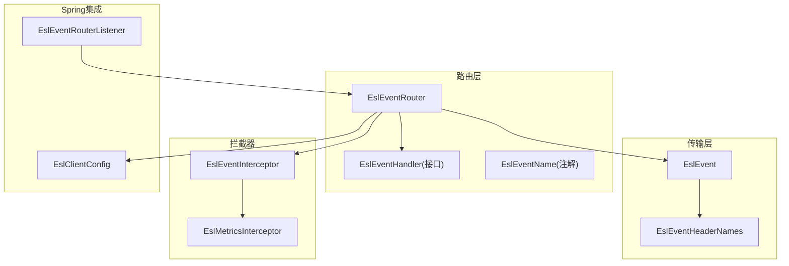
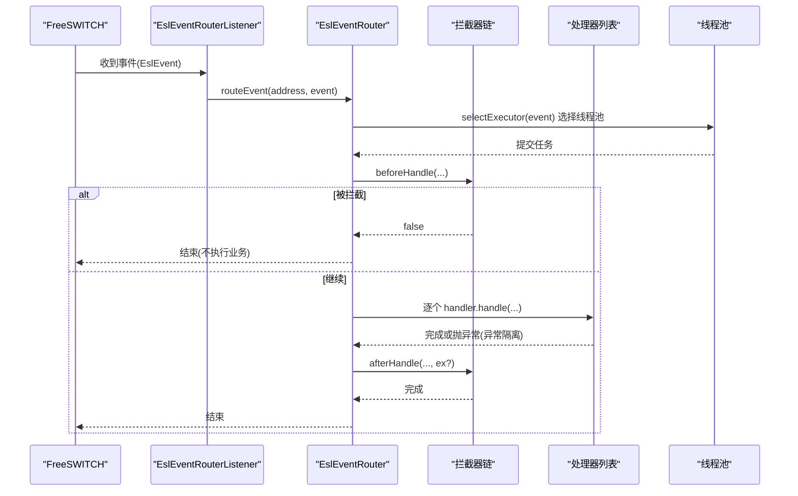
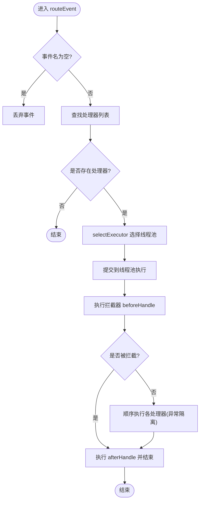
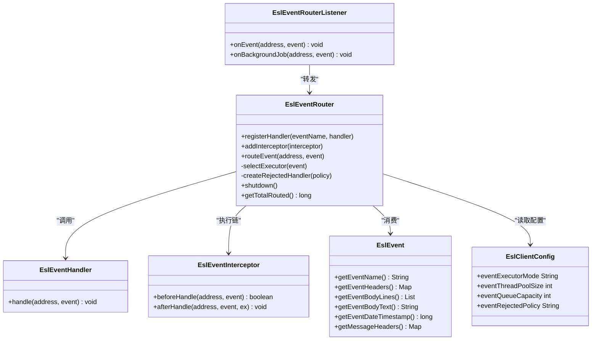

# 事件路由系统

<cite>
**本文引用的文件**
- [EslEventRouter.java](file://yudao-cloud/yudao-module-cc/ipcc-fs-esl/src/main/java/cn/ipcc/fs/esl/router/EslEventRouter.java)
- [EslEventHandler.java](file://yudao-cloud/yudao-module-cc/ipcc-fs-esl/src/main/java/cn/ipcc/fs/esl/router/EslEventHandler.java)
- [EslEventName.java](file://yudao-cloud/yudao-module-cc/ipcc-fs-esl/src/main/java/cn/ipcc/fs/esl/annotation/EslEventName.java)
- [EslEventInterceptor.java](file://yudao-cloud/yudao-module-cc/ipcc-fs-esl/src/main/java/cn/ipcc/fs/esl/interceptor/EslEventInterceptor.java)
- [EslMetricsInterceptor.java](file://yudao-cloud/yudao-module-cc/ipcc-fs-esl/src/main/java/cn/ipcc/fs/esl/interceptor/EslMetricsInterceptor.java)
- [EslEvent.java](file://yudao-cloud/yudao-module-cc/ipcc-fs-esl/src/main/java/cn/ipcc/fs/esl/transport/EslEvent.java)
- [EslEventHeaderNames.java](file://yudao-cloud/yudao-module-cc/ipcc-fs-esl/src/main/java/cn/ipcc/fs/esl/transport/EslEventHeaderNames.java)
- [EslEventRouterListener.java](file://yudao-cloud/yudao-module-cc/ipcc-fs-esl/src/main/java/cn/ipcc/fs/esl/spring/EslEventRouterListener.java)
- [EslClientConfig.java](file://yudao-cloud/yudao-module-cc/ipcc-fs-esl/src/main/java/cn/ipcc/fs/esl/EslClientConfig.java)
</cite>

## 目录
1. [简介](#简介)
2. [项目结构](#项目结构)
3. [核心组件](#核心组件)
4. [架构总览](#架构总览)
5. [详细组件分析](#详细组件分析)
6. [依赖关系分析](#依赖关系分析)
7. [性能与并发](#性能与并发)
8. [故障转移与高可用](#故障转移与高可用)
9. [排错指南](#排错指南)
10. [结论](#结论)
11. [附录：配置与示例](#附录：配置与示例)

## 简介
本文件面向 ESL（FreeSWITCH Event Socket Library）事件路由系统，聚焦 EslEventRouter 的事件路由算法、事件对象模型、拦截器链、线程模型与并发控制策略。文档同时覆盖基于事件类型的路由规则、条件匹配、动态路由扩展点，以及性能优化、负载均衡与故障转移机制的实现要点，并提供可操作的配置与示例指引。

## 项目结构
ESL 事件路由相关代码集中在 ipcc-fs-esl 模块中，关键路径如下：
- 路由器与处理器接口：router 包
- 事件数据模型与头常量：transport 包
- 注解与拦截器：annotation、interceptor 包
- Spring 集成监听器：spring 包
- 客户端配置：根包下的 EslClientConfig

图表来源
- [EslEventRouter.java:1-201](file://yudao-cloud/yudao-module-cc/ipcc-fs-esl/src/main/java/cn/ipcc/fs/esl/router/EslEventRouter.java#L1-L201)
- [EslEvent.java:1-135](file://yudao-cloud/yudao-module-cc/ipcc-fs-esl/src/main/java/cn/ipcc/fs/esl/transport/EslEvent.java#L1-L135)
- [EslEventHeaderNames.java:1-68](file://yudao-cloud/yudao-module-cc/ipcc-fs-esl/src/main/java/cn/ipcc/fs/esl/transport/EslEventHeaderNames.java#L1-L68)
- [EslEventInterceptor.java:1-31](file://yudao-cloud/yudao-module-cc/ipcc-fs-esl/src/main/java/cn/ipcc/fs/esl/interceptor/EslEventInterceptor.java#L1-L31)
- [EslMetricsInterceptor.java:1-63](file://yudao-cloud/yudao-module-cc/ipcc-fs-esl/src/main/java/cn/ipcc/fs/esl/interceptor/EslMetricsInterceptor.java#L1-L63)
- [EslEventRouterListener.java:1-48](file://yudao-cloud/yudao-module-cc/ipcc-fs-esl/src/main/java/cn/ipcc/fs/esl/spring/EslEventRouterListener.java#L1-L48)
- [EslClientConfig.java:1-61](file://yudao-cloud/yudao-module-cc/ipcc-fs-esl/src/main/java/cn/ipcc/fs/esl/EslClientConfig.java#L1-L61)

章节来源
- [EslEventRouter.java:1-201](file://yudao-cloud/yudao-module-cc/ipcc-fs-esl/src/main/java/cn/ipcc/fs/esl/router/EslEventRouter.java#L1-L201)
- [EslEventRouterListener.java:1-48](file://yudao-cloud/yudao-module-cc/ipcc-fs-esl/src/main/java/cn/ipcc/fs/esl/spring/EslEventRouterListener.java#L1-L48)

## 核心组件
- EslEventRouter：事件路由核心，负责处理器注册、拦截器链执行、线程池选择与异步分发、异常隔离与统计。
- EslEventHandler：事件处理器接口，业务实现类通过 @EslEventName 指定处理的事件名。
- EslEvent：事件对象，包含事件头、事件体、原始消息头等，提供事件名、时间戳等便捷访问。
- EslEventInterceptor：拦截器接口，支持 beforeHandle/afterHandle 钩子，用于日志、追踪、过滤、指标等横切逻辑。
- EslEventRouterListener：Spring 默认监听器，将接收到的事件转发给路由器。
- EslClientConfig：路由器与连接相关的运行时配置（执行模式、线程池大小、队列容量、拒绝策略等）。

章节来源
- [EslEventRouter.java:1-201](file://yudao-cloud/yudao-module-cc/ipcc-fs-esl/src/main/java/cn/ipcc/fs/esl/router/EslEventRouter.java#L1-L201)
- [EslEventHandler.java:1-20](file://yudao-cloud/yudao-module-cc/ipcc-fs-esl/src/main/java/cn/ipcc/fs/esl/router/EslEventHandler.java#L1-L20)
- [EslEvent.java:1-135](file://yudao-cloud/yudao-module-cc/ipcc-fs-esl/src/main/java/cn/ipcc/fs/esl/transport/EslEvent.java#L1-L135)
- [EslEventInterceptor.java:1-31](file://yudao-cloud/yudao-module-cc/ipcc-fs-esl/src/main/java/cn/ipcc/fs/esl/interceptor/EslEventInterceptor.java#L1-L31)
- [EslEventRouterListener.java:1-48](file://yudao-cloud/yudao-module-cc/ipcc-fs-esl/src/main/java/cn/ipcc/fs/esl/spring/EslEventRouterListener.java#L1-L48)
- [EslClientConfig.java:1-61](file://yudao-cloud/yudao-module-cc/ipcc-fs-esl/src/main/java/cn/ipcc/fs/esl/EslClientConfig.java#L1-L61)

## 架构总览
事件从 FreeSWITCH 经 Netty 通道到达监听器，再由默认监听器统一转交给路由器；路由器根据事件名匹配处理器，按配置的并发策略选择线程池，依次执行拦截器链与处理器，最终完成事件处理并记录指标。

图表来源
- [EslEventRouterListener.java:25-46](file://yudao-cloud/yudao-module-cc/ipcc-fs-esl/src/main/java/cn/ipcc/fs/esl/spring/EslEventRouterListener.java#L25-L46)
- [EslEventRouter.java:90-153](file://yudao-cloud/yudao-module-cc/ipcc-fs-esl/src/main/java/cn/ipcc/fs/esl/router/EslEventRouter.java#L90-L153)
- [EslEventInterceptor.java:15-31](file://yudao-cloud/yudao-module-cc/ipcc-fs-esl/src/main/java/cn/ipcc/fs/esl/interceptor/EslEventInterceptor.java#L15-L31)

## 详细组件分析

### 事件路由算法与优先级
- 事件类型匹配：以事件名（Event-Name）为键建立“事件名→处理器列表”的映射，同一事件名可注册多个处理器，按容器排序（如 @Order）顺序执行。
- 优先级与顺序：处理器顺序由容器装配决定；拦截器链在处理器之前/之后统一执行，beforeHandle 返回 false 可终止后续处理。
- 特殊事件：BACKGROUND_JOB 事件始终走独立线程池，避免与普通事件互相阻塞。

章节来源
- [EslEventRouter.java:14-31](file://yudao-cloud/yudao-module-cc/ipcc-fs-esl/src/main/java/cn/ipcc/fs/esl/router/EslEventRouter.java#L14-L31)
- [EslEventRouter.java:81-88](file://yudao-cloud/yudao-module-cc/ipcc-fs-esl/src/main/java/cn/ipcc/fs/esl/router/EslEventRouter.java#L81-L88)
- [EslEventRouter.java:155-174](file://yudao-cloud/yudao-module-cc/ipcc-fs-esl/src/main/java/cn/ipcc/fs/esl/router/EslEventRouter.java#L155-L174)

### 事件对象结构与元数据
- 事件头：eventHeaders，包含 Event-Name、Unique-ID、Channel-State、Hangup-Cause 等常用字段，值已做 URL 解码。
- 事件体：eventBody/eventBodyText，Content-Length 之后的行作为事件体。
- 原始消息头：messageHeaders，保留 Content-Type、Content-Length 等传输层信息。
- 时间戳：getEventDateTimestamp() 读取 Event-Date-Timestamp（微秒），缺失或非数字时返回 0。

章节来源
- [EslEvent.java:10-135](file://yudao-cloud/yudao-module-cc/ipcc-fs-esl/src/main/java/cn/ipcc/fs/esl/transport/EslEvent.java#L10-L135)
- [EslEventHeaderNames.java:1-68](file://yudao-cloud/yudao-module-cc/ipcc-fs-esl/src/main/java/cn/ipcc/fs/esl/transport/EslEventHeaderNames.java#L1-L68)

### 路由决策与条件匹配
- 基础规则：仅当存在匹配的处理器时才进行路由；无处理器直接丢弃。
- 条件匹配：通过拦截器 beforeHandle 实现白名单/黑名单、按头字段过滤、限流等条件判断。
- 动态路由：可在运行期通过 registerHandler 动态注册新处理器，或通过 addInterceptor 动态调整拦截策略。

章节来源
- [EslEventRouter.java:106-116](file://yudao-cloud/yudao-module-cc/ipcc-fs-esl/src/main/java/cn/ipcc/fs/esl/router/EslEventRouter.java#L106-L116)
- [EslEventRouter.java:81-88](file://yudao-cloud/yudao-module-cc/ipcc-fs-esl/src/main/java/cn/ipcc/fs/esl/router/EslEventRouter.java#L81-L88)
- [EslEventInterceptor.java:15-31](file://yudao-cloud/yudao-module-cc/ipcc-fs-esl/src/main/java/cn/ipcc/fs/esl/interceptor/EslEventInterceptor.java#L15-L31)

### 并发控制与线程模型
- 三种执行模式：
  - SINGLE_THREAD：单线程串行处理所有事件，适合低并发场景。
  - FULL_CONCURRENT：固定线程池并发处理，适合事件无关联场景。
  - CHANNEL_HASH：按 Unique-ID 哈希分配到固定单线程池，保证同一通道事件顺序。
- 后台任务隔离：BACKGROUND_JOB 使用独立线程池，避免与普通事件互相阻塞。
- 拒绝策略：支持 ABORT/DISCARD/CALLER_RUNS，防止背压导致雪崩。
- 线程局部变量透传：拦截器前置处理移入异步任务内执行，确保 beforeHandle/handler/afterHandle 在同一线程，ThreadLocal 上下文可安全传递。

图表来源
- [EslEventRouter.java:106-153](file://yudao-cloud/yudao-module-cc/ipcc-fs-esl/src/main/java/cn/ipcc/fs/esl/router/EslEventRouter.java#L106-L153)
- [EslEventRouter.java:155-186](file://yudao-cloud/yudao-module-cc/ipcc-fs-esl/src/main/java/cn/ipcc/fs/esl/router/EslEventRouter.java#L155-L186)

章节来源
- [EslEventRouter.java:43-74](file://yudao-cloud/yudao-module-cc/ipcc-fs-esl/src/main/java/cn/ipcc/fs/esl/router/EslEventRouter.java#L43-L74)
- [EslEventRouter.java:155-186](file://yudao-cloud/yudao-module-cc/ipcc-fs-esl/src/main/java/cn/ipcc/fs/esl/router/EslEventRouter.java#L155-L186)
- [EslClientConfig.java:39-47](file://yudao-cloud/yudao-module-cc/ipcc-fs-esl/src/main/java/cn/ipcc/fs/esl/EslClientConfig.java#L39-L47)

### 拦截器链与指标采集
- 拦截器职责：日志审计、链路追踪、事件过滤、指标统计等横切关注点。
- 指标采集：内置 EslMetricsInterceptor 在 beforeHandle 记录接收计数与开始时间，在 afterHandle 计算延迟并上报，finally 清理 ThreadLocal 避免线程复用污染。

章节来源
- [EslEventInterceptor.java:1-31](file://yudao-cloud/yudao-module-cc/ipcc-fs-esl/src/main/java/cn/ipcc/fs/esl/interceptor/EslEventInterceptor.java#L1-L31)
- [EslMetricsInterceptor.java:1-63](file://yudao-cloud/yudao-module-cc/ipcc-fs-esl/src/main/java/cn/ipcc/fs/esl/interceptor/EslMetricsInterceptor.java#L1-L63)

### 处理器接口与注解
- EslEventHandler：定义 handle(address, event) 方法，业务实现类需标注 @EslEventName(value=事件名)。
- 多处理器：同一事件名可注册多个处理器，按容器顺序依次执行，任一处理器异常不影响其他处理器。

章节来源
- [EslEventHandler.java:1-20](file://yudao-cloud/yudao-module-cc/ipcc-fs-esl/src/main/java/cn/ipcc/fs/esl/router/EslEventHandler.java#L1-L20)
- [EslEventName.java:1-17](file://yudao-cloud/yudao-module-cc/ipcc-fs-esl/src/main/java/cn/ipcc/fs/esl/annotation/EslEventName.java#L1-L17)

## 依赖关系分析
- 路由器依赖事件对象、拦截器、处理器接口与客户端配置。
- 监听器依赖路由器，将事件统一接入路由流程。
- 指标拦截器依赖指标抽象，用于度量事件吞吐与延迟。

图表来源
- [EslEventRouter.java:33-201](file://yudao-cloud/yudao-module-cc/ipcc-fs-esl/src/main/java/cn/ipcc/fs/esl/router/EslEventRouter.java#L33-L201)
- [EslEventRouterListener.java:17-48](file://yudao-cloud/yudao-module-cc/ipcc-fs-esl/src/main/java/cn/ipcc/fs/esl/spring/EslEventRouterListener.java#L17-L48)
- [EslEvent.java:18-135](file://yudao-cloud/yudao-module-cc/ipcc-fs-esl/src/main/java/cn/ipcc/fs/esl/transport/EslEvent.java#L18-L135)
- [EslClientConfig.java:10-61](file://yudao-cloud/yudao-module-cc/ipcc-fs-esl/src/main/java/cn/ipcc/fs/esl/EslClientConfig.java#L10-L61)

章节来源
- [EslEventRouter.java:33-201](file://yudao-cloud/yudao-module-cc/ipcc-fs-esl/src/main/java/cn/ipcc/fs/esl/router/EslEventRouter.java#L33-L201)
- [EslEventRouterListener.java:17-48](file://yudao-cloud/yudao-module-cc/ipcc-fs-esl/src/main/java/cn/ipcc/fs/esl/spring/EslEventRouterListener.java#L17-L48)

## 性能与并发
- 事件顺序保障：CHANNEL_HASH 模式下按 Unique-ID 哈希分配固定线程，保证同一通道事件顺序；SINGLE_THREAD 全序；FULL_CONCURRENT 无序但高吞吐。
- 背压与降级：队列容量与拒绝策略可调，CALLER_RUNS 适合突发流量自限流，DISCARD 适合丢次要事件，ABORT 快速失败便于上层监控告警。
- 后台任务隔离：BACKGROUND_JOB 独立线程池，避免阻塞普通事件。
- 指标观测：通过拦截器统计事件数、延迟、异常率，辅助容量规划与调优。

章节来源
- [EslEventRouter.java:43-74](file://yudao-cloud/yudao-module-cc/ipcc-fs-esl/src/main/java/cn/ipcc/fs/esl/router/EslEventRouter.java#L43-L74)
- [EslEventRouter.java:155-186](file://yudao-cloud/yudao-module-cc/ipcc-fs-esl/src/main/java/cn/ipcc/fs/esl/router/EslEventRouter.java#L155-L186)
- [EslMetricsInterceptor.java:1-63](file://yudao-cloud/yudao-module-cc/ipcc-fs-esl/src/main/java/cn/ipcc/fs/esl/interceptor/EslMetricsInterceptor.java#L1-L63)

## 故障转移与高可用
- 事件级容错：每个处理器异常隔离，单个处理器失败不影响同事件的其他处理器与其他事件。
- 资源释放：拦截器 afterHandle 在 finally 中执行，确保 ThreadLocal 等资源清理。
- 分布式协调：可通过 EslMonitorCoordinator 与 Redis 实现监听权竞争与锁续期，避免多实例重复消费事件（协调逻辑在 coordinator 包中实现，此处不展开细节）。

章节来源
- [EslEventRouter.java:131-151](file://yudao-cloud/yudao-module-cc/ipcc-fs-esl/src/main/java/cn/ipcc/fs/esl/router/EslEventRouter.java#L131-L151)
- [EslEventRouter.java:188-195](file://yudao-cloud/yudao-module-cc/ipcc-fs-esl/src/main/java/cn/ipcc/fs/esl/router/EslEventRouter.java#L188-L195)

## 排错指南
- 事件名缺失：路由前校验 eventName，为空则丢弃并记录警告日志。
- 处理器异常：捕获并记录异常，不影响其他处理器与后续流程。
- 拦截器异常：afterHandle 中捕获异常并记录，避免影响主流程。
- 线程池饱和：根据拒绝策略观察行为，必要时增大队列或线程池，或切换执行模式。
- 顺序问题：若需通道内顺序，使用 CHANNEL_HASH；否则可使用 FULL_CONCURRENT 提升吞吐。

章节来源
- [EslEventRouter.java:106-116](file://yudao-cloud/yudao-module-cc/ipcc-fs-esl/src/main/java/cn/ipcc/fs/esl/router/EslEventRouter.java#L106-L116)
- [EslEventRouter.java:131-151](file://yudao-cloud/yudao-module-cc/ipcc-fs-esl/src/main/java/cn/ipcc/fs/esl/router/EslEventRouter.java#L131-L151)
- [EslEventRouter.java:176-186](file://yudao-cloud/yudao-module-cc/ipcc-fs-esl/src/main/java/cn/ipcc/fs/esl/router/EslEventRouter.java#L176-L186)

## 结论
EslEventRouter 提供了可扩展、高可靠且高性能的 ESL 事件路由能力：通过事件名匹配与拦截器链实现灵活的条件路由；通过多种执行模式与后台任务隔离保障顺序与吞吐；通过异常隔离与资源清理提升鲁棒性；结合指标拦截器可实现可观测性与持续优化。配合 EslClientConfig 可快速适配不同规模与负载特征的场景。

## 附录：配置与示例
- 执行模式与线程池
  - 事件执行模式：eventExecutorMode（SINGLE_THREAD/FULL_CONCURRENT/CHANNEL_HASH）
  - 线程池大小：eventThreadPoolSize（CHANNEL_HASH 时为单线程池数量）
  - 队列容量：eventQueueCapacity
  - 拒绝策略：eventRejectedPolicy（CALLER_RUNS/DISCARD/ABORT）
- 自定义路由规则
  - 实现 EslEventHandler 并标注 @EslEventName(value="事件名")
  - 通过 EslEventRouter.registerHandler 动态注册处理器
  - 通过 EslEventRouter.addInterceptor 添加拦截器实现条件匹配（如按头字段过滤）
- 复杂事件流处理
  - 使用 CHANNEL_HASH 保证同一通道事件顺序
  - BACKGROUND_JOB 自动走独立线程池，避免阻塞
  - 利用 EslEvent.getEventDateTimestamp 进行时间窗口聚合或去重
- 性能调优建议
  - 高吞吐低延迟：FULL_CONCURRENT + 较大线程池 + CALLER_RUNS
  - 强顺序要求：CHANNEL_HASH + 合理线程池数量
  - 极低并发：SINGLE_THREAD 简化调试
- 监控与诊断
  - 启用 EslMetricsInterceptor 采集事件数、延迟、异常率
  - 关注 getTotalRouted 统计与线程池拒绝情况

章节来源
- [EslClientConfig.java:39-47](file://yudao-cloud/yudao-module-cc/ipcc-fs-esl/src/main/java/cn/ipcc/fs/esl/EslClientConfig.java#L39-L47)
- [EslEventRouter.java:81-88](file://yudao-cloud/yudao-module-cc/ipcc-fs-esl/src/main/java/cn/ipcc/fs/esl/router/EslEventRouter.java#L81-L88)
- [EslEventRouter.java:155-174](file://yudao-cloud/yudao-module-cc/ipcc-fs-esl/src/main/java/cn/ipcc/fs/esl/router/EslEventRouter.java#L155-L174)
- [EslEvent.java:74-92](file://yudao-cloud/yudao-module-cc/ipcc-fs-esl/src/main/java/cn/ipcc/fs/esl/transport/EslEvent.java#L74-L92)
- [EslMetricsInterceptor.java:27-61](file://yudao-cloud/yudao-module-cc/ipcc-fs-esl/src/main/java/cn/ipcc/fs/esl/interceptor/EslMetricsInterceptor.java#L27-L61)