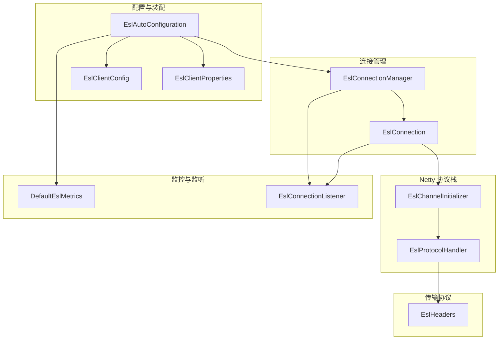
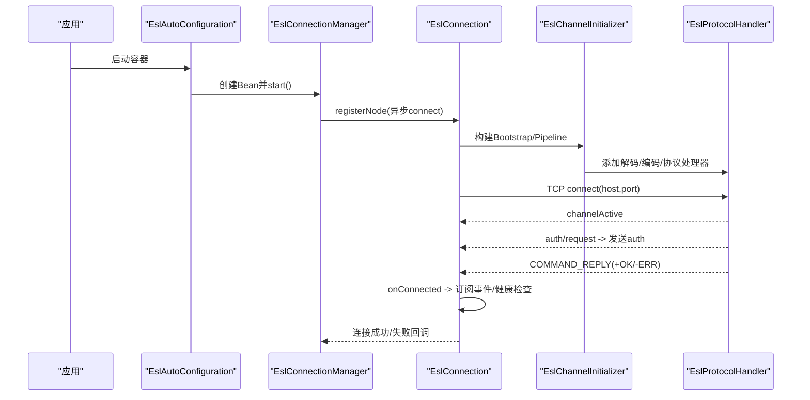
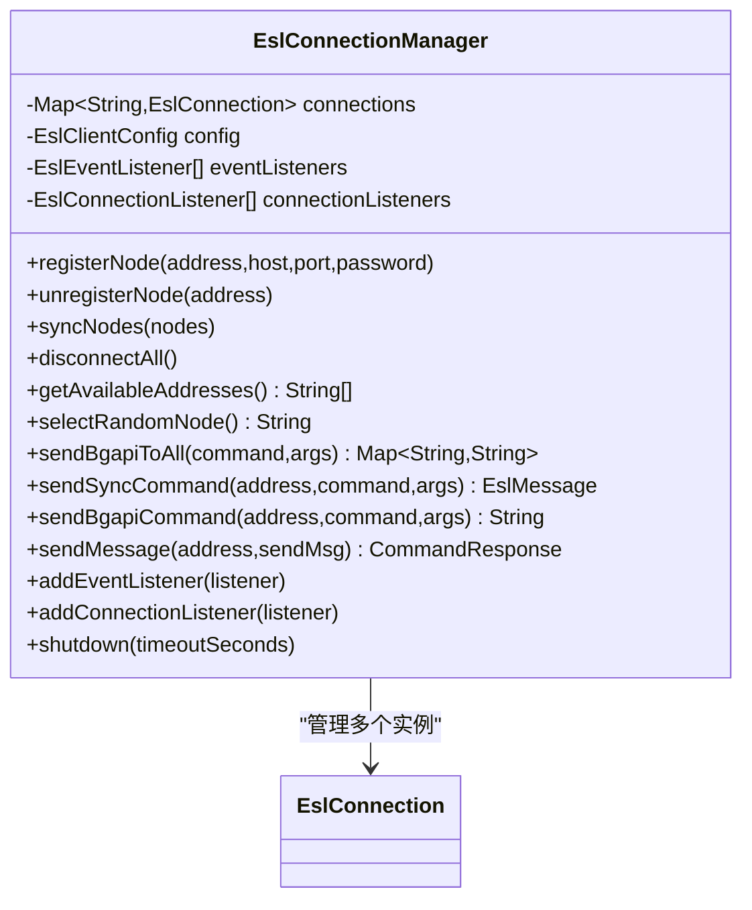
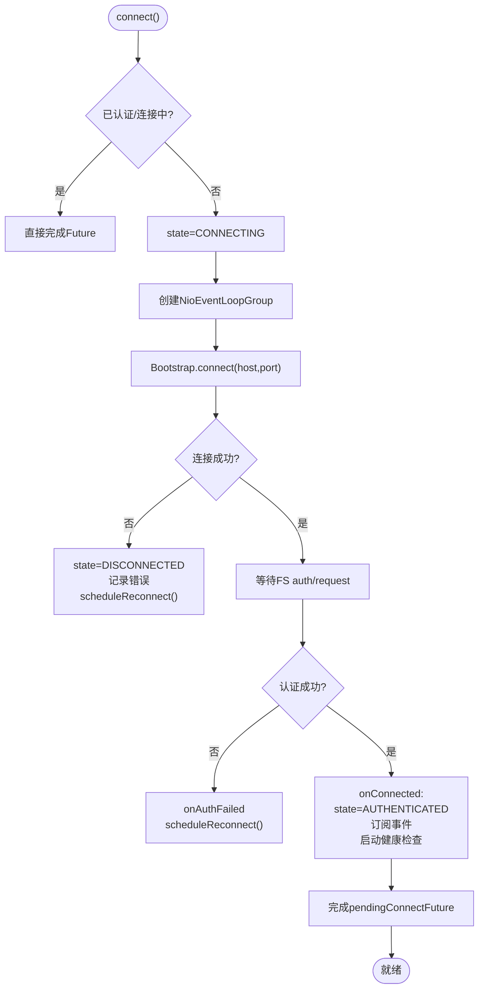
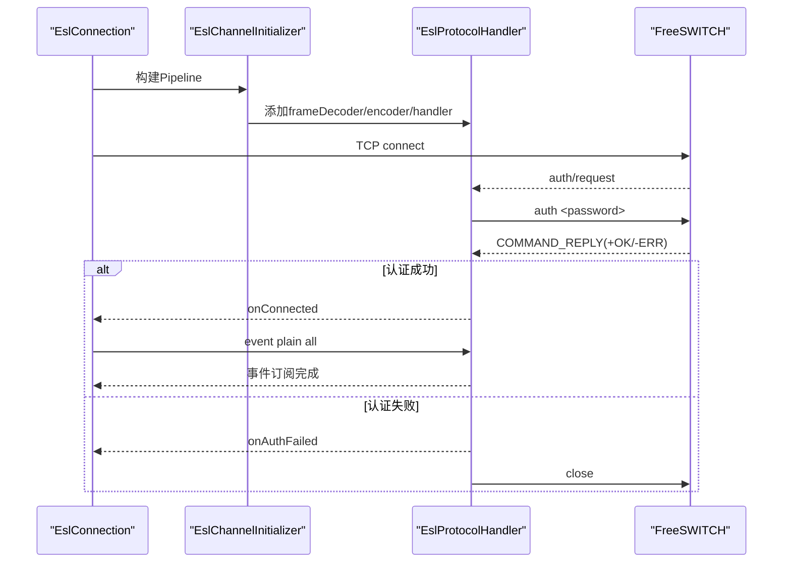
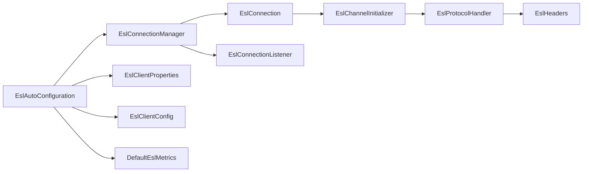

# ESL连接管理

<cite>
**本文引用的文件**
- [EslConnectionManager.java](file://yudao-cloud/yudao-module-cc/ipcc-fs-esl/src/main/java/cn/ipcc/fs/esl/EslConnectionManager.java)
- [EslConnection.java](file://yudao-cloud/yudao-module-cc/ipcc-fs-esl/src/main/java/cn/ipcc/fs/esl/EslConnection.java)
- [EslClientConfig.java](file://yudao-cloud/yudao-module-cc/ipcc-fs-esl/src/main/java/cn/ipcc/fs/esl/EslClientConfig.java)
- [EslClientProperties.java](file://yudao-cloud/yudao-module-cc/ipcc-fs-esl/src/main/java/cn/ipcc/fs/esl/spring/EslClientProperties.java)
- [EslAutoConfiguration.java](file://yudao-cloud/yudao-module-cc/ipcc-fs-esl/src/main/java/cn/ipcc/fs/esl/spring/EslAutoConfiguration.java)
- [EslChannelInitializer.java](file://yudao-cloud/yudao-module-cc/ipcc-fs-esl/src/main/java/cn/ipcc/fs/esl/netty/EslChannelInitializer.java)
- [EslProtocolHandler.java](file://yudao-cloud/yudao-module-cc/ipcc-fs-esl/src/main/java/cn/ipcc/fs/esl/netty/EslProtocolHandler.java)
- [EslHeaders.java](file://yudao-cloud/yudao-module-cc/ipcc-fs-esl/src/main/java/cn/ipcc/fs/esl/transport/EslHeaders.java)
- [EslConnectionListener.java](file://yudao-cloud/yudao-module-cc/ipcc-fs-esl/src/main/java/cn/ipcc/fs/esl/listener/EslConnectionListener.java)
- [DefaultEslMetrics.java](file://yudao-cloud/yudao-module-cc/ipcc-fs-esl/src/main/java/cn/ipcc/fs/esl/metrics/DefaultEslMetrics.java)
</cite>

## 目录
1. [简介](#简介)
2. [项目结构](#项目结构)
3. [核心组件](#核心组件)
4. [架构总览](#架构总览)
5. [详细组件分析](#详细组件分析)
6. [依赖关系分析](#依赖关系分析)
7. [性能与调优](#性能与调优)
8. [故障排查指南](#故障排查指南)
9. [结论](#结论)
10. [附录：配置与使用示例](#附录配置与使用示例)

## 简介
本模块提供 FreeSWITCH ESL（Event Socket Library）Inbound 连接的统一管理能力，核心围绕 EslConnectionManager 实现多节点连接池的创建、配置与管理；通过 Netty 构建 TCP 连接，完成认证、事件订阅与健康检查；内置自动重连、指数退避与抖动策略；提供随机负载均衡选择可用节点；支持批量命令下发与同步/异步命令发送；集成 Spring Boot 自动装配与可插拔指标采集。

## 项目结构
ESL 连接管理相关代码位于 ipcc-fs-esl 模块中，按职责分层组织：
- 连接管理层：EslConnectionManager、EslConnection
- 网络协议层：EslChannelInitializer、EslProtocolHandler、EslFrameDecoder、EslMessageEncoder
- 传输协议常量：EslHeaders
- 配置与装配：EslClientConfig、EslClientProperties、EslAutoConfiguration
- 监听与指标：EslConnectionListener、DefaultEslMetrics

图表来源
- [EslAutoConfiguration.java:56-127](file://yudao-cloud/yudao-module-cc/ipcc-fs-esl/src/main/java/cn/ipcc/fs/esl/spring/EslAutoConfiguration.java#L56-L127)
- [EslConnectionManager.java:31-119](file://yudao-cloud/yudao-module-cc/ipcc-fs-esl/src/main/java/cn/ipcc/fs/esl/EslConnectionManager.java#L31-L119)
- [EslConnection.java:44-140](file://yudao-cloud/yudao-module-cc/ipcc-fs-esl/src/main/java/cn/ipcc/fs/esl/EslConnection.java#L44-L140)
- [EslChannelInitializer.java:22-46](file://yudao-cloud/yudao-module-cc/ipcc-fs-esl/src/main/java/cn/ipcc/fs/esl/netty/EslChannelInitializer.java#L22-L46)
- [EslProtocolHandler.java:40-107](file://yudao-cloud/yudao-module-cc/ipcc-fs-esl/src/main/java/cn/ipcc/fs/esl/netty/EslProtocolHandler.java#L40-L107)
- [EslHeaders.java:19-60](file://yudao-cloud/yudao-module-cc/ipcc-fs-esl/src/main/java/cn/ipcc/fs/esl/transport/EslHeaders.java#L19-L60)

章节来源
- [EslAutoConfiguration.java:56-127](file://yudao-cloud/yudao-module-cc/ipcc-fs-esl/src/main/java/cn/ipcc/fs/esl/spring/EslAutoConfiguration.java#L56-L127)
- [EslConnectionManager.java:31-119](file://yudao-cloud/yudao-module-cc/ipcc-fs-esl/src/main/java/cn/ipcc/fs/esl/EslConnectionManager.java#L31-L119)
- [EslConnection.java:44-140](file://yudao-cloud/yudao-module-cc/ipcc-fs-esl/src/main/java/cn/ipcc/fs/esl/EslConnection.java#L44-L140)
- [EslChannelInitializer.java:22-46](file://yudao-cloud/yudao-module-cc/ipcc-fs-esl/src/main/java/cn/ipcc/fs/esl/netty/EslChannelInitializer.java#L22-L46)
- [EslProtocolHandler.java:40-107](file://yudao-cloud/yudao-module-cc/ipcc-fs-esl/src/main/java/cn/ipcc/fs/esl/netty/EslProtocolHandler.java#L40-L107)
- [EslHeaders.java:19-60](file://yudao-cloud/yudao-module-cc/ipcc-fs-esl/src/main/java/cn/ipcc/fs/esl/transport/EslHeaders.java#L19-L60)

## 核心组件
- EslConnectionManager：多节点连接管理器，负责注册/移除节点、节点选择（随机）、批量命令下发、连接状态聚合、对账式同步节点列表。
- EslConnection：单节点 ESL 客户端，封装 TCP 连接生命周期、认证、事件订阅、健康检查、自动重连、命令发送（api/bgapi/sendmsg）。
- EslChannelInitializer / EslProtocolHandler：Netty Pipeline 组装与 ESL 协议处理（认证、命令响应匹配、事件分发、断开通知）。
- EslClientConfig / EslClientProperties：配置项定义与 Spring Boot 属性绑定。
- EslAutoConfiguration：Spring 自动装配，创建 Bean、注册监听器、启动协调器与事件路由。
- EslConnectionListener：连接生命周期回调接口（连接、断开、认证失败、重连等）。
- DefaultEslMetrics：默认指标采集实现（连接、断开、重连、命令、事件等计数）。

章节来源
- [EslConnectionManager.java:31-254](file://yudao-cloud/yudao-module-cc/ipcc-fs-esl/src/main/java/cn/ipcc/fs/esl/EslConnectionManager.java#L31-L254)
- [EslConnection.java:44-511](file://yudao-cloud/yudao-module-cc/ipcc-fs-esl/src/main/java/cn/ipcc/fs/esl/EslConnection.java#L44-L511)
- [EslChannelInitializer.java:22-46](file://yudao-cloud/yudao-module-cc/ipcc-fs-esl/src/main/java/cn/ipcc/fs/esl/netty/EslChannelInitializer.java#L22-L46)
- [EslProtocolHandler.java:40-267](file://yudao-cloud/yudao-module-cc/ipcc-fs-esl/src/main/java/cn/ipcc/fs/esl/netty/EslProtocolHandler.java#L40-L267)
- [EslClientConfig.java:10-61](file://yudao-cloud/yudao-module-cc/ipcc-fs-esl/src/main/java/cn/ipcc/fs/esl/EslClientConfig.java#L10-L61)
- [EslClientProperties.java:17-86](file://yudao-cloud/yudao-module-cc/ipcc-fs-esl/src/main/java/cn/ipcc/fs/esl/spring/EslClientProperties.java#L17-L86)
- [EslAutoConfiguration.java:56-248](file://yudao-cloud/yudao-module-cc/ipcc-fs-esl/src/main/java/cn/ipcc/fs/esl/spring/EslAutoConfiguration.java#L56-L248)
- [EslConnectionListener.java:7-66](file://yudao-cloud/yudao-module-cc/ipcc-fs-esl/src/main/java/cn/ipcc/fs/esl/listener/EslConnectionListener.java#L7-L66)
- [DefaultEslMetrics.java:14-79](file://yudao-cloud/yudao-module-cc/ipcc-fs-esl/src/main/java/cn/ipcc/fs/esl/metrics/DefaultEslMetrics.java#L14-L79)

## 架构总览
ESL 连接管理的整体流程如下：
- Spring 启动时，EslAutoConfiguration 将 EslClientProperties 转换为 EslClientConfig，并创建 EslConnectionManager Bean；若配置了静态节点则自动注册并连接。
- EslConnectionManager 维护多个 EslConnection 实例，每个实例对应一个 FS 节点的 ESL Inbound 连接。
- EslConnection 通过 Netty Bootstrap 建立 TCP 连接，Pipeline 由 EslChannelInitializer 组装，最终交由 EslProtocolHandler 处理协议交互。
- 认证成功后，内部监听器触发事件订阅与健康检查；异常或健康检查失败触发自动重连（指数退避+抖动）。
- 上层业务通过 EslConnectionManager 获取可用节点地址（随机），或直接调用指定节点发送 api/bgapi/sendmsg 命令。

图表来源
- [EslAutoConfiguration.java:98-127](file://yudao-cloud/yudao-module-cc/ipcc-fs-esl/src/main/java/cn/ipcc/fs/esl/spring/EslAutoConfiguration.java#L98-L127)
- [EslConnectionManager.java:54-68](file://yudao-cloud/yudao-module-cc/ipcc-fs-esl/src/main/java/cn/ipcc/fs/esl/EslConnectionManager.java#L54-L68)
- [EslConnection.java:102-140](file://yudao-cloud/yudao-module-cc/ipcc-fs-esl/src/main/java/cn/ipcc/fs/esl/EslConnection.java#L102-L140)
- [EslChannelInitializer.java:40-46](file://yudao-cloud/yudao-module-cc/ipcc-fs-esl/src/main/java/cn/ipcc/fs/esl/netty/EslChannelInitializer.java#L40-L46)
- [EslProtocolHandler.java:110-213](file://yudao-cloud/yudao-module-cc/ipcc-fs-esl/src/main/java/cn/ipcc/fs/esl/netty/EslProtocolHandler.java#L110-L213)

## 详细组件分析

### EslConnectionManager：连接池与负载均衡
- 连接池管理：使用 ConcurrentHashMap 维护 address -> EslConnection 映射；支持动态注册/移除节点；提供 syncNodes 对账式重载（计算差集后增删）。
- 节点选择策略：getAvailableAddresses 过滤 canSend() 为 true 的节点；selectRandomNode 使用 ThreadLocalRandom 随机选取，实现简单负载均衡。
- 批量操作：sendBgapiToAll 向所有节点发送 bgapi 命令，返回 address -> Job-UUID 映射；失败节点值为 null。
- 生命周期：disconnectAll 关闭所有连接；shutdown 优雅关闭并等待资源释放。
- 监听器广播：addEventListener/addConnectionListener 会同时添加到已有连接，后续新增连接也会自动注册。

图表来源
- [EslConnectionManager.java:31-254](file://yudao-cloud/yudao-module-cc/ipcc-fs-esl/src/main/java/cn/ipcc/fs/esl/EslConnectionManager.java#L31-L254)

章节来源
- [EslConnectionManager.java:31-254](file://yudao-cloud/yudao-module-cc/ipcc-fs-esl/src/main/java/cn/ipcc/fs/esl/EslConnectionManager.java#L31-L254)

### EslConnection：TCP 连接、认证、健康检查与重连
- 连接建立：connect() 创建 NioEventLoopGroup 与 Bootstrap，设置 SO_KEEPALIVE 与 CONNECT_TIMEOUT_MILLIS；连接成功后进入 CONNECTED 状态，等待 FS 发送 auth/request。
- 认证流程：EslProtocolHandler 收到 auth/request 后发送 auth 命令；认证成功触发 InternalConnectionListener.onConnected，切换为 AUTHENTICATED，异步订阅事件（event plain all），启动健康检查，完成 pendingConnectFuture。
- 命令发送：
  - sendApiCommand：构造 "api <cmd> <args>" 并通过 protocolHandler.sendSyncCommand 同步等待响应；超时抛出 EslCommandTimeoutException。
  - sendBgapiCommand：构造 "bgapi <cmd> <args>"，从 Reply-Text 头或 body 解析 Job-UUID；超时同样抛异常。
  - sendMessage：发送 sendmsg 命令，返回 CommandResponse。
- 健康检查：定时发送 api status，连续失败达到阈值触发 triggerReconnect。
- 自动重连：scheduleReconnect 采用指数退避 + 随机抖动，最大重试次数可配；达到上限标记 FAILED 并回调 onReconnectFailed。
- 断开处理：disconnect() 标记 userInitiatedDisconnect，关闭 channel 与 workerGroup，并通知 onDisconnected(USER_INITIATED)。

图表来源
- [EslConnection.java:102-140](file://yudao-cloud/yudao-module-cc/ipcc-fs-esl/src/main/java/cn/ipcc/fs/esl/EslConnection.java#L102-L140)
- [EslConnection.java:394-446](file://yudao-cloud/yudao-module-cc/ipcc-fs-esl/src/main/java/cn/ipcc/fs/esl/EslConnection.java#L394-L446)
- [EslProtocolHandler.java:146-213](file://yudao-cloud/yudao-module-cc/ipcc-fs-esl/src/main/java/cn/ipcc/fs/esl/netty/EslProtocolHandler.java#L146-L213)

章节来源
- [EslConnection.java:102-511](file://yudao-cloud/yudao-module-cc/ipcc-fs-esl/src/main/java/cn/ipcc/fs/esl/EslConnection.java#L102-L511)
- [EslProtocolHandler.java:146-213](file://yudao-cloud/yudao-module-cc/ipcc-fs-esl/src/main/java/cn/ipcc/fs/esl/netty/EslProtocolHandler.java#L146-L213)

### Netty 协议处理：EslChannelInitializer 与 EslProtocolHandler
- EslChannelInitializer：按顺序添加帧解码器、编码器与协议处理器，确保消息正确编解码。
- EslProtocolHandler：
  - 同步命令机制：sendSyncCommand 将 CompletableFuture 加入 pendingCommands 队列，写入命令并附加 MESSAGE_TERMINATOR；响应到达时 matchPendingCommand 匹配 future 并 complete；超时通过 orTimeout 控制。
  - 认证处理：handleAuthRequest 发送 auth 命令；handleAuthResponse 根据 Reply-Text 判断成功/失败，成功触发 onConnected，失败触发 onAuthFailed 并关闭连接。
  - 事件分发：TEXT_EVENT_PLAIN/JSON 事件转发给事件监听器；BACKGROUND_JOB 单独回调。
  - 断开处理：handleDisconnectNotice 记录原因并关闭连接；channelInactive 区分用户主动断开与连接丢失，统一通知 onDisconnected。

图表来源
- [EslChannelInitializer.java:40-46](file://yudao-cloud/yudao-module-cc/ipcc-fs-esl/src/main/java/cn/ipcc/fs/esl/netty/EslChannelInitializer.java#L40-L46)
- [EslProtocolHandler.java:110-213](file://yudao-cloud/yudao-module-cc/ipcc-fs-esl/src/main/java/cn/ipcc/fs/esl/netty/EslProtocolHandler.java#L110-L213)

章节来源
- [EslChannelInitializer.java:22-46](file://yudao-cloud/yudao-module-cc/ipcc-fs-esl/src/main/java/cn/ipcc/fs/esl/netty/EslChannelInitializer.java#L22-L46)
- [EslProtocolHandler.java:92-267](file://yudao-cloud/yudao-module-cc/ipcc-fs-esl/src/main/java/cn/ipcc/fs/esl/netty/EslProtocolHandler.java#L92-L267)

### 配置与装配：EslClientConfig、EslClientProperties、EslAutoConfiguration
- EslClientProperties：Spring Boot 配置属性类，前缀 ipcc.fs.esl，包含连接超时、命令超时、帧大小、头部行数、线程数、重连参数、健康检查、事件执行器、分布式协调、静态节点列表等。
- EslClientConfig：纯 POJO 配置对象，字段与 Properties 一一对应，供核心类使用。
- EslAutoConfiguration：
  - 将 Properties 转换为 Config 并注入到 EslConnectionManager。
  - 自动收集并注册 EslEventListener、EslConnectionListener、EslMonitorListener。
  - 条件性创建 RedisEslMonitorCoordinator（当存在 spring-data-redis 且 monitor-enabled=true）。
  - 自动注册静态配置的 FS 节点。
  - 创建 EslEventRouter 与默认 EslMetrics/Interceptor。

章节来源
- [EslClientProperties.java:17-86](file://yudao-cloud/yudao-module-cc/ipcc-fs-esl/src/main/java/cn/ipcc/fs/esl/spring/EslClientProperties.java#L17-L86)
- [EslClientConfig.java:10-61](file://yudao-cloud/yudao-module-cc/ipcc-fs-esl/src/main/java/cn/ipcc/fs/esl/EslClientConfig.java#L10-L61)
- [EslAutoConfiguration.java:56-248](file://yudao-cloud/yudao-module-cc/ipcc-fs-esl/src/main/java/cn/ipcc/fs/esl/spring/EslAutoConfiguration.java#L56-L248)

## 依赖关系分析
- EslConnectionManager 依赖 EslConnection 进行具体连接管理；依赖 EslClientConfig 获取配置；依赖监听器集合进行事件与连接生命周期广播。
- EslConnection 依赖 Netty 组件（Bootstrap、Channel、EventLoopGroup）与 EslChannelInitializer/EslProtocolHandler 完成协议交互；依赖 EslHeaders 常量构造命令。
- EslAutoConfiguration 依赖 Spring 容器能力自动装配 Bean，并条件化启用功能（如 Redis 协调器）。
- 指标采集通过 EslMetrics 接口抽象，默认实现为 DefaultEslMetrics，便于替换为 Micrometer/Prometheus。

图表来源
- [EslAutoConfiguration.java:56-127](file://yudao-cloud/yudao-module-cc/ipcc-fs-esl/src/main/java/cn/ipcc/fs/esl/spring/EslAutoConfiguration.java#L56-L127)
- [EslConnectionManager.java:31-119](file://yudao-cloud/yudao-module-cc/ipcc-fs-esl/src/main/java/cn/ipcc/fs/esl/EslConnectionManager.java#L31-L119)
- [EslConnection.java:44-140](file://yudao-cloud/yudao-module-cc/ipcc-fs-esl/src/main/java/cn/ipcc/fs/esl/EslConnection.java#L44-L140)
- [EslChannelInitializer.java:22-46](file://yudao-cloud/yudao-module-cc/ipcc-fs-esl/src/main/java/cn/ipcc/fs/esl/netty/EslChannelInitializer.java#L22-L46)
- [EslProtocolHandler.java:40-107](file://yudao-cloud/yudao-module-cc/ipcc-fs-esl/src/main/java/cn/ipcc/fs/esl/netty/EslProtocolHandler.java#L40-L107)
- [EslHeaders.java:19-60](file://yudao-cloud/yudao-module-cc/ipcc-fs-esl/src/main/java/cn/ipcc/fs/esl/transport/EslHeaders.java#L19-L60)
- [DefaultEslMetrics.java:14-79](file://yudao-cloud/yudao-module-cc/ipcc-fs-esl/src/main/java/cn/ipcc/fs/esl/metrics/DefaultEslMetrics.java#L14-L79)

章节来源
- [EslAutoConfiguration.java:56-248](file://yudao-cloud/yudao-module-cc/ipcc-fs-esl/src/main/java/cn/ipcc/fs/esl/spring/EslAutoConfiguration.java#L56-L248)
- [EslConnectionManager.java:31-254](file://yudao-cloud/yudao-module-cc/ipcc-fs-esl/src/main/java/cn/ipcc/fs/esl/EslConnectionManager.java#L31-L254)
- [EslConnection.java:44-511](file://yudao-cloud/yudao-module-cc/ipcc-fs-esl/src/main/java/cn/ipcc/fs/esl/EslConnection.java#L44-L511)
- [EslChannelInitializer.java:22-46](file://yudao-cloud/yudao-module-cc/ipcc-fs-esl/src/main/java/cn/ipcc/fs/esl/netty/EslChannelInitializer.java#L22-L46)
- [EslProtocolHandler.java:40-267](file://yudao-cloud/yudao-module-cc/ipcc-fs-esl/src/main/java/cn/ipcc/fs/esl/netty/EslProtocolHandler.java#L40-L267)
- [EslHeaders.java:19-60](file://yudao-cloud/yudao-module-cc/ipcc-fs-esl/src/main/java/cn/ipcc/fs/esl/transport/EslHeaders.java#L19-L60)
- [DefaultEslMetrics.java:14-79](file://yudao-cloud/yudao-module-cc/ipcc-fs-esl/src/main/java/cn/ipcc/fs/esl/metrics/DefaultEslMetrics.java#L14-L79)

## 性能与调优
- 连接池与并发
  - Netty worker 线程数（nettyWorkerThreads）应根据 CPU 核数与 IO 负载调整，避免过多上下文切换。
  - 事件线程池（eventThreadPoolSize/eventQueueCapacity/eventRejectedPolicy）需结合事件量级与处理耗时调优，防止背压导致丢事件。
- 超时与重试
  - connectTimeoutSeconds：网络不稳定环境适当增大，避免误判。
  - commandTimeoutSeconds：长耗时命令建议使用 bgapi，避免阻塞；短命令可适当降低以提升吞吐。
  - 重连策略：reconnectBaseDelaySeconds/reconnectMaxDelaySeconds/maxReconnectAttempts 控制退避与上限，生产建议设置上限避免无限重试。
- 健康检查
  - healthCheckIntervalSeconds/healthCheckFailureThreshold：间隔不宜过短以免增加 FS 压力；阈值建议 2-5，平衡灵敏度与稳定性。
- 内存与帧限制
  - maxFrameSize/maxHeaderLines：防止 OOM 与 header 放大攻击，根据实际消息体大小合理设置。
- 负载均衡
  - selectRandomNode 提供简单均匀分布；如需加权或基于延迟选择，可在上层扩展选择策略。
- 指标与监控
  - 使用 DefaultEslMetrics 记录连接/断开/重连/命令/事件计数；可替换为 Micrometer/Prometheus 实现以接入监控系统。

[本节为通用指导，不直接分析具体文件]

## 故障排查指南
- 连接失败
  - 现象：connect() 失败，日志显示 TCP 连接失败。
  - 排查：检查 host/port、防火墙、ESL 服务是否运行；查看 EslConnectionException 堆栈。
  - 参考：连接失败路径与异常抛出位置。
- 认证失败
  - 现象：收到 -ERR 或认证失败回调。
  - 排查：确认密码配置；观察 EslProtocolHandler.handleAuthResponse 分支；多次失败会关闭连接。
  - 参考：认证失败处理与重连触发。
- 命令超时
  - 现象：sendApiCommand/sendBgapiCommand 抛出超时异常。
  - 排查：检查 commandTimeoutSeconds；长耗时命令改用 bgapi；确认 FS 侧命令执行是否正常。
  - 参考：超时异常转换与日志。
- 健康检查失败
  - 现象：连续健康检查失败触发重连。
  - 排查：调整 healthCheckIntervalSeconds/healthCheckFailureThreshold；观察 FS 状态与网络抖动。
  - 参考：健康检查逻辑与触发重连。
- 断开与重连
  - 现象：连接断开但未自动恢复。
  - 排查：确认是否为 USER_INITIATED；检查 maxReconnectAttempts；观察 onReconnecting/onReconnected 回调。
  - 参考：断开原因与重连流程。

章节来源
- [EslConnection.java:102-140](file://yudao-cloud/yudao-module-cc/ipcc-fs-esl/src/main/java/cn/ipcc/fs/esl/EslConnection.java#L102-L140)
- [EslConnection.java:179-252](file://yudao-cloud/yudao-module-cc/ipcc-fs-esl/src/main/java/cn/ipcc/fs/esl/EslConnection.java#L179-L252)
- [EslConnection.java:296-374](file://yudao-cloud/yudao-module-cc/ipcc-fs-esl/src/main/java/cn/ipcc/fs/esl/EslConnection.java#L296-L374)
- [EslProtocolHandler.java:146-213](file://yudao-cloud/yudao-module-cc/ipcc-fs-esl/src/main/java/cn/ipcc/fs/esl/netty/EslProtocolHandler.java#L146-L213)
- [EslConnectionListener.java:7-66](file://yudao-cloud/yudao-module-cc/ipcc-fs-esl/src/main/java/cn/ipcc/fs/esl/listener/EslConnectionListener.java#L7-L66)

## 结论
本模块通过 EslConnectionManager 与 EslConnection 实现了高可用的 ESL 连接管理，具备多节点连接池、自动重连、健康检查、负载均衡与批量命令能力；借助 Netty 的高性能 IO 与 Spring Boot 的自动装配，提供了易用的配置与扩展点；配合指标采集与监听器机制，便于在生产环境中进行监控与问题定位。建议根据实际负载与网络环境调优超时、线程池与健康检查参数，并结合业务场景选择合适的负载均衡策略。

[本节为总结，不直接分析具体文件]

## 附录：配置与使用示例
以下示例展示如何配置连接参数、获取连接实例与处理连接异常。为避免泄露实现细节，仅提供路径引用。

- 在 application.yaml 中配置 ESL 客户端参数（前缀 ipcc.fs.esl.*）
  - 参考：[EslClientProperties.java:17-86](file://yudao-cloud/yudao-module-cc/ipcc-fs-esl/src/main/java/cn/ipcc/fs/esl/spring/EslClientProperties.java#L17-L86)
- 通过 Spring 注入 EslConnectionManager 并使用
  - 参考：[EslAutoConfiguration.java:98-127](file://yudao-cloud/yudao-module-cc/ipcc-fs-esl/src/main/java/cn/ipcc/fs/esl/spring/EslAutoConfiguration.java#L98-L127)
- 获取可用节点并发送命令
  - 参考：[EslConnectionManager.java:121-195](file://yudao-cloud/yudao-module-cc/ipcc-fs-esl/src/main/java/cn/ipcc/fs/esl/EslConnectionManager.java#L121-L195)
- 处理连接异常与重连回调
  - 参考：[EslConnectionListener.java:7-66](file://yudao-cloud/yudao-module-cc/ipcc-fs-esl/src/main/java/cn/ipcc/fs/esl/listener/EslConnectionListener.java#L7-L66)
  - 参考：[EslConnection.java:296-374](file://yudao-cloud/yudao-module-cc/ipcc-fs-esl/src/main/java/cn/ipcc/fs/esl/EslConnection.java#L296-L374)

[本节为使用指引，不直接分析具体文件]