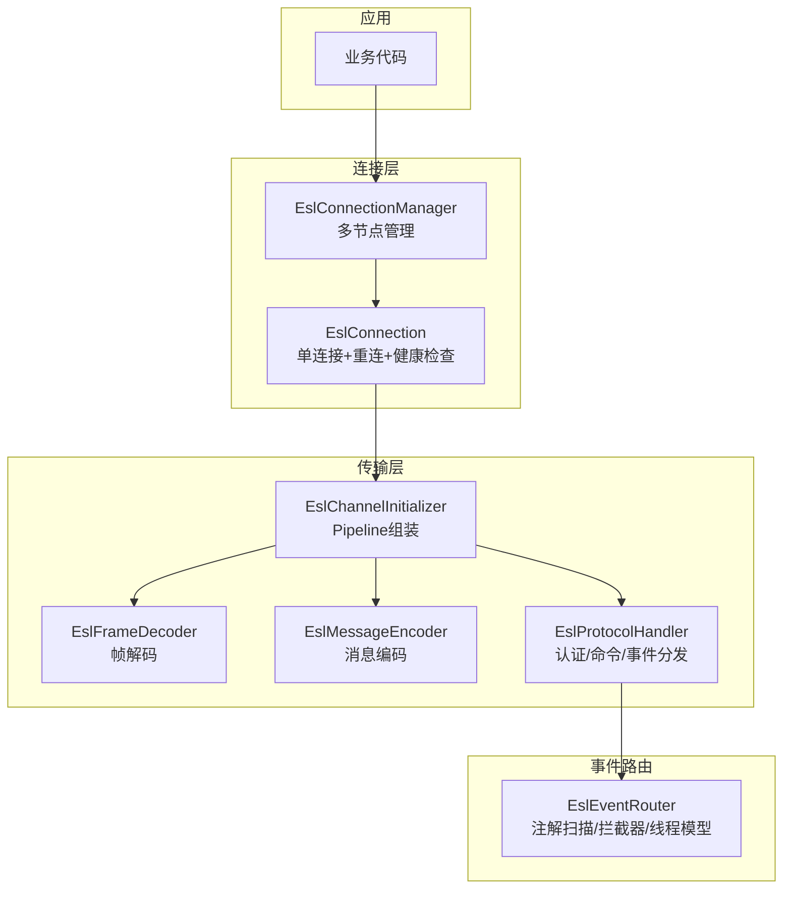
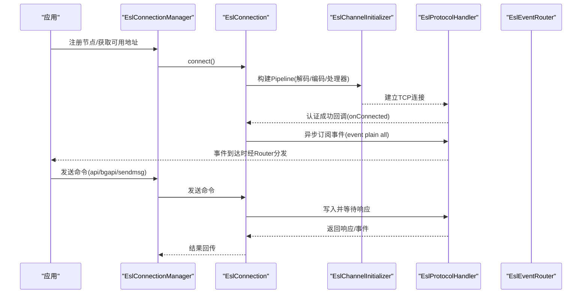
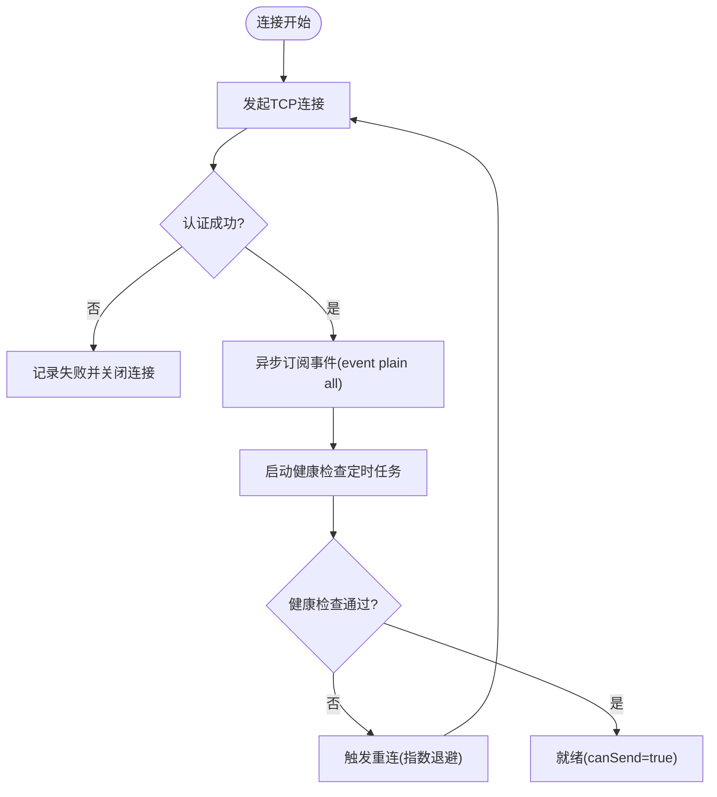
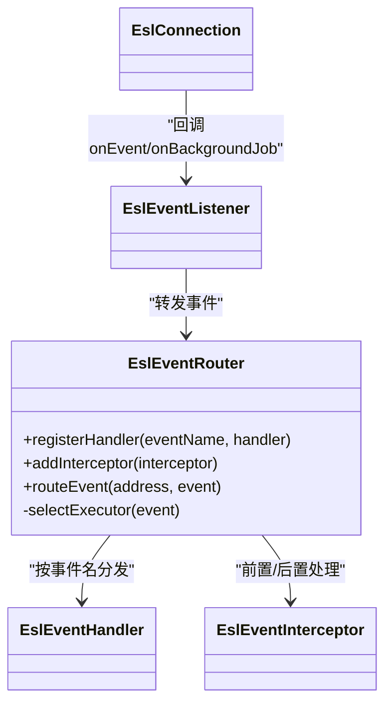
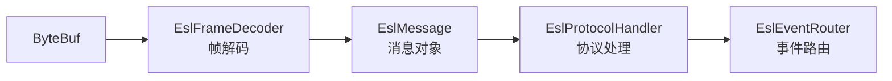
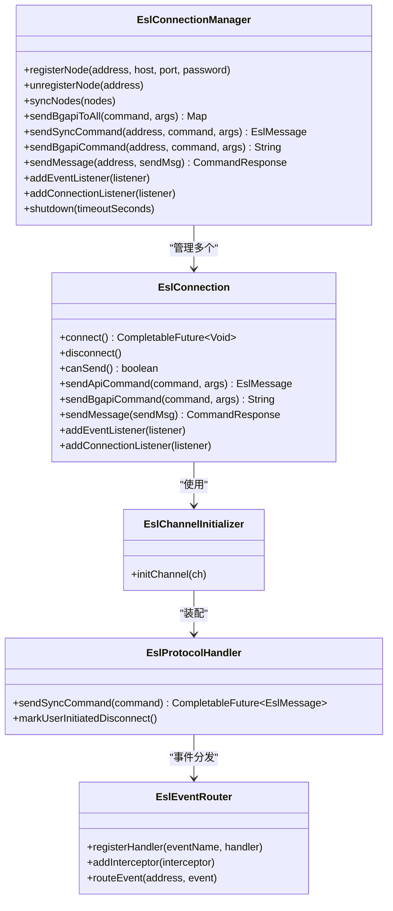
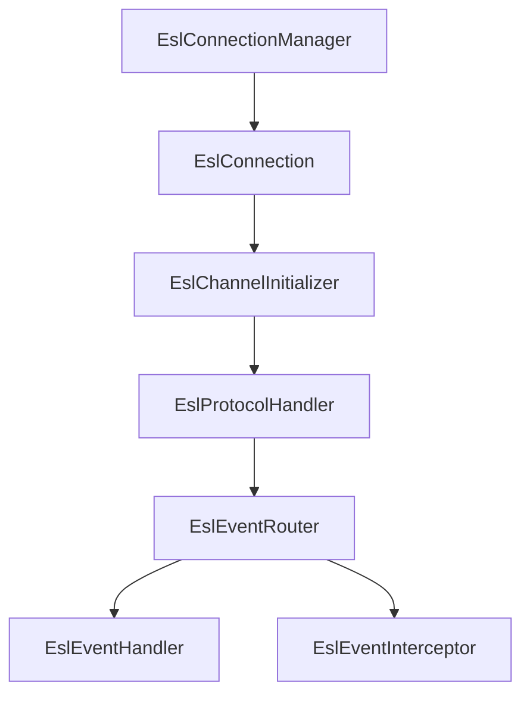
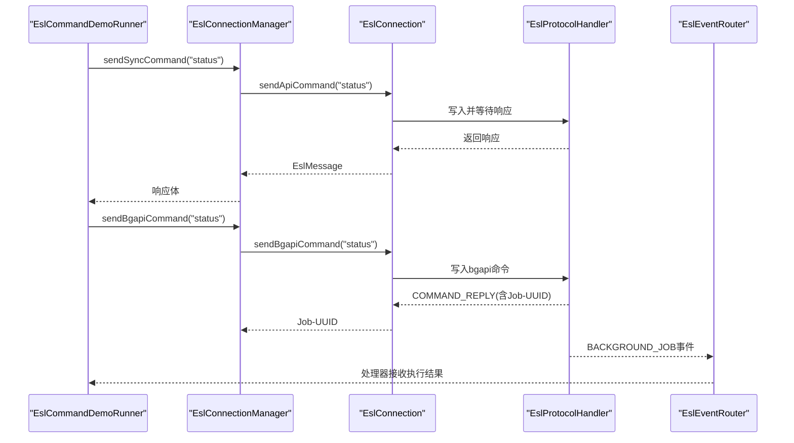

# FreeSWITCH集成

<cite>
**本文引用的文件**
- [EslConnectionManager.java](file://yudao-cloud/yudao-module-cc/ipcc-fs-esl/src/main/java/cn/ipcc/fs/esl/EslConnectionManager.java)
- [EslConnection.java](file://yudao-cloud/yudao-module-cc/ipcc-fs-esl/src/main/java/cn/ipcc/fs/esl/EslConnection.java)
- [EslChannelInitializer.java](file://yudao-cloud/yudao-module-cc/ipcc-fs-esl/src/main/java/cn/ipcc/fs/esl/netty/EslChannelInitializer.java)
- [EslProtocolHandler.java](file://yudao-cloud/yudao-module-cc/ipcc-fs-esl/src/main/java/cn/ipcc/fs/esl/netty/EslProtocolHandler.java)
- [EslFrameDecoder.java](file://yudao-cloud/yudao-module-cc/ipcc-fs-esl/src/main/java/cn/ipcc/fs/esl/netty/EslFrameDecoder.java)
- [EslEventRouter.java](file://yudao-cloud/yudao-module-cc/ipcc-fs-esl/src/main/java/cn/ipcc/fs/esl/router/EslEventRouter.java)
- [EslMessage.java](file://yudao-cloud/yudao-module-cc/ipcc-fs-esl/src/main/java/cn/ipcc/fs/esl/transport/EslMessage.java)
- [EslAutoConfiguration.java](file://yudao-cloud/yudao-module-cc/ipcc-fs-esl/src/main/java/cn/ipcc/fs/esl/spring/EslAutoConfiguration.java)
- [EslCommandDemoRunner.java](file://yudao-cloud/yudao-module-cc/ipcc-fs-esl/example/example-java/src/main/java/cn/ipcc/fs/esl/example/runner/EslCommandDemoRunner.java)
- [application.yml](file://yudao-cloud/yudao-module-cc/ipcc-fs-esl/example/example-java/src/main/resources/application.yml)
- [README.md](file://yudao-cloud/yudao-module-cc/ipcc-fs-esl/README.md)
</cite>

## 目录
1. [简介](#简介)
2. [项目结构](#项目结构)
3. [核心组件](#核心组件)
4. [架构总览](#架构总览)
5. [详细组件分析](#详细组件分析)
6. [依赖关系分析](#依赖关系分析)
7. [性能与调优](#性能与调优)
8. [故障排查指南](#故障排查指南)
9. [结论](#结论)
10. [附录：使用示例与协议要点](#附录使用示例与协议要点)

## 简介
本模块为 FreeSWITCH ESL（Event Socket Library）客户端实现，基于 Netty 4.x 重写传输层，提供连接管理、事件路由、分布式监听权协调与可观测性能力。其目标是替代老旧第三方库，解决兼容性与稳定性问题，并提供高可用、可扩展的 ESL 通信基础设施。

## 项目结构
- 传输层（Netty Pipeline）：帧解码、消息编码、协议处理
- 连接层：单连接管理与多节点连接池管理
- 事件路由层：注解驱动的事件分发、拦截器链、线程模型
- 协调层：基于 Redis 的分布式监听权竞争
- 配置与自动装配：Spring Boot 自动配置与属性绑定
- 示例工程：演示订阅事件、发送命令与处理响应

**图示来源**
- [EslChannelInitializer.java:40-46](file://yudao-cloud/yudao-module-cc/ipcc-fs-esl/src/main/java/cn/ipcc/fs/esl/netty/EslChannelInitializer.java#L40-L46)
- [EslProtocolHandler.java:96-144](file://yudao-cloud/yudao-module-cc/ipcc-fs-esl/src/main/java/cn/ipcc/fs/esl/netty/EslProtocolHandler.java#L96-L144)
- [EslEventRouter.java:43-74](file://yudao-cloud/yudao-module-cc/ipcc-fs-esl/src/main/java/cn/ipcc/fs/esl/router/EslEventRouter.java#L43-L74)

**章节来源**
- [README.md:50-98](file://yudao-cloud/yudao-module-cc/ipcc-fs-esl/README.md#L50-L98)

## 核心组件
- EslConnectionManager：多节点连接池管理、节点选择策略、批量操作、状态聚合回调、动态同步节点列表
- EslConnection：单连接生命周期管理（认证、断开、自动重连、健康检查）、命令发送（api/bgapi/sendmsg）、事件订阅、连接回调
- EslChannelInitializer：Netty Pipeline 组装（解码→编码→协议处理）
- EslProtocolHandler：ESL 协议处理（认证握手、同步命令/响应匹配、事件分发、断开通知）
- EslFrameDecoder：ESL 帧解码（头行读取、Content-Length 体读取、超限保护）
- EslEventRouter：事件路由器（注解扫描、拦截器链、按通道哈希保证顺序、BACKGROUND_JOB 独立线程池）
- EslMessage：ESL 消息对象（头与体）
- EslAutoConfiguration：Spring Boot 自动装配（Bean 创建、监听权协调、事件路由默认桥接）

**章节来源**
- [EslConnectionManager.java:19-28](file://yudao-cloud/yudao-module-cc/ipcc-fs-esl/src/main/java/cn/ipcc/fs/esl/EslConnectionManager.java#L19-L28)
- [EslConnection.java:32-42](file://yudao-cloud/yudao-module-cc/ipcc-fs-esl/src/main/java/cn/ipcc/fs/esl/EslConnection.java#L32-L42)
- [EslChannelInitializer.java:13-21](file://yudao-cloud/yudao-module-cc/ipcc-fs-esl/src/main/java/cn/ipcc/fs/esl/netty/EslChannelInitializer.java#L13-L21)
- [EslProtocolHandler.java:23-38](file://yudao-cloud/yudao-module-cc/ipcc-fs-esl/src/main/java/cn/ipcc/fs/esl/netty/EslProtocolHandler.java#L23-L38)
- [EslFrameDecoder.java:13-28](file://yudao-cloud/yudao-module-cc/ipcc-fs-esl/src/main/java/cn/ipcc/fs/esl/netty/EslFrameDecoder.java#L13-L28)
- [EslEventRouter.java:14-31](file://yudao-cloud/yudao-module-cc/ipcc-fs-esl/src/main/java/cn/ipcc/fs/esl/router/EslEventRouter.java#L14-L31)
- [EslMessage.java:8-15](file://yudao-cloud/yudao-module-cc/ipcc-fs-esl/src/main/java/cn/ipcc/fs/esl/transport/EslMessage.java#L8-L15)
- [EslAutoConfiguration.java:34-49](file://yudao-cloud/yudao-module-cc/ipcc-fs-esl/src/main/java/cn/ipcc/fs/esl/spring/EslAutoConfiguration.java#L34-L49)

## 架构总览
系统采用分层设计：传输层负责字节流到消息的编解码；连接层封装单连接与多节点管理；事件路由层负责事件分发与拦截；协调层提供分布式监听权控制；自动配置层完成 Bean 装配与启动流程。

**图示来源**
- [EslConnection.java:102-140](file://yudao-cloud/yudao-module-cc/ipcc-fs-esl/src/main/java/cn/ipcc/fs/esl/EslConnection.java#L102-L140)
- [EslChannelInitializer.java:40-46](file://yudao-cloud/yudao-module-cc/ipcc-fs-esl/src/main/java/cn/ipcc/fs/esl/netty/EslChannelInitializer.java#L40-L46)
- [EslProtocolHandler.java:116-144](file://yudao-cloud/yudao-module-cc/ipcc-fs-esl/src/main/java/cn/ipcc/fs/esl/netty/EslProtocolHandler.java#L116-L144)
- [EslEventRouter.java:106-153](file://yudao-cloud/yudao-module-cc/ipcc-fs-esl/src/main/java/cn/ipcc/fs/esl/router/EslEventRouter.java#L106-L153)

## 详细组件分析

### ESL 连接管理机制（连接池、状态监控、故障恢复）
- 连接池管理
  - 维护多节点映射，支持动态注册/移除与对账式同步
  - 随机选择可用节点，支持向所有节点广播 bgapi 命令
- 连接状态机
  - DISCONNECTED → CONNECTING → CONNECTED → AUTHENTICATED → RECONNECTING/FAILED
  - canSend() 仅当 AUTHENTICATED 且 Channel 活跃时返回 true
- 健康检查与自动重连
  - 定时发送 status 命令，连续失败阈值触发重连
  - 指数退避 + 随机抖动重连，达到最大次数后标记 FAILED
- 生命周期回调
  - 内部监听器确保认证成功后再切换状态、订阅事件、启动健康检查
  - 用户主动断开不触发重连，区分 FS 主动断开与连接丢失

**图示来源**
- [EslConnection.java:102-140](file://yudao-cloud/yudao-module-cc/ipcc-fs-esl/src/main/java/cn/ipcc/fs/esl/EslConnection.java#L102-L140)
- [EslConnection.java:296-334](file://yudao-cloud/yudao-module-cc/ipcc-fs-esl/src/main/java/cn/ipcc/fs/esl/EslConnection.java#L296-L334)
- [EslConnection.java:340-374](file://yudao-cloud/yudao-module-cc/ipcc-fs-esl/src/main/java/cn/ipcc/fs/esl/EslConnection.java#L340-L374)

**章节来源**
- [EslConnectionManager.java:47-113](file://yudao-cloud/yudao-module-cc/ipcc-fs-esl/src/main/java/cn/ipcc/fs/esl/EslConnectionManager.java#L47-L113)
- [EslConnection.java:46-48](file://yudao-cloud/yudao-module-cc/ipcc-fs-esl/src/main/java/cn/ipcc/fs/esl/EslConnection.java#L46-L48)
- [EslConnection.java:142-167](file://yudao-cloud/yudao-module-cc/ipcc-fs-esl/src/main/java/cn/ipcc/fs/esl/EslConnection.java#L142-L167)
- [EslConnection.java:296-334](file://yudao-cloud/yudao-module-cc/ipcc-fs-esl/src/main/java/cn/ipcc/fs/esl/EslConnection.java#L296-L334)
- [EslConnection.java:340-374](file://yudao-cloud/yudao-module-cc/ipcc-fs-esl/src/main/java/cn/ipcc/fs/esl/EslConnection.java#L340-L374)

### ESL 事件处理系统（监听器注册、事件路由、异步处理）
- 监听器注册
  - Spring 容器自动收集 EslEventListener/EslConnectionListener 并注入管理器
  - 若无自定义监听器，则注册默认桥接将事件转发至路由器
- 事件路由
  - 启动时扫描 @EslEventName 标注的处理器，建立事件名→处理器映射
  - 支持拦截器链（beforeHandle/afterHandle），异常隔离，统计路由计数
- 线程模型
  - CHANNEL_HASH：按 Unique-ID 哈希到固定线程，保证同通道事件顺序
  - SINGLE_THREAD/FULL_CONCURRENT：单线程或全并发模式
  - BACKGROUND_JOB：独立线程池，避免与普通事件互相阻塞

**图示来源**
- [EslEventRouter.java:43-74](file://yudao-cloud/yudao-module-cc/ipcc-fs-esl/src/main/java/cn/ipcc/fs/esl/router/EslEventRouter.java#L43-L74)
- [EslEventRouter.java:106-153](file://yudao-cloud/yudao-module-cc/ipcc-fs-esl/src/main/java/cn/ipcc/fs/esl/router/EslEventRouter.java#L106-L153)
- [EslAutoConfiguration.java:171-214](file://yudao-cloud/yudao-module-cc/ipcc-fs-esl/src/main/java/cn/ipcc/fs/esl/spring/EslAutoConfiguration.java#L171-L214)

**章节来源**
- [EslEventRouter.java:14-31](file://yudao-cloud/yudao-module-cc/ipcc-fs-esl/src/main/java/cn/ipcc/fs/esl/router/EslEventRouter.java#L14-L31)
- [EslEventRouter.java:106-153](file://yudao-cloud/yudao-module-cc/ipcc-fs-esl/src/main/java/cn/ipcc/fs/esl/router/EslEventRouter.java#L106-L153)
- [EslAutoConfiguration.java:171-214](file://yudao-cloud/yudao-module-cc/ipcc-fs-esl/src/main/java/cn/ipcc/fs/esl/spring/EslAutoConfiguration.java#L171-L214)

### Netty 网络框架在 ESL 通信中的应用（TCP、编解码、背压）
- TCP 连接管理
  - Bootstrap 配置 NIO 线程组、SO_KEEPALIVE、连接超时
  - 每个连接独立 EventLoopGroup，避免资源泄漏
- 消息编解码
  - EslFrameDecoder：按行读取消息头，解析 Content-Length 读取消息体，支持 UTF-8，超限保护
  - EslMessageEncoder：将字符串命令编码为字节
  - EslProtocolHandler：认证握手、命令响应匹配、事件分发、断开通知
- 背压与限流
  - 解码阶段限制最大帧大小与消息头行数，防止 OOM
  - 事件路由队列容量与拒绝策略（CALLER_RUNS/ABORT/DISCARD）控制吞吐

**图示来源**
- [EslChannelInitializer.java:40-46](file://yudao-cloud/yudao-module-cc/ipcc-fs-esl/src/main/java/cn/ipcc/fs/esl/netty/EslChannelInitializer.java#L40-L46)
- [EslFrameDecoder.java:42-91](file://yudao-cloud/yudao-module-cc/ipcc-fs-esl/src/main/java/cn/ipcc/fs/esl/netty/EslFrameDecoder.java#L42-L91)
- [EslProtocolHandler.java:96-144](file://yudao-cloud/yudao-module-cc/ipcc-fs-esl/src/main/java/cn/ipcc/fs/esl/netty/EslProtocolHandler.java#L96-L144)

**章节来源**
- [EslConnection.java:114-120](file://yudao-cloud/yudao-module-cc/ipcc-fs-esl/src/main/java/cn/ipcc/fs/esl/EslConnection.java#L114-L120)
- [EslFrameDecoder.java:13-28](file://yudao-cloud/yudao-module-cc/ipcc-fs-esl/src/main/java/cn/ipcc/fs/esl/netty/EslFrameDecoder.java#L13-L28)
- [EslProtocolHandler.java:23-38](file://yudao-cloud/yudao-module-cc/ipcc-fs-esl/src/main/java/cn/ipcc/fs/esl/netty/EslProtocolHandler.java#L23-L38)

### 关键类图（代码级）

**图示来源**
- [EslConnectionManager.java:47-205](file://yudao-cloud/yudao-module-cc/ipcc-fs-esl/src/main/java/cn/ipcc/fs/esl/EslConnectionManager.java#L47-L205)
- [EslConnection.java:102-269](file://yudao-cloud/yudao-module-cc/ipcc-fs-esl/src/main/java/cn/ipcc/fs/esl/EslConnection.java#L102-L269)
- [EslChannelInitializer.java:40-46](file://yudao-cloud/yudao-module-cc/ipcc-fs-esl/src/main/java/cn/ipcc/fs/esl/netty/EslChannelInitializer.java#L40-L46)
- [EslProtocolHandler.java:96-144](file://yudao-cloud/yudao-module-cc/ipcc-fs-esl/src/main/java/cn/ipcc/fs/esl/netty/EslProtocolHandler.java#L96-L144)
- [EslEventRouter.java:76-153](file://yudao-cloud/yudao-module-cc/ipcc-fs-esl/src/main/java/cn/ipcc/fs/esl/router/EslEventRouter.java#L76-L153)

## 依赖关系分析
- 组件耦合
  - EslConnectionManager 依赖 EslConnection，集中管理多节点
  - EslConnection 依赖 Netty Pipeline（EslChannelInitializer/EslProtocolHandler）
  - EslProtocolHandler 依赖 EslEventRouter 进行事件分发
- 外部依赖
  - Spring Boot 自动配置（条件装配、Bean 收集）
  - Redis（分布式监听权协调，可选）
- 循环依赖
  - 未发现直接循环依赖；通过接口与事件解耦

**图示来源**
- [EslConnectionManager.java:47-205](file://yudao-cloud/yudao-module-cc/ipcc-fs-esl/src/main/java/cn/ipcc/fs/esl/EslConnectionManager.java#L47-L205)
- [EslConnection.java:102-269](file://yudao-cloud/yudao-module-cc/ipcc-fs-esl/src/main/java/cn/ipcc/fs/esl/EslConnection.java#L102-L269)
- [EslEventRouter.java:76-153](file://yudao-cloud/yudao-module-cc/ipcc-fs-esl/src/main/java/cn/ipcc/fs/esl/router/EslEventRouter.java#L76-L153)

**章节来源**
- [EslAutoConfiguration.java:88-127](file://yudao-cloud/yudao-module-cc/ipcc-fs-esl/src/main/java/cn/ipcc/fs/esl/spring/EslAutoConfiguration.java#L88-L127)

## 性能与调优
- 连接与线程
  - 合理设置 netty-worker-threads，避免 IO 瓶颈
  - 事件执行模式推荐 CHANNEL_HASH，保证同通道事件顺序
  - 调整 event-thread-pool-size 与 event-queue-capacity，结合负载评估
- 超时与重试
  - 设置 connect-timeout-seconds 与 command-timeout-seconds，避免长阻塞
  - 配置 max-reconnect-attempts、reconnect-base-delay-seconds、reconnect-max-delay-seconds，平衡恢复速度与风暴抑制
- 背压与防护
  - 限制 max-frame-size 与 max-header-lines，防止 OOM 与放大攻击
  - 事件拒绝策略根据场景选择 CALLER_RUNS/ABORT/DISCARD
- 健康检查
  - 启用 health-check-interval-seconds 与 failure-threshold，及时感知假死连接

[本节为通用指导，无需特定文件引用]

## 故障排查指南
- 连接失败
  - 检查 host/port/password 与防火墙；查看连接日志与异常堆栈
  - 确认 canSend() 返回 true 后再发送命令
- 认证失败
  - 认证失败超过阈值会关闭连接；检查密码与权限
  - 关注 onAuthFailed 回调与日志
- 命令超时
  - 检查 command-timeout-seconds 是否过小；定位 FS 侧处理耗时
  - 长时间命令建议使用 bgapi，避免阻塞调用线程
- 事件未处理
  - 确认已注册对应事件处理器（@EslEventName）
  - 检查拦截器 beforeHandle 是否返回 false 导致中断
- 健康检查频繁触发重连
  - 调整 health-check-interval-seconds 与 failure-threshold
  - 观察 FS 负载与网络抖动

**章节来源**
- [EslProtocolHandler.java:147-158](file://yudao-cloud/yudao-module-cc/ipcc-fs-esl/src/main/java/cn/ipcc/fs/esl/netty/EslProtocolHandler.java#L147-L158)
- [EslConnection.java:296-334](file://yudao-cloud/yudao-module-cc/ipcc-fs-esl/src/main/java/cn/ipcc/fs/esl/EslConnection.java#L296-L334)
- [EslConnection.java:340-374](file://yudao-cloud/yudao-module-cc/ipcc-fs-esl/src/main/java/cn/ipcc/fs/esl/EslConnection.java#L340-L374)

## 结论
本模块以 Netty 为核心重构 ESL 通信栈，提供健壮的连接管理、可靠的事件路由与分布式协调能力。通过合理的配置与扩展点，可在生产环境稳定运行并满足高并发、低延迟的需求。建议在生产中启用健康检查与指标监控，并结合业务场景调优线程与队列参数。

[本节为总结性内容，无需特定文件引用]

## 附录：使用示例与协议要点

### 订阅 FreeSWITCH 事件
- 实现 EslEventHandler 并标注 @EslEventName，由自动配置扫描注册
- 或通过实现 EslEventListener 接收 onEvent/onBackgroundJob（注意：自定义监听器会覆盖默认路由桥接）

**章节来源**
- [EslAutoConfiguration.java:171-214](file://yudao-cloud/yudao-module-cc/ipcc-fs-esl/src/main/java/cn/ipcc/fs/esl/spring/EslAutoConfiguration.java#L171-L214)
- [README.md:185-262](file://yudao-cloud/yudao-module-cc/ipcc-fs-esl/README.md#L185-L262)

### 发送命令与处理响应
- 同步命令：sendSyncCommand("status", null)，返回 EslMessage 包含响应体
- 异步命令：sendBgapiCommand("status", null)，返回 Job-UUID，实际结果通过 BACKGROUND_JOB 事件路由
- 通道操作：sendMessage(SendMsg)，用于 sendmsg 等通道指令

**图示来源**
- [EslCommandDemoRunner.java:57-77](file://yudao-cloud/yudao-module-cc/ipcc-fs-esl/example/example-java/src/main/java/cn/ipcc/fs/esl/example/runner/EslCommandDemoRunner.java#L57-L77)
- [EslConnection.java:179-252](file://yudao-cloud/yudao-module-cc/ipcc-fs-esl/src/main/java/cn/ipcc/fs/esl/EslConnection.java#L179-L252)
- [EslProtocolHandler.java:116-144](file://yudao-cloud/yudao-module-cc/ipcc-fs-esl/src/main/java/cn/ipcc/fs/esl/netty/EslProtocolHandler.java#L116-L144)

**章节来源**
- [EslCommandDemoRunner.java:25-77](file://yudao-cloud/yudao-module-cc/ipcc-fs-esl/example/example-java/src/main/java/cn/ipcc/fs/esl/example/runner/EslCommandDemoRunner.java#L25-L77)

### ESL 协议规范要点
- 命令前缀
  - API 命令需以 "api " 前缀发送（如 api originate）
  - bgapi 为独立命令类型，格式 "bgapi <command> <args>"
- 消息结构
  - 消息头以空行结束，可选消息体由 Content-Length 指定
  - 认证响应在 Reply-Text 头中（"+OK" 表示成功）
- 事件订阅
  - 认证成功后异步发送 "event plain all" 订阅所有事件
- 断开通知
  - FS 发送 disconnect-notice 时记录原因并在 channelInactive 统一通知

**章节来源**
- [EslConnection.java:179-252](file://yudao-cloud/yudao-module-cc/ipcc-fs-esl/src/main/java/cn/ipcc/fs/esl/EslConnection.java#L179-L252)
- [EslProtocolHandler.java:147-213](file://yudao-cloud/yudao-module-cc/ipcc-fs-esl/src/main/java/cn/ipcc/fs/esl/netty/EslProtocolHandler.java#L147-L213)
- [EslFrameDecoder.java:42-91](file://yudao-cloud/yudao-module-cc/ipcc-fs-esl/src/main/java/cn/ipcc/fs/esl/netty/EslFrameDecoder.java#L42-L91)

### 配置参考
- 示例配置见 application.yml，涵盖连接、重连、健康检查、事件执行器与分布式协调参数
- 完整配置项说明参见 README 配置表

**章节来源**
- [application.yml:10-39](file://yudao-cloud/yudao-module-cc/ipcc-fs-esl/example/example-java/src/main/resources/application.yml#L10-L39)
- [README.md:153-179](file://yudao-cloud/yudao-module-cc/ipcc-fs-esl/README.md#L153-L179)