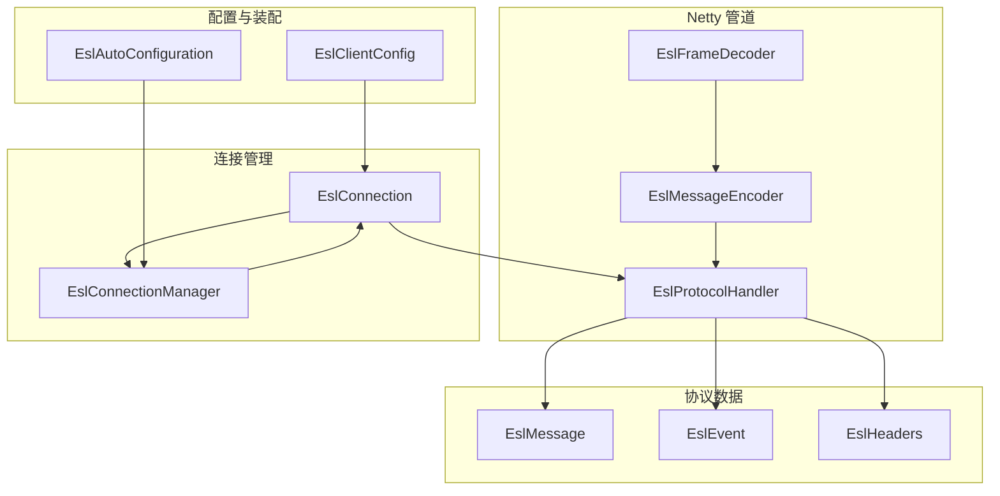
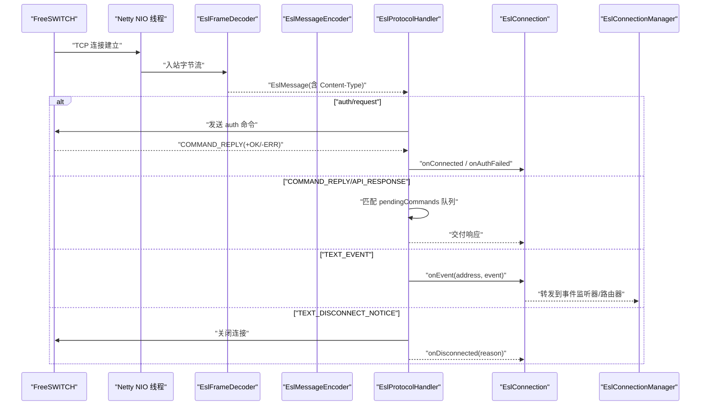
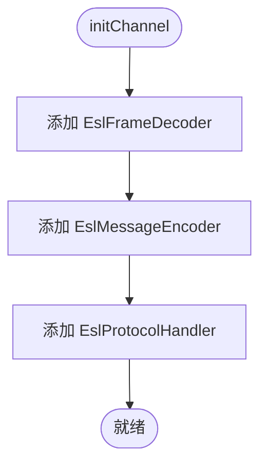
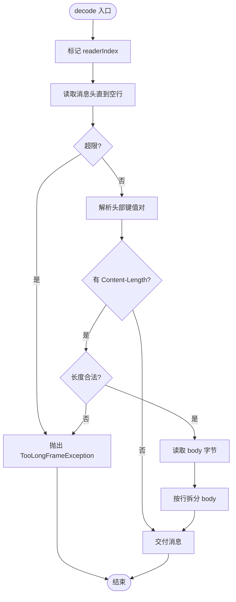
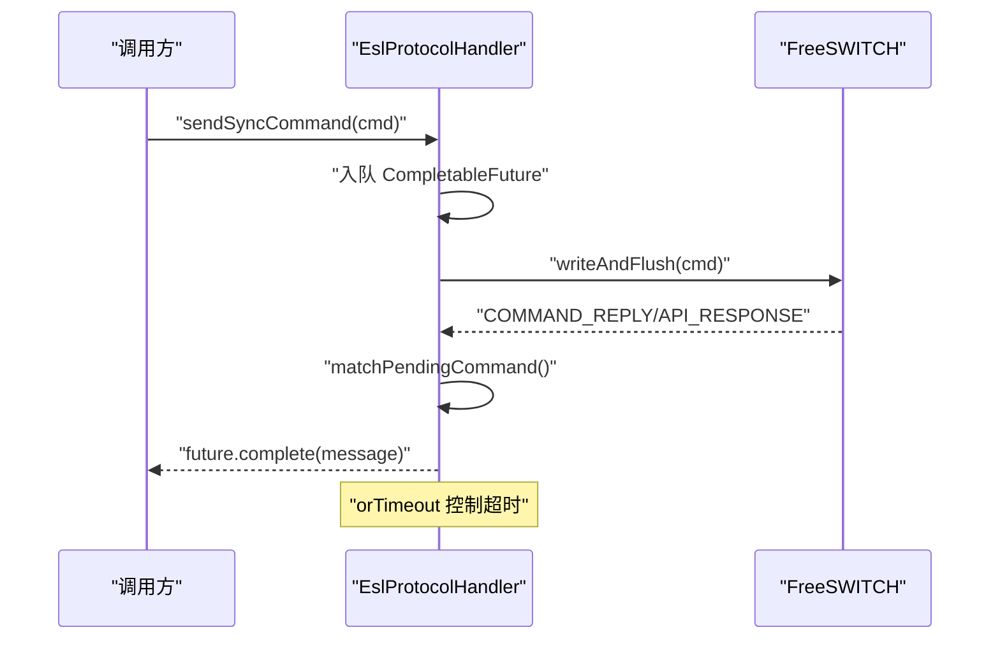
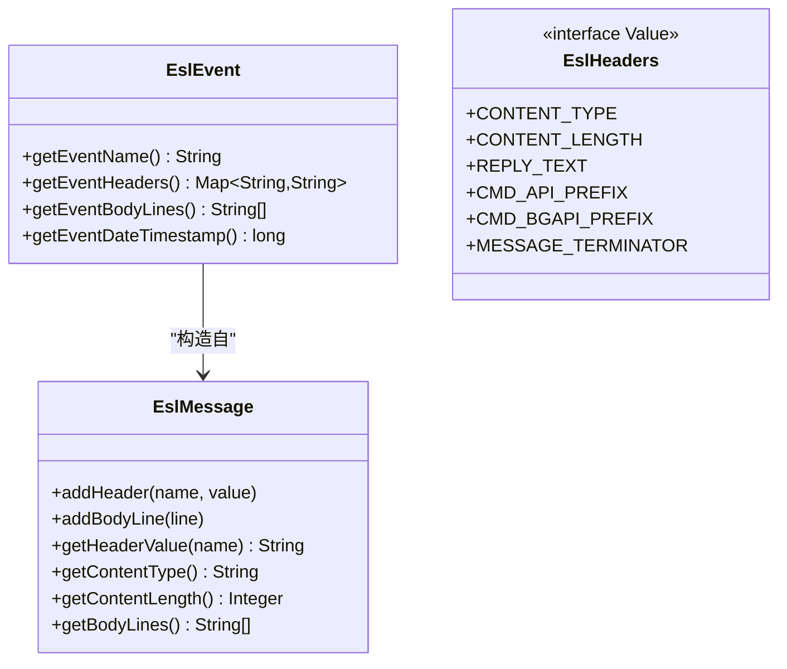
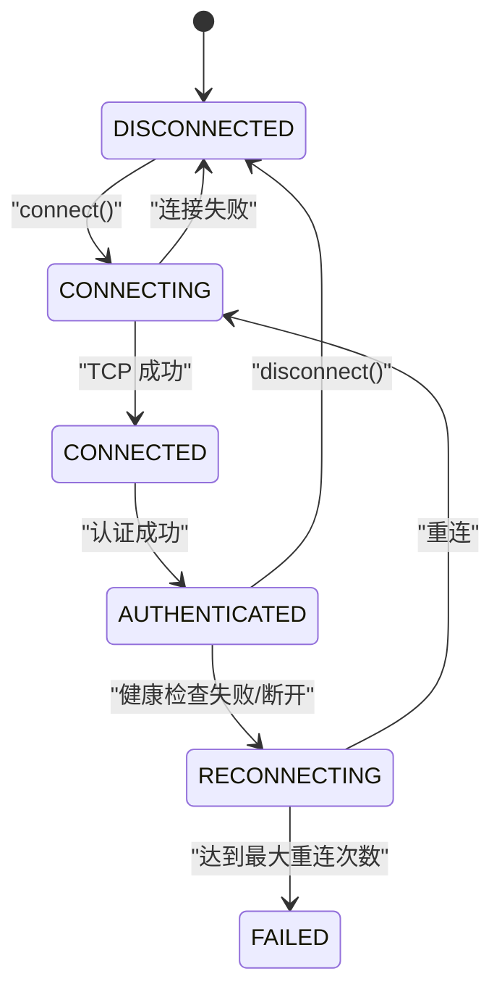
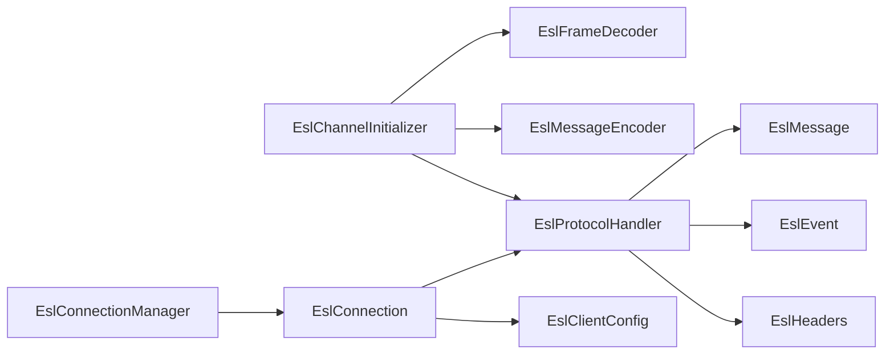

# Netty网络层

<cite>
**本文引用的文件**
- [EslChannelInitializer.java](file://yudao-cloud/yudao-module-cc/ipcc-fs-esl/src/main/java/cn/ipcc/fs/esl/netty/EslChannelInitializer.java)
- [EslFrameDecoder.java](file://yudao-cloud/yudao-module-cc/ipcc-fs-esl/src/main/java/cn/ipcc/fs/esl/netty/EslFrameDecoder.java)
- [EslMessageEncoder.java](file://yudao-cloud/yudao-module-cc/ipcc-fs-esl/src/main/java/cn/ipcc/fs/esl/netty/EslMessageEncoder.java)
- [EslProtocolHandler.java](file://yudao-cloud/yudao-module-cc/ipcc-fs-esl/src/main/java/cn/ipcc/fs/esl/netty/EslProtocolHandler.java)
- [EslMessage.java](file://yudao-cloud/yudao-module-cc/ipcc-fs-esl/src/main/java/cn/ipcc/fs/esl/transport/EslMessage.java)
- [EslEvent.java](file://yudao-cloud/yudao-module-cc/ipcc-fs-esl/src/main/java/cn/ipcc/fs/esl/transport/EslEvent.java)
- [EslHeaders.java](file://yudao-cloud/yudao-module-cc/ipcc-fs-esl/src/main/java/cn/ipcc/fs/esl/transport/EslHeaders.java)
- [EslClientConfig.java](file://yudao-cloud/yudao-module-cc/ipcc-fs-esl/src/main/java/cn/ipcc/fs/esl/EslClientConfig.java)
- [EslConnection.java](file://yudao-cloud/yudao-module-cc/ipcc-fs-esl/src/main/java/cn/ipcc/fs/esl/EslConnection.java)
- [EslConnectionManager.java](file://yudao-cloud/yudao-module-cc/ipcc-fs-esl/src/main/java/cn/ipcc/fs/esl/EslConnectionManager.java)
- [EslAutoConfiguration.java](file://yudao-cloud/yudao-module-cc/ipcc-fs-esl/src/main/java/cn/ipcc/fs/esl/spring/EslAutoConfiguration.java)
</cite>

## 目录
1. [简介](#简介)
2. [项目结构](#项目结构)
3. [核心组件](#核心组件)
4. [架构总览](#架构总览)
5. [详细组件分析](#详细组件分析)
6. [依赖关系分析](#依赖关系分析)
7. [性能与配置优化](#性能与配置优化)
8. [故障诊断与监控](#故障诊断与监控)
9. [结论](#结论)
10. [附录：扩展指南](#附录扩展指南)

## 简介
本技术文档聚焦于 FreeSWITCH ESL（Event Socket Layer）的 Netty 网络层实现，围绕 EslClientChannel 的设计模式展开，系统阐述 Channel 生命周期管理、事件循环配置与管道处理器链；深入解析消息编解码器对 ESL 协议帧格式、序列化机制与版本兼容性的处理；并提供 Netty 配置优化建议（缓冲区、连接池、性能参数）、扩展示例（自定义消息处理器、编解码器、异常处理）以及网络监控、性能分析与故障诊断方法。

## 项目结构
该模块采用分层组织：
- 传输与协议层：EslMessage、EslEvent、EslHeaders 定义协议数据模型与常量；EslFrameDecoder/EslMessageEncoder 负责字节流与消息对象的编解码；EslProtocolHandler 实现认证、命令响应匹配、事件分发与断开通知。
- 连接管理层：EslConnection 封装单节点连接的生命周期（连接、认证、重连、健康检查、事件订阅）；EslConnectionManager 管理多节点注册、选择策略与批量操作。
- 配置与装配：EslClientConfig 提供可配置的超时、帧大小、线程数、重连与健康检查等参数；EslAutoConfiguration 将 Spring 属性映射为配置并装配连接管理器、路由与指标拦截器。
- 事件路由与监听：通过监听器接口与路由器将事件分发给业务处理器，支持拦截器链与指标统计。

图表来源
- [EslChannelInitializer.java:13-46](file://yudao-cloud/yudao-module-cc/ipcc-fs-esl/src/main/java/cn/ipcc/fs/esl/netty/EslChannelInitializer.java#L13-L46)
- [EslProtocolHandler.java:23-40](file://yudao-cloud/yudao-module-cc/ipcc-fs-esl/src/main/java/cn/ipcc/fs/esl/netty/EslProtocolHandler.java#L23-L40)
- [EslConnection.java:32-48](file://yudao-cloud/yudao-module-cc/ipcc-fs-esl/src/main/java/cn/ipcc/fs/esl/EslConnection.java#L32-L48)
- [EslConnectionManager.java:19-31](file://yudao-cloud/yudao-module-cc/ipcc-fs-esl/src/main/java/cn/ipcc/fs/esl/EslConnectionManager.java#L19-L31)
- [EslClientConfig.java:5-11](file://yudao-cloud/yudao-module-cc/ipcc-fs-esl/src/main/java/cn/ipcc/fs/esl/EslClientConfig.java#L5-L11)
- [EslAutoConfiguration.java:34-49](file://yudao-cloud/yudao-module-cc/ipcc-fs-esl/src/main/java/cn/ipcc/fs/esl/spring/EslAutoConfiguration.java#L34-L49)

章节来源
- [EslChannelInitializer.java:13-46](file://yudao-cloud/yudao-module-cc/ipcc-fs-esl/src/main/java/cn/ipcc/fs/esl/netty/EslChannelInitializer.java#L13-L46)
- [EslConnection.java:32-48](file://yudao-cloud/yudao-module-cc/ipcc-fs-esl/src/main/java/cn/ipcc/fs/esl/EslConnection.java#L32-L48)
- [EslConnectionManager.java:19-31](file://yudao-cloud/yudao-module-cc/ipcc-fs-esl/src/main/java/cn/ipcc/fs/esl/EslConnectionManager.java#L19-L31)
- [EslClientConfig.java:5-11](file://yudao-cloud/yudao-module-cc/ipcc-fs-esl/src/main/java/cn/ipcc/fs/esl/EslClientConfig.java#L5-L11)
- [EslAutoConfiguration.java:34-49](file://yudao-cloud/yudao-module-cc/ipcc-fs-esl/src/main/java/cn/ipcc/fs/esl/spring/EslAutoConfiguration.java#L34-L49)

## 核心组件
- EslChannelInitializer：组装 Inbound 模式的 Netty Pipeline，顺序为帧解码、编码器、协议处理器。
- EslFrameDecoder：基于 ByteToMessageDecoder 实现 ESL 帧解析，按行读取消息头，依据 Content-Length 读取消息体，具备防放大与 OOM 保护。
- EslMessageEncoder：将字符串命令编码为 UTF-8 字节，支持跨 Channel 共享。
- EslProtocolHandler：实现认证流程、同步命令/响应匹配（CompletableFuture + orTimeout）、事件分发、断开通知与异常处理。
- EslMessage/EslEvent/EslHeaders：ESL 协议的数据结构与常量定义，保持与旧库 API 兼容。
- EslConnection：单节点连接生命周期管理（连接、认证、重连、健康检查、事件订阅），提供 API/bgapi/sendmsg 发送能力。
- EslConnectionManager：多节点连接管理、节点选择与批量操作。
- EslClientConfig：集中配置项（超时、帧大小、线程数、重连策略、健康检查、事件执行器等）。
- EslAutoConfiguration：Spring Boot 自动装配，绑定配置、创建 Bean、注册监听器与路由器。

章节来源
- [EslChannelInitializer.java:13-46](file://yudao-cloud/yudao-module-cc/ipcc-fs-esl/src/main/java/cn/ipcc/fs/esl/netty/EslChannelInitializer.java#L13-L46)
- [EslFrameDecoder.java:13-28](file://yudao-cloud/yudao-module-cc/ipcc-fs-esl/src/main/java/cn/ipcc/fs/esl/netty/EslFrameDecoder.java#L13-L28)
- [EslMessageEncoder.java:8-14](file://yudao-cloud/yudao-module-cc/ipcc-fs-esl/src/main/java/cn/ipcc/fs/esl/netty/EslMessageEncoder.java#L8-L14)
- [EslProtocolHandler.java:23-40](file://yudao-cloud/yudao-module-cc/ipcc-fs-esl/src/main/java/cn/ipcc/fs/esl/netty/EslProtocolHandler.java#L23-L40)
- [EslMessage.java:8-15](file://yudao-cloud/yudao-module-cc/ipcc-fs-esl/src/main/java/cn/ipcc/fs/esl/transport/EslMessage.java#L8-L15)
- [EslEvent.java:10-17](file://yudao-cloud/yudao-module-cc/ipcc-fs-esl/src/main/java/cn/ipcc/fs/esl/transport/EslEvent.java#L10-L17)
- [EslHeaders.java:3-7](file://yudao-cloud/yudao-module-cc/ipcc-fs-esl/src/main/java/cn/ipcc/fs/esl/transport/EslHeaders.java#L3-L7)
- [EslConnection.java:32-48](file://yudao-cloud/yudao-module-cc/ipcc-fs-esl/src/main/java/cn/ipcc/fs/esl/EslConnection.java#L32-L48)
- [EslConnectionManager.java:19-31](file://yudao-cloud/yudao-module-cc/ipcc-fs-esl/src/main/java/cn/ipcc/fs/esl/EslConnectionManager.java#L19-L31)
- [EslClientConfig.java:5-11](file://yudao-cloud/yudao-module-cc/ipcc-fs-esl/src/main/java/cn/ipcc/fs/esl/EslClientConfig.java#L5-L11)
- [EslAutoConfiguration.java:34-49](file://yudao-cloud/yudao-module-cc/ipcc-fs-esl/src/main/java/cn/ipcc/fs/esl/spring/EslAutoConfiguration.java#L34-L49)

## 架构总览
下图展示了从 TCP 连接到业务事件处理的端到端流程，包括管道装配、协议处理、事件分发与连接管理。

图表来源
- [EslChannelInitializer.java:40-46](file://yudao-cloud/yudao-module-cc/ipcc-fs-esl/src/main/java/cn/ipcc/fs/esl/netty/EslChannelInitializer.java#L40-L46)
- [EslFrameDecoder.java:42-91](file://yudao-cloud/yudao-module-cc/ipcc-fs-esl/src/main/java/cn/ipcc/fs/esl/netty/EslFrameDecoder.java#L42-L91)
- [EslProtocolHandler.java:109-144](file://yudao-cloud/yudao-module-cc/ipcc-fs-esl/src/main/java/cn/ipcc/fs/esl/netty/EslProtocolHandler.java#L109-L144)
- [EslConnection.java:102-140](file://yudao-cloud/yudao-module-cc/ipcc-fs-esl/src/main/java/cn/ipcc/fs/esl/EslConnection.java#L102-L140)
- [EslConnectionManager.java:54-68](file://yudao-cloud/yudao-module-cc/ipcc-fs-esl/src/main/java/cn/ipcc/fs/esl/EslConnectionManager.java#L54-L68)

## 详细组件分析

### EslChannelInitializer：Pipeline 装配与生命周期入口
- 职责：在 SocketChannel 激活时按序添加帧解码器、编码器与协议处理器。
- 关键点：
  - 帧解码器使用最大帧大小与最大消息头行数限制，防止恶意或异常报文导致资源耗尽。
  - 编码器为 Sharable，可在多个 Channel 间复用。
  - 协议处理器持有地址、密码、配置与监听器列表，负责认证、命令匹配与事件分发。

图表来源
- [EslChannelInitializer.java:40-46](file://yudao-cloud/yudao-module-cc/ipcc-fs-esl/src/main/java/cn/ipcc/fs/esl/netty/EslChannelInitializer.java#L40-L46)

章节来源
- [EslChannelInitializer.java:13-46](file://yudao-cloud/yudao-module-cc/ipcc-fs-esl/src/main/java/cn/ipcc/fs/esl/netty/EslChannelInitializer.java#L13-L46)

### EslFrameDecoder：ESL 帧解析与安全边界
- 算法：
  - 阶段一：逐行读取消息头，遇到空行结束；累计字节数与行数超过阈值抛出 TooLongFrameException。
  - 阶段二：若存在 Content-Length，校验范围后读取指定字节作为消息体；否则直接交付消息。
- 兼容性：支持 \r\n 与 \n 换行符，UTF-8 多字节字符。
- 安全：maxFrameSize 与 maxHeaderLines 双重保护，避免 OOM 与 header 放大攻击。

图表来源
- [EslFrameDecoder.java:42-91](file://yudao-cloud/yudao-module-cc/ipcc-fs-esl/src/main/java/cn/ipcc/fs/esl/netty/EslFrameDecoder.java#L42-L91)
- [EslFrameDecoder.java:97-113](file://yudao-cloud/yudao-module-cc/ipcc-fs-esl/src/main/java/cn/ipcc/fs/esl/netty/EslFrameDecoder.java#L97-L113)

章节来源
- [EslFrameDecoder.java:13-28](file://yudao-cloud/yudao-module-cc/ipcc-fs-esl/src/main/java/cn/ipcc/fs/esl/netty/EslFrameDecoder.java#L13-L28)
- [EslFrameDecoder.java:42-91](file://yudao-cloud/yudao-module-cc/ipcc-fs-esl/src/main/java/cn/ipcc/fs/esl/netty/EslFrameDecoder.java#L42-L91)
- [EslFrameDecoder.java:97-113](file://yudao-cloud/yudao-module-cc/ipcc-fs-esl/src/main/java/cn/ipcc/fs/esl/netty/EslFrameDecoder.java#L97-L113)

### EslMessageEncoder：字符串到字节的编码
- 设计为 @Sharable，将包含终止符的命令字符串以 UTF-8 写入 ByteBuf。
- 简单高效，无状态，适合高并发场景。

章节来源
- [EslMessageEncoder.java:8-19](file://yudao-cloud/yudao-module-cc/ipcc-fs-esl/src/main/java/cn/ipcc/fs/esl/netty/EslMessageEncoder.java#L8-L19)

### EslProtocolHandler：认证、命令匹配、事件分发与断开处理
- 认证流程：
  - 收到 auth/request 后发送认证命令，设置 authPending 标志。
  - 收到 COMMAND_REPLY 时优先作为认证响应处理，+OK 触发 onConnected，-ERR 触发 onAuthFailed 并关闭连接。
- 命令/响应匹配：
  - sendSyncCommand 将 CompletableFuture 加入 pendingCommands 队列，并通过 channel.eventLoop().execute() 串行化发送，保证 FIFO。
  - 响应到达时从队列头部 poll future，跳过已超时/取消的 future，确保不错位。
  - 使用 orTimeout 控制命令超时。
- 事件分发：
  - 区分 BACKGROUND_JOB 与其他事件，分别回调不同监听器。
- 断开处理：
  - 收到 disconnect-notice 记录原因并关闭连接，channelInactive 统一通知 onDisconnected。
  - 用户主动断开通过 markUserInitiatedDisconnect 避免重复通知。

图表来源
- [EslProtocolHandler.java:92-107](file://yudao-cloud/yudao-module-cc/ipcc-fs-esl/src/main/java/cn/ipcc/fs/esl/netty/EslProtocolHandler.java#L92-L107)
- [EslProtocolHandler.java:168-182](file://yudao-cloud/yudao-module-cc/ipcc-fs-esl/src/main/java/cn/ipcc/fs/esl/netty/EslProtocolHandler.java#L168-L182)

章节来源
- [EslProtocolHandler.java:23-40](file://yudao-cloud/yudao-module-cc/ipcc-fs-esl/src/main/java/cn/ipcc/fs/esl/netty/EslProtocolHandler.java#L23-L40)
- [EslProtocolHandler.java:109-144](file://yudao-cloud/yudao-module-cc/ipcc-fs-esl/src/main/java/cn/ipcc/fs/esl/netty/EslProtocolHandler.java#L109-L144)
- [EslProtocolHandler.java:146-213](file://yudao-cloud/yudao-module-cc/ipcc-fs-esl/src/main/java/cn/ipcc/fs/esl/netty/EslProtocolHandler.java#L146-L213)
- [EslProtocolHandler.java:215-265](file://yudao-cloud/yudao-module-cc/ipcc-fs-esl/src/main/java/cn/ipcc/fs/esl/netty/EslProtocolHandler.java#L215-L265)

### 数据模型：EslMessage、EslEvent、EslHeaders
- EslMessage：消息头 Map（保序）与消息体行列表；提供 getContentType/getContentLength/hasContentLength 等方法。
- EslEvent：从原始消息体解析事件头与事件体，支持 URL 解码与时间戳提取；兼容 plain/json 两种事件格式。
- EslHeaders：定义协议常量（命令前缀、响应前缀、Content-Type 值、消息终止符等）。

图表来源
- [EslMessage.java:18-109](file://yudao-cloud/yudao-module-cc/ipcc-fs-esl/src/main/java/cn/ipcc/fs/esl/transport/EslMessage.java#L18-L109)
- [EslEvent.java:20-135](file://yudao-cloud/yudao-module-cc/ipcc-fs-esl/src/main/java/cn/ipcc/fs/esl/transport/EslEvent.java#L20-L135)
- [EslHeaders.java:10-63](file://yudao-cloud/yudao-module-cc/ipcc-fs-esl/src/main/java/cn/ipcc/fs/esl/transport/EslHeaders.java#L10-L63)

章节来源
- [EslMessage.java:8-109](file://yudao-cloud/yudao-module-cc/ipcc-fs-esl/src/main/java/cn/ipcc/fs/esl/transport/EslMessage.java#L8-L109)
- [EslEvent.java:10-135](file://yudao-cloud/yudao-module-cc/ipcc-fs-esl/src/main/java/cn/ipcc/fs/esl/transport/EslEvent.java#L10-L135)
- [EslHeaders.java:3-63](file://yudao-cloud/yudao-module-cc/ipcc-fs-esl/src/main/java/cn/ipcc/fs/esl/transport/EslHeaders.java#L3-L63)

### 连接管理：EslConnection 与 EslConnectionManager
- EslConnection：
  - 状态机：DISCONNECTED → CONNECTING → CONNECTED → AUTHENTICATED → RECONNECTING/FAILED。
  - connect() 异步连接并等待认证完成；认证成功切换状态、订阅事件、启动健康检查并完成 Future。
  - 提供 sendApiCommand/sendBgapiCommand/sendMessage 三种发送方式；bgapi 返回 Job-UUID，实际结果通过 BACKGROUND_JOB 事件异步获取。
  - 自动重连：指数退避 + 随机抖动，达到最大次数后进入 FAILED。
  - 健康检查：定时发送 status 命令，连续失败阈值触发重连。
- EslConnectionManager：
  - 管理多节点连接，支持注册/移除、同步节点列表、随机选择可用节点、批量 bgapi 发送。
  - 聚合事件监听器与连接生命周期监听器。

图表来源
- [EslConnection.java:46-48](file://yudao-cloud/yudao-module-cc/ipcc-fs-esl/src/main/java/cn/ipcc/fs/esl/EslConnection.java#L46-L48)
- [EslConnection.java:102-140](file://yudao-cloud/yudao-module-cc/ipcc-fs-esl/src/main/java/cn/ipcc/fs/esl/EslConnection.java#L102-L140)
- [EslConnection.java:289-334](file://yudao-cloud/yudao-module-cc/ipcc-fs-esl/src/main/java/cn/ipcc/fs/esl/EslConnection.java#L289-L334)
- [EslConnection.java:336-374](file://yudao-cloud/yudao-module-cc/ipcc-fs-esl/src/main/java/cn/ipcc/fs/esl/EslConnection.java#L336-L374)

章节来源
- [EslConnection.java:32-511](file://yudao-cloud/yudao-module-cc/ipcc-fs-esl/src/main/java/cn/ipcc/fs/esl/EslConnection.java#L32-L511)
- [EslConnectionManager.java:19-254](file://yudao-cloud/yudao-module-cc/ipcc-fs-esl/src/main/java/cn/ipcc/fs/esl/EslConnectionManager.java#L19-L254)

## 依赖关系分析
- 低耦合：编解码器与协议处理器通过标准 Netty 接口交互；连接管理与协议处理通过监听器解耦。
- 直接依赖：
  - EslChannelInitializer 依赖 EslFrameDecoder、EslMessageEncoder、EslProtocolHandler。
  - EslProtocolHandler 依赖 EslMessage、EslEvent、EslHeaders、EslClientConfig 及监听器接口。
  - EslConnection 依赖 EslProtocolHandler、EslHeaders、EslClientConfig 与 Netty Bootstrap。
  - EslConnectionManager 依赖 EslConnection 与监听器集合。
- 外部依赖：Spring Boot 自动配置、Redis（可选，用于分布式协调）。

图表来源
- [EslChannelInitializer.java:40-46](file://yudao-cloud/yudao-module-cc/ipcc-fs-esl/src/main/java/cn/ipcc/fs/esl/netty/EslChannelInitializer.java#L40-L46)
- [EslProtocolHandler.java:23-40](file://yudao-cloud/yudao-module-cc/ipcc-fs-esl/src/main/java/cn/ipcc/fs/esl/netty/EslProtocolHandler.java#L23-L40)
- [EslConnection.java:102-140](file://yudao-cloud/yudao-module-cc/ipcc-fs-esl/src/main/java/cn/ipcc/fs/esl/EslConnection.java#L102-L140)
- [EslConnectionManager.java:54-68](file://yudao-cloud/yudao-module-cc/ipcc-fs-esl/src/main/java/cn/ipcc/fs/esl/EslConnectionManager.java#L54-L68)

章节来源
- [EslChannelInitializer.java:40-46](file://yudao-cloud/yudao-module-cc/ipcc-fs-esl/src/main/java/cn/ipcc/fs/esl/netty/EslChannelInitializer.java#L40-L46)
- [EslProtocolHandler.java:23-40](file://yudao-cloud/yudao-module-cc/ipcc-fs-esl/src/main/java/cn/ipcc/fs/esl/netty/EslProtocolHandler.java#L23-L40)
- [EslConnection.java:102-140](file://yudao-cloud/yudao-module-cc/ipcc-fs/esl/EslConnection.java#L102-L140)
- [EslConnectionManager.java:54-68](file://yudao-cloud/yudao-module-cc/ipcc-fs-esl/src/main/java/cn/ipcc/fs/esl/EslConnectionManager.java#L54-L68)

## 性能与配置优化
- 缓冲区与帧大小：
  - 通过 EslClientConfig.maxFrameSize 与 maxHeaderLines 限制最大帧与消息头规模，防止 OOM 与 header 放大攻击。
  - EslFrameDecoder 在解析阶段进行严格校验，超出阈值立即拒绝。
- 事件循环与线程：
  - nettyWorkerThreads 控制 NioEventLoopGroup 线程数，根据 CPU 核数与 IO 负载调优。
  - 事件执行器模式与线程池大小（eventExecutorMode/eventThreadPoolSize）影响事件处理吞吐与延迟。
- 连接与重连：
  - connectTimeoutSeconds/commandTimeoutSeconds 控制连接与命令超时。
  - reconnectBaseDelaySeconds/reconnectMaxDelaySeconds/maxReconnectAttempts 实现指数退避与上限控制。
- 健康检查：
  - healthCheckIntervalSeconds 与 healthCheckFailureThreshold 实现周期性探测与故障恢复。
- 连接池与多节点：
  - EslConnectionManager 提供多节点管理与随机选择策略，避免单点瓶颈。
- 编码器共享：
  - EslMessageEncoder 标注 @Sharable，减少对象创建与内存分配。

章节来源
- [EslClientConfig.java:13-59](file://yudao-cloud/yudao-module-cc/ipcc-fs-esl/src/main/java/cn/ipcc/fs/esl/EslClientConfig.java#L13-L59)
- [EslFrameDecoder.java:23-28](file://yudao-cloud/yudao-module-cc/ipcc-fs-esl/src/main/java/cn/ipcc/fs/esl/netty/EslFrameDecoder.java#L23-L28)
- [EslMessageEncoder.java:8-14](file://yudao-cloud/yudao-module-cc/ipcc-fs-esl/src/main/java/cn/ipcc/fs/esl/netty/EslMessageEncoder.java#L8-L14)
- [EslConnection.java:289-334](file://yudao-cloud/yudao-module-cc/ipcc-fs-esl/src/main/java/cn/ipcc/fs/esl/EslConnection.java#L289-L334)
- [EslConnection.java:336-374](file://yudao-cloud/yudao-module-cc/ipcc-fs-esl/src/main/java/cn/ipcc/fs/esl/EslConnection.java#L336-L374)

## 故障诊断与监控
- 常见异常与处理：
  - TooLongFrameException：消息头或内容超长，检查 maxFrameSize/maxHeaderLines 与上游数据源。
  - 认证失败：检查密码与 FS 配置，关注 onAuthFailed 回调与日志。
  - 命令超时：commandTimeoutSeconds 过小或 FS 繁忙，调整超时或排查 FS 负载。
  - 连接丢失：channelInactive 触发 onDisconnected，结合 DisconnectReason 判断原因。
- 监控指标：
  - 默认 EslMetrics 基于 LongAdder 统计事件接收/处理计数与延迟；可通过自定义 EslMetrics 对接 Micrometer。
  - 健康检查失败计数与重连次数可作为可用性指标。
- 诊断步骤：
  - 启用 DEBUG 日志观察管道事件与消息类型。
  - 检查 Pending Commands 队列是否堆积（可能指示响应错位或超时）。
  - 验证事件订阅是否成功（event plain all 响应）。
  - 对 bgapi 长耗时命令，确认 Job-UUID 与 BACKGROUND_JOB 事件是否到达。

章节来源
- [EslFrameDecoder.java:23-28](file://yudao-cloud/yudao-module-cc/ipcc-fs-esl/src/main/java/cn/ipcc/fs/esl/netty/EslFrameDecoder.java#L23-L28)
- [EslProtocolHandler.java:146-213](file://yudao-cloud/yudao-module-cc/ipcc-fs-esl/src/main/java/cn/ipcc/fs/esl/netty/EslProtocolHandler.java#L146-L213)
- [EslConnection.java:447-488](file://yudao-cloud/yudao-module-cc/ipcc-fs-esl/src/main/java/cn/ipcc/fs/esl/EslConnection.java#L447-L488)
- [EslAutoConfiguration.java:216-234](file://yudao-cloud/yudao-module-cc/ipcc-fs-esl/src/main/java/cn/ipcc/fs/esl/spring/EslAutoConfiguration.java#L216-L234)

## 结论
该 Netty 网络层实现了稳定高效的 FreeSWITCH ESL 客户端：通过清晰的管道装配、严格的帧解析与安全的边界控制、可靠的认证与命令匹配机制、健壮的连接生命周期管理与自动重连策略，以及完善的监控与诊断能力，满足高并发、高可用的呼叫中心场景需求。推荐在生产环境中合理配置帧大小、线程数与超时参数，并结合健康检查与指标监控持续优化。

## 附录：扩展指南
- 扩展消息处理器：
  - 实现 EslEventListener 并在 EslAutoConfiguration 中自动注册，或通过 EslConnectionManager.addEventListener 动态添加。
  - 对于特定事件名，可使用 EslEventRouter 与 @EslEventName 注解进行声明式路由。
- 添加自定义编解码器：
  - 在 EslChannelInitializer 的 pipeline 中添加自定义解码器/编码器，注意顺序与线程安全。
  - 参考 EslFrameDecoder/EslMessageEncoder 的实现模式，确保与 ESL 协议兼容。
- 处理网络异常：
  - 在 EslProtocolHandler.exceptionCaught 中捕获并记录异常，必要时关闭连接。
  - 利用 EslConnection 的重连与健康检查机制，提升容错能力。
- 监控与指标：
  - 自定义 EslMetrics 实现，对接 Prometheus/Micrometer 等监控系统。
  - 结合 EslMetricsInterceptor 统计事件处理延迟与吞吐。

章节来源
- [EslChannelInitializer.java:40-46](file://yudao-cloud/yudao-module-cc/ipcc-fs-esl/src/main/java/cn/ipcc/fs/esl/netty/EslChannelInitializer.java#L40-L46)
- [EslAutoConfiguration.java:171-214](file://yudao-cloud/yudao-module-cc/ipcc-fs-esl/src/main/java/cn/ipcc/fs/esl/spring/EslAutoConfiguration.java#L171-L214)
- [EslAutoConfiguration.java:216-234](file://yudao-cloud/yudao-module-cc/ipcc-fs-esl/src/main/java/cn/ipcc/fs/esl/spring/EslAutoConfiguration.java#L216-L234)
- [EslProtocolHandler.java:261-265](file://yudao-cloud/yudao-module-cc/ipcc-fs-esl/src/main/java/cn/ipcc/fs/esl/netty/EslProtocolHandler.java#L261-L265)