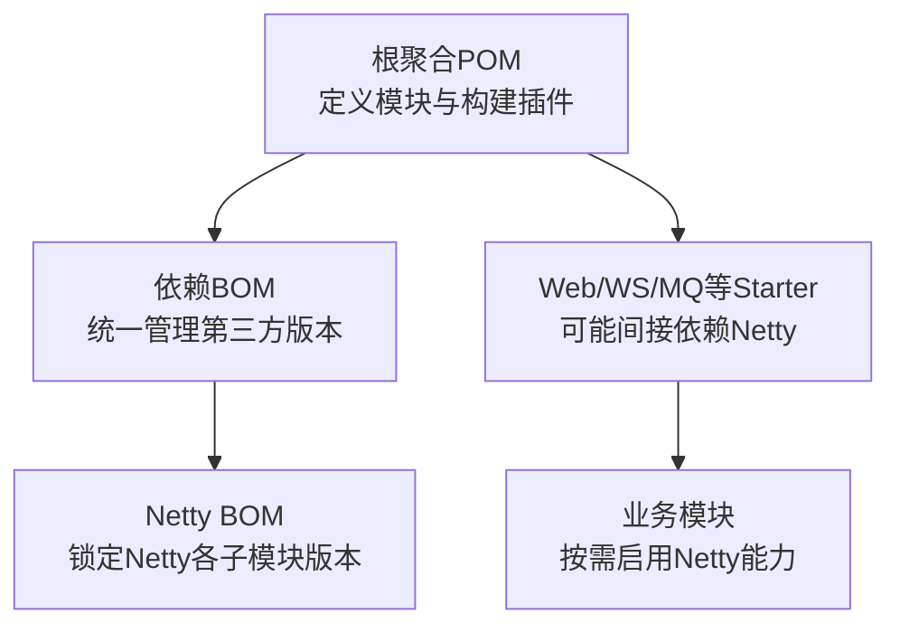
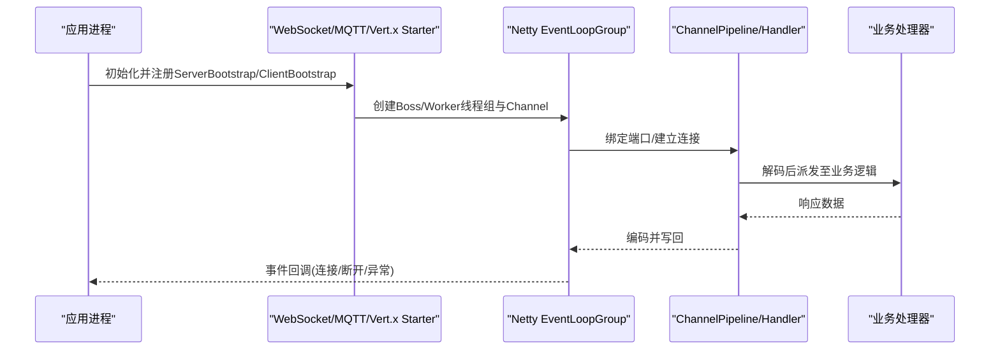
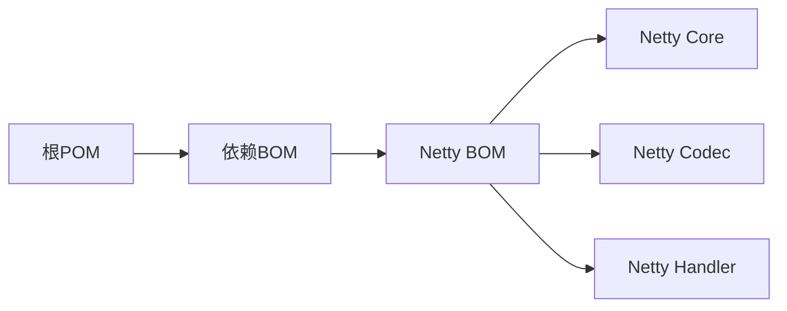

# Netty配置优化

<cite>
**本文引用的文件**
- [pom.xml](file://yudao-cloud/pom.xml)
- [pom.xml](file://yudao-cloud/yudao-dependencies/pom.xml)
</cite>

## 目录
1. [简介](#简介)
2. [项目结构](#项目结构)
3. [核心组件](#核心组件)
4. [架构总览](#架构总览)
5. [详细组件分析](#详细组件分析)
6. [依赖分析](#依赖分析)
7. [性能考虑](#性能考虑)
8. [故障排查指南](#故障排查指南)
9. [结论](#结论)
10. [附录](#附录)

## 简介
本技术文档面向在该项目中引入或扩展Netty的场景，系统性说明服务器与客户端的关键配置项与调优方法，覆盖线程模型、缓冲区大小、连接超时、内存管理、垃圾回收与网络I/O调优。同时给出开发、测试、生产环境的差异化策略，以及监控指标、常见问题定位与基准测试建议，帮助读者基于业务需求快速落地可观测、可演进的Netty配置方案。

## 项目结构
本项目采用多模块Maven工程，统一通过BOM管理依赖版本。Netty作为底层网络库被框架与业务模块间接使用（例如WebSocket、MQTT、Vert.x等），其版本由依赖BOM集中锁定，便于升级与一致性治理。

图表来源
- [pom.xml:10-33](file://yudao-cloud/pom.xml#L10-L33)
- [pom.xml:98-103](file://yudao-cloud/yudao-dependencies/pom.xml#L98-L103)

章节来源
- [pom.xml:10-33](file://yudao-cloud/pom.xml#L10-L33)
- [pom.xml:98-103](file://yudao-cloud/yudao-dependencies/pom.xml#L98-L103)

## 核心组件
- 依赖版本治理：通过BOM统一锁定Netty版本，确保全链路一致性与兼容性。
- 运行时集成点：WebSocket、MQTT、Vert.x等starter可能引入Netty；具体线程池、缓冲与超时参数通常由对应starter或业务代码装配。
- 配置入口：优先通过Spring Boot的配置文件（application.yml/properties）与环境变量进行差异化配置；必要时通过自定义Configuration类暴露可调参数。

章节来源
- [pom.xml:98-103](file://yudao-cloud/yudao-dependencies/pom.xml#L98-L103)

## 架构总览
下图展示从应用启动到Netty I/O线程处理请求的典型路径，强调关键可调节点：线程模型、缓冲区、超时与背压控制。

图表来源
- [pom.xml:98-103](file://yudao-cloud/yudao-dependencies/pom.xml#L98-L103)

## 详细组件分析

### 线程模型配置
- 目标：合理分配Boss与Worker线程数，避免CPU争用或队列堆积。
- 建议：
  - Boss线程：通常为CPU核数或1~2，用于接受连接。
  - Worker线程：根据CPU核数与I/O密集程度设置，常见为CPU核数×2或按压测结果调整。
  - 若使用Vert.x或特定Starter，遵循其默认线程模型并在高负载下观察EventLoop占用率。
- 监控：关注EventLoop空闲率、任务队列长度、上下文切换次数。

章节来源
- [pom.xml:98-103](file://yudao-cloud/yudao-dependencies/pom.xml#L98-L103)

### 缓冲区大小设置
- 目标：平衡内存占用与吞吐，减少零拷贝与复制开销。
- 建议：
  - 直接内存（Direct Buffer）：依据堆外内存上限与消息体大小设定，避免频繁扩容。
  - 接收/发送缓冲区：根据平均报文大小与峰值带宽调整，过大导致延迟增加，过小引发频繁拷贝。
  - 对大对象传输启用零拷贝与流式处理，降低GC压力。
- 监控：关注堆外内存使用、GC暂停时间、网络吞吐与延迟分布。

章节来源
- [pom.xml:98-103](file://yudao-cloud/yudao-dependencies/pom.xml#L98-L103)

### 连接超时与重试策略
- 目标：提升系统鲁棒性，防止资源泄露与雪崩。
- 建议：
  - 连接超时：短连接场景适当缩短，长连接保持心跳检测。
  - 读写超时：结合业务SLA设置，避免慢消费者拖垮整体吞吐。
  - 重试与退避：对瞬时失败采用指数退避与熔断降级。
- 监控：连接建立成功率、超时比例、重连频率、错误码分布。

章节来源
- [pom.xml:98-103](file://yudao-cloud/yudao-dependencies/pom.xml#L98-L103)

### 背压与流量控制
- 目标：在高并发下保护后端与自身稳定性。
- 建议：
  - 使用写缓冲水位线（High/Low Watermark）限制出站速率。
  - 对入站消息做限流与批处理，避免突发流量打满队列。
  - 结合网关或侧车进行全局流量整形。
- 监控：出站队列深度、丢弃率、P99延迟。

章节来源
- [pom.xml:98-103](file://yudao-cloud/yudao-dependencies/pom.xml#L98-L103)

### 内存管理与垃圾回收优化
- 目标：降低GC停顿，稳定延迟。
- 建议：
  - 合理设置JVM堆与非堆大小，启用G1或ZGC以缩短STW。
  - 控制Direct Buffer池大小，避免频繁分配/释放。
  - 避免在EventLoop中进行阻塞操作与大对象分配。
- 监控：GC次数与耗时、堆外内存曲线、Full GC触发频率。

章节来源
- [pom.xml:98-103](file://yudao-cloud/yudao-dependencies/pom.xml#L98-L103)

### 网络I/O调优
- 目标：最大化网卡与内核利用率。
- 建议：
  - 调整TCP参数（如 backlog、keepalive、nodelay）。
  - 开启零拷贝与批量发送，减少系统调用次数。
  - 根据CPU拓扑选择亲和性绑定的EventLoop。
- 监控：网卡吞吐、丢包率、TCP重传、内核队列长度。

章节来源
- [pom.xml:98-103](file://yudao-cloud/yudao-dependencies/pom.xml#L98-L103)

### 不同部署环境的差异化配置
- 开发环境：
  - 线程数较小，日志级别较高，便于调试。
  - 超时较短，便于快速反馈问题。
- 测试环境：
  - 接近生产的线程与内存规模，验证容量与稳定性。
  - 开启更详细的指标采集与链路追踪。
- 生产环境：
  - 严格限定线程与内存，启用背压与熔断。
  - 精细化监控告警，定期压测与容量规划。

章节来源
- [pom.xml:98-103](file://yudao-cloud/yudao-dependencies/pom.xml#L98-L103)

### 示例：根据业务需求调整配置参数
- 小消息高频场景：
  - 增大Worker线程，提高并行度；减小单条消息最大长度，降低内存抖动。
- 大文件/视频流场景：
  - 增大缓冲区与堆外内存，启用流式处理与零拷贝；降低写水位线，避免拥塞。
- 弱网/跨地域场景：
  - 延长超时与重试间隔，启用压缩与分片；加强连接健康检查。

章节来源
- [pom.xml:98-103](file://yudao-cloud/yudao-dependencies/pom.xml#L98-L103)

### 监控性能指标与优化资源使用
- 关键指标：
  - 线程：EventLoop活跃线程数、任务队列长度、上下文切换。
  - 内存：堆/非堆使用量、Direct Buffer池、GC暂停。
  - 网络：吞吐、延迟分布、重传率、连接数。
- 工具：
  - JVM内置监控、APM（SkyWalking/OpenTelemetry）、系统级工具（netstat/ss、sar）。
- 优化闭环：
  - 压测→采集→分析→调参→复测，形成持续优化机制。

章节来源
- [pom.xml:98-103](file://yudao-cloud/yudao-dependencies/pom.xml#L98-L103)

## 依赖分析
项目通过BOM集中管理Netty版本，确保与Spring生态及第三方组件兼容。该方式降低了版本冲突风险，便于统一升级与回归测试。

图表来源
- [pom.xml:98-103](file://yudao-cloud/yudao-dependencies/pom.xml#L98-L103)

章节来源
- [pom.xml:98-103](file://yudao-cloud/yudao-dependencies/pom.xml#L98-L103)

## 性能考虑
- 线程模型：按CPU核数与I/O特性设置EventLoop数量，避免过度线程化。
- 缓冲区：依据报文特征与带宽设置，兼顾吞吐与延迟。
- 超时与重试：结合SLA设计，避免资源泄露与级联故障。
- 背压：通过水位线与限流保护系统稳定性。
- 内存与GC：选择合适的GC器与堆大小，减少STW。
- 网络：内核参数与零拷贝优化，提升链路效率。

[本节提供通用指导，不直接分析具体文件]

## 故障排查指南
- 现象：连接频繁断开
  - 检查连接/读写超时是否过短；确认对端心跳与健康检查。
- 现象：CPU飙升
  - 排查EventLoop是否执行了阻塞操作；检查编解码复杂度。
- 现象：内存泄漏
  - 关注Direct Buffer池与对象生命周期；启用泄漏检测。
- 现象：延迟升高
  - 查看背压与队列堆积；评估缓冲区与线程配置。
- 现象：GC频繁
  - 调整堆大小与GC器；减少临时对象分配。

[本节提供通用指导，不直接分析具体文件]

## 结论
通过BOM统一Netty版本并结合合理的线程、缓冲、超时与背压策略，可在不同环境下实现稳定高效的网络通信。配合完善的监控与压测闭环，能够持续优化系统资源使用与性能表现。

[本节总结性内容，不直接分析具体文件]

## 附录
- 版本信息：当前Netty版本由依赖BOM统一锁定，便于升级与一致性治理。
- 参考位置：依赖BOM中声明了Netty BOM导入，所有子模块将继承该版本。

章节来源
- [pom.xml:98-103](file://yudao-cloud/yudao-dependencies/pom.xml#L98-L103)