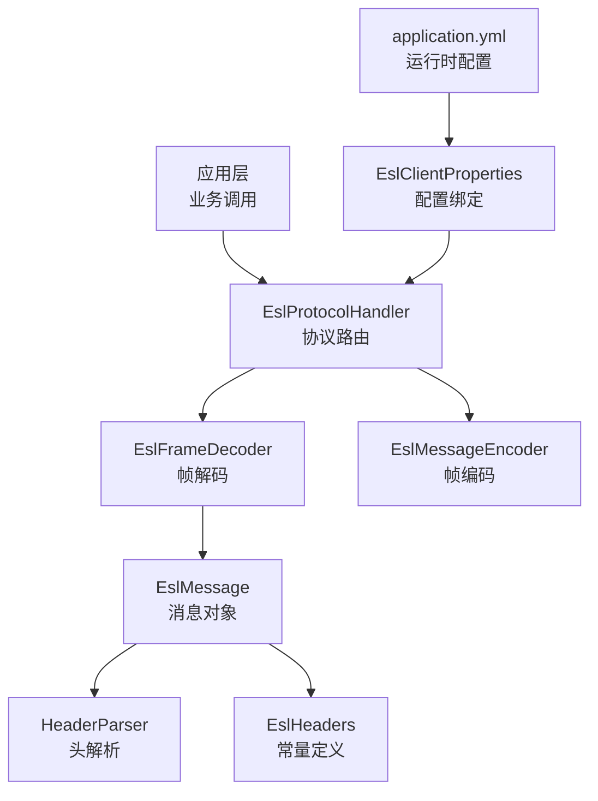
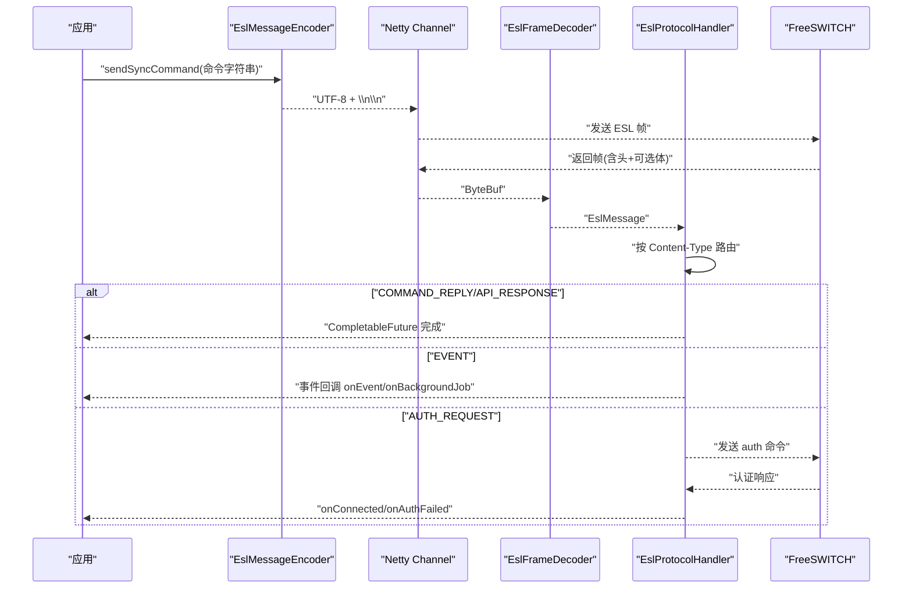
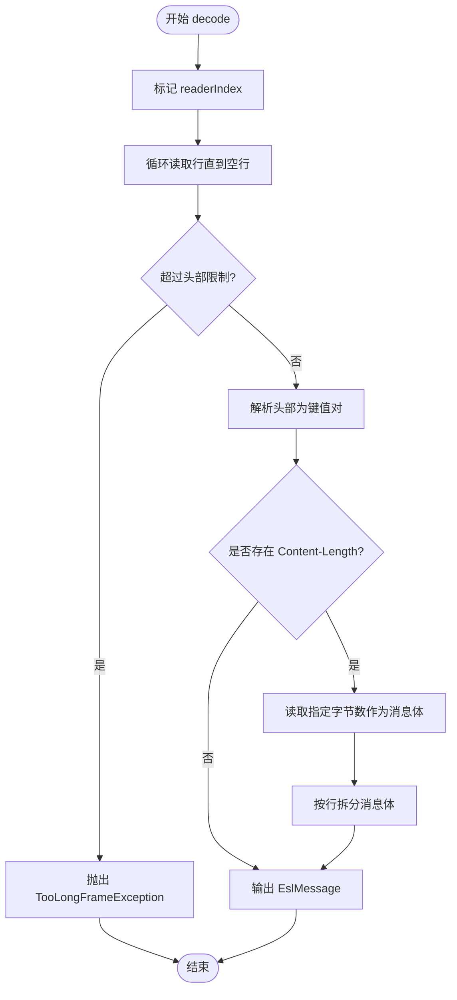
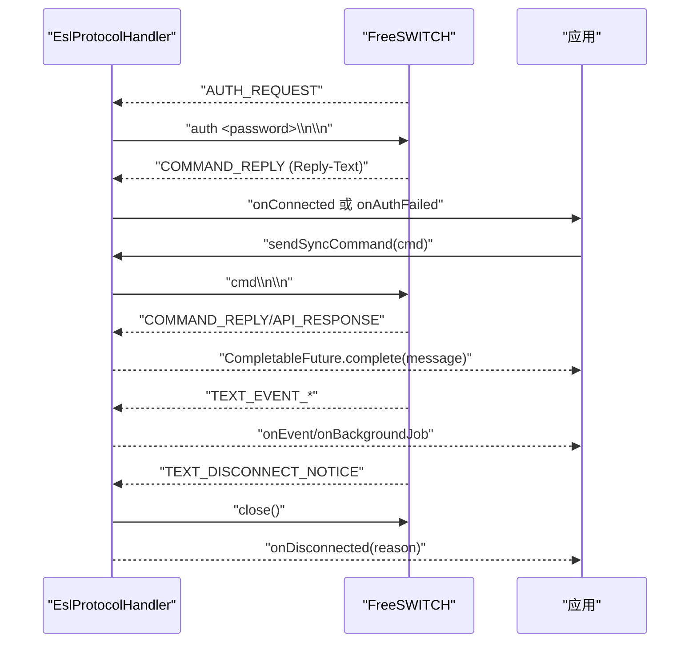
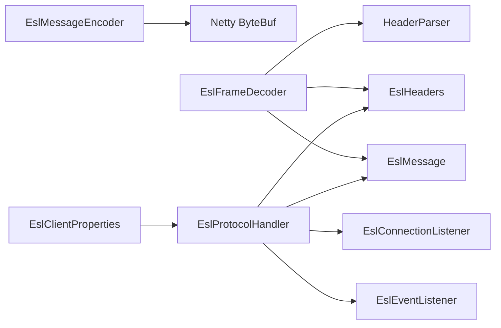

# 消息编解码

<cite>
**本文引用的文件**
- [EslMessageEncoder.java](file://yudao-cloud/yudao-module-cc/ipcc-fs-esl/src/main/java/cn/ipcc/fs/esl/netty/EslMessageEncoder.java)
- [EslFrameDecoder.java](file://yudao-cloud/yudao-module-cc/ipcc-fs-esl/src/main/java/cn/ipcc/fs/esl/netty/EslFrameDecoder.java)
- [EslProtocolHandler.java](file://yudao-cloud/yudao-module-cc/ipcc-fs-esl/src/main/java/cn/ipcc/fs/esl/netty/EslProtocolHandler.java)
- [EslMessage.java](file://yudao-cloud/yudao-module-cc/ipcc-fs-esl/src/main/java/cn/ipcc/fs/esl/transport/EslMessage.java)
- [HeaderParser.java](file://yudao-cloud/yudao-module-cc/ipcc-fs-esl/src/main/java/cn/ipcc/fs/esl/transport/HeaderParser.java)
- [EslHeaders.java](file://yudao-cloud/yudao-module-cc/ipcc-fs-esl/src/main/java/cn/ipcc/fs/esl/transport/EslHeaders.java)
- [EslClientProperties.java](file://yudao-cloud/yudao-module-cc/ipcc-fs-esl/src/main/java/cn/ipcc/fs/esl/spring/EslClientProperties.java)
- [application.yml](file://yudao-cloud/yudao-module-cc/ipcc-fs-esl/example/example-java/src/main/resources/application.yml)
</cite>

## 目录
1. [简介](#简介)
2. [项目结构](#项目结构)
3. [核心组件](#核心组件)
4. [架构总览](#架构总览)
5. [详细组件分析](#详细组件分析)
6. [依赖关系分析](#依赖关系分析)
7. [性能与内存优化](#性能与内存优化)
8. [故障排除与调试](#故障排除与调试)
9. [结论](#结论)
10. [附录：扩展指南](#附录扩展指南)

## 简介
本技术文档围绕 ESL（Event Socket Library）消息编解码器展开，重点说明 EslMessageEncoder 与 EslFrameDecoder 的实现原理、FreeSWITCH ESL 协议帧格式解析、消息序列化与反序列化机制、协议版本兼容性处理、消息头解析与数据帧组装过程。同时给出配置选项、缓冲区管理与内存优化策略，并提供添加新消息类型、扩展协议支持以及编码异常处理的实践示例。最后包含性能监控、调试工具与故障排除方法。

## 项目结构
ESL 编解码相关代码位于 ipcc-fs-esl 模块的 netty 与 transport 包中，采用 Netty 管道化编解码模型：
- 编码器：将字符串命令写入 ByteBuf（UTF-8），并附加协议终止符。
- 解码器：按行读取消息头，解析 Content-Length，按需读取消息体，输出 EslMessage。
- 协议处理器：根据 Content-Type 路由到认证、命令响应、事件或断开通知等分支。
- 传输对象：EslMessage、HeaderParser、EslHeaders 提供数据结构与常量。
- 配置：通过 Spring Boot 属性类绑定 YAML 配置，控制帧大小、超时、线程池等。

图表来源
- [EslProtocolHandler.java:116-144](file://yudao-cloud/yudao-module-cc/ipcc-fs-esl/src/main/java/cn/ipcc/fs/esl/netty/EslProtocolHandler.java#L116-L144)
- [EslFrameDecoder.java:42-91](file://yudao-cloud/yudao-module-cc/ipcc-fs-esl/src/main/java/cn/ipcc/fs/esl/netty/EslFrameDecoder.java#L42-L91)
- [EslMessageEncoder.java:16-19](file://yudao-cloud/yudao-module-cc/ipcc-fs-esl/src/main/java/cn/ipcc/fs/esl/netty/EslMessageEncoder.java#L16-L19)
- [EslMessage.java:16-109](file://yudao-cloud/yudao-module-cc/ipcc-fs-esl/src/main/java/cn/ipcc/fs/esl/transport/EslMessage.java#L16-L109)
- [HeaderParser.java:16-27](file://yudao-cloud/yudao-module-cc/ipcc-fs-esl/src/main/java/cn/ipcc/fs/esl/transport/HeaderParser.java#L16-L27)
- [EslHeaders.java:10-63](file://yudao-cloud/yudao-module-cc/ipcc-fs-esl/src/main/java/cn/ipcc/fs/esl/transport/EslHeaders.java#L10-L63)
- [EslClientProperties.java:20-56](file://yudao-cloud/yudao-module-cc/ipcc-fs-esl/src/main/java/cn/ipcc/fs/esl/spring/EslClientProperties.java#L20-L56)
- [application.yml:10-36](file://yudao-cloud/yudao-module-cc/ipcc-fs-esl/example/example-java/src/main/resources/application.yml#L10-L36)

章节来源
- [EslProtocolHandler.java:116-144](file://yudao-cloud/yudao-module-cc/ipcc-fs-esl/src/main/java/cn/ipcc/fs/esl/netty/EslProtocolHandler.java#L116-L144)
- [EslFrameDecoder.java:42-91](file://yudao-cloud/yudao-module-cc/ipcc-fs-esl/src/main/java/cn/ipcc/fs/esl/netty/EslFrameDecoder.java#L42-L91)
- [EslMessageEncoder.java:16-19](file://yudao-cloud/yudao-module-cc/ipcc-fs-esl/src/main/java/cn/ipcc/fs/esl/netty/EslMessageEncoder.java#L16-L19)
- [EslMessage.java:16-109](file://yudao-cloud/yudao-module-cc/ipcc-fs-esl/src/main/java/cn/ipcc/fs/esl/transport/EslMessage.java#L16-L109)
- [HeaderParser.java:16-27](file://yudao-cloud/yudao-module-cc/ipcc-fs-esl/src/main/java/cn/ipcc/fs/esl/transport/HeaderParser.java#L16-L27)
- [EslHeaders.java:10-63](file://yudao-cloud/yudao-module-cc/ipcc-fs-esl/src/main/java/cn/ipcc/fs/esl/transport/EslHeaders.java#L10-L63)
- [EslClientProperties.java:20-56](file://yudao-cloud/yudao-module-cc/ipcc-fs-esl/src/main/java/cn/ipcc/fs/esl/spring/EslClientProperties.java#L20-L56)
- [application.yml:10-36](file://yudao-cloud/yudao-module-cc/ipcc-fs-esl/example/example-java/src/main/resources/application.yml#L10-L36)

## 核心组件
- EslMessageEncoder：将已包含“\n\n”终结符的命令字符串以 UTF-8 编码写入 ByteBuf，设计为可共享处理器，降低多 Channel 场景下的实例开销。
- EslFrameDecoder：基于 Netty 的 ByteToMessageDecoder，实现 FreeSWITCH ESL 协议帧解析：
  - 阶段一：按行读取消息头，兼容 \n 与 \r\n；遇到空行结束头部。
  - 阶段二：若存在 Content-Length，则继续读取指定字节数作为消息体，并按行拆分填充到 EslMessage。
  - 安全限制：对头部累计字节数与行数进行阈值校验，超限抛出 TooLongFrameException；对 Content-Length 值进行上限检查。
- EslProtocolHandler：根据 Content-Type 路由消息：
  - AUTH_REQUEST：触发认证流程，发送 auth 命令。
  - COMMAND_REPLY / API_RESPONSE：匹配 pendingCommands 队列中的 Future，交付响应。
  - TEXT_EVENT_PLAIN / TEXT_EVENT_JSON：封装为 EslEvent 并分发给事件监听器。
  - TEXT_DISCONNECT_NOTICE：记录断开原因并关闭连接。
- EslMessage：承载消息头与消息体，提供便捷访问接口（如 getContentType、getContentLength、getBodyLines）。
- HeaderParser：分割“Header-Name: value”行，返回名称与值数组。
- EslHeaders：集中定义协议常量（Content-Type、分隔符、命令前缀、响应标识等）。
- EslClientProperties：Spring Boot 配置绑定，暴露最大帧大小、头部行数、超时、线程池等参数。

章节来源
- [EslMessageEncoder.java:8-19](file://yudao-cloud/yudao-module-cc/ipcc-fs-esl/src/main/java/cn/ipcc/fs/esl/netty/EslMessageEncoder.java#L8-L19)
- [EslFrameDecoder.java:13-91](file://yudao-cloud/yudao-module-cc/ipcc-fs-esl/src/main/java/cn/ipcc/fs/esl/netty/EslFrameDecoder.java#L13-L91)
- [EslProtocolHandler.java:23-144](file://yudao-cloud/yudao-module-cc/ipcc-fs-esl/src/main/java/cn/ipcc/fs/esl/netty/EslProtocolHandler.java#L23-L144)
- [EslMessage.java:8-109](file://yudao-cloud/yudao-module-cc/ipcc-fs-esl/src/main/java/cn/ipcc/fs/esl/transport/EslMessage.java#L8-L109)
- [HeaderParser.java:3-27](file://yudao-cloud/yudao-module-cc/ipcc-fs-esl/src/main/java/cn/ipcc/fs/esl/transport/HeaderParser.java#L3-L27)
- [EslHeaders.java:3-63](file://yudao-cloud/yudao-module-cc/ipcc-fs-esl/src/main/java/cn/ipcc/fs/esl/transport/EslHeaders.java#L3-L63)
- [EslClientProperties.java:9-56](file://yudao-cloud/yudao-module-cc/ipcc-fs-esl/src/main/java/cn/ipcc/fs/esl/spring/EslClientProperties.java#L9-L56)

## 架构总览
ESL 通信在 Netty 管道中由编码器与解码器协作完成，协议处理器负责语义路由与状态管理。

图表来源
- [EslMessageEncoder.java:16-19](file://yudao-cloud/yudao-module-cc/ipcc-fs-esl/src/main/java/cn/ipcc/fs/esl/netty/EslMessageEncoder.java#L16-L19)
- [EslFrameDecoder.java:42-91](file://yudao-cloud/yudao-module-cc/ipcc-fs-esl/src/main/java/cn/ipcc/fs/esl/netty/EslFrameDecoder.java#L42-L91)
- [EslProtocolHandler.java:96-144](file://yudao-cloud/yudao-module-cc/ipcc-fs-esl/src/main/java/cn/ipcc/fs/esl/netty/EslProtocolHandler.java#L96-L144)

## 详细组件分析

### EslMessageEncoder（编码器）
- 功能：将已包含“\n\n”终结符的命令字符串以 UTF-8 编码写入 ByteBuf。
- 设计要点：
  - 使用 @Sharable 注解，可在多个 Channel 间共享，减少对象创建。
  - 不重复拼接终止符，避免协议错误。
- 复杂度：O(n)，n 为命令字符串长度。
- 内存：直接写入 ByteBuf，无额外中间对象。

章节来源
- [EslMessageEncoder.java:8-19](file://yudao-cloud/yudao-module-cc/ipcc-fs-esl/src/main/java/cn/ipcc/fs/esl/netty/EslMessageEncoder.java#L8-L19)

### EslFrameDecoder（解码器）
- 功能：解析 FreeSWITCH ESL 帧，输出 EslMessage。
- 算法流程：
  - 读取行直到空行，累积头部字节与行数，超过阈值抛 TooLongFrameException。
  - 解析头部为键值对，构建 EslMessage。
  - 若存在 Content-Length，读取指定字节数作为消息体，按行拆分并添加到消息体列表。
  - 支持 \n 与 \r\n 换行符，兼容多字节 UTF-8。
- 安全性：
  - maxFrameSize 与 maxHeaderLines 保护，防止恶意或异常大帧导致 OOM。
  - Content-Length 负值或超上限拒绝。
- 复杂度：
  - 头部解析 O(h)，h 为头部行数。
  - 消息体读取 O(b)，b 为内容长度。
- 内存：
  - 逐行读取，避免一次性加载整个帧。
  - 消息体按行拆分，便于后续处理。

图表来源
- [EslFrameDecoder.java:42-91](file://yudao-cloud/yudao-module-cc/ipcc-fs-esl/src/main/java/cn/ipcc/fs/esl/netty/EslFrameDecoder.java#L42-L91)
- [EslFrameDecoder.java:97-113](file://yudao-cloud/yudao-module-cc/ipcc-fs-esl/src/main/java/cn/ipcc/fs/esl/netty/EslFrameDecoder.java#L97-L113)

章节来源
- [EslFrameDecoder.java:13-115](file://yudao-cloud/yudao-module-cc/ipcc-fs-esl/src/main/java/cn/ipcc/fs/esl/netty/EslFrameDecoder.java#L13-L115)

### EslProtocolHandler（协议处理器）
- 功能：根据 Content-Type 路由消息，处理认证、命令响应、事件与断开通知。
- 同步命令机制：
  - sendSyncCommand 创建 CompletableFuture，入队 pendingCommands，并通过 eventLoop().execute() 串行化发送，保证 FIFO。
  - orTimeout 设置命令超时，未匹配响应时自动失败。
- 认证流程：
  - 收到 AUTH_REQUEST 时发送 auth 命令，并标记 authPending。
  - 下一个 COMMAND_REPLY 被识别为认证响应，从 Reply-Text 判断成功与否。
- 事件分发：
  - 普通事件调用 onEvent，BACKGROUND_JOB 单独回调 onBackgroundJob。
- 断开处理：
  - 收到 disconnect-notice 记录原因并关闭连接，channelInactive 统一通知监听器。
  - 用户主动断开通过 markUserInitiatedDisconnect 避免重复通知。

图表来源
- [EslProtocolHandler.java:96-144](file://yudao-cloud/yudao-module-cc/ipcc-fs-esl/src/main/java/cn/ipcc/fs/esl/netty/EslProtocolHandler.java#L96-L144)
- [EslProtocolHandler.java:147-213](file://yudao-cloud/yudao-module-cc/ipcc-fs-esl/src/main/java/cn/ipcc/fs/esl/netty/EslProtocolHandler.java#L147-L213)
- [EslProtocolHandler.java:226-259](file://yudao-cloud/yudao-module-cc/ipcc-fs-esl/src/main/java/cn/ipcc/fs/esl/netty/EslProtocolHandler.java#L226-L259)

章节来源
- [EslProtocolHandler.java:23-267](file://yudao-cloud/yudao-module-cc/ipcc-fs-esl/src/main/java/cn/ipcc/fs/esl/netty/EslProtocolHandler.java#L23-L267)

### EslMessage（消息对象）
- 字段：
  - headers：LinkedHashMap，保序存储消息头。
  - body：ArrayList，存储消息体行。
- 方法：
  - addHeader/addBodyLine：追加头与体。
  - getHeaderValue/getContentType/getContentLength：便捷获取关键头。
  - hasContentLength：判断是否需要读取消息体。
  - getBodyLines/getFirstBodyLine：访问消息体。
- 复杂度：
  - 增删操作均摊 O(1)。
  - 查找头部 O(1) 平均。
- 内存：
  - 使用标准集合，易于扩展与调试。

章节来源
- [EslMessage.java:8-109](file://yudao-cloud/yudao-module-cc/ipcc-fs-esl/src/main/java/cn/ipcc/fs/esl/transport/EslMessage.java#L8-L109)

### HeaderParser（头解析）
- 功能：分割“Header-Name: value”，返回 [name, value] 数组。
- 行为：
  - 无冒号时，返回 [trim(line), ""].
  - 有冒号时，按冒号位置切分并 trim。
- 复杂度：O(k)，k 为行长度。

章节来源
- [HeaderParser.java:3-27](file://yudao-cloud/yudao-module-cc/ipcc-fs-esl/src/main/java/cn/ipcc/fs/esl/transport/HeaderParser.java#L3-L27)

### EslHeaders（协议常量）
- 常量：
  - 头名：Content-Type、Content-Length、Reply-Text、Job-UUID。
  - 命令前缀：api、bgapi、auth。
  - 事件类型：text/event-plain、text/event-json、text/disconnect-notice。
  - 响应标识：+OK、-ERR、Job-UUID 前缀。
  - 分隔符：MESSAGE_TERMINATOR（\n\n）、LINE_TERMINATOR（\n）。
- 用途：统一协议常量，避免硬编码字符串，提升可维护性。

章节来源
- [EslHeaders.java:3-63](file://yudao-cloud/yudao-module-cc/ipcc-fs-esl/src/main/java/cn/ipcc/fs/esl/transport/EslHeaders.java#L3-L63)

### 配置与运行时参数
- EslClientProperties：
  - 连接与超时：connect-timeout-seconds、command-timeout-seconds。
  - 协议层：max-frame-size、max-header-lines、netty-worker-threads。
  - 重连与健康检查：max-reconnect-attempts、reconnect-base-delay-seconds、reconnect-max-delay-seconds、health-check-interval-seconds、health-check-failure-threshold。
  - 事件执行器：event-executor-mode、event-thread-pool-size、event-queue-capacity、event-rejected-policy。
  - 分布式协调：monitor-enabled、monitor-group、monitor-compete-interval-seconds、monitor-lock-expire-seconds、monitor-heartbeat-interval-seconds。
- application.yml：
  - 示例配置展示了各参数的典型取值与注释说明。

章节来源
- [EslClientProperties.java:9-86](file://yudao-cloud/yudao-module-cc/ipcc-fs-esl/src/main/java/cn/ipcc/fs/esl/spring/EslClientProperties.java#L9-L86)
- [application.yml:10-36](file://yudao-cloud/yudao-module-cc/ipcc-fs-esl/example/example-java/src/main/resources/application.yml#L10-L36)

## 依赖关系分析
- 编码器依赖：
  - Netty ByteBuf、StandardCharsets.UTF-8。
- 解码器依赖：
  - Netty ByteToMessageDecoder、TooLongFrameException。
  - transport 包：EslMessage、HeaderParser、EslHeaders。
- 协议处理器依赖：
  - listener 包：EslConnectionListener、EslEventListener。
  - transport 包：EslEvent、EslEventHeaderNames、EslHeaders、EslMessage。
  - 并发：CompletableFuture、ConcurrentLinkedQueue、CopyOnWriteArrayList。
- 配置依赖：
  - Spring Boot ConfigurationProperties 绑定 YAML。

图表来源
- [EslMessageEncoder.java:3-19](file://yudao-cloud/yudao-module-cc/ipcc-fs-esl/src/main/java/cn/ipcc/fs/esl/netty/EslMessageEncoder.java#L3-L19)
- [EslFrameDecoder.java:3-91](file://yudao-cloud/yudao-module-cc/ipcc-fs-esl/src/main/java/cn/ipcc/fs/esl/netty/EslFrameDecoder.java#L3-L91)
- [EslProtocolHandler.java:3-144](file://yudao-cloud/yudao-module-cc/ipcc-fs-esl/src/main/java/cn/ipcc/fs/esl/netty/EslProtocolHandler.java#L3-L144)
- [EslClientProperties.java:9-56](file://yudao-cloud/yudao-module-cc/ipcc-fs-esl/src/main/java/cn/ipcc/fs/esl/spring/EslClientProperties.java#L9-L56)

章节来源
- [EslMessageEncoder.java:3-19](file://yudao-cloud/yudao-module-cc/ipcc-fs-esl/src/main/java/cn/ipcc/fs/esl/netty/EslMessageEncoder.java#L3-L19)
- [EslFrameDecoder.java:3-91](file://yudao-cloud/yudao-module-cc/ipcc-fs-esl/src/main/java/cn/ipcc/fs/esl/netty/EslFrameDecoder.java#L3-L91)
- [EslProtocolHandler.java:3-144](file://yudao-cloud/yudao-module-cc/ipcc-fs-esl/src/main/java/cn/ipcc/fs/esl/netty/EslProtocolHandler.java#L3-L144)
- [EslClientProperties.java:9-56](file://yudao-cloud/yudao-module-cc/ipcc-fs-esl/src/main/java/cn/ipcc/fs/esl/spring/EslClientProperties.java#L9-L56)

## 性能与内存优化
- 编码器优化：
  - 直接使用 StandardCharsets.UTF-8 编码，避免字符集转换开销。
  - 复用 Sharable 处理器，减少实例化成本。
- 解码器优化：
  - 逐行读取，避免一次性分配大数组。
  - 头部与帧大小限制，防止 OOM。
  - 消息体按行拆分，便于流式处理。
- 协议处理器优化：
  - 使用 ConcurrentLinkedQueue 管理 pendingCommands，低锁竞争。
  - eventLoop().execute() 串行化命令发送，保证顺序与原子性。
  - orTimeout 避免阻塞等待，及时释放资源。
- 配置调优建议：
  - max-frame-size：根据实际消息体大小调整，避免频繁扩容。
  - max-header-lines：合理设置，防止异常头部占用过多内存。
  - event-thread-pool-size：根据事件量与处理耗时调整。
  - event-queue-capacity：高吞吐场景适当增大，结合拒绝策略。

[本节为通用性能讨论，无需特定文件引用]

## 故障排除与调试
- 常见问题：
  - 认证失败：检查密码与 Reply-Text，确认 AUTH_REQUEST 与 COMMAND_REPLY 匹配。
  - 命令超时：检查 command-timeout-seconds 与 FS 负载，必要时增加超时或排查慢查询。
  - 帧过大：调整 max-frame-size，检查是否有异常大消息体。
  - 事件丢失：确认事件执行器模式与线程池容量，避免队列溢出。
- 日志定位：
  - 启用 cn.ipcc.fs.esl 包日志，观察协议处理与异常堆栈。
  - 关注 TooLongFrameException、连接断开与认证失败日志。
- 调试步骤：
  - 抓包验证帧格式（头与体是否正确，分隔符是否完整）。
  - 逐步缩小问题范围：先验证编码器输出，再验证解码器输入。
  - 使用最小化命令测试连通性与认证流程。

章节来源
- [EslProtocolHandler.java:147-213](file://yudao-cloud/yudao-module-cc/ipcc-fs-esl/src/main/java/cn/ipcc/fs/esl/netty/EslProtocolHandler.java#L147-L213)
- [EslFrameDecoder.java:60-77](file://yudao-cloud/yudao-module-cc/ipcc-fs-esl/src/main/java/cn/ipcc/fs/esl/netty/EslFrameDecoder.java#L60-L77)
- [application.yml:41-45](file://yudao-cloud/yudao-module-cc/ipcc-fs-esl/example/example-java/src/main/resources/application.yml#L41-L45)

## 结论
本编解码方案基于 Netty 实现了高效、安全的 ESL 消息收发：
- 编码器简洁可靠，确保命令正确写出。
- 解码器严格遵循协议规范，具备健壮的安全限制。
- 协议处理器清晰路由，支持认证、命令响应、事件与断开通知。
- 配置灵活可调，适配不同部署环境与负载需求。
通过合理的性能调优与故障排除手段，可在生产环境中稳定运行。

[本节为总结，无需特定文件引用]

## 附录：扩展指南

### 添加新的消息类型
- 步骤：
  - 在 EslHeaders.Value 中添加新的 Content-Type 常量。
  - 在 EslProtocolHandler.channelRead 的 switch 分支中新增 case，实现处理逻辑。
  - 如需持久化或转发，结合 EslEvent 与监听器进行扩展。
- 示例路径：
  - 新增常量：参考 [EslHeaders.java:44-57](file://yudao-cloud/yudao-module-cc/ipcc-fs-esl/src/main/java/cn/ipcc/fs/esl/transport/EslHeaders.java#L44-L57)
  - 路由分支：参考 [EslProtocolHandler.java:126-143](file://yudao-cloud/yudao-module-cc/ipcc-fs-esl/src/main/java/cn/ipcc/fs/esl/netty/EslProtocolHandler.java#L126-L143)

### 扩展协议支持
- 若需支持新的命令前缀或响应格式：
  - 在 EslHeaders 中添加相应常量。
  - 在 EslProtocolHandler 中扩展匹配与处理逻辑。
  - 在 EslMessage 中增加必要的字段或方法（如需要）。
- 示例路径：
  - 命令前缀：参考 [EslHeaders.java:19-30](file://yudao-cloud/yudao-module-cc/ipcc-fs-esl/src/main/java/cn/ipcc/fs/esl/transport/EslHeaders.java#L19-L30)
  - 响应标识：参考 [EslHeaders.java:31-38](file://yudao-cloud/yudao-module-cc/ipcc-fs-esl/src/main/java/cn/ipcc/fs/esl/transport/EslHeaders.java#L31-L38)

### 处理编码异常
- 常见异常：
  - TooLongFrameException：头部或帧过大，调整 max-frame-size 与 max-header-lines。
  - 字符集异常：确保使用 UTF-8，检查输入输出一致性。
- 处理建议：
  - 在 exceptionCaught 中记录异常并关闭连接。
  - 在解码器中增加更详细的上下文信息（如当前行号、累计字节数）。
- 示例路径：
  - 异常捕获：参考 [EslProtocolHandler.java:261-265](file://yudao-cloud/yudao-module-cc/ipcc-fs-esl/src/main/java/cn/ipcc/fs/esl/netty/EslProtocolHandler.java#L261-L265)
  - 帧限制：参考 [EslFrameDecoder.java:60-77](file://yudao-cloud/yudao-module-cc/ipcc-fs-esl/src/main/java/cn/ipcc/fs/esl/netty/EslFrameDecoder.java#L60-L77)

章节来源
- [EslHeaders.java:19-57](file://yudao-cloud/yudao-module-cc/ipcc-fs-esl/src/main/java/cn/ipcc/fs/esl/transport/EslHeaders.java#L19-L57)
- [EslProtocolHandler.java:126-143](file://yudao-cloud/yudao-module-cc/ipcc-fs-esl/src/main/java/cn/ipcc/fs/esl/netty/EslProtocolHandler.java#L126-L143)
- [EslFrameDecoder.java:60-77](file://yudao-cloud/yudao-module-cc/ipcc-fs-esl/src/main/java/cn/ipcc/fs/esl/netty/EslFrameDecoder.java#L60-L77)
- [EslProtocolHandler.java:261-265](file://yudao-cloud/yudao-module-cc/ipcc-fs-esl/src/main/java/cn/ipcc/fs/esl/netty/EslProtocolHandler.java#L261-L265)