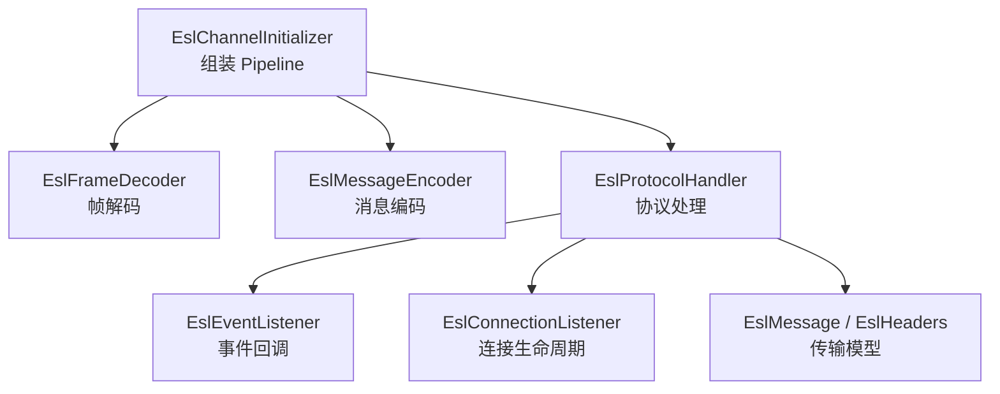
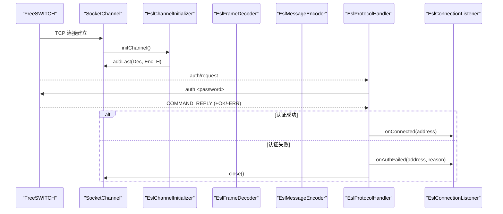
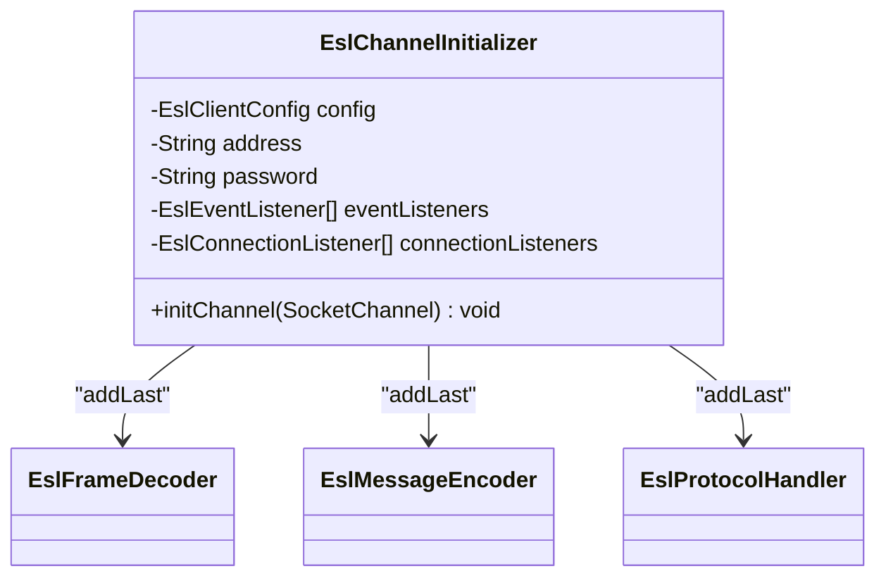
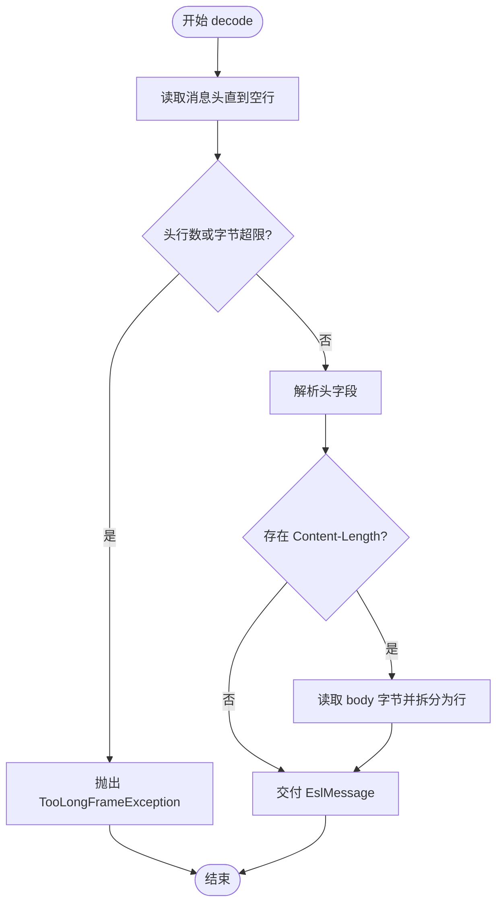
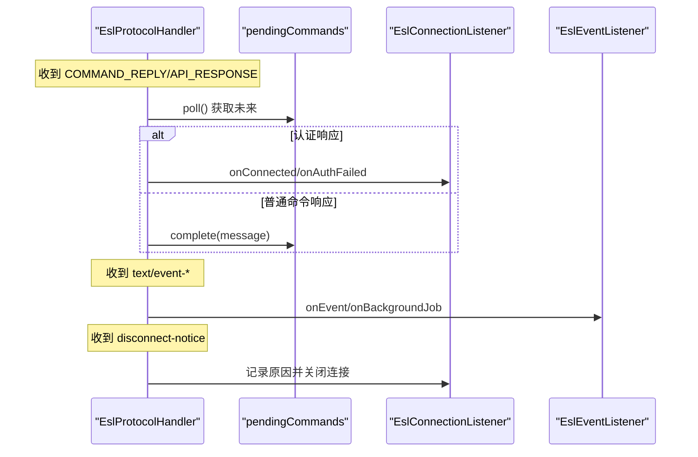
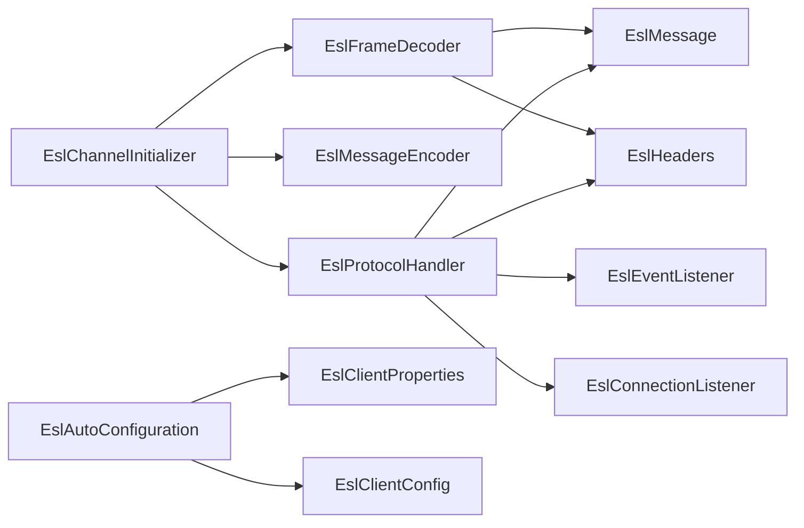

# 通道初始化器

<cite>
**本文引用的文件**
- [EslChannelInitializer.java](file://yudao-cloud/yudao-module-cc/ipcc-fs-esl/src/main/java/cn/ipcc/fs/esl/netty/EslChannelInitializer.java)
- [EslFrameDecoder.java](file://yudao-cloud/yudao-module-cc/ipcc-fs-esl/src/main/java/cn/ipcc/fs/esl/netty/EslFrameDecoder.java)
- [EslMessageEncoder.java](file://yudao-cloud/yudao-module-cc/ipcc-fs-esl/src/main/java/cn/ipcc/fs/esl/netty/EslMessageEncoder.java)
- [EslProtocolHandler.java](file://yudao-cloud/yudao-module-cc/ipcc-fs-esl/src/main/java/cn/ipcc/fs/esl/netty/EslProtocolHandler.java)
- [EslClientConfig.java](file://yudao-cloud/yudao-module-cc/ipcc-fs-esl/src/main/java/cn/ipcc/fs/esl/EslClientConfig.java)
- [EslAutoConfiguration.java](file://yudao-cloud/yudao-module-cc/ipcc-fs-esl/src/main/java/cn/ipcc/fs/esl/spring/EslAutoConfiguration.java)
- [EslClientProperties.java](file://yudao-cloud/yudao-module-cc/ipcc-fs-esl/src/main/java/cn/ipcc/fs/esl/spring/EslClientProperties.java)
- [EslMessage.java](file://yudao-cloud/yudao-module-cc/ipcc-fs-esl/src/main/java/cn/ipcc/fs/esl/transport/EslMessage.java)
- [EslHeaders.java](file://yudao-cloud/yudao-module-cc/ipcc-fs-esl/src/main/java/cn/ipcc/fs/esl/transport/EslHeaders.java)
- [EslConnectionListener.java](file://yudao-cloud/yudao-module-cc/ipcc-fs-esl/src/main/java/cn/ipcc/fs/esl/listener/EslConnectionListener.java)
- [EslEventListener.java](file://yudao-cloud/yudao-module-cc/ipcc-fs-esl/src/main/java/cn/ipcc/fs/esl/listener/EslEventListener.java)
</cite>

## 目录
1. [简介](#简介)
2. [项目结构](#项目结构)
3. [核心组件](#核心组件)
4. [架构总览](#架构总览)
5. [详细组件分析](#详细组件分析)
6. [依赖关系分析](#依赖关系分析)
7. [性能考量](#性能考量)
8. [故障排查指南](#故障排查指南)
9. [结论](#结论)
10. [附录](#附录)

## 简介
本技术文档围绕 ESL 通道初始化器（EslChannelInitializer）展开，系统阐述其在 Netty 管道中的设计模式、处理器链装配顺序与依赖关系；详解从编码器、解码器到业务处理器的装配过程；文档化初始化配置参数、环境变量与动态配置支持；并提供扩展处理器链、添加自定义中间件、优化初始化性能的实践示例；同时覆盖初始化失败处理、配置校验与调试方法。

## 项目结构
ESL 客户端基于 Netty 构建，核心位于 ipcc-fs-esl 模块的 netty 包中：
- EslChannelInitializer：负责为每个 SocketChannel 组装入站/出站处理器链
- EslFrameDecoder：实现 FreeSWITCH ESL 协议帧解码
- EslMessageEncoder：将字符串命令编码为 UTF-8 字节流
- EslProtocolHandler：处理认证、命令响应匹配、事件分发与连接生命周期管理
- 配置与装配：EslClientConfig、EslClientProperties、EslAutoConfiguration
- 传输模型：EslMessage、EslHeaders
- 监听接口：EslEventListener、EslConnectionListener

图表来源
- [EslChannelInitializer.java:22-46](file://yudao-cloud/yudao-module-cc/ipcc-fs-esl/src/main/java/cn/ipcc/fs/esl/netty/EslChannelInitializer.java#L22-L46)
- [EslFrameDecoder.java:29-91](file://yudao-cloud/yudao-module-cc/ipcc-fs-esl/src/main/java/cn/ipcc/fs/esl/netty/EslFrameDecoder.java#L29-L91)
- [EslMessageEncoder.java:13-19](file://yudao-cloud/yudao-module-cc/ipcc-fs-esl/src/main/java/cn/ipcc/fs/esl/netty/EslMessageEncoder.java#L13-L19)
- [EslProtocolHandler.java:40-144](file://yudao-cloud/yudao-module-cc/ipcc-fs-esl/src/main/java/cn/ipcc/fs/esl/netty/EslProtocolHandler.java#L40-L144)

章节来源
- [EslChannelInitializer.java:22-46](file://yudao-cloud/yudao-module-cc/ipcc-fs-esl/src/main/java/cn/ipcc/fs/esl/netty/EslChannelInitializer.java#L22-L46)
- [EslAutoConfiguration.java:56-86](file://yudao-cloud/yudao-module-cc/ipcc-fs-esl/src/main/java/cn/ipcc/fs/esl/spring/EslAutoConfiguration.java#L56-L86)

## 核心组件
- EslChannelInitializer：定义 Inbound 模式的 Pipeline 组装顺序，注入配置与监听器集合，确保每次新连接建立时按序注册处理器。
- EslFrameDecoder：基于 ByteToMessageDecoder 实现 ESL 帧解析，支持 CRLF 换行、UTF-8 多字节、头行限制与 Content-Length 体读取，提供防放大攻击与 OOM 保护。
- EslMessageEncoder：@Sharable 的 MessageToByteEncoder，将包含终止符的命令字符串编码为 UTF-8 字节。
- EslProtocolHandler：实现认证流程、同步命令/响应匹配（CompletableFuture + orTimeout）、事件分发（普通事件与 BACKGROUND_JOB）、断开通知处理与异常捕获。
- EslClientConfig / EslClientProperties：集中管理连接超时、命令超时、最大帧大小、头部行数、Netty 线程数、重连策略、健康检查、事件执行器与分布式协调等配置。
- EslAutoConfiguration：Spring Boot 自动装配，绑定配置、创建并启动连接管理器、注册监听器与路由器、条件化启用监控协调器。
- EslMessage / EslHeaders：ESL 消息对象与协议常量（Content-Type、命令前缀、响应前缀、消息终止符等）。
- EslEventListener / EslConnectionListener：事件与连接生命周期回调接口，供业务侧实现。

章节来源
- [EslChannelInitializer.java:22-46](file://yudao-cloud/yudao-module-cc/ipcc-fs-esl/src/main/java/cn/ipcc/fs/esl/netty/EslChannelInitializer.java#L22-L46)
- [EslFrameDecoder.java:29-91](file://yudao-cloud/yudao-module-cc/ipcc-fs-esl/src/main/java/cn/ipcc/fs/esl/netty/EslFrameDecoder.java#L29-L91)
- [EslMessageEncoder.java:13-19](file://yudao-cloud/yudao-module-cc/ipcc-fs-esl/src/main/java/cn/ipcc/fs/esl/netty/EslMessageEncoder.java#L13-L19)
- [EslProtocolHandler.java:40-267](file://yudao-cloud/yudao-module-cc/ipcc-fs-esl/src/main/java/cn/ipcc/fs/esl/netty/EslProtocolHandler.java#L40-L267)
- [EslClientConfig.java:11-60](file://yudao-cloud/yudao-module-cc/ipcc-fs-esl/src/main/java/cn/ipcc/fs/esl/EslClientConfig.java#L11-L60)
- [EslClientProperties.java:17-85](file://yudao-cloud/yudao-module-cc/ipcc-fs-esl/src/main/java/cn/ipcc/fs/esl/spring/EslClientProperties.java#L17-L85)
- [EslAutoConfiguration.java:56-248](file://yudao-cloud/yudao-module-cc/ipcc-fs-esl/src/main/java/cn/ipcc/fs/esl/spring/EslAutoConfiguration.java#L56-L248)
- [EslMessage.java:16-109](file://yudao-cloud/yudao-module-cc/ipcc-fs-esl/src/main/java/cn/ipcc/fs/esl/transport/EslMessage.java#L16-L109)
- [EslHeaders.java:7-64](file://yudao-cloud/yudao-module-cc/ipcc-fs-esl/src/main/java/cn/ipcc/fs/esl/transport/EslHeaders.java#L7-L64)
- [EslEventListener.java:10-28](file://yudao-cloud/yudao-module-cc/ipcc-fs-esl/src/main/java/cn/ipcc/fs/esl/listener/EslEventListener.java#L10-L28)
- [EslConnectionListener.java:7-65](file://yudao-cloud/yudao-module-cc/ipcc-fs-esl/src/main/java/cn/ipcc/fs/esl/listener/EslConnectionListener.java#L7-L65)

## 架构总览
ESL 客户端采用 Netty 的 ChannelPipeline 模式，通过 EslChannelInitializer 在连接激活时按固定顺序装配处理器：
- 入站：EslFrameDecoder 负责将原始字节流解析为 EslMessage
- 出站：EslMessageEncoder 将上层命令字符串编码为字节流
- 业务：EslProtocolHandler 处理认证、命令响应匹配、事件分发与连接生命周期

图表来源
- [EslChannelInitializer.java:40-46](file://yudao-cloud/yudao-module-cc/ipcc-fs-esl/src/main/java/cn/ipcc/fs/esl/netty/EslChannelInitializer.java#L40-L46)
- [EslProtocolHandler.java:110-158](file://yudao-cloud/yudao-module-cc/ipcc-fs-esl/src/main/java/cn/ipcc/fs/esl/netty/EslProtocolHandler.java#L110-L158)
- [EslConnectionListener.java:9-27](file://yudao-cloud/yudao-module-cc/ipcc-fs-esl/src/main/java/cn/ipcc/fs/esl/listener/EslConnectionListener.java#L9-L27)

## 详细组件分析

### EslChannelInitializer：管道装配器
- 职责：为每个新连接的 SocketChannel 装配处理器链，注入配置与监听器集合
- 装配顺序：
  - 入站：EslFrameDecoder（帧解码）
  - 出站：EslMessageEncoder（消息编码）
  - 业务：EslProtocolHandler（认证、命令响应、事件分发）
- 设计要点：
  - 使用 ChannelInitializer 保证每次连接独立装配
  - 通过构造器注入 EslClientConfig、地址、密码、事件监听器与连接监听器列表
  - 保持轻量，避免在初始化阶段进行复杂逻辑

图表来源
- [EslChannelInitializer.java:22-46](file://yudao-cloud/yudao-module-cc/ipcc-fs-esl/src/main/java/cn/ipcc/fs/esl/netty/EslChannelInitializer.java#L22-L46)

章节来源
- [EslChannelInitializer.java:22-46](file://yudao-cloud/yudao-module-cc/ipcc-fs-esl/src/main/java/cn/ipcc/fs/esl/netty/EslChannelInitializer.java#L22-L46)

### EslFrameDecoder：帧解码器
- 职责：将字节流解析为 EslMessage，遵循 FreeSWITCH ESL 协议规范
- 算法流程：
  - 逐行读取消息头，直到空行结束
  - 解析头字段，判断是否存在 Content-Length
  - 无体：直接交付消息（如 auth/request）
  - 有体：读取指定长度字节作为消息体，按行拆分
- 安全机制：
  - 头累计字节数与行数限制，超过阈值抛出 TooLongFrameException
  - Content-Length 值超过 maxFrameSize 拒绝
- 兼容性：支持 \r\n 与 \n 换行，UTF-8 多字节字符

图表来源
- [EslFrameDecoder.java:42-91](file://yudao-cloud/yudao-module-cc/ipcc-fs-esl/src/main/java/cn/ipcc/fs/esl/netty/EslFrameDecoder.java#L42-L91)

章节来源
- [EslFrameDecoder.java:29-115](file://yudao-cloud/yudao-module-cc/ipcc-fs-esl/src/main/java/cn/ipcc/fs/esl/netty/EslFrameDecoder.java#L29-L115)

### EslMessageEncoder：消息编码器
- 职责：将包含终止符的命令字符串编码为 UTF-8 字节写入 ByteBuf
- 设计要点：
  - @Sharable 可被多个 Channel 共享，减少对象创建开销
  - 简单高效，仅做编码转换

章节来源
- [EslMessageEncoder.java:13-19](file://yudao-cloud/yudao-module-cc/ipcc-fs-esl/src/main/java/cn/ipcc/fs/esl/netty/EslMessageEncoder.java#L13-L19)

### EslProtocolHandler：协议处理器
- 职责：处理认证、命令响应匹配、事件分发、断开通知与异常处理
- 关键流程：
  - channelActive：记录 channel 引用，等待 FS 发送 auth/request
  - channelRead：根据 Content-Type 路由到不同处理分支
  - handleAuthRequest：发送 auth 命令，设置 authPending 标志
  - matchPendingCommand：优先处理认证响应，否则从 pendingCommands 队列匹配 future
  - handleEvent：普通事件调用 onEvent，BACKGROUND_JOB 单独回调
  - handleDisconnectNotice：记录断开原因并关闭连接，channelInactive 统一通知
  - exceptionCaught：记录异常并关闭连接
- 并发与顺序：
  - 通过 channel.eventLoop().execute() 串行化命令入队与发送，保证 FIFO
  - CompletableFuture.orTimeout 控制命令超时
  - 跳过已超时/已取消的 future，确保不错位

图表来源
- [EslProtocolHandler.java:96-182](file://yudao-cloud/yudao-module-cc/ipcc-fs-esl/src/main/java/cn/ipcc/fs/esl/netty/EslProtocolHandler.java#L96-L182)
- [EslProtocolHandler.java:215-259](file://yudao-cloud/yudao-module-cc/ipcc-fs-esl/src/main/java/cn/ipcc/fs/esl/netty/EslProtocolHandler.java#L215-L259)

章节来源
- [EslProtocolHandler.java:40-267](file://yudao-cloud/yudao-module-cc/ipcc-fs-esl/src/main/java/cn/ipcc/fs/esl/netty/EslProtocolHandler.java#L40-L267)

### 配置与装配：EslClientConfig、EslClientProperties、EslAutoConfiguration
- EslClientProperties：Spring Boot 配置属性，前缀 ipcc.fs.esl.*，映射到 EslClientConfig
- EslAutoConfiguration：
  - 绑定配置并转换为 EslClientConfig
  - 创建并启动 EslConnectionManager（initMethod=start）
  - 自动收集并注册 EslEventListener、EslConnectionListener
  - 条件化创建 RedisEslMonitorCoordinator（当 spring-data-redis 存在且 monitor-enabled=true）
  - 创建 EslEventRouter，自动注册 @EslEventName 标注的事件处理器与拦截器
  - 创建默认 EslMetrics 与 EslMetricsInterceptor
  - 若无业务方自定义 EslEventListener，则注册 EslEventRouterListener 转发事件
- 静态节点：支持通过 nodes 列表配置 FS 节点并自动注册连接

章节来源
- [EslClientProperties.java:17-85](file://yudao-cloud/yudao-module-cc/ipcc-fs-esl/src/main/java/cn/ipcc/fs/esl/spring/EslClientProperties.java#L17-L85)
- [EslAutoConfiguration.java:56-248](file://yudao-cloud/yudao-module-cc/ipcc-fs-esl/src/main/java/cn/ipcc/fs/esl/spring/EslAutoConfiguration.java#L56-L248)
- [EslClientConfig.java:11-60](file://yudao-cloud/yudao-module-cc/ipcc-fs-esl/src/main/java/cn/ipcc/fs/esl/EslClientConfig.java#L11-L60)

### 传输模型：EslMessage、EslHeaders
- EslMessage：封装消息头（LinkedHashMap 保序）与消息体（ArrayList），提供 getContentType、getContentLength、getBodyLines 等方法
- EslHeaders：定义协议常量，包括 Content-Type、命令前缀、响应前缀、消息终止符等

章节来源
- [EslMessage.java:16-109](file://yudao-cloud/yudao-module-cc/ipcc-fs-esl/src/main/java/cn/ipcc/fs/esl/transport/EslMessage.java#L16-L109)
- [EslHeaders.java:7-64](file://yudao-cloud/yudao-module-cc/ipcc-fs-esl/src/main/java/cn/ipcc/fs/esl/transport/EslHeaders.java#L7-L64)

### 监听接口：EslEventListener、EslConnectionListener
- EslEventListener：接收普通事件与 BACKGROUND_JOB 事件，业务实现后由 Spring 自动注册
- EslConnectionListener：连接生命周期回调，包括连接成功、断开、认证失败、重连等

章节来源
- [EslEventListener.java:10-28](file://yudao-cloud/yudao-module-cc/ipcc-fs-esl/src/main/java/cn/ipcc/fs/esl/listener/EslEventListener.java#L10-L28)
- [EslConnectionListener.java:7-65](file://yudao-cloud/yudao-module-cc/ipcc-fs-esl/src/main/java/cn/ipcc/fs/esl/listener/EslConnectionListener.java#L7-L65)

## 依赖关系分析
- EslChannelInitializer 依赖：
  - EslClientConfig：提供帧大小、头部行数、命令超时等参数
  - EslEventListener、EslConnectionListener：事件与连接生命周期回调
- EslFrameDecoder 依赖：
  - EslMessage、EslHeaders：构建消息对象与解析头字段
- EslProtocolHandler 依赖：
  - EslMessage、EslHeaders：识别消息类型与响应内容
  - EslEventListener、EslConnectionListener：回调事件与连接状态
- EslAutoConfiguration 依赖：
  - EslClientProperties：外部配置绑定
  - EslConnectionManager、EslEventRouter、EslMonitorCoordinator：核心组件装配

图表来源
- [EslChannelInitializer.java:22-46](file://yudao-cloud/yudao-module-cc/ipcc-fs-esl/src/main/java/cn/ipcc/fs/esl/netty/EslChannelInitializer.java#L22-L46)
- [EslFrameDecoder.java:29-91](file://yudao-cloud/yudao-module-cc/ipcc-fs-esl/src/main/java/cn/ipcc/fs/esl/netty/EslFrameDecoder.java#L29-L91)
- [EslProtocolHandler.java:40-144](file://yudao-cloud/yudao-module-cc/ipcc-fs-esl/src/main/java/cn/ipcc/fs/esl/netty/EslProtocolHandler.java#L40-L144)
- [EslAutoConfiguration.java:56-86](file://yudao-cloud/yudao-module-cc/ipcc-fs-esl/src/main/java/cn/ipcc/fs/esl/spring/EslAutoConfiguration.java#L56-L86)

章节来源
- [EslChannelInitializer.java:22-46](file://yudao-cloud/yudao-module-cc/ipcc-fs-esl/src/main/java/cn/ipcc/fs/esl/netty/EslChannelInitializer.java#L22-L46)
- [EslAutoConfiguration.java:56-86](file://yudao-cloud/yudao-module-cc/ipcc-fs-esl/src/main/java/cn/ipcc/fs/esl/spring/EslAutoConfiguration.java#L56-L86)

## 性能考量
- 解码器优化：
  - 逐行扫描 ByteBuf，避免不必要的内存拷贝
  - 严格限制头行数与字节数，防止 header 放大攻击
  - 合理设置 maxFrameSize，平衡内存占用与消息体积
- 编码器优化：
  - @Sharable 编码器减少对象创建，提升吞吐
- 协议处理器优化：
  - 使用 ConcurrentLinkedQueue 存储待处理命令，配合 eventLoop 串行化保证顺序
  - CompletableFuture.orTimeout 避免阻塞 IO 线程
  - 跳过已超时/已取消的 future，降低无效匹配开销
- 事件执行器：
  - 支持 CHANNEL_HASH/SINGLE_THREAD/FULL_CONCURRENT 多种模式，按场景选择
  - 合理配置线程池大小与队列容量，避免背压导致丢事件
- 健康检查与重连：
  - 指数退避重连，避免雪崩
  - 健康检查间隔与失败阈值调优，快速感知异常

[本节为通用性能讨论，不直接分析具体文件]

## 故障排查指南
- 认证失败：
  - 现象：onAuthFailed 回调，连接关闭
  - 排查：检查密码、FS 配置、auth/request 是否到达
  - 参考：认证失败次数上限与关闭逻辑
- 命令超时：
  - 现象：sendSyncCommand 返回的 future 超时
  - 排查：检查网络连通性、FS 负载、命令是否正确
  - 参考：orTimeout 与 pendingCommands 匹配逻辑
- 帧过大：
  - 现象：TooLongFrameException
  - 排查：调整 maxFrameSize、maxHeaderLines，检查 FS 输出
  - 参考：解码器头与体限制
- 连接异常断开：
  - 现象：onDisconnected 触发，区分 CONNECTION_LOST 与 FS_DISCONNECT_NOTICE
  - 排查：查看日志、FS 行为、网络状况
  - 参考：handleDisconnectNotice 与 channelInactive 逻辑
- 事件未处理：
  - 现象：onEvent 未触发或顺序异常
  - 排查：确认事件监听器已注册，检查 EslEventRouter 与拦截器顺序
  - 参考：事件分发与拦截器注册

章节来源
- [EslProtocolHandler.java:147-213](file://yudao-cloud/yudao-module-cc/ipcc-fs-esl/src/main/java/cn/ipcc/fs/esl/netty/EslProtocolHandler.java#L147-L213)
- [EslProtocolHandler.java:226-259](file://yudao-cloud/yudao-module-cc/ipcc-fs-esl/src/main/java/cn/ipcc/fs/esl/netty/EslProtocolHandler.java#L226-L259)
- [EslFrameDecoder.java:60-87](file://yudao-cloud/yudao-module-cc/ipcc-fs-esl/src/main/java/cn/ipcc/fs/esl/netty/EslFrameDecoder.java#L60-L87)
- [EslAutoConfiguration.java:181-214](file://yudao-cloud/yudao-module-cc/ipcc-fs-esl/src/main/java/cn/ipcc/fs/esl/spring/EslAutoConfiguration.java#L181-L214)

## 结论
EslChannelInitializer 以简洁清晰的管道装配模式，结合 EslFrameDecoder、EslMessageEncoder 与 EslProtocolHandler，实现了稳定高效的 ESL 客户端通信。通过 EslClientConfig 与 EslAutoConfiguration 提供的灵活配置与自动装配能力，开发者可轻松扩展处理器链、添加自定义中间件，并根据业务需求优化性能与可靠性。完善的错误处理与调试手段进一步保障了系统的健壮性。

[本节为总结性内容，不直接分析具体文件]

## 附录

### 初始化配置参数与环境变量
- 连接与协议层：
  - connectTimeoutSeconds：连接超时秒数
  - commandTimeoutSeconds：命令响应超时秒数
  - maxFrameSize：最大帧大小（字节）
  - maxHeaderLines：最大头部行数
  - nettyWorkerThreads：Netty worker 线程数
- 重连与健康检查：
  - reconnectBaseDelaySeconds：重连基础延迟秒数
  - reconnectMaxDelaySeconds：重连最大延迟秒数
  - maxReconnectAttempts：最大重连次数（0=无限）
  - healthCheckIntervalSeconds：健康检查间隔秒数
  - healthCheckFailureThreshold：健康检查失败阈值
- 事件执行器：
  - eventExecutorMode：执行模式（CHANNEL_HASH/SINGLE_THREAD/FULL_CONCURRENT）
  - eventThreadPoolSize：线程池大小（哈希模式下为桶数量）
  - eventQueueCapacity：事件队列容量
  - eventRejectedPolicy：拒绝策略（CALLER_RUNS/ABORT/DISCARD）
- 分布式协调：
  - monitorEnabled：是否启用监听权协调
  - monitorGroup：监听组标识
  - monitorCompeteIntervalSeconds：竞争间隔秒数
  - monitorLockExpireSeconds：锁过期时间秒数
  - monitorHeartbeatIntervalSeconds：心跳续期间隔秒数
- 静态节点：
  - nodes：FS 节点列表（host、eslPort、password）

章节来源
- [EslClientProperties.java:20-85](file://yudao-cloud/yudao-module-cc/ipcc-fs-esl/src/main/java/cn/ipcc/fs/esl/spring/EslClientProperties.java#L20-L85)
- [EslClientConfig.java:13-60](file://yudao-cloud/yudao-module-cc/ipcc-fs-esl/src/main/java/cn/ipcc/fs/esl/EslClientConfig.java#L13-L60)

### 扩展处理器链与自定义中间件
- 在 EslChannelInitializer 中按需插入自定义处理器：
  - 入站：在 frameDecoder 之后添加自定义解码/过滤逻辑
  - 出站：在 encoder 之前添加自定义编码/压缩逻辑
- 注意事项：
  - 保持顺序：解码必须在编码之前（入站/出站方向不同）
  - 避免阻塞：处理器应尽快返回，耗时逻辑交由事件线程池
  - 线程安全：共享处理器需无状态或使用线程安全数据结构

[本节为概念性指导，不直接分析具体文件]

### 优化初始化性能
- 复用 @Sharable 编码器，减少对象创建
- 合理设置 maxFrameSize 与 maxHeaderLines，避免频繁扩容与丢弃
- 使用 CHANNEL_HASH 事件执行模式，按通道哈希分散负载
- 调整 eventThreadPoolSize 与 eventQueueCapacity，匹配业务峰值

[本节为通用优化建议，不直接分析具体文件]