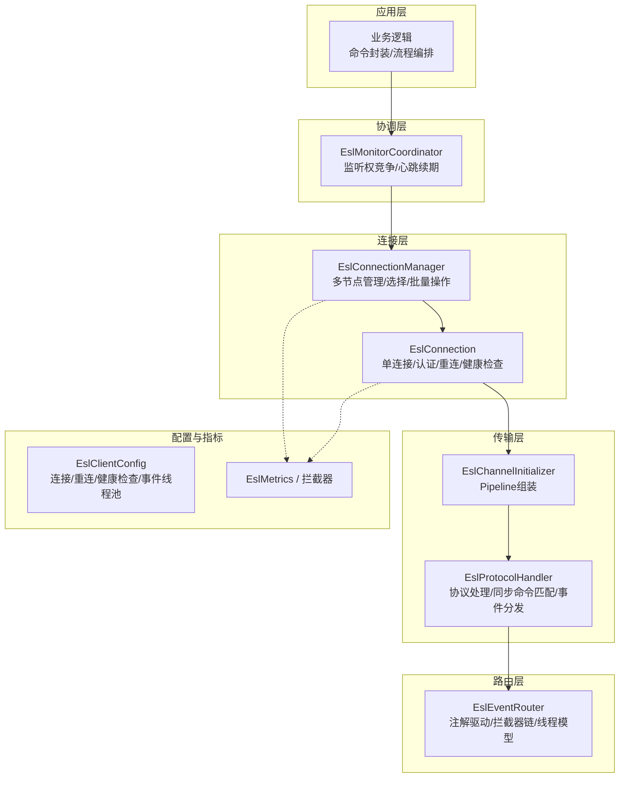
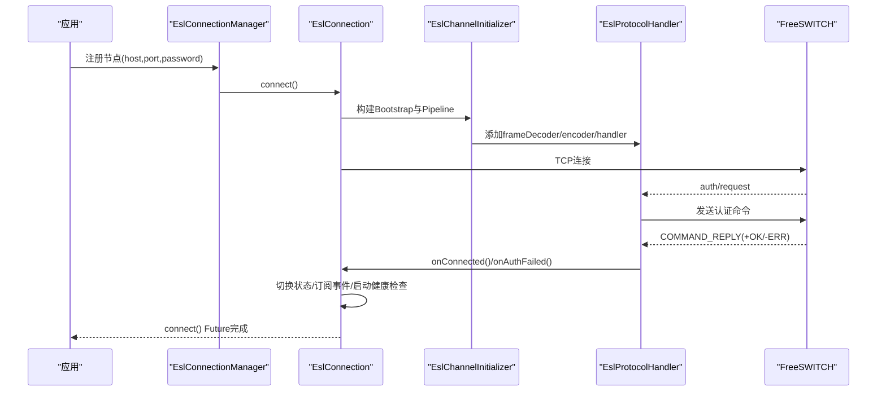
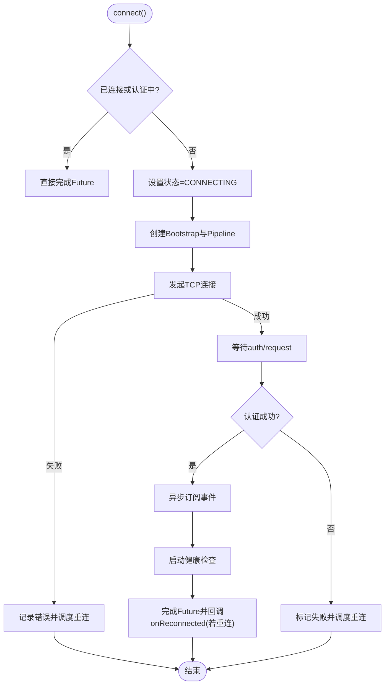
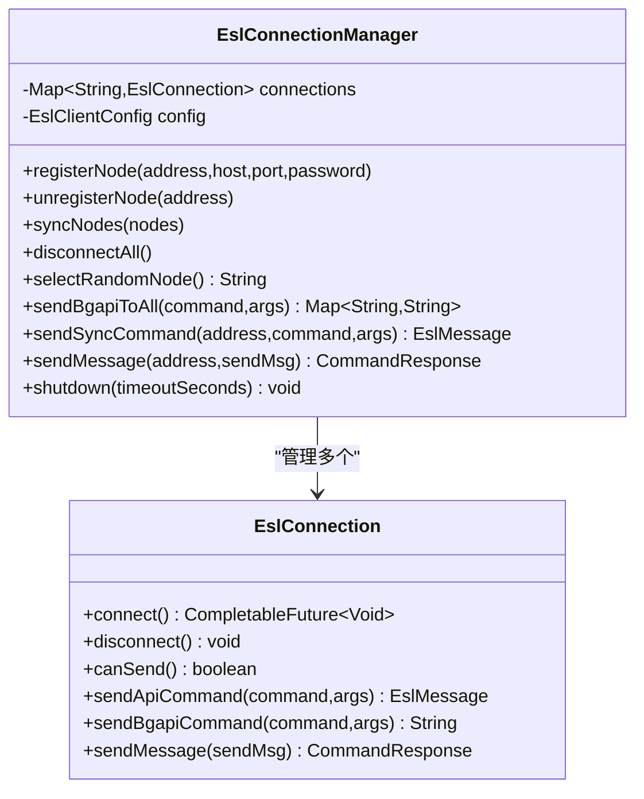
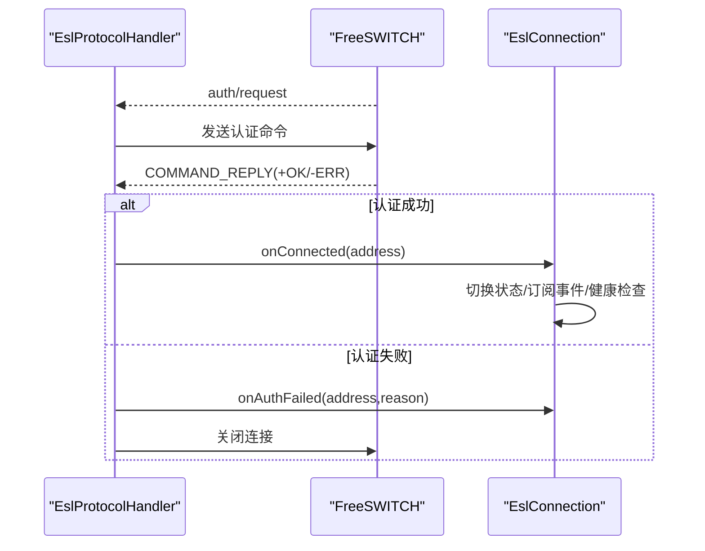
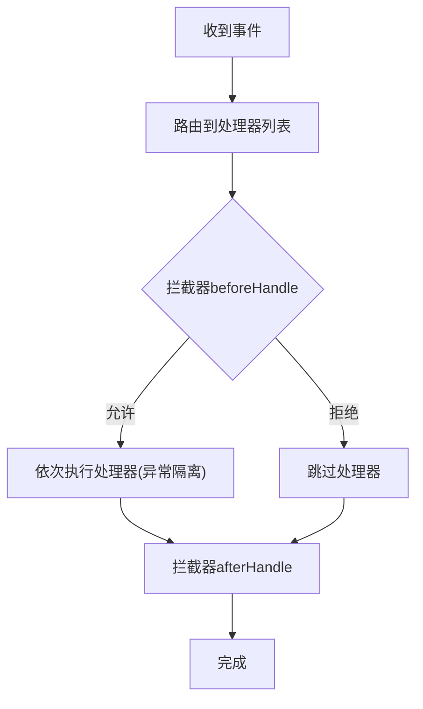
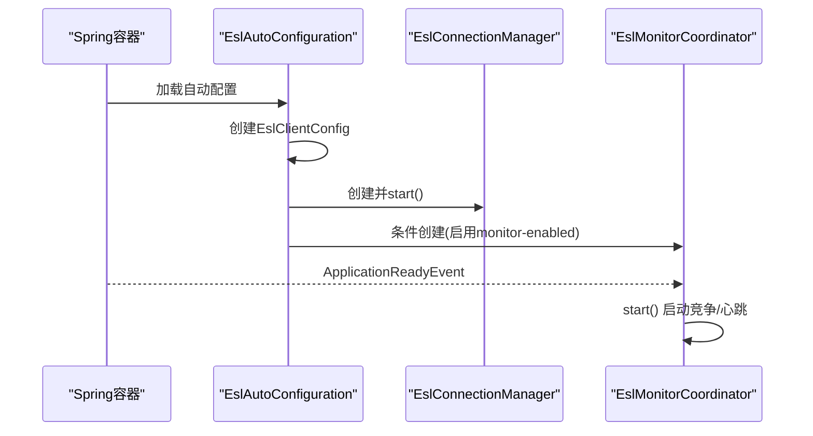
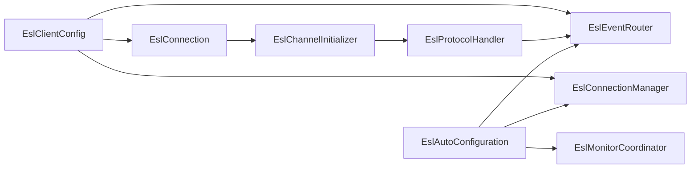

# 通道管理

<cite>
**本文引用的文件**
- [EslConnection.java](file://yudao-cloud/yudao-module-cc/ipcc-fs-esl/src/main/java/cn/ipcc/fs/esl/EslConnection.java)
- [EslConnectionManager.java](file://yudao-cloud/yudao-module-cc/ipcc-fs-esl/src/main/java/cn/ipcc/fs/esl/EslConnectionManager.java)
- [EslClientConfig.java](file://yudao-cloud/yudao-module-cc/ipcc-fs-esl/src/main/java/cn/ipcc/fs/esl/EslClientConfig.java)
- [EslChannelInitializer.java](file://yudao-cloud/yudao-module-cc/ipcc-fs-esl/src/main/java/cn/ipcc/fs/esl/netty/EslChannelInitializer.java)
- [EslProtocolHandler.java](file://yudao-cloud/yudao-module-cc/ipcc-fs-esl/src/main/java/cn/ipcc/fs/esl/netty/EslProtocolHandler.java)
- [EslEventRouter.java](file://yudao-cloud/yudao-module-cc/ipcc-fs-esl/src/main/java/cn/ipcc/fs/esl/router/EslEventRouter.java)
- [EslAutoConfiguration.java](file://yudao-cloud/yudao-module-cc/ipcc-fs-esl/src/main/java/cn/ipcc/fs/esl/spring/EslAutoConfiguration.java)
- [EslMonitorCoordinator.java](file://yudao-cloud/yudao-module-cc/ipcc-fs-esl/src/main/java/cn/ipcc/fs/esl/coordinator/EslMonitorCoordinator.java)
- [README.md](file://yudao-cloud/yudao-module-cc/ipcc-fs-esl/README.md)
</cite>

## 目录
1. [简介](#简介)
2. [项目结构](#项目结构)
3. [核心组件](#核心组件)
4. [架构总览](#架构总览)
5. [详细组件分析](#详细组件分析)
6. [依赖关系分析](#依赖关系分析)
7. [性能考量](#性能考量)
8. [故障诊断与排错](#故障诊断与排错)
9. [结论](#结论)
10. [附录：扩展与最佳实践](#附录：扩展与最佳实践)

## 简介
本技术文档聚焦于 ESL（FreeSWITCH Event Socket Library）客户端的通道管理，围绕 EslClientChannel 的设计模式展开，系统阐述连接生命周期、连接建立与断开处理、事件循环配置、初始化过程、连接池管理、资源释放机制、状态监控与健康检查、异常恢复策略，并提供扩展通道处理器、自定义连接参数与网络性能优化的具体示例。同时给出通道故障诊断、性能调优与最佳实践指南，帮助读者在生产环境中稳定高效地使用 ESL 客户端。

## 项目结构
该模块采用分层架构设计，自底向上包括基础设施层、传输层（Netty Pipeline）、连接管理层、事件路由层、分布式协调层以及业务层（由父程序实现）。核心类职责清晰、耦合度低，便于扩展与维护。

图表来源
- [EslAutoConfiguration.java:34-49](file://yudao-cloud/yudao-module-cc/ipcc-fs-esl/src/main/java/cn/ipcc/fs/esl/spring/EslAutoConfiguration.java#L34-L49)
- [README.md:50-76](file://yudao-cloud/yudao-module-cc/ipcc-fs-esl/README.md#L50-L76)

章节来源
- [README.md:50-98](file://yudao-cloud/yudao-module-cc/ipcc-fs-esl/README.md#L50-L98)

## 核心组件
- EslConnection：单连接客户端，负责 TCP 连接、认证握手、事件订阅、健康检查、自动重连、命令发送（api/bgapi/sendmsg）及连接生命周期回调。
- EslConnectionManager：多节点连接管理器，提供节点注册/移除、随机选择、批量命令、状态聚合与优雅关闭。
- EslChannelInitializer：Netty Pipeline 组装，顺序为帧解码→消息编码→协议处理。
- EslProtocolHandler：协议处理核心，完成认证响应匹配、同步命令 Future 匹配、事件分发、断开通知与异常处理。
- EslEventRouter：事件路由器，基于注解扫描处理器，支持三种执行策略（CHANNEL_HASH/SINGLE_THREAD/FULL_CONCURRENT），并维护拦截器链。
- EslClientConfig：纯 POJO 配置，涵盖连接超时、帧大小、重连策略、健康检查、事件线程池与分布式协调参数。
- EslAutoConfiguration：Spring Boot 自动装配，创建 Bean、注册监听器、启动协调器与事件路由。
- EslMonitorCoordinator：分布式监听权协调接口，用于多实例下竞争持权与心跳续期。

章节来源
- [EslConnection.java:32-48](file://yudao-cloud/yudao-module-cc/ipcc-fs-esl/src/main/java/cn/ipcc/fs/esl/EslConnection.java#L32-L48)
- [EslConnectionManager.java:19-31](file://yudao-cloud/yudao-module-cc/ipcc-fs-esl/src/main/java/cn/ipcc/fs/esl/EslConnectionManager.java#L19-L31)
- [EslChannelInitializer.java:13-21](file://yudao-cloud/yudao-module-cc/ipcc-fs-esl/src/main/java/cn/ipcc/fs/esl/netty/EslChannelInitializer.java#L13-L21)
- [EslProtocolHandler.java:23-38](file://yudao-cloud/yudao-module-cc/ipcc-fs-esl/src/main/java/cn/ipcc/fs/esl/netty/EslProtocolHandler.java#L23-L38)
- [EslEventRouter.java:14-31](file://yudao-cloud/yudao-module-cc/ipcc-fs-esl/src/main/java/cn/ipcc/fs/esl/router/EslEventRouter.java#L14-L31)
- [EslClientConfig.java:5-11](file://yudao-cloud/yudao-module-cc/ipcc-fs-esl/src/main/java/cn/ipcc/fs/esl/EslClientConfig.java#L5-L11)
- [EslAutoConfiguration.java:34-49](file://yudao-cloud/yudao-module-cc/ipcc-fs-esl/src/main/java/cn/ipcc/fs/esl/spring/EslAutoConfiguration.java#L34-L49)
- [EslMonitorCoordinator.java:3-12](file://yudao-cloud/yudao-module-cc/ipcc-fs-esl/src/main/java/cn/ipcc/fs/esl/coordinator/EslMonitorCoordinator.java#L3-L12)

## 架构总览
ESL 客户端采用“传输层 + 连接层 + 路由层 + 协调层”的分层架构。传输层基于 Netty 4.x，提供高性能 I/O；连接层封装单连接与多节点管理；路由层通过注解驱动将事件分发给处理器；协调层在分布式环境下保证同一组内仅一个实例持有监听权，避免重复处理。

图表来源
- [EslConnection.java:102-139](file://yudao-cloud/yudao-module-cc/ipcc-fs-esl/src/main/java/cn/ipcc/fs/esl/EslConnection.java#L102-L139)
- [EslChannelInitializer.java:40-46](file://yudao-cloud/yudao-module-cc/ipcc-fs-esl/src/main/java/cn/ipcc/fs/esl/netty/EslChannelInitializer.java#L40-L46)
- [EslProtocolHandler.java:146-213](file://yudao-cloud/yudao-module-cc/ipcc-fs-esl/src/main/java/cn/ipcc/fs/esl/netty/EslProtocolHandler.java#L146-L213)

## 详细组件分析

### EslConnection：单连接与生命周期管理
- 设计要点
  - 状态机：DISCONNECTED → CONNECTING → CONNECTED → AUTHENTICATED → RECONNECTING/FAILED
  - 异步连接与认证：connect() 返回 CompletableFuture，认证成功时完成；认证失败则异常完成并触发重连。
  - 事件订阅：认证成功后异步发送 event plain all，不阻塞 IO 线程。
  - 健康检查：定时发送 api status，连续失败达到阈值触发重连。
  - 自动重连：指数退避 + 随机抖动，支持最大重试次数限制。
  - 命令发送：sendApiCommand（带 api 前缀）、sendBgapiCommand（独立 bgapi 命令）、sendMessage（sendmsg）。
- 关键流程
  - 连接建立：TCP 成功后等待 auth/request，自动发送认证命令，认证成功触发内部监听器完成状态切换与事件订阅。
  - 断开处理：区分用户主动断开与异常断开；用户主动断开不触发重连。
  - 健康检查：周期性探测，失败计数达到阈值后触发重连。
- 复杂度与性能
  - 重连延迟计算 O(1)，健康检查任务 O(1) 每周期。
  - 事件订阅使用异步非阻塞，避免死锁。

图表来源
- [EslConnection.java:102-139](file://yudao-cloud/yudao-module-cc/ipcc-fs-esl/src/main/java/cn/ipcc/fs/esl/EslConnection.java#L102-L139)
- [EslConnection.java:336-374](file://yudao-cloud/yudao-module-cc/ipcc-fs-esl/src/main/java/cn/ipcc/fs/esl/EslConnection.java#L336-L374)
- [EslConnection.java:289-334](file://yudao-cloud/yudao-module-cc/ipcc-fs-esl/src/main/java/cn/ipcc/fs/esl/EslConnection.java#L289-L334)

章节来源
- [EslConnection.java:32-48](file://yudao-cloud/yudao-module-cc/ipcc-fs-esl/src/main/java/cn/ipcc/fs/esl/EslConnection.java#L32-L48)
- [EslConnection.java:102-139](file://yudao-cloud/yudao-module-cc/ipcc-fs-esl/src/main/java/cn/ipcc/fs/esl/EslConnection.java#L102-L139)
- [EslConnection.java:142-167](file://yudao-cloud/yudao-module-cc/ipcc-fs-esl/src/main/java/cn/ipcc/fs/esl/EslConnection.java#L142-L167)
- [EslConnection.java:169-269](file://yudao-cloud/yudao-module-cc/ipcc-fs-esl/src/main/java/cn/ipcc/fs/esl/EslConnection.java#L169-L269)
- [EslConnection.java:289-374](file://yudao-cloud/yudao-module-cc/ipcc-fs-esl/src/main/java/cn/ipcc/fs/esl/EslConnection.java#L289-L374)
- [EslConnection.java:381-509](file://yudao-cloud/yudao-module-cc/ipcc-fs-esl/src/main/java/cn/ipcc/fs/esl/EslConnection.java#L381-L509)

### EslConnectionManager：连接池管理与资源释放
- 设计要点
  - 多节点管理：ConcurrentHashMap 存储 EslConnection，支持动态注册/移除。
  - 节点选择：随机选择可用节点，支持批量向所有节点发送 bgapi。
  - 对账式重载：syncNodes 计算差集，移除多余节点、新增缺失节点，保持连接复用。
  - 优雅关闭：disconnectAll 逐个断开，等待资源释放。
- 关键流程
  - 注册节点：创建 EslConnection 并调用 connect()，异步完成连接。
  - 批量命令：遍历连接池，跳过不可用节点，收集 Job-UUID。
  - 状态聚合：getAvailableAddresses 过滤 canSend() 为 true 的节点。

图表来源
- [EslConnectionManager.java:19-31](file://yudao-cloud/yudao-module-cc/ipcc-fs-esl/src/main/java/cn/ipcc/fs/esl/EslConnectionManager.java#L19-L31)
- [EslConnectionManager.java:47-119](file://yudao-cloud/yudao-module-cc/ipcc-fs-esl/src/main/java/cn/ipcc/fs/esl/EslConnectionManager.java#L47-L119)
- [EslConnection.java:32-48](file://yudao-cloud/yudao-module-cc/ipcc-fs-esl/src/main/java/cn/ipcc/fs/esl/EslConnection.java#L32-L48)

章节来源
- [EslConnectionManager.java:47-119](file://yudao-cloud/yudao-module-cc/ipcc-fs-esl/src/main/java/cn/ipcc/fs/esl/EslConnectionManager.java#L47-L119)
- [EslConnectionManager.java:121-205](file://yudao-cloud/yudao-module-cc/ipcc-fs-esl/src/main/java/cn/ipcc/fs/esl/EslConnectionManager.java#L121-L205)
- [EslConnectionManager.java:219-232](file://yudao-cloud/yudao-module-cc/ipcc-fs-esl/src/main/java/cn/ipcc/fs/esl/EslConnectionManager.java#L219-L232)

### 传输层：Netty Pipeline 与协议处理
- Pipeline 组装顺序：EslFrameDecoder → EslMessageEncoder → EslProtocolHandler
- 协议处理要点
  - 同步命令匹配：pendingCommands 队列 FIFO，匹配时跳过已完成（超时/取消）的 future。
  - 认证流程：收到 auth/request 后发送认证命令，根据 Reply-Text 头判断成功/失败。
  - 事件分发：TEXT_EVENT_PLAIN/JSON 走 onEvent；BACKGROUND_JOB 走 onBackgroundJob。
  - 断开通知：收到 disconnect-notice 记录原因，channelInactive 统一触发 onDisconnected。

图表来源
- [EslChannelInitializer.java:40-46](file://yudao-cloud/yudao-module-cc/ipcc-fs-esl/src/main/java/cn/ipcc/fs/esl/netty/EslChannelInitializer.java#L40-L46)
- [EslProtocolHandler.java:146-213](file://yudao-cloud/yudao-module-cc/ipcc-fs-esl/src/main/java/cn/ipcc/fs/esl/netty/EslProtocolHandler.java#L146-L213)

章节来源
- [EslChannelInitializer.java:13-21](file://yudao-cloud/yudao-module-cc/ipcc-fs-esl/src/main/java/cn/ipcc/fs/esl/netty/EslChannelInitializer.java#L13-L21)
- [EslProtocolHandler.java:92-107](file://yudao-cloud/yudao-module-cc/ipcc-fs-esl/src/main/java/cn/ipcc/fs/esl/netty/EslProtocolHandler.java#L92-L107)
- [EslProtocolHandler.java:115-144](file://yudao-cloud/yudao-module-cc/ipcc-fs-esl/src/main/java/cn/ipcc/fs/esl/netty/EslProtocolHandler.java#L115-L144)
- [EslProtocolHandler.java:226-259](file://yudao-cloud/yudao-module-cc/ipcc-fs-esl/src/main/java/cn/ipcc/fs/esl/netty/EslProtocolHandler.java#L226-L259)

### 事件路由：注解驱动与线程模型
- 注解驱动：@EslEventName 标注处理器，自动扫描注册到路由器。
- 执行策略
  - CHANNEL_HASH：按 Unique-ID 哈希分配到固定单线程池，保证同通道事件顺序。
  - SINGLE_THREAD：单线程串行处理，适合低并发。
  - FULL_CONCURRENT：全并发线程池，适合无关联事件。
- 拦截器链：beforeHandle/afterHandle 在同一异步任务内执行，确保 ThreadLocal 透传与资源清理。

图表来源
- [EslEventRouter.java:14-31](file://yudao-cloud/yudao-module-cc/ipcc-fs-esl/src/main/java/cn/ipcc/fs/esl/router/EslEventRouter.java#L14-L31)
- [EslEventRouter.java:90-153](file://yudao-cloud/yudao-module-cc/ipcc-fs-esl/src/main/java/cn/ipcc/fs/esl/router/EslEventRouter.java#L90-L153)

章节来源
- [EslEventRouter.java:43-74](file://yudao-cloud/yudao-module-cc/ipcc-fs-esl/src/main/java/cn/ipcc/fs/esl/router/EslEventRouter.java#L43-L74)
- [EslEventRouter.java:76-88](file://yudao-cloud/yudao-module-cc/ipcc-fs-esl/src/main/java/cn/ipcc/fs/esl/router/EslEventRouter.java#L76-L88)
- [EslEventRouter.java:90-153](file://yudao-cloud/yudao-module-cc/ipcc-fs-esl/src/main/java/cn/ipcc/fs/esl/router/EslEventRouter.java#L90-L153)
- [EslEventRouter.java:155-195](file://yudao-cloud/yudao-module-cc/ipcc-fs-esl/src/main/java/cn/ipcc/fs/esl/router/EslEventRouter.java#L155-L195)

### Spring 自动配置与协调器
- 自动装配：创建 EslClientConfig、EslConnectionManager、EslEventRouter、EslMetrics 等 Bean，注册监听器与静态节点。
- 协调器：条件性创建 RedisEslMonitorCoordinator，容器就绪后启动监听权竞争，避免与 Bean 初始化并发冲突。

图表来源
- [EslAutoConfiguration.java:56-86](file://yudao-cloud/yudao-module-cc/ipcc-fs-esl/src/main/java/cn/ipcc/fs/esl/spring/EslAutoConfiguration.java#L56-L86)
- [EslAutoConfiguration.java:88-127](file://yudao-cloud/yudao-module-cc/ipcc-fs-esl/src/main/java/cn/ipcc/fs/esl/spring/EslAutoConfiguration.java#L88-L127)
- [EslAutoConfiguration.java:129-169](file://yudao-cloud/yudao-module-cc/ipcc-fs-esl/src/main/java/cn/ipcc/fs/esl/spring/EslAutoConfiguration.java#L129-L169)

章节来源
- [EslAutoConfiguration.java:56-86](file://yudao-cloud/yudao-module-cc/ipcc-fs-esl/src/main/java/cn/ipcc/fs/esl/spring/EslAutoConfiguration.java#L56-L86)
- [EslAutoConfiguration.java:88-127](file://yudao-cloud/yudao-module-cc/ipcc-fs-esl/src/main/java/cn/ipcc/fs/esl/spring/EslAutoConfiguration.java#L88-L127)
- [EslAutoConfiguration.java:129-169](file://yudao-cloud/yudao-module-cc/ipcc-fs-esl/src/main/java/cn/ipcc/fs/esl/spring/EslAutoConfiguration.java#L129-L169)
- [EslMonitorCoordinator.java:3-12](file://yudao-cloud/yudao-module-cc/ipcc-fs-esl/src/main/java/cn/ipcc/fs/esl/coordinator/EslMonitorCoordinator.java#L3-L12)

## 依赖关系分析
- 组件耦合
  - EslConnection 依赖 EslClientConfig 与 Netty Pipeline（EslChannelInitializer、EslProtocolHandler）。
  - EslConnectionManager 聚合多个 EslConnection，提供高层 API。
  - EslEventRouter 依赖 EslClientConfig 的事件线程池配置，并通过拦截器链增强处理能力。
  - EslAutoConfiguration 装配所有核心组件，注入监听器与协调器。
- 外部依赖
  - Netty 4.x：高性能 I/O 与事件循环。
  - Spring Boot：自动配置与 Bean 管理。
  - Redis（可选）：分布式监听权协调。

图表来源
- [EslClientConfig.java:5-11](file://yudao-cloud/yudao-module-cc/ipcc-fs-esl/src/main/java/cn/ipcc/fs/esl/EslClientConfig.java#L5-L11)
- [EslAutoConfiguration.java:56-86](file://yudao-cloud/yudao-module-cc/ipcc-fs-esl/src/main/java/cn/ipcc/fs/esl/spring/EslAutoConfiguration.java#L56-L86)
- [EslChannelInitializer.java:40-46](file://yudao-cloud/yudao-module-cc/ipcc-fs-esl/src/main/java/cn/ipcc/fs/esl/netty/EslChannelInitializer.java#L40-L46)

章节来源
- [EslClientConfig.java:13-60](file://yudao-cloud/yudao-module-cc/ipcc-fs-esl/src/main/java/cn/ipcc/fs/esl/EslClientConfig.java#L13-L60)
- [EslAutoConfiguration.java:56-86](file://yudao-cloud/yudao-module-cc/ipcc-fs-esl/src/main/java/cn/ipcc/fs/esl/spring/EslAutoConfiguration.java#L56-L86)

## 性能考量
- 事件执行策略选择
  - CHANNEL_HASH：推荐，保证同通道事件顺序，降低乱序风险。
  - SINGLE_THREAD：低并发场景简单可靠。
  - FULL_CONCURRENT：高吞吐但需确保事件无顺序依赖。
- 线程池与队列
  - 合理设置 eventThreadPoolSize、eventQueueCapacity、eventRejectedPolicy，避免背压导致丢事件。
- 健康检查与重连
  - 调整 healthCheckIntervalSeconds 与 healthCheckFailureThreshold，平衡检测频率与误判率。
  - 重连策略使用指数退避 + 抖动，避免雪崩。
- 网络参数
  - maxFrameSize 与 maxHeaderLines 防止 OOM 与 header 放大攻击。
  - nettyWorkerThreads 根据 CPU 核数与 I/O 负载调优。

[本节为通用性能指导，无需特定文件引用]

## 故障诊断与排错
- 常见问题定位
  - 认证失败：检查密码与 FS 配置，关注 onAuthFailed 日志与重试次数。
  - 连接假死：开启健康检查，观察连续失败阈值触发重连。
  - 事件丢失：检查事件线程池容量与拒绝策略，必要时增大队列或调整策略。
  - 命令超时：确认 commandTimeoutSeconds 是否合理，避免长耗时命令阻塞。
- 诊断步骤
  - 查看连接状态：getState() 与 canSend() 判断连接可用性。
  - 检查健康检查：日志中健康检查失败次数与重连触发。
  - 分析事件路由：统计 totalRouted 与处理器异常日志。
  - 协调器状态：hasMonitorRight() 判断是否持权，避免重复处理。

章节来源
- [EslConnection.java:336-374](file://yudao-cloud/yudao-module-cc/ipcc-fs-esl/src/main/java/cn/ipcc/fs/esl/EslConnection.java#L336-L374)
- [EslProtocolHandler.java:146-213](file://yudao-cloud/yudao-module-cc/ipcc-fs-esl/src/main/java/cn/ipcc/fs/esl/netty/EslProtocolHandler.java#L146-L213)
- [EslEventRouter.java:188-195](file://yudao-cloud/yudao-module-cc/ipcc-fs-esl/src/main/java/cn/ipcc/fs/esl/router/EslEventRouter.java#L188-L195)
- [EslMonitorCoordinator.java:21-25](file://yudao-cloud/yudao-module-cc/ipcc-fs-esl/src/main/java/cn/ipcc/fs/esl/coordinator/EslMonitorCoordinator.java#L21-L25)

## 结论
本模块以清晰的层次化设计与强大的连接管理能力，提供了稳定高效的 ESL 客户端实现。通过自动重连、健康检查、事件路由与分布式协调，有效解决了传统库的痛点。生产环境建议结合业务负载合理配置事件线程池、健康检查与重连策略，并充分利用拦截器链实现可观测性与扩展能力。

[本节为总结性内容，无需特定文件引用]

## 附录：扩展与最佳实践
- 扩展通道处理器
  - 实现 EslEventHandler 并标注 @EslEventName，利用 @Order 控制执行顺序。
  - 使用 EslEventInterceptor 实现前置/后置处理，支持链路追踪与过滤。
- 自定义连接参数
  - 通过 EslClientProperties 覆盖连接超时、帧大小、重连策略等。
  - 调整事件执行策略与线程池参数，适配不同负载场景。
- 优化网络性能
  - 合理设置 nettyWorkerThreads、maxFrameSize、maxHeaderLines。
  - 使用 sendBgapiCommand 避免长时间阻塞，结合事件异步处理结果。
- 最佳实践
  - 始终使用异步方式订阅事件，避免阻塞 IO 线程。
  - 在分布式部署中启用 monitor-enabled，确保唯一持权实例。
  - 定期监控健康检查与重连日志，及时调整阈值。

章节来源
- [README.md:181-263](file://yudao-cloud/yudao-module-cc/ipcc-fs-esl/README.md#L181-L263)
- [EslEventRouter.java:43-74](file://yudao-cloud/yudao-module-cc/ipcc-fs-esl/src/main/java/cn/ipcc/fs/esl/router/EslEventRouter.java#L43-L74)
- [EslClientConfig.java:13-60](file://yudao-cloud/yudao-module-cc/ipcc-fs-esl/src/main/java/cn/ipcc/fs/esl/EslClientConfig.java#L13-L60)