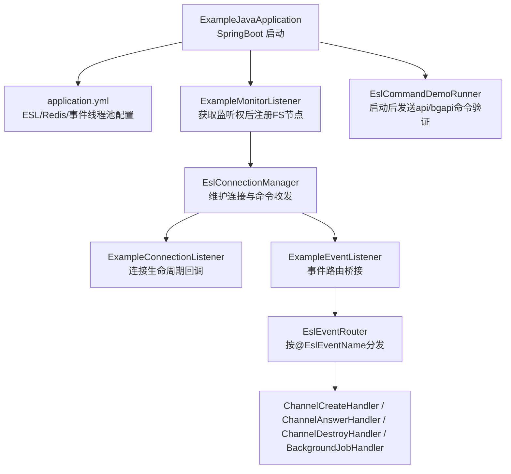
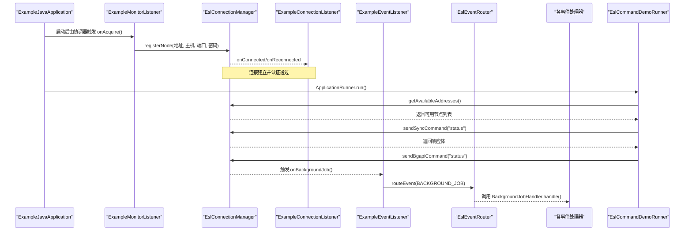
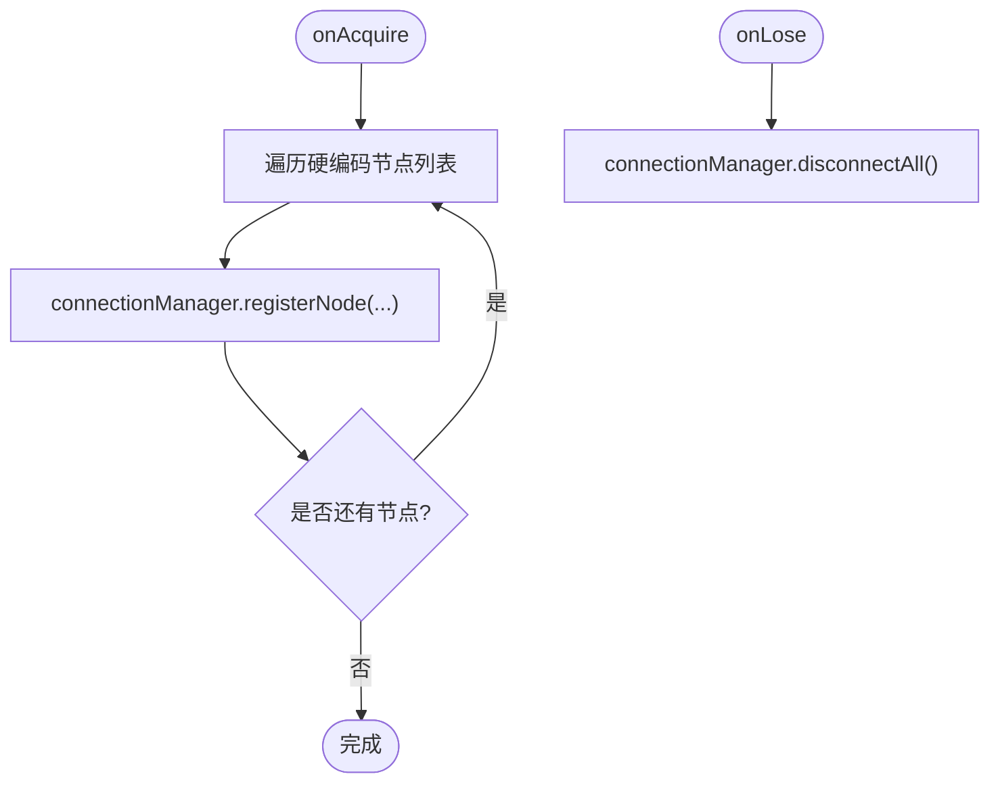
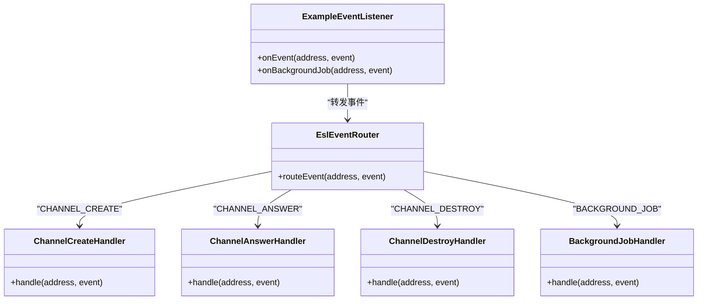
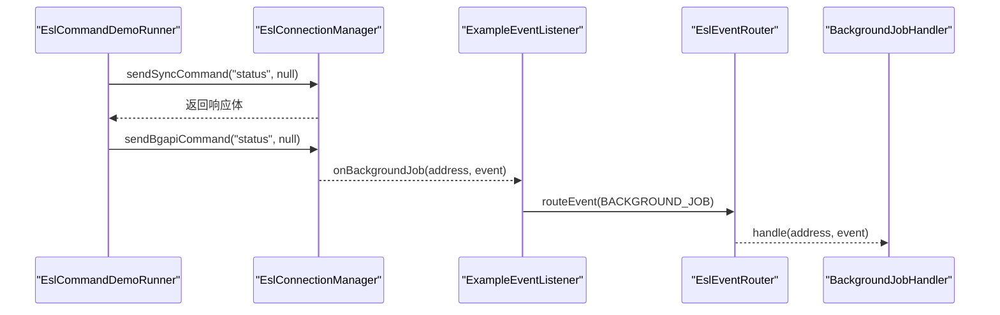
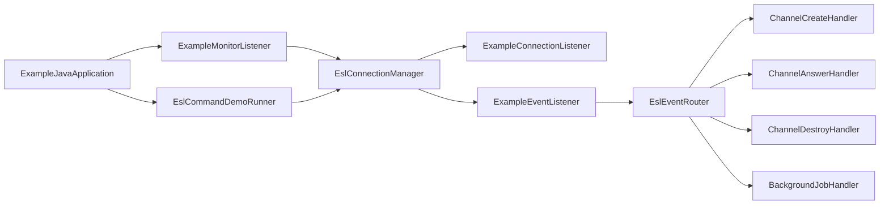

# 使用示例

<cite>
**本文引用的文件**
- [ExampleJavaApplication.java](file://yudao-cloud/yudao-module-cc/ipcc-fs-esl/example/example-java/src/main/java/cn/ipcc/fs/esl/example/ExampleJavaApplication.java)
- [application.yml](file://yudao-cloud/yudao-module-cc/ipcc-fs-esl/example/example-java/src/main/resources/application.yml)
- [ExampleConnectionListener.java](file://yudao-cloud/yudao-module-cc/ipcc-fs-esl/example/example-java/src/main/java/cn/ipcc/fs/esl/example/listener/ExampleConnectionListener.java)
- [ExampleEventListener.java](file://yudao-cloud/yudao-module-cc/ipcc-fs-esl/example/example-java/src/main/java/cn/ipcc/fs/esl/example/listener/ExampleEventListener.java)
- [ExampleMonitorListener.java](file://yudao-cloud/yudao-module-cc/ipcc-fs-esl/example/example-java/src/main/java/cn/ipcc/fs/esl/example/listener/ExampleMonitorListener.java)
- [ChannelCreateHandler.java](file://yudao-cloud/yudao-module-cc/ipcc-fs-esl/example/example-java/src/main/java/cn/ipcc/fs/esl/example/handler/ChannelCreateHandler.java)
- [ChannelAnswerHandler.java](file://yudao-cloud/yudao-module-cc/ipcc-fs-esl/example/example-java/src/main/java/cn/ipcc/fs/esl/example/handler/ChannelAnswerHandler.java)
- [ChannelDestroyHandler.java](file://yudao-cloud/yudao-module-cc/ipcc-fs-esl/example/example-java/src/main/java/cn/ipcc/fs/esl/example/handler/ChannelDestroyHandler.java)
- [BackgroundJobHandler.java](file://yudao-cloud/yudao-module-cc/ipcc-fs-esl/example/example-java/src/main/java/cn/ipcc/fs/esl/example/handler/BackgroundJobHandler.java)
- [EslCommandDemoRunner.java](file://yudao-cloud/yudao-module-cc/ipcc-fs-esl/example/example-java/src/main/java/cn/ipcc/fs/esl/example/runner/EslCommandDemoRunner.java)
</cite>

## 目录
1. [简介](#简介)
2. [项目结构](#项目结构)
3. [核心组件](#核心组件)
4. [架构总览](#架构总览)
5. [详细组件分析](#详细组件分析)
6. [依赖关系分析](#依赖关系分析)
7. [性能与并发特性](#性能与并发特性)
8. [故障排查指南](#故障排查指南)
9. [结论](#结论)
10. [附录：常用场景与最佳实践](#附录：常用场景与最佳实践)

## 简介
本示例基于 ExampleJavaApplication，演示如何集成 FreeSWITCH ESL（Event Socket Library），完成应用启动、连接配置、事件订阅、命令执行与批量操作。通过监听器与处理器，覆盖通话生命周期事件（创建、应答、销毁）、后台任务事件（BACKGROUND_JOB）以及系统健康检查等常见场景，并提供同步/异步命令发送的完整链路验证。

## 项目结构
示例工程位于 ipcc-fs-esl/example/example-java，采用 Spring Boot 自动装配模式：
- 启动类启用调度能力，用于周期性指标输出。
- 配置文件集中管理 ESL 连接、重连、健康检查、事件线程池与分布式协调参数。
- 监听器负责连接生命周期、事件路由桥接与分布式监听权变更。
- 处理器按事件名注解进行路由处理。
- Runner 在应用启动后等待节点可用并执行命令验证。

图表来源
- [ExampleJavaApplication.java:14-20](file://yudao-cloud/yudao-module-cc/ipcc-fs-esl/example/example-java/src/main/java/cn/ipcc/fs/esl/example/ExampleJavaApplication.java#L14-L20)
- [application.yml:10-39](file://yudao-cloud/yudao-module-cc/ipcc-fs-esl/example/example-java/src/main/resources/application.yml#L10-L39)
- [ExampleMonitorListener.java:21-51](file://yudao-cloud/yudao-module-cc/ipcc-fs-esl/example/example-java/src/main/java/cn/ipcc/fs/esl/example/listener/ExampleMonitorListener.java#L21-L51)
- [EslCommandDemoRunner.java:21-34](file://yudao-cloud/yudao-module-cc/ipcc-fs-esl/example/example-java/src/main/java/cn/ipcc/fs/esl/example/runner/EslCommandDemoRunner.java#L21-L34)

章节来源
- [ExampleJavaApplication.java:14-20](file://yudao-cloud/yudao-module-cc/ipcc-fs-esl/example/example-java/src/main/java/cn/ipcc/fs/esl/example/ExampleJavaApplication.java#L14-L20)
- [application.yml:10-39](file://yudao-cloud/yudao-module-cc/ipcc-fs-esl/example/example-java/src/main/resources/application.yml#L10-L39)

## 核心组件
- 应用启动与自动装配
  - 启动类启用调度，配合自动装配创建连接管理器、事件路由器、监控协调器与拦截器等 Bean。
- 连接与重连
  - 通过配置项控制连接超时、命令超时、帧大小、工作线程数；支持无限或有限次重连与健康检查阈值。
- 分布式监听权
  - 仅当实例获取监听权时才连接 FS 节点；丢失监听权时断开所有连接，避免多实例重复处理。
- 事件路由与处理
  - 自定义事件监听器将原始事件转发至路由器，路由器按事件名注解分发到具体处理器；BACKGROUND_JOB 走独立线程池，避免阻塞普通通道事件。
- 命令执行
  - 提供同步命令（如 api status）与异步命令（如 bgapi status）发送方式，并通过 BACKGROUND_JOB 事件接收执行结果。

章节来源
- [ExampleJavaApplication.java:14-20](file://yudao-cloud/yudao-module-cc/ipcc-fs-esl/example/example-java/src/main/java/cn/ipcc/fs/esl/example/ExampleJavaApplication.java#L14-L20)
- [application.yml:10-39](file://yudao-cloud/yudao-module-cc/ipcc-fs-esl/example/example-java/src/main/resources/application.yml#L10-L39)
- [ExampleMonitorListener.java:21-51](file://yudao-cloud/yudao-module-cc/ipcc-fs-esl/example/example-java/src/main/java/cn/ipcc/fs/esl/example/listener/ExampleMonitorListener.java#L21-L51)
- [ExampleEventListener.java:18-33](file://yudao-cloud/yudao-module-cc/ipcc-fs-esl/example/example-java/src/main/java/cn/ipcc/fs/esl/example/listener/ExampleEventListener.java#L18-L33)
- [EslCommandDemoRunner.java:21-79](file://yudao-cloud/yudao-module-cc/ipcc-fs-esl/example/example-java/src/main/java/cn/ipcc/fs/esl/example/runner/EslCommandDemoRunner.java#L21-L79)

## 架构总览
下图展示了从应用启动到事件处理的端到端流程，包括分布式监听权、连接管理、事件路由与命令执行。

图表来源
- [ExampleMonitorListener.java:34-51](file://yudao-cloud/yudao-module-cc/ipcc-fs-esl/example/example-java/src/main/java/cn/ipcc/fs/esl/example/listener/ExampleMonitorListener.java#L34-L51)
- [ExampleConnectionListener.java:16-44](file://yudao-cloud/yudao-module-cc/ipcc-fs-esl/example/example-java/src/main/java/cn/ipcc/fs/esl/example/listener/ExampleConnectionListener.java#L16-L44)
- [ExampleEventListener.java:25-33](file://yudao-cloud/yudao-module-cc/ipcc-fs-esl/example/example-java/src/main/java/cn/ipcc/fs/esl/example/listener/ExampleEventListener.java#L25-L33)
- [EslCommandDemoRunner.java:25-79](file://yudao-cloud/yudao-module-cc/ipcc-fs-esl/example/example-java/src/main/java/cn/ipcc/fs/esl/example/runner/EslCommandDemoRunner.java#L25-L79)

## 详细组件分析

### 应用启动与连接配置
- 启动类启用调度，便于周期性指标输出。
- 配置项涵盖连接超时、命令超时、帧大小、工作线程、重连策略、健康检查、事件执行器模式与线程池容量、拒绝策略，以及分布式协调开关与组标识、竞争间隔、锁过期与心跳间隔。
- 示例中 Redis 用于分布式协调（本地 Docker 无密码）。

章节来源
- [ExampleJavaApplication.java:14-20](file://yudao-cloud/yudao-module-cc/ipcc-fs-esl/example/example-java/src/main/java/cn/ipcc/fs/esl/example/ExampleJavaApplication.java#L14-L20)
- [application.yml:1-45](file://yudao-cloud/yudao-module-cc/ipcc-fs-esl/example/example-java/src/main/resources/application.yml#L1-L45)

### 分布式监听权与节点注册
- 监听权获取后，按硬编码的 FS 节点列表逐一注册连接；已存在节点会跳过重复注册。
- 丢失监听权时断开所有连接，确保单实例持有监听权时唯一对外连接。

图表来源
- [ExampleMonitorListener.java:29-51](file://yudao-cloud/yudao-module-cc/ipcc-fs-esl/example/example-java/src/main/java/cn/ipcc/fs/esl/example/listener/ExampleMonitorListener.java#L29-L51)

章节来源
- [ExampleMonitorListener.java:21-51](file://yudao-cloud/yudao-module-cc/ipcc-fs-esl/example/example-java/src/main/java/cn/ipcc/fs/esl/example/listener/ExampleMonitorListener.java#L21-L51)

### 连接生命周期监听
- 实现连接/断开/重连/认证失败等回调，便于观测连接状态机与问题定位。

章节来源
- [ExampleConnectionListener.java:16-44](file://yudao-cloud/yudao-module-cc/ipcc-fs-esl/example/example-java/src/main/java/cn/ipcc/fs/esl/example/listener/ExampleConnectionListener.java#L16-L44)

### 事件路由与处理器
- 自定义事件监听器将原始事件与后台任务事件统一转发至路由器。
- 路由器按 @EslEventName 注解将事件分发到对应处理器；BACKGROUND_JOB 走独立线程池，避免与普通通道事件互相阻塞。
- 示例处理器覆盖通话生命周期关键事件：创建、应答、销毁，以及后台任务结果。

图表来源
- [ExampleEventListener.java:25-33](file://yudao-cloud/yudao-module-cc/ipcc-fs-esl/example/example-java/src/main/java/cn/ipcc/fs/esl/example/listener/ExampleEventListener.java#L25-L33)
- [ChannelCreateHandler.java:17-32](file://yudao-cloud/yudao-module-cc/ipcc-fs-esl/example/example-java/src/main/java/cn/ipcc/fs/esl/example/handler/ChannelCreateHandler.java#L17-L32)
- [ChannelAnswerHandler.java:17-30](file://yudao-cloud/yudao-module-cc/ipcc-fs-esl/example/example-java/src/main/java/cn/ipcc/fs/esl/example/handler/ChannelAnswerHandler.java#L17-L30)
- [ChannelDestroyHandler.java:17-31](file://yudao-cloud/yudao-module-cc/ipcc-fs-esl/example/example-java/src/main/java/cn/ipcc/fs/esl/example/handler/ChannelDestroyHandler.java#L17-L31)
- [BackgroundJobHandler.java:17-31](file://yudao-cloud/yudao-module-cc/ipcc-fs-esl/example/example-java/src/main/java/cn/ipcc/fs/esl/example/handler/BackgroundJobHandler.java#L17-L31)

章节来源
- [ExampleEventListener.java:18-33](file://yudao-cloud/yudao-module-cc/ipcc-fs-esl/example/example-java/src/main/java/cn/ipcc/fs/esl/example/listener/ExampleEventListener.java#L18-L33)
- [ChannelCreateHandler.java:17-32](file://yudao-cloud/yudao-module-cc/ipcc-fs-esl/example/example-java/src/main/java/cn/ipcc/fs/esl/example/handler/ChannelCreateHandler.java#L17-L32)
- [ChannelAnswerHandler.java:17-30](file://yudao-cloud/yudao-module-cc/ipcc-fs-esl/example/example-java/src/main/java/cn/ipcc/fs/esl/example/handler/ChannelAnswerHandler.java#L17-L30)
- [ChannelDestroyHandler.java:17-31](file://yudao-cloud/yudao-module-cc/ipcc-fs-esl/example/example-java/src/main/java/cn/ipcc/fs/esl/example/handler/ChannelDestroyHandler.java#L17-L31)
- [BackgroundJobHandler.java:17-31](file://yudao-cloud/yudao-module-cc/ipcc-fs-esl/example/example-java/src/main/java/cn/ipcc/fs/esl/example/handler/BackgroundJobHandler.java#L17-L31)

### 命令执行与批量操作
- 启动后轮询等待可用节点，随后发送同步命令（如 api status）与异步命令（如 bgapi status）。
- 同步命令直接返回响应体；异步命令返回 Job-UUID，执行结果通过 BACKGROUND_JOB 事件路由到处理器。
- 可基于此模式扩展批量操作：循环发送多条 bgapi 命令，收集各自 Job-UUID，并在处理器中汇总结果。

图表来源
- [EslCommandDemoRunner.java:57-79](file://yudao-cloud/yudao-module-cc/ipcc-fs-esl/example/example-java/src/main/java/cn/ipcc/fs/esl/example/runner/EslCommandDemoRunner.java#L57-L79)
- [ExampleEventListener.java:25-33](file://yudao-cloud/yudao-module-cc/ipcc-fs-esl/example/example-java/src/main/java/cn/ipcc/fs/esl/example/listener/ExampleEventListener.java#L25-L33)
- [BackgroundJobHandler.java:24-31](file://yudao-cloud/yudao-module-cc/ipcc-fs-esl/example/example-java/src/main/java/cn/ipcc/fs/esl/example/handler/BackgroundJobHandler.java#L24-L31)

章节来源
- [EslCommandDemoRunner.java:25-79](file://yudao-cloud/yudao-module-cc/ipcc-fs-esl/example/example-java/src/main/java/cn/ipcc/fs/esl/example/runner/EslCommandDemoRunner.java#L25-L79)

## 依赖关系分析
- 启动类依赖 Spring Boot 自动装配，创建连接管理器、事件路由器、监控协调器与拦截器。
- 监听器之间职责清晰：连接生命周期、事件路由桥接、监听权变更。
- 处理器通过注解与路由器解耦，新增事件只需添加新处理器。
- Runner 依赖连接管理器提供的可用节点查询与命令发送接口。

图表来源
- [ExampleJavaApplication.java:14-20](file://yudao-cloud/yudao-module-cc/ipcc-fs-esl/example/example-java/src/main/java/cn/ipcc/fs/esl/example/ExampleJavaApplication.java#L14-L20)
- [ExampleMonitorListener.java:21-51](file://yudao-cloud/yudao-module-cc/ipcc-fs-esl/example/example-java/src/main/java/cn/ipcc/fs/esl/example/listener/ExampleMonitorListener.java#L21-L51)
- [EslCommandDemoRunner.java:21-79](file://yudao-cloud/yudao-module-cc/ipcc-fs-esl/example/example-java/src/main/java/cn/ipcc/fs/esl/example/runner/EslCommandDemoRunner.java#L21-L79)
- [ExampleEventListener.java:18-33](file://yudao-cloud/yudao-module-cc/ipcc-fs-esl/example/example-java/src/main/java/cn/ipcc/fs/esl/example/listener/ExampleEventListener.java#L18-L33)

章节来源
- [ExampleJavaApplication.java:14-20](file://yudao-cloud/yudao-module-cc/ipcc-fs-esl/example/example-java/src/main/java/cn/ipcc/fs/esl/example/ExampleJavaApplication.java#L14-L20)
- [ExampleMonitorListener.java:21-51](file://yudao-cloud/yudao-module-cc/ipcc-fs-esl/example/example-java/src/main/java/cn/ipcc/fs/esl/example/listener/ExampleMonitorListener.java#L21-L51)
- [EslCommandDemoRunner.java:21-79](file://yudao-cloud/yudao-module-cc/ipcc-fs-esl/example/example-java/src/main/java/cn/ipcc/fs/esl/example/runner/EslCommandDemoRunner.java#L21-L79)
- [ExampleEventListener.java:18-33](file://yudao-cloud/yudao-module-cc/ipcc-fs-esl/example/example-java/src/main/java/cn/ipcc/fs/esl/example/listener/ExampleEventListener.java#L18-L33)

## 性能与并发特性
- 事件执行器模式为 CHANNEL_HASH，保证同一通道的事件顺序处理，避免乱序导致的业务不一致。
- 事件线程池大小与队列容量可调，拒绝策略默认 CallerRuns，防止背压时丢事件。
- BACKGROUND_JOB 事件使用独立线程池，避免与通道事件互相阻塞，提升吞吐与稳定性。
- 健康检查与重连策略保障连接可用性，减少因网络抖动导致的服务中断。

章节来源
- [application.yml:26-30](file://yudao-cloud/yudao-module-cc/ipcc-fs-esl/example/example-java/src/main/resources/application.yml#L26-L30)
- [BackgroundJobHandler.java:13-17](file://yudao-cloud/yudao-module-cc/ipcc-fs-esl/example/example-java/src/main/java/cn/ipcc/fs/esl/example/handler/BackgroundJobHandler.java#L13-L17)

## 故障排查指南
- 无法获取监听权或节点不可用
  - 检查 Redis 连通性与 monitor-enabled 配置；确认 monitor-group 一致。
  - 查看 ExampleMonitorListener.onAcquire 日志，确认是否注册了节点。
- 连接频繁断开或认证失败
  - 检查 ExampleConnectionListener 的 onDisconnected/onAuthFailed 日志，核对地址、端口与密码。
  - 调整 connect-timeout-seconds 与 command-timeout-seconds，观察是否超时。
- 事件未到达处理器
  - 确认 ExampleEventListener 已将事件转发至路由器；检查 @EslEventName 是否与 FS 事件名一致。
  - 关注 event-executor-mode 与 event-thread-pool-size/event-queue-capacity，避免队列满导致丢弃。
- 命令执行无响应
  - 同步命令：检查 sendSyncCommand 返回值与异常日志。
  - 异步命令：检查 sendBgapiCommand 返回的 Job-UUID 与 BACKGROUND_JOB 事件是否到达 BackgroundJobHandler。

章节来源
- [ExampleConnectionListener.java:16-44](file://yudao-cloud/yudao-module-cc/ipcc-fs-esl/example/example-java/src/main/java/cn/ipcc/fs/esl/example/listener/ExampleConnectionListener.java#L16-L44)
- [ExampleEventListener.java:25-33](file://yudao-cloud/yudao-module-cc/ipcc-fs-esl/example/example-java/src/main/java/cn/ipcc/fs/esl/example/listener/ExampleEventListener.java#L25-L33)
- [EslCommandDemoRunner.java:57-79](file://yudao-cloud/yudao-module-cc/ipcc-fs-esl/example/example-java/src/main/java/cn/ipcc/fs/esl/example/runner/EslCommandDemoRunner.java#L57-L79)
- [application.yml:10-39](file://yudao-cloud/yudao-module-cc/ipcc-fs-esl/example/example-java/src/main/resources/application.yml#L10-L39)

## 结论
该示例以最小成本展示了 FreeSWITCH ESL 集成的关键路径：启动与自动装配、分布式监听权、连接管理与重连、事件路由与处理器、同步/异步命令执行。通过合理配置事件线程池与拒绝策略，结合健康检查与重连机制，可在生产环境中获得稳定且可扩展的 ESL 接入能力。

## 附录：常用场景与最佳实践
- 监控呼叫状态
  - 订阅 CHANNEL_CREATE/ANSWER/DESTROY 事件，记录 UNIQUE_ID、主被叫号码、方向与挂断原因，形成通话全链路视图。
- 控制媒体流
  - 通过 bgapi 发送媒体控制命令（如播放、录音、静音），利用 BACKGROUND_JOB 事件获取执行结果。
- 查询系统信息
  - 使用 api status 等命令获取 FreeSWITCH 运行状态，结合定时任务输出指标摘要。
- 批量操作
  - 循环发送多条 bgapi 命令，收集 Job-UUID 并关联后续 BACKGROUND_JOB 结果，必要时引入去重与超时重试。
- 最佳实践
  - 事件处理尽量轻量，耗时逻辑异步化，避免阻塞事件线程池。
  - 合理设置 event-queue-capacity 与拒绝策略，防止背压导致丢事件。
  - 使用 CHANNEL_HASH 模式保证同通道事件顺序，避免业务状态错乱。
  - 对关键命令增加超时与重试，结合日志与指标进行可观测性建设。