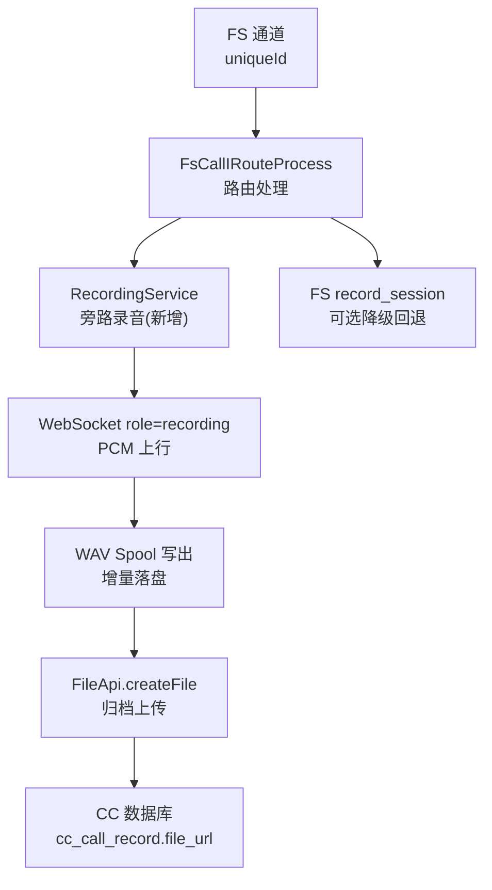
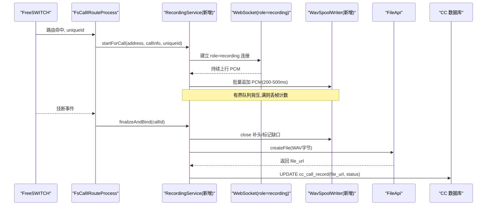
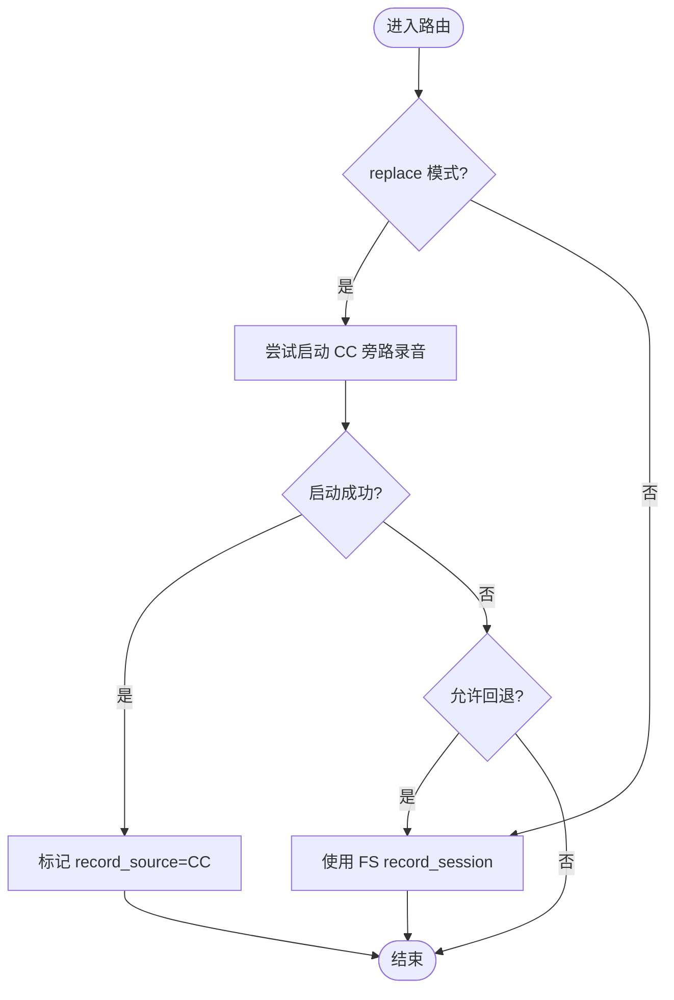
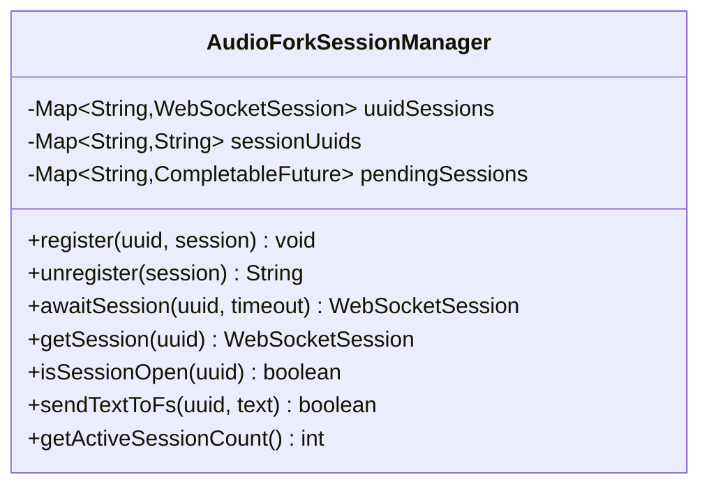
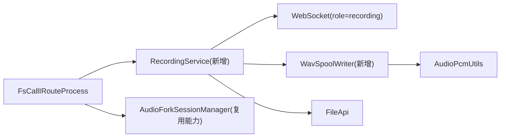

# 录音统一存储方案-演进档详细实现文档

<cite>
**本文引用的文件**
- [FsCallIRouteProcess.java](file://yudao-cloud/yudao-module-cc/yudao-module-cc-server/src/main/java/cn/iocoder/yudao/module/cc/esl/handler/call/FsCallIRouteProcess.java)
- [AudioForkSessionManager.java](file://yudao-cloud/yudao-module-cc/yudao-module-cc-server/src/main/java/cn/iocoder/yudao/module/cc/websocket/core/session/AudioForkSessionManager.java)
- [FileApi.java](file://yudao-cloud/yudao-module-infra/yudao-module-infra-api/src/main/java/cn/iocoder/yudao/module/infra/api/file/FileApi.java)
- [AudioPcmUtils.java](file://yudao-cloud/yudao-module-cc/yudao-module-cc-server/src/main/java/cn/iocoder/yudao/module/cc/service/audiofork/AudioPcmUtils.java)
</cite>

## 目录

1. [引言](#引言)
2. [项目结构](#项目结构)
3. [核心组件](#核心组件)
4. [架构总览](#架构总览)
5. [详细组件分析](#详细组件分析)
6. [依赖关系分析](#依赖关系分析)
7. [性能与容量](#性能与容量)
8. [故障排查指南](#故障排查指南)
9. [结论](#结论)
10. [附录](#附录)

## 引言

本方案面向“多服务器、多 FreeSWITCH”的呼叫中心场景，目标是实现 CC 侧统一录音：以 CC
为事实源，集中归档、统一寻址回放与转写，同时与拓扑解耦。为保证平滑演进，采用旁路录音（shadow
双写）先行、灰度替换的策略，不改变既有会话录音语义口径（路由后启动、挂断收尾），并尽量复用现有 mod_audio_fork 音频流能力。

## 项目结构

围绕录音统一存储，本次演进主要涉及以下模块与职责：

- 呼叫路由入口：在号码路由匹配成功后、进入 IVR 前，旁挂启动 recording 旁路录音；必要时回退到 FS record_session。
- 音频流管理：复用 AudioForkSessionManager 的 WebSocket 会话管理能力，但为 recording 角色建立独立注册表，避免与
  playback/live 混用。
- 文件归档：通过 FileApi 将 spool 生成的 WAV 归档至统一存储，并回填访问地址。
- 音频工具：基于 AudioPcmUtils 的 PCM/WAV 处理能力，支撑 spool 写出与后续格式校验。

图表来源

- [FsCallIRouteProcess.java:71-104](file://yudao-cloud/yudao-module-cc/yudao-module-cc-server/src/main/java/cn/iocoder/yudao/module/cc/esl/handler/call/FsCallIRouteProcess.java#L71-L104)
- [FileApi.java:22-71](file://yudao-cloud/yudao-module-infra/yudao-module-infra-api/src/main/java/cn/iocoder/yudao/module/infra/api/file/FileApi.java#L22-L71)

章节来源

- [FsCallIRouteProcess.java:71-104](file://yudao-cloud/yudao-module-cc/yudao-module-cc-server/src/main/java/cn/iocoder/yudao/module/cc/esl/handler/call/FsCallIRouteProcess.java#L71-L104)
- [FileApi.java:22-71](file://yudao-cloud/yudao-module-infra/yudao-module-infra-api/src/main/java/cn/iocoder/yudao/module/infra/api/file/FileApi.java#L22-L71)

## 核心组件

- FsCallIRouteProcess：路由阶段决定录音策略，支持 replace/shadow/off 模式；replace 模式下优先 CC 旁路录音，失败可回退 FS
  record_session。
- AudioForkSessionManager：管理 mod_audio_fork 的 WebSocket 会话，提供注册、注销、等待与会话发送能力；recording 角色需独立注册表以避免与
  playback/live 共享状态。
- FileApi：统一的文件创建与预签名 URL 生成接口，用于归档与回放访问。
- AudioPcmUtils：解析 WAV 头、提取裸 PCM，并进行位深/声道/采样率转换，为 spool 写出与质量校验提供基础能力。

章节来源

- [FsCallIRouteProcess.java:71-104](file://yudao-cloud/yudao-module-cc/yudao-module-cc-server/src/main/java/cn/iocoder/yudao/module/cc/esl/handler/call/FsCallIRouteProcess.java#L71-L104)
- [AudioForkSessionManager.java:56-79](file://yudao-cloud/yudao-module-cc/yudao-module-cc-server/src/main/java/cn/iocoder/yudao/module/cc/websocket/core/session/AudioForkSessionManager.java#L56-L79)
- [FileApi.java:22-71](file://yudao-cloud/yudao-module-infra/yudao-module-infra-api/src/main/java/cn/iocoder/yudao/module/infra/api/file/FileApi.java#L22-L71)
- [AudioPcmUtils.java:45-109](file://yudao-cloud/yudao-module-cc/yudao-module-cc-server/src/main/java/cn/iocoder/yudao/module/cc/service/audiofork/AudioPcmUtils.java#L45-L109)

## 架构总览

目标架构要点：

- 新增 role=recording 的独立旁路 fork 连接，与现有 playback/live 隔离。
- FS→/cc/ws?role=recording 上行 PCM，进入独立注册表与有界队列，spool 增量写入 WAV。
- 挂断收尾时补头、上传归档、回填 file_url/record_status；WS 断流触发幂等 finalize。
- 默认 shadow 双写，灰度切换 replace；off 保持现状。

图表来源

- [FsCallIRouteProcess.java:71-104](file://yudao-cloud/yudao-module-cc/yudao-module-cc-server/src/main/java/cn/iocoder/yudao/module/cc/esl/handler/call/FsCallIRouteProcess.java#L71-L104)
- [FileApi.java:22-71](file://yudao-cloud/yudao-module-infra/yudao-module-infra-api/src/main/java/cn/iocoder/yudao/module/infra/api/file/FileApi.java#L22-L71)

## 详细组件分析

### 路由接入点：FsCallIRouteProcess

- 录音策略判定：读取 RecordingConfig (enabled/mode/fallbackToFs)，当 mode=replace 且 enabled=true 时优先 CC 旁路录音；否则走
  FS record_session。
- 旁挂启动：在 fsClient.record 之后调用 recordingService.startForCall，确保同一腿、同一时刻启动 recording fork。
- 降级回退：replace 模式下若 CC 旁路启动失败且允许回退，则重新下发 fsClient.record 保证不失守。
- 元数据标记：成功启动旁路录音时设置 record_source=CC，file_url 由归档收尾回填。

图表来源

- [FsCallIRouteProcess.java:71-104](file://yudao-cloud/yudao-module-cc/yudao-module-cc-server/src/main/java/cn/iocoder/yudao/module/cc/esl/handler/call/FsCallIRouteProcess.java#L71-L104)

章节来源

- [FsCallIRouteProcess.java:71-104](file://yudao-cloud/yudao-module-cc/yudao-module-cc-server/src/main/java/cn/iocoder/yudao/module/cc/esl/handler/call/FsCallIRouteProcess.java#L71-L104)

### 音频会话管理：AudioForkSessionManager

- 作用：维护 uuid→WebSocket 会话映射，支持重复注册清理、等待建立、文本指令发送。
- 对 recording 角色的影响：recording 仅需要上行 PCM，不需要下行播放能力；为避免与 playback/live 共享状态，建议新建独立注册表或扩展键空间，不在
  SessionManager 中混用。
- 并发安全：注册/注销使用 ConcurrentHashMap；发送时对 session 加锁防止帧交错。

图表来源

- [AudioForkSessionManager.java:28-79](file://yudao-cloud/yudao-module-cc/yudao-module-cc-server/src/main/java/cn/iocoder/yudao/module/cc/websocket/core/session/AudioForkSessionManager.java#L28-L79)
- [AudioForkSessionManager.java:118-143](file://yudao-cloud/yudao-module-cc/yudao-module-cc-server/src/main/java/cn/iocoder/yudao/module/cc/websocket/core/session/AudioForkSessionManager.java#L118-L143)
- [AudioForkSessionManager.java:179-193](file://yudao-cloud/yudao-module-cc/yudao-module-cc-server/src/main/java/cn/iocoder/yudao/module/cc/websocket/core/session/AudioForkSessionManager.java#L179-L193)

章节来源

- [AudioForkSessionManager.java:56-79](file://yudao-cloud/yudao-module-cc/yudao-module-cc-server/src/main/java/cn/iocoder/yudao/module/cc/websocket/core/session/AudioForkSessionManager.java#L56-L79)
- [AudioForkSessionManager.java:118-143](file://yudao-cloud/yudao-module-cc/yudao-module-cc-server/src/main/java/cn/iocoder/yudao/module/cc/websocket/core/session/AudioForkSessionManager.java#L118-L143)
- [AudioForkSessionManager.java:179-193](file://yudao-cloud/yudao-module-cc/yudao-module-cc-server/src/main/java/cn/iocoder/yudao/module/cc/websocket/core/session/AudioForkSessionManager.java#L179-L193)

### 文件归档：FileApi

- 能力：createFile 保存文件并返回访问路径；presignGetUrl 生成临时读取地址。
- 用途：归档 spool 生成的 WAV，并回填到 cc_call_record.file_url；前端通过 file_url 进行回放。

章节来源

- [FileApi.java:22-71](file://yudao-cloud/yudao-module-infra/yudao-module-infra-api/src/main/java/cn/iocoder/yudao/module/infra/api/file/FileApi.java#L22-L71)

### 音频工具：AudioPcmUtils

- 能力：解析标准 PCM 编码的 WAV，提取裸 PCM；支持位深还原、多声道合单声道、线性插值重采样至目标采样率。
- 用途：为 spool 写出前的格式对齐、以及归档后的 WAV 头合法性校验提供基础。

章节来源

- [AudioPcmUtils.java:45-109](file://yudao-cloud/yudao-module-cc/yudao-module-cc-server/src/main/java/cn/iocoder/yudao/module/cc/service/audiofork/AudioPcmUtils.java#L45-L109)
- [AudioPcmUtils.java:111-151](file://yudao-cloud/yudao-module-cc/yudao-module-cc-server/src/main/java/cn/iocoder/yudao/module/cc/service/audiofork/AudioPcmUtils.java#L111-L151)
- [AudioPcmUtils.java:169-186](file://yudao-cloud/yudao-module-cc/yudao-module-cc-server/src/main/java/cn/iocoder/yudao/module/cc/service/audiofork/AudioPcmUtils.java#L169-L186)

## 依赖关系分析

- FsCallIRouteProcess 依赖 RecordingService（新增）与 fsClient（FS 控制）、CcConfig（录音配置）。
- RecordingService（新增）依赖 WebSocket 层（role=recording）、WavSpoolWriter（新增）、FileApi、数据库更新逻辑。
- AudioForkSessionManager 被 playback/live 使用；recording 应独立注册表，避免耦合。
- AudioPcmUtils 作为通用工具被 spool 写出与校验引用。

图表来源

- [FsCallIRouteProcess.java:71-104](file://yudao-cloud/yudao-module-cc/yudao-module-cc-server/src/main/java/cn/iocoder/yudao/module/cc/esl/handler/call/FsCallIRouteProcess.java#L71-L104)
- [FileApi.java:22-71](file://yudao-cloud/yudao-module-infra/yudao-module-infra-api/src/main/java/cn/iocoder/yudao/module/infra/api/file/FileApi.java#L22-L71)
- [AudioPcmUtils.java:45-109](file://yudao-cloud/yudao-module-cc/yudao-module-cc-server/src/main/java/cn/iocoder/yudao/module/cc/service/audiofork/AudioPcmUtils.java#L45-L109)

章节来源

- [FsCallIRouteProcess.java:71-104](file://yudao-cloud/yudao-module-cc/yudao-module-cc-server/src/main/java/cn/iocoder/yudao/module/cc/esl/handler/call/FsCallIRouteProcess.java#L71-L104)
- [FileApi.java:22-71](file://yudao-cloud/yudao-module-infra/yudao-module-infra-api/src/main/java/cn/iocoder/yudao/module/infra/api/file/FileApi.java#L22-L71)
- [AudioPcmUtils.java:45-109](file://yudao-cloud/yudao-module-cc/yudao-module-cc-server/src/main/java/cn/iocoder/yudao/module/cc/service/audiofork/AudioPcmUtils.java#L45-L109)

## 性能与容量

- 带宽与磁盘模型：16k mono≈32KB/s≈1.92MB/min；按最大并发路数评估磁盘吞吐与 IOPS。
- 背压与丢帧：每路有界队列，满则丢弃并计数；监控丢帧率，必要时降低采样率或提高队列容量。
- 并发闸门：max-concurrent 触顶时回退到 FS record_session，记录降级原因。
- 启动清理：服务启动时清理残留 spool 文件，避免脏数据。
- 指标建议：活跃录音数、丢帧率、上传积压、归档成功率、平均归档耗时。

[本节为通用指导，不直接分析具体文件]

## 故障排查指南

- 旁路录音未生效：检查 RecordingConfig.enabled/mode；确认 replace 模式下 startForCall 是否返回成功；查看降级回退日志。
- WS 断流导致录音不完整：确认 closed 事件是否触发 finalize；检查 spool 是否补头并标记缺口；核对 partial 文件是否存在。
- 上传失败：观察 FileApi 调用结果；保留 spool 并定时重试；检查存储配额与网络连通性。
- 回放不可用：校验 file_url 是否回填；验证 WAV 头合法（RIFF/WAVE、data 块存在）；必要时使用 AudioPcmUtils 校验。
- 资源泄漏：检查 WebSocket 会话注册/注销是否成对；确认独立注册表清理逻辑。

章节来源

- [FsCallIRouteProcess.java:71-104](file://yudao-cloud/yudao-module-cc/yudao-module-cc-server/src/main/java/cn/iocoder/yudao/module/cc/esl/handler/call/FsCallIRouteProcess.java#L71-L104)
- [AudioForkSessionManager.java:56-79](file://yudao-cloud/yudao-module-cc/yudao-module-cc-server/src/main/java/cn/iocoder/yudao/module/cc/websocket/core/session/AudioForkSessionManager.java#L56-L79)
- [FileApi.java:22-71](file://yudao-cloud/yudao-module-infra/yudao-module-infra-api/src/main/java/cn/iocoder/yudao/module/infra/api/file/FileApi.java#L22-L71)
- [AudioPcmUtils.java:45-109](file://yudao-cloud/yudao-module-cc/yudao-module-cc-server/src/main/java/cn/iocoder/yudao/module/cc/service/audiofork/AudioPcmUtils.java#L45-L109)

## 结论

通过旁路 recording 角色与 spool 增量落盘、统一归档回填，可在不改变既有录音语义的前提下，实现 CC 侧统一存储与回放。采用
shadow 双写先行、灰度替换的策略，结合降级回退与监控告警，保障现网稳定性。远期可进一步收敛为呼叫级媒体流订阅，吸收更多优化收益。

[本节为总结性内容，不直接分析具体文件]

## 附录

- 相关文件索引
    - 路由接入：FsCallIRouteProcess.java
    - 会话管理：AudioForkSessionManager.java
    - 文件归档：FileApi.java
    - 音频工具：AudioPcmUtils.java
- 关键命令参考
    - FS 侧：uuid_record（FS 本地录音）、mod_audio_fork 命令（ws-url、mixType、sampleRate）
    - CC 侧：/cc/ws?role=recording（PCM 上行）、FileApi.createFile（归档）
- 术语表
    - 旁路录音：与 FS record_session 并行，CC 侧独立采集与归档
    - shadow/replace/off：录音模式开关与行为
    - spool：增量落盘的临时 WAV 片段
    - 降级回退：旁路失败时自动回退到 FS 录音

[本节为补充信息，不直接分析具体文件]