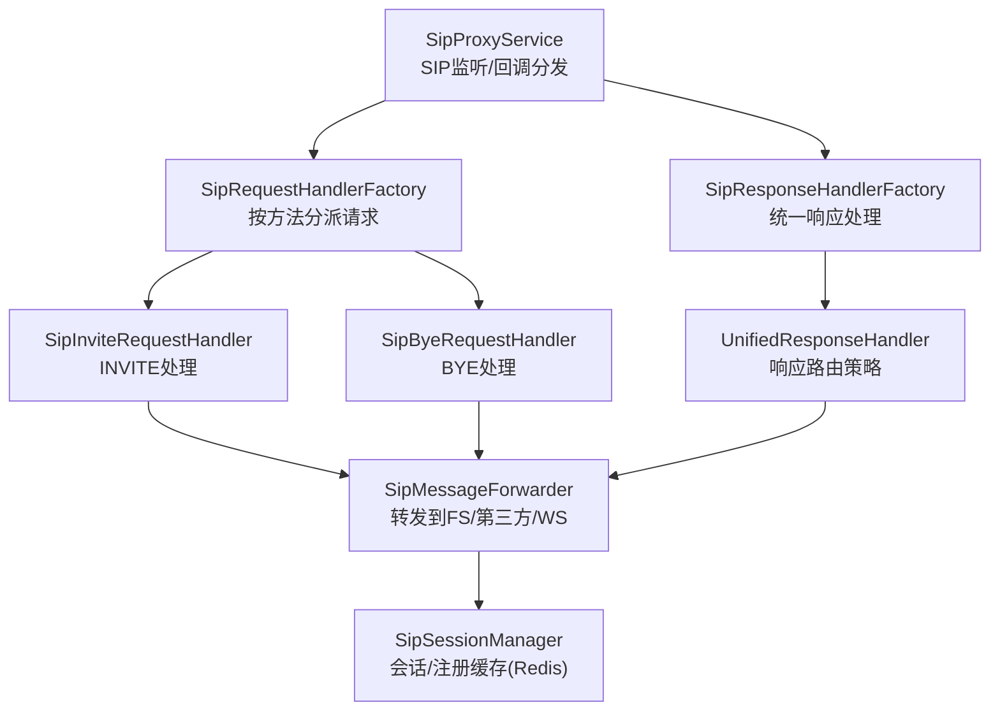
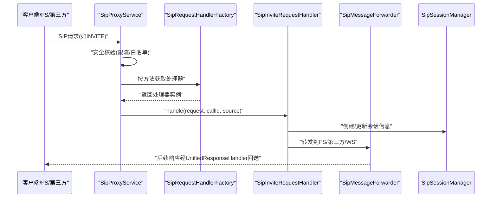
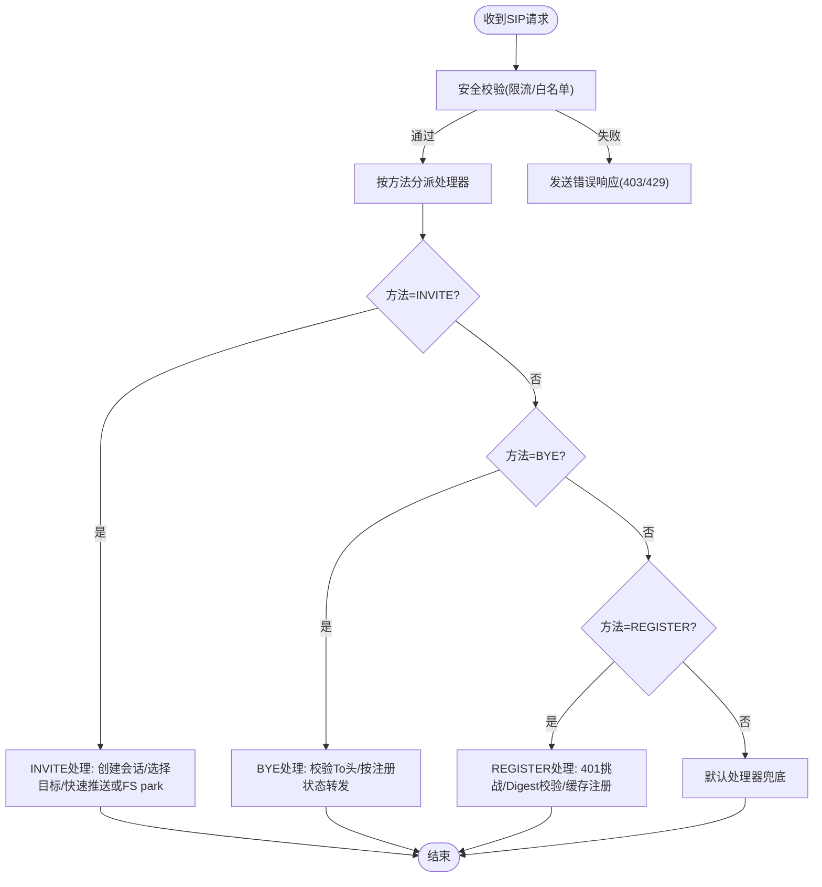
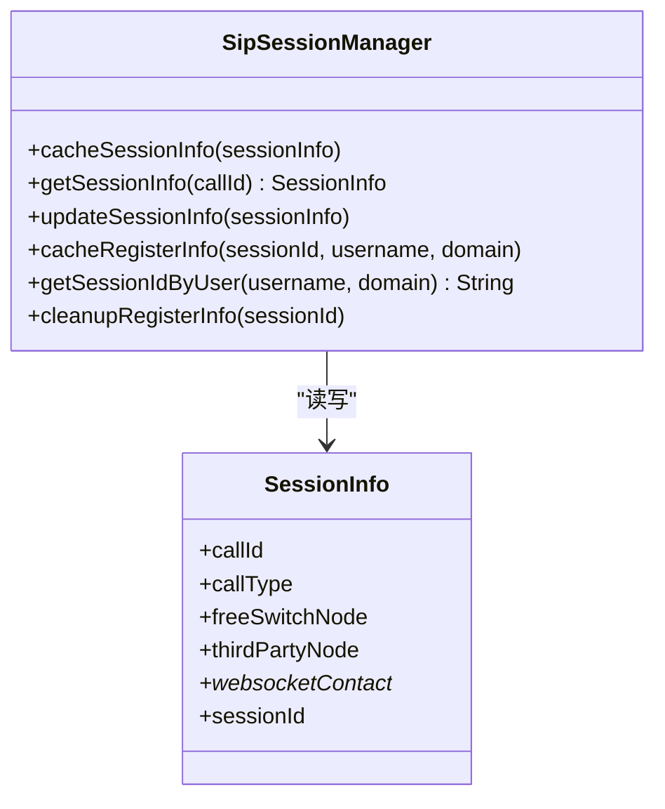
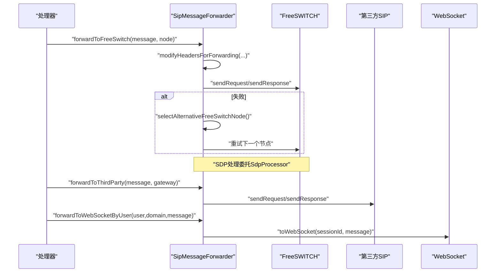
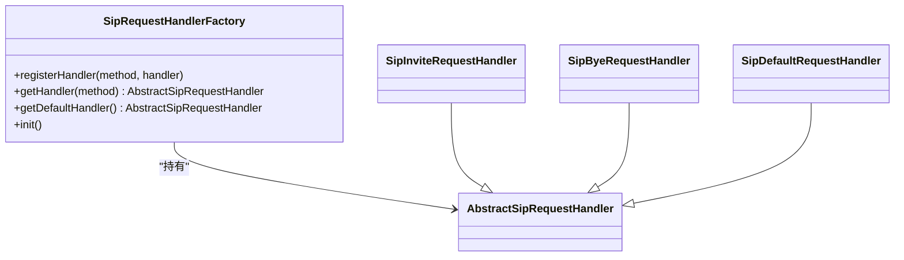
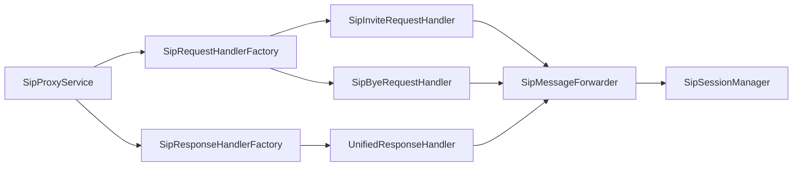

# SIP代理核心

<cite>
**本文引用的文件**
- [SipProxyService.java](file://yudao-cloud/yudao-module-cc/ipcc-sipproxy/src/main/java/cn/ipcc/sipproxy/core/SipProxyService.java)
- [SipSessionManager.java](file://yudao-cloud/yudao-module-cc/ipcc-sipproxy/src/main/java/cn/ipcc/sipproxy/core/session/SipSessionManager.java)
- [SipMessageForwarder.java](file://yudao-cloud/yudao-module-cc/ipcc-sipproxy/src/main/java/cn/ipcc/sipproxy/core/forwarder/SipMessageForwarder.java)
- [SipRequestHandlerFactory.java](file://yudao-cloud/yudao-module-cc/ipcc-sipproxy/src/main/java/cn/ipcc/sipproxy/core/handler/request/sip/SipRequestHandlerFactory.java)
- [SipResponseHandlerFactory.java](file://yudao-cloud/yudao-module-cc/ipcc-sipproxy/src/main/java/cn/ipcc/sipproxy/core/handler/response/SipResponseHandlerFactory.java)
- [UnifiedResponseHandler.java](file://yudao-cloud/yudao-module-cc/ipcc-sipproxy/src/main/java/cn/ipcc/sipproxy/core/handler/response/UnifiedResponseHandler.java)
- [SipInviteRequestHandler.java](file://yudao-cloud/yudao-module-cc/ipcc-sipproxy/src/main/java/cn/ipcc/sipproxy/core/handler/request/sip/SipInviteRequestHandler.java)
- [SipByeRequestHandler.java](file://yudao-cloud/yudao-module-cc/ipcc-sipproxy/src/main/java/cn/ipcc/sipproxy/core/handler/request/sip/SipByeRequestHandler.java)
- [WsRegisterRequestHandler.java](file://yudao-cloud/yudao-module-cc/ipcc-sipproxy/src/main/java/cn/ipcc/sipproxy/core/handler/request/ws/WsRegisterRequestHandler.java)
</cite>

## 目录
1. [简介](#简介)
2. [项目结构](#项目结构)
3. [核心组件](#核心组件)
4. [架构总览](#架构总览)
5. [详细组件分析](#详细组件分析)
6. [依赖关系分析](#依赖关系分析)
7. [性能考虑](#性能考虑)
8. [故障排除指南](#故障排除指南)
9. [结论](#结论)
10. [附录：扩展与自定义示例](#附录：扩展与自定义示例)

## 简介
本模块为SIP代理核心，承担SIP协议栈接入、消息路由、会话管理、响应转发与错误处理等职责。支持WebSocket入局（JsSIP）、FreeSWITCH内部节点、第三方SIP网关三类来源/目标；对INVITE/BYE/REGISTER等关键方法提供专用处理器；通过工厂模式实现可扩展的处理器注册机制；以Redis持久化会话与注册映射，支撑跨实例高可用与横向扩展。

## 项目结构
- 入口服务：SipProxyService负责JAIN-SIP协议栈初始化、请求/响应回调分发、安全校验（限流、白名单）与生命周期管理。
- 处理器工厂：SipRequestHandlerFactory与WsSipRequestHandlerFactory按SIP方法分派请求；SipResponseHandlerFactory统一响应处理。
- 会话管理：SipSessionManager基于Redis缓存会话信息与注册映射。
- 消息转发：SipMessageForwarder负责向WebSocket/FreeSWITCH/第三方SIP发送或转发消息，并处理头部改写、SDP修正与故障转移。
- 响应策略：UnifiedResponseHandler根据来源识别与会话上下文决定响应回送方向。

**图表来源**
- [SipProxyService.java:112-185](file://yudao-cloud/yudao-module-cc/ipcc-sipproxy/src/main/java/cn/ipcc/sipproxy/core/SipProxyService.java#L112-L185)
- [SipRequestHandlerFactory.java:68-85](file://yudao-cloud/yudao-module-cc/ipcc-sipproxy/src/main/java/cn/ipcc/sipproxy/core/handler/request/sip/SipRequestHandlerFactory.java#L68-L85)
- [SipResponseHandlerFactory.java:22-31](file://yudao-cloud/yudao-module-cc/ipcc-sipproxy/src/main/java/cn/ipcc/sipproxy/core/handler/response/SipResponseHandlerFactory.java#L22-L31)
- [UnifiedResponseHandler.java:31-64](file://yudao-cloud/yudao-module-cc/ipcc-sipproxy/src/main/java/cn/ipcc/sipproxy/core/handler/response/UnifiedResponseHandler.java#L31-L64)
- [SipMessageForwarder.java:110-155](file://yudao-cloud/yudao-module-cc/ipcc-sipproxy/src/main/java/cn/ipcc/sipproxy/core/forwarder/SipMessageForwarder.java#L110-L155)
- [SipSessionManager.java:35-72](file://yudao-cloud/yudao-module-cc/ipcc-sipproxy/src/main/java/cn/ipcc/sipproxy/core/session/SipSessionManager.java#L35-L72)

**章节来源**
- [SipProxyService.java:112-185](file://yudao-cloud/yudao-module-cc/ipcc-sipproxy/src/main/java/cn/ipcc/sipproxy/core/SipProxyService.java#L112-L185)

## 核心组件
- SipProxyService：启动UDP/TCP监听点，注入工厂与转发器；处理processRequest/processResponse及事务事件；提供WebSocket SIP消息入口。
- SipSessionManager：以Call-ID为键缓存会话信息；维护sessionId与用户的双向注册映射；提供清理接口。
- SipMessageForwarder：封装向WS/FS/第三方SIP的发送逻辑；修改Via/Contact/Request-URI；SDP地址替换；出局网关改写与认证重试。
- 处理器工厂：基于注解自动注册SIP方法处理器；默认处理器兜底未知方法。
- 统一响应处理器：结合来源识别与会话上下文校正，选择最佳转发目标。

**章节来源**
- [SipProxyService.java:293-328](file://yudao-cloud/yudao-module-cc/ipcc-sipproxy/src/main/java/cn/ipcc/sipproxy/core/SipProxyService.java#L293-L328)
- [SipSessionManager.java:91-112](file://yudao-cloud/yudao-module-cc/ipcc-sipproxy/src/main/java/cn/ipcc/sipproxy/core/session/SipSessionManager.java#L91-L112)
- [SipMessageForwarder.java:262-358](file://yudao-cloud/yudao-module-cc/ipcc-sipproxy/src/main/java/cn/ipcc/sipproxy/core/forwarder/SipMessageForwarder.java#L262-L358)
- [SipRequestHandlerFactory.java:68-85](file://yudao-cloud/yudao-module-cc/ipcc-sipproxy/src/main/java/cn/ipcc/sipproxy/core/handler/request/sip/SipRequestHandlerFactory.java#L68-L85)
- [UnifiedResponseHandler.java:31-64](file://yudao-cloud/yudao-module-cc/ipcc-sipproxy/src/main/java/cn/ipcc/sipproxy/core/handler/response/UnifiedResponseHandler.java#L31-L64)

## 架构总览
SIP代理采用“监听-分发-处理-转发”的分层架构：
- 传输层：JAIN-SIP UDP/TCP双栈监听，WebSocket通道承载SIP帧。
- 控制层：SipProxyService作为SipListener，统一处理请求/响应/超时/异常/对话终止。
- 业务层：按SIP方法分派至具体处理器（INVITE/BYE/REGISTER等），完成鉴权、路由、会话状态更新。
- 数据层：Redis缓存会话与注册映射，支撑多实例共享状态。
- 扩展点：认证、拦截器、媒体处理、出站重写、来源识别等通过SPI/接口注入。

**图表来源**
- [SipProxyService.java:344-387](file://yudao-cloud/yudao-module-cc/ipcc-sipproxy/src/main/java/cn/ipcc/sipproxy/core/SipProxyService.java#L344-L387)
- [SipRequestHandlerFactory.java:68-85](file://yudao-cloud/yudao-module-cc/ipcc-sipproxy/src/main/java/cn/ipcc/sipproxy/core/handler/request/sip/SipRequestHandlerFactory.java#L68-L85)
- [SipInviteRequestHandler.java:72-153](file://yudao-cloud/yudao-module-cc/ipcc-sipproxy/src/main/java/cn/ipcc/sipproxy/core/handler/request/sip/SipInviteRequestHandler.java#L72-L153)
- [SipMessageForwarder.java:110-155](file://yudao-cloud/yudao-module-cc/ipcc-sipproxy/src/main/java/cn/ipcc/sipproxy/core/forwarder/SipMessageForwarder.java#L110-L155)
- [UnifiedResponseHandler.java:153-216](file://yudao-cloud/yudao-module-cc/ipcc-sipproxy/src/main/java/cn/ipcc/sipproxy/core/handler/response/UnifiedResponseHandler.java#L153-L216)

## 详细组件分析

### SIP消息处理机制（INVITE/BYE/REGISTER）
- INVITE（传入）：解析To/From，提取X-Gateway-Id，判断callType（INBOUND/OUTBOUND/INTERNAL），选择FS park或直接出局豁免；若被叫为已注册坐席则快速推送至WebSocket；否则转发至FS park进行号码路由与IVR流程。
- BYE（传入）：校验To头后按被叫注册状态转发至WebSocket或第三方SIP，协调两段BYE释放媒体。
- REGISTER（WebSocket）：首次无Authorization返回401挑战；携带凭证时委托SipAuthenticationProvider校验；成功后缓存注册映射并触发回调。

**图表来源**
- [SipProxyService.java:344-387](file://yudao-cloud/yudao-module-cc/ipcc-sipproxy/src/main/java/cn/ipcc/sipproxy/core/SipProxyService.java#L344-L387)
- [SipInviteRequestHandler.java:72-233](file://yudao-cloud/yudao-module-cc/ipcc-sipproxy/src/main/java/cn/ipcc/sipproxy/core/handler/request/sip/SipInviteRequestHandler.java#L72-L233)
- [SipByeRequestHandler.java:54-71](file://yudao-cloud/yudao-module-cc/ipcc-sipproxy/src/main/java/cn/ipcc/sipproxy/core/handler/request/sip/SipByeRequestHandler.java#L54-L71)
- [WsRegisterRequestHandler.java:79-121](file://yudao-cloud/yudao-module-cc/ipcc-sipproxy/src/main/java/cn/ipcc/sipproxy/core/handler/request/ws/WsRegisterRequestHandler.java#L79-L121)

**章节来源**
- [SipInviteRequestHandler.java:72-233](file://yudao-cloud/yudao-module-cc/ipcc-sipproxy/src/main/java/cn/ipcc/sipproxy/core/handler/request/sip/SipInviteRequestHandler.java#L72-L233)
- [SipByeRequestHandler.java:54-71](file://yudao-cloud/yudao-module-cc/ipcc-sipproxy/src/main/java/cn/ipcc/sipproxy/core/handler/request/sip/SipByeRequestHandler.java#L54-L71)
- [WsRegisterRequestHandler.java:79-121](file://yudao-cloud/yudao-module-cc/ipcc-sipproxy/src/main/java/cn/ipcc/sipproxy/core/handler/request/ws/WsRegisterRequestHandler.java#L79-L121)

### 会话管理器设计模式与工作流程
- 设计模式：单例组件+Redis持久化；以Call-ID为键的会话对象缓存；双向注册映射（sessionId↔username:domain）。
- 生命周期：
  - 创建：INVITE进入时新建SessionInfo，记录transport、callType、节点信息等。
  - 更新：握手/路由过程中补充WebSocket联系地址、FS节点、第三方节点等。
  - 清理：WebSocket断开时清理注册映射，避免僵尸会话。
- 并发控制：Redis原子操作保证一致性；会话级Key隔离避免竞争。

**图表来源**
- [SipSessionManager.java:35-152](file://yudao-cloud/yudao-module-cc/ipcc-sipproxy/src/main/java/cn/ipcc/sipproxy/core/session/SipSessionManager.java#L35-L152)

**章节来源**
- [SipSessionManager.java:35-152](file://yudao-cloud/yudao-module-cc/ipcc-sipproxy/core/session/SipSessionManager.java#L35-L152)

### 消息转发器工作机制
- 请求路由：
  - 到WebSocket：toWebSocket直接发送字符串化消息。
  - 到FreeSWITCH：forwardToFreeSwitch支持故障转移，循环尝试备用节点直至成功。
  - 到第三方SIP：forwardToThirdParty按会话选择的传输协议发送。
- 响应处理：
  - UnifiedResponseHandler依据来源识别与会话上下文校正，选择WEBSOCKET/FREESWITCH/THIRD_PARTY目标。
- 错误处理：
  - 转发失败抛出领域异常，包含错误码与原因；407代理认证由GatewayAuthManager处理并重试。
- 头部与SDP：
  - modifyHeadersForForwarding/modifyWsProxyHeaders重写Contact/Via/Request-URI；
  - modifySdpForWebSocket将FS内网媒体地址替换为公网地址，确保ICE/DTLS-SRTP连通。

**图表来源**
- [SipMessageForwarder.java:110-155](file://yudao-cloud/yudao-module-cc/ipcc-sipproxy/src/main/java/cn/ipcc/sipproxy/core/forwarder/SipMessageForwarder.java#L110-L155)
- [SipMessageForwarder.java:203-240](file://yudao-cloud/yudao-module-cc/ipcc-sipproxy/src/main/java/cn/ipcc/sipproxy/core/forwarder/SipMessageForwarder.java#L203-L240)
- [SipMessageForwarder.java:262-358](file://yudao-cloud/yudao-module-cc/ipcc-sipproxy/src/main/java/cn/ipcc/sipproxy/core/forwarder/SipMessageForwarder.java#L262-L358)
- [SipMessageForwarder.java:391-474](file://yudao-cloud/yudao-module-cc/ipcc-sipproxy/core/forwarder/SipMessageForwarder.java#L391-L474)
- [UnifiedResponseHandler.java:153-216](file://yudao-cloud/yudao-module-cc/ipcc-sipproxy/core/handler/response/UnifiedResponseHandler.java#L153-L216)

**章节来源**
- [SipMessageForwarder.java:110-155](file://yudao-cloud/yudao-module-cc/ipcc-sipproxy/core/forwarder/SipMessageForwarder.java#L110-L155)
- [UnifiedResponseHandler.java:31-64](file://yudao-cloud/yudao-module-cc/ipcc-sipproxy/core/handler/response/UnifiedResponseHandler.java#L31-L64)

### SIP处理器工厂设计与扩展机制
- 自动注册：处理器类使用@SipMethod注解声明支持的方法，工厂在init时扫描并注册。
- 默认处理器：未匹配的方法交由默认处理器处理，保证健壮性。
- 扩展方式：新增处理器只需实现AbstractSipRequestHandler并标注@SipMethod；响应处理器统一由UnifiedResponseHandler处理，可通过扩展点调整策略。

**图表来源**
- [SipRequestHandlerFactory.java:24-95](file://yudao-cloud/yudao-module-cc/ipcc-sipproxy/core/handler/request/sip/SipRequestHandlerFactory.java#L24-L95)
- [SipInviteRequestHandler.java:29-32](file://yudao-cloud/yudao-module-cc/ipcc-sipproxy/core/handler/request/sip/SipInviteRequestHandler.java#L29-L32)
- [SipByeRequestHandler.java:33-36](file://yudao-cloud/yudao-module-cc/ipcc-sipproxy/core/handler/request/sip/SipByeRequestHandler.java#L33-L36)

**章节来源**
- [SipRequestHandlerFactory.java:68-85](file://yudao-cloud/yudao-module-cc/ipcc-sipproxy/core/handler/request/sip/SipRequestHandlerFactory.java#L68-L85)

## 依赖关系分析
- 外部依赖：JAIN-SIP协议栈、Redis（会话与注册缓存）、Spring容器（依赖注入）。
- 内部耦合：
  - SipProxyService依赖各工厂与转发器，低耦合通过接口/扩展点解耦。
  - 处理器依赖SipSessionManager与SipMessageForwarder，不直接操作网络IO。
  - 响应处理器依赖MessageSourceIdentifier与策略模式确定目标。
- 潜在环依赖：无直接循环；通过工厂与扩展点降低耦合。

**图表来源**
- [SipProxyService.java:58-86](file://yudao-cloud/yudao-module-cc/ipcc-sipproxy/core/SipProxyService.java#L58-L86)
- [SipRequestHandlerFactory.java:24-95](file://yudao-cloud/yudao-module-cc/ipcc-sipproxy/core/handler/request/sip/SipRequestHandlerFactory.java#L24-L95)
- [SipResponseHandlerFactory.java:19-31](file://yudao-cloud/yudao-module-cc/ipcc-sipproxy/core/handler/response/SipResponseHandlerFactory.java#L19-L31)
- [UnifiedResponseHandler.java:25-31](file://yudao-cloud/yudao-module-cc/ipcc-sipproxy/core/handler/response/UnifiedResponseHandler.java#L25-L31)
- [SipMessageForwarder.java:51-86](file://yudao-cloud/yudao-module-cc/ipcc-sipproxy/core/forwarder/SipMessageForwarder.java#L51-L86)
- [SipSessionManager.java:24-28](file://yudao-cloud/yudao-module-cc/ipcc-sipproxy/core/session/SipSessionManager.java#L24-L28)

**章节来源**
- [SipProxyService.java:58-86](file://yudao-cloud/yudao-module-cc/ipcc-sipproxy/core/SipProxyService.java#L58-L86)

## 性能考虑
- 连接复用与传输选择：根据会话记录的传输协议选择UDP/TCP Provider，减少不必要的重连。
- 故障转移：FreeSWITCH节点失败自动切换，提升可用性。
- SDP优化：仅当存在a=ice-ufrag且缺少a=candidate时告警，避免无效媒体协商。
- 头部最小化：TCP场景清理Via冗余参数，降低包体大小与路由复杂度。
- 缓存命中：Redis TTL合理设置，避免频繁重建会话。

[本节为通用指导，无需特定文件引用]

## 故障排除指南
- 403 Forbidden：来源IP不在白名单，检查IpWhitelist配置与来源地址。
- 429 Too Many Requests：触发SipRateLimiter限流，检查源IP请求频率。
- 转发失败：检查FreeSWITCH/第三方节点可达性与端口；查看日志中尝试节点数量与最终错误。
- WebSocket无ACK：确认响应来源识别正确（Via transport=WS/WSS不参与校正），检查SessionInfo中sessionId是否回填。
- 媒体不通：核对SDP中c=行与a=candidate行是否替换为公网IP；检查NAT与防火墙策略。

**章节来源**
- [SipProxyService.java:398-413](file://yudao-cloud/yudao-module-cc/ipcc-sipproxy/core/SipProxyService.java#L398-L413)
- [SipMessageForwarder.java:110-155](file://yudao-cloud/yudao-module-cc/ipcc-sipproxy/core/forwarder/SipMessageForwarder.java#L110-L155)
- [UnifiedResponseHandler.java:31-64](file://yudao-cloud/yudao-module-cc/ipcc-sipproxy/core/handler/response/UnifiedResponseHandler.java#L31-L64)

## 结论
本模块以清晰的层次与扩展点实现了SIP代理的核心能力：可靠的消息收发、灵活的处理器路由、健壮的会话管理与高效的响应转发。通过工厂模式与SPI机制，系统具备良好的可维护性与可扩展性，能够适配多种部署形态与业务需求。

[本节为总结，无需特定文件引用]

## 附录：扩展与自定义示例
- 自定义SIP处理器：
  - 新建类继承AbstractSipRequestHandler，使用@SipMethod("METHOD")声明支持的方法，并在init时自动注册。
  - 参考路径：[SipInviteRequestHandler.java:29-32](file://yudao-cloud/yudao-module-cc/ipcc-sipproxy/core/handler/request/sip/SipInviteRequestHandler.java#L29-L32)、[SipRequestHandlerFactory.java:68-85](file://yudao-cloud/yudao-module-cc/ipcc-sipproxy/core/handler/request/sip/SipRequestHandlerFactory.java#L68-L85)
- 自定义认证：
  - 实现SipAuthenticationProvider接口覆盖默认Digest校验逻辑，用于对接外部鉴权系统。
  - 参考路径：[WsRegisterRequestHandler.java:61-67](file://yudao-cloud/yudao-module-cc/ipcc-sipproxy/core/handler/request/ws/WsRegisterRequestHandler.java#L61-L67)
- 自定义出站重写：
  - 实现OutboundGatewayRewriter接口，定制From/PAI/Record-Route等头部改写策略。
  - 参考路径：[SipMessageForwarder.java:613-629](file://yudao-cloud/yudao-module-cc/ipcc-sipproxy/core/forwarder/SipMessageForwarder.java#L613-L629)
- 自定义媒体处理：
  - 实现SdpProcessor接口，对SDP进行编解码过滤或ICE候选替换。
  - 参考路径：[SipMessageForwarder.java:128-130](file://yudao-cloud/yudao-module-cc/ipcc-sipproxy/core/forwarder/SipMessageForwarder.java#L128-L130)

**章节来源**
- [SipInviteRequestHandler.java:29-32](file://yudao-cloud/yudao-module-cc/ipcc-sipproxy/core/handler/request/sip/SipInviteRequestHandler.java#L29-L32)
- [SipRequestHandlerFactory.java:68-85](file://yudao-cloud/yudao-module-cc/ipcc-sipproxy/core/handler/request/sip/SipRequestHandlerFactory.java#L68-L85)
- [WsRegisterRequestHandler.java:61-67](file://yudao-cloud/yudao-module-cc/ipcc-sipproxy/core/handler/request/ws/WsRegisterRequestHandler.java#L61-L67)
- [SipMessageForwarder.java:613-629](file://yudao-cloud/yudao-module-cc/ipcc-sipproxy/core/forwarder/SipMessageForwarder.java#L613-L629)
- [SipMessageForwarder.java:128-130](file://yudao-cloud/yudao-module-cc/ipcc-sipproxy/core/forwarder/SipMessageForwarder.java#L128-L130)