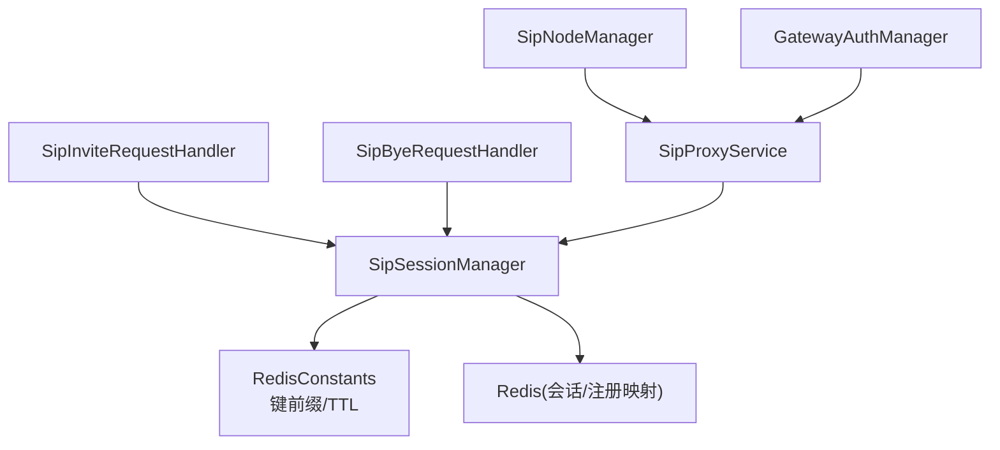
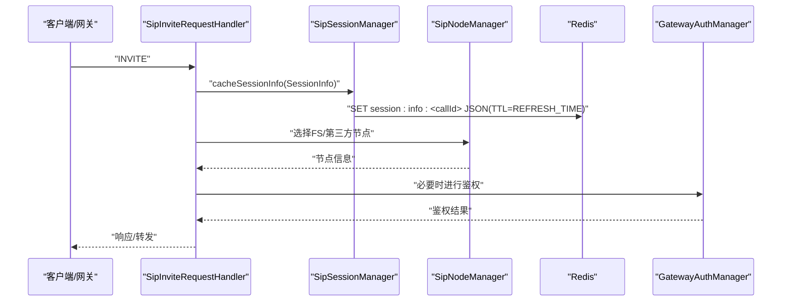
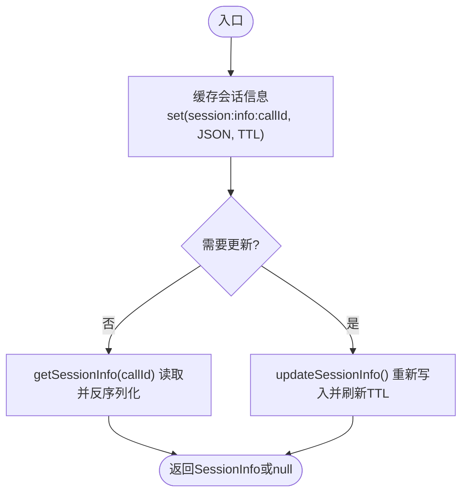
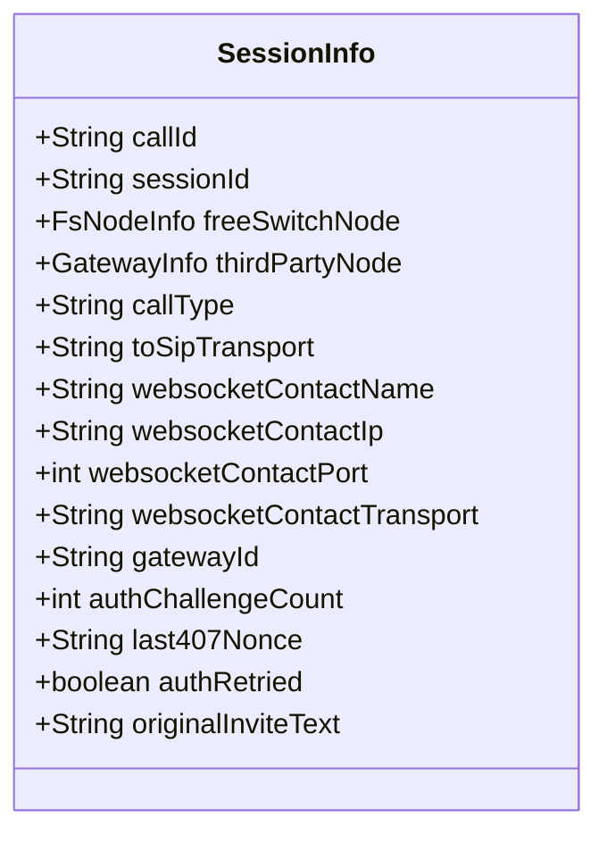
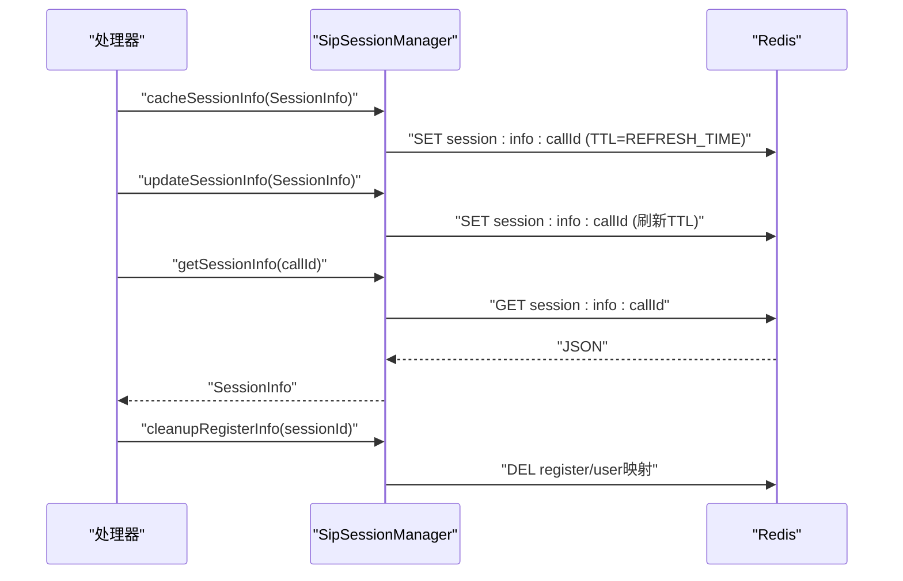
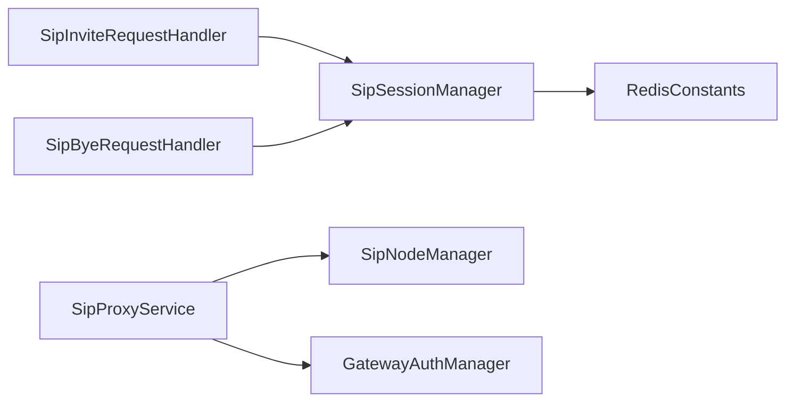

# SIP会话管理

<cite>
**本文引用的文件**
- [SipSessionManager.java](file://yudao-cloud/yudao-module-cc/ipcc-sipproxy/src/main/java/cn/ipcc/sipproxy/core/session/SipSessionManager.java)
- [SessionInfo.java](file://yudao-cloud/yudao-module-cc/ipcc-sipproxy/src/main/java/cn/ipcc/sipproxy/core/session/SessionInfo.java)
- [RedisConstants.java](file://yudao-cloud/yudao-module-cc/ipcc-sipproxy/src/main/java/cn/ipcc/sipproxy/support/RedisConstants.java)
- [SipInviteRequestHandler.java](file://yudao-cloud/yudao-module-cc/ipcc-sipproxy/src/main/java/cn/ipcc/sipproxy/core/handler/request/sip/SipInviteRequestHandler.java)
- [SipByeRequestHandler.java](file://yudao-cloud/yudao-module-cc/ipcc-sipproxy/src/main/java/cn/ipcc/sipproxy/core/handler/request/sip/SipByeRequestHandler.java)
- [SipProxyService.java](file://yudao-cloud/yudao-module-cc/ipcc-sipproxy/src/main/java/cn/ipcc/sipproxy/core/SipProxyService.java)
- [SipNodeManager.java](file://yudao-cloud/yudao-module-cc/ipcc-sipproxy/src/main/java/cn/ipcc/sipproxy/core/node/SipNodeManager.java)
- [GatewayAuthManager.java](file://yudao-cloud/yudao-module-cc/ipcc-sipproxy/src/main/java/cn/ipcc/sipproxy/core/auth/GatewayAuthManager.java)
</cite>

## 目录
1. [简介](#简介)
2. [项目结构](#项目结构)
3. [核心组件](#核心组件)
4. [架构总览](#架构总览)
5. [详细组件分析](#详细组件分析)
6. [依赖关系分析](#依赖关系分析)
7. [性能考虑](#性能考虑)
8. [故障排除指南](#故障排除指南)
9. [结论](#结论)
10. [附录：操作示例与扩展建议](#附录：操作示例与扩展建议)

## 简介
本文件面向SIP会话管理系统，聚焦于SipSessionManager的设计架构与工作原理，覆盖会话状态机模型、生命周期管理、并发控制机制；详解SessionInfo数据模型字段含义与会话标识、状态信息、超时控制和关联关系；文档化会话的创建、更新、查询与销毁流程，以及内存管理与资源清理策略；解释会话与SIP事务的关系，如何处理会话超时与异常恢复；并提供可操作的代码片段路径以展示如何操作会话对象和扩展功能。同时给出性能调优建议与故障排除指南。

## 项目结构
SIP代理模块将“会话管理”作为核心能力之一，采用“处理器+管理器+持久化常量”的分层组织方式：
- 会话数据模型：SessionInfo，承载Call-ID、WebSocket会话ID、FreeSWITCH节点、第三方网关节点、呼叫类型、传输协议、Contact头信息、鉴权相关字段等。
- 会话管理器：SipSessionManager，封装对Redis的会话信息缓存、注册映射缓存、按用户查找会话ID、清理注册信息等能力。
- Redis键空间：RedisConstants，统一约定命名空间与TTL策略，确保跨请求/响应周期的一致性。
- 处理器与服务：SipInviteRequestHandler、SipByeRequestHandler负责INVITE/BYE等信令处理；SipProxyService协调各组件；SipNodeManager管理节点选择；GatewayAuthManager处理鉴权。

图表来源
- [SipInviteRequestHandler.java](file://yudao-cloud/yudao-module-cc/ipcc-sipproxy/src/main/java/cn/ipcc/sipproxy/core/handler/request/sip/SipInviteRequestHandler.java)
- [SipByeRequestHandler.java](file://yudao-cloud/yudao-module-cc/ipcc-sipproxy/src/main/java/cn/ipcc/sipproxy/core/handler/request/sip/SipByeRequestHandler.java)
- [SipSessionManager.java](file://yudao-cloud/yudao-module-cc/ipcc-sipproxy/src/main/java/cn/ipcc/sipproxy/core/session/SipSessionManager.java)
- [RedisConstants.java](file://yudao-cloud/yudao-module-cc/ipcc-sipproxy/src/main/java/cn/ipcc/sipproxy/support/RedisConstants.java)

章节来源
- [SipSessionManager.java:1-154](file://yudao-cloud/yudao-module-cc/ipcc-sipproxy/src/main/java/cn/ipcc/sipproxy/core/session/SipSessionManager.java#L1-L154)
- [SessionInfo.java:1-144](file://yudao-cloud/yudao-module-cc/ipcc-sipproxy/src/main/java/cn/ipcc/sipproxy/core/session/SessionInfo.java#L1-L144)
- [RedisConstants.java:1-47](file://yudao-cloud/yudao-module-cc/ipcc-sipproxy/src/main/java/cn/ipcc/sipproxy/support/RedisConstants.java#L1-L47)

## 核心组件
- SipSessionManager：提供会话信息的缓存、获取、更新，以及注册映射的缓存、查询与清理。所有会话信息通过Jackson序列化到Redis，使用统一的TTL策略。
- SessionInfo：描述一次SIP会话的全量上下文，包括标识（callId）、WebSocket会话（sessionId）、节点信息（freeSwitchNode/thirdPartyNode）、呼叫类型（INTERNAL/OUTBOUND/INBOUND）、传输协议（toSipTransport）、Contact头信息、网关ID、鉴权计数与nonce、原始INVITE文本等。
- RedisConstants：定义键前缀与过期时间，如会话信息、注册映射、消息记录、节点映射等，保证全局一致的命名与生命周期。

章节来源
- [SipSessionManager.java:1-154](file://yudao-cloud/yudao-module-cc/ipcc-sipproxy/src/main/java/cn/ipcc/sipproxy/core/session/SipSessionManager.java#L1-L154)
- [SessionInfo.java:1-144](file://yudao-cloud/yudao-module-cc/ipcc-sipproxy/src/main/java/cn/ipcc/sipproxy/core/session/SessionInfo.java#L1-L144)
- [RedisConstants.java:1-47](file://yudao-cloud/yudao-module-cc/ipcc-sipproxy/src/main/java/cn/ipcc/sipproxy/support/RedisConstants.java#L1-L47)

## 架构总览
SIP代理在收到SIP请求后，由具体处理器解析并路由到业务逻辑。对于INVITE/REGISTER等关键信令，会读写SipSessionManager中的会话与注册映射，结合SipNodeManager选择目标节点，必要时通过GatewayAuthManager完成鉴权。所有会话状态与中间结果均持久化到Redis，保证多实例间一致性与容错恢复。

图表来源
- [SipInviteRequestHandler.java](file://yudao-cloud/yudao-module-cc/ipcc-sipproxy/src/main/java/cn/ipcc/sipproxy/core/handler/request/sip/SipInviteRequestHandler.java)
- [SipSessionManager.java:35-72](file://yudao-cloud/yudao-module-cc/ipcc-sipproxy/src/main/java/cn/ipcc/sipproxy/core/session/SipSessionManager.java#L35-L72)
- [RedisConstants.java:16-42](file://yudao-cloud/yudao-module-cc/ipcc-sipproxy/src/main/java/cn/ipcc/sipproxy/support/RedisConstants.java#L16-L42)
- [GatewayAuthManager.java](file://yudao-cloud/yudao-module-cc/ipcc-sipproxy/src/main/java/cn/ipcc/sipproxy/core/auth/GatewayAuthManager.java)

## 详细组件分析

### SipSessionManager：会话与注册映射管理
- 会话信息缓存：将SessionInfo序列化为JSON写入Redis，Key为“SESSION_INFO_PREFIX + callId”，TTL为REFRESH_TIME。
- 会话信息查询：根据callId从Redis读取并反序列化为SessionInfo。
- 会话信息更新：复用缓存方法，刷新TTL。
- 注册映射缓存：维护sessionId→username:domain与username:domain→sessionId双向映射，TTL为REGISTER_REFRESH_TIME，避免WebSocket连接存活但缓存过期的问题。
- 按用户查会话ID：根据username:domain获取对应sessionId。
- 清理注册信息：WebSocket断开时，删除双向映射，防止脏数据残留。

图表来源
- [SipSessionManager.java:35-72](file://yudao-cloud/yudao-module-cc/ipcc-sipproxy/src/main/java/cn/ipcc/sipproxy/core/session/SipSessionManager.java#L35-L72)
- [RedisConstants.java:16-42](file://yudao-cloud/yudao-module-cc/ipcc-sipproxy/src/main/java/cn/ipcc/sipproxy/support/RedisConstants.java#L16-L42)

章节来源
- [SipSessionManager.java:35-152](file://yudao-cloud/yudao-module-cc/ipcc-sipproxy/src/main/java/cn/ipcc/sipproxy/core/session/SipSessionManager.java#L35-L152)

### SessionInfo：数据模型与字段语义
- 标识与会话绑定：callId（唯一会话标识）、sessionId（WebSocket会话ID）。
- 节点与呼叫方向：freeSwitchNode（FS节点）、thirdPartyNode（第三方网关）、callType（INTERNAL/OUTBOUND/INBOUND）。
- 传输与联系人：toSipTransport（UDP/TCP）、websocketContactName/IP/port/transport。
- 网关来源：gatewayId（来自X-Gateway-Id）。
- 鉴权与重试：authChallengeCount（最大2次）、last407Nonce（检测stale=true重挑战）、兼容字段authRetried。
- 原始信令：originalInviteText（用于407鉴权时还原并重发INVITE）。

图表来源
- [SessionInfo.java:18-143](file://yudao-cloud/yudao-module-cc/ipcc-sipproxy/src/main/java/cn/ipcc/sipproxy/core/session/SessionInfo.java#L18-L143)

章节来源
- [SessionInfo.java:18-143](file://yudao-cloud/yudao-module-cc/ipcc-sipproxy/src/main/java/cn/ipcc/sipproxy/core/session/SessionInfo.java#L18-L143)

### 会话生命周期管理：创建、更新、查询、销毁
- 创建：收到INVITE/REGISTER时，构造SessionInfo并调用cacheSessionInfo/cacheRegisterInfo写入Redis。
- 更新：在信令流转过程中（如鉴权、节点切换），调用updateSessionInfo刷新TTL与状态。
- 查询：通过getSessionInfo或getSessionIdByUser获取当前会话或WebSocket会话ID。
- 销毁：WebSocket断开或会话结束时，调用cleanupRegisterInfo清理注册映射；会话信息随TTL自然过期。

图表来源
- [SipSessionManager.java:35-152](file://yudao-cloud/yudao-module-cc/ipcc-sipproxy/src/main/java/cn/ipcc/sipproxy/core/session/SipSessionManager.java#L35-L152)
- [RedisConstants.java:16-42](file://yudao-cloud/yudao-module-cc/ipcc-sipproxy/src/main/java/cn/ipcc/sipproxy/support/RedisConstants.java#L16-L42)

章节来源
- [SipSessionManager.java:35-152](file://yudao-cloud/yudao-module-cc/ipcc-sipproxy/src/main/java/cn/ipcc/sipproxy/core/session/SipSessionManager.java#L35-L152)

### 并发控制与一致性
- 单键原子写：基于StringRedisTemplate的opsForValue().set()实现单键原子写入，避免并发覆盖导致的状态不一致。
- TTL保障：会话信息TTL较短（REFRESH_TIME），注册映射TTL较长（REGISTER_REFRESH_TIME），既保证快速失效又避免过早过期。
- 幂等更新：updateSessionInfo直接覆盖旧值并刷新TTL，适合多次更新场景。
- 清理幂等：cleanupRegisterInfo在找不到映射时安全跳过，避免异常。

章节来源
- [SipSessionManager.java:35-152](file://yudao-cloud/yudao-module-cc/ipcc-sipproxy/core/session/SipSessionManager.java#L35-L152)
- [RedisConstants.java:16-42](file://yudao-cloud/yudao-module-cc/ipcc-sipproxy/support/RedisConstants.java#L16-L42)

### 会话与SIP事务的关系
- 会话绑定：每个SIP事务（如INVITE/REGISTER）通过callId与SessionInfo绑定，便于跨请求/响应周期追踪。
- 事务状态：SessionInfo中的authChallengeCount、last407Nonce、originalInviteText等字段支撑407鉴权重试与重发逻辑。
- 节点选择：SipNodeManager决定下一跳节点（FS或第三方），并在SessionInfo中记录，供后续消息路由。

章节来源
- [SessionInfo.java:77-122](file://yudao-cloud/yudao-module-cc/ipcc-sipproxy/src/main/java/cn/ipcc/sipproxy/core/session/SessionInfo.java#L77-L122)
- [SipNodeManager.java](file://yudao-cloud/yudao-module-cc/ipcc-sipproxy/src/main/java/cn/ipcc/sipproxy/core/node/SipNodeManager.java)

### 超时与异常恢复
- 会话超时：session:info:*键TTL为REFRESH_TIME，超过未刷新则自动过期，避免僵尸会话。
- 注册映射超时：register/user映射TTL为REGISTER_REFRESH_TIME，大于JsSIP默认Expires，降低转发失败概率。
- 异常恢复：当Redis不可用或序列化失败时，记录错误日志并返回空或忽略，上层需具备降级与重试策略。

章节来源
- [SipSessionManager.java:35-152](file://yudao-cloud/yudao-module-cc/ipcc-sipproxy/src/main/java/cn/ipcc/sipproxy/core/session/SipSessionManager.java#L35-L152)
- [RedisConstants.java:16-42](file://yudao-cloud/yudao-module-cc/ipcc-sipproxy/support/RedisConstants.java#L16-L42)

## 依赖关系分析
- SipSessionManager依赖RedisConstants定义的键前缀与TTL，依赖ObjectMapper进行序列化/反序列化。
- 处理器（SipInviteRequestHandler/SipByeRequestHandler）依赖SipSessionManager进行会话读写。
- SipProxyService协调SipNodeManager与GatewayAuthManager，形成完整的信令处理链路。

图表来源
- [SipInviteRequestHandler.java](file://yudao-cloud/yudao-module-cc/ipcc-sipproxy/src/main/java/cn/ipcc/sipproxy/core/handler/request/sip/SipInviteRequestHandler.java)
- [SipByeRequestHandler.java](file://yudao-cloud/yudao-module-cc/ipcc-sipproxy/src/main/java/cn/ipcc/sipproxy/core/handler/request/sip/SipByeRequestHandler.java)
- [SipSessionManager.java:1-154](file://yudao-cloud/yudao-module-cc/ipcc-sipproxy/src/main/java/cn/ipcc/sipproxy/core/session/SipSessionManager.java#L1-L154)
- [RedisConstants.java:1-47](file://yudao-cloud/yudao-module-cc/ipcc-sipproxy/src/main/java/cn/ipcc/sipproxy/support/RedisConstants.java#L1-L47)

章节来源
- [SipSessionManager.java:1-154](file://yudao-cloud/yudao-module-cc/ipcc-sipproxy/src/main/java/cn/ipcc/sipproxy/core/session/SipSessionManager.java#L1-L154)
- [RedisConstants.java:1-47](file://yudao-cloud/yudao-module-cc/ipcc-sipproxy/src/main/java/cn/ipcc/sipproxy/support/RedisConstants.java#L1-L47)

## 性能考虑
- 键空间设计：统一命名空间与短TTL减少热点键压力，避免长尾数据堆积。
- 序列化开销：SessionInfo包含较多字段，建议在高频路径上避免重复序列化，必要时缓存JSON字符串。
- 并发写入：利用Redis单键原子性，避免复杂分布式锁；在高并发下关注Redis连接池与网络延迟。
- 过期策略：合理设置REFRESH_TIME与REGISTER_REFRESH_TIME，平衡实时性与存储成本。
- 监控指标：统计缓存命中率、序列化异常率、TTL命中分布，辅助容量规划。

[本节为通用性能指导，不直接分析具体文件]

## 故障排除指南
- 会话无法查询：检查callId是否正确、Redis键是否存在、TTL是否已过期；确认updateSessionInfo是否被正确调用以刷新TTL。
- 注册映射失效：确认WebSocket连接关闭时是否调用cleanupRegisterInfo；检查REGISTER_REFRESH_TIME是否小于JsSIP Expires导致提前过期。
- 序列化异常：查看ObjectMapper配置与SessionInfo字段变更兼容性；必要时增加向后兼容逻辑。
- 鉴权循环：核对authChallengeCount上限与last407Nonce比较逻辑，避免stale=false时无意义重试。

章节来源
- [SipSessionManager.java:35-152](file://yudao-cloud/yudao-module-cc/ipcc-sipproxy/src/main/java/cn/ipcc/sipproxy/core/session/SipSessionManager.java#L35-L152)
- [SessionInfo.java:77-143](file://yudao-cloud/yudao-module-cc/ipcc-sipproxy/src/main/java/cn/ipcc/sipproxy/core/session/SessionInfo.java#L77-L143)

## 结论
SipSessionManager以Redis为中心，提供了稳定、可扩展的SIP会话管理能力。通过SessionInfo集中表达会话上下文，配合合理的TTL与键空间设计，实现了高内聚、低耦合的会话生命周期管理。结合处理器与服务层的协作，系统能够可靠地处理INVITE/REGISTER等关键信令，支持鉴权重试与异常恢复。在生产环境中，建议结合监控与压测持续优化TTL、序列化与并发策略。

[本节为总结性内容，不直接分析具体文件]

## 附录：操作示例与扩展建议
- 创建会话：在INVITE处理流程中构造SessionInfo并调用cacheSessionInfo，确保callId与必要节点信息完整。
  - 参考路径：[SipInviteRequestHandler.java](file://yudao-cloud/yudao-module-cc/ipcc-sipproxy/src/main/java/cn/ipcc/sipproxy/core/handler/request/sip/SipInviteRequestHandler.java)
- 更新会话：在鉴权或节点切换时调用updateSessionInfo刷新状态与TTL。
  - 参考路径：[SipSessionManager.java:69-72](file://yudao-cloud/yudao-module-cc/ipcc-sipproxy/src/main/java/cn/ipcc/sipproxy/core/session/SipSessionManager.java#L69-L72)
- 查询会话：通过getSessionInfo(callId)获取当前会话上下文。
  - 参考路径：[SipSessionManager.java:51-62](file://yudao-cloud/yudao-module-cc/ipcc-sipproxy/src/main/java/cn/ipcc/sipproxy/core/session/SipSessionManager.java#L51-L62)
- 销毁会话：WebSocket断开时调用cleanupRegisterInfo清理注册映射。
  - 参考路径：[SipSessionManager.java:119-137](file://yudao-cloud/yudao-module-cc/ipcc-sipproxy/src/main/java/cn/ipcc/sipproxy/core/session/SipSessionManager.java#L119-L137)
- 扩展功能：可在SessionInfo中新增自定义字段（如业务标签、QoS参数），并在处理器中按需读写；注意保持TTL与序列化兼容性。

章节来源
- [SipSessionManager.java:35-152](file://yudao-cloud/yudao-module-cc/ipcc-sipproxy/src/main/java/cn/ipcc/sipproxy/core/session/SipSessionManager.java#L35-L152)
- [SessionInfo.java:18-143](file://yudao-cloud/yudao-module-cc/ipcc-sipproxy/src/main/java/cn/ipcc/sipproxy/core/session/SessionInfo.java#L18-L143)
- [SipInviteRequestHandler.java](file://yudao-cloud/yudao-module-cc/ipcc-sipproxy/src/main/java/cn/ipcc/sipproxy/core/handler/request/sip/SipInviteRequestHandler.java)
- [SipByeRequestHandler.java](file://yudao-cloud/yudao-module-cc/ipcc-sipproxy/src/main/java/cn/ipcc/sipproxy/core/handler/request/sip/SipByeRequestHandler.java)
- [SipProxyService.java](file://yudao-cloud/yudao-module-cc/ipcc-sipproxy/src/main/java/cn/ipcc/sipproxy/core/SipProxyService.java)
- [SipNodeManager.java](file://yudao-cloud/yudao-module-cc/ipcc-sipproxy/src/main/java/cn/ipcc/sipproxy/core/node/SipNodeManager.java)
- [GatewayAuthManager.java](file://yudao-cloud/yudao-module-cc/ipcc-sipproxy/src/main/java/cn/ipcc/sipproxy/core/auth/GatewayAuthManager.java)