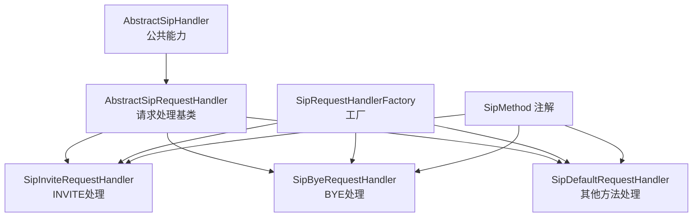
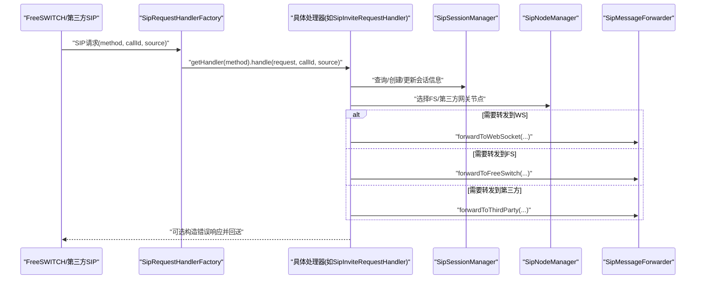
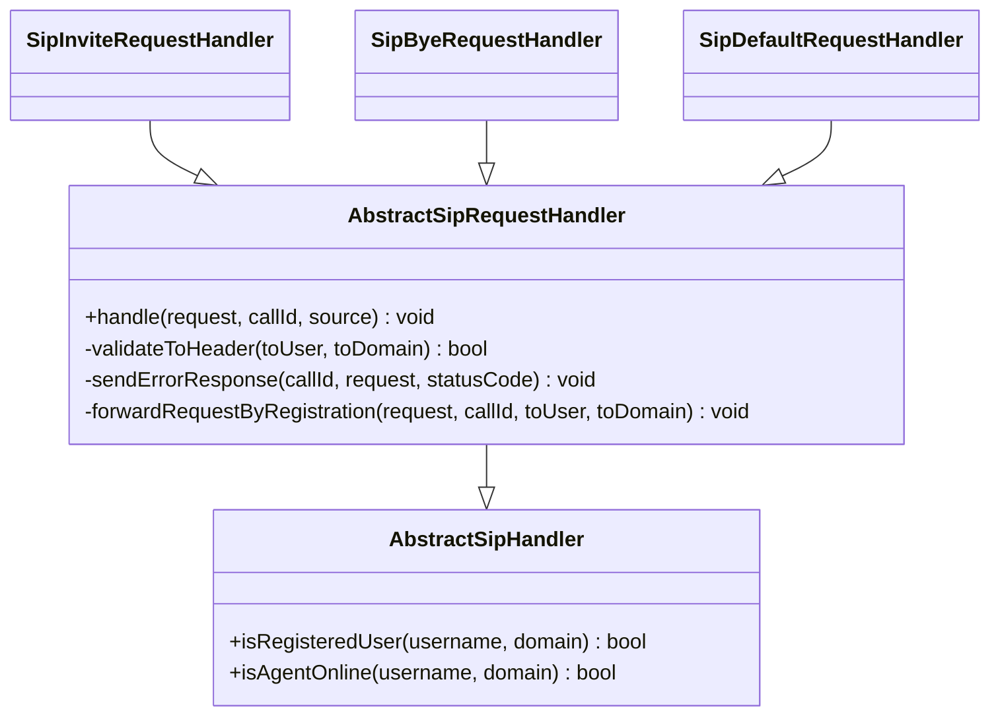
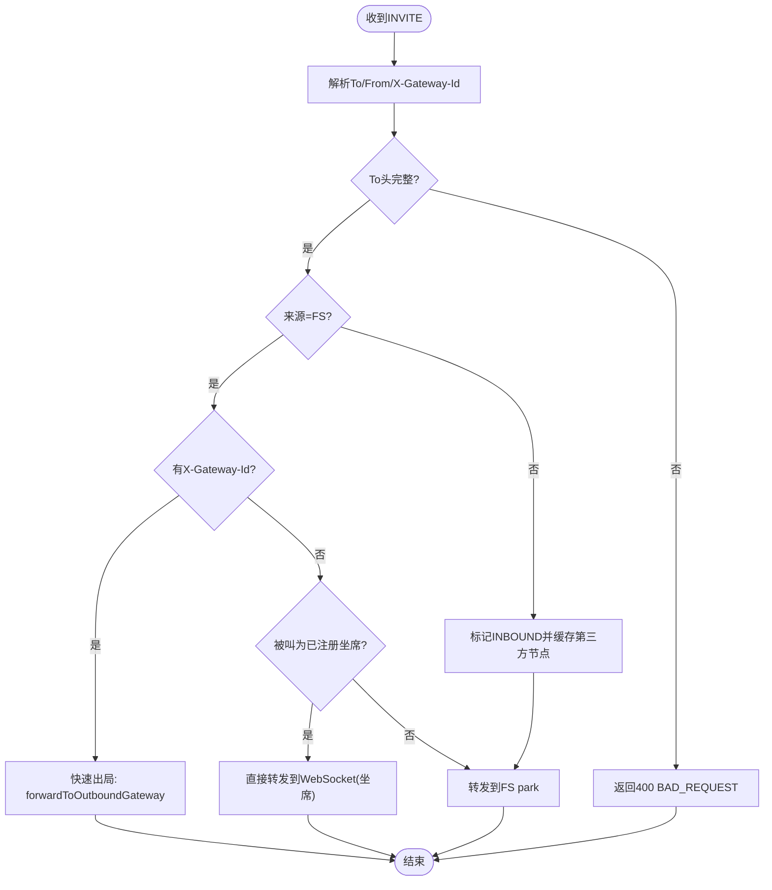
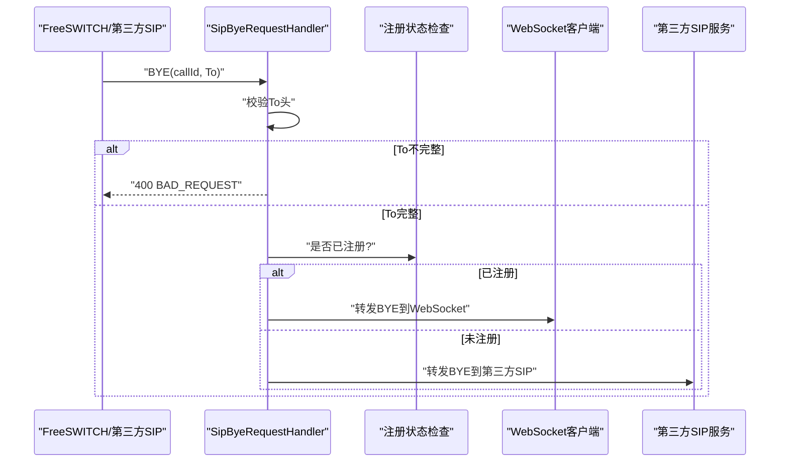
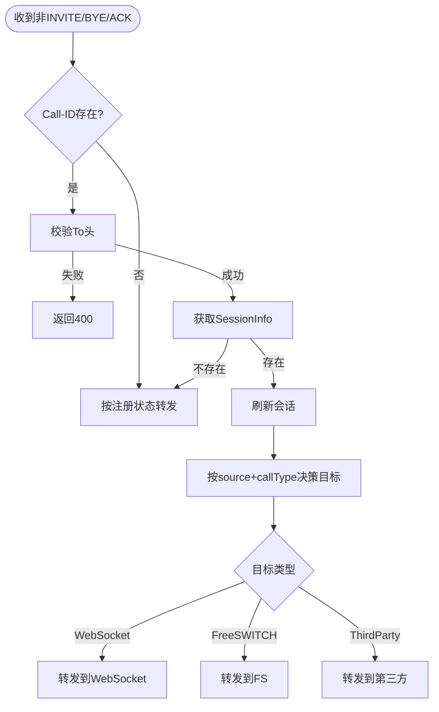
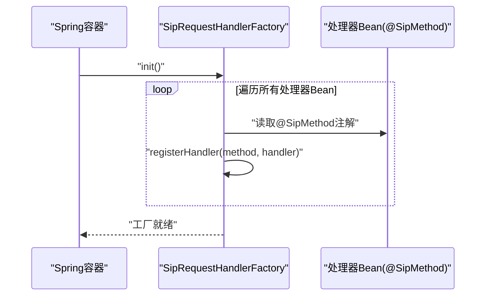
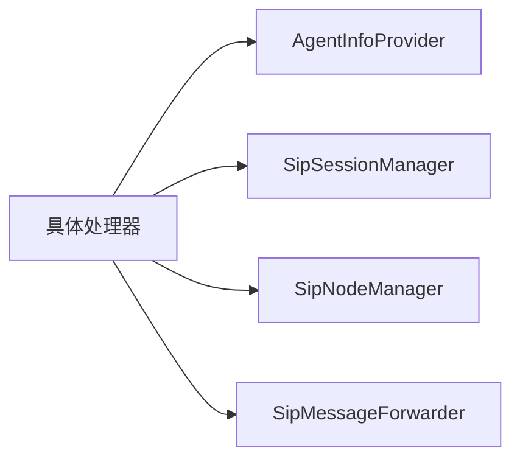

# SIP消息处理机制

<cite>
**本文引用的文件**
- [AbstractSipHandler.java](file://yudao-cloud/yudao-module-cc/ipcc-sipproxy/src/main/java/cn/ipcc/sipproxy/core/handler/AbstractSipHandler.java)
- [AbstractSipRequestHandler.java](file://yudao-cloud/yudao-module-cc/ipcc-sipproxy/src/main/java/cn/ipcc/sipproxy/core/handler/request/sip/AbstractSipRequestHandler.java)
- [SipInviteRequestHandler.java](file://yudao-cloud/yudao-module-cc/ipcc-sipproxy/src/main/java/cn/ipcc/sipproxy/core/handler/request/sip/SipInviteRequestHandler.java)
- [SipByeRequestHandler.java](file://yudao-cloud/yudao-module-cc/ipcc-sipproxy/src/main/java/cn/ipcc/sipproxy/core/handler/request/sip/SipByeRequestHandler.java)
- [SipDefaultRequestHandler.java](file://yudao-cloud/yudao-module-cc/ipcc-sipproxy/src/main/java/cn/ipcc/sipproxy/core/handler/request/sip/SipDefaultRequestHandler.java)
- [SipRequestHandlerFactory.java](file://yudao-cloud/yudao-module-cc/ipcc-sipproxy/src/main/java/cn/ipcc/sipproxy/core/handler/request/sip/SipRequestHandlerFactory.java)
- [SipMethod.java](file://yudao-cloud/yudao-module-cc/ipcc-sipproxy/src/main/java/cn/ipcc/sipproxy/core/annotation/SipMethod.java)
</cite>

## 目录
1. [简介](#简介)
2. [项目结构](#项目结构)
3. [核心组件](#核心组件)
4. [架构总览](#架构总览)
5. [详细组件分析](#详细组件分析)
6. [依赖关系分析](#依赖关系分析)
7. [性能考虑](#性能考虑)
8. [故障排查指南](#故障排查指南)
9. [结论](#结论)
10. [附录：自定义处理器示例与最佳实践](#附录自定义处理器示例与最佳实践)

## 简介
本文件面向SIP消息处理子系统，系统性说明请求处理器的设计模式、继承体系与扩展点；详解INVITE、BYE等核心方法的解析、校验、业务路由与响应生成；文档化基于注解的工厂注册机制；并提供自定义新SIP请求处理器的步骤、错误处理建议、性能优化与调试技巧。读者无需深入底层JAIN-SIP细节即可理解并扩展该模块。

## 项目结构
SIP请求处理位于sipproxy模块的core/handler/request/sip包中，采用“抽象基类 + 具体方法处理器 + 工厂”的分层组织方式：
- 抽象基类提供通用能力（会话管理、节点选择、错误响应构造、按注册状态转发等）
- 具体处理器实现特定SIP方法的处理逻辑（如INVITE、BYE）
- 默认处理器处理其他会话内方法（PRACK/UPDATE/INFO等），复用响应转发策略
- 工厂根据SIP方法名自动发现并分发到对应处理器

图表来源
- [AbstractSipHandler.java:1-74](file://yudao-cloud/yudao-module-cc/ipcc-sipproxy/src/main/java/cn/ipcc/sipproxy/core/handler/AbstractSipHandler.java#L1-L74)
- [AbstractSipRequestHandler.java:1-112](file://yudao-cloud/yudao-module-cc/ipcc-sipproxy/src/main/java/cn/ipcc/sipproxy/core/handler/request/sip/AbstractSipRequestHandler.java#L1-L112)
- [SipInviteRequestHandler.java:1-293](file://yudao-cloud/yudao-module-cc/ipcc-sipproxy/src/main/java/cn/ipcc/sipproxy/core/handler/request/sip/SipInviteRequestHandler.java#L1-L293)
- [SipByeRequestHandler.java:1-74](file://yudao-cloud/yudao-module-cc/ipcc-sipproxy/src/main/java/cn/ipcc/sipproxy/core/handler/request/sip/SipByeRequestHandler.java#L1-L74)
- [SipDefaultRequestHandler.java:1-232](file://yudao-cloud/yudao-module-cc/ipcc-sipproxy/src/main/java/cn/ipcc/sipproxy/core/handler/request/sip/SipDefaultRequestHandler.java#L1-L232)
- [SipRequestHandlerFactory.java:1-96](file://yudao-cloud/yudao-module-cc/ipcc-sipproxy/src/main/java/cn/ipcc/sipproxy/core/handler/request/sip/SipRequestHandlerFactory.java#L1-L96)
- [SipMethod.java:1-25](file://yudao-cloud/yudao-module-cc/ipcc-sipproxy/src/main/java/cn/ipcc/sipproxy/core/annotation/SipMethod.java#L1-L25)

章节来源
- [AbstractSipHandler.java:1-74](file://yudao-cloud/yudao-module-cc/ipcc-sipproxy/src/main/java/cn/ipcc/sipproxy/core/handler/AbstractSipHandler.java#L1-L74)
- [AbstractSipRequestHandler.java:1-112](file://yudao-cloud/yudao-module-cc/ipcc-sipproxy/src/main/java/cn/ipcc/sipproxy/core/handler/request/sip/AbstractSipRequestHandler.java#L1-L112)
- [SipRequestHandlerFactory.java:1-96](file://yudao-cloud/yudao-module-cc/ipcc-sipproxy/src/main/java/cn/ipcc/sipproxy/core/handler/request/sip/SipRequestHandlerFactory.java#L1-L96)

## 核心组件
- AbstractSipHandler：提供坐席信息查询、在线判断等通用能力，供所有SIP处理器复用。
- AbstractSipRequestHandler：封装了To头校验、错误响应发送、按注册状态转发等通用流程。
- SipInviteRequestHandler：处理INVITE，完成会话创建、callType标记、快速出局豁免、直接推送至WebSocket坐席或转发至FS park等复杂分支。
- SipByeRequestHandler：处理BYE，按被叫注册状态转发到WebSocket或第三方SIP。
- SipDefaultRequestHandler：处理PRACK/UPDATE/INFO等会话内方法，基于ResponseForwardingStrategy按source+callType决策转发目标。
- SipRequestHandlerFactory：基于@SipMethod注解自动扫描并注册处理器，提供按方法名获取处理器与默认处理器能力。
- SipMethod：声明处理器所处理的SIP方法名称。

章节来源
- [AbstractSipHandler.java:1-74](file://yudao-cloud/yudao-module-cc/ipcc-sipproxy/src/main/java/cn/ipcc/sipproxy/core/handler/AbstractSipHandler.java#L1-L74)
- [AbstractSipRequestHandler.java:1-112](file://yudao-cloud/yudao-module-cc/ipcc-sipproxy/src/main/java/cn/ipcc/sipproxy/core/handler/request/sip/AbstractSipRequestHandler.java#L1-L112)
- [SipInviteRequestHandler.java:1-293](file://yudao-cloud/yudao-module-cc/ipcc-sipproxy/core/handler/request/sip/SipInviteRequestHandler.java#L1-L293)
- [SipByeRequestHandler.java:1-74](file://yudao-cloud/yudao-module-cc/ipcc-sipproxy/core/handler/request/sip/SipByeRequestHandler.java#L1-L74)
- [SipDefaultRequestHandler.java:1-232](file://yudao-cloud/yudao-module-cc/ipcc-sipproxy/core/handler/request/sip/SipDefaultRequestHandler.java#L1-L232)
- [SipRequestHandlerFactory.java:1-96](file://yudao-cloud/yudao-module-cc/ipcc-sipproxy/core/handler/request/sip/SipRequestHandlerFactory.java#L1-L96)
- [SipMethod.java:1-25](file://yudao-cloud/yudao-module-cc/ipcc/sipproxy/core/annotation/SipMethod.java#L1-L25)

## 架构总览
SIP请求进入后，由工厂根据方法名分发给具体处理器；处理器通过会话管理器、节点管理器、消息转发器与上游/下游交互，完成参数校验、业务路由、响应构造与转发。

图表来源
- [SipRequestHandlerFactory.java:1-96](file://yudao-cloud/yudao-module-cc/ipcc-sipproxy/src/main/java/cn/ipcc/sipproxy/core/handler/request/sip/SipRequestHandlerFactory.java#L1-L96)
- [SipInviteRequestHandler.java:1-293](file://yudao-cloud/yudao-module-cc/ipcc-sipproxy/src/main/java/cn/ipcc/sipproxy/core/handler/request/sip/SipInviteRequestHandler.java#L1-L293)
- [AbstractSipRequestHandler.java:1-112](file://yudao-cloud/yudao-module-cc/ipcc-sipproxy/src/main/java/cn/ipcc/sipproxy/core/handler/request/sip/AbstractSipRequestHandler.java#L1-L112)

## 详细组件分析

### 继承体系与职责划分
- AbstractSipHandler：提供isRegisteredUser、isAgentOnline等通用能力，屏蔽对上层服务的直接依赖。
- AbstractSipRequestHandler：在基类中统一实现To头校验、错误响应发送、按注册状态转发等横切逻辑，降低重复代码。
- 具体处理器：仅关注各自方法特有的业务规则（如INVITE的快速出局豁免、BYE的挂断方向）。

图表来源
- [AbstractSipHandler.java:1-74](file://yudao-cloud/yudao-module-cc/ipcc-sipproxy/src/main/java/cn/ipcc/sipproxy/core/handler/AbstractSipHandler.java#L1-L74)
- [AbstractSipRequestHandler.java:1-112](file://yudao-cloud/yudao-module-cc/ipcc-sipproxy/src/main/java/cn/ipcc/sipproxy/core/handler/request/sip/AbstractSipRequestHandler.java#L1-L112)
- [SipInviteRequestHandler.java:1-293](file://yudao-cloud/yudao-module-cc/ipcc/sipproxy/core/handler/request/sip/SipInviteRequestHandler.java#L1-L293)
- [SipByeRequestHandler.java:1-74](file://yudao-cloud/yudao-module-cc/ipcc/sipproxy/core/handler/request/sip/SipByeRequestHandler.java#L1-L74)
- [SipDefaultRequestHandler.java:1-232](file://yudao-cloud/yudao-module-cc/ipcc/sipproxy/core/handler/request/sip/SipDefaultRequestHandler.java#L1-L232)

章节来源
- [AbstractSipHandler.java:1-74](file://yudao-cloud/yudao-module-cc/ipcc-sipproxy/src/main/java/cn/ipcc/sipproxy/core/handler/AbstractSipHandler.java#L1-L74)
- [AbstractSipRequestHandler.java:1-112](file://yudao-cloud/yudao-module-cc/ipcc-sipproxy/core/handler/request/sip/AbstractSipRequestHandler.java#L1-L112)

### INVITE处理器（SipInviteRequestHandler）
- 入口设置链路追踪ID，优先使用Call-ID，缺失时回退UUID。
- 提取To/From并进行To头完整性校验，失败则返回400。
- 提取X-Gateway-Id用于后续IVR转接节点的网关覆盖项。
- 根据来源(source)与是否携带X-Gateway-Id决定callType：
  - FREESWITCH + X-Gateway-Id → OUTBOUND（快速出局豁免）
  - FREESWITCH 无X-Gateway-Id → INTERNAL
  - THIRD_PARTY → INBOUND（缓存第三方节点以便响应回送）
- 豁免场景：FS源且携带X-Gateway-Id时，直接转发到出局网关，跳过FS park。
- 快速推送到JsSIP坐席：若为FS源且不携带X-Gateway-Id，且被叫为已注册坐席，则直接转发到WebSocket，避免死循环与媒体协商问题。
- 默认场景：转发到FS park，由ESL处理器走号码路由匹配→IVR流程。

图表来源
- [SipInviteRequestHandler.java:1-293](file://yudao-cloud/yudao-module-cc/ipcc-sipproxy/core/handler/request/sip/SipInviteRequestHandler.java#L1-L293)

章节来源
- [SipInviteRequestHandler.java:1-293](file://yudao-cloud/yudao-module-cc/ipcc-sipproxy/core/handler/request/sip/SipInviteRequestHandler.java#L1-L293)

### BYE处理器（SipByeRequestHandler）
- 提取To头并校验完整性，失败返回400。
- 按被叫注册状态转发：已注册→WebSocket；未注册→第三方SIP。
- 明确两段BYE分工：本处理器负责FS→坐席段，坐席→FS段由WebSocket侧处理器处理。

图表来源
- [SipByeRequestHandler.java:1-74](file://yudao-cloud/yudao-module-cc/ipcc/sipproxy/core/handler/request/sip/SipByeRequestHandler.java#L1-L74)
- [AbstractSipRequestHandler.java:1-112](file://yudao-cloud/yudao-module-cc/ipcc-sipproxy/core/handler/request/sip/AbstractSipRequestHandler.java#L1-L112)

章节来源
- [SipByeRequestHandler.java:1-74](file://yudao-cloud/yudao-module-cc/ipcc-sipproxy/core/handler/request/sip/SipByeRequestHandler.java#L1-L74)
- [AbstractSipRequestHandler.java:1-112](file://yudao-cloud/yudao-module-cc/ipcc-sipproxy/core/handler/request/sip/AbstractSipRequestHandler.java#L1-L112)

### 默认处理器（SipDefaultRequestHandler）
- 处理PRACK/UPDATE/INFO等会话内方法。
- 若Call-ID为空，直接fallback到按注册状态转发。
- 若存在SessionInfo，刷新会话并按source+callType决策转发目标（WebSocket/FS/第三方）。
- 若不存在SessionInfo，fallback到按注册状态转发以保证兼容。

图表来源
- [SipDefaultRequestHandler.java:1-232](file://yudao-cloud/yudao-module-cc/ipcc-sipproxy/core/handler/request/sip/SipDefaultRequestHandler.java#L1-L232)

章节来源
- [SipDefaultRequestHandler.java:1-232](file://yudao-cloud/yudao-module-cc/ipcc-sipproxy/core/handler/request/sip/SipDefaultRequestHandler.java#L1-L232)

### 工厂模式（SipRequestHandlerFactory）
- 通过Spring容器注入所有AbstractSipRequestHandler实例。
- 启动时扫描@SipMethod注解，将方法名映射到处理器实例。
- 提供registerHandler/getHandler/getDefaultHandler等方法，便于扩展与测试。
- 初始化时将HeaderFactory注入到各处理器，保证错误响应构造可用。

图表来源
- [SipRequestHandlerFactory.java:1-96](file://yudao-cloud/yudao-module-cc/ipcc-sipproxy/core/handler/request/sip/SipRequestHandlerFactory.java#L1-L96)
- [SipMethod.java:1-25](file://yudao-cloud/yudao-module-cc/ipcc-sipproxy/core/annotation/SipMethod.java#L1-L25)

章节来源
- [SipRequestHandlerFactory.java:1-96](file://yudao-cloud/yudao-module-cc/ipcc-sipproxy/core/handler/request/sip/SipRequestHandlerFactory.java#L1-L96)
- [SipMethod.java:1-25](file://yudao-cloud/yudao-module-cc/ipcc-sipproxy/core/annotation/SipMethod.java#L1-L25)

## 依赖关系分析
- 处理器依赖：
  - AgentInfoProvider：查询坐席信息（替代直接依赖上层服务）
  - SipSessionManager：会话生命周期管理（创建/更新/查询）
  - SipNodeManager：节点选择（FS/第三方）
  - SipMessageForwarder：消息转发（WebSocket/FS/第三方）
- 解耦点：
  - 通过接口与默认实现分离，便于替换与测试
  - 通过@SipMethod注解驱动注册，新增处理器无需修改工厂代码

图表来源
- [AbstractSipHandler.java:1-74](file://yudao-cloud/yudao-module-cc/ipcc-sipproxy/core/handler/AbstractSipHandler.java#L1-L74)
- [AbstractSipRequestHandler.java:1-112](file://yudao-cloud/yudao-module-cc/ipcc-sipproxy/core/handler/request/sip/AbstractSipRequestHandler.java#L1-L112)

章节来源
- [AbstractSipHandler.java:1-74](file://yudao-cloud/yudao-module-cc/ipcc-sipproxy/core/handler/AbstractSipHandler.java#L1-L74)
- [AbstractSipRequestHandler.java:1-112](file://yudao-cloud/yudao-module-cc/ipcc-sipproxy/core/handler/request/sip/AbstractSipRequestHandler.java#L1-L112)

## 性能考虑
- 减少不必要的数据库/Redis查询：
  - 在INVITE路径中，尽量复用已获取的sessionInfo与node信息，避免重复选择节点。
  - 对频繁访问的注册状态与在线状态进行本地缓存（如短TTL内存缓存）以降低外部依赖压力。
- 控制异常路径开销：
  - To头校验失败尽早返回，避免后续昂贵操作。
  - 对可能抛异常的头部解析进行try-catch包裹并记录告警日志，防止阻塞主流程。
- 并发与线程安全：
  - 会话管理器应保证高并发下的读写一致性；必要时对热点key加锁或使用原子结构。
- 网络I/O优化：
  - 批量转发或合并小消息可降低上下文切换成本。
  - 对WebSocket连接进行健康检查与重连机制，避免无效转发。

[本节为通用性能建议，不直接分析具体文件]

## 故障排查指南
- 常见错误定位：
  - To头不完整：检查SIP请求头域是否正确设置，确认解析函数返回值。
  - 会话不存在：确认INVITE是否创建了SessionInfo；对于非INVITE方法，检查是否具备Call-ID以走会话决策路径。
  - 节点选择失败：检查SipNodeManager是否能选出合适的FS/第三方节点；多FS实例场景下注意Via端口识别。
  - WebSocket转发失败：确认sessionId是否存在；检查WebSocket连接状态与代理头改写是否正确。
- 日志关键字：
  - “To头不完整”、“没有可用的FreeSWITCH节点”、“未知转发目标”、“WebSocket会话ID不存在”等。
- 调试建议：
  - 在关键分支前后打印callId、source、callType、target等上下文。
  - 对异常捕获处增加堆栈日志，便于快速定位根因。
  - 使用链路追踪ID（优先Call-ID）串联上下游日志。

章节来源
- [AbstractSipRequestHandler.java:1-112](file://yudao-cloud/yudao-module-cc/ipcc-sipproxy/core/handler/request/sip/AbstractSipRequestHandler.java#L1-L112)
- [SipDefaultRequestHandler.java:1-232](file://yudao-cloud/yudao-module-cc/ipcc-sipproxy/core/handler/request/sip/SipDefaultRequestHandler.java#L1-L232)
- [SipInviteRequestHandler.java:1-293](file://yudao-cloud/yudao-module-cc/ipcc-sipproxy/core/handler/request/sip/SipInviteRequestHandler.java#L1-L293)

## 结论
该SIP消息处理机制通过清晰的继承体系与工厂模式，实现了高内聚、低耦合的请求分发与处理。INVITE与BYE等核心方法覆盖了典型呼叫建立与释放流程，并通过快速出局豁免与直接推送坐席等优化提升性能与稳定性。默认处理器确保会话内信令的正确转发。整体设计易于扩展与维护，适合在复杂呼叫中心场景中持续演进。

[本节为总结性内容，不直接分析具体文件]

## 附录：自定义处理器示例与最佳实践
- 新建处理器类：
  - 继承AbstractSipRequestHandler
  - 使用@SipMethod注解标注要处理的SIP方法（如“REGISTER”、“OPTIONS”）
  - 实现handle方法，完成参数解析、校验、业务逻辑与响应生成
- 注册与管理：
  - 工厂会在启动时自动扫描@SipMethod并注册处理器，无需手动维护映射表
  - 可通过SipRequestHandlerFactory.registerHandler进行动态注册（适用于测试或运行时扩展）
- 错误处理：
  - 使用validateToHeader进行基础校验，失败调用sendErrorResponse返回标准SIP错误码
  - 对可能的异常进行捕获并记录详细日志，避免影响其他请求
- 最佳实践：
  - 复用AbstractSipRequestHandler提供的forwardRequestByRegistration进行按注册状态转发
  - 合理设置callType与SessionInfo，确保后续会话内方法能正确决策转发目标
  - 谨慎处理头部字段，避免破坏SIP语义；对自定义头（如X-Gateway-Id）进行健壮解析
  - 在关键路径添加链路追踪ID，便于全链路排障

章节来源
- [SipMethod.java:1-25](file://yudao-cloud/yudao-module-cc/ipcc-sipproxy/core/annotation/SipMethod.java#L1-L25)
- [SipRequestHandlerFactory.java:1-96](file://yudao-cloud/yudao-module-cc/ipcc-sipproxy/core/handler/request/sip/SipRequestHandlerFactory.java#L1-L96)
- [AbstractSipRequestHandler.java:1-112](file://yudao-cloud/yudao-module-cc/ipcc-sipproxy/core/handler/request/sip/AbstractSipRequestHandler.java#L1-L112)