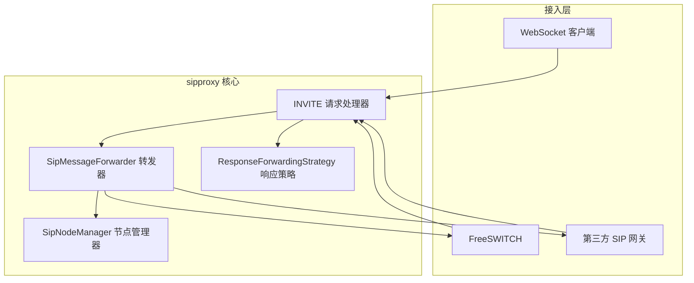
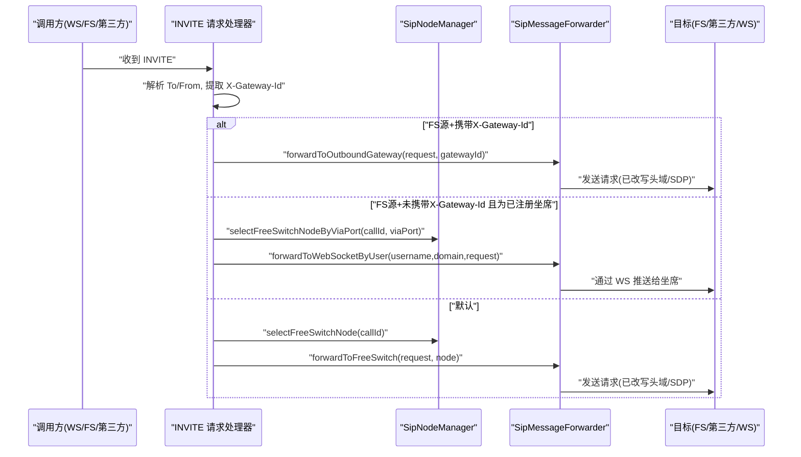
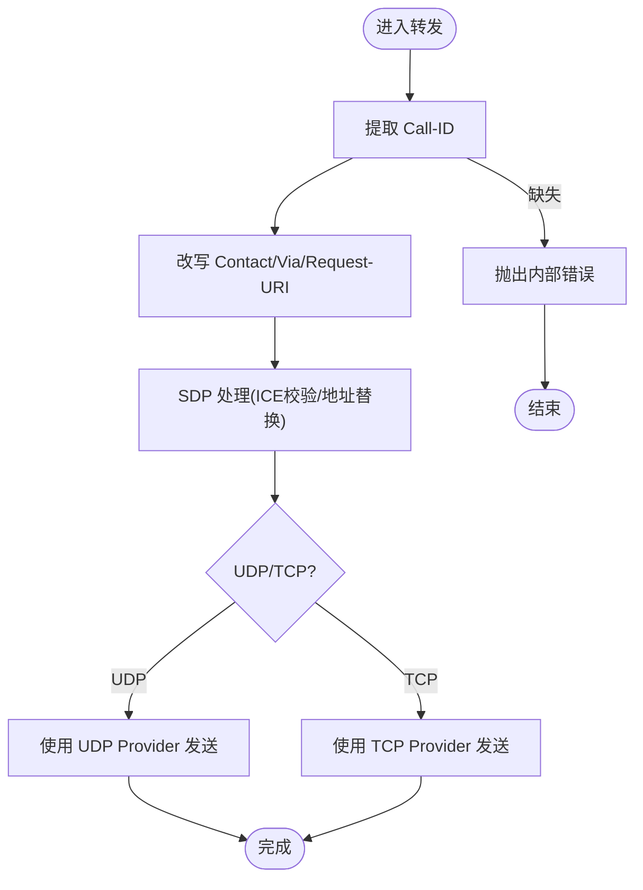
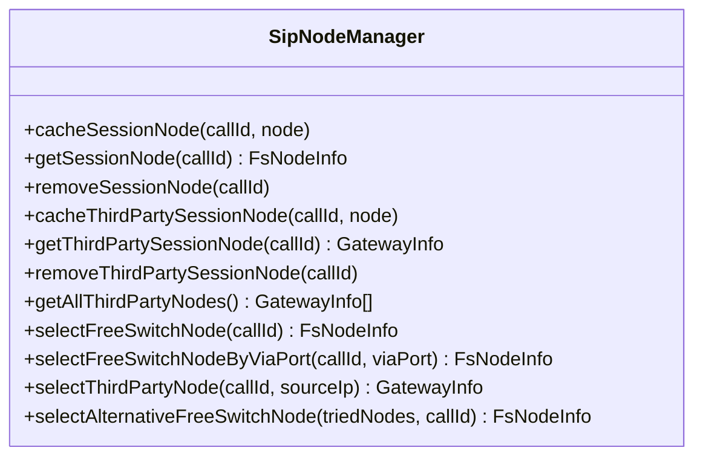
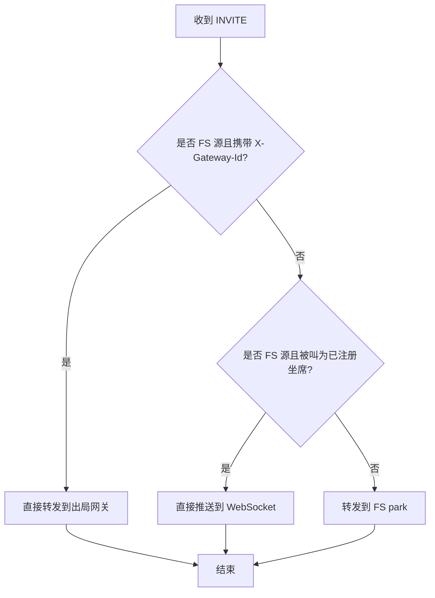
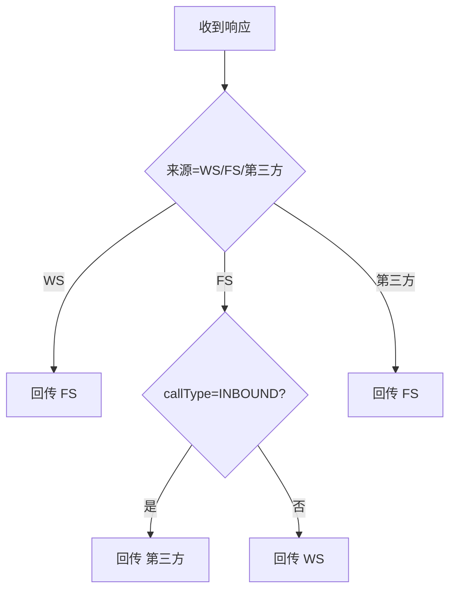
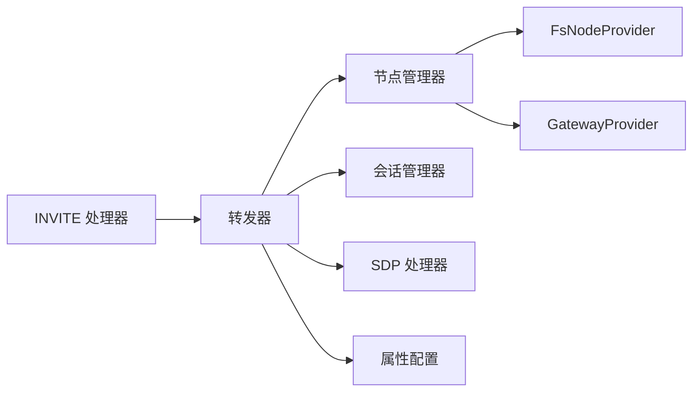

# 消息转发机制

<cite>
**本文引用的文件**
- [SipMessageForwarder.java](file://yudao-cloud/yudao-module-cc/ipcc-sipproxy/src/main/java/cn/ipcc/sipproxy/core/forwarder/SipMessageForwarder.java)
- [SipNodeManager.java](file://yudao-cloud/yudao-module-cc/ipcc-sipproxy/src/main/java/cn/ipcc/sipproxy/core/node/SipNodeManager.java)
- [SipInviteRequestHandler.java](file://yudao-cloud/yudao-module-cc/ipcc-sipproxy/src/main/java/cn/ipcc/sipproxy/core/handler/request/sip/SipInviteRequestHandler.java)
- [ResponseForwardingStrategy.java](file://yudao-cloud/yudao-module-cc/ipcc-sipproxy/src/main/java/cn/ipcc/sipproxy/core/handler/response/ResponseForwardingStrategy.java)
- [SipProxyProperties.java](file://yudao-cloud/yudao-module-cc/ipcc-sipproxy/src/main/java/cn/ipcc/sipproxy/autoconfigure/SipProxyProperties.java)
- [SipProxyErrorCodeConstants.java](file://yudao-cloud/yudao-module-cc/ipcc-sipproxy/src/main/java/cn/ipcc/sipproxy/support/SipProxyErrorCodeConstants.java)
</cite>

## 目录
1. [简介](#简介)
2. [项目结构](#项目结构)
3. [核心组件](#核心组件)
4. [架构总览](#架构总览)
5. [详细组件分析](#详细组件分析)
6. [依赖关系分析](#依赖关系分析)
7. [性能与网络优化](#性能与网络优化)
8. [故障排查指南](#故障排查指南)
9. [结论](#结论)
10. [附录：配置与扩展示例](#附录：配置与扩展示例)

## 简介
本文件面向 SIP 代理（sipproxy）的消息转发机制，围绕 SipMessageForwarder 的转发算法与路由策略、SipNodeManager 的节点管理与健康选择、以及请求/响应回传与错误处理进行系统化说明。文档覆盖从接收原始 SIP 消息到转发至目标节点的完整流程，并解释 NAT 穿透、代理链与循环检测等复杂场景的处理方式，同时给出可操作的配置建议与扩展点实践。

## 项目结构
sipproxy 模块采用“处理器 + 转发器 + 节点管理”的分层设计：
- 处理器层：按 SIP 方法或方向注册具体处理器，如 INVITE 入局处理。
- 转发器层：统一封装对 FreeSWITCH、第三方 SIP、WebSocket 客户端的转发逻辑，负责头域改写、SDP 处理、传输协议选择与异常处理。
- 节点管理层：抽象出 FS 节点与第三方网关节点的发现、选择、缓存与故障转移能力。
- 配置与常量：集中式属性与错误码，便于多环境部署与运维排障。

图表来源
- [SipInviteRequestHandler.java:71-233](file://yudao-cloud/yudao-module-cc/ipcc-sipproxy/src/main/java/cn/ipcc/sipproxy/core/handler/request/sip/SipInviteRequestHandler.java#L71-L233)
- [SipMessageForwarder.java:110-240](file://yudao-cloud/yudao-module-cc/ipcc-sipproxy/src/main/java/cn/ipcc/sipproxy/core/forwarder/SipMessageForwarder.java#L110-L240)
- [SipNodeManager.java:156-332](file://yudao-cloud/yudao-module-cc/ipcc-sipproxy/src/main/java/cn/ipcc/sipproxy/core/node/SipNodeManager.java#L156-L332)
- [ResponseForwardingStrategy.java:34-78](file://yudao-cloud/yudao-module-cc/ipcc-sipproxy/src/main/java/cn/ipcc/sipproxy/core/handler/response/ResponseForwardingStrategy.java#L34-L78)

章节来源
- [SipInviteRequestHandler.java:71-233](file://yudao-cloud/yudao-module-cc/ipcc-sipproxy/src/main/java/cn/ipcc/sipproxy/core/handler/request/sip/SipInviteRequestHandler.java#L71-L233)
- [SipMessageForwarder.java:110-240](file://yudao-cloud/yudao-module-cc/ipcc-sipproxy/src/main/java/cn/ipcc/sipproxy/core/forwarder/SipMessageForwarder.java#L110-L240)
- [SipNodeManager.java:156-332](file://yudao-cloud/yudao-module-cc/ipcc-sipproxy/src/main/java/cn/ipcc/sipproxy/core/node/SipNodeManager.java#L156-L332)
- [ResponseForwardingStrategy.java:34-78](file://yudao-cloud/yudao-module-cc/ipcc-sipproxy/src/main/java/cn/ipcc/sipproxy/core/handler/response/ResponseForwardingStrategy.java#L34-L78)

## 核心组件
- SipMessageForwarder：统一转发入口，负责头域改写、SDP 处理、传输协议选择、故障转移与错误上报。
- SipNodeManager：节点发现与选择（基于 Call-ID 哈希、Via 端口匹配、来源 IP 反查），会话级缓存与备用节点选择。
- SipInviteRequestHandler：入局 INVITE 的路由决策（快速出局豁免、直接推送坐席、默认走 FS park）。
- ResponseForwardingStrategy：根据消息来源与呼叫类型决定响应回传目标（WS/FS/第三方）。
- SipProxyProperties：SIP/WS/心跳/集群/会话存储等运行时配置。
- SipProxyErrorCodeConstants：统一错误码，便于上层捕获与差异化处理。

章节来源
- [SipMessageForwarder.java:47-87](file://yudao-cloud/yudao-module-cc/ipcc-sipproxy/src/main/java/cn/ipcc/sipproxy/core/forwarder/SipMessageForwarder.java#L47-L87)
- [SipNodeManager.java:20-47](file://yudao-cloud/yudao-module-cc/ipcc-sipproxy/src/main/java/cn/ipcc/sipproxy/core/node/SipNodeManager.java#L20-L47)
- [SipInviteRequestHandler.java:23-32](file://yudao-cloud/yudao-module-cc/ipcc-sipproxy/src/main/java/cn/ipcc/sipproxy/core/handler/request/sip/SipInviteRequestHandler.java#L23-L32)
- [ResponseForwardingStrategy.java:10-23](file://yudao-cloud/yudao-module-cc/ipcc-sipproxy/src/main/java/cn/ipcc/sipproxy/core/handler/response/ResponseForwardingStrategy.java#L10-L23)
- [SipProxyProperties.java:6-23](file://yudao-cloud/yudao-module-cc/ipcc-sipproxy/src/main/java/cn/ipcc/sipproxy/autoconfigure/SipProxyProperties.java#L6-L23)
- [SipProxyErrorCodeConstants.java:8-27](file://yudao-cloud/yudao-module-cc/ipcc-sipproxy/src/main/java/cn/ipcc/sipproxy/support/SipProxyErrorCodeConstants.java#L8-L27)

## 架构总览
下图展示了从入局 INVITE 到转发的关键路径，包括路由决策、节点选择、头域改写与 SDP 处理。

图表来源
- [SipInviteRequestHandler.java:71-233](file://yudao-cloud/yudao-module-cc/ipcc-sipproxy/src/main/java/cn/ipcc/sipproxy/core/handler/request/sip/SipInviteRequestHandler.java#L71-L233)
- [SipMessageForwarder.java:110-240](file://yudao-cloud/yudao-module-cc/ipcc-sipproxy/src/main/java/cn/ipcc/sipproxy/core/forwarder/SipMessageForwarder.java#L110-L240)
- [SipNodeManager.java:156-228](file://yudao-cloud/yudao-module-cc/ipcc-sipproxy/src/main/java/cn/ipcc/sipproxy/core/node/SipNodeManager.java#L156-L228)

## 详细组件分析

### SipMessageForwarder：转发算法与路由策略
- 请求转发
  - 到 FreeSWITCH：支持故障转移，失败时自动尝试其他可用节点，直至成功或无可用节点。
  - 到第三方 SIP：根据会话信息选择 UDP/TCP 传输，改写头域并透传 SDP。
  - 到 WebSocket：按用户与域名查找会话，改写头域与 Request-URI，必要时替换 SDP 媒体地址。
- 响应回传
  - 通过 ResponseForwardingStrategy 依据消息来源与呼叫类型决定回传目标（WS/FS/第三方）。
- 头域与 SDP 处理
  - Contact/Via 头重写为代理公网地址与端口，设置 rport 以支持 NAT 回包。
  - Request-URI 改写为目标节点地址；响应 Via 头指向目标以便回包。
  - SDP 校验与替换：当内容类型为 application/sdp 时，校验 ICE 候选完整性；在 WebSocket 场景下将 FS 内网媒体地址替换为公网地址，确保 WebRTC 媒体连通。
- 错误处理
  - 统一抛出 SipProxyException，附带明确错误码（如 FORWARD_FAILED、SESSION_NOT_FOUND 等），便于上层捕获与告警。

图表来源
- [SipMessageForwarder.java:262-358](file://yudao-cloud/yudao-module-cc/ipcc-sipproxy/src/main/java/cn/ipcc/sipproxy/core/forwarder/SipMessageForwarder.java#L262-L358)
- [SipMessageForwarder.java:363-389](file://yudao-cloud/yudao-module-cc/ipcc-sipproxy/src/main/java/cn/ipcc/sipproxy/core/forwarder/SipMessageForwarder.java#L363-L389)
- [SipMessageForwarder.java:479-550](file://yudao-cloud/yudao-module-cc/ipcc-sipproxy/src/main/java/cn/ipcc/sipproxy/core/forwarder/SipMessageForwarder.java#L479-L550)
- [SipMessageForwarder.java:163-201](file://yudao-cloud/yudao-module-cc/ipcc-sipproxy/src/main/java/cn/ipcc/sipproxy/core/forwarder/SipMessageForwarder.java#L163-L201)

章节来源
- [SipMessageForwarder.java:110-240](file://yudao-cloud/yudao-module-cc/ipcc-sipproxy/src/main/java/cn/ipcc/sipproxy/core/forwarder/SipMessageForwarder.java#L110-L240)
- [SipMessageForwarder.java:262-358](file://yudao-cloud/yudao-module-cc/ipcc-sipproxy/src/main/java/cn/ipcc/sipproxy/core/forwarder/SipMessageForwarder.java#L262-L358)
- [SipMessageForwarder.java:363-389](file://yudao-cloud/yudao-module-cc/ipcc-sipproxy/src/main/java/cn/ipcc/sipproxy/core/forwarder/SipMessageForwarder.java#L363-L389)
- [SipMessageForwarder.java:479-550](file://yudao-cloud/yudao-module-cc/ipcc-sipproxy/src/main/java/cn/ipcc/sipproxy/core/forwarder/SipMessageForwarder.java#L479-L550)
- [SipProxyErrorCodeConstants.java:10-23](file://yudao-cloud/yudao-module-cc/ipcc-sipproxy/src/main/java/cn/ipcc/sipproxy/support/SipProxyErrorCodeConstants.java#L10-L23)

### SipNodeManager：节点管理与负载均衡
- 节点发现
  - 通过 FsNodeProvider/GatewayProvider 获取在线 FS 节点与第三方网关节点列表。
- 选择策略
  - FreeSWITCH 节点：优先按 Call-ID 哈希选择并缓存；支持按 Via 端口精确匹配来源 FS（解决多实例共用公网 IP 时的响应回送问题）。
  - 第三方节点：按 INVITE 来源 IP 反查匹配的网关节点，避免误路由。
- 健康检查与故障转移
  - 会话级缓存映射（Redis），过期清理；失败时选择未尝试过的备用节点继续重试。
- 复杂度分析
  - 选择操作时间复杂度 O(N)（N 为节点数），空间复杂度 O(1) 额外开销（不计缓存）。

图表来源
- [SipNodeManager.java:50-132](file://yudao-cloud/yudao-module-cc/ipcc-sipproxy/src/main/java/cn/ipcc/sipproxy/core/node/SipNodeManager.java#L50-L132)
- [SipNodeManager.java:156-332](file://yudao-cloud/yudao-module-cc/ipcc-sipproxy/src/main/java/cn/ipcc/sipproxy/core/node/SipNodeManager.java#L156-L332)

章节来源
- [SipNodeManager.java:156-332](file://yudao-cloud/yudao-module-cc/ipcc-sipproxy/src/main/java/cn/ipcc/sipproxy/core/node/SipNodeManager.java#L156-L332)

### 入局 INVITE 处理与循环检测
- 路由决策
  - 快速出局豁免：FS 源 INVITE 携带 X-Gateway-Id 时，直接转发到出局网关，跳过 FS park，避免形成环路。
  - 直接推送坐席：FS 源 INVITE 被叫为已注册 JsSIP 坐席时，直接转发到 WebSocket，避免 FS 间 WebRTC SDP 协商失败。
  - 默认路径：转发到内部 FS park，由 ESL 处理器执行号码路由匹配与 IVR 流程。
- 循环检测
  - 通过“快速出局豁免”和“直接推送坐席”两条短路路径，避免 INVITE 在 sipproxy 与 FS 之间反复回环。
  - 结合 SessionInfo 中的 callType 与来源标记，确保响应正确回传，防止响应错发导致的死循环。

图表来源
- [SipInviteRequestHandler.java:142-233](file://yudao-cloud/yudao-module-cc/ipcc-sipproxy/src/main/java/cn/ipcc/sipproxy/core/handler/request/sip/SipInviteRequestHandler.java#L142-L233)

章节来源
- [SipInviteRequestHandler.java:71-233](file://yudao-cloud/yudao-module-cc/ipcc-sipproxy/src/main/java/cn/ipcc/sipproxy/core/handler/request/sip/SipInviteRequestHandler.java#L71-L233)

### 响应回传策略
- 策略表
  - WebSocket 来源：无论呼叫类型，响应均回传到 FS。
  - FreeSWITCH 来源：内部/外呼响应回传到 WebSocket；入呼响应回传到第三方。
  - 第三方来源：无论呼叫类型，响应均回传到 FS。
- 实现要点
  - 通过 ResponseForwardingStrategy.getForwardingTarget(source, callType) 获取目标，再交由上层处理器选择对应转发器。

图表来源
- [ResponseForwardingStrategy.java:34-78](file://yudao-cloud/yudao-module-cc/ipcc-sipproxy/src/main/java/cn/ipcc/sipproxy/core/handler/response/ResponseForwardingStrategy.java#L34-L78)

章节来源
- [ResponseForwardingStrategy.java:34-78](file://yudao-cloud/yudao-module-cc/ipcc-sipproxy/src/main/java/cn/ipcc/sipproxy/core/handler/response/ResponseForwardingStrategy.java#L34-L78)

## 依赖关系分析
- 组件耦合
  - 处理器依赖转发器与节点管理器；转发器依赖会话管理器、网关提供者、SDP 处理器与属性配置。
  - 节点管理器通过 FsNodeProvider/GatewayProvider 解耦数据源，降低与 ORM 的耦合度。
- 外部依赖
  - Redis：用于会话-节点映射缓存与 TTL 控制。
  - JAIN-SIP：提供底层 SIP 栈与消息对象。
- 潜在循环与风险
  - 若未启用快速出局豁免或直接推送坐席，可能出现 INVITE 在 sipproxy 与 FS 之间的回环；已通过短路路径规避。
  - 若 Contact/Via 头未正确改写，可能导致 NAT 环境下回包失败；已在转发器中强制改写。

图表来源
- [SipInviteRequestHandler.java:71-233](file://yudao-cloud/yudao-module-cc/ipcc-sipproxy/src/main/java/cn/ipcc/sipproxy/core/handler/request/sip/SipInviteRequestHandler.java#L71-L233)
- [SipMessageForwarder.java:47-87](file://yudao-cloud/yudao-module-cc/ipcc-sipproxy/src/main/java/cn/ipcc/sipproxy/core/forwarder/SipMessageForwarder.java#L47-L87)
- [SipNodeManager.java:20-47](file://yudao-cloud/yudao-module-cc/ipcc-sipproxy/src/main/java/cn/ipcc/sipproxy/core/node/SipNodeManager.java#L20-L47)

章节来源
- [SipInviteRequestHandler.java:71-233](file://yudao-cloud/yudao-module-cc/ipcc-sipproxy/core/handler/request/sip/SipInviteRequestHandler.java#L71-L233)
- [SipMessageForwarder.java:47-87](file://yudao-cloud/yudao-module-cc/ipcc-sipproxy/core/forwarder/SipMessageForwarder.java#L47-L87)
- [SipNodeManager.java:20-47](file://yudao-cloud/yudao-module-cc/ipcc-sipproxy/core/node/SipNodeManager.java#L20-L47)

## 性能与网络优化
- 传输协议选择
  - 根据会话信息动态选择 UDP/TCP，减少不必要的协议切换开销。
- 头域与 SDP 优化
  - 仅在必要时改写 Contact/Via/Request-URI；SDP 仅针对 application/sdp 进行处理，避免多余字符串操作。
  - WebSocket 场景下精准替换 c= 行与 a=candidate 行中的媒体 IP，避免全局替换带来的副作用。
- 节点选择与缓存
  - 会话级缓存命中率高，减少重复计算；Via 端口匹配提升多 FS 实例场景下的响应准确率。
- 监控指标建议
  - 转发成功率/失败率、各目标节点耗时分布、SDP 替换次数、故障转移触发次数、会话创建/销毁速率、WebSocket 连接存活率。
  - 建议在关键路径埋点：INVITE 入局、节点选择、头域改写、SDP 处理、发送成功/失败、故障转移。

[本节为通用指导，不直接分析具体文件]

## 故障排查指南
- 常见错误码
  - 500 内部服务错误：通用兜底。
  - 501 无可用 FS 节点：检查 FsNodeProvider 返回与在线状态。
  - 502 会话不存在：检查 Call-ID/SessionId 是否正确传递与会话缓存。
  - 503 网关不存在：检查网关配置与启用状态。
  - 504 坐席不存在：检查坐席注册信息与查询条件。
  - 505 网关类型无效：检查 GatewayInfo.type 枚举范围。
  - 506 转发失败：检查网络连通性、SIP 栈状态与日志堆栈。
- 排查步骤
  - 确认 Contact/Via 头是否已改写为代理公网地址与端口。
  - 检查 SDP 中是否包含 ICE 候选，必要时启用地址替换。
  - 验证节点选择是否符合预期（哈希/ Via 端口/来源 IP）。
  - 查看响应回传策略是否与呼叫类型一致。
  - 关注故障转移日志，定位失败节点与重试次数。

章节来源
- [SipProxyErrorCodeConstants.java:10-23](file://yudao-cloud/yudao-module-cc/ipcc-sipproxy/src/main/java/cn/ipcc/sipproxy/support/SipProxyErrorCodeConstants.java#L10-L23)
- [SipMessageForwarder.java:110-240](file://yudao-cloud/yudao-module-cc/ipcc-sipproxy/core/forwarder/SipMessageForwarder.java#L110-L240)

## 结论
本 SIP 代理的消息转发机制通过清晰的处理器-转发器-节点管理层划分，实现了高可用的请求转发与响应回传。借助头域与 SDP 的精准改写、会话级缓存与故障转移、以及针对 NAT 与多 FS 实例的优化策略，系统能够在复杂网络环境中稳定运行。配合统一的错误码与可扩展的网关重写点，便于在不同业务场景中灵活定制转发规则。

[本节为总结，不直接分析具体文件]

## 附录：配置与扩展示例

### 配置示例（application.yaml）
- SIP 监听与公网暴露
  - sipproxy.sip.port: 5561
  - sipproxy.sip.bindAddress: 0.0.0.0
  - sipproxy.sip.publicIp: <代理公网IP>
  - sipproxy.sip.publicPort: 5561
- WebSocket 接入
  - sipproxy.websocket.enabled: true
  - sipproxy.websocket.path: /sipproxy/ws
  - sipproxy.websocket.requireAuth: true
  - sipproxy.websocket.authTokenSource: query
  - sipproxy.websocket.tokenQueryParam: token
- 心跳与集群
  - sipproxy.heartbeat.optionsEnabled: true
  - sipproxy.heartbeat.idleTimeout: 90
  - sipproxy.cluster.senderType: local|redis|rocketmq|rabbitmq|kafka
  - sipproxy.cluster.senderRedisChannel: ipcc:sipproxy:ws:broadcast
- 会话存储
  - sipproxy.session.redisKeyPrefix: ipcc:sipproxy:session:
  - sipproxy.session.sessionTtl: 120
  - sipproxy.session.registerTtl: 3600

章节来源
- [SipProxyProperties.java:57-160](file://yudao-cloud/yudao-module-cc/ipcc-sipproxy/src/main/java/cn/ipcc/sipproxy/autoconfigure/SipProxyProperties.java#L57-L160)

### 自定义转发规则与扩展点
- 出局 INVITE 信令改写
  - 通过 OutboundGatewayRewriter 扩展点，自定义 From/PAI/Record-Route 等头域的改写逻辑，适配不同网关要求。
- SDP 处理扩展
  - 通过 SdpProcessor 扩展点，在转发前对 SDP 进行编解码过滤、ICE 候选替换等处理，满足特定媒体协商需求。
- 认证与拦截
  - 通过 AuthenticationCallback/WsHandshakeAuthenticator 实现 WebSocket 握手认证；通过 SipRateLimiter/IpWhitelist 实现速率限制与白名单。

章节来源
- [SipMessageForwarder.java:558-629](file://yudao-cloud/yudao-module-cc/ipcc-sipproxy/src/main/java/cn/ipcc/sipproxy/core/forwarder/SipMessageForwarder.java#L558-L629)