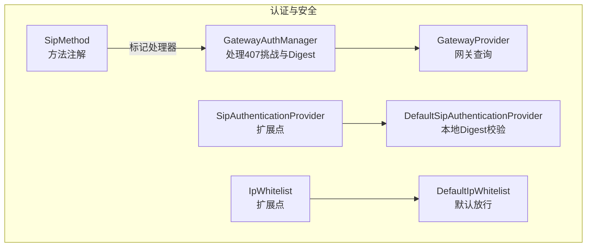
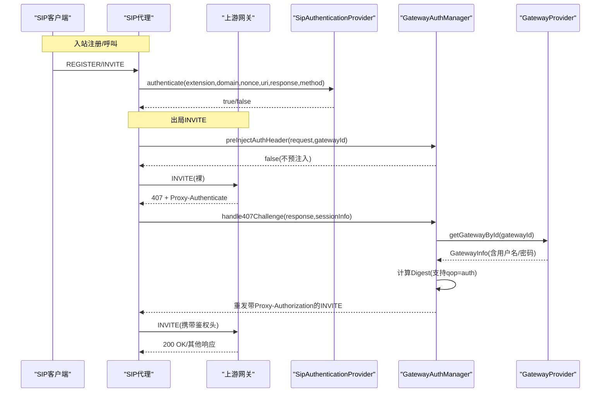
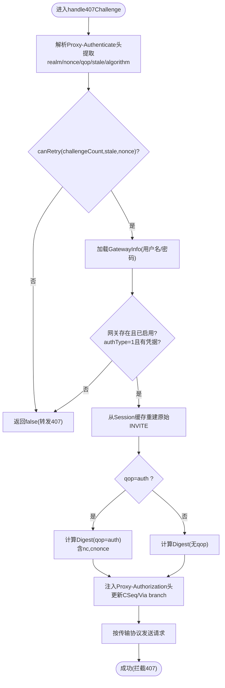
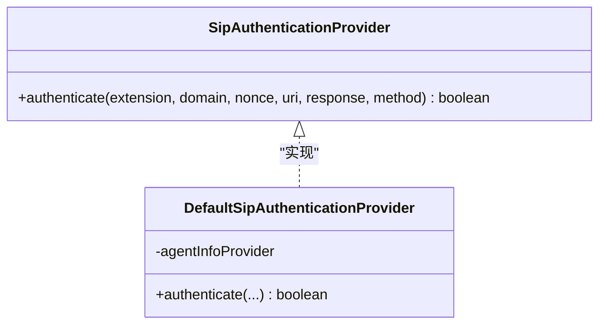
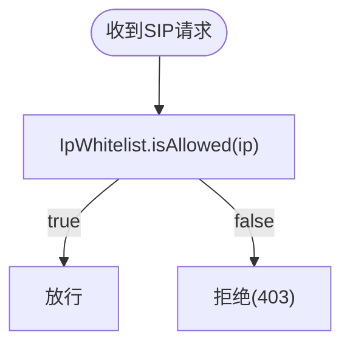
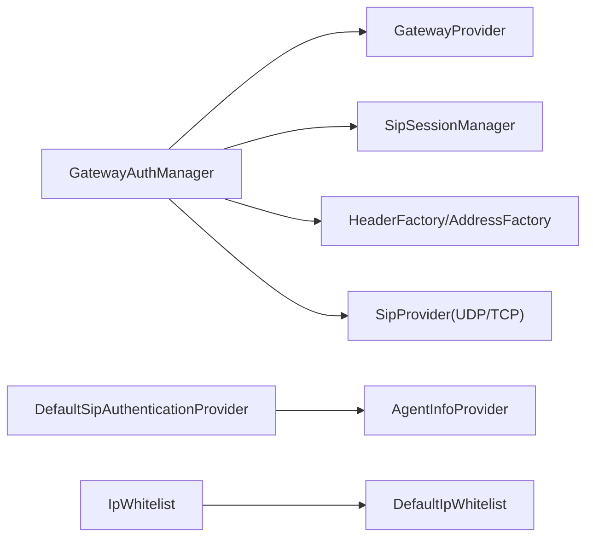
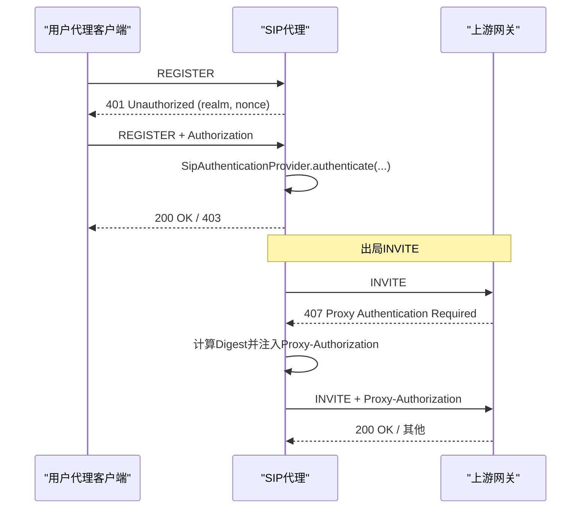

# 认证与安全

<cite>
**本文引用的文件**
- [GatewayAuthManager.java](file://yudao-cloud/yudao-module-cc/ipcc-sipproxy/src/main/java/cn/ipcc/sipproxy/core/auth/GatewayAuthManager.java)
- [SipMethod.java](file://yudao-cloud/yudao-module-cc/ipcc-sipproxy/src/main/java/cn/ipcc/sipproxy/core/annotation/SipMethod.java)
- [SipAuthenticationProvider.java](file://yudao-cloud/yudao-module-cc/ipcc-sipproxy/src/main/java/cn/ipcc/sipproxy/api/authentication/SipAuthenticationProvider.java)
- [DefaultSipAuthenticationProvider.java](file://yudao-cloud/yudao-module-cc/ipcc-sipproxy/src/main/java/cn/ipcc/sipproxy/defaults/authentication/DefaultSipAuthenticationProvider.java)
- [IpWhitelist.java](file://yudao-cloud/yudao-module-cc/ipcc-sipproxy/src/main/java/cn/ipcc/sipproxy/api/security/IpWhitelist.java)
- [DefaultIpWhitelist.java](file://yudao-cloud/yudao-module-cc/ipcc-sipproxy/src/main/java/cn/ipcc/sipproxy/defaults/security/DefaultIpWhitelist.java)
- [GatewayProvider.java](file://yudao-cloud/yudao-module-cc/ipcc-sipproxy/src/main/java/cn/ipcc/sipproxy/api/gateway/GatewayProvider.java)
</cite>

## 目录
1. [简介](#简介)
2. [项目结构](#项目结构)
3. [核心组件](#核心组件)
4. [架构总览](#架构总览)
5. [详细组件分析](#详细组件分析)
6. [依赖关系分析](#依赖关系分析)
7. [性能考虑](#性能考虑)
8. [故障排查指南](#故障排查指南)
9. [结论](#结论)
10. [附录](#附录)

## 简介
本文件面向SIP代理的认证与安全机制，聚焦以下目标：
- 深入解释 GatewayAuthManager 的认证流程与授权策略，覆盖网关访问控制、用户身份验证与权限检查。
- 详细说明 SipMethod 注解的使用方式与安全拦截机制。
- 文档化 SIP 协议中的认证挑战-响应流程，包括 Digest 认证的实现细节（含 qop=auth）。
- 说明如何配置与管理认证规则（白名单、黑名单、动态权限控制）。
- 提供自定义认证逻辑与安全策略的代码示例路径。
- 给出安全最佳实践与常见威胁防护措施。

## 项目结构
围绕认证与安全的关键代码位于 ipcc-sipproxy 模块中，采用“接口+默认实现”的扩展点设计，便于父工程替换或增强能力：
- 认证扩展点：SipAuthenticationProvider 及其默认实现 DefaultSipAuthenticationProvider
- 网关认证管理器：GatewayAuthManager（处理出局INVITE的407挑战与Digest计算）
- 安全扩展点：IpWhitelist 及其默认实现 DefaultIpWhitelist
- 网关查询扩展点：GatewayProvider（用于路由选择与来源识别）
- 方法标记注解：SipMethod（用于声明处理器处理的SIP方法类型）

图表来源
- [GatewayAuthManager.java:26-82](file://yudao-cloud/yudao-module-cc/ipcc-sipproxy/src/main/java/cn/ipcc/sipproxy/core/auth/GatewayAuthManager.java#L26-L82)
- [SipAuthenticationProvider.java:1-44](file://yudao-cloud/yudao-module-cc/ipcc-sipproxy/src/main/java/cn/ipcc/sipproxy/api/authentication/SipAuthenticationProvider.java#L1-L44)
- [DefaultSipAuthenticationProvider.java:1-90](file://yudao-cloud/yudao-module-cc/ipcc-sipproxy/src/main/java/cn/ipcc/sipproxy/defaults/authentication/DefaultSipAuthenticationProvider.java#L1-L90)
- [IpWhitelist.java:1-22](file://yudao-cloud/yudao-module-cc/ipcc-sipproxy/src/main/java/cn/ipcc/sipproxy/api/security/IpWhitelist.java#L1-L22)
- [DefaultIpWhitelist.java:1-28](file://yudao-cloud/yudao-module-cc/ipcc-sipproxy/src/main/java/cn/ipcc/sipproxy/defaults/security/DefaultIpWhitelist.java#L1-L28)
- [GatewayProvider.java:1-42](file://yudao-cloud/yudao-module-cc/ipcc-sipproxy/src/main/java/cn/ipcc/sipproxy/api/gateway/GatewayProvider.java#L1-L42)
- [SipMethod.java:1-25](file://yudao-cloud/yudao-module-cc/ipcc-sipproxy/src/main/java/cn/ipcc/sipproxy/core/annotation/SipMethod.java#L1-L25)

章节来源
- [GatewayAuthManager.java:26-82](file://yudao-cloud/yudao-module-cc/ipcc-sipproxy/src/main/java/cn/ipcc/sipproxy/core/auth/GatewayAuthManager.java#L26-L82)
- [SipAuthenticationProvider.java:1-44](file://yudao-cloud/yudao-module-cc/ipcc-sipproxy/src/main/java/cn/ipcc/sipproxy/api/authentication/SipAuthenticationProvider.java#L1-L44)
- [DefaultSipAuthenticationProvider.java:1-90](file://yudao-cloud/yudao-module-cc/ipcc-sipproxy/src/main/java/cn/ipcc/sipproxy/defaults/authentication/DefaultSipAuthenticationProvider.java#L1-L90)
- [IpWhitelist.java:1-22](file://yudao-cloud/yudao-module-cc/ipcc-sipproxy/src/main/java/cn/ipcc/sipproxy/api/security/IpWhitelist.java#L1-L22)
- [DefaultIpWhitelist.java:1-28](file://yudao-cloud/yudao-module-cc/ipcc-sipproxy/src/main/java/cn/ipcc/sipproxy/defaults/security/DefaultIpWhitelist.java#L1-L28)
- [GatewayProvider.java:1-42](file://yudao-cloud/yudao-module-cc/ipcc-sipproxy/src/main/java/cn/ipcc/sipproxy/api/gateway/GatewayProvider.java#L1-L42)
- [SipMethod.java:1-25](file://yudao-cloud/yudao-module-cc/ipcc-sipproxy/src/main/java/cn/ipcc/sipproxy/core/annotation/SipMethod.java#L1-L25)

## 核心组件
- GatewayAuthManager：负责出局INVITE的预注入策略（当前为不预注入）、407挑战解析、Digest计算（支持无qop与qop=auth）、循环防护与重发。
- SipAuthenticationProvider / DefaultSipAuthenticationProvider：定义并实现SIP端（如REGISTER）的Digest认证扩展点；默认实现通过AgentInfoProvider获取密码并本地计算HA1/HA2/response进行校验。
- IpWhitelist / DefaultIpWhitelist：入站请求的IP白名单校验扩展点；默认实现全部放行，可由父工程替换为数据库或外部服务校验。
- GatewayProvider：提供网关信息查询能力，支撑路由选择与来源识别，以及认证所需的网关凭据读取。
- SipMethod：用于标注处理器所处理的SIP方法类型，便于框架按方法分发与拦截。

章节来源
- [GatewayAuthManager.java:26-82](file://yudao-cloud/yudao-module-cc/ipcc-sipproxy/src/main/java/cn/ipcc/sipproxy/core/auth/GatewayAuthManager.java#L26-L82)
- [SipAuthenticationProvider.java:1-44](file://yudao-cloud/yudao-module-cc/ipcc-sipproxy/src/main/java/cn/ipcc/sipproxy/api/authentication/SipAuthenticationProvider.java#L1-L44)
- [DefaultSipAuthenticationProvider.java:1-90](file://yudao-cloud/yudao-module-cc/ipcc-sipproxy/src/main/java/cn/ipcc/sipproxy/defaults/authentication/DefaultSipAuthenticationProvider.java#L1-L90)
- [IpWhitelist.java:1-22](file://yudao-cloud/yudao-module-cc/ipcc-sipproxy/src/main/java/cn/ipcc/sipproxy/api/security/IpWhitelist.java#L1-L22)
- [DefaultIpWhitelist.java:1-28](file://yudao-cloud/yudao-module-cc/ipcc-sipproxy/src/main/java/cn/ipcc/sipproxy/defaults/security/DefaultIpWhitelist.java#L1-L28)
- [GatewayProvider.java:1-42](file://yudao-cloud/yudao-module-cc/ipcc-sipproxy/src/main/java/cn/ipcc/sipproxy/api/gateway/GatewayProvider.java#L1-L42)
- [SipMethod.java:1-25](file://yudao-cloud/yudao-module-cc/ipcc-sipproxy/src/main/java/cn/ipcc/sipproxy/core/annotation/SipMethod.java#L1-L25)

## 架构总览
下图展示了SIP代理在认证与安全方面的整体交互：入站请求经IP白名单过滤；出站INVITE走GatewayAuthManager的407挑战处理；SIP端认证由SipAuthenticationProvider统一接管；网关信息通过GatewayProvider获取。

图表来源
- [GatewayAuthManager.java:95-239](file://yudao-cloud/yudao-module-cc/ipcc-sipproxy/src/main/java/cn/ipcc/sipproxy/core/auth/GatewayAuthManager.java#L95-L239)
- [SipAuthenticationProvider.java:22-43](file://yudao-cloud/yudao-module-cc/ipcc-sipproxy/src/main/java/cn/ipcc/sipproxy/api/authentication/SipAuthenticationProvider.java#L22-L43)
- [GatewayProvider.java:14-41](file://yudao-cloud/yudao-module-cc/ipcc-sipproxy/src/main/java/cn/ipcc/sipproxy/api/gateway/GatewayProvider.java#L14-L41)

## 详细组件分析

### GatewayAuthManager：网关认证与407挑战处理
- 职责
  - 出局INVITE预注入策略：当前采用“不预注入”，直接发送裸INVITE等待407挑战，避免无效Authorization头造成日志噪音。
  - 407挑战处理：解析Proxy-Authenticate头（realm、nonce、algorithm、qop、stale），校验网关配置（authType=1且具备用户名/密码），重建原始INVITE，计算Digest响应值，注入Proxy-Authorization头，更新CSeq/Via branch后重发。
  - 循环防护：基于authChallengeCount与stale参数限制重试次数（首次407允许重试，stale=true且nonce变化允许二次重试）。
  - Digest算法：支持无qop模式（兼容旧网关）与qop=auth模式（RFC 2617推荐，包含nc、cnonce等）。
- 关键流程
  - 解析挑战参数与stale/qop
  - 校验网关信息与凭据
  - 从Session缓存重建原始INVITE文本并解析
  - 计算Digest响应（区分qop=auth与无qop）
  - 注入Proxy-Authorization头并更新事务标识
  - 根据传输协议选择SipProvider发送
- 复杂度与优化
  - 字符串拼接与MD5哈希开销较低；主要成本在网络往返与消息重建。
  - 建议：对频繁调用的Digest计算可引入轻量缓存（如按realm+username+method+uri键），但需权衡nonce时效性。

图表来源
- [GatewayAuthManager.java:119-239](file://yudao-cloud/yudao-module-cc/ipcc-sipproxy/src/main/java/cn/ipcc/sipproxy/core/auth/GatewayAuthManager.java#L119-L239)
- [GatewayAuthManager.java:242-261](file://yudao-cloud/yudao-module-cc/ipcc-sipproxy/src/main/java/cn/ipcc/sipproxy/core/auth/GatewayAuthManager.java#L242-L261)
- [GatewayAuthManager.java:271-289](file://yudao-cloud/yudao-module-cc/ipcc-sipproxy/src/main/java/cn/ipcc/sipproxy/core/auth/GatewayAuthManager.java#L271-L289)

章节来源
- [GatewayAuthManager.java:95-239](file://yudao-cloud/yudao-module-cc/ipcc-sipproxy/src/main/java/cn/ipcc/sipproxy/core/auth/GatewayAuthManager.java#L95-L239)
- [GatewayAuthManager.java:242-261](file://yudao-cloud/yudao-module-cc/ipcc-sipproxy/src/main/java/cn/ipcc/sipproxy/core/auth/GatewayAuthManager.java#L242-L261)
- [GatewayAuthManager.java:271-289](file://yudao-cloud/yudao-module-cc/ipcc-sipproxy/src/main/java/cn/ipcc/sipproxy/core/auth/GatewayAuthManager.java#L271-L289)

### SipAuthenticationProvider：SIP端认证扩展点
- 作用：当父工程已有完整认证体系时，实现该接口以完全接管Digest认证（如对接RADIUS、LDAP或内部鉴权系统）。
- 调用时机：JAIN SIP发起REGISTER请求，代理返回401挑战后，客户端携带Authorization头再次请求时调用。
- 默认实现：DefaultSipAuthenticationProvider通过AgentInfoProvider获取坐席密码，本地计算HA1/HA2/response并比对。

图表来源
- [SipAuthenticationProvider.java:22-43](file://yudao-cloud/yudao-module-cc/ipcc-sipproxy/src/main/java/cn/ipcc/sipproxy/api/authentication/SipAuthenticationProvider.java#L22-L43)
- [DefaultSipAuthenticationProvider.java:27-88](file://yudao-cloud/yudao-module-cc/ipcc-sipproxy/src/main/java/cn/ipcc/sipproxy/defaults/authentication/DefaultSipAuthenticationProvider.java#L27-L88)

章节来源
- [SipAuthenticationProvider.java:1-44](file://yudao-cloud/yudao-module-cc/ipcc-sipproxy/src/main/java/cn/ipcc/sipproxy/api/authentication/SipAuthenticationProvider.java#L1-L44)
- [DefaultSipAuthenticationProvider.java:1-90](file://yudao-cloud/yudao-module-cc/ipcc-sipproxy/src/main/java/cn/ipcc/sipproxy/defaults/authentication/DefaultSipAuthenticationProvider.java#L1-L90)

### IpWhitelist：入站IP白名单
- 作用：在收到第三方SIP请求时校验来源IP是否在白名单内，不在则拒绝（通常返回403）。
- 默认行为：DefaultIpWhitelist全部放行，适用于内网部署或依赖外部防火墙的场景。
- 扩展方式：父工程实现IpWhitelist并注册为Bean即可覆盖默认行为。

图表来源
- [IpWhitelist.java:12-21](file://yudao-cloud/yudao-module-cc/ipcc-sipproxy/src/main/java/cn/ipcc/sipproxy/api/security/IpWhitelist.java#L12-L21)
- [DefaultIpWhitelist.java:15-26](file://yudao-cloud/yudao-module-cc/ipcc-sipproxy/src/main/java/cn/ipcc/sipproxy/defaults/security/DefaultIpWhitelist.java#L15-L26)

章节来源
- [IpWhitelist.java:1-22](file://yudao-cloud/yudao-module-cc/ipcc-sipproxy/src/main/java/cn/ipcc/sipproxy/api/security/IpWhitelist.java#L1-L22)
- [DefaultIpWhitelist.java:1-28](file://yudao-cloud/yudao-module-cc/ipcc-sipproxy/src/main/java/cn/ipcc/sipproxy/defaults/security/DefaultIpWhitelist.java#L1-L28)

### GatewayProvider：网关查询与凭据管理
- 作用：提供网关信息查询能力，支撑路由选择、来源识别与认证所需凭据读取。
- 典型用法：GatewayAuthManager在407处理时按gatewayId查询GatewayInfo，确认authType与用户名/密码。

章节来源
- [GatewayProvider.java:1-42](file://yudao-cloud/yudao-module-cc/ipcc-sipproxy/src/main/java/cn/ipcc/sipproxy/api/gateway/GatewayProvider.java#L1-L42)

### SipMethod：SIP方法注解与安全拦截
- 作用：用于标记处理器处理的SIP方法类型（如INVITE、REGISTER、OPTIONS），便于框架按方法分发与拦截。
- 使用方式：在处理器类上标注@SipMethod("METHOD")，例如@SipMethod("INVITE")。

章节来源
- [SipMethod.java:1-25](file://yudao-cloud/yudao-module-cc/ipcc-sipproxy/src/main/java/cn/ipcc/sipproxy/core/annotation/SipMethod.java#L1-L25)

## 依赖关系分析
- GatewayAuthManager依赖：
  - GatewayProvider：获取网关信息（authType、用户名、密码）
  - SipSessionManager：维护会话状态（原始INVITE文本、挑战计数、最后一次nonce等）
  - JAIN SIP工厂：HeaderFactory、AddressFactory、SipProvider（UDP/TCP）
- DefaultSipAuthenticationProvider依赖：
  - AgentInfoProvider：获取坐席信息（含密码）
- 安全扩展点解耦：
  - IpWhitelist：入站IP白名单校验，默认放行，可被父工程替换
  - SipAuthenticationProvider：SIP端认证扩展点，默认本地Digest校验，可被父工程替换

图表来源
- [GatewayAuthManager.java:59-82](file://yudao-cloud/yudao-module-cc/ipcc-sipproxy/src/main/java/cn/ipcc/sipproxy/core/auth/GatewayAuthManager.java#L59-L82)
- [DefaultSipAuthenticationProvider.java:29-38](file://yudao-cloud/yudao-module-cc/ipcc-sipproxy/src/main/java/cn/ipcc/sipproxy/defaults/authentication/DefaultSipAuthenticationProvider.java#L29-L38)
- [IpWhitelist.java:12-21](file://yudao-cloud/yudao-module-cc/ipcc-sipproxy/src/main/java/cn/ipcc/sipproxy/api/security/IpWhitelist.java#L12-L21)
- [DefaultIpWhitelist.java:15-26](file://yudao-cloud/yudao-module-cc/ipcc-sipproxy/src/main/java/cn/ipcc/sipproxy/defaults/security/DefaultIpWhitelist.java#L15-L26)

章节来源
- [GatewayAuthManager.java:59-82](file://yudao-cloud/yudao-module-cc/ipcc-sipproxy/src/main/java/cn/ipcc/sipproxy/core/auth/GatewayAuthManager.java#L59-L82)
- [DefaultSipAuthenticationProvider.java:29-38](file://yudao-cloud/yudao-module-cc/ipcc-sipproxy/src/main/java/cn/ipcc/sipproxy/defaults/authentication/DefaultSipAuthenticationProvider.java#L29-L38)
- [IpWhitelist.java:12-21](file://yudao-cloud/yudao-module-cc/ipcc-sipproxy/src/main/java/cn/ipcc/sipproxy/api/security/IpWhitelist.java#L12-L21)
- [DefaultIpWhitelist.java:15-26](file://yudao-cloud/yudao-module-cc/ipcc-sipproxy/src/main/java/cn/ipcc/sipproxy/defaults/security/DefaultIpWhitelist.java#L15-L26)

## 性能考虑
- Digest计算：MD5哈希开销低，但在高并发场景下可考虑按key缓存结果（注意nonce时效性与安全性）。
- 消息重建：从原始INVITE文本重建Request对象会带来一定CPU开销，应确保缓存有效且生命周期合理。
- 网络往返：407挑战-响应会增加一次往返，可通过合理的超时与重试策略降低失败率。
- 传输选择：根据会话信息选择UDP或TCP提供者发送，减少不必要的协议切换。

[本节为通用性能讨论，无需特定文件引用]

## 故障排查指南
- 407挑战处理失败常见原因
  - 缺少Proxy-Authenticate头：检查上游网关是否返回标准407响应。
  - 网关未配置或禁用：确认GatewayInfo存在且authType=1，且用户名/密码非空。
  - 原始INVITE文本为空：检查Session缓存是否正确保存原始INVITE文本。
  - 解析异常：检查SIP消息格式与字符编码。
- 认证失败定位
  - 查看DefaultSipAuthenticationProvider的调试日志，核对extension、domain、password、method、uri、nonce、clientResponse与expectedResponse。
  - 确认qop参数与算法是否与客户端一致。
- IP白名单拦截
  - 若被拒绝，检查IpWhitelist实现是否覆盖了默认放行逻辑，并确认来源IP是否正确。

章节来源
- [GatewayAuthManager.java:119-239](file://yudao-cloud/yudao-module-cc/ipcc-sipproxy/src/main/java/cn/ipcc/sipproxy/core/auth/GatewayAuthManager.java#L119-L239)
- [DefaultSipAuthenticationProvider.java:60-88](file://yudao-cloud/yudao-module-cc/ipcc-sipproxy/src/main/java/cn/ipcc/sipproxy/defaults/authentication/DefaultSipAuthenticationProvider.java#L60-L88)
- [DefaultIpWhitelist.java:15-26](file://yudao-cloud/yudao-module-cc/ipcc-sipproxy/src/main/java/cn/ipcc/sipproxy/defaults/security/DefaultIpWhitelist.java#L15-L26)

## 结论
本方案通过扩展点将认证与安全能力解耦，既满足默认场景的快速接入，又支持父工程深度定制：
- 出局INVITE采用407挑战-响应流程，严格遵循RFC 2617，支持qop=auth增强模式。
- SIP端认证通过SipAuthenticationProvider统一接管，便于对接外部鉴权系统。
- 入站IP白名单可灵活替换，适配不同部署环境的安全策略。
- 通过GatewayProvider集中管理网关信息与凭据，提升可维护性与可扩展性。

[本节为总结性内容，无需特定文件引用]

## 附录

### SIP认证挑战-响应流程（Digest）
- 注册流程（REGISTER）
  - 客户端发起REGISTER，服务器返回401挑战（含realm、nonce）。
  - 客户端计算Digest response并携带Authorization头重新请求。
  - 服务器通过SipAuthenticationProvider校验凭证。
- 出局INVITE流程
  - 代理发送裸INVITE，上游网关返回407挑战。
  - 代理解析挑战并计算Digest，注入Proxy-Authorization头后重发。
  - 上游网关验证通过后返回200 OK或其他响应。

图表来源
- [SipAuthenticationProvider.java:17-43](file://yudao-cloud/yudao-module-cc/ipcc-sipproxy/src/main/java/cn/ipcc/sipproxy/api/authentication/SipAuthenticationProvider.java#L17-L43)
- [GatewayAuthManager.java:119-239](file://yudao-cloud/yudao-module-cc/ipcc-sipproxy/src/main/java/cn/ipcc/sipproxy/core/auth/GatewayAuthManager.java#L119-L239)

### 配置与管理认证规则
- 白名单
  - 默认放行：DefaultIpWhitelist始终返回true。
  - 自定义实现：实现IpWhitelist并注册为Bean，从数据库或外部服务加载IP列表。
- 黑名单
  - 可在IpWhitelist实现中增加黑名单判断逻辑，优先拒绝黑名单IP。
- 动态权限控制
  - 通过GatewayProvider动态查询网关信息与凭据，结合业务规则动态调整authType与访问策略。
  - 在SipAuthenticationProvider中集成外部鉴权系统，实现细粒度权限控制。

章节来源
- [IpWhitelist.java:12-21](file://yudao-cloud/yudao-module-cc/ipcc-sipproxy/src/main/java/cn/ipcc/sipproxy/api/security/IpWhitelist.java#L12-L21)
- [DefaultIpWhitelist.java:15-26](file://yudao-cloud/yudao-module-cc/ipcc-sipproxy/src/main/java/cn/ipcc/sipproxy/defaults/security/DefaultIpWhitelist.java#L15-L26)
- [GatewayProvider.java:14-41](file://yudao-cloud/yudao-module-cc/ipcc-sipproxy/src/main/java/cn/ipcc/sipproxy/api/gateway/GatewayProvider.java#L14-L41)

### 自定义认证逻辑与安全策略示例（代码路径）
- 自定义SIP端认证：参考实现路径
  - [SipAuthenticationProvider.java:22-43](file://yudao-cloud/yudao-module-cc/ipcc-sipproxy/src/main/java/cn/ipcc/sipproxy/api/authentication/SipAuthenticationProvider.java#L22-L43)
  - [DefaultSipAuthenticationProvider.java:60-88](file://yudao-cloud/yudao-module-cc/ipcc-sipproxy/src/main/java/cn/ipcc/sipproxy/defaults/authentication/DefaultSipAuthenticationProvider.java#L60-L88)
- 自定义IP白名单：参考实现路径
  - [IpWhitelist.java:12-21](file://yudao-cloud/yudao-module-cc/ipcc-sipproxy/src/main/java/cn/ipcc/sipproxy/api/security/IpWhitelist.java#L12-L21)
  - [DefaultIpWhitelist.java:15-26](file://yudao-cloud/yudao-module-cc/ipcc-sipproxy/src/main/java/cn/ipcc/sipproxy/defaults/security/DefaultIpWhitelist.java#L15-L26)
- 网关认证与407处理：参考实现路径
  - [GatewayAuthManager.java:95-239](file://yudao-cloud/yudao-module-cc/ipcc-sipproxy/src/main/java/cn/ipcc/sipproxy/core/auth/GatewayAuthManager.java#L95-L239)
  - [GatewayAuthManager.java:242-261](file://yudao-cloud/yudao-module-cc/ipcc-sipproxy/src/main/java/cn/ipcc/sipproxy/core/auth/GatewayAuthManager.java#L242-L261)

### 安全最佳实践与常见威胁防护
- 强制使用TLS/SRTP：保护信令与媒体传输，防止窃听与篡改。
- 限制重试与速率：结合SipRateLimiter与IP白名单，缓解暴力破解与DoS攻击。
- 最小权限原则：仅开放必要的SIP方法与端口，严格管控入站来源。
- 审计与告警：记录认证失败与异常事件，设置阈值告警。
- 密钥管理：妥善保管网关与坐席凭据，避免硬编码与明文存储。
- 版本与算法：优先使用qop=auth与更安全的算法，避免弱加密。

[本节为通用安全建议，无需特定文件引用]