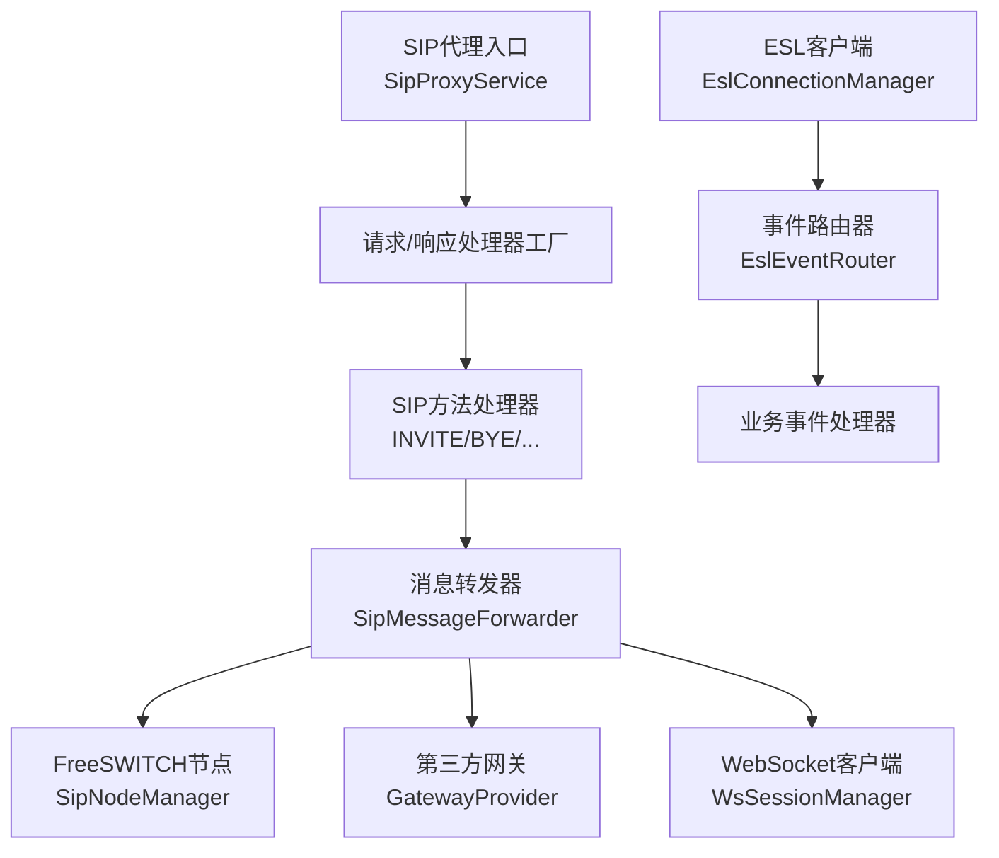
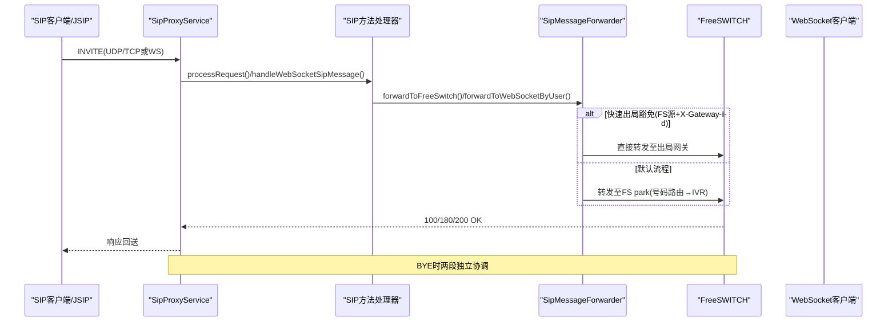
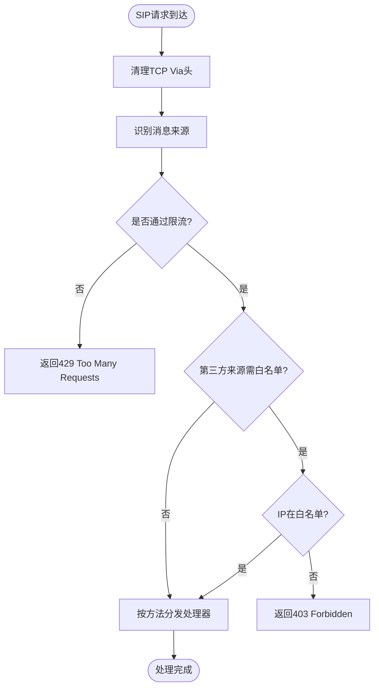
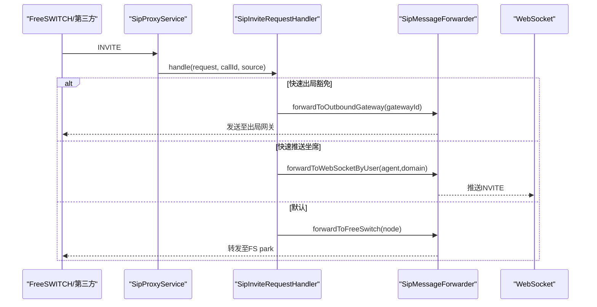
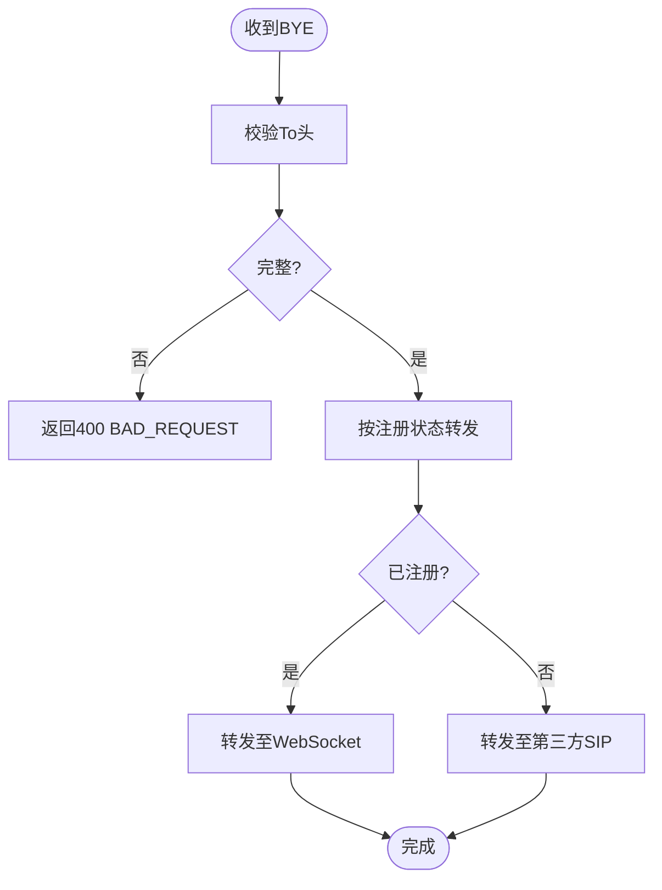
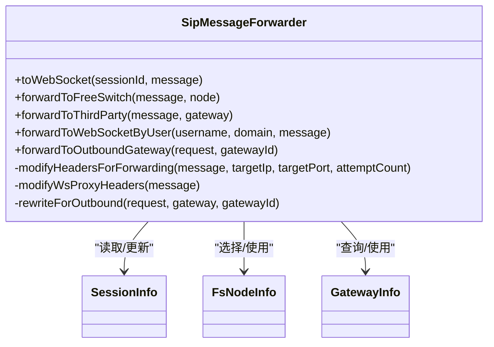
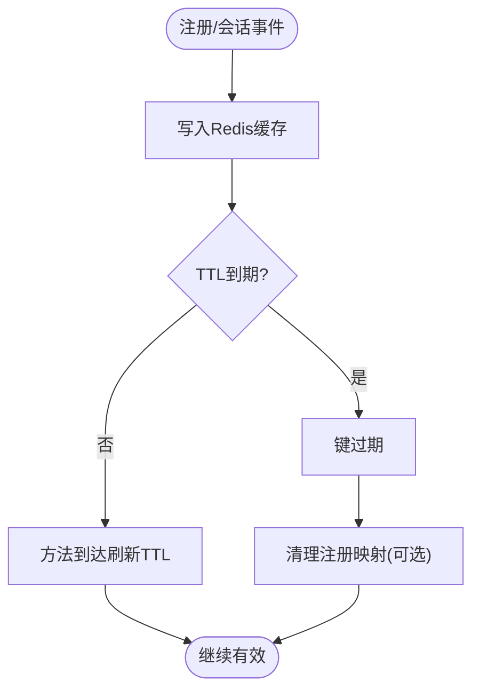
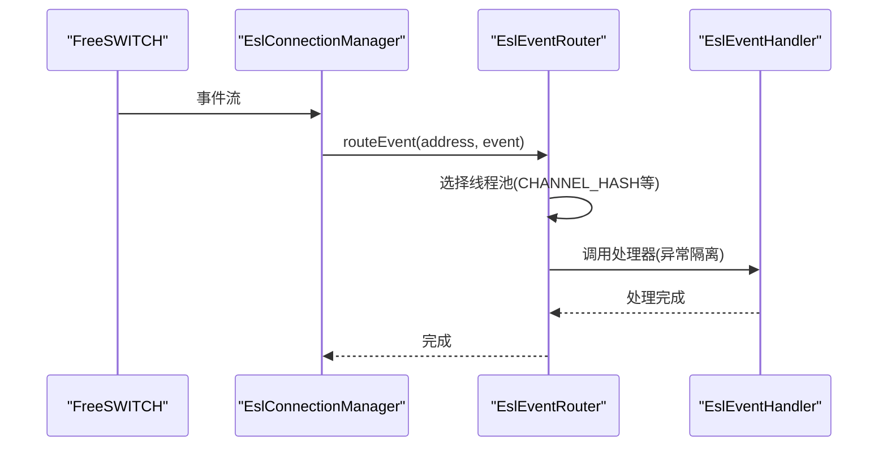
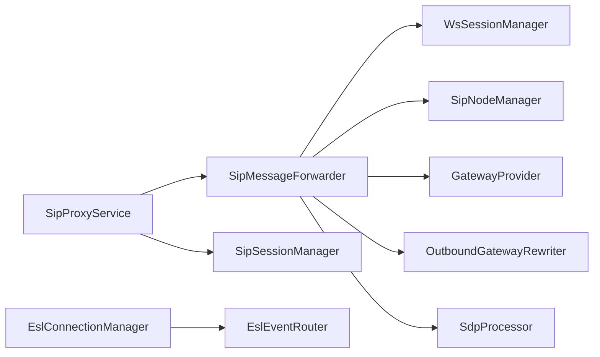

# SIP协议处理

<cite>
**本文引用的文件**
- [SipProxyService.java](file://yudao-cloud/yudao-module-cc/ipcc-sipproxy/src/main/java/cn/ipcc/sipproxy/core/SipProxyService.java)
- [SipInviteRequestHandler.java](file://yudao-cloud/yudao-module-cc/ipcc-sipproxy/src/main/java/cn/ipcc/sipproxy/core/handler/request/sip/SipInviteRequestHandler.java)
- [SipByeRequestHandler.java](file://yudao-cloud/yudao-module-cc/ipcc-sipproxy/src/main/java/cn/ipcc/sipproxy/core/handler/request/sip/SipByeRequestHandler.java)
- [SipMessageForwarder.java](file://yudao-cloud/yudao-module-cc/ipcc-sipproxy/src/main/java/cn/ipcc/sipproxy/core/forwarder/SipMessageForwarder.java)
- [SipSessionManager.java](file://yudao-cloud/yudao-module-cc/ipcc-sipproxy/src/main/java/cn/ipcc/sipproxy/core/session/SipSessionManager.java)
- [EslConnectionManager.java](file://yudao-cloud/yudao-module-cc/ipcc-fs-esl/src/main/java/cn/ipcc/fs/esl/EslConnectionManager.java)
- [EslEventRouter.java](file://yudao-cloud/yudao-module-cc/ipcc-fs-esl/src/main/java/cn/ipcc/fs/esl/router/EslEventRouter.java)
- [README.md（sipproxy）](file://yudao-cloud/yudao-module-cc/ipcc-sipproxy/README.md)
- [README.md（fs-esl）](file://yudao-cloud/yudao-module-cc/ipcc-fs-esl/README.md)
</cite>

## 目录
1. [简介](#简介)
2. [项目结构](#项目结构)
3. [核心组件](#核心组件)
4. [架构总览](#架构总览)
5. [详细组件分析](#详细组件分析)
6. [依赖关系分析](#依赖关系分析)
7. [性能与优化](#性能与优化)
8. [故障排除指南](#故障排除指南)
9. [结论](#结论)
10. [附录：使用模式与示例路径](#附录使用模式与示例路径)

## 简介
本模块提供面向呼叫中心/IPPBX场景的SIP代理服务（B2BUA），实现SIP消息处理、会话管理、节点路由，以及与FreeSWITCH的ESL事件集成。核心职责包括：
- SIP代理：INVITE/BYE/REGISTER/OPTIONS等方法的请求/响应处理
- 会话管理：基于Redis的Call-ID到会话状态映射，注册信息缓存与清理
- 节点路由：FS节点选择、第三方网关节点选择、WebSocket目标选择
- ESL集成：连接管理、事件路由、分布式监听权协调
- 协议栈：JAIN-SIP UDP/TCP双栈 + WebSocket（RFC 7118 sip子协议）

## 项目结构
- ipcc-sipproxy：SIP代理核心（入口服务、处理器工厂、转发器、会话/节点管理、WebSocket接入、集群广播、扩展点API）
- ipcc-fs-esl：FreeSWITCH ESL客户端（Netty传输、连接管理、事件路由、分布式协调、指标与拦截器）

图表来源
- [SipProxyService.java:112-185](file://yudao-cloud/yudao-module-cc/ipcc-sipproxy/src/main/java/cn/ipcc/sipproxy/core/SipProxyService.java#L112-L185)
- [SipMessageForwarder.java:110-155](file://yudao-cloud/yudao-module-cc/ipcc-sipproxy/src/main/java/cn/ipcc/sipproxy/core/forwarder/SipMessageForwarder.java#L110-L155)
- [EslConnectionManager.java:42-68](file://yudao-cloud/yudao-module-cc/ipcc-fs-esl/src/main/java/cn/ipcc/fs/esl/EslConnectionManager.java#L42-L68)
- [EslEventRouter.java:43-74](file://yudao-cloud/yudao-module-cc/ipcc-fs-esl/src/main/java/cn/ipcc/fs/esl/router/EslEventRouter.java#L43-L74)

章节来源
- [README.md（sipproxy）:72-127](file://yudao-cloud/yudao-module-cc/ipcc-sipproxy/README.md#L72-L127)
- [README.md（fs-esl）:50-98](file://yudao-cloud/yudao-module-cc/ipcc-fs-esl/README.md#L50-L98)

## 核心组件
- SipProxyService：JAIN-SIP协议栈初始化、UDP/TCP监听、WS SIP消息入口、事务/对话生命周期回调
- 处理器层：按SIP方法分发的请求处理器（INVITE/BYE/REGISTER/OPTIONS等）与统一响应处理器
- SipMessageForwarder：消息头改写、SDP处理、故障转移、出站网关重写、WebSocket代理
- SipSessionManager：会话信息与注册信息的Redis缓存、TTL刷新与清理
- EslConnectionManager：多FS节点连接管理、自动重连、健康检查、命令发送
- EslEventRouter：注解驱动的事件路由、拦截器链、线程模型与顺序保障

章节来源
- [SipProxyService.java:112-185](file://yudao-cloud/yudao-module-cc/ipcc-sipproxy/src/main/java/cn/ipcc/sipproxy/core/SipProxyService.java#L112-L185)
- [SipMessageForwarder.java:262-358](file://yudao-cloud/yudao-module-cc/ipcc-sipproxy/src/main/java/cn/ipcc/sipproxy/core/forwarder/SipMessageForwarder.java#L262-L358)
- [SipSessionManager.java:35-72](file://yudao-cloud/yudao-module-cc/ipcc-sipproxy/src/main/java/cn/ipcc/sipproxy/core/session/SipSessionManager.java#L35-L72)
- [EslConnectionManager.java:42-68](file://yudao-cloud/yudao-module-cc/ipcc-fs-esl/src/main/java/cn/ipcc/fs/esl/EslConnectionManager.java#L42-L68)
- [EslEventRouter.java:90-153](file://yudao-cloud/yudao-module-cc/ipcc-fs-esl/src/main/java/cn/ipcc/fs/esl/router/EslEventRouter.java#L90-L153)

## 架构总览
SIP代理采用五层架构：入口层 → 工厂层 → 处理器层 → 转发层 → 节点/会话管理层；辅以WebSocket接入层、集群广播层、扩展点API层。ESL侧为传输层+连接层+事件路由层+协调层。

图表来源
- [SipProxyService.java:344-387](file://yudao-cloud/yudao-module-cc/ipcc-sipproxy/src/main/java/cn/ipcc/sipproxy/core/SipProxyService.java#L344-L387)
- [SipInviteRequestHandler.java:71-153](file://yudao-cloud/yudao-module-cc/ipcc-sipproxy/src/main/java/cn/ipcc/sipproxy/core/handler/request/sip/SipInviteRequestHandler.java#L71-L153)
- [SipMessageForwarder.java:110-155](file://yudao-cloud/yudao-module-cc/ipcc-sipproxy/src/main/java/cn/ipcc/sipproxy/core/forwarder/SipMessageForwarder.java#L110-L155)

## 详细组件分析

### SIP代理入口与服务生命周期
- 启动：创建SipStack、UDP/TCP ListeningPoint并注册SipListener；注入MessageFactory/HeaderFactory/AddressFactory
- 请求入口：processRequest()完成TCP Via清理、来源识别、限流/白名单校验、方法分发
- 响应入口：processResponse()统一交由响应处理器工厂处理
- 生命周期：processTimeout/processIOException/processTransactionTerminated/processDialogTerminated记录关键事件

图表来源
- [SipProxyService.java:224-256](file://yudao-cloud/yudao-module-cc/ipcc-sipproxy/src/main/java/cn/ipcc/sipproxy/core/SipProxyService.java#L224-L256)
- [SipProxyService.java:344-387](file://yudao-cloud/yudao-module-cc/ipcc-sipproxy/src/main/java/cn/ipcc/sipproxy/core/SipProxyService.java#L344-L387)

章节来源
- [SipProxyService.java:112-185](file://yudao-cloud/yudao-module-cc/ipcc-sipproxy/src/main/java/cn/ipcc/sipproxy/core/SipProxyService.java#L112-L185)
- [SipProxyService.java:344-494](file://yudao-cloud/yudao-module-cc/ipcc-sipproxy/src/main/java/cn/ipcc/sipproxy/core/SipProxyService.java#L344-L494)

### INVITE请求处理（FS/第三方入局）
- 提取To/From/X-Gateway-Id，建立/更新SessionInfo（callType、transport、FS节点、第三方节点）
- 豁免快速出局：FS源且携带X-Gateway-Id时直接转发至出局网关
- 快速推送到JsSIP坐席：FS源未携带X-Gateway-Id且被叫为已注册坐席时，直接转发至WebSocket
- 默认：转发至FS park走号码路由与IVR流程

图表来源
- [SipInviteRequestHandler.java:71-233](file://yudao-cloud/yudao-module-cc/ipcc-sipproxy/src/main/java/cn/ipcc/sipproxy/core/handler/request/sip/SipInviteRequestHandler.java#L71-L233)
- [SipMessageForwarder.java:558-611](file://yudao-cloud/yudao-module-cc/ipcc-sipproxy/src/main/java/cn/ipcc/sipproxy/core/forwarder/SipMessageForwarder.java#L558-L611)

章节来源
- [SipInviteRequestHandler.java:71-293](file://yudao-cloud/yudao-module-cc/ipcc-sipproxy/src/main/java/cn/ipcc/sipproxy/core/handler/request/sip/SipInviteRequestHandler.java#L71-L293)

### BYE请求处理（挂断协调）
- 校验To头完整性，按被叫注册状态转发：已注册→WebSocket，未注册→第三方SIP
- B2BUA两段BYE独立协调：本处理器负责“FS→坐席”段，“坐席→FS”段由WS侧处理器处理

图表来源
- [SipByeRequestHandler.java:54-72](file://yudao-cloud/yudao-module-cc/ipcc-sipproxy/src/main/java/cn/ipcc/sipproxy/core/handler/request/sip/SipByeRequestHandler.java#L54-L72)

章节来源
- [SipByeRequestHandler.java:1-74](file://yudao-cloud/yudao-module-cc/ipcc-sipproxy/src/main/java/cn/ipcc/sipproxy/core/handler/request/sip/SipByeRequestHandler.java#L1-L74)

### 消息转发与头域改写
- modifyHeadersForForwarding：替换Contact/Via、修改Request-URI、保留X-Gateway-Id、透传SDP处理
- modifyWsProxyHeaders：WebSocket代理头改写、Request-URI修正（去除&域名）、SDP媒体地址替换（内网→公网）
- 故障转移：forwardToFreeSwitch在失败时循环尝试备用FS节点
- 出站网关重写：委托OutboundGatewayRewriter进行From/PAI/Record-Route等改写

图表来源
- [SipMessageForwarder.java:110-155](file://yudao-cloud/yudao-module-cc/ipcc-sipproxy/src/main/java/cn/ipcc/sipproxy/core/forwarder/SipMessageForwarder.java#L110-L155)
- [SipMessageForwarder.java:262-358](file://yudao-cloud/yudao-module-cc/ipcc-sipproxy/src/main/java/cn/ipcc/sipproxy/core/forwarder/SipMessageForwarder.java#L262-L358)
- [SipMessageForwarder.java:391-474](file://yudao-cloud/yudao-module-cc/ipcc-sipproxy/src/main/java/cn/ipcc/sipproxy/core/forwarder/SipMessageForwarder.java#L391-L474)
- [SipMessageForwarder.java:558-629](file://yudao-cloud/yudao-module-cc/ipcc-sipproxy/src/main/java/cn/ipcc/sipproxy/core/forwarder/SipMessageForwarder.java#L558-L629)

章节来源
- [SipMessageForwarder.java:110-642](file://yudao-cloud/yudao-module-cc/ipcc-sipproxy/src/main/java/cn/ipcc/sipproxy/core/forwarder/SipMessageForwarder.java#L110-L642)

### 会话管理与注册信息
- 会话信息：以Call-ID为Key缓存SessionInfo，TTL=120s，会话内方法到达时刷新
- 注册信息：双向映射sessionId↔username:domain，TTL=3600s
- 清理：WebSocket关闭时清理注册映射，避免残留

图表来源
- [SipSessionManager.java:35-72](file://yudao-cloud/yudao-module-cc/ipcc-sipproxy/src/main/java/cn/ipcc/sipproxy/core/session/SipSessionManager.java#L35-L72)
- [SipSessionManager.java:91-137](file://yudao-cloud/yudao-module-cc/ipcc-sipproxy/src/main/java/cn/ipcc/sipproxy/core/session/SipSessionManager.java#L91-L137)

章节来源
- [SipSessionManager.java:35-154](file://yudao-cloud/yudao-module-cc/ipcc-sipproxy/core/session/SipSessionManager.java#L35-L154)

### ESL事件处理与连接管理
- 连接管理：EslConnectionManager维护多节点连接，支持自动重连、健康检查、批量bgapi命令
- 事件路由：EslEventRouter按事件名分发，支持CHANNEL_HASH/SINGLE_THREAD/FULL_CONCURRENT三种执行策略，保证同通道事件顺序
- 拦截器链：beforeHandle/afterHandle确保ThreadLocal上下文透传与资源清理

图表来源
- [EslConnectionManager.java:42-68](file://yudao-cloud/yudao-module-cc/ipcc-fs-esl/src/main/java/cn/ipcc/fs/esl/EslConnectionManager.java#L42-L68)
- [EslEventRouter.java:90-153](file://yudao-cloud/yudao-module-cc/ipcc-fs-esl/src/main/java/cn/ipcc/fs/esl/router/EslEventRouter.java#L90-L153)

章节来源
- [EslConnectionManager.java:42-254](file://yudao-cloud/yudao-module-cc/ipcc-fs-esl/src/main/java/cn/ipcc/fs/esl/EslConnectionManager.java#L42-L254)
- [EslEventRouter.java:43-201](file://yudao-cloud/yudao-module-cc/ipcc-fs-esl/src/main/java/cn/ipcc/fs/esl/router/EslEventRouter.java#L43-L201)

## 依赖关系分析
- SipProxyService依赖：SipSessionManager、SipMessageForwarder、处理器工厂、认证管理器、消息来源识别、限流/白名单
- SipMessageForwarder依赖：SipSessionManager、WsSessionManager、SipNodeManager、GatewayProvider、OutboundGatewayRewriter、SdpProcessor
- ESL模块依赖：EslConnectionManager管理多个EslConnection，EslEventRouter负责事件分发与拦截器链

图表来源
- [SipProxyService.java:58-86](file://yudao-cloud/yudao-module-cc/ipcc-sipproxy/src/main/java/cn/ipcc/sipproxy/core/SipProxyService.java#L58-L86)
- [SipMessageForwarder.java:51-74](file://yudao-cloud/yudao-module-cc/ipcc-sipproxy/src/main/java/cn/ipcc/sipproxy/core/forwarder/SipMessageForwarder.java#L51-L74)
- [EslConnectionManager.java:33-37](file://yudao-cloud/yudao-module-cc/ipcc-fs-esl/src/main/java/cn/ipcc/fs/esl/EslConnectionManager.java#L33-L37)
- [EslEventRouter.java:35-41](file://yudao-cloud/yudao-module-cc/ipcc-fs-esl/src/main/java/cn/ipcc/fs/esl/router/EslEventRouter.java#L35-L41)

章节来源
- [SipProxyService.java:58-86](file://yudao-cloud/yudao-module-cc/ipcc-sipproxy/src/main/java/cn/ipcc/sipproxy/core/SipProxyService.java#L58-L86)
- [SipMessageForwarder.java:51-74](file://yudao-cloud/yudao-module-cc/ipcc-sipproxy/src/main/java/cn/ipcc/sipproxy/core/forwarder/SipMessageForwarder.java#L51-L74)
- [EslConnectionManager.java:33-37](file://yudao-cloud/yudao-module-cc/ipcc-fs-esl/src/main/java/cn/ipcc/fs/esl/EslConnectionManager.java#L33-L37)
- [EslEventRouter.java:35-41](file://yudao-cloud/yudao-module-cc/ipcc-fs-esl/src/main/java/cn/ipcc/fs/esl/router/EslEventRouter.java#L35-L41)

## 性能与优化
- 事件路由线程模型：CHANNEL_HASH按Unique-ID哈希到固定单线程池，保证同通道事件顺序；BACKGROUND_JOB独立线程池避免阻塞
- 连接健康检查与自动重连：指数退避、连续失败阈值触发重连，防止假死连接影响吞吐
- SIP头域与SDP处理：仅在必要时改写Contact/Via/Request-URI；SDP中仅替换c=行与a=candidate的连接地址，减少正则开销
- 故障转移：FS节点失败时循环尝试备用节点，提升可用性
- 限流与白名单：SIP速率限制与第三方来源IP白名单，降低滥用风险

章节来源
- [EslEventRouter.java:43-74](file://yudao-cloud/yudao-module-cc/ipcc-fs-esl/src/main/java/cn/ipcc/fs/esl/router/EslEventRouter.java#L43-L74)
- [EslEventRouter.java:155-186](file://yudao-cloud/yudao-module-cc/ipcc-fs-esl/src/main/java/cn/ipcc/fs/esl/router/EslEventRouter.java#L155-L186)
- [SipMessageForwarder.java:363-389](file://yudao-cloud/yudao-module-cc/ipcc-sipproxy/src/main/java/cn/ipcc/sipproxy/core/forwarder/SipMessageForwarder.java#L363-L389)
- [SipMessageForwarder.java:110-155](file://yudao-cloud/yudao-module-cc/ipcc-sipproxy/src/main/java/cn/ipcc/sipproxy/core/forwarder/SipMessageForwarder.java#L110-L155)

## 故障排除指南
- 403/429错误：检查第三方来源IP是否在白名单、SIP速率限制是否触发
- 转发失败：确认FS节点可用性与SIP端口连通性；查看日志中的故障转移尝试次数
- WebSocket无响应：检查WebSocket会话是否存在、注册映射是否清理、僵尸会话清理是否启用
- SDP协商失败：检查ICE候选是否完整、媒体地址是否替换为公网IP
- ESL事件丢失：确认事件路由线程池配置、队列容量与拒绝策略；检查BACKGROUND_JOB是否独立线程池

章节来源
- [SipProxyService.java:398-413](file://yudao-cloud/yudao-module-cc/ipcc-sipproxy/src/main/java/cn/ipcc/sipproxy/core/SipProxyService.java#L398-L413)
- [SipMessageForwarder.java:140-154](file://yudao-cloud/yudao-module-cc/ipcc-sipproxy/src/main/java/cn/ipcc/sipproxy/core/forwarder/SipMessageForwarder.java#L140-L154)
- [SipSessionManager.java:119-137](file://yudao-cloud/yudao-module-cc/ipcc-sipproxy/src/main/java/cn/ipcc/sipproxy/core/session/SipSessionManager.java#L119-L137)
- [EslEventRouter.java:176-186](file://yudao-cloud/yudao-module-cc/ipcc-fs-esl/src/main/java/cn/ipcc/fs/esl/router/EslEventRouter.java#L176-L186)

## 结论
本模块通过SIP代理与ESL客户端的组合，实现了高可用的B2BUA信令处理与呼叫控制。核心优势包括：
- 清晰的五层架构与扩展点机制，便于定制与复用
- 健壮的会话与注册状态管理，基于Redis持久化与TTL刷新
- 灵活的节点路由与故障转移，提升系统可用性
- 高效的ESL事件路由与连接管理，支持分布式协调与可观测性

## 附录：使用模式与示例路径
- 最小集成：引入依赖后通过AutoConfiguration自动装配，无需额外注解
- 全自定义：实现13个扩展点接口覆盖默认行为（如认证、网关查询、SDP处理等）
- 前端测试：example-jssip提供Vue3+JsSIP软电话测试页，验证注册与呼叫流程
- 自动化测试：Playwright端到端注册测试，覆盖多轮次稳定性验证

章节来源
- [README.md（sipproxy）:129-181](file://yudao-cloud/yudao-module-cc/ipcc-sipproxy/README.md#L129-L181)
- [README.md（sipproxy）:248-300](file://yudao-cloud/yudao-module-cc/ipcc-sipproxy/README.md#L248-L300)
- [README.md（fs-esl）:102-151](file://yudao-cloud/yudao-module-cc/ipcc-fs-esl/README.md#L102-L151)